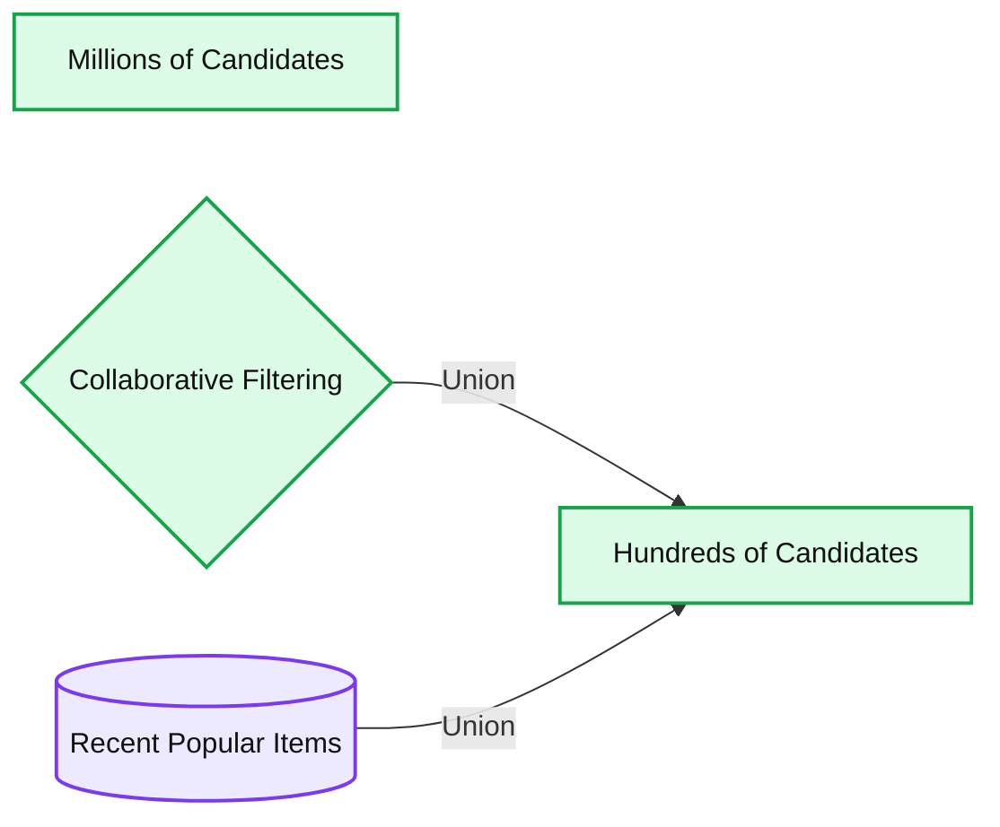
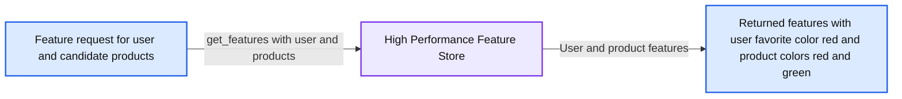
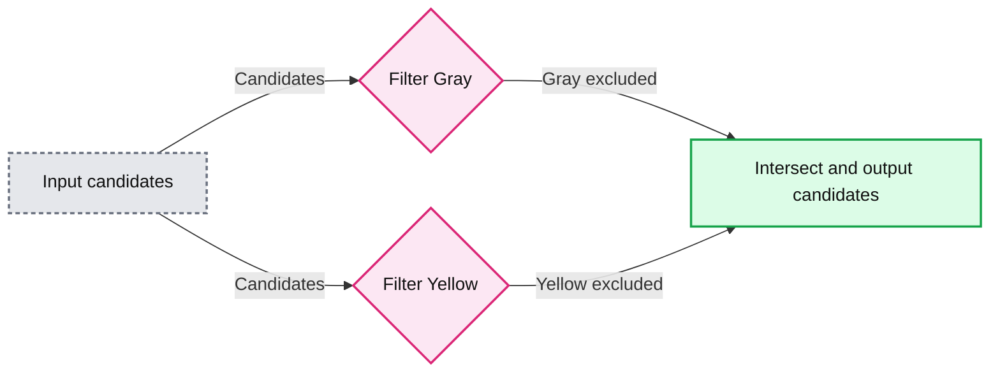
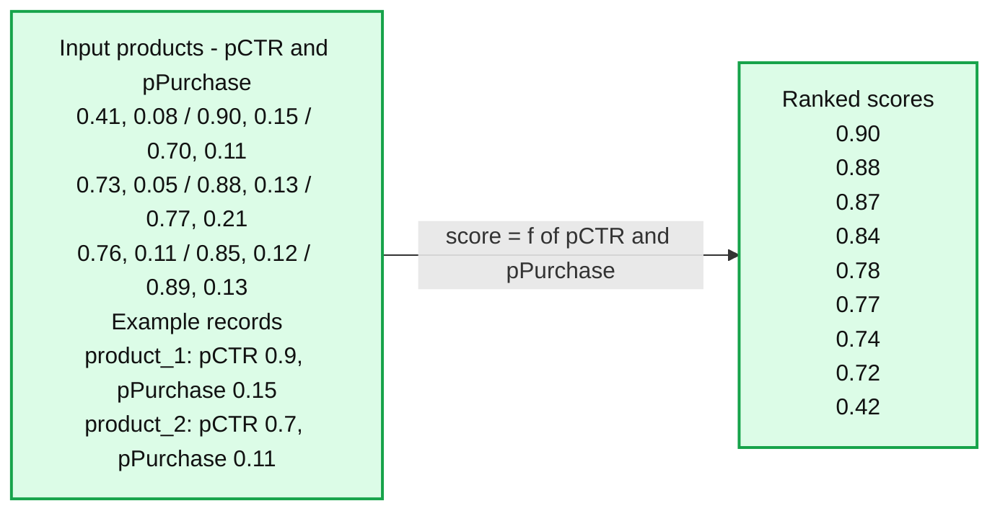
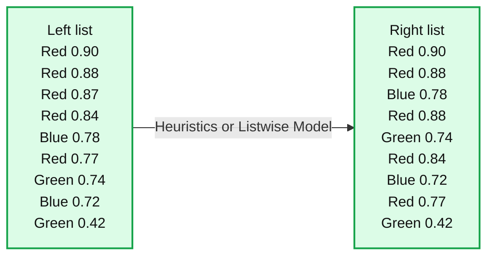

# A Practical Guide to Building an Online Recommendation System

- Source: https://www.databricks.com/blog/guide-to-building-online-recommendation-system
- Published: 2025-10-27
- Authors: Jake Noble
- Categories: data-science-machine-learning
- Images: 7 total, 7 extracted as architecture

*This blog was originally published by *[*Tecton.ai*](http://tecton.ai/)*, which was *[*acquired*](https://www.databricks.com/blog/tecton-joining-databricks-power-real-time-data-personalized-ai-agents)* by Databricks in August of 2025. Since the acquisition, Databricks Feature Store released *[*Declarative Feature API*](https://docs.databricks.com/aws/en/machine-learning/feature-store/declarative-apis)*s, a powerful abstraction for feature experimentation which automates the creation of managed feature pipelines for both batch and streaming data.*

---

Have you ever wondered how TikTok can recommend videos to you that were uploaded minutes ago? Or how YouTube can pick up on your brand-new interest immediately after you watched one video about it? Or how Amazon can recommend products based on what you currently have in your shopping cart?

The answer is **online recommendation systems (or recommender systems or recsys).** These systems can generate recommendations for users based on real-time contextual information, such as the latest item catalog, user behaviors, and session context. If you’re interested in building an online recommendation system or trying to take your existing system to the next level, then this blog post is for you.

I worked as a tech lead on the YouTube Homepage Recommendations team from 2018 to 2021, focusing on long-term user satisfaction metrics. While at YouTube, I learned from some of the best minds in the business, who had been building and refining the world’s largest recommendation engine for close to a decade. Since 2021, I’ve been with Tecton and have worked with many smaller companies building and refining their search and recommendation systems.

In this blog post, I will give an overview of online recommendation systems, the various approaches for building different subcomponents, and offer some guidance to help you reduce costs, manage complexity, and enable your team to ship ideas.

## Overview

While online recommendation systems can vary substantially, they are all generally composed of the same high-level components. Those are:

- Candidate generation
- Feature retrieval
- Filtering
- Model inference
- Pointwise scoring and ranking
- Listwise ranking

**Summary:** The recommendation pipeline reduces millions of candidates to hundreds, retrieves features, filters candidates, runs model inference, and applies pointwise and listwise ranking.

**Components:**
- Millions of Candidates: initial candidate pool; technology unspecified.
- Candidate Generation: narrows the candidate pool; technology unspecified.
- Hundreds of Candidates: reduced candidate pool; technology unspecified.
- Feature Retrieval: enriches candidates with features; technology unspecified.
- Filtering: removes candidates; technology unspecified.
- Model Inference: produces numeric outputs for candidates; technology unspecified.
- Pointwise Scoring and Ranking: scores and orders individual candidates; technology unspecified.
- Listwise Ranking: reorders the ranked list; technology unspecified.

**Flows:**
- Millions of Candidates -> Hundreds of Candidates: candidate generation.
- Hundreds of Candidates -> Featured candidates: feature retrieval.
- Featured candidates -> Filtered candidates: filtering.
- Filtered candidates -> Model outputs: model inference.
- Model outputs -> Pointwise ranked candidates: pointwise scoring and ranking.
- Pointwise ranked candidates -> Listwise ranked candidates: listwise ranking.

**Numbers:**
- Candidate pool sizes: Millions of Candidates; Hundreds of Candidates.
- Model output pairs, left to right: 0.41, 0.08; 0.90, 0.15; 0.70, 0.11; 0.73, 0.05; 0.88, 0.13; 0.77, 0.21; 0.76, 0.11; 0.85, 0.12; 0.89, 0.13.
- Pointwise ranking, top to bottom: 0.90, 0.88, 0.87, 0.84, 0.78, 0.77, 0.74, 0.72, 0.42.
- Listwise ranking, top to bottom: 0.90, 0.88, 0.78, 0.88, 0.74, 0.84, 0.72, 0.77, 0.42.

source image: https://www.databricks.com/sites/default/files/inline-images/practical-guide-building-online-recommendation-system-blog-img-1.png

## Candidate generation

**Summary:** Collaborative filtering and recent popular items are combined by union to produce hundreds of candidates, with millions of candidates shown as the initial pool.

**Components:**
- Millions of Candidates: candidate pool; technology unspecified.
- Collaborative Filtering: candidate selection method; technology unspecified.
- Recent Popular Items: item source shown as a cylinder; technology unspecified.
- Union: combines candidate selections; technology unspecified.
- Hundreds of Candidates: resulting candidate pool; technology unspecified.

**Flows:**
- Collaborative Filtering -> Hundreds of Candidates: selected candidates combined by union.
- Recent Popular Items -> Hundreds of Candidates: popular items combined by union.

**Numbers:** Millions of candidates; hundreds of candidates. No exact counts are shown.

source image: https://www.databricks.com/sites/default/files/inline-images/practical-guide-building-online-recommendation-system-blog-img-2.png

Candidate generation is responsible for quickly and cheaply narrowing the set of possible candidates down to a small enough set that can be ranked. For example, narrowing a billion possible YouTube videos down to ~hundreds based on a user’s subscriptions and recent interests. A good candidate generation system produces a relatively small number of diverse, high-quality candidates for the rest of the system.

There are many different options that can make effective candidate generators:

- Query your existing operational database
  - E.g., query Postgres for a user’s recently purchased items.
- Create a dedicated “candidate database” in a key-value store.
  - E.g., use Redis sorted sets to track popular items in a given locale, or
  - run a daily batch job to generate a list of 500 candidates for every user and load those candidates into DynamoDB.
- Vector/Embedding similarity-based approaches
  - Many different ML approaches that can learn “[embeddings](https://www.tecton.ai/blog/put-hugging-face-embeddings-into-production-with-tecton/)” for users and items. These approaches can be combined with vector search technologies like [Faiss](https://github.com/facebookresearch/faiss), [Annoy](https://github.com/spotify/annoy), [Milvus](https://github.com/milvus-io/milvus), and Elasticsearch to scale to online serving.
  - See this [blog post](https://biarnes-adrien.medium.com/building-a-multi-stage-recommendation-system-part-1-1-95961ccf3dd8) for an excellent discussion on the state of the art using approximate nearest neighbor search in conjunction with a two-tower deep neural network.
  - Collaborative Filtering/Matrix Factorization also falls into this category. For lower scale or less mature systems, a basic collaborative filtering model may also be used directly in production.

Every approach will have its pros and cons with respect to complexity, freshness, candidate diversity, candidate quality, and cost. A good practice is to use a combination of approaches and then “union” the results in the online system. For example, collaborative filtering models can be used to generate high-quality candidates for learned users and items, but collaborative filtering models suffer from the [cold-start problem](https://en.wikipedia.org/wiki/Cold_start_(recommender_systems)). Your system could supplement a collaborative filtering model with recently added, popular items fetched from an operational database.

## Feature retrieval

**Summary:** A high performance feature store retrieves user and product features for a supplied user and candidate products.

**Components:**
- `get_features(user, [product_1, product_2, ...])`: feature retrieval request; technology unspecified.
- High Performance Feature Store: feature storage and retrieval; technology unspecified.
- Returned features: user `favorite_color: red`, `product_1` `color: red`, and `product_2` `color: green`; technology unspecified.

**Flows:**
- Feature retrieval request -> High Performance Feature Store: user and candidate product identifiers.
- High Performance Feature Store -> Returned features: user and product feature values.

**Numbers:** `1` and `2` appear as product identifier suffixes in the request and response. No measurements or units are shown.

source image: https://www.databricks.com/sites/default/files/inline-images/practical-guide-building-online-recommendation-system-blog-img-3.png

At one or more points, the recommendation system will need to look up or compute data/features for the user and the candidates being considered. This data will fall into three categories:

- Item features
  - E.g., `product_category=clothing or average_review_rating_past_24h=4.21`
- User features
  - E.g., `user_favorite_product_categories=[clothing, sporting_goods] or user_site_spend_past_month=408.10`
- User-Item cross features
  - E.g., `user_has_bought_this_product_before=False` or `product_is_in_user_favorite_categories=True`
  - Cross features like these can be very helpful with model performance without requiring the model to spend capacity to learn these relationships.

Your system does not necessarily need to use a purpose-built “feature store” for feature retrieval, but the data service needs to handle the following:

- **Extremely high scale and performance**
  - Due to the user-to-item fanout, this service may receive 100-1000x the QPS of your recommendations service, and long-tail latency will heavily impact your overall system performance.
  - Fortunately, in most recsys cases, query volume and cost can be significantly reduced at the expense of data freshness by caching item features. Item features (as opposed to user features) are usually well suited to caching because of their lower cardinality and looser freshness requirements. (It’s probably not an issue if your `product_average_review_rating` feature is a minute or two stale.) Feature caching may be done at multiple levels; e.g., a first-level, in-process cache and a second-level, out-of-process cache like Redis.
- **Online-offline parity**
  - Feature data fetched online must be consistent with the feature data that ranking models were trained with. For example, if the feature `user_site_spend_past_month` is pre-tax during offline training and post-tax during online inference, you may get inaccurate online model predictions.
- **Feature and data engineering capabilities**
  - Your chosen data service should support serving the kinds of features and data that your models and heuristics require. For example, time-windowed aggregates (e.g., `product_average_review_rating_past_24h` or `user_recent_purchase_ids`) are a popular and powerful class of features, and your data service should have a scalable approach to building and serving them.
- If your data service does not support these classes of features, then contributors will look for escape hatches, which may degrade system complexity, reliability, or performance.

## Filtering

**Summary:** Candidates pass through parallel gray and yellow exclusion filters, and the intersection retains red, green, and blue candidates.

**Components:**
- Input candidates: colored circles; no technology specified.
- Filter Gray: removes gray candidates; no technology specified.
- Filter Yellow: removes yellow candidates; no technology specified.
- Intersect: combines the filter results into the output candidates; no technology specified.

**Flows:**
- Input candidates -> Filter Gray: candidates to filter.
- Input candidates -> Filter Yellow: candidates to filter.
- Filter Gray -> Intersect: candidates remaining after gray exclusion.
- Filter Yellow -> Intersect: candidates remaining after yellow exclusion.

**Numbers:** none

source image: https://www.databricks.com/sites/default/files/inline-images/practical-guide-building-online-recommendation-system-blog-img-4.png

Filtering is the process of removing candidates based on fetched data or model predictions. Filters primarily act as system guardrails for bad user experience. They fall into the following categories:

- Item data filters:
  - E.g., an `item_out_of_stock_filter` that filters out-of-stock products.
- User-Item data filters:
  - E.g., a `recently_view_products_filter` that filters out products that the user has viewed in the past day or in the current session.
- Model-based filters:
  - E.g., an `unhelpful_review_filter` that filters out item reviews if a personalized model predicts that the user would rate the review as unhelpful.

Even though filters act as guardrails and are typically very simple, they themselves may need some guardrails. Here are some recommended practices:

- Filter limits
  - Have checks in place to prevent a single filter (or a combination of filters) from filtering out all of the candidates. This is especially important for model-based filters, but even seemingly benign filters, like an `item_out_of_stock_filter`, can cause outages if the upstream data service has an outage.
- Explainability and monitoring
  - Have monitoring and tooling in place to track filters over time and debug changes. Just like model predictions, filter behavior can change based on data drift and will need to be re-tuned.

## Model inference

**Summary:** Product feature vectors are sent to a model service, which returns per-product click-through and purchase probabilities.

**Components:**
- Input products and feature vectors: `get_predictions` request containing `feature_vector_1`, `feature_vector_2`, and additional vectors; technology unspecified.
- Model Service: prediction service; model technology unspecified.
- Scored products: predictions labeled `pCTR` and `pPurchase`; technology unspecified.

**Flows:**
- Input products -> Model Service: feature vectors passed through `get_predictions`.
- Model Service -> Scored products: per-product `pCTR` and `pPurchase` predictions.

**Numbers:** Product prediction pairs shown in circles: 0.90, 0.15; 0.70, 0.11; 0.88, 0.13; 0.77, 0.21; 0.89, 0.13; 0.41, 0.08; 0.73, 0.05; 0.76, 0.11; 0.85, 0.12. Response examples: `product_1` has `pCTR: 0.9`, `pPurchase: 0.15`; `product_2` has `pCTR: 0.7`, `pPurchase: 0.11`. Feature-vector identifiers contain 1 and 2.

```mermaid
%% Product feature vectors flow to a model service and return as scored products
flowchart LR
    A[Input products and feature vectors]
    B[Model Service]
    C[Products with pCTR and pPurchase predictions]

    A -->|get_predictions with feature vectors| B
    B -->|Per-product prediction pairs| C

    classDef client fill:#dbeafe,stroke:#2563eb,stroke-width:2px,color:#111
    classDef service fill:#dcfce7,stroke:#16a34a,stroke-width:2px,color:#111
    classDef store fill:#ede9fe,stroke:#7c3aed,stroke-width:2px,color:#111
    classDef cache fill:#fef3c7,stroke:#d97706,stroke-width:2px,color:#111
    classDef queue fill:#cffafe,stroke:#0891b2,stroke-width:2px,color:#111
    classDef critical fill:#fee2e2,stroke:#dc2626,stroke-width:4px,color:#111
    classDef external fill:#e5e7eb,stroke:#6b7280,stroke-width:2px,color:#111,stroke-dasharray:4 3
    classDef decision fill:#fce7f3,stroke:#db2777,stroke-width:2px,color:#111
    class A,C client
    class B service
```

source image: https://www.databricks.com/sites/default/files/inline-images/practical-guide-building-online-recommendation-system-blog-img-5.png

Finally, we get to the “normal” machine learning part of the system: model inference. Like with other ML systems, online model inference boils down to sending feature vectors to a model service to get predictions. Typically these models predict easily measurable downstream events, like Click Through Rate, Probability of a Purchase, Video Watch Time, etc. The exact ML method, model architecture, and feature engineering for these models are huge topics, and fully covering them is outside of the scope of this blog post.

Instead, we will focus on a couple of practical topics that are covered less in data science literature.

1. **Incorporating fresh features into predictions.**
  - If you’ve decided to build an online recommendation system, then leveraging fresh features (i.e., features based on user or item events from the past several seconds or minutes) is probably a high priority for you.
  - Some ML methods, like collaborative filtering, cannot incorporate fresh features like these into predictions. Other approaches, like hybrid content-collaborative filtering (e.g., [LightFM](https://making.lyst.com/lightfm/docs/home.html)) or pure content-based filtering (e.g., built on XGBoost or a neural net) can take advantage of fresh features. Make sure your Data Science team is thinking in terms of online serving and fresh features when choosing ML methods.
2. **Model calibration**
  - Model calibration is a technique used to fit the output distribution of an ML model to an empirical distribution. In other words, your model output can be interpreted as a real-world probability, and the outputs of different model versions are roughly comparable.
  - To understand what this means, consider two example uncalibrated Click Through Rate models. Due to different training parameters (e.g., negative label dropout), one model’s predictions vary between 0 and 0.2, and the second model’s predictions vary between 0 and 1. Both models have the same test performance (AUC) because their relative ordering of predictions is the same. However, their scores are not directly comparable. A score of 0.2 means a very high CTR for the first model and a relatively low CTR for the second model.
  - If production and experimental models are not calibrated to the same distribution, then downstream systems (e.g., filters and ranking functions) that rely on the model score distributions will need to be re-tuned for every experiment, which quickly becomes unsustainable. Conversely, if all of your model versions are calibrated to the same distribution, then model experiments and launches can be decoupled from changes to the rest of the recommendation system.
  - See this [talk](https://www.youtube.com/watch?v=G3R3SufHJn4) on the topic.

## Pointwise scoring and ranking

**Summary:** Product click and purchase probabilities are combined into pointwise scores to produce a descending ranking.

**Components:**
- Input products: colored circles labeled with pCTR and pPurchase prediction pairs; no technology specified.
- Product records: example mappings from product_1 and product_2 to pCTR and pPurchase; no technology specified.
- Scoring function: `score = f(pCTR, pPurchase)`; no technology specified.
- Ranked products: a vertical list of colored circles labeled with descending scores; no technology specified.

**Flows:**
- Input products -> Ranked products: pointwise scoring using `score = f(pCTR, pPurchase)`.

**Numbers:**
- Input prediction pairs, read left to right: 0.41, 0.08; 0.90, 0.15; 0.70, 0.11; 0.73, 0.05; 0.88, 0.13; 0.77, 0.21; 0.76, 0.11; 0.85, 0.12; 0.89, 0.13.
- Example records: product_1 has pCTR 0.9 and pPurchase 0.15; product_2 has pCTR 0.7 and pPurchase 0.11.
- Ranked scores, top to bottom: 0.90, 0.88, 0.87, 0.84, 0.78, 0.77, 0.74, 0.72, 0.42.

source image: https://www.databricks.com/sites/default/files/inline-images/practical-guide-building-online-recommendation-system-blog-img-6.png

“Pointwise” ranking is the process of scoring and ranking items in isolation; i.e., without considering other items in the output. The item pointwise score may be as simple as a single model prediction (e.g., the predicted click through rate) or a combination of multiple predictions and heuristics.

For example, at YouTube, the ranking score is a simple algebraic combination of many different predictions, like predicted “click through rate” and predicted “watch time”, and occasionally some heuristics, like a “small creator boost” to slightly bump scores for smaller channels.

`ranking_score = f(pCTR, pWatchTime, isSmallChannel) = pCTR ^ X * pWatchTime ^ Y * if(isSmallChannel, Z, 1.0)`

Tuning the parameters X, Y, and Z will shift the system’s bias from one objective to another. If your model scores are calibrated, then this ranking function can be tuned separately from model launches. The parameters can even be tuned in a personalized way; e.g., new users may use different ranking function parameters than power users.

## Listwise ranking

**Summary:** Heuristics or a listwise model reorder scored, color-coded items to interleave different groups.

**Components:**
- Left list: items ordered by descending score; no technology specified.
- Heuristics or Listwise Model: the labeled reordering method; no implementation technology specified.
- Right list: reordered items with red, blue, and green groups interleaved; no technology specified.

**Flows:**
- Left list -> Right list: scored items reordered using Heuristics or Listwise Model.

**Numbers:**
- Left list, top to bottom: 0.90, 0.88, 0.87, 0.84, 0.78, 0.77, 0.74, 0.72, 0.42.
- Right list, top to bottom: 0.90, 0.88, 0.78, 0.88, 0.74, 0.84, 0.72, 0.77, 0.42.

source image: https://www.databricks.com/sites/default/files/inline-images/practical-guide-building-online-recommendation-system-blog-img-7.png

Have you ever noticed that your YouTube feed rarely has two similar videos next to each other? The reason is that item diversity is a major objective of YouTube’s “listwise” ranking. (The intuition being if a user has scrolled past two “soccer” videos, then it’s probably sub-optimal to recommend another “soccer” video in the third position.)

Listwise ranking is the process of ordering items in the context of other items in the list. ML-based and heuristic-based approaches can both be very effective for listwise optimization—YouTube has successfully used both. A simple heuristic approach that YouTube had success with is to greedily rank items based on their pointwise rank but apply a penalty to items that are too similar to the preceding N items.

If item diversity is an objective of your final output, keep in mind that listwise ranking can only be impactful if there are high-quality, diverse candidates in its input. This means that tuning the upstream system, and in particular candidate generation, to source diverse candidates is critical.

## Conclusion

This blog post did not cover major recsys topics like feature engineering, experimentation, and metric selection, but I hope that it gave you some ideas about how to build or improve your system.
