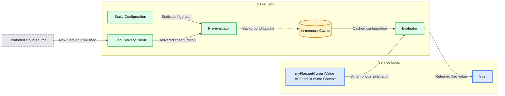
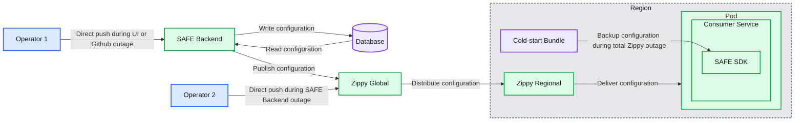

# High-availability feature flagging at Databricks

*How we built a zero-downtime feature flag system for Databricks' global infrastructure*

- Source: https://www.databricks.com/blog/high-availability-feature-flagging-databricks
- Published: 2026-01-21
- Authors: Benjamin Congdon
- Categories: engineering
- Images: 5 total, 4 extracted as architecture

**Key takeaways**

- SAFE is Databricks' in-house feature flagging platform that enables engineers to decouple code deployment from feature enablement, allowing for safer rollouts and faster incident mitigation across hundreds of services
- This post describes SAFE's architecture, which handles >25,000 active flags and over 300 million evaluations per second with microsecond-scale latency through techniques like static dimension pre-evaluation and multi-tiered global delivery.
- The system achieves high reliability through layered resilience mechanisms including fail-static behavior, out-of-band delivery paths, and cold-start configuration bundles that ensure services continue operating even during delivery pipeline failures.

Shipping software quickly while maintaining reliability is a constant tension. As Databricks has grown, so has the complexity of safely rolling out changes across hundreds of services, multiple clouds, and thousands of customer workloads. Feature flags help us manage this complexity by separating the decision to deploy code from the decision to enable it. This separation allows engineers to isolate failures and mitigate incidents faster, without sacrificing shipping velocity.

One of the key components of Databricks' stability posture is our in-house feature flagging and experimentation platform, called "SAFE". Databricks engineers use SAFE on a daily basis to rollout features, control service behavior dynamically, and measure the effectiveness of their features with A/B experiments.

## Background

SAFE was started with the "north star" goal of fully decoupling service binary releases from feature enablement, allowing teams to roll out features independently from their binary deployment. This allows for many side-benefits, like the ability to reliably ramp-up a feature to progressively larger populations of users, and quickly mitigate incidents caused by a rollout.

At Databricks' scale, serving thousands of enterprise customers across multiple clouds with a rapidly growing product surface area, we needed a feature flagging system that could meet our unique requirements:

- High standards for safety and change management. The main value proposition for SAFE was to improve the stability and operational posture of Databricks, so nearly all of the other requirements flowed from this.
- Multi-cloud, seamless global delivery across Azure, AWS, and GCP, with sub-millisecond flag evaluation latency to support high-throughput and latency-sensitive production services.
- Transparent support for all places where Databricks engineers write code, including our control plane, the Databricks UI, [Databricks Runtime Environment](https://docs.databricks.com/aws/en/release-notes/runtime/), and Databricks' [Serverless](https://www.databricks.com/glossary/serverless-computing) data plane.
- An interface that was opinionated enough about Databricks' release practices to make common flag releases "safe by default", yet flexible enough to support a large set of more esoteric use cases.
- Extremely rigorous availability requirements, as services cannot safely launch without flag definitions loaded.

After carefully considering these requirements, we ultimately opted to build a custom in-house feature flagging system. We needed a solution that could evolve alongside our architecture, and which would provide the governance controls required to safely manage flags across hundreds of services and thousands of engineers. Achieving our scaling and safety goals successfully required deep integration with our infrastructure data model, service frameworks, and CI systems.

As of late 2025, SAFE has approximately 25k active flags, with 4k weekly flag flips. At peak, SAFE runs over 300M evaluations per second, all while maintaining a p95 latency of ~10μs for flag evaluations.

This post explores how we built SAFE to meet these requirements and the learnings we've encountered along the way.

## Feature Flags in Action

To start, we will discuss a typical user journey for a SAFE flag. At its core, a feature flag is a variable that can be accessed in a service's control flow which can take different values depending on conditions controlled from an external config. One extremely common use case for feature flags is to gradually enable a new code path in a controlled fashion, first starting with a small portion of traffic and gradually enabling globally.

SAFE users first start by defining their flag in their service code, and use it as a conditional gate to the new feature's logic:

The user then goes to the internal SAFE UI and registers this flag and selects a template to roll out their flag. This template defines a gradual rampup plan consisting of a list of ordered stages. Each stage is ramped up slowly by percentages. The user is presented with a UI that looks like this once the flag has been created:

From here, the user can either manually roll out their flag one stage at a time, or set up a schedule to have the flag flips be created on their behalf. Internally, the source of truth for the flag configuration is a [jsonnet](https://www.databricks.com/blog/2017/06/26/declarative-infrastructure-jsonnet-templating-language.html) file checked in to the Databricks monorepo, that uses a lightweight domain-specific language (DSL) to manage the flag config:

When users change a flag from the UI, the output of that change is a Pull Request that needs to be reviewed by at least one other engineer. SAFE also runs a variety of pre-merge checks to guard against unsafe or unintended changes. Once the change is merged, the user's service will pick up the change and start emitting the new value within 2-5 minutes of the PR being merged.

### Use cases

Aside from the use case described above for feature rollout, SAFE is also used for other aspects of dynamic service configuration, such as: long-lived dynamic configurations (e.g. timeouts or rate limits), state machine control for infrastructure migrations, or to deliver small configuration blobs (e.g. targeted logging policies).

## Architecture

### Client Libraries

**Summary:** The SAFE SDK evaluates feature flags synchronously using an in-memory cache refreshed in the background from static configuration and published updates.

**Components:**
- Service Logic: application code invoking the SAFE SDK; language unspecified.
- `myFlag.getCurrentValue()`: flag value retrieval API.
- `Runtime Context(...)`: runtime inputs supplied for evaluation.
- `"true"`: returned flag value.
- SAFE SDK: client library containing evaluation and configuration update components.
- Evaluator: evaluates flags synchronously using cached configuration.
- In-memory Cache: memory-resident configuration cache.
- Static Configuration: static input to the pre-evaluator; format unspecified.
- Flag Delivery Client: receives published configuration versions; transport unspecified.
- Pre-evaluator: processes configuration and updates the cache.
- New Version Published: update from an unlabeled cloud source.
- Synchronous Evaluation: foreground flag evaluation path.
- Background Update: asynchronous cache refresh path.

**Flows:**
- Service Logic flag API and Runtime Context -> Evaluator: synchronous evaluation request with runtime context.
- Evaluator -> Service Logic result: returns `"true"`.
- In-memory Cache -> Evaluator: cached configuration for evaluation.
- Static Configuration -> Pre-evaluator: static configuration.
- Unlabeled cloud source -> Flag Delivery Client: newly published version.
- Flag Delivery Client -> Pre-evaluator: delivered configuration.
- Pre-evaluator -> In-memory Cache: background update.

**Numbers:** none

source image: https://www.databricks.com/sites/default/files/inline-images/high-availability-feature-flagging-databricks-blog-img-2_0.png

SAFE provides client "SDKs" in multiple internally supported languages, with the Scala SDK being the most mature and widely adopted. The SDK is essentially a criteria evaluation library, combined with a configuration loading component. For each flag, there is a set of criteria which control which value the SDK should return at runtime. The SDK manages loading the latest set of configuration, and needs to quickly return the result of evaluating that criteria at runtime.

In pseudocode, the criteria looks something like internally:

The criteria can be modeled as something akin to a sequence of boolean expression trees. Each conditional expression needs to be evaluated efficiently to return a quick result.

To meet our performance requirements, the SAFE SDK design embodies a few architectural principles: (1) separation of configuration delivery from evaluation, and (2) separation of static and runtime evaluation dimensions.

1. **Separation of delivery from evaluation:** The SAFE client libraries always treat delivery as an asynchronous process, and never block the "hot path" of flag evaluation on configuration delivery. Once the client has a snapshot of a flag configuration, it will continue to return results based on that snapshot until an asynchronous background process does an atomic update of that snapshot to a newer snapshot.
2. **Separation of dimension types:** Flag evaluation in SAFE operates on two types of dimensions:
  - **Static dimensions** represent characteristics of the running binary itself, things like cloud provider, cloud region, and environment (dev/staging/prod). These values remain constant for the lifetime of a process.
  - **Runtime dimensions** capture request-specific context, like workspace IDs, account IDs, application-provided values, and other per-request attributes that vary with each evaluation.

To reliably achieve sub-millisecond evaluation latency at scale, SAFE employs preevaluation of parts of the boolean expression tree which are static. When a SAFE configuration bundle is delivered to a service, the SDK immediately evaluates all static dimensions against the in-memory representation of the flag configuration. This produces a simplified configuration tree that contains only the logic relevant to that specific service instance.

When a flag evaluation is requested during request processing, the SDK only needs to evaluate the remaining runtime dimensions against this pre-compiled configuration. This significantly reduces the computational cost of each evaluation. Since many flags only use static dimensions in their boolean expression trees, many flags can effectively be entirely pre-evaluated.

### Flag Delivery

To reliably deliver configuration to all services at Databricks, SAFE operates hand-in-hand with our in-house dynamic configuration delivery platform, Zippy. An in-depth description of the Zippy architecture is left as a topic for another post, but in short, Zippy uses a multi-tiered global/regional architecture and per-cloud blob storage to transport arbitrary configuration blobs from a central source to (among other surfaces) all Kubernetes pods running in the Databricks Control Plane.

**Summary:** SAFE flag configurations flow from a user through GitHub and the SAFE backend to Zippy global and regional services, then to a SAFE SDK inside a consumer service pod.

**Components:**
- User: human operating SAFE UI.
- SAFE UI: configuration interface; technology unspecified.
- SAFE Flag Configurations: configuration files stored in GitHub.
- Github: repository containing flag configurations.
- SAFE Backend: backend service; technology unspecified.
- Database: persistent storage; database technology unspecified.
- Zippy Global: global configuration distribution service.
- Zippy Regional: regional configuration distribution service.
- Region: boundary containing Zippy Regional and the pod.
- Pod: runtime boundary containing the SAFE SDK and consumer service; technology unspecified.
- SAFE SDK: SDK embedded with the consumer service.
- Consumer Service: application consuming flags; technology unspecified.

**Flows:**
- User -> SAFE UI: user interaction.
- SAFE UI -> SAFE Flag Configurations: flag configuration changes.
- SAFE Flag Configurations -> SAFE Backend: flag configurations.
- SAFE Backend -> Database: configuration storage.
- Database -> SAFE Backend: stored configurations.
- SAFE Backend -> Zippy Global: flag configurations.
- Zippy Global -> Zippy Regional: configuration distribution.
- Zippy Regional -> Pod: configuration delivery to the pod containing SAFE SDK and Consumer Service.

**Numbers:** none

source image: https://www.databricks.com/sites/default/files/inline-images/high-availability-feature-flagging-databricks-blog-img-3_0.png

```mermaid
%% SAFE flag configuration delivery through GitHub and Zippy to a regional consumer pod
flowchart LR
    U[User] -->|User interaction| UI[SAFE UI]
    subgraph GH[Github]
        F[SAFE Flag Configurations]
    end
    UI -->|Configuration changes| F
    F -->|Flag configurations| B[SAFE Backend]
    B -->|Store configurations| DB[(Database)]
    DB -->|Read configurations| B
    B -->|Flag configurations| G[Zippy Global]
    subgraph R[Region]
        Z[Zippy Regional]
        subgraph P[Pod]
            SDK[SAFE SDK]
            C[Consumer Service]
        end
        Z -->|Configuration delivery| P
    end
    G -->|Configuration distribution| Z

    classDef client fill:#dbeafe,stroke:#2563eb,stroke-width:2px,color:#111
    classDef service fill:#dcfce7,stroke:#16a34a,stroke-width:2px,color:#111
    classDef store fill:#ede9fe,stroke:#7c3aed,stroke-width:2px,color:#111
    classDef cache fill:#fef3c7,stroke:#d97706,stroke-width:2px,color:#111
    classDef queue fill:#cffafe,stroke:#0891b2,stroke-width:2px,color:#111
    classDef critical fill:#fee2e2,stroke:#dc2626,stroke-width:4px,color:#111
    classDef external fill:#e5e7eb,stroke:#6b7280,stroke-width:2px,color:#111,stroke-dasharray:4 3
    classDef decision fill:#fce7f3,stroke:#db2777,stroke-width:2px,color:#111
    class U,UI client
    class B,G,Z,SDK,C,P service
    class F,DB store
    class GH,R external
```

The life of a delivered flag is as follows:

1. A user creates and merges a PR to one of their flag configuration jsonnet files, which then gets merged into the Databricks monorepo in Github.
2. Within ~1 minute, a post-merge CI job picks up the modified file and sends it to the SAFE backend, which subsequently stores a copy of the new configuration in a database.
3. Periodically (~1 minute intervals), the SAFE backend bundles up all the SAFE flag configurations and sends them to the Zippy Global backend.
4. Zippy Global distributes these configurations to each of its Zippy Regional instances, within ~30 seconds.
5. The SAFE SDK, running in each service pod, periodically receives the new version bundles using a combination of push and pull based delivery.
6. Once delivered, the SAFE SDK can use the new configuration during evaluation.

End-to-end, a flag change typically propagates to all services within 3-5 minutes of a PR being merged.

### Flag Configuration Pipeline

Within the flag delivery pipeline, the flag configurations take multiple forms – being progressively translated from higher-level, human readable semantic configurations to compact machine-readable versions as the flag gets closer to being evaluated.

In the user-facing interface, flags are defined using Jsonnet with a custom DSL to allow for arbitrarily complicated flag configurations. This DSL has affordances for common use cases, like configuring a flag to rollout using a pre-defined template, or for setting specific overrides on slices of traffic.

Once checked-in, this DSL is translated into an internal protobuf equivalent, which captures the semantic intent of the configuration. The SAFE backend then further translates this semantic configuration into a boolean expression tree. A protobuf description of this boolean expression tree is delivered to the SAFE SDK, which loads it into a further compacted in-memory representation of the configuration.

**Summary:** SAFE transforms a Jsonnet DSL into semantic protobuf configuration, a boolean expression tree, and a compact, pre-evaluated in-memory representation.

**Components:**
- Jsonnet DSL: source configuration written in Jsonnet.
- High Level FlagConfig Proto: protobuf representation of semantic configuration, stored in the SAFE database.
- Low Level FlagSettings Proto: protobuf representation of a boolean expression tree.
- In-Memory Companion Representation: compact configuration optimistically pre-evaluated by the SAFE SDK.
- CI: compiles Jsonnet into protobuf.
- SAFE backend: translates semantic configuration into a boolean expression tree.
- SAFE SDK: loads and pre-evaluates the boolean expression tree.

**Flows:**
- Jsonnet DSL -> High Level FlagConfig Proto: CI compiles Jsonnet into protobuf, stored in the SAFE database.
- High Level FlagConfig Proto -> Low Level FlagSettings Proto: SAFE backend translates semantic configuration into a boolean expression tree distributed to services.
- Low Level FlagSettings Proto -> In-Memory Companion Representation: SAFE SDK loads and pre-evaluates the tree into a compact in-memory representation.

**Numbers:** 1, 2, 3 are flow step numbers. No quantitative measurements are shown.

```mermaid
%% SAFE configuration compilation and in-memory preparation
flowchart LR
    A[Jsonnet DSL]
    B[High Level FlagConfig Proto<br/>Semantic Config]
    C[Low Level FlagSettings Proto<br/>Boolean Expression Tree]
    D[In-Memory Companion Representation<br/>Optimistically pre-evaluated]

    A -->|1. CI compiles to proto stored in SAFE database| B
    B -->|2. SAFE backend translates to boolean expression tree distributed to services| C
    C -->|3. SAFE SDK loads and pre-evaluates into compact memory representation| D

    classDef client fill:#dbeafe,stroke:#2563eb,stroke-width:2px,color:#111
    classDef service fill:#dcfce7,stroke:#16a34a,stroke-width:2px,color:#111
    classDef store fill:#ede9fe,stroke:#7c3aed,stroke-width:2px,color:#111
    classDef cache fill:#fef3c7,stroke:#d97706,stroke-width:2px,color:#111
    classDef queue fill:#cffafe,stroke:#0891b2,stroke-width:2px,color:#111
    classDef critical fill:#fee2e2,stroke:#dc2626,stroke-width:4px,color:#111
    classDef external fill:#e5e7eb,stroke:#6b7280,stroke-width:2px,color:#111,stroke-dasharray:4 3
    classDef decision fill:#fce7f3,stroke:#db2777,stroke-width:2px,color:#111

    class A,C service
    class B store
    class D cache
```

source image: https://www.databricks.com/sites/default/files/inline-images/high-availability-feature-flagging-databricks-blog-img-4_0.png

### UI

Most flag flips are initiated from an internal UI for managing SAFE flags. This UI allows users to create, modify, and retire flags through a workflow that abstracts away much of the Jsonnet complexity for simple changes while still providing access to most of the full power of the DSL for advanced use cases.

A rich UI has also allowed us to surface additional quality-of-life features, such as the ability to schedule flag flips, support for post-merge health checks, and debugging tooling for determining recent flag flips which impacted a particular region or service.

### Flag Config Review

All SAFE flag changes are created as normal Github PRs and are validated using an extensive set of pre-merge validators. This set of validators has grown to encompass dozens of individual checks, as we've learned more about how to best safeguard against potentially unsafe flag changes. During the initial introduction of SAFE, post-mortem reviews of incidents that were either caused by or mitigated through a SAFE flag flip informed many of these checks. We now have checks that, for example, require specialized review on large blast radius changes, require that a particular service binary version be deployed before a flag can be enabled, prevent subtle common misconfiguration patterns, and so on.

Teams can also define their own flag- or team-specific pre-merge checks, to enforce invariants for their configurations.

### Handling Failure Modes

Given SAFE's critical role in service stability, the system is designed with multiple layers of resilience to ensure continued operation even when parts of the delivery pipeline fail.

The most common failure scenario involves disruptions to the configuration delivery path. If anything in the delivery path results in a failure to update configurations, services simply continue serving their last known configuration until the delivery path is restored. This "fail static" approach ensures that existing service behavior remains stable even during upstream outages.

For more severe scenarios, we maintain multiple fallback mechanisms:

1. **Out-of-band delivery**: If any piece of CI or Github push path is unavailable, operators can push configurations directly to the SAFE backend using emergency tooling.
2. **Regional failover**: If the SAFE backend or Zippy Global are down, operators can temporarily push configurations directly to Zippy Regional instances. Services can also poll cross-region to mitigate the impact of a single Zippy Regional outage.
3. **Cold-start bundles**: To handle cases where Zippy itself is unavailable during service startup, SAFE periodically distributes configuration bundles to services via an artifact registry. While these bundles may be a few hours stale, they provide sufficient backup for services to start safely rather than blocking on live delivery.

**Summary:** SAFE delivers feature flag configuration through Zippy Global and Zippy Regional, with operator bypass paths and a cold-start bundle for outages.

**Components:**
- Operator 1: Pushes directly to SAFE Backend during UI/Github outages.
- SAFE Backend: Configuration backend; implementation technology unspecified.
- Database: Persistent storage; database technology unspecified.
- Operator 2: Pushes directly to Zippy Global during SAFE Backend outages.
- Zippy Global: Global configuration distribution component.
- Region: Boundary containing regional delivery and service components.
- Zippy Regional: Regional configuration distribution component.
- Cold-start Bundle: Backup configuration for total Zippy outages.
- Pod: Runtime boundary containing SAFE SDK and Consumer Service; platform unspecified.
- SAFE SDK: Configuration SDK embedded in Consumer Service.
- Consumer Service: Application consuming configuration; implementation technology unspecified.

**Flows:**
- Operator 1 -> SAFE Backend: Direct configuration push during UI/Github outages.
- SAFE Backend -> Database: Writes configuration.
- Database -> SAFE Backend: Reads configuration.
- SAFE Backend -> Zippy Global: Publishes configuration.
- Operator 2 -> Zippy Global: Direct configuration push during SAFE Backend outages.
- Zippy Global -> Zippy Regional: Distributes configuration to the region.
- Zippy Regional -> Pod: Delivers configuration to the service containing SAFE SDK.
- Cold-start Bundle -> SAFE SDK: Supplies backup configuration during total Zippy outages.

**Numbers:** 1, 2, and 3 label the outage fallback mechanisms. No quantities, units, percentages, or sizes are shown.

source image: https://www.databricks.com/sites/default/files/inline-images/high-availability-feature-flagging-databricks-blog-img-5_0.png

Within the SAFE SDK itself, defensive design ensures that configuration errors have limited blast radius. If a particular flag's configuration is malformed, only that single flag is affected. The SDK also maintains the contract of never throwing exceptions, and always fails open to the code default value, so application developers do not need to treat flag evaluation as a fallible. The SDK also immediately alerts on-call engineers when any configuration parsing or evaluation faults occur. Due to the maturity of SAFE and extensive pre-merge validation, such failures are now extremely infrequent in production.

This layered approach to resilience ensures that SAFE degrades gracefully, and minimizes the risk of it becoming a single point of failure.

## Lessons Learned

**Minimizing dependencies and layered redundant fallback reduce operational burden.** Despite being deployed in and heavily used by nearly every compute surface at Databricks, the operational burden of maintaining SAFE has been quite manageable. Adding layered redundancies, such as the cold start bundle and the SDK's "fail static" behavior, has made much of the SAFE architecture self-healing.

**Developer experience is paramount.** Scaling the "people aspect" of a robust flagging system required a strong UX focus. SAFE is a mission critical system, often used to mitigate incidents. As such, building a user-friendly UX for flipping flags during emergencies was high leverage. Adopting a product-focussed mindset led to fewer papercuts, less confusion, and ultimately a lower company-wide mean-time-to-recovery (MTTR) for incidents.

**Make "best practices" the low-friction route.** One of our biggest learnings was that you cannot only document best practices and expect engineers to follow them. Engineers have many competing priorities when shipping features. SAFE makes the safe path the easy path: gradual rollouts require less effort and have more quality-of-life features available than riskier enablement patterns. When the system incentivises safer behavior, the platform can nudge engineers towards a culture of responsible change management.

## Current State and Future Work

SAFE is now a matured internal platform within Databricks, and is widely used. The investments made into availability and developer experience pay dividends as we see continued reduction in both mean-time-to-resolution and blast radius production incidents through usage of SAFE flags.

As Databricks' product surface area continues to expand, the infrastructure primitives underlying those products expand in both breadth and complexity. As a result, there has been significant ongoing investment to ensure that SAFE supports all places where Databricks engineers write and deploy code.

If you're interested in scaling mission-critical infrastructure like this, please explore [open roles at Databricks](https://www.databricks.com/company/careers)!
