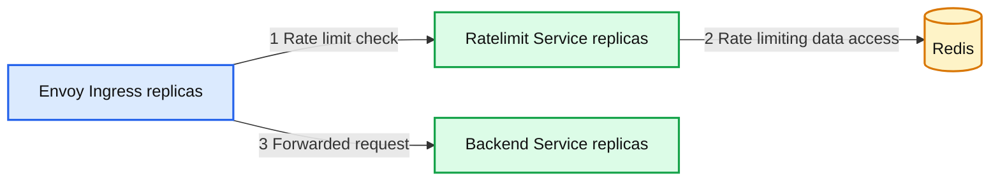
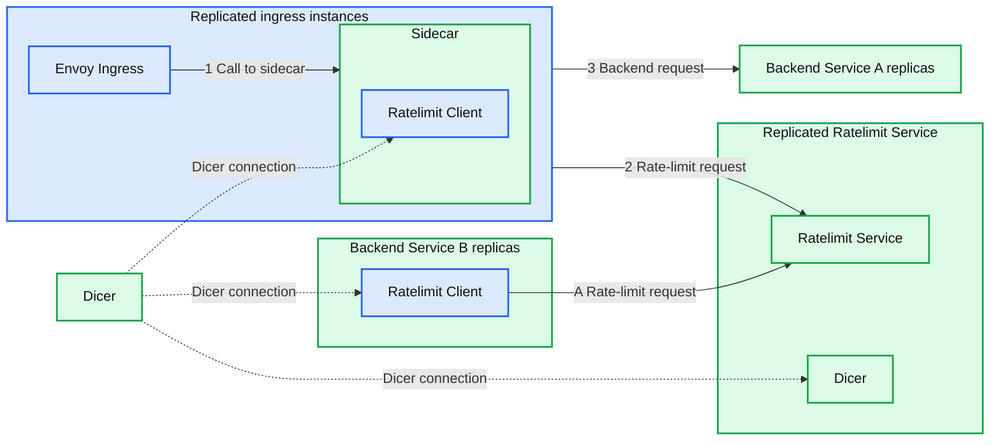
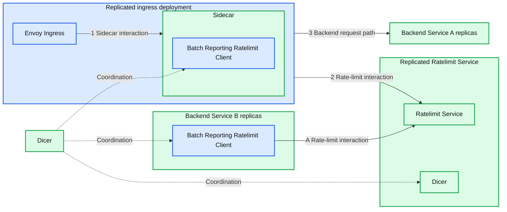

# High Performance Ratelimiting at Databricks

*Reimagining how Distributed Ratelimiting could be done*

- Source: https://www.databricks.com/blog/high-performance-ratelimiting-databricks
- Published: 2025-09-11
- Authors: David Hoa, Jiaying Wang, Suyog Soti, Victoria Peng, Gaurav Nanda
- Categories: engineering
- Images: 3 total, 3 extracted as architecture

**Key takeaways**

- Why the legacy Envoy + Redis rate limiting design created scaling bottlenecks and high tail latency under growing workloads
- How we rebuilt the system with in-memory sharding and client-driven batch reporting to achieve low-latency, high-throughput enforcement
- The adoption of token bucket rate limiting for more accurate enforcement, burst tolerance, and 10x tail latency improvements

As Databricks Engineers, we have the privilege of working on challenging problems with great colleagues. In this Engineering blog post, we will walk you through how we built a high performance rate limiting system at Databricks. If you are a Databricks user, you don’t need to understand this blog to be able to use the platform to its fullest. But if you’re interested in taking a peek under the hood, read on to hear about some of the cool stuff we’ve been working on!

## Background

Rate limiting is about controlling resource usage to provide isolation and overload protection between tenants in a multitenant system. In the context of Databricks, this could be providing isolation between accounts, workspaces, users, etc., and is most often seen externally as a per time unit limit, such as the number of jobs launched per second, number of API requests per second, etc. But there could also be internal usages of rate limits, such as managing capacity between clients of a service. Rate limit enforcement plays an important role in making Databricks reliable, but it’s important to note that this enforcement incurs overhead that needs to be minimized.

## The Problem

Back in early 2023, the existing Ratelimit infrastructure at Databricks consisted of an Envoy ingress gateway making calls to the Ratelimit Service, with a single instance of Redis backing the service (Figure 1). This was perfectly suitable for the existing queries per second (QPS) that any cluster of machines within a region was expected to receive, as well as for the transient nature of per second counting. But as the company expanded its customer base and added new use cases, it became clear that what had gotten us to that point wouldn’t be sufficient to meet our future needs. With the introduction of real-time model serving and other high qps use cases, where one customer could be sending orders of magnitude more traffic than what the Ratelimit Service could currently handle, a few problems emerged:

- High tail latency - the tail latency of our service was unacceptably high under heavy traffic, especially when considering there are two network hops involved and that there was P99 network latency of 10ms-20ms in one of the cloud providers.
- Limited Throughput - at a certain point, adding more machines and doing point optimizations (such as caching) no longer allowed us to handle more traffic.
- Redis as a single point of failure - Our single Redis instance was our single point of failure, and we had to do something about that. It was time to redesign our service.

*Figure 1. Simplified Architecture pre-2023.*

**Summary:** Envoy ingress connects to replicated ratelimit services backed by Redis and forwards traffic to replicated backend services.

**Components:**
- Envoy Ingress: Envoy gateway, shown as four overlapping boxes.
- Ratelimit Service: rate limiting service, shown as four overlapping boxes; technology unspecified.
- Redis: Redis data store.
- Backend Service: backend application, shown as four overlapping boxes; technology unspecified.

**Flows:**
- Envoy Ingress -> Ratelimit Service: rate limit check, labeled 1.
- Ratelimit Service -> Redis: rate limiting data access, labeled 2.
- Envoy Ingress -> Backend Service: forwarded request, labeled 3.

**Numbers:** 1, 2, 3 label the arrows. No units, percentages, or sizes are visible.

source image: https://www.databricks.com/sites/default/files/inline-images/high-performance-ratelimiting-databricks-blog-img-1.png

[Figure 1. Simplified Architecture pre-2023.](https://www.databricks.com/sites/default/files/inline-images/high-performance-ratelimiting-databricks-blog-img-1.png)

## Terminology

At Databricks, we have a concept of a RatelimitGroup (RLG), which is a string identifier that represents a resource or set of resources that we need to protect, such as an API endpoint. These resources would be protected on certain Dimensions, such as setting limits at the workspace/user/account level. For example, a dimension would convey “I want to protect FooBarAPI on workspaceId and the workspaceId for this request is 12345.” A Dimension would be represented like this:

A single shouldRateLimit request could have multiple descriptors, and an example might be setting limits, for a particular API, on the workspace and at the user level.

Where the Descriptor schema will look like this:

## Solution

### Low Latency Responses

The first problem we wanted to tackle was to improve the latency of our Ratelimit Service. Rate Limiting is ultimately just a counting problem, and we knew we ideally wanted to move to a model where we could always answer rate limit requests in-memory, because it is ultra-fast and most of our rate limits were based on QPS, which meant that these counts were transient and didn’t need to be resilient to service instances restarting or crashing. Our existing setup did a limited amount of in-memory counting already by using Envoy’s [consistent hashing](https://en.wikipedia.org/wiki/Consistent_hashing) to increase cache hit rates, by sending the same request to the same machine. However, 1) this was not possible to share with non-Envoy services, 2) the assignment churn during service resizes and restarts meant we still had to regularly synchronize with Redis, and 3) consistent hashing is prone to hotspotting, and when load wasn’t distributed evenly we oftentimes could only increase the number of instances to attempt to distribute load better, leading to suboptimal service utilization.

As luck would have it, we had some awesome folks join Databricks, and they were designing Dicer, an autosharding technology that would make stateful services easier to manage, while still keeping all the benefits of a stateless service deployment. This would allow us to tame our server side latency by keeping all of the rate limit counting in memory, because the clients would be able to ask Dicer to map a request to a destination server, and the server would be able to validate with Dicer that it was the proper owner of a request. Counting in memory is obviously much simpler and faster than looking up this information from another source, and Dicer enabled us to both improve our server side tail latency and scale horizontally without worrying about a storage solution. i.e this removed our single point of failure (Redis) and gave us faster requests at the same time!

*Figure 2. Ratelimit Service using Dicer*

**Summary:** Replicated ratelimit services use Dicer to support rate-limit checks from an ingress sidecar and Backend Service B, while ingress traffic proceeds to Backend Service A.

**Components:**

- Envoy Ingress: Envoy ingress proxy within replicated instances.
- Sidecar: contains a Ratelimit Client.
- Ratelimit Client in Sidecar: rate-limit client; implementation unspecified.
- Ratelimit Service: replicated rate-limit service containing Dicer.
- Embedded Dicer: Dicer component inside the Ratelimit Service.
- Dicer: central Dicer component connected to clients and the service.
- Backend Service A: replicated backend; technology unspecified.
- Backend Service B: replicated backend containing a Ratelimit Client.
- Ratelimit Client in Backend Service B: rate-limit client; implementation unspecified.

**Flows:**

- Envoy Ingress -> Sidecar: call labeled 1.
- Sidecar instance -> Ratelimit Service: rate-limit request labeled 2.
- Ingress instance -> Backend Service A: backend request labeled 3.
- Backend Service B Ratelimit Client -> Ratelimit Service: rate-limit request labeled A.
- Dicer -> Sidecar Ratelimit Client: dashed Dicer connection; payload unspecified.
- Dicer -> Embedded Dicer: dashed Dicer connection; payload unspecified.
- Dicer -> Backend Service B Ratelimit Client: dashed Dicer connection; payload unspecified.

**Numbers:** 1, 2, 3 are flow labels. No units, percentages, or sizes are shown.

source image: https://www.databricks.com/sites/default/files/inline-images/high-performance-ratelimiting-databricks-blog-img-2.png

[Figure 2. Ratelimit Service using Dicer](https://www.databricks.com/sites/default/files/inline-images/high-performance-ratelimiting-databricks-blog-img-2.png)

### Scaling Efficiently

Even though we understood how we could solve part of our problems, we still didn’t have a really good way to handle the anticipated massive amount of requests. We had to be more efficient and smarter about this, rather than throwing a huge number of servers at the problem. Ultimately, we did not want one client request to translate into one request to the Ratelimit Service, because at scale, millions of requests to the Ratelimit Service would be expensive.

What were our options? We thought through many of them but some of the options we considered were

- Prefetching tokens on the client and trying to answer requests locally.
- Batching up a set of requests, sending, and then waiting for a response to let the traffic through.
- Only sending a fraction of the requests (i.e. Sampling).

None of these options were particularly attractive; Prefetching (a) has a lot of edge cases during initialization and when the tokens run out on the client or expire. Batching (b) adds unnecessary delay and memory pressure. And Sampling (c) would only be suitable for high qps cases, but not in general, where we actually could have low rate limits.

What we ended up designing is a mechanism we call **batch-reporting**, that combines two principles: 1) Our clients would not make any remote calls in the critical rate limit path, and 2) our clients would perform optimistic rate limiting, where by default requests would be let through unless we already knew we wanted to reject those particular requests. We were fine with not having strict guarantees on rate limits as a tradeoff for scalability because backend services could tolerate some percentage of overlimit. At a high level, batch-reporting does local counting on the client side, and periodically (e.g. 100ms) reports back the counts to the server. The server would tell the client whether any of the entries needed to be rate limited.

The batch-reporting flow looked like this:

- The client records how many requests it let through (outstandingHits) and how many requests it rejected (rejectedHits)
- Periodically, a process on the client will report the collected counts to the server.
  - E.g. `KeyABC_SubKeyXYZ: outstandingHits=624, rejectedHits=857;`
`KeyQWD_SubKeyJHP: outstandingHits=876, rejectedHits=0`
- Server returns an array of responses
  - KeyABC_SubKeyXYZ: rejectTilTimestamp=..., rejectionRate=...
KeyQWD_SubKeyJHP: rejectTilTimestamp=..., rejectionRate=...

The benefits of this approach were huge; we could have practically zero-latency rate limit calls, a 10x improvement when compared to some tail latency calls, and turn spiky rate limit traffic into (relatively) constant qps traffic! Combined with the Dicer solution for in-memory rate limiting, it’s all smooth sailing from here, right?

## Devil’s in the Details

Even though we had a good idea of the end goal, there was a lot of hard engineering work to actually make it a reality. Here are some of the challenges we encountered along the way, and how we solved them.

### High Fanout

Because we needed to shard based on the RateLimitGroup and dimension, this meant that a previously single RateLimitRequest with N dimensions could turn into N requests, i.e. a typical fanout request. This could be especially problematic when combined with batch-reporting, since a single batched request could fan-out to many (500+) different remote calls. If unaddressed, the client-side tail latency would increase drastically (from waiting on only 1 remote call to waiting on 500+ remote calls), and the server-side load would increase (from 1 remote request overall to 500+ remote requests overall). We optimized this by grouping descriptors by their Dicer assignments - descriptors assigned to the same replica were grouped into a single rate limit batch request and sent to that corresponding destination server. This helped to minimize the increase in client-side tail latencies (some increase in tail latency is acceptable since batched requests are not on the critical path but rather processed in a background thread), and minimizes the increased load to the server (each server replica will handle at most 1 remote request from a client replica per batch cycle).

### Enforcement Accuracy

Because the batch-reporting algorithm is both asynchronous and uses a time-based interval to report the updated counts to the Ratelimit Service, it was very possible that we could allow too many requests through before we could enforce the rate limit. Even though we could define these limits as fuzzy, we still wanted to give guarantees that we would go X% (e.g. 5%) over the limit. Going excessively over the limit could happen because of two main reasons:

- The traffic during one batching window (e.g. 100ms) could exceed the rate limit policy.
- Many of our use cases used the [fixed-window algorithm](https://blog.bytebytego.com/p/rate-limiting-fundamentals?open=false#%C2%A7fixed-window-counter) and per-second rate limits. A property of the fixed-window algorithm is that each “window” starts fresh (i.e. resets and starts from zero), so we could potentially exceed the rate limit every second, even during constant (but high) traffic!

The way we fixed this was three-fold:

- We added a rejection-rate in the Ratelimit Service response, so that we could use past history to predict when and how much traffic to reject on the client.
`*rejectionRate=(estimatedQps-rateLimitPolicy)/estimatedQps*` This uses the assumption that the upcoming second’s traffic is going to be similar to the past second’s traffic.
- We added defense-in-depth by adding a client-side local rate limiter to cut off obvious cases of excessive traffic immediately.
- Once we had autosharding in place, we implemented an in-memory [token-bucket](https://en.wikipedia.org/wiki/Token_bucket) ratelimiting algorithm, which came with some great benefits:
  1. We could now allow controlled bursts of traffic
  2. More importantly, token-bucket “remembers” information across time intervals because instead of resetting every time interval like the fixed-window algorithm, it can continuously count, and even go negative. Thus, if a customer sends too many requests, we “remember” how much over the limit they went and can reject requests until the bucket refills to at least zero. We weren’t able to support this token bucket in Redis previously because token-bucket needed fairly complex operations in Redis, which would increase our Redis latencies. Now, because the token-bucket didn’t suffer from amnesia every time interval, we could get rid of the rejection-rate mechanism.
  3. Token-bucket without enabling extra burst functionality can approximate a sliding-window algorithm, which is a better version of fixed-window that doesn’t suffer from the “reset” problem.

The benefits of the token-bucket approach were so great that we ended up converting all our ratelimits to token bucket.

### Rebuilding a Plane In-Flight

We knew the end state that we wanted to get to, but that required making two independent major changes to a critical service, neither of which were guaranteed to work well on their own. And rolling these two changes out together was not an option, for both technical and risk management reasons. Some of the interesting stuff we had to do along the way:

- We built a localhost sidecar to our envoy ingress so that we could apply both batch-reporting and auto-sharding, because envoy is third party code we cannot change.
- Before we had in-memory rate limiting, we had to batch writes to Redis via a [Lua](https://redis.github.io/lettuce/user-guide/lua-scripting/) script in order to bring down the tail latency of batch-reporting requests, because sending descriptors one by one to Redis was too slow with all the network round-trips, even if we had switched to [batch](https://redis.github.io/lettuce/redis-command-interfaces/#batch-execution) execution.
- We built a traffic simulation framework with many different traffic patterns and rate limit policies, so we could evaluate our accuracy, performance, and scalability throughout this transition.

*Figure 3. Ratelimit Architecture with Dicer and Batch-Reporting*

**Summary:** Replicated ingress sidecars and backend services use batch-reporting ratelimit clients connected to a replicated Ratelimit Service, with Dicer providing coordination.

**Components:**
- Envoy Ingress: Envoy ingress proxy within the replicated left-hand deployment.
- Sidecar: contains a Batch Reporting Ratelimit Client.
- Batch Reporting Ratelimit Client: appears in the sidecar and Backend Service B.
- Ratelimit Service: replicated rate-limiting service containing Dicer.
- Dicer inside Ratelimit Service: embedded Dicer component.
- Dicer: standalone coordination component.
- Backend Service A: replicated backend; technology unspecified.
- Backend Service B: replicated backend containing a Batch Reporting Ratelimit Client; other technology unspecified.

**Flows:**
- Envoy Ingress -> Sidecar: arrow 1, ingress-to-sidecar interaction.
- Sidecar deployment -> Ratelimit Service: arrow 2, rate-limit interaction.
- Sidecar deployment -> Backend Service A: arrow 3, backend request path.
- Backend Service B client -> Ratelimit Service: arrow A, rate-limit interaction.
- Dicer -> Sidecar client: dashed coordination connection; payload unspecified.
- Dicer -> Embedded Dicer: dashed coordination connection; payload unspecified.
- Dicer -> Backend Service B client: dashed coordination connection; payload unspecified.

**Numbers:** 1, 2, 3 are flow labels. No units, percentages, or sizes are shown.

source image: https://www.databricks.com/sites/default/files/inline-images/high-performance-ratelimiting-databricks-blog-img-3.png

[Figure 3. Ratelimit Architecture with Dicer and Batch-Reporting](https://www.databricks.com/sites/default/files/inline-images/high-performance-ratelimiting-databricks-blog-img-3.png)

## Current State and Future Work

With the successful rollout of both batch-reporting and in-memory token bucket rate limiting, we saw drastic tail latency improvements (up to 10x in some cases!) with sub-linear growth in server side traffic. Our internal service clients are particularly happy that there’s no remote call when they make rate limit calls, and that they have the freedom to scale independently of the Ratelimit Service.

The team has also been working on other exciting areas, such as service mesh routing and zero-config overload protection, so keep tuned for more blog posts! And Databricks is always [looking](https://www.databricks.com/company/careers/engineering-at-databricks) for more great engineers who can make a difference, we’d love for you to join us!
