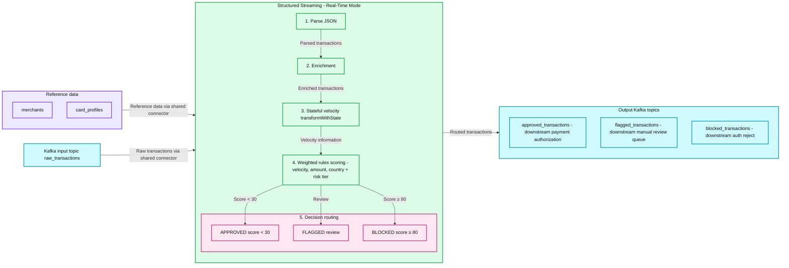
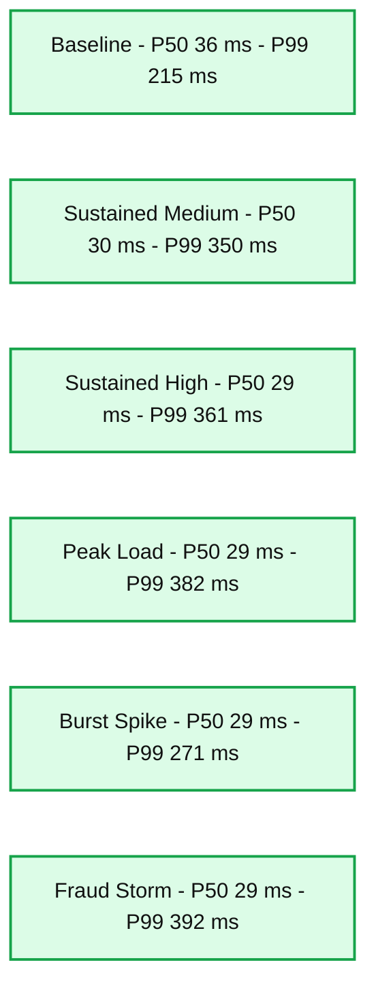

# How to Build Real-Time Fraud Detection using Spark Real-Time Mode and Lakebase

*Modernizing Financial Ecosystems with Sub-Second Latency and Scalable Data Intelligence*

- Source: https://www.databricks.com/blog/how-build-real-time-fraud-detection-using-spark-real-time-mode-and-lakebase
- Published: 2026-05-19
- Authors: Sixuan He, Navneeth Nair
- Categories: engineering, financial-services
- Images: 5 total, 4 extracted as architecture

**Key takeaways**

- Traditional fraud detection systems struggle with detection lag, relying on slow batch processing or complex, bolted-on streaming engines that fail to block threats in real-time.
- Spark Real-Time Mode and Lakebase enable data teams to easily build and automate an end-to-end fraud detection workflow: processing high-throughput data streams, executing low-latency ML models, and serving explainable fraud scores, all within a unified platform.
- Organizations can achieve sub-second intervention on fraudulent transactions, reducing operational complexity while protecting revenue and maintaining customer trust without the need for external infrastructure.

Card fraud operates in seconds. A stolen credit card number can fuel dozens of purchases in minutes, and once a transaction settles, recovering those funds becomes exponentially harder. According to the [Nilson Report](https://nilsonreport.com/articles/card-fraud-losses-worldwide-2024/), financial institutions lose an estimated $33 billion annually to fraudulent card transactions, and that figure will only grow as digital transaction volume accelerates.

The challenge isn't detecting fraud. Most organizations already have capable fraud models and well-tuned rules. The challenge is detecting it **fast enough** to block a suspicious transaction *before* it clears, in the sub-second window between authorization and settlement, and doing that without bolting on a separate, specialized streaming engine that doubles your operational complexity.

In this blog, we introduce a new Solution Accelerator: an open source reference implementation you can clone and deploy directly into your Databricks environment. It demonstrates how to build a complete, end-to-end fraud detection system, from raw transaction ingestion and real-time ML scoring to a live monitoring dashboard built with [Databricks Apps](https://www.databricks.com/product/databricks-apps), entirely on the Databricks Data + AI Platform. At its core are two technologies: [Real-Time Mode](https://www.databricks.com/blog/announcing-general-availability-real-time-mode-apache-spark-structured-streaming-databricks) (RTM) for Apache Spark Structured Streaming on Databricks that delivers sub-300ms stream processing, and [Lakebase](https://www.databricks.com/product/lakebase), a fully managed, serverless, Postgres database built into the Databricks Data + AI Platform. 

## Speed vs. Simplicity: The Real-time Tradeoff for Fraud Detection  

Fraud detection sits at the intersection of two conflicting demands.

On one side, there's **speed**. A fraudulent transaction must be identified and blocked within hundreds of milliseconds before it settles. Sophisticated fraud rings test stolen cards with rapid-fire micro-purchases, exploit geographic anomalies, and adapt their patterns faster than static rules can keep up.

On the other side, there's **simplicity**. Data teams want to build, train, and deploy fraud models on a single platform, with unified governance, shared data, and one set of tools. They don't want to maintain a separate streaming stack just for the "last mile" of real-time scoring.

Until now, teams have been forced to choose. Historically, meeting these ultra-low latency requirements meant introducing a specialized engine alongside Spark, such as Apache Flink. The result is a familiar pattern: two parallel systems, duplicate data, split governance, and engineering teams spending more time on managing pipelines instead of improving fraud models. With the introduction of RTM in Spark Structured Streaming, that tradeoff is no longer necessary.

## RTM: Sub-Second Processing Without the Operational Overhead of Multiple Systems

[RTM](https://www.databricks.com/blog/announcing-general-availability-real-time-mode-apache-spark-structured-streaming-databricks) is an evolution of the Spark Structured Streaming engine that enables sub-second data processing for latency-sensitive operational applications such as feature engineering.

On the **speed** side, RTM processes events in milliseconds and is [up to 92% faster than Apache Flink](https://www.databricks.com/blog/real-time-mode-ultra-low-latency-streaming-spark-apis-without-second-engine) across stateless transformation, join-based enrichment, and aggregation workloads. Customers such as [Coinbase are already using RTM](https://www.databricks.com/customers/coinbase/lakeflow) to compute over 250 ML features, and have achieved sub-100ms P99 processing latencies.

On the **simplicity** side, RTM lives inside the Spark engine you already run, not next to it. Therefore, you will immediately benefit from:  

- **No logic drift. **Your fraud scoring rules, feature engineering, and ML preprocessing exist once. The same code that runs in your offline training pipeline runs in your real-time scoring environment. This enables you to productionize features faster and with greater accuracy. 
- **One operational surface. **Spark UI, cluster monitoring, jobs, alerting, etc. All the tooling you already use applies. There's no second on-call rotation for the streaming engine.
- **Flexibility on cost vs. freshness. **When sub-second freshness isn't worth the cost, switching back to a slower trigger is the same one-line code change in the other direction. No need to spend time manually tuning parallelism or orchestrating the shutdown and restart of computing resources.

As a result, the team no longer needs to choose; you get both the speed *and* the simplicity, and engineering hours go back to tuning fraud signals rather than managing infrastructure.

## Example scenario: Blocking fraud in credit card transactions

To make this concrete, our Solution Accelerator implements a real-time fraud detection system for credit card transactions. Here's the scenario:

Transactions stream in from a messaging system (Kafka, Kinesis, etc.). Each transaction carries a card ID, amount, merchant category, geographic coordinates, and channel (online vs. point-of-sale). The system must evaluate every transaction against multiple fraud signals, assign a risk score, and route it to the appropriate outcome — **approved**, **flagged for review**, or **blocked** — all within sub-300ms.

The architecture mirrors what production fraud systems look like at major financial institutions, with stateful tracking, feature enrichment from **Lakebase** as an online serving layer, ML scoring, and a live **Databricks Apps** for fraud analyst monitoring. The difference is that it runs entirely on one platform.

## How We Built It

**Summary:** Kafka events flow through Spark RTM for real-time processing, into Kafka / Lakebase for low-latency storage and serving, and then to Databricks Apps.

**Components:**

- **Kafka - Source:** Kafka event streaming platform and message broker.
- **Spark RTM - Processing:** Spark RTM real-time materialization and stream processing.
- **Kafka / Lakebase - Storage:** Kafka / Lakebase low-latency serving layer and intermediate storage.
- **Databricks Apps - Consumer:** Databricks Apps application layer serving end-user experiences.

**Flows:**

- Kafka -> Spark RTM: Events.
- Spark RTM -> Kafka / Lakebase: Processed data.
- Kafka / Lakebase -> Databricks Apps: Served data.

**Numbers:** none

```mermaid
%% Kafka events pass through Spark RTM and Kafka / Lakebase to Databricks Apps
flowchart LR
    A[Kafka - Source<br/>Event streaming platform and message broker]
    B[Spark RTM - Processing<br/>Real-time materialization and stream processing]
    C[Kafka / Lakebase - Storage<br/>Low-latency serving layer and intermediate storage]
    D[Databricks Apps - Consumer<br/>Application layer serving end-user experiences]

    A -->|Events| B
    B -->|Processed data| C
    C -->|Served data| D

    classDef client fill:#dbeafe,stroke:#2563eb,stroke-width:2px,color:#111
    classDef service fill:#dcfce7,stroke:#16a34a,stroke-width:2px,color:#111
    classDef store fill:#ede9fe,stroke:#7c3aed,stroke-width:2px,color:#111
    classDef cache fill:#fef3c7,stroke:#d97706,stroke-width:2px,color:#111
    classDef queue fill:#cffafe,stroke:#0891b2,stroke-width:2px,color:#111
    classDef critical fill:#fee2e2,stroke:#dc2626,stroke-width:4px,color:#111
    classDef external fill:#e5e7eb,stroke:#6b7280,stroke-width:2px,color:#111,stroke-dasharray:4 3
    classDef decision fill:#fce7f3,stroke:#db2777,stroke-width:2px,color:#111

    class A queue
    class B,D service
    class C store
```

source image: https://www.databricks.com/sites/default/files/inline-images/2026-05-blog-how-to-build-real-time-fraud-detection-using-spark-real-time-mode-and-lakebase-inline-960x273-2x.png

The accelerator goes through four progressive stages, each building on the last. Here's the high-level system architecture diagram. It shows the clean data flow across the four main components:

- **Kafka (Source):** The event streaming platform that ingests raw events
- **Spark RTM:** The real-time materialization engine that processes the streaming data
- **Kafka / Lakebase:** The intermediate layer where processed data lands, either back into Kafka or into Lakebase (Databricks’ low-latency serving layer)
- **Databricks Apps**: The application layer that serves the final data to end users

Check out the full end-to-end demo video below, or continue reading the step-by-step to learn exactly how we built it.  Start with the Quick Start below (no external dependencies) and add complexity as you go.

## Step 1: See Real-Time Mode in Action 

For financial institutions evaluating real-time fraud infrastructure, rapid time-to-value is critical.  The [Quick Start notebook](https://github.com/databricks-industry-solutions/rtm-fraud-detection/blob/main/notebooks/RTM_00_Quick_Start.py) lets your team experience Real-Time Mode immediately, and validate core latency benchmarks and platform fit in under five minutes. before any production commitment No connecting to Kafka or configuring anything external is needed. It generates synthetic transactions using Spark's built-in rate source, applies fraud scoring logic, and displays results live in the notebook. This is your "hello world" for Real-Time Mode. Run it, see the latency numbers, and validate that your cluster is configured correctly.

## Step 2: Build the Fraud Detection Pipeline

With Real-Time Mode validated, the [next notebook](https://github.com/databricks-industry-solutions/rtm-fraud-detection/blob/main/notebooks/RTM_01_Introduction_fraud_detection.py) builds a production-grade fraud detection pipeline that mirrors how leading FSIs operationalize real-time fraud decisioning. It processes transactions end-to-end, delivering the explainable scoring required by both fraud ops and compliance teams. Transactions flow from Kafka through five stages, each running continuously, each adding intelligence:

**Summary:** A Kafka-based fraud detection pipeline uses Spark Structured Streaming Real-Time Mode to parse, enrich, track velocity, score, and route transactions into approved, flagged, or blocked Kafka topics.

**Components:**
- RTM_01 | KAFKA-BASED RULES PIPELINE: pipeline identifier and title.
- Reference data: storage containing `merchants` and `card_profiles`; storage technology is unspecified.
- Kafka input: Kafka topic `raw_transactions`.
- Structured Streaming - Real-Time Mode: streaming processing container.
- 1. Parse JSON: JSON parsing stage.
- 2. Enrichment: streaming enrichment stage.
- 3. Stateful velocity: stateful processing using `transformWithState`.
- 4. Weighted rules scoring: scoring using velocity, amount, and country + risk tier.
- 5. Decision routing: routes transactions into three outcomes.
- APPROVED: score < 30.
- FLAGGED: review.
- BLOCKED: score ≥ 80.
- Output Kafka topics: Kafka output container.
- `approved_transactions`: downstream payment authorization.
- `flagged_transactions`: downstream manual review queue.
- `blocked_transactions`: downstream auth reject.

**Flows:**
- Reference data -> Structured Streaming - Real-Time Mode: reference data enters through a shared input connector.
- Kafka input -> Structured Streaming - Real-Time Mode: raw transactions enter through the shared input connector.
- Parse JSON -> Enrichment: parsed transactions.
- Enrichment -> Stateful velocity: enriched transactions.
- Stateful velocity -> Weighted rules scoring: transactions with velocity information.
- Weighted rules scoring -> APPROVED: transactions with score < 30.
- Weighted rules scoring -> FLAGGED: transactions routed for review.
- Weighted rules scoring -> BLOCKED: transactions with score ≥ 80.
- Structured Streaming - Real-Time Mode -> Output Kafka topics: routed transactions; the image shows one container-level output arrow.

**Numbers:** `01` in `RTM_01`; stage numbers `1`, `2`, `3`, `4`, `5`; approved threshold `score < 30`; blocked threshold `score ≥ 80`.

source image: https://www.databricks.com/sites/default/files/inline-images/2026-05-blog-how-to-build-real-time-fraud-detection-using-spark-real-time-mode-and-lakebase-inline-960x436-2x.png

- **Parsing** takes raw JSON from Kafka and structures it into typed columns
- **Velocity tracking** is where things get interesting. Using [transformWithState](https://docs.databricks.com/aws/en/stateful-applications/#what-is-transformwithstate) (Spark's powerful operator for building arbitrary or custom stateful transformations), the pipeline maintains per-card state across the stream: how many transactions has this card made in the last 60 seconds? A card that suddenly fires five transactions in a minute is exhibiting classic card-testing behavior. The state auto-expires via TTL, so there's no unbounded memory growth and no manual cleanup.
- **Enrichment** adds context from merchant risk profiles and cardholder data. Is this a high-risk merchant category (gift cards, jewelry)? Does the cardholder normally spend $50 or $5,000? These lookups use Python dictionaries rather than broadcast joins, avoiding the BroadcastExchange overhead that can add latency in streaming pipelines.
- **Scoring** combines five weighted fraud signals: velocity, geographic anomaly, amount deviation, merchant category risk, and country risk, into a single 0-100 score. Each signal is computed by a dedicated UDF, and the weights are configurable. The result is an *explainable* score: you can see exactly which signals contributed and by how much.
- **Routing** takes the final decision. Transactions are classified as approved, flagged for manual review, or automatically blocked, and written to the appropriate output Kafka topic.

We also conducted end-to-end latency testing across varying TPS levels. The results showed consistent performance, with P50 latency under 40 ms and P99 latency ranging between 215-392 ms. These results demonstrate that a Kafka-in, Kafka-out architecture using RTM on the Databricks Data + AI Platform can deliver low-latency, production-ready performance without relying on external APIs or additional infrastructure.

**Summary:** End-to-end P50 and P99 latency across six load scenarios ranges from 29 to 36 ms and 215 to 392 ms, respectively.

**Components:**
- E2E P50 Latency: blue series; technology unspecified.
- E2E P99 Latency: red series; technology unspecified.
- Baseline: load scenario; technology unspecified.
- Sustained Medium: load scenario; technology unspecified.
- Sustained High: load scenario; technology unspecified.
- Peak Load: load scenario; technology unspecified.
- Burst Spike: load scenario; technology unspecified.
- Fraud Storm: load scenario; technology unspecified.

**Flows:**
- None. No arrows are visible.

**Numbers:**

| Load scenario | E2E P50 Latency | E2E P99 Latency |
|---|---:|---:|
| Baseline | 36 ms | 215 ms |
| Sustained Medium | 30 ms | 350 ms |
| Sustained High | 29 ms | 361 ms |
| Peak Load | 29 ms | 382 ms |
| Burst Spike | 29 ms | 271 ms |
| Fraud Storm | 29 ms | 392 ms |

Vertical axis ticks: 0 ms, 50 ms, 100 ms, 150 ms, 200 ms, 250 ms, 300 ms, 350 ms, 400 ms, 450 ms. Series percentiles: P50 and P99.

source image: https://www.databricks.com/sites/default/files/inline-images/2026-05-blog-how-to-build-real-time-fraud-detection-using-spark-real-time-mode-and-lakebase-inline-960x534-2x.png

## Step 3: Upgrade to Machine Learning

Static rules-based fraud detection creates audit-friendly but brittle systems. Thresholds are arbitrary: why are five transactions in 60 seconds "suspicious"? Why not four or six? And because there is no learning, the system never improves from past decisions.

The advanced notebook upgrades this logic to a governed machine learning model. This transition allows risk teams to reduce false positives, adapt to emerging fraud patterns, and demonstrate model lineage to regulators through MLflow's built-in experiment tracking and versioning. This introduces two new platform capabilities:

**Summary:** Historical data trains an MLflow model used by a Spark Real-Time Mode scoring pipeline, which writes card features and transaction scores to Lakebase for a Databricks App.

**Components:**

- Historical data: durable data source; technology unspecified.
- A | Offline ML training loop: MLflow training and model deployment.
- MLflow Training: scikit-learn.
- MLflow Model Registry: registered model storage and governance.
- Load as Spark UDF applied per-row in stream: Spark model deployment.
- Kafka input: topic `raw_transactions`.
- B | Real-time scoring pipeline - Real-Time Mode: Spark streaming pipeline.
- 1. Parse JSON: JSON parsing.
- 2. Feature build: amount, velocity, and country features.
- 3. ML scoring: Spark UDF returning a score.
- 4. Decision routing: transaction decision logic.
- 5. Write streams - dual sink: feature and score output streams.
- Feature upsert stream: psycopg upsert per card.
- Scores stream: per-transaction row output.
- C | Lakebase: managed Postgres.
- `card_features`: online feature storage with sub-ms reads.
- `transaction_scores`: transaction score storage.
- APPROVED: score < 30.
- FLAGGED: review.
- BLOCKED: score ≥ 80.
- D | Consumer - Databricks App: auto-refreshed Streamlit app deployed on Databricks Apps, reading live from Lakebase.

**Flows:**

- Historical data -> MLflow Training: historical training data.
- MLflow Training -> MLflow Model Registry: trained model.
- MLflow Model Registry -> Load as Spark UDF: registered model.
- Load as Spark UDF -> ML scoring: model applied per stream row.
- Kafka input -> Real-time scoring pipeline: `raw_transactions` events.
- Parse JSON -> Feature build: parsed transaction data.
- Feature build -> ML scoring: amount, velocity, and country features.
- ML scoring -> Decision routing: model score.
- Feature build -> Feature upsert stream: per-card features.
- Decision routing -> Scores stream: scored transaction rows.
- Feature upsert stream -> `card_features`: upsert.
- Scores stream -> `transaction_scores`: insert.
- Lakebase -> Consumer - Databricks App: live data for auto-refreshed display.

**Numbers:**

- `RTM_02`: pipeline identifier.
- Steps `1`, `2`, `3`, `4`, and `5`: parse, build features, score, route, and write.
- `sub-ms`: online feature read latency.
- APPROVED: `score < 30`.
- BLOCKED: `score ≥ 80`.

```mermaid
%% MLflow training and Spark Real-Time Mode fraud scoring with Lakebase sinks
flowchart LR
    H[Historical data]
    K[Kafka topic raw_transactions]

    subgraph A[Offline ML training loop]
        T[MLflow Training scikit-learn]
        R[MLflow Model Registry]
        U[Load as Spark UDF applied per-row in stream]
    end

    subgraph B[Real-time scoring pipeline - Real-Time Mode]
        P[1. Parse JSON]
        F[2. Feature build - amount velocity country]
        M[3. ML scoring - Spark UDF returns score]
        D[4. Decision routing]
        subgraph W[5. Write streams - dual sink]
            FU[Feature upsert stream - psycopg upsert per card]
            SS[Scores stream - per-transaction row]
        end
    end

    subgraph C[Lakebase - managed Postgres]
        CF[card_features - sub-ms online feature reads]
        TS[transaction_scores - APPROVED score < 30 - FLAGGED review - BLOCKED score ≥ 80]
    end

    APP[Consumer - Databricks App - Streamlit - live from Lakebase - auto-refreshed]

    H -->|Training data| T
    T -->|Trained model| R
    R -->|Registered model| U
    U -->|Per-row model| M
    K -->|Raw transactions| B
    P -->|Parsed JSON| F
    F -->|Features| M
    M -->|Score| D
    F -->|Per-card features| FU
    D -->|Scored transaction rows| SS
    FU -->|Upsert| CF
    SS -->|Insert| TS
    C -->|Live data| APP

    classDef client fill:#dbeafe,stroke:#2563eb,stroke-width:2px,color:#111
    classDef service fill:#dcfce7,stroke:#16a34a,stroke-width:2px,color:#111
    classDef store fill:#ede9fe,stroke:#7c3aed,stroke-width:2px,color:#111
    classDef cache fill:#fef3c7,stroke:#d97706,stroke-width:2px,color:#111
    classDef queue fill:#cffafe,stroke:#0891b2,stroke-width:2px,color:#111
    classDef critical fill:#fee2e2,stroke:#dc2626,stroke-width:4px,color:#111
    classDef external fill:#e5e7eb,stroke:#6b7280,stroke-width:2px,color:#111,stroke-dasharray:4 3
    classDef decision fill:#fce7f3,stroke:#db2777,stroke-width:2px,color:#111
    class APP client
    class T,U,P,F,M service
    class H,R,CF,TS store
    class K,FU,SS queue
    class D decision
```

source image: https://www.databricks.com/sites/default/files/inline-images/2026-05-blog-how-to-build-real-time-fraud-detection-using-spark-real-time-mode-and-lakebase-inline-960x460-2x_0.png

- **Lakebase as an online serving layer. **[Lakebase](https://docs.databricks.com/en/database/lakebase.html) is Databricks' managed PostgreSQL service. Using Spark Structured Streaming’s foreach sink with a custom LakebaseFeatureWriter, the pipeline continuously streams per-card features, velocity patterns, average transaction amounts, geographic spread, all directly into Lakebase tables with upsert semantics. Lakebase provides sub-millisecond reads, making it ideal for real-time feature serving without managing external infrastructure.
- **MLflow for model training and serving. **A RandomForest classifier is trained on historical labeled data using MLflow for experiment tracking and model versioning. The trained model is loaded as a Spark UDF and applied to every transaction in the streaming pipeline. Combined with live features from Lakebase, the model learns non-linear relationships between signals that static rules miss, and improves over time as new labeled data becomes available.

## Step 4: Monitoring Everything in Real-Time

Operational visibility is a non-negotiable for fraud teams working under real-time regulatory reporting obligations. To make the system observable, the accelerator includes a Streamlit-based [Databricks Apps](https://docs.databricks.com/en/apps/index.html) that reads directly from Lakebase to provide a live fraud monitoring dashboard. This gives fraud analysts and risk manages a live, auditable view of every decision the system makes, without requiring engineering support to access it. Users can track total transactions scored, decision breakdowns (approved, flagged, blocked), recent fraud scores with card-level detail, and fraud probability distributions, all auto-refreshing every 10 seconds. This is the operational layer that makes the system usable in practice, not just technically functional.

The key insight is that **everything runs on one platform**. The same Spark engine that powers your batch ETL and ML training now handles sub-300ms streaming. Unity Catalog now governs both your streaming tables and your training data. MLflow now tracks your fraud models, whether they're used in batch inference or real-time scoring. There's no integration gap, no governance split, and no second stack to maintain because everything is on the same platform.

## Getting Started

This Solution Accelerator is designed to be progressively adaptable: start simple, and add complexity if needed.

- **Quick Start: **Clone the repo, open [`notebooks/RTM_00_Quick_Start.py`](https://github.com/databricks-industry-solutions/rtm-fraud-detection/blob/main/notebooks/RTM_00_Quick_Start.py), and run it on a cluster configured to run real-time mode. You'll see RTM processing synthetic transactions at sub-300ms latency — no Kafka, no external setup required.
- **Full pipeline: **Configure a Kafka secret scope with your broker addresses, then run [`notebooks/RTM_01_Introduction_fraud_detection.py`](https://github.com/databricks-industry-solutions/rtm-fraud-detection/blob/main/notebooks/RTM_01_Introduction_fraud_detection.py). This gives you the complete parse-enrich-score-route pipeline reading from and writing to Kafka. When running, you'll see transactions flowing through all five stages and decisions landing in the approved, flagged, and blocked output topic. This gives you the complete parse-enrich-score-route pipeline reading from and writing to Kafka.
- **ML-powered scoring:** Create a Lakebase instance, then run [`notebooks/RTM_02_Advanced_fraud_detection_ml.py`](https://github.com/databricks-industry-solutions/rtm-fraud-detection/blob/main/notebooks/RTM_02_Advanced_fraud_detection_ml.py). This adds feature streaming to Lakebase, model training with MLflow, and ML-based scoring in the pipeline. When complete, MLflow will log the trained model and the pipeline will begin emitting ML-derived fraud scores in place of the rule-based weights.
- **Live monitoring app: **Deploy the Streamlit app from [`apps/`](https://github.com/databricks-industry-solutions/rtm-fraud-detection/tree/main/apps) as a Databricks Apps with a Lakebase resource binding. The app auto-connects and starts displaying live fraud scores.

The fastest path is with [Declarative Automation Bundles](https://github.com/databricks-industry-solutions/rtm-fraud-detection/blob/main/databricks.yml)— just clone, deploy, and run:

The bundle automatically provisions a correctly configured cluster and runs all notebooks in sequence.

## Learn more about Real-Time Mode

Real-Time Mode is Generally Available on Databricks across AWS, Azure, and GCP. The fraud detection Solution Accelerator is open-source and ready to deploy.

- [Get the Solution Accelerator on GitHub](https://github.com/databricks-industry-solutions/rtm-fraud-detection)
- [Real-Time Mode documentation](https://docs.databricks.com/aws/en/structured-streaming/real-time.html)
- [Real-Time Mode GA announcement](https://www.databricks.com/blog/announcing-general-availability-real-time-mode-apache-spark-structured-streaming-databricks)
