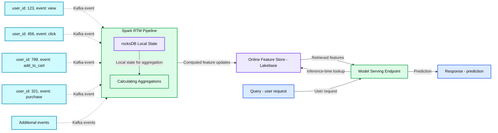
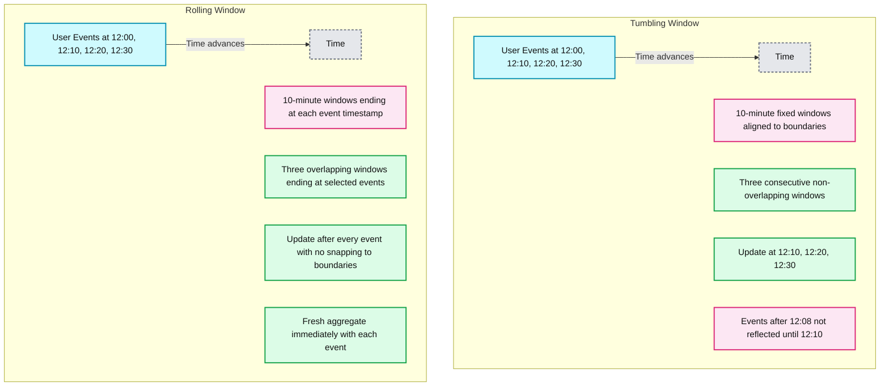

# How Databricks Feature Store serves features with sub-second freshness

*How Databricks Feature Store serves features with sub-second freshness*

- Source: https://www.databricks.com/blog/how-databricks-feature-store-serves-features-sub-second-freshness
- Published: 2026-08-17
- Authors: Ian Ackerman, Nick Joung, Abhay Bothra
- Categories: platform, product, engineering, data-science-machine-learning, databricks-ai, ai-engineering, industries, financial-services, data-strategy, data-leader, company, news
- Images: 2 total, 2 extracted as architecture

**Key takeaways**

- Databricks Feature Store brings real-time freshness to ML features: streaming aggregations from Kafka can now reach the online feature store with 200ms p99 latency, collapsing feature lag from minutes or hours to milliseconds.
- Spark Real-Time Mode (RTM) makes millisecond feature computation possible: RTM processes rows continuously instead of waiting for microbatches, updates rolling-window aggregates per event, and amortizes checkpointing to keep stateful streaming latency low.
- Lakebase enables high-throughput online feature writes: the separation of compute and storage layers reduces write amplification for frequent small upserts, making fresh feature values quickly available for low-latency model inference.

Machine learning models are only as good as the signals they receive. A fraud detection use case must decide in milliseconds within a user pressing purchase whether to allow the transaction. Making the right call depends on seeing a suspicious transaction happening only seconds ago. Combining a user’s average transactions for the last 30 days along with the total transaction amount from the last 10 minutes highlights the potential fraud. The long-range aggregations set a baseline profile of the user to determine what is normal, while the most recent data helps surface any abnormal behavior right as it’s happening. Personalization faces the same pressure: the freshest signals are what capture a user's current intent and drive engagement.

Spark pipelines are an established way to process bulk data in the Lakehouse for historic baseline features. Running these batch jobs on a regular schedule is well understood, but introduces minutes to hours of lag. For baseline signals about users, this lag is an acceptable price for simpler infrastructure. When models require fresh signals, this infrastructure breaks down; getting down to seconds or milliseconds is not possible in existing feature store platforms. To deliver the value of fresh features, data scientists are forced to implement complex, streaming specific logic to handle these aggregations and stand up custom hosted infrastructure.

Databricks Feature Store lets you author a feature once and use it everywhere: the same definition drives large-scale batch flows offline and highly fresh feature pipelines online. The framework removes the infrastructure burden, orchestrating Spark Real-Time Mode (RTM) for continuous stream processing, Lakebase for streaming-optimized online storage, and Model Serving for retrieval at scale. And once authored, that feature is served in milliseconds: end-to-end p99 latency of 200ms, from an event arriving in Kafka to availability in the online feature store.

## Architecture: Kafka to Feature Store in 200ms

**Summary:** Kafka events enter a Spark RTM pipeline that uses RocksDB local state to calculate aggregations, updates a Lakebase online feature store, and supplies features to a model serving endpoint for predictions.

**Components:**

- Incoming Events: Kafka stream containing user events and additional unspecified events.
- Spark RTM Pipeline: Spark Real-Time Mode for streaming computation.
- rocksDB Local State: RocksDB local state store for fast updates.
- Calculating Aggregations: real-time aggregation on streaming data within Spark RTM.
- Online Feature Store: Lakebase operational feature store for low-latency lookups.
- Model Serving Endpoint: serving endpoint for real-time predictions with inference-time lookup.
- Query: user request.
- Response: prediction.

**Flows:**

- User 123 view event -> Spark RTM Pipeline: incoming event.
- User 456 click event -> Spark RTM Pipeline: incoming event.
- User 789 add_to_cart event -> Spark RTM Pipeline: incoming event.
- User 321 purchase event -> Spark RTM Pipeline: incoming event.
- Additional events -> Spark RTM Pipeline: incoming events.
- rocksDB Local State -> Calculating Aggregations: local state for aggregation.
- Spark RTM Pipeline -> Online Feature Store: computed feature updates.
- Online Feature Store -> Model Serving Endpoint: retrieved features.
- Model Serving Endpoint -> Online Feature Store: inference-time feature lookup.
- Query -> Model Serving Endpoint: user request.
- Model Serving Endpoint -> Response: prediction.

**Numbers:** User IDs: 123, 456, 789, 321. No units, percentages, sizes, or latency values are visible.

source image: https://www.databricks.com/sites/default/files/blog_images/how-databricks-feature-store-serves-features-with-blog-img-2.png

Let’s take a look under the hood to see how the Databricks Feature Store takes an infrastructure agnostic Feature definition and builds a pipeline to consistently compute it within milliseconds. The end-to-end path for a streaming feature looks like this:

1. Events land in Kafka - raw data like credit card transactions, ad impressions, or clickstream events
2. A Spark RTM pipeline on serverless Lakeflow Spark Delta Pipelines continuously processes events, computing rolling aggregations in real time
3. Updated aggregates are written to Lakebase via a new streaming JDBC sink, landing in the online feature store
4. Model Serving endpoints retrieve the latest features from Lakebase at inference time, feeding them into the model automatically

Let’s tie this to our fraud feature, the sum of a user’s transaction amount over the last 10 minutes. Each incoming event carries the transaction details - amount, location, user id, merchant information - and is routed to a stateful pipeline. The pipeline consults a local RocksDB instance holding the user's running transaction total, with expiry times that keep the window to the last 10 minutes. The pipeline reads and increments the value locally, then writes the updated feature value to Lakebase. So when a query comes to the model to approve a new transaction, an up-to-date transaction sum is available with sub-second freshness in the feature store. This sum feature will be fetched along with the user’s historic purchasing baseline to inform approval. A sum well above the historic baseline is a strong indicator to the model of potential fraud.

Each component in this pipeline has been optimized so incoming events are routed, aggregations are calculated, and features are written to the online store as quickly as possible.

## Rolling window: update aggregations in milliseconds

**Summary:** Fixed tumbling windows update aggregates at 10-minute boundaries, while rolling windows span the preceding 10 minutes and update after every event.

**Components:**
- User Events: red event markers on two time axes; no technology specified.
- Baseline: Tumbling Window: fixed, non-overlapping aggregation intervals aligned to time boundaries.
- Tumbling Windows: three red window bars.
- Tumbling update markers: dashed red lines marking boundary updates.
- Tumbling configuration: 10-minute windows; updates only at boundaries.
- Tumbling outcome: events after 12:08 are not reflected until 12:10; less responsive to recent activity.
- Rolling Window: aggregation intervals defined relative to event time.
- Rolling Windows: three green window bars ending at selected events.
- Rolling update markers: dashed green lines marking event-triggered updates.
- Rolling configuration: 10-minute windows ending at each event timestamp; no snapping to boundaries.
- Rolling outcome: each event produces a fresh aggregate immediately; more accurate and responsive.
- Legend: User Event, Tumbling Window fixed, Rolling Window per-event, and Fixed Window Boundary.

**Flows:**
- Tumbling User Events -> Time: events progress chronologically along the right-pointing timeline.
- Rolling User Events -> Time: events progress chronologically along the right-pointing timeline.

**Numbers:** Window size: 10 minutes in both panels; tumbling updates every 10 min. Both timelines show 12:00, 12:10, 12:20, and 12:30. Tumbling outcome references 12:08 and 12:10.

source image: https://www.databricks.com/sites/default/files/blog_images/how-databricks-feature-store-serves-features-with-blog-img-3.png

Before going deeper into the infrastructure, let’s talk about aggregation features and shifting from a paradigm of batch sync to real-time updates.

Aggregation features over a time window - for example counts, sums, or averages - are powerful and flexible signals for real-time ML. A long term batch feature sets a historical baseline for the user over a period of time which allows the model to adapt and understand behavior of each user. A short, fresh feature reacts quickly to changing situations to distinguish new user interest or fraudulent activity. Time windows define a time range (e.g. 10 minutes) as well as how those time ranges should evolve over time (e.g. overlap or disjoint).

Databricks Feature Store supports 3 different time windows:

- Tumbling windows are aligned to wall-clock intervals and begin as soon as the last interval ends. A 10-minute tumbling window might cover 12:00–12:10, then 12:10–12:20. Events are batched into these fixed intervals with a feature value being emitted at the end of an interval. This means the aggregate is only fresh at interval boundaries
- Sliding windows are also aligned to wall-clock intervals but allow for overlap in intervals. A 10-minute sliding window with a 5 minute slide interval might cover 12:00–12:10, then 12:05–12:15, and then 12:10-12:20.
- Rolling windows are not aligned to wall-clock but look backward from each event's timestamp with millisecond resolution. "The sum of transactions in the last 10 minutes as of the current wall-clock" is always up to date, because the window moves with each new event. This makes RollingWindow the natural fit for real-time serving where "now" is always changing.

Tumbling and sliding windows remain useful when a feature doesn’t change frequently: they emit fewer updates, are cheaper to maintain, and fit naturally into simpler scheduled pipelines. Rolling windows trade that efficiency for maximum freshness, which is most valuable for signals where every new event should immediately affect the value served to the model.

Here's how simple it is to define a rolling window feature with the Feature Store declarative API:

## Spark Real-Time Mode: the engine for feature computation

Moving into the underlying infrastructure, the streaming pipeline is what makes fresh features at high throughput possible. This pipeline takes data from Kafka all the way to the online feature store. The streaming pipeline is powered by [Spark Real-Time Mode](https://www.databricks.com/blog/real-time-mode-ultra-low-latency-streaming-spark-apis-without-second-engine) (RTM), a fundamentally new execution mode for Spark Structured Streaming. RTM is the key architectural innovation that makes millisecond freshness possible.

## Concurrent stages and stateful processing

In traditional microbatch mode (MBM), Spark processes streaming data in discrete batches. Each batch collects events over a configurable interval, processes them sequentially through each stage, checkpoints, and then starts the next batch. This creates a floor on latency: even with aggressive tuning, MBM pipelines for stateful aggregations typically operate on the order of seconds to minutes. RTM on the other hand runs stages concurrently. Aggregation operators eagerly process rows the moment they're available, without waiting for the upstream stage to finish processing all the rows.

For rolling aggregations there are two important stages. The first stage is data processing, schema validation, data coalescing, type casting. This runs the business logic that converts generic action events to the shape for your feature aggregation. The second stage is aggregating data per entity to calculate the rolling window aggregations. Each incoming row immediately updates the aggregate in a local RocksDB state store and emits the new value downstream. Window expiration also happens per-row: when the window duration elapses for a given event, the pipeline removes that event's contribution and emits the corrected aggregate to Lakebase. RocksDB runs locally on each executor allowing state sizes that exceed the memory capacity of the cluster.

## Pipeline state management in serverless RTM

Checkpointing is essential for fault tolerance in stateful streaming as it allows the pipeline to recover from any individual pipeline worker failing. But checkpointing has its cost. In microbatch mode, Spark checkpoints at every batch boundary, and each checkpoint adds latency to the pipeline because it interacts with cloud object stores.

RTM takes a different approach: the cost of planning and checkpointing is amortized over longer intervals. The cost of checkpointing is spread across all the rows processed in that interval rather than blocking the pipeline at each batch boundary. This doesn't sacrifice fault tolerance. Exactly-once processing guarantees are maintained - on failure, the pipeline replays at most 5 minutes of data from the Kafka source. The tradeoff is a modest increase in replay volume for a significant reduction in steady-state processing latency.

Feature Store runs serverless RTM pipelines on Lakeflow Spark Delta Pipelines (SDP), eliminating cluster management and capacity planning entirely. You don't provision machines, tune executor counts, or worry about cluster maintenance. When infrastructure updates require a pipeline restart, SDP coordinates the handoff: the new serverless cluster is provisioned and fully ready before the old one stops. This coordination is synchronized at the 5-minute checkpointing intervals, minimizing downtime and avoiding reprocessing gaps. This results in near-zero interruption to feature freshness during maintenance windows.

## Lakebase: minimizing overhead for streaming writes

Databricks Feature Store uses Lakebase for storing the online feature values for inference. The Lakebase architecture of separating compute and storage allows for autoscaling to handle variable load for model inference. The Online Feature Store leverages this capability to scale to 10s of thousands of reads per second with 10s of ms of latency.

Streaming writes are particularly challenging as they consist of a large number of small upserts as fresh rolling window values are emitted on each kafka row received. In standard Postgres, this pattern can generate large write-ahead log volume because Postgres uses full page writes to allow easier recovery. After each checkpoint, the first modification to a page writes the full 8KB page image into the write-ahead-log (WAL), not just the small logical change. For hot entity rows that are updated frequently, this causes WAL amplification to be the bottleneck for write throughput, replication, and recovery overhead.

Lakebase now leverages the separation of compute and distributed storage to minimize streaming write amplification versus standard Postgres. The Lakebase architecture lets Postgres write small, compact change records instead of repeatedly writing full 8KB page snapshots into the WAL. Durability is still protected because those compact records are acknowledged by a quorum of distributed safekeeper nodes. Full page snapshots are still needed for recovery after enough change records, but those are generated later in the storage layer rather than bloating the write path. For Feature Store, the result is that RTM can continuously publish fresh feature values into Lakebase with far less WAL amplification and minimal additional latency.

## Model Serving: low-latency feature retrieval at scale

The final leg of the journey is retrieving fresh features from Lakebase and delivering them to the model at inference time. This is handled by Databricks Model Serving, a fully managed serving infrastructure optimized for high-QPS, low-latency workloads.

Model Serving is built for the throughput demands of real-time ML:

- Fully horizontally scalable architecture: the inference server, authentication layer, proxy, and rate limiter all scale independently, sustaining 100K+ QPS on CPU endpoints
- Fast elastic scaling: the system adapts to traffic spikes and drops without over-provisioning, keeping costs aligned with actual demand
- Govern and monitor models: manage network access, manage permission for model endpoints, and monitor quality using AI Gateway.

For the Feature Store, the integration is seamless. When a model is logged with MLflow, its feature dependencies are recorded. At inference time, Model Serving automatically looks up the required features from Lakebase - no custom lookup code, no manual plumbing. The fresh aggregate computed by RTM and stored in Lakebase is retrieved and joined with the inference request transparently.

## Feature Store beyond streaming

Performant realtime capabilities are only part of what a Feature Store can solve for. Two other challenges are worth brief consideration:

## Training data for stream features

Training data generation can be difficult for streaming features since the short retention windows on the streams requires maintaining a separate offline store. Databricks Feature Store solves for this by storing an offline copy of the ingested Kafka data. For model training, the Feature Store calculates the same feature values as streaming pipelines would for historic values and does point-in-time accurate joins. This same capability is used to backfill online streaming features to allow fast launching to production.

## Integrations

As shown above, Feature Stores orchestrate several complex infrastructure components. That fragmentation can make governance, lineage, and feature reuse difficult. It also slows development, since engineers must coordinate changes across system boundaries.

In Databricks, Features are first-class objects in Unity Catalog - discoverable, governed with access controls, and tracked with full lineage. Feature transformations are packaged with the model, MLflow captures which features were used, and deployment lineage connects models to their feature dependencies. The platform is a one stop shop for developing, deploying, and governing your entire ML stack.

Databricks' Feature Store orchestrates key building blocks like Spark RTM, Lakebase, and Model Serving so you get best-in-class latency and scale without managing the infrastructure yourself. Each of these systems have been finely optimized for streaming workloads to make 200 ms freshness a reality for machine learning features.

Please take a look at [Streaming Pipeline](https://docs.databricks.com/aws/en/machine-learning/feature-store/streaming-declarative-features) documentation for how to define streaming features. Experiment with existing features to see how much stronger a signal they would provide with ms level freshness.

If you wish to understand the underlying technology better, see [Lakebase blog on faster writes](https://www.databricks.com/blog/how-lakebase-architecture-delivers-5x-faster-postgres-writes) and [RTM architecture breakdown](https://www.databricks.com/blog/breaking-microbatch-barrier-architecture-apache-spark-real-time-mode).

If these are the kinds of problems you want to work on, [we’re hiring](https://www.databricks.com/company/careers/open-positions?department=Engineering&amp%3Blocation=all)!
