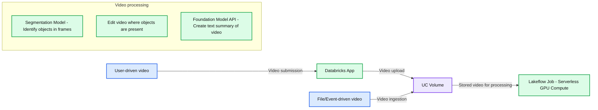

# How Databricks is turning video into searchable, actionable intelligence

- Source: https://www.databricks.com/blog/how-databricks-turning-video-searchable-actionable-intelligence
- Published: 2026-06-26
- Authors: Justin Monaldo, Kacey Hertan, Yvan Aquino
- Categories: platform, solutions, engineering, data-science-machine-learning, databricks-ai, industries, public-sector, data-strategy, best-practices
- Images: 2 total, 1 extracted as architecture

**Key takeaways**

- How public sector agencies can transform raw video from drones and cameras into searchable, AI-ready intelligence
- How Databricks uses VLMs, serverless GPUs, and Lakeflow pipelines to automatically detect, truncate, and summarize key video moments
- How scalable, model-agnostic architecture enables real-time video analysis for public safety, infrastructure, and urban operations

A utility company deploys drones to inspect hundreds of miles of power lines. A police department pulls hours of traffic camera footage to investigate a hit-and-run accident. An urban planning team leverages camera footage to analyze pedestrian and traffic flow.

Terabytes of video data are generated every single day that can provide valuable insights into everything from operational efficiency to public safety. But almost none of it gets analyzed in any meaningful way. That’s because combing through this unstructured video data is massively time-consuming and expensive.

Imagine being able to simply apply natural language queries to video content at scale to not just find specific content—but analyze, assess, and learn from it.

Databricks can support exactly that. The approach? Treat video as a data engineering problem.

## How did Databricks change the approach to video analysis?

The traditional approach to video analysis is to throw more and more human analysts at the problem. Advancements in deep learning, computer vision, and most-recently vision language models (VLMs) have made it possible for computers to identify objects in videos with high accuracy. But scaling inference and orchestrating pipelines with huge quantities of unstructured data has made the logistics of building these pipelines difficult for organizations. This is especially true for applying VLMs to the problem. VLMs provide flexibility in prompting, not requiring the model to be pre-trained or fine-tuned on specific classes before use, but are larger and slower than traditional object detection models, presenting scaling challenges.

In Databricks, you can focus on how video analysis using these models fits into data pipelines, instead of the complexities of model inference and infrastructure.

Expand

Users can search video footage instantly using VLMs and natural language.

## How does Databricks process and analyze video at scale?

This approach can be demonstrated in a Databricks app deployed directly in a Databricks workspace. A user uploads a video or points to one already stored in a Databricks Volume, enters a natural language prompt describing what they're looking for directly — e.g. white box trucks, security guards, solar panels — and kicks off the processing pipeline with a single click

From there, Databricks Serverless GPU Compute (SGC) takes over. A Lakeflow job is triggered, which grabs pre-warmed GPUs and immediately starts processing the video through Meta's SAM3 segmentation model within seconds. The model identifies objects of interest matching the prompt in each frame of the video. The video is truncated down to only those moments and rewritten into another Databricks Volume. For example, a 26-minute traffic camera video was reduced to one minute and 55 seconds of relevant footage, with original timestamps preserved so reviewers can jump back to the source if needed. Each truncated clip is then passed to a foundation model via the Databricks Foundation Model API (FMAPI) for AI-generated summarization, providing textual data which can be written to a table or flow to additional downstream processes.

Because this entire process is treated as a data engineering problem, the pipeline is explicitly model agnostic, leveraging MLflow to enable users to choose the model they prefer, or even bring new or fine-tuned models to the workflow. MLflow model signatures standardize the model inputs and outputs to ensure continuity and flexibility. Any model that you download from Huggingface or train from scratch can be leveraged in this pipeline. SAM3 can be swapped for YOLO models, other transformer-based vision models, or fine-tuned domain-specific models.”

That flexibility extends to the summarization and anomaly detection layer too. Any multi-model foundation model or smaller image captioning models can be used to convert the frame contents to text descriptions. Having these text descriptions can feed text-based AI workflows to summarize video for analyst review, or identify unexpected content and flag video segments for review. Making models interchangeable without breaking the pipeline makes this example extensible to almost any video processing use case.

Because serverless GPU compute is preconfigured to work with popular NVIDIA GPUs and deep learning frameworks, it’s just a matter of writing your data engineering code. You don’t have to worry about GPU compute capacity or Python package version compatibility with CUDA.

## How does the pipeline handle video at scale?

The app-triggered workflow is just one way to interact with the pipeline. The same pipeline can run as a file or event-driven process: video lands in a Databricks Volume, it automatically triggers the LakeFlow job to produce the truncated output and text-base analysis without any human intervention. Downstream, that text can then trigger alerts, route to reviewers, or feed into additional AI processing.

*Databricks generates a truncated video and AI-powered summary, surfacing only the most relevant moments for fast or automated review.*

Concurrency is handled through a simple configuration. You can dump 20 videos in at once and it will kick off 20 versions of that same job running at the same time. Each job grabs its own serverless GPU compute independently, scaling horizontally as needed, and releases resources when done. No cluster management required, and no paying for GPUs when they’re not in use.

## Where can video intelligence be applied?

This app and pipeline are a starting point. After deployment to any Databricks workspace the underlying architecture supports any scenario where large volumes of video need to be processed, searched or summarized. This includes infrastructure inspection, physical security, public safety, airport operations and more. The GitHub repo containing the app and pipeline code is publicly available for teams who want to deploy it, extend it, or adapt it to their own use cases.

*Databricks orchestrates an end-to-end video intelligence pipeline that ingests, processes and analyzes video at scale to deliver searchable insights in minutes.*

**Summary:** Video enters through a Databricks App or a file/event-driven path, lands in a UC Volume, and feeds a Lakeflow Job alongside processing stages for object identification, video editing, and text summarization.

**Components:**

- User-driven: user-provided video.
- Databricks App: application interface for video submission.
- File/Event-driven: video ingestion from files or events.
- UC Volume: Unity Catalog volume for video storage.
- Lakeflow Job: orchestration using Serverless GPU Compute.
- Segmentation Model: identifies objects in frames.
- Video editing: edits video where objects are present; technology unspecified.
- Foundation Model API: creates a text summary of video, with Claude, OpenAI, Meta, and Gemini logos shown.

**Flows:**

- User-driven -> Databricks App: video submission.
- Databricks App -> UC Volume: video upload.
- File/Event-driven -> UC Volume: video ingestion.
- UC Volume -> Lakeflow Job: stored video for processing.

The right-hand processing stages are grouped together without explicit connecting arrows.

**Numbers:** none

source image: https://www.databricks.com/sites/default/files/blog_images/how-databricks-is-turning-video-into-searchable-blog-img-3.png

*Databricks orchestrates an end-to-end video intelligence pipeline that ingests, processes and analyzes video at scale to deliver searchable insights in minutes.*

## Build your video intelligence pipeline on Databricks today

See how your agency can process, summarize and search massive volumes of video without complex ML workflows. Explore [Databricks for Public Sector](https://www.databricks.com/solutions/industries/public-sector) and [connect with our public sector team](https://www.databricks.com/company/contact?itm_source=www&amp%3Bitm_category=solutions&amp%3Bitm_page=public-sector&amp%3Bitm_location=body&amp%3Bitm_component=large-header&amp%3Bitm_offer=contact).
