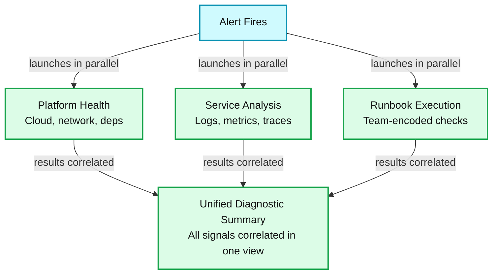
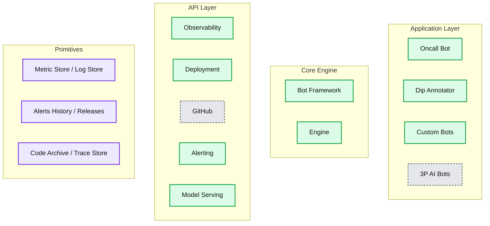

# How Databricks Uses AI to Accelerate Incident Investigation

*Lessons from building AI debugging agents that assemble context, execute runbooks, and help on-call engineers reach root cause faster.*

- Source: https://www.databricks.com/blog/how-databricks-uses-ai-accelerate-incident-investigation
- Published: 2026-08-24
- Authors: Avijeet Gupta, Bhuban Seth, Kusum Madarasu
- Categories: engineering, databricks-ai, ai-engineering
- Images: 2 total, 2 extracted as architecture

**Key takeaways**

- AI SRE assists engineering teams across Databricks operate 100s of microservices deployed across 1,500 Kubernetes clusters, spanning 70+ regions and three clouds
- The platform enables teams to build and maintain their own composable agentic runbooks, allowing the system to successfully scale across 150+ teams and 2,000+ daily investigations.
- To ensure reliability, the system prioritizes transparency over black-box reasoning by linking every diagnostic recommendation directly to verifiable raw evidence, forcing a "context-first" development approach.

In our [previous blog post](https://www.databricks.com/blog/how-we-debug-1000s-databases-ai-databricks), we shared how Databricks uses AI to debug thousands of databases. Here, we continue that story by exploring how our engineers use AI to operate 100s of microservices across 1500+ Kubernetes clusters, spanning 70+ regions and three clouds.

When something breaks at 2 AM, the on-call engineer needs to answer one question quickly: What changed?

AI SRE is an AI-powered debugging agent that begins investigating as soon as an incident fires. It correlates signals from across our stack and guides engineers through root cause analysis.

In this post, we describe the debugging journey that shaped AI SRE, the architecture behind it, and the engineering principles we followed to make an LLM-powered system trustworthy during incidents.

## Before AI SRE: The 2 AM Experience

Picture a typical on-call page. A latency spike hits a customer-facing API. The engineer wakes up and starts the familiar drill:

- Inspect service metrics across dashboards and regions.
- Search logs for errors that are both relevant and unusual.
- Review deployments, dependency changes, and feature-flag updates.
- Check cloud, network, and shared-platform health.
- Find and run-through the appropriate runbook.

Each of these workflows work fine in isolation, but the debugging workflow i.e. the act of connecting signals across them lives entirely in the engineer's mind. Experienced engineers could do it in a few minutes because they'd seen the pattern before. Newer engineers might spend hours, or escalate to someone.

The tools were not the primary problem. The burden of connecting their signals fell on the on-call engineer working against an SLA.

## Starting with the Customer, Not the Technology

We didn't start by building an agent. We started by observing people debug.

Over several weeks, we interviewed on-call engineers across dozens of teams to map their debugging journeys end-to-end. We read postmortems and investigation docs. We asked a simple question: where do you spend your time, and where do you get stuck?

Three patterns emerged consistently:

- **Context assembly consumed most of the clock.** The actual "aha" moment i.e. identifying the root cause was often fast once an engineer had the right signals in front of them. But gathering those signals (the right metric, the right time window, the relevant deployment, the upstream dependency that changed) consumed 60–80% of investigation time.
- **Knowledge was unevenly distributed.** Every team had a couple of experts who "just knew" how their system failed. When these experts were unavailable, investigations slowed dramatically. Runbooks existed but were often stale or incomplete, and they couldn't answer novel failure modes.
- **Platform health was invisible until it wasn't.** Many incidents traced back to a large scale infrastructure issue like cloud provider or networking outage or a critical system failure like Auth. But engineers debugging at the application layer had no easy way to check those signals, so they'd spend time chasing application-level hypotheses before discovering the problem was at lower infra layers.

Once we recognized debugging as a sequence of repeatable investigative steps followed by expert judgment, it became clear that AI agents could accelerate the work. But no single team could build an agent that understood every service, signal, and failure mode. We needed a shared platform that handled the common building blocks like gathering context, executing tools and runbooks, and correlating evidence, while allowing teams to extend it with their own operational knowledge. The question shifted from **Can we automate debugging? to How do we give every team an AI-powered platform for faster, informed diagnosis and resolution?**

## Introducing AI SRE

AI SRE supports two complementary experiences: automatic triage, which begins when an incident fires, and interactive investigation, which lets on-call engineers explore hypotheses and request additional evidence.

### Automatic Triage When an Incident Fires

**Summary:** An alert launches platform health checks, service analysis, and runbook execution in parallel, then correlates their results into a unified diagnostic summary.

**Components:**

- Alert Fires: investigation trigger; technology unspecified.
- Launches in parallel: concurrent execution of three investigation tracks.
- Platform Health: cloud, network, and dependencies; specific technologies unspecified.
- Service Analysis: logs, metrics, and traces; specific technologies unspecified.
- Runbook Execution: team-encoded checks; technology unspecified.
- Results correlated: combines findings from the investigation tracks.
- Unified Diagnostic Summary: all signals correlated in one view; technology unspecified.

**Flows:**

- Alert Fires -> Platform Health: launches investigation in parallel.
- Alert Fires -> Service Analysis: launches investigation in parallel.
- Alert Fires -> Runbook Execution: launches investigation in parallel.
- Platform Health -> Unified Diagnostic Summary: results correlated.
- Service Analysis -> Unified Diagnostic Summary: results correlated.
- Runbook Execution -> Unified Diagnostic Summary: results correlated.

**Numbers:** none

source image: https://www.databricks.com/sites/default/files/inline-images/2026-08-Blog-How-AI-SRE-Helps-Databricks-Teams-Automatically-Root-Cause-Incidents-Inline-960x510-2x.png

When an incident fires, AI SRE kicks off immediately before the engineer has even opened their laptop. It launches three investigation tracks **in parallel**, gathering complementary evidence to produce an initial assessment:

**Platform health checks** assess the environment the service is running in.

- Is the underlying cloud infrastructure healthy?
- Are there ongoing network issues in the relevant region?
- Are upstream dependencies (databases, message queues, shared services) experiencing degradation?

This alone eliminates a large class of red herrings so an engineer no longer spends 30 minutes debugging their application code only to discover the root cause was a large-scale infrastructure issue.

**Service-level analysis** pulls the relevant logs, metrics, and traces for the affected service and its immediate dependencies. It examines recent deployments and configuration changes. It identifies anomalies relative to the service's baseline behavior, not just "CPU is high," but "CPU spiked 3x at 2:47 AM, coinciding with a deployment that changed the batch size in the processing pipeline."

**Runbook execution** is where AI SRE assumes a team-specific persona. Teams encode their debugging procedures like the checks a domain expert would run, the thresholds they'd look for, the mitigation steps they'd take. Teams can convert their existing runbooks into **agentic runbooks** using skills. These skills draw on the codebase, observability data, and past incident history to make runbooks more accurate and context-aware. It then executes these steps on behalf of the on-call engineer, performing the same investigation a domain expert would, but in seconds rather than minutes.

By the time the engineer reads the incident details for the first time, AI SRE has already assembled a rich diagnostic summary: here's what broke, here's what changed, and here's what your team's runbook says to check, all signals, correlation and next steps in a single view.

### Interactive Debugging for Deeper Investigation

Not every investigation ends with auto-triage. Sometimes the root cause is subtle, or the engineer wants to explore a hypothesis. The AI SRE UI provides an interactive debugging environment where engineers can ask follow-up questions in natural language, request additional signals, and drill into specific time windows or components.

This is where the combination of structured health checks and conversational AI becomes powerful. An engineer might ask, "Was there anything unusual about the Kafka consumer lag in the 10 minutes before this alert?" AI SRE fetches the relevant metrics, overlays them against the incident timeline, and explains what it finds.

### A Layered Architecture for Debugging

Our core insight from the customer interviews was that debugging isn't one problem, it's a stack of problems, and solving them requires deliberate abstractions. We designed AI SRE as a layered platform, where each layer has a clear responsibility and the layers above it can focus on increasingly higher-level concerns.

**Summary:** Four layers organize debugging applications, a core engine, operational APIs, and underlying data primitives.

**Components:**
- Application Layer: groups debugging applications; technology unspecified.
- Oncall Bot: technology unspecified.
- Dip Annotator: technology unspecified.
- Custom Bots: technology unspecified.
- 3P AI Bots: technology unspecified.
- Core Engine: groups framework and engine components; technology unspecified.
- Bot Framework: technology unspecified.
- Engine: technology unspecified.
- API Layer: groups operational integrations; technology unspecified.
- Observability: technology unspecified.
- Deployment: technology unspecified.
- GitHub: GitHub integration.
- Alerting: technology unspecified.
- Model Serving: technology unspecified.
- Primitives: groups foundational data stores and records; technology unspecified.
- Metric Store: technology unspecified.
- Log Store: technology unspecified.
- Alerts History: technology unspecified.
- Releases: technology unspecified.
- Code Archive: technology unspecified.
- Trace Store: technology unspecified.

**Flows:**
- None. No arrows are visible.

**Numbers:** 3P appears in the label “3P AI Bots”; no quantitative measurements are visible.

source image: https://www.databricks.com/sites/default/files/inline-images/2026-08-Blog-How-AI-SRE-Helps-Databricks-Teams-Automatically-Root-Cause-Incidents-Inline-960x620-2x_0.png

**Primitives** form the foundation: the raw operational data that every investigation ultimately depends on. Primitives for metrics, alerts, logs, release information and code already exist, but accessing them during an incident meant jumping between five different tools with five different query languages. The primitives layer doesn't replace these systems; it acknowledges them as the source of truth.

The **API Layer** utilises primitives and provides controlled, uniform access to the underlying data. Rather than having every debugging tool querying the data sources like the logs or metrics store directly, we built purpose-specific APIs: an Observability API, a Deployment API and an Alerts API that handle authentication, rate limiting, and data normalization. This is the layer that turns "raw infrastructure" into "debuggable infrastructure." It also means that when we swap out an underlying system, the debugging tools above don't break.

The **Core Engine** is where the intelligence lives. A bot framework provides the orchestration layer for building debugging workflows, and the engine handles the mechanics of parallel execution, result correlation, and LLM-powered synthesis. This is the platform that our first-party bots run on but critically, it's also the same platform available to every team that wants to build their own.

The **Application Layer** is where debugging actually happens. This is where our platform-level incident triage bot runs. It's also where third-party AI tools can plug in, providing complementary capabilities without us rebuilding everything from scratch.

This separation lets us improve data access and orchestration independently while supporting both centrally maintained workflows and team-owned runbooks

## Building for Reliability in a Non-Deterministic World

Making an LLM-powered agent reliable enough for incident response, where trust is everything, required deliberate engineering. A few principles guided us:

**Structured checks before open-ended reasoning.** AI SRE runs deterministic platform health checks and runbook steps first. The LLM layer synthesizes and explains the results, but the data gathering isn't left to the model's judgment.

**Transparency over black-box answers.** Every conclusion AI SRE presents links back to the underlying evidence: the specific metric, the log line, the deploy diff. Engineers can verify the reasoning, not just trust it. This was non-negotiable because on-call engineers won't act on a recommendation they can't audit.

**Graceful degradation.** If AI SRE can't determine a root cause with confidence, it says so explicitly and presents the evidence it did gather, organized by relevance. A partial investigation that's honest about its limits is far more useful than a hallucinated diagnosis.

## Impact

AI SRE now supports more than 150 teams across Databricks, with 250+ weekly active users running over 2,000 investigations each day and saving several hours of debugging time. We have received positive feedbacks since the launch:

> “The storage platform team relies heavily on AI SRE for triage. It front-runs my investigations: before I even open an alert, the agent has correlated signals and produced an initial root cause analysis. Kudos to the team for building a truly generic debugging platform that lets multiple teams weave agentic workflows into their day-to-day.”—Gaurav Garg, Sr. Staff Engineer

> “Before AI SRE, the first stretch of an incident was context assembly: dashboards, time windows, fleet-wide filters. Now the relevant context lands in one place, already scoped to the alert/incident. I don't have to take the agent's word for it. The evidence is embedded in the investigation, and one click opens the underlying tool, pre-filtered, so I can verify it myself.”—Himanshu Mishra, Senior Engineer

> “AI SRE has transformed incident response by unifying metrics, logs, and dependency health, accelerating incident triage, surfacing root causes earlier, thereby reducing company-wide MTTR.”—Adama Kone, Manager - NOC Team

The most important outcome was not replacing engineers’ judgment. It was giving them a faster, evidence-backed starting point for investigation.

## What We Learned

Three takeaways from building AI SRE:

**Let teams own their expertise.** A centralized agent that tries to encode every team's domain knowledge will always be stale and brittle. By making agentic runbooks a composable primitive that teams own and maintain, we turned AI SRE into a platform that gets smarter as it grows without the platform becoming the bottleneck.

**Build the context layer before optimizing the model.** We spent more time mapping how engineers actually investigate incidents than we did on prompt engineering. That upfront investment in understanding the problem meant we built the right thing i.e. an agent that assembles context and executes known checks rather than the obvious thing, which would have been a chatbot bolted onto our observability system.

**Earn trust through traceable evidence.** On-call engineers operate under pressure and can't afford to chase false leads. Every recommendation AI SRE makes is backed by traceable evidence. This transparency is what turned skeptical early adopters into daily users.

**Guardrails matter more for agents than for people.** Giving agents access to observability data meant redesigning our API layer, not just opening it up. Agents query differently than humans do. They hit endpoints in bursts, run checks in parallel, and don't get tired or back off on their own. We had to build in guardrails so agents could work fast without taking down infrastructure that also powers business-critical alerting and monitoring.

## What's Next

AI SRE today focuses on the investigation phase of incident response: understanding what happened and why. The natural next step is extending into guided mitigation not just diagnosing the problem, but helping engineers take the right corrective action safely.

We're also investing in cross-incident learning: using patterns from past incidents to improve future diagnoses, surface recurring issues before they page, and help teams identify systemic reliability gaps.

## Join Us

As we look ahead, we’re excited to keep pushing the boundaries of how AI can shape production systems and make complex infrastructure feel effortless. If you’re passionate about building the next generation of AI-powered internal platforms, join us!
