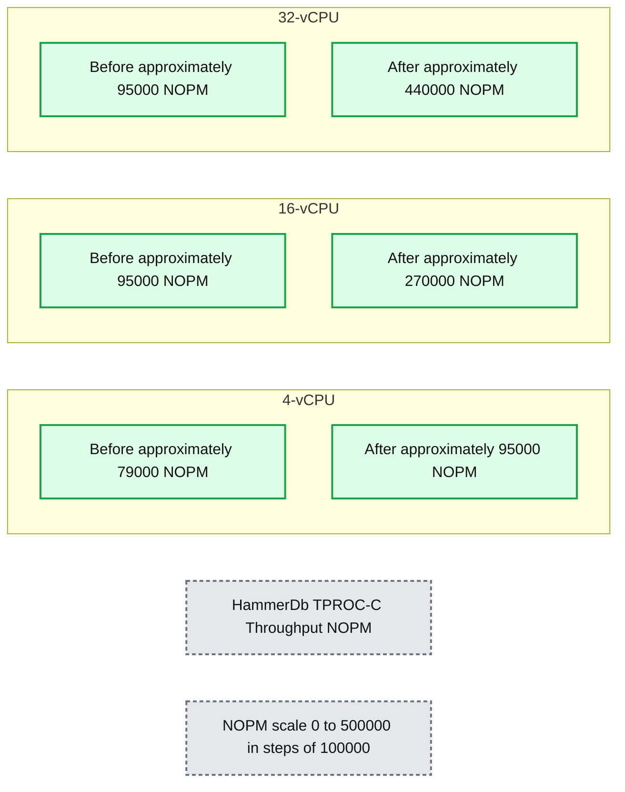
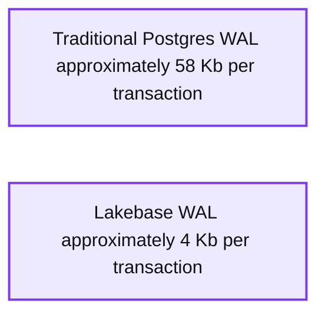
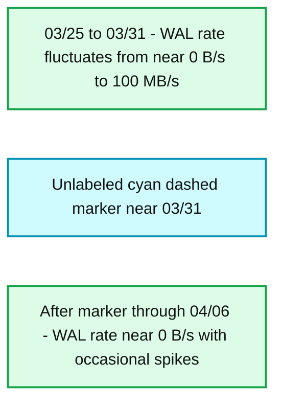

# How lakebase architecture delivers 5x faster Postgres writes

*Solving the structural performance bottleneck in managed Postgres*

- Source: https://www.databricks.com/blog/how-lakebase-architecture-delivers-5x-faster-postgres-writes
- Published: 2026-05-07
- Authors: David Wein, Vlad Lazar
- Categories: engineering
- Images: 6 total, 6 extracted as architecture

**Key takeaways**

- Lakebase now delivers up to 5x faster throughput for write-heavy OLTP workloads, a common pain point for high-scale Postgres applications.
- The lakebase architecture enables us to offload critical crash-recovery tasks from the compute layer to distributed storage.
- Production sampling shows write throughput improvements of 4.5x on 32 vCPU computes and a 94% reduction in WAL traffic, all while reducing read tail latency by 2x without risking durability.

In a [lakebase](https://www.databricks.com/blog/what-is-a-lakebase), compute and storage are separated by design. While this separation was originally built for[operational flexibility, including scaling, branching, and instant recovery](https://neon.com/docs/introduction/architecture-overview), it also unlocks a massive performance frontier.

By decoupling these layers, we can offload work from your Postgres compute to our distributed storage in ways that are structurally impossible in traditional, monolithic Postgres deployments. In this post, we will explore how we exploited this architectural advantage to eliminate a decade-old Postgres bottleneck to improve Postgres write throughput by 5x, while reducing read tail latencies by 2x and WAL traffic by 94%.

## **The hidden cost of traditional Postgres durability**

To understand how we achieved a 5x improvement in managed Postgres performance, we have to look at how traditional Postgres handles durability.

In Postgres, every database change is first saved to a sequential log (the Write-Ahead Log, or WAL) to ensure data isn't lost in a crash. To keep crash recovery times fast, Postgres periodically performs a background cleanup event called a "checkpoint." **Unlike a snapshot, a checkpoint is simply a milestone marker in the log.** During a checkpoint, Postgres takes all the modified data currently in memory (managed in 8KB chunks called "pages") and flushes it to the main disk, up to a specific point in the log. If a crash happens, Postgres restores your data by starting at that checkpoint milestone and replaying the recent WAL logs over the disk.

However, there's a risk: if the server crashes exactly while saving an 8KB page to disk, the page might only get partially written, resulting in a corrupted "torn page." If Postgres tries to replay a tiny log update over a torn page, the data is permanently ruined. To fix this, Postgres has to ensure it never relies on a corrupted disk for recovery.

It does this using a "Full Page Write" (FPW). The very first time a page is modified *after* a checkpoint milestone, Postgres doesn't just log the tiny change; it copies the *entire* 8KB page into the WAL. If a crash happens and the disk page is torn, Postgres ignores the ruined disk, grabs the pristine 8KB backup from the WAL, and uses that as the perfect starting point to replay the rest of the logs. While this guarantees absolute safety, it is expensive: on write-heavy applications, logging entire 8KB pages can inflate log volume by up to 15x, often becoming the system's biggest performance bottleneck.

## **The lakebase solution: eliminating the risk of torn pages**

In the lakebase architecture, your compute is stateless. It does not rely on a local data directory. Instead, it streams WAL to a Paxos-based quorum of safekeepers. 

Because there is no local-disk page to tear, the failure mode FPW was designed to prevent simply does not exist. However, naively turning off FPW creates a secondary problem: read performance. Without those periodic full page images in the log, the storage layer would have to replay an infinitely long chain of small deltas to reconstruct a page for a read request. What was once a bounded O(checkpoint frequency) replay becomes an unbounded chain, leading to a spike in read latency and resource consumption.

## **Innovation: image generation pushdown to distributed storage**

We solved this by moving the intelligence from the compute node to the storage layer. We call this image generation pushdown.

When Postgres compute requests a page from storage, the pageserver (a component of the Lakebase distributed storage system) reconstructs it by finding the most recent materialized image of that page and replaying any WAL deltas on top. The full page images that the compute used to embed in WAL doubled as periodic reset points in that delta chain, naturally keeping the chain reasonably bounded and reads fast.  For a deeper treatment of this mechanism, see [Deep dive into Neon storage engine](https://neon.com/blog/get-page-at-lsn). 

With full page writes disabled, those reset points disappear. Without additional intelligence in the distributed storage system a frequently-updated page could accumulate a long chain of small deltas with no intervening image. The result would be an undesirable increase in read latency and resource consumption as the pageserver replayed the entire chain to serve a read, increasing latency and resource consumption. 

To avoid this problem we pushed down the image-generation responsibility from the compute's WAL stream into the storage layer, preserving the bounded read behavior of storage while still eliminating the WAL overhead on the compute. The pageserver now generates full page images when a page has accumulated more delta records than a configured threshold without an intervening image. This is a naturally better approach because the decision to generate a new image is based on the actual number of changes to a page rather than the unrelated Postgres checkpoint process. 

**Here’s why this is significantly better for performance:**

1. **Network efficiency: **The compute sends only the compact deltas, which are the actual changes, leading to a **94% reduction in traffic** in our benchmarks.
2. **Scalability:** Work is moved from the single Postgres writer to the distributed, independently scalable storage layer. Image generation for a project branch is now shared across multiple pageservers in the background.
3. **Optimal reads:** When images are generated is now based on actual changes to a page rather than the unrelated Postgres checkpoint process.

## **Quantifying the impact: from lab to production**

We benchmarked this optimization using[HammerDB](https://www.hammerdb.com/) TPROC-C (a TPC-C derived OLTP benchmark) and validated the results across real-world production workloads.

### **1. Serverless compute scaling**

Throughput is measured in new orders per minute (NOPM). The gains scale dramatically with the size of the compute instance:

| **Compute size** | **Before (NOPM)** | **After (NOPM)** | **Throughput gain** |
|---|---|---|---|
| **4-vCPU** | 78,876 | 94,891 | **20%** |
| **16-vCPU** | 95,832 | 269,189 | **2.8x** |
| **32-vCPU** | 95,686 | 439,300 | **4.5x+** |

**Summary:** HammerDb TPROC-C throughput increases from Before to After across 4-vCPU, 16-vCPU, and 32-vCPU compute sizes, with the largest gain at 32-vCPU.

**Components:**
- HammerDb TPROC-C Throughput: benchmark measured in new orders per minute, labeled NOPM.
- Before: dark green throughput series.
- After: lighter green throughput series.
- 4-vCPU: compute size with Before and After bars.
- 16-vCPU: compute size with Before and After bars.
- 32-vCPU: compute size with Before and After bars.

**Flows:**
- none. No arrows are visible.

**Numbers:**
- Compute sizes: 4-vCPU, 16-vCPU, 32-vCPU.
- NOPM axis ticks: 0, 100000, 200000, 300000, 400000, 500000.
- Approximate bar heights in NOPM, since exact values are not labeled:
  - 4-vCPU: Before 79000; After 95000.
  - 16-vCPU: Before 95000; After 270000.
  - 32-vCPU: Before 95000; After 440000.

source image: https://www.databricks.com/sites/default/files/inline-images/image_106.png?v=1778165943

On a 32 vCPU compute, the improvement exceeded 450%. 

With full page images generated on compute, each transaction generates 58Kb of WAL on average. With image generation pushed down, that drops to under 4Kb -- a 94% reduction. The throughput improvement follows directly: less WAL means less contention on the write path, less network bandwidth consumed, and less work for the storage layer to ingest.

**Summary:** Traditional Postgres generates approximately 58 Kb of WAL per transaction, compared with approximately 4 Kb for Lakebase.

**Components:**
- Traditional Postgres: PostgreSQL, represented by the taller green bar.
- Lakebase: Lakebase, represented by the shorter green bar.
- Avg WAL per Transaction (Kb): chart title and vertical-axis metric.

**Flows:**
- none. No arrows are visible.

**Numbers:**
- Vertical-axis ticks: 0, 20, 40, 60 Kb.
- Traditional Postgres: approximately 58 Kb per transaction, inferred from bar height.
- Lakebase: approximately 4 Kb per transaction, inferred from bar height.

source image: https://www.databricks.com/sites/default/files/inline-images/image_107.png?v=1778165943

By removing Postgres’s FPW bottleneck, we allowed throughput to scale linearly with compute resources. This is something monolithic Postgres struggles to do under heavy write load.

### **2. Real-world production validation**

In a production environment for a high-profile 56 vCPU project, enabling image pushdown reduced steady-state WAL generation from 30 MB/s to just 1 MB/s. 

*Prod customer wal rate: (lower is better)*

**Summary:** WAL generation fluctuates heavily through March 31, then falls near zero with occasional spikes after the cyan dashed marker.

**Components:**
- WAL Generation Rate: chart of write-ahead log generation in bytes/s; specific database technology is not labeled.
- WAL rate: green line with shaded area.
- Cyan dashed vertical marker and triangle: unlabeled marker near March 31.
- Horizontal axis: dates.
- Vertical axis: WAL generation rate.

**Flows:**
- none. No arrows are visible.

**Numbers:**
- Vertical axis: 0 B/s, 20 MB/s, 40 MB/s, 60 MB/s, 80 MB/s, 100 MB/s.
- Horizontal axis: 03/25, 03/27, 03/29, 03/31, 04/02, 04/04, 04/06.
- Title unit: bytes/s.

source image: https://www.databricks.com/sites/default/files/inline-images/image_108.png?v=1778165943

Prod customer wal rate: (lower is better)

This decrease in volume correlated directly to increased transaction throughput during daily peaks.

This did not just help writes. By optimizing the delta chains, the number of WAL records that must be applied per read dropped significantly. We saw p99 read latencies drop by 30% to 50% and p50 latencies drop by approximately 30%.

*Prod customer throughput: (higher is better)*

**Summary:** Transaction throughput shows closely tracking queries/s and transactions/s, with higher daily peaks after the cyan dashed marker between 03/31 and 04/02.

**Components:**
- Transaction Throughput: chart title, measured in queries/s.
- queries/s: green throughput series; technology unspecified.
- transactions/s: yellow throughput series; technology unspecified.
- Horizontal axis: dates.
- Vertical axis: throughput in ops/s.
- Cyan dashed vertical marker and triangle: unlabeled reference point.

**Flows:**
- none. No arrows or system flows are shown.

**Numbers:**
- Vertical axis: 0 ops/s, 2K ops/s, 4K ops/s, 6K ops/s.
- Horizontal axis: 03/25, 03/27, 03/29, 03/31, 04/02, 04/04, 04/06.

source image: https://www.databricks.com/sites/default/files/inline-images/image_109.png?v=1778165943

```mermaid
%% Transaction throughput series and visible axis labels with an unlabeled reference marker
flowchart TD
    T[Transaction Throughput in queries/s]
    Q[Green series queries/s]
    R[Yellow series transactions/s]
    Y[Throughput ticks 0 ops/s, 2K ops/s, 4K ops/s, 6K ops/s]
    X[Date ticks 03/25, 03/27, 03/29, 03/31, 04/02, 04/04, 04/06]
    M[Cyan dashed vertical marker and triangle between 03/31 and 04/02]

    classDef client fill:#dbeafe,stroke:#2563eb,stroke-width:2px,color:#111
    classDef service fill:#dcfce7,stroke:#16a34a,stroke-width:2px,color:#111
    classDef store fill:#ede9fe,stroke:#7c3aed,stroke-width:2px,color:#111
    classDef cache fill:#fef3c7,stroke:#d97706,stroke-width:2px,color:#111
    classDef queue fill:#cffafe,stroke:#0891b2,stroke-width:2px,color:#111
    classDef critical fill:#fee2e2,stroke:#dc2626,stroke-width:4px,color:#111
    classDef external fill:#e5e7eb,stroke:#6b7280,stroke-width:2px,color:#111,stroke-dasharray:4 3
    classDef decision fill:#fce7f3,stroke:#db2777,stroke-width:2px,color:#111
    class T,X,Y external
    class Q service
    class R cache
    class M queue
```

Prod customer throughput: (higher is better)

Zooming out, at the regional level, post enablement we saw the total amount of WAL generated by computes drop by up to 4x. P99 latency of reads from the storage engine improved by up to 3x and became much more stable.

*Regional wal ingest rate (lower is better)*

**Summary:** WAL generation rate for us-east-1-cell-4 falls sharply around 05/01 and remains lower afterward, with occasional spikes.

**Components:**
- WAL Generation Rate: write-ahead log generation metric.
- us-east-1-cell-4: regional cell represented by the green series; underlying technology is not specified.

**Flows:**
- none. No arrows are visible.

**Numbers:**
- Vertical axis: 0 B/s, 200 MB/s, 400 MB/s, 600 MB/s, 800 MB/s.
- Horizontal axis: 04/27, 04/29, 05/01, 05/03, 05/05.
- Series identifier: us-east-1-cell-4.

```mermaid
%% WAL generation rate series and visible chart axes
flowchart TD
    A[WAL Generation Rate]
    B[us-east-1-cell-4]
    C[Rate ticks: 0 B/s, 200 MB/s, 400 MB/s, 600 MB/s, 800 MB/s]
    D[Date ticks: 04/27, 04/29, 05/01, 05/03, 05/05]
    E[Variable high rate before 05/01 then lower baseline with occasional spikes]

    classDef client fill:#dbeafe,stroke:#2563eb,stroke-width:2px,color:#111
    classDef service fill:#dcfce7,stroke:#16a34a,stroke-width:2px,color:#111
    classDef store fill:#ede9fe,stroke:#7c3aed,stroke-width:2px,color:#111
    classDef cache fill:#fef3c7,stroke:#d97706,stroke-width:2px,color:#111
    classDef queue fill:#cffafe,stroke:#0891b2,stroke-width:2px,color:#111
    classDef critical fill:#fee2e2,stroke:#dc2626,stroke-width:4px,color:#111
    classDef external fill:#e5e7eb,stroke:#6b7280,stroke-width:2px,color:#111,stroke-dasharray:4 3
    classDef decision fill:#fce7f3,stroke:#db2777,stroke-width:2px,color:#111
    class A,C,D,E external
    class B service
```

source image: https://www.databricks.com/sites/default/files/inline-images/image_110.png?v=1778165943

Regional wal ingest rate (lower is better)

*Regional storage p99 page retrieval latency (lower is better)*

**Summary:** Getpage latency over a 6-hour averaging window shows regional storage p99 page retrieval latency becoming lower and more stable around May 1.

**Components:**
- Getpage Latency p50 / p99 6H average: page retrieval latency metric; storage technology is not specified.
- P50 us-east-1-cell-4: green legend entry; no distinct green trace is visible.
- P99 us-east-1-cell-4: yellow latency trace with shaded area.

**Flows:**
- none. No arrows are visible.

**Numbers:**
- Title: p50, p99, 6H average.
- Vertical axis: 1.5 ms, 2 ms, 2.5 ms, 3 ms, 3.5 ms.
- Horizontal axis: 04/27, 04/29, 05/01, 05/03, 05/05.
- Legend: P50 and P99, both for us-east-1-cell-4.
- Approximate yellow trace: 2.0-3.6 ms before 05/01, then predominantly 1.7-2.0 ms with occasional spikes near 2.4 ms.

```mermaid
%% Getpage latency series and time axis with the visible p99 trend summarized
flowchart TD
    T[Getpage Latency p50 / p99 6H average]
    P50[P50 us-east-1-cell-4 - green legend only]
    P99[P99 us-east-1-cell-4 - yellow trace]
    EARLY[Before 05/01 - approximately 2.0 to 3.6 ms]
    LATE[After 05/01 - mostly 1.7 to 2.0 ms with occasional spikes]
    X[Dates - 04/27 04/29 05/01 05/03 05/05]
    Y[Latency ticks - 1.5 ms to 3.5 ms in 0.5 ms increments]

    classDef client fill:#dbeafe,stroke:#2563eb,stroke-width:2px,color:#111
    classDef service fill:#dcfce7,stroke:#16a34a,stroke-width:2px,color:#111
    classDef store fill:#ede9fe,stroke:#7c3aed,stroke-width:2px,color:#111
    classDef cache fill:#fef3c7,stroke:#d97706,stroke-width:2px,color:#111
    classDef queue fill:#cffafe,stroke:#0891b2,stroke-width:2px,color:#111
    classDef critical fill:#fee2e2,stroke:#dc2626,stroke-width:4px,color:#111
    classDef external fill:#e5e7eb,stroke:#6b7280,stroke-width:2px,color:#111,stroke-dasharray:4 3
    classDef decision fill:#fce7f3,stroke:#db2777,stroke-width:2px,color:#111
    class T,P50,P99,EARLY,LATE,X,Y store
```

source image: https://www.databricks.com/sites/default/files/inline-images/image_118.png?v=1778250836

Regional storage p99 page retrieval latency (lower is better)

### **3. Lakebase synced tables**

For data-intensive Synced Tables, the impact was immediate. One customer saw ingestion throughput jump from 17k rows per second to 62k rows per second, which is a 3x increase, simply by enabling image pushdown.

## **Seamless rollout: performance without interruption**

Since late March, we have rolled this out across our entire fleet. It is now active for all Lakebase Serverless and Neon databases globally.

The change was applied to running computes via our control plane and storage system, which coordinated the transition automatically. This was achieved using the existing Postgres `XLOG_FPW_CHANGE WAL` record mechanism, meaning no restarts or interruptions were required for our customers.

## **What is next for managed Postgres performance?**

The lakebase architecture was built for flexibility, but it was designed for performance. Pushing down full page writes is part of a[systematic effort](https://neon.com/blog/recent-storage-performance-improvements-at-neon) to harvest the benefits of storage and compute separation.

Just as we introduced[cache prewarming for zero-downtime patching](https://www.databricks.com/blog/zero-downtime-patching-lakebase-part-1-prewarming), we are continuing to move heavy-lifting tasks away from your transactions and into our scalable background storage stack. The Postgres write tax is officially a thing of the past.
