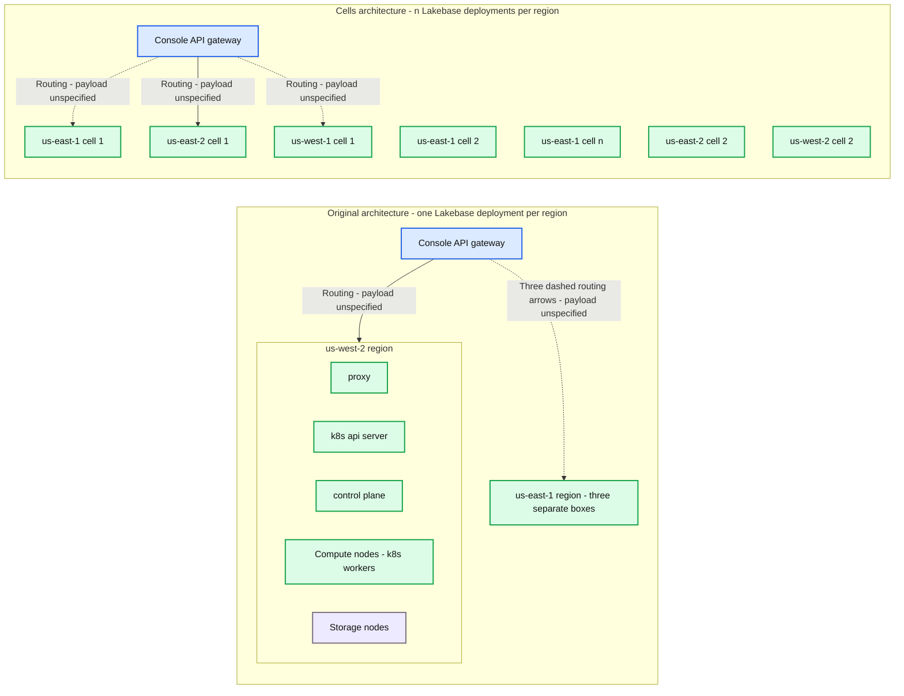

# How the lakebase architecture stays resilient to cloud failures

- Source: https://www.databricks.com/blog/how-lakebase-architecture-stays-resilient-cloud-failures
- Published: 2026-05-27
- Authors: Jasraj Dange, Hans Norheim
- Categories: engineering
- Images: 2 total, 2 extracted as architecture

**Key takeaways**

- Agent workloads are reshaping cloud reliability requirements. Agents create databases 4x faster than humans, demand serverless and auto-scaling infrastructure, and treat control-plane operations (like starting a database) as critical data-plane work. In Lakebase, we now start tens of millions of databases per day.
- The lakebase architecture is built for resilience, not patched for it. Stateless Postgres compute on zone-redundant storage means instances can be replaced instantly without hot standbys or crash recovery. We're separating hot-path control-plane operations into a dedicated service, minimizing cloud provider dependencies, and compartmentalizing each region into self-contained cells.
- We prove reliability through testing and measurement, not promises. Every release goes through chaos testing with fault injection at the process, node, and availability-zone level, validated against open-source tools like SqlLancer. We track per-database availability (not fleet averages) against a 99.99% monthly target, with attainment published transparently.

In the last year, agents have strained the limits of cloud infrastructure with new usage patterns:

- Higher throughput of control-plane operations: Agents programmatically create and manage databases, storage, compute, and other infrastructure components at rates much higher than humans. In Databricks Lakebase, [agents create 4x as many databases as humans do](https://www.databricks.com/blog/how-agentic-software-development-will-change-databases).
- More demand for on-demand: Serverless, [autoscaling](https://docs.databricks.com/aws/en/oltp/projects/autoscaling), and auto-suspend infrastructure is the new norm. If the agent goes to sleep, why pay for provisioned infrastructure?
- Capacity crunch: Demand for compute, GPUs, and cloud infrastructure[is going up](https://www.gartner.com/en/newsroom/press-releases/2026-04-22-gartner-forecasts-worldwide-it-spending-to-grow-13-point-5-percent-in-2026-totaling-6-point-31-trillion-dollars). The notion of cloud having “infinite” capacity is showing cracks.

This is challenging for both platform builders and cloud providers. Control planes are seeing significant increases in request volume for creating, managing, and scaling infrastructure, stressing reliability. Allocating new cloud capacity won’t always succeed. At the same time, agentic workloads demand data-plane-level reliability for core control-plane operations as part of their operational flows. In the last few months, we’ve seen agents drive an exponential increase in database starts,and now we are starting tens of millions of databases every day.

The resulting spate of failures and incidents amongst cloud services has taught us lessons that inform our reliability roadmap, and we want to share how we’re making the lakebase architecture and design more resilient to cloud failures. Some items are already in production, others are in flight.

## **High availability architecture**

At the foundation is our [separated compute and storage architecture](https://www.databricks.com/blog/what-is-a-lakebase), where High Availability (HA) is a core design tenet of the system and not an add-on. 

### Stateless Postgres compute

Unlike many cloud Postgres database service setups that are monolithic and have stateful compute, Postgres in the [lakebase architecture is stateless](https://neon.com/docs/introduction/architecture-overview). All durable data lives in a remote storage service, so the compute process holds no durable state on the local disk. If Postgres or the hardware it runs on fails, it can be instantly replaced without replicating data to a hot standby or running usual Postgres crash recovery. A hot standby in a monolithic setup requires a full copy of the data (not free), while crash recovery [must replay the write-ahead log](https://www.postgresql.org/docs/current/wal-internals.html)from the last checkpoint, which scales with the write rate at the time of the crash and can take 10s of minutes, depending on configuration. Because the database contents are stored in our zone-resilient storage service, a single-compute Postgres instance in Lakebase has significantly improved availability compared to a single stateful Postgres instance, without the cost of an additional hot standby compute instance.

For databases that require the highest levels of availability, you can configure [high availability](https://docs.databricks.com/aws/en/oltp/projects/high-availability). This provisions dedicated computes across multiple availability zones for your database, ensuring that your database remains available even if the cloud provider runs out of capacity during (or as a result of) the failure event. These computes can additionally be utilized to scale reads.

### Zone redundant storage for all

Monolithic Postgres setups are usually backed by local block devices that are rarely zone-redundant. This necessitates physical replication and costly hot standby replicas across multiple availability zones. In [Lakebase](https://docs.databricks.com/aws/en/oltp) and [Neon](https://neon.com/docs/introduction), all databases, regardless of tier and configuration, are backed by [distributed, zone-redundant, highly available storage.](https://neon.com/storage) Data is stored in highly durable, zone-redundant object storage, and performance is accelerated by NVMe SSD caches across multiple availability zones at no additional cost to you.

## **Control plane is the new data plane**

In monolithic cloud database service architecture, the data plane is the critical part of the service. It’s designed for 99.99+% availability and [static stability](https://docs.aws.amazon.com/whitepapers/latest/aws-fault-isolation-boundaries/static-stability.html). The control plane matters “only” for management operations. With agentic and on-demand workloads, the part of the control plane that starts databases is *effectively* the data plane. This has changed how we think about our architecture. Currently, our control plane handles everything from starting databases to billing. The former is clearly more critical. We’ve had outages where background maintenance operations resource-starved on-demand database startups - that’s clearly not ok.

We’re currently hard at work separating the critical parts of the control plane into a data plane controller service that handles only hot-path operations (start/suspend). This service has less business logic, a strict, minimal set of external dependencies (see the next section), and is engineered from the ground up with resilience, graceful degradation, and defense-in-depth top of mind.

To illustrate how central the control plane is to database traffic, we can analyze compute session lifetimes (the time from auto-resume due to an incoming connection to shutdown due to inactivity). In Neon, 90% of compute sessions for auto-suspending databases are less than 10 minutes.

**Summary:** Compute session lifetimes are concentrated in the less-than-00:03 and less-than-00:07 buckets, with progressively smaller percentages in longer buckets.

**Components:**
- Compute Session count by lifetime bucket: chart title; technology unspecified.
- Lifetime buckets: horizontal axis with eleven duration thresholds.
- percentage (%): vertical axis measuring the share of compute sessions.

**Flows:**
- none. No arrows are visible.

**Numbers:**
- Vertical axis ticks: 0, 10, 20, 30, 40, 50; unit: percentage (%).
- Lifetime thresholds: < 00:01, < 00:03, < 00:07, < 00:15, < 00:31, < 01:03, < 02:07, < 04:15, < 08:31, < 17:03, < 34:07. The time format is not explicitly labeled.
- Approximate bar heights, in threshold order: 1.2%, 49.2%, 34.5%, 8.7%, 4.1%, 1.4%, 0.6%, 0.3%, 0.1%, approximately 0%, approximately 0%. Exact values are not printed.

```mermaid
%% Compute session lifetime buckets shown in horizontal axis order without invented flows
flowchart LR
    subgraph Chart[Compute Session count by lifetime bucket]
        A[Less than 00:01]
        B[Less than 00:03]
        C[Less than 00:07]
        D[Less than 00:15]
        E[Less than 00:31]
        F[Less than 01:03]
        G[Less than 02:07]
        H[Less than 04:15]
        I[Less than 08:31]
        J[Less than 17:03]
        K[Less than 34:07]
        Y[Percentage axis ticks 0 10 20 30 40 50]
    end
    classDef client fill:#dbeafe,stroke:#2563eb,stroke-width:2px,color:#111
    classDef service fill:#dcfce7,stroke:#16a34a,stroke-width:2px,color:#111
    classDef store fill:#ede9fe,stroke:#7c3aed,stroke-width:2px,color:#111
    classDef cache fill:#fef3c7,stroke:#d97706,stroke-width:2px,color:#111
    classDef queue fill:#cffafe,stroke:#0891b2,stroke-width:2px,color:#111
    classDef critical fill:#fee2e2,stroke:#dc2626,stroke-width:4px,color:#111
    classDef external fill:#e5e7eb,stroke:#6b7280,stroke-width:2px,color:#111,stroke-dasharray:4 3
    classDef decision fill:#fce7f3,stroke:#db2777,stroke-width:2px,color:#111
    class A,B,C,D,E,F,G,H,I,J,K service
    class Y external
```

source image: https://www.databricks.com/sites/default/files/inline-images/image_133.png?v=1779890338

## **Carefully consider critical path dependencies, including cloud provider control planes**

Serving agentic workloads means creating and resuming databases must be highly reliable. Reliability is strongly correlated with the dependency chain and the amount of machinery involved in the flow. In a traditional setup with Postgres in cloud provider VMs, this goes well beyond the data plane:

- Cloud provider’s compute control plane to provision VMs
- Available VM capacity (where the cloud provider controls the policy of who gets it)
- Cloud provider’s block store control plane to provision local storage
- Cloud provider’s networking control plane to allocate IPs, configure firewalls and network routes to the new VM
- If using Kubernetes (K8s) - an additional dependency on the K8s system services. 

In Lakebase, we take a different approach that drastically reduces the amount of control plane machinery involved in critical database flows:

- We allocate a pool of big (often bare metal) instances from the cloud provider. We carry buffers to sustain cloud provider provisioning outages.
- We built our [own vertically autoscaling virtualization layer](https://neon.com/docs/introduction/autoscaling-architecture)that schedules multiple Postgres instances onto those cloud instances.
- We don’t rely on cloud block store devices, but instead store data in our own zone-resilient storage that is ultimately backed in object stores like S3 or Azure Blob storage.

Many other services at Databricks experience the same reliability challenges. This is where Lakebase benefits from being part of Databricks: Databricks has the means and is investing heavily in  building a common platform to increase the reliability of all products on all three major clouds.

## **Compartmentalize and contain the blast radius**

Rather than running a single monolithic regional deployment, Lakebase composes a region from one or more identically shaped *cells*. A cell is a complete, self-contained slice of the Neon and Lakebase stack: Kubernetes, control plane, compute, and storage.

**Summary:** Lakebase shifts from one deployment per region to multiple cells per region, with the original deployment showing proxy, Kubernetes API server, control plane, compute, and storage components.

**Components:**
- Original architecture: one Lakebase deployment per region.
- Cells architecture: n Lakebase deployments per region.
- Console API gateway: appears once in each architecture; implementation unspecified.
- us-east-1 region: three separate boxes with this same label; internal technology unspecified.
- us-west-2 region: expanded Lakebase deployment containing the components below.
- proxy: proxy technology unspecified.
- k8s api server: Kubernetes API server.
- control plane: implementation unspecified.
- Compute nodes, k8s workers: Kubernetes workers containing eight small node symbols.
- Storage nodes: storage technology unspecified; contains eight small node symbols.
- us-east-1 cell 1, us-east-1 cell 2, us-east-1 cell n: three cell boxes; internal components not shown.
- us-east-2 cell 1, us-east-2 cell 2: two cell boxes; internal components not shown.
- us-west-1 cell 1, us-west-2 cell 2: two cell boxes, labeled exactly as displayed; internal components not shown.
- Ellipses: additional regions or cells omitted from view.

**Flows:**
- Original Console API gateway -> upper us-east-1 region: dashed routing arrow; payload unspecified.
- Original Console API gateway -> us-west-2 region: solid routing arrow; payload unspecified.
- Original Console API gateway -> middle us-east-1 region: dashed routing arrow; payload unspecified.
- Original Console API gateway -> bottom us-east-1 region: dashed routing arrow; payload unspecified.
- Cells Console API gateway -> us-east-1 cell 1: dashed routing arrow; payload unspecified.
- Cells Console API gateway -> us-east-2 cell 1: solid routing arrow; payload unspecified.
- Cells Console API gateway -> us-west-1 cell 1: dashed routing arrow; payload unspecified.

Short vertical dashed marks between cell boxes have no arrowheads or stated flow.

**Numbers:** One deployment per region versus n deployments per region; cell identifiers 1, 2, and n; region labels us-east-1, us-east-2, us-west-1, and us-west-2; eight compute node symbols and eight storage node symbols. No quantitative units, percentages, or sizes are shown.

source image: https://www.databricks.com/sites/default/files/inline-images/bar-charts-1-dark-2.png?v=1779890338

This helps in two ways:

- **Scaling:** To grow a region, we add another cell. When an existing Cell approaches scalability limits of Kubernetes and control plane, new project creation is routed to a freshly provisioned Cell.  Cells are spun up quickly as demand grows
- **Blast radius containment: **Even with thorough testing and built-in protections, things still go wrong in production - Kubernetes control plane/system services trouble, code or config regressions, DoS situations etc. The cell boundary isolates faults and prevents the situation from spreading, leaving the other Cells in the region serving traffic normally

Together, this enables our platform to scale a region elastically while limiting the blast radius of any single failure. During an [incident on May 8, 2026](https://www.networkworld.com/article/4168878/aws-hit-by-us-east-1-outage-after-data-center-thermal-event.html), when AWS experienced issues with an Availability Zone in us-east-1, one of the cells had issues failing over to healthy nodes. The impact was contained to that cell. The other seven cells in the region failed over correctly, so the incident affected only ~13% of databases in the region. In this case, the cell-based architecture reduced the impact by roughly an order of magnitude.

## **Failure simulation and injection**

Redundancy architecture and principles aren't worth much unless they work in practice. One can brainstorm every possible failure mode, but [Murphy's Law](https://en.wikipedia.org/wiki/Murphy%27s_law) is alive and well, and complex systems always find a way to surprise you. Every Lakebase release goes through failure injection and chaos testing before it goes to production. We deploy the release to a real cluster, drive it with a mix of agentic and non-agentic OLTP and OLAP workloads at stress-level concurrency, and then start breaking things underneath. We kill processes, shoot down nodes, inject network failures, wipe disk contents, and restart components in loops, all while the workload keeps running. We use *failpoints* liberally in our code to inject hard-to-reproduce errors, such as a crash at the worst possible time. This is driven by an internal fault-injection framework that can target a single process or coordinate cluster-wide faults across an entire cell.

Our passing bar is stricter than "the test didn't error". We utilize open source tools like [SqlLancer](https://github.com/sqlancer/sqlancer) and [SqlSmith](https://github.com/sqlancer/sqlancer), along with similar internal tools, to verify correct Postgres behavior. While failure injection is running, we validate internal data consistency, that no committed transaction is lost, and that every component recovers to a consistent state on its own.

We're now taking this one level up, from component-level chaos to whole-AZ down simulations. In a real cluster with workloads running, we programmatically disconnect an availability zone's network from the rest of the cluster and observe how the system reacts: how quickly storage shifts to surviving replicas, how fast computes are failed over to healthy AZs, how the proxy layer reroutes connections, and how long any individual database sees an outage. Our goal is that no workload should be down for more than 30 seconds.

## **Measure, measure, measure**

Lord Kelvin [said](https://archive.org/stream/popularlecturesa01kelvuoft#page/72), “*If you cannot measure it, it is not science*”. We embody the same, and we make a science out of measuring availability and reliability. The user-visible status you see at [https://neonstatus.com/](https://neonstatus.com/) is a high-level view. Internally, we measure Service Level Indicators (SLIs) and set targets (SLOs) for all system components and major operations, especially user-facing ones. For example, we measure:

- **Database Availability:** How many percent of the time every individual database is available. We don’t just measure aggregate fleet availability, because an individual customer doesn’t care if *the fleet* had great availability if *their* database was down.
- **Database Startup Time:** How quickly a suspended database becomes available when you connect, or how quickly a brand new database is starts up.
- **Database switchover/failover**: Frequency and latency. As infrequent as possible, and as quickly as possible when it does happen.
- **Storage: **Availability and latency of page reads and durable writes from Postgres to storage. These tell us whether your workload gets what it needs.
- **Control Plane APIs:** Success rates and latency of important operations such as branching.

Our goal is for every database to exceed 99.99% availability every month. We measure how close we are to that goal with *attainment*: How many % of the fleet’s databases that met the goal. Below is Neon’s availability attainment so far in 2026 for monthly active databases.

| Month | Databases met 99.95% | Databases met 99.99% |
|---|---|---|
| 2026-01 | 99.96% | 99.85% |
| 2026-02 | 99.95% | 99.84% |
| 2026-03 | 99.96% | 99.81% |
| 2026-04 | 99.93% | 99.75% |

Best-in-class reliability and availability are of utmost importance in operational systems. We’re hard at work building your trust in our database service.

## **The Team**

The reliability work above is being driven by people who have spent careers building and operating relational databases. A few of them:

- **Jasraj Dange** - Engineering leader on Lakebase, previously led work on Azure SQL Database Performance, Scalability and making Azure SQL Database a robust platform for Applications.
- **Hans Norheim** - Focused on Lakebase availability & reliability, spent 13 years at Microsoft on SQL Server and Azure SQL Database, including the hot patching technology that lets SQL Server be updated without downtime, and the upgrade orchestration that holds Azure SQL Database to its 99.995% uptime SLA.
- **Stas Kelvich ****- **Now working on Lakebase after co-founding Neon. Before Neon, he worked on Postgres internals at Postgres Professional for five years, including fault-tolerant multi-master replication with quorum commit, cross-node snapshot isolation using loosely synchronized clocks, and improvements to two-phase commit and logical replication.
- **John Spray** - Leading Lakebase Storage. Previously led storage and compute driving key improvements for scale like sharding. Before that, distributed storage and systems work at Redpanda, Red Hat (Ceph), and Intel.
