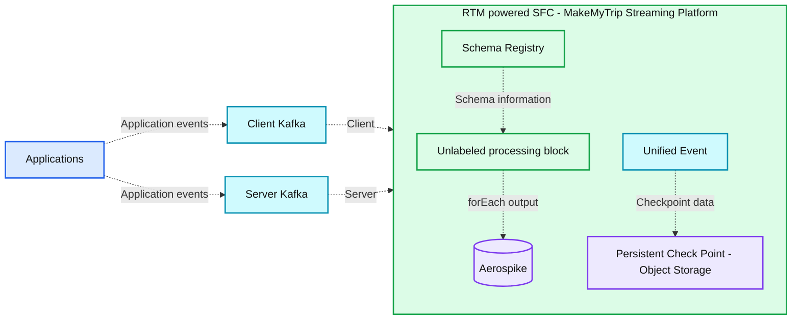

# How MakeMyTrip achieved millisecond personalization at scale with Databricks

*Learn how Real-Time Mode delivers instant travel recommendations and context for AI agents*

- Source: https://www.databricks.com/blog/how-makemytrip-achieved-millisecond-personalization-scale-databricks
- Published: 2026-04-07
- Authors: Sitesh Sharma, Aditya Kumar, Navneeth Nair
- Categories: data-engineering, customers
- Images: 1 total, 1 extracted as architecture

**Key takeaways**

- Unified Streaming Architecture: MakeMyTrip overcame the latency bottlenecks of traditional ETL by adopting Databricks Real-Time Mode (RTM), creating a unified Spark architecture without the need for other specialized engines.
- Millisecond Personalization: By processing high-volume traveler searches with continuous data flow, RTM enabled sub-50ms P50 latencies, directly driving a 7% uplift in user click-through rates.
- Unified Logic, Faster Innovation: By using a unified engine, MakeMyTrip is able to seamlessly transition from batch to real-time processing without re-writing business logic. This not only eliminates operational complexity, but also fuels future innovation, making it easy to feed generative AI agents the real-time context they need for accurate decision-making.

## Delivering Real-Time Personalization at Scale

Every millisecond counts when travelers search for hotels, flights, or experiences. As India's largest online travel agency, MakeMyTrip competes on real-time speed and relevance. One of its  most important features is "last-searched" hotels: as users tap the search bar, they expect a real-time, personalized list of their recent interests, based on their interaction with the system. 

At MakeMyTrip's scale, delivering that experience requires sub-second latency on a production pipeline serving millions of daily users — across both consumer and corporate travel lines of business.  By implementing Databricks' [Real-Time Mode (RTM)](https://docs.databricks.com/aws/en/structured-streaming/real-time)—the next-generation execution engine in Apache Spark™ Structured Streaming, MakeMyTrip successfully achieved millisecond-level  latencies, while maintaining a cost-effective infrastructure and reducing engineering complexity.

## The Challenge: Ultra-Low Latency Without Architectural Fragmentation

MakeMyTrip's data team needed sub-second latency for the "last-searched" hotels workflow across all lines of business. At their scale, even a few hundred milliseconds of delay creates friction in the user journey, directly impacting click-through rates.

Apache Spark's micro-batch mode introduced inherent latency limits that the team could not break despite extensive tuning — consistently delivering latency of one to two seconds, far too slow for their requirements.

Next, they evaluated Apache Flink across roughly 10 streaming pipelines **which solved their latency requirements**. However, adopting Apache Flink as a second engine would have introduced significant long-term challenges:

- **Architectural fragmentation: **Maintaining separate engines for real-time and batch processing
- **Duplicated business logic:** Business rules would need to be implemented and maintained across two codebases
- **Higher operational overhead:** Doubling monitoring, debugging, and governance effort across multiple pipelines
- **Consistency risks:** Results risk divergence between batch and real-time processing
- **Infrastructure costs:** Running and tuning two engines increases compute spend and maintenance burden

## Why Real-Time Mode: Millisecond Latency on a Single Spark Stack

Because MakeMyTrip never wanted a dual-engine architecture, Apache Flink was not a viable long-term option. The team made a deliberate architectural decision: to wait for Apache Spark to become faster, rather than fragment the stack.
Therefore, when Apache Spark Structured Streaming introduced RTM, MakeMyTrip became the first customer to adopt it. RTM allowed them to achieve millisecond-level latency on Apache Spark — meeting real-time requirements without introducing another engine or splitting the platform.

> Maintaining two engines means doubling the complexity and the risk of logic drift between batch and real-time calculations. We wanted one source of truth -- one Spark-based pipeline -- rather than two engines to maintain. Real-Time Mode gave us the performance we needed with the simplicity we wanted." —Aditya Kumar, Associate Director of Engineering, MakeMyTrip

RTM delivers continuous, low-latency processing through three key technical innovations that work together to eliminate the latency sources inherent in micro-batch execution:

- **Continuous data flow:** Data is processed as it arrives instead of being discretized into periodic chunks.
- **Pipeline scheduling:** Stages run simultaneously without blocking, allowing downstream tasks to process data immediately without waiting for upstream stages to finish.
- **Streaming shuffle:** Data is passed between tasks immediately, bypassing the latency bottlenecks of traditional disk-based shuffles.

Together, these innovations allow Apache Spark to achieve millisecond-scale pipelines that were previously only possible with specialized engines. To learn more about the technical foundation of RTM, read [this blog, “Breaking the Microbatch Barrier: The Architecture of Apache Spark Real-Time Mode."](https://www.databricks.com/blog/breaking-microbatch-barrier-architecture-apache-spark-real-time-mode)

## The Architecture: A Unified Real-Time Pipeline

**Summary:** MakeMyTrip applications send client and server events through Kafka into an RTM-powered streaming platform connected to a schema registry, Aerospike, and persistent object-storage checkpoints.

**Components:**
- Applications: event-producing applications; technology unspecified.
- Client Kafka: Kafka stream for client events.
- Server Kafka: Kafka stream for server events.
- RTM powered SFC - MakeMyTrip Streaming Platform: enclosing streaming platform using Real-Time Mode.
- Schema Registry: schema management; implementation unspecified.
- Processing block: unlabeled stream-processing and distribution symbols.
- Unified Event: event component within the streaming platform.
- Aerospike: database receiving processing output.
- Persistent Check Point - Object Storage: durable checkpoint storage; provider unspecified.

**Flows:**
- Applications -> Client Kafka: application events.
- Applications -> Server Kafka: application events.
- Client Kafka -> Streaming Platform: client event stream entering at the processing-block level.
- Server Kafka -> Streaming Platform: server event stream entering at the Unified Event level.
- Schema Registry -> Processing block: schema information.
- Processing block -> Aerospike: output through `forEach()`.
- Unified Event -> Persistent Check Point - Object Storage: checkpoint data.

**Numbers:** none

source image: https://www.databricks.com/sites/default/files/inline-images/2026-04-blog-how-makemytrip-achieved-millisecond-personalization-at-scale-with-databricks-inline-960x761.png

MakeMyTrip's pipeline follows a high-performance path:

- **Unified ingestion: **B2C and B2B clickstream topics are merged into a single stream. All personalization logic — enrichment, stateful lookup, and event processing — is applied consistently across both user segments.
- **RTM processing: **The Apache Spark engine uses concurrent scheduling and streaming shuffle to process events in milliseconds.
- **Stateful enrichment:** The pipeline performs a low-latency lookup in Aerospike to retrieve the "Last N" hotels for each user.
- **Instant serving:** Results are pushed to a UI cache (Redis), enabling the app to serve personalized results in under 50ms.

## Configuring RTM: a single-line code change

Using RTM in your streaming query does not require rewriting business logic or restructuring pipelines. The only code change needed is setting the trigger type to RealTimeTrigger, as shown in the following code snippet:

The one infrastructure consideration: cluster task slots must be greater than or equal to the total number of active tasks across source and shuffle stages. MakeMyTrip's team analyzed their Kafka partitions, shuffle partitions, and pipeline complexity upfront to ensure sufficient concurrency before going to production.

## Co-Developing RTM for Production

As RTM's first adopter, MakeMyTrip worked directly with Databricks engineering to bring the pipeline to production readiness. Several capabilities required active collaboration between the two teams to build, tune, and validate.

1. **Stream Union: Merging B2C and B2B into a Single Pipeline**
MakeMyTrip needed to unify two separate Kafka topic streams — B2C consumer clickstream and B2B corporate travel — into a single RTM pipeline so that the same personalization logic could be applied consistently across both user segments. After a month of close collaboration with Databricks engineering, the feature was built and shipped. The result was a single pipeline where all business logic lives in one place, with no divergence risk between user segments.
2. **Task Multiplexing: **More Partitions, Fewer Cores
RTM's default model assigns one slot/core per Kafka partition. With 64 partitions in MakeMyTrip's production setup, that translates to 64 slots/cores — cost-prohibitive at their scale. To address this, the Databricks team introduced the MaxPartitions option for Kafka, which allows multiple partitions to be handled by a single core. This gave MakeMyTrip the lever they needed to reduce infra costs without compromising throughput.
3. **Pipeline Hardening: **Checkpointing, Backpressure, and Fault Tolerance
The team worked through a set of operational challenges specific to high-throughput, low-latency workloads: tuning checkpoint frequency and retention, handling timeouts, and managing backpressure during surges in clickstream volume. By scaling to 64 Kafka partitions, enabling backpressure, and capping the MaxRatePerPartition at 500 events, the team optimized throughput and stability. Through this iterative tuning of batch configurations, partitioning, and retry behavior, they arrived at a stable, production-grade pipeline serving millions of users daily.

## Results

RTM enabled instant personalization and improved responsiveness, higher engagement measured via click-through rates and operational simplicity of a single unified engine. Key metrics are shown below.

| **Metrics** | **Before RTM** | **After RTM** |
|---|---|---|
| P50 latency | ~1.23 seconds | 44 ms |
| P99 latency | >1 minute | ~500 ms |
| CTR uplift | baseline | +7% |

## Apache Spark as a Real-Time Engine

MakeMyTrip’s deployment proves that RTM on Spark delivers the extremely low latency that your real-time applications require. Because RTM is built on the same familiar Spark APIs, you can use the same business logic across batch and real time pipelines. You no longer need the overhead of maintaining a second platform or separate codebase for real time processing, and can simply enable RTM on Spark with a single line of code.

> Real-Time Mode allowed us to compress our infrastructure and deliver real-time experiences without managing multiple streaming engines. As we move into the era of AI agents, steering them effectively requires building real-time context from data streams. We are experimenting with Spark RTM to supply our agents with the richest, most recent context necessary to take the best possible decisions.” —Aditya Kumar, Associate Director of Engineering, MakeMyTrip

Getting started with Real-Time Mode

To learn more about Real-Time Mode, watch this [on-demand video on how to get started](https://vimeo.com/1174513082/6c07e6cb46) or review the [documentation](https://docs.databricks.com/aws/en/structured-streaming/real-time).
