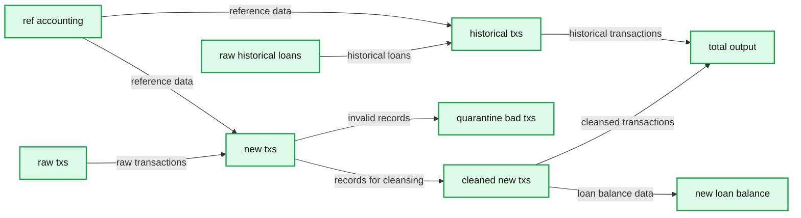

# How To Migrate Your Oracle PL/SQL Code to Databricks Lakehouse Platform

- Source: https://www.databricks.com/blog/how-migrate-your-oracle-plsql-code-databricks-lakehouse-platform
- Published: 2023-02-13
- Authors: Laurent Léturgez, Leo Mao, Soham Bhatt
- Categories: platform, solutions, data-warehousing
- Images: 2 total, 2 extracted as architecture

Oracle is a well-known technology for hosting Enterprise Data Warehouse solutions. However, many customers like [Optum](https://www.databricks.com/customers/optum) and the [U.S. Citizenship and Immigration Services](https://www.databricks.com/customers/uscis) chose to migrate to the [Databricks Lakehouse Platform](https://www.databricks.com/product/data-lakehouse) to leverage the power of data, analytics, and AI in one single platform at scale and to deliver business value faster. For example, Optum's on-premises Oracle-based data warehouse system struggled to quickly process and analyze the data. With Azure Databricks, they have improved data pipeline performance by 2x, enabling faster delivery of results to hospitals, saving them millions of dollars in potentially lost revenue.

Migrating from Oracle to Databricks involves multiple steps, the most critical ones are:

- [Modeling the Enterprise Data Warehouse into the Lakehouse](https://www.databricks.com/blog/2022/06/24/data-warehousing-modeling-techniques-and-their-implementation-on-the-databricks-lakehouse-platform.html)
- Data migration from Oracle tables to Delta tables using [Databricks Ingest](https://www.databricks.com/blog/2020/02/24/introducing-databricks-ingest-easy-data-ingestion-into-delta-lake.html) or our [Data Ingestion partners](https://www.databricks.com/partnerconnect)
- Code migration from PL/SQL to PySpark or Spark SQL (covered in this blog)
- [Data processing Job orchestration](https://docs.databricks.com/workflows/index.html)
- Overall [EDW migration methodology](https://www.databricks.com/solutions/migration/data-warehouse) for a successful migration

In this blog post, we'll focus on converting PL/SQL proprietary code to an open standard python code and take advantage of PySpark for ETL workloads and Databricks SQL's data analytics workload power.

## Challenge of converting PL/SQL to PySpark

As the need for creating data pipelines and ETL grew, every database needed a programming language wrapper to have the context to pass parameters and handle datasets programmatically. Instead of using open source standards like Python, most databases created their own proprietary languages. PL/SQL is Oracle's version of programming language extensions on SQL. It leverages the SQL language with procedural elements (parameters, variables, datasets as cursors, conditional statements, loops, exception blocks etc.). Its proprietary language and extensions were developed over the years and have their own specificities that can make it tricky to convert to a standard, widely used, full-blown open source programming language like Python.

An example of this is the supplied PL/SQL packages (DBMS_ or UTL_ packages etc.) and the user-defined types that can be used as objects for column types (objects or collections defined as a column type) which makes migration quite complex. These Oracle-specific features and numerous others need to be considered during code conversion to Apache Spark™.

Many organizations have created ETL data processing jobs by writing PL/SQL procedures and functions wrapped into packages that run against an Oracle database. You can convert these PL/SQL jobs to open source python and Spark and run it in Databricks notebooks or Delta Live Tables without any of the complexity of PL/SQL and run it on the modern Databricks on-demand serverless compute.

### Migrate PL/SQL code to PySpark for your ETL pipelines

ETL Process is used mostly for:

- Ingesting data from multiple sources
- Validating, cleaning and transforming data
- Loading data into various data layers (bronze, silver, gold / Operational Data Store, Data Warehouse, Data Marts … depending on the data architecture)

In Oracle Databases, PL/SQL is usually used to validate/transform the data in place. Depending on the Oracle database architecture, data moves from various containers that could be a user schema and/or a pluggable database.
 Here's an example of a typical Oracle database implementation that supports a Data Warehouse using PL/SQL for ETL.

*Typical Oracle database implementation that supports a Data Warehouse using PL/SQL for ETL.*

**Summary:** The diagram shows document and database sources flowing through raw storage and PL/SQL ETL into an ODS and then a DWH.

**Components:**

- Document files: source documents
- Source database: database source
- Raw: raw data storage, shown twice
- PL/SQL: ETL processing, shown twice
- ODS: operational data store
- DWH: data warehouse
- Red database boundary: enclosing database environment

**Flows:**

- Document files -> Raw: source data
- Source database -> Raw: source data
- Raw -> PL/SQL: raw data for validation and transformation
- PL/SQL -> ODS: transformed data
- ODS -> PL/SQL: ODS data for further ETL
- PL/SQL -> DWH: warehouse-ready data

**Numbers:** none

```text
%% mermaid failed to render; kept as text
%% Oracle-style ETL flow from source systems through raw storage, PL SQL, ODS, and DWH
flowchart LR
    DOC[Document files] -->|source data| RAW1[Raw]
    SRC[Source database] -->|source data| RAW2[Raw]
    RAW1 -->|raw data| ETL1[PL SQL]
    RAW2 -->|raw data| ETL1
    ETL1 -->|transformed data| ODS[ODS]
    ODS -->|ODS data| ETL2[PL SQL]
    ETL2 -->|warehouse ready data| DWH[DWH]

    classDef client   fill:#dbeafe,stroke:#2563eb,stroke-width:2px,color:#111
    classDef service  fill:#dcfce7,stroke:#16a34a,stroke-width:2px,color:#111
    classDef store    fill:#ede9fe,stroke:#7c3aed,stroke-width:2px,color:#111
    classDef cache    fill:#fef3c7,stroke:#d97706,stroke-width:2px,color:#111
    classDef queue    fill:#cffafe,stroke:#0891b2,stroke-width:2px,color:#111
    classDef critical fill:#fee2e2,stroke:#dc2626,stroke-width:4px,color:#111
    classDef external fill:#e5e7eb,stroke:#6b7280,stroke-width:2px,color:#111,stroke-dasharray:4 3
    classDef decision fill:#fce7f3,stroke:#db2777,stroke-width:2px,color:#111
    DOC,SRC external
    RAW1,RAW2,ODS,DWH store
    ETL1,ETL2 service
```

<sub>source image: https://www.databricks.com/sites/default/files/inline-images/db-454-blog-img-1.png</sub>

Typical Oracle database implementation that supports a Data Warehouse using PL/SQL for ETL.

Moving from Oracle and PL/SQL to the Databricks Lakehouse will leverage many key aspects:

- PySpark will provide a standard library in Python, which will provide the capability to process various data sources at scale directly to the ODS without having to materialize a table in the staging area. This can be done with a python notebook scheduled on a regular basis with Databricks workflows.
- [Delta Live Tables](https://www.databricks.com/product/delta-live-tables) will deliver the capability to implement the whole ETL pipeline in either python or SQL notebook with data quality control ([Manage data quality with Delta Live Tables](https://docs.databricks.com/workflows/delta-live-tables/delta-live-tables-expectations.html)) and are able to process data either in batch or real-time ([Process streaming data with Delta Live Tables](https://docs.databricks.com/workflows/delta-live-tables/delta-live-tables-incremental-data.html)).

*Delta Live Tables pipeline example*

**Summary:** Delta Live Tables pipeline showing raw transaction and loan data flowing through cleansing, quarantine, historical processing, and downstream loan outputs.

**Components:**

- `raw_txs` - Delta Live Tables source dataset
- `new_txs` - Delta Live Tables transformation
- `cleaned_new_txs` - Data-cleansing transformation
- `quarantine_bad_txs` - Data-quality quarantine table
- `raw_historical_loans` - Historical loan source dataset
- `historical_txs` - Historical transaction transformation
- `ref_accounting_tr...` - Reference accounting dataset
- `total_...` - Aggregated downstream dataset
- `new_loan_balance...` - Loan-balance output dataset
- Pipeline details - Databricks Delta Live Tables metadata and run status

**Flows:**

- `raw_txs -> new_txs`: raw transaction data
- `ref_accounting_tr... -> new_txs`: reference accounting data
- `new_txs -> cleaned_new_txs`: new transaction records for cleansing
- `new_txs -> quarantine_bad_txs`: invalid transaction records
- `raw_historical_loans -> historical_txs`: historical loan data
- `ref_accounting_tr... -> historical_txs`: accounting reference data
- `cleaned_new_txs -> new_loan_balance...`: cleansed transaction data
- `cleaned_new_txs -> total_...`: cleansed transaction data
- `historical_txs -> total_...`: historical transaction data
- `cleaned_new_txs -> new_loan_balance...`: downstream loan-balance processing

**Numbers:**

- `11/17/2022`
- `5:12:54 PM`
- `14 days ago`
- `10K`
- `699`
- `392K`
- `0`
- `246`
- `01-load-data`
- `01-DLT-Loan-pipeline-SQL`
- `0e030285-3c27-4491-9c33-b388e9369d1a`
- `677c77c`
- `API_CALL`



<sub>source image: https://www.databricks.com/sites/default/files/inline-images/db-454-blog-img-2.png</sub>

Delta Live Tables pipeline example

Regardless of the feature used, PL/SQL logic will be migrated into python code or SQL. For example, PL/SQL functions will be translated into PySpark and are called directly or through a python user-defined function (See this link on how to use Python UDF in Delta Live Tables: [Delta Live Tables cookbook](https://docs.databricks.com/workflows/delta-live-tables/delta-live-tables-cookbook.html#use-python-udfs-in-sql) )

### Migrate PL/SQL code to Databricks SQL or Python UDF

Databricks SQL is used to run many SQL Workloads and one of them is to run analytics queries based on data hosted on the lakehouse. Those analytics queries can require some functions to be executed on these tables (data redaction etc.).
 These functions are usually addressed in Oracle by PL/SQL functions or packages' functions and will be migrated during the process.

Python UDF on Databricks SQL leverages traditional SQL workloads with the functionalities brought by the python language.

## PL/SQL Code migration samples

This section will be dedicated to some examples of code migration from Oracle PL/SQL to Databricks. Based on best practices and our recommendations, each example depends on the implementation choice. (PySpark in an ETL process, Python UDF in a Databricks SQL analytic workload).

### Dynamic cursors using DBMS_SQL supplied Oracle package

In Oracle, a cursor is a pointer to a private SQL area that stores information about processing a specific SELECT or DML statement. A cursor that is constructed and managed by the Oracle kernel through PL/SQL is an implicit cursor. A cursor that you construct and manage is an explicit cursor.

In Oracle, cursors can be parameterized by using dynamic strings for the SQL statement, but this technique can lead to SQL Injection issues, that's why it's better to use DBMS_SQL supplied PL/SQL package or EXECUTE IMMEDIATE statements which will help to build dynamic statements. A cursor can very easily be converted to a Spark DataFrame.

The following example is how we transform dynamic SQL statements built with an Oracle-supplied PL/SQL package to PySpark.

Here is the PL/SQL SQL code in Oracle.

Here is the code that performs the same functionality in PySpark.

### Collections migrations to python

In Oracle PL/SQL, many collection and record types exist.

| Collection Type | Number of Elements | Index Type | Dense or Sparse |
|---|---|---|---|
| Associative array (or index-by table) | Unspecified | String or Integer | Either |
| VARRAY (variable-size array) | Specified | Integer | Always dense |
| Nested table | Unspecified | Integer | Starts dense, can become sparse |

These can be migrated to Python elements regardless if they are executed as tasks using PySpark for ETL purposes, or into Python UDF in Databricks SQL.

An associative array is a set of key-value pairs. Each key is a unique index used to locate the associated value with the syntax variable_name(index).

The data type of index can be either a string type (VARCHAR2, VARCHAR, STRING, or LONG) or PLS_INTEGER. Indexes are stored in sort order, not creation order. The best way to migrate an associate array to python (or PySpark) is to use a dictionary structure.

Here is what the code looks like in PL/SQL:

Below is, an example on how to convert associative arrays into python from PL/SQL:

### Data redaction

On the semantic layer of a data warehouse, it is sometimes necessary to redact sensitive data. To do that, functions are very often used to implement the data redaction process.

In an Oracle Database, you can use Advanced Security Option for Data Redaction or a PL/SQL that will implement the redaction. Both of these techniques can be used by our migrations teams, but if the source database uses PL/SQL to do that, the best solution will be to use Python UDF into Databricks SQL.

Python UDFs allow users to write Python code and invoke it through a SQL function in an easy, secure and fully governed way, bringing the power of Python to Databricks SQL.

In the following example, we translated a PL/SQL function that redacts product names when the list price is greater than 100 by using the python UDF feature.

Code in PL/SQL as below:

The Python UDF will be as below:

### Planning your PL/SQL migration

Databricks and our SI/consulting partners can help you with a detailed technical migration assessment which includes your target architecture, technical assessment of your existing code, such as the number of objects to be migrated, their overall complexity classification, technical approaches to data, code and report modernization etc. Our customers can execute the migration in-house manually or accelerate their migration by using an automated code conversion of PL/SQL to PySpark.

### Automated migration approach

The Data Warehouse Migration practice at Databricks is thriving, and we have several ISV and Consulting/SI partners who can assist with EDW Migrations. Data Ingestion partners like Fivetran, Qlik, Arcion can help migrate the data in real-time using CDC from Oracle to Databricks and low-code/code optional ETL partners like Matillion and Prophecy can also help if Stored procedures need to be converted to visual ETL mappings. See the full list of our [ISV partners here](https://www.databricks.com/company/partners/technology).

With the aid of legacy platform assessment tools and automatic code conversion accelerators, Databricks Professional Services and several of our authorized [Migrations Brickbuilder SI partners](https://www.databricks.com/blog/2022/08/11/announcing-brickbuilder-solutions-for-migrations.html) can also migrate PL/SQL code quickly and effectively to native Databricks Notebooks.

Here is one example of an [automated code conversion demo](https://www.youtube.com/watch?v=5vwp68Kmm28) from PL/SQL to PySpark by [BladeBridge](https://www.databricks.com/dataaisummit/session/how-automate-modernization-and-migration-your-data-warehousing-workloads), our ISV conversion partner.

[LeapLogic](https://www.leaplogic.io/migration-to-databricks.html) is another partner that also has automated assessment and code converters from various EDWs to Databricks. Here is a demo of their [Oracle conversion tool](https://www.leaplogic.io/modernization/video/automated-workload-transformation-oracle-databricks) to Databricks.

Most consulting/SI partners use similar automated conversion tools unless it is a full modernization and redesign.

Whether you choose to modernize your Legacy Oracle EDW platform in-house or with the help of a consulting partner, Databricks migration specialists and [professional services team](https://www.databricks.com/professional-services) are here to help you along the way.
 Please see this [EDW Migration page](https://www.databricks.com/solutions/migration/data-warehouse) for more information and partner migration offerings.

Feel free to reach out to the Databricks team for a customized Oracle Migration assessment.

## Get started on migrating your first pieces of code to Databricks

[Try Databricks free for 14 days](https://www.databricks.com/try-databricks?itm_data=datavault-blog).
