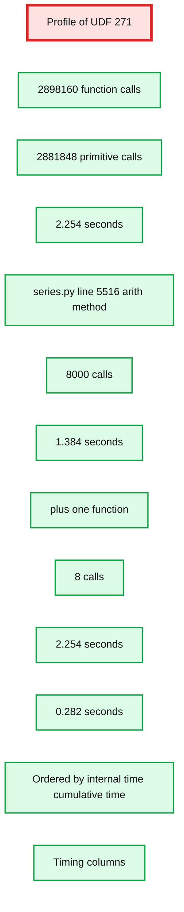

# How to Profile PySpark

- Source: https://www.databricks.com/blog/how-profile-pyspark
- Published: 2022-10-06
- Authors: Xinrong Meng, Takuya Ueshin, Hyukjin Kwon, Allan Folting
- Categories: engineering, open-source
- Images: 4 total, 3 extracted as architecture

In Apache Spark™, declarative Python APIs are supported for big data workloads. They are powerful enough to handle most common use cases. Furthermore, PySpark UDFs offer more flexibility since they enable users to run arbitrary Python code on top of the Apache Spark™ engine. Users only have to state "what to do"; PySpark, as a sandbox, encapsulates "how to do it". That makes PySpark easier to use, but it can be difficult to identify performance bottlenecks and apply custom optimizations.

To address the difficulty mentioned above, PySpark supports various profiling tools, which are all based on [cProfile](https://docs.python.org/3/library/profile.html#module-cProfile), one of the standard Python [profiler implementations](https://docs.python.org/3/library/profile.html). PySpark Profilers provide information such as the number of function calls, total time spent in the given function, and filename, as well as line number to help navigation. That information is essential to exposing tight loops in your PySpark programs, and allowing you to make performance improvement decisions.

## Driver profiling

PySpark applications run as independent sets of processes on a cluster, coordinated by the SparkContext object in the driver program. On the driver side, PySpark is a regular Python process; thus, we can profile it as a normal Python program using cProfile as illustrated below:

## Workers profiling

Executors are distributed on worker nodes in the cluster, which introduces complexity because we need to aggregate profiles. Furthermore, a Python worker process is spawned per executor for PySpark UDF execution, which makes the profiling more intricate.

The UDF profiler, which is introduced in Spark 3.3, overcomes all those obstacles and becomes a major tool to profile workers for PySpark applications. We'll illustrate how to use the UDF Profiler with a simple Pandas UDF example.

Firstly, a PySpark DataFrame with 8000 rows is generated, as shown below.

Later, we will group by the id column, which results in 8 groups with 1000 rows per group.

The Pandas UDF `plus_one` is then created and applied as shown below:

Note that `plus_one` takes a pandas DataFrame and returns another pandas DataFrame. For each group, all columns are passed together as a pandas DataFrame to the `plus_one` UDF, and the returned pandas DataFrames are combined into a PySpark DataFrame.

Executing the example above and running `sc.show_profiles()` prints the following profile. The profile below can also be dumped to disk by `sc.dump_profiles(path)`.

**Summary:** A cProfile-style report for UDF 271 showing monitored calls and function timing data.

**Components:**

- UDF profile report using Python cProfile
- UDF 271
- `plus_one` function
- `series.py` arithmetic method
- Profile timing columns

**Flows:**

- none visible

**Numbers:** 271; 2,898,160 function calls; 2,881,848 primitive calls; 2.254 seconds; 8,000 calls; 0.084 seconds; 0.000 seconds; 1.384 seconds; 8 calls; 0.282 seconds; line 5516; command 14168941



<sub>source image: https://www.databricks.com/sites/default/files/inline-images/db-372-blog-img-2.png</sub>

The UDF id in the profile (271, highlighted above) matches that in the Spark plan for `res`. The Spark plan can be shown by calling `res.explain()`.

**Summary:** The image shows a Spark physical plan containing a `FlatMapGroupsInPandas` operator and associated UDF identifiers.

**Components:**

- FlatMapGroupsInPandas using PySpark
- plus_one UDF
- Identifier 272 with version 273

**Flows:**

- none

**Numbers:** 238, 240, 271, 272, 273

```text
%% mermaid failed to render; kept as text
%% Shows the Spark physical plan labels and identifiers
flowchart LR
    A[FlatMapGroupsInPandas id 238]
    B[plus one id 238 v 240 id 271]
    C[id 272 v 273]

    classDef client   fill:#dbeafe,stroke:#2563eb,stroke-width:2px,color:#111
    classDef service  fill:#dcfce7,stroke:#16a34a,stroke-width:2px,color:#111
    classDef store    fill:#ede9fe,stroke:#7c3aed,stroke-width:2px,color:#111
    classDef cache    fill:#fef3c7,stroke:#d97706,stroke-width:2px,color:#111
    classDef queue    fill:#cffafe,stroke:#0891b2,stroke-width:2px,color:#111
    classDef critical fill:#fee2e2,stroke:#dc2626,stroke-width:4px,color:#111
    classDef external fill:#e5e7eb,stroke:#6b7280,stroke-width:2px,color:#111,stroke-dasharray:4 3
    classDef decision fill:#fce7f3,stroke:#db2777,stroke-width:2px,color:#111
    client = clients/edge/gateway/LB, service = stateless compute, store = databases/durable storage,
    cache = Redis/CDN/anything losable, queue = Kafka/streams/async pipes, critical = the bottleneck
    or SPOF use sparingly, external = third-party, decision = a trade-off point

    class A service
    class B critical
    class C service
```

<sub>source image: https://www.databricks.com/sites/default/files/inline-images/db-372-blog-img-3.png</sub>

The first line in the profile's body indicates the total number of calls that were monitored. The column heading includes

- `ncalls`, for the number of calls.
- `tottime`, for the total time spent in the given function (excluding time spent in calls to sub-functions)
- `percall`, is the quotient of `tottime` divided by `ncalls`
- `cumtime`, is the cumulative time spent in this and all subfunctions (from invocation till exit)
- `percall`, is the quotient of `cumtime` divided by primitive calls
- `filename:lineno(function)`, provides the respective information for each function

Digging into the column details: `plus_one` is triggered once per group, 8 times in total; `_arith_method` of pandas Series is called once per row, 8000 times in total. `pandas.DataFrame.apply` applies the function `lambda` x: x + 1 row by row, thus suffering from high invocation overhead.

We can reduce such overhead by substituting the `pandas.DataFrame.apply` with `pdf + 1`, which is vectorized in pandas. The optimized Pandas UDF looks as follows:

The updated profile is as shown below.

**Summary:** The image shows a PySpark UDF profiler report highlighting 2,384 total calls and optimized arithmetic operations executed in 8 calls.

**Components:**

- UDF profiler report using Python `cProfile`
- UDF with ID 258
- Function call summary
- Timing and call-count columns
- Arithmetic method entry in `frame.py`
- Optimized `plus_one_optimized` function entry

**Flows:**

- none visible

**Numbers:** 258; 2,384 function calls; 2,328 primitive calls; 0.003 seconds; 8 calls; 0.000 seconds; 0.003 seconds cumulative time; `frame.py:6857`; command ID 14168952; line 1


<sub>source image: https://www.databricks.com/sites/default/files/inline-images/db-372-blog-img-4.png</sub>

We can summarize the optimizations as follows:

- Arithmetic operation from 8,000 calls to 8 calls
- Total function calls from 2,898,160 calls to 2,384 calls
- Total execution time from 2.300 seconds to 0.004 seconds

The short example above demonstrates how the UDF profiler helps us deeply understand the execution, identify the performance bottleneck and enhance the overall performance of the user-defined function.

The UDF profiler was implemented based on the executor-side profiler, which is designed for PySpark RDD API. The executor-side profiler is available in all active Databricks Runtime versions.

Both the UDF profiler and the executor-side profiler run on Python workers. They are controlled by the `spark.python.profile` Spark configuration, which is `false` by default. We can enable that Spark configuration on a Databricks Runtime cluster as shown below.

## Conclusion

PySpark profilers are implemented based on cProfile; thus, the profile reporting relies on the [Stats](https://docs.python.org/3/library/profile.html#the-stats-class) class. [Spark Accumulators](https://spark.apache.org/docs/latest/rdd-programming-guide.html#accumulators) also play an important role when collecting profile reports from Python workers.

Powerful profilers are provided by PySpark in order to identify hot loops and suggest potential improvements. They are easy to use and critical to enhance the performance of PySpark programs. The UDF profiler, which is available starting from Databricks Runtime 11.0 (Spark 3.3), overcomes all the technical challenges and brings insights to user-defined functions.

In addition, there is an ongoing effort in the Apache Spark™ open source community to introduce memory profiling on executors; see [SPARK-40281](https://issues.apache.org/jira/browse/SPARK-40281) for more information.
