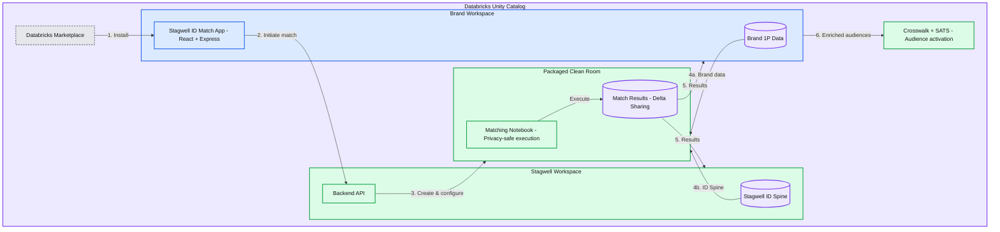

# How Stagwell built privacy-safe ID matching on Databricks

*Databricks Marketplace Apps and Packaged Clean Rooms let data providers distribute IP as installable applications, keeping brand data where it belongs.*

- Source: https://www.databricks.com/blog/how-stagwell-built-privacy-safe-id-matching-databricks
- Published: 2026-06-18
- Authors: Sridhar Sundaresan, Suvan Kaul
- Categories: platform, solutions, engineering, data-engineering, industries, media-and-entertainment
- Images: 1 total, 1 extracted as architecture

**Key takeaways**

- Brands struggle to securely match fragmented first-party data with identity graphs without exposing sensitive information.
- Databricks Marketplace-powered clean room apps enable plug-and-play, privacy-safe identity matching at scale ensuring data never leaves the customer's environment.
- Stagwell’s solution combines Databricks Clean Rooms, Stagwell ID Spine, and app orchestration to move from raw data to actionable audiences via their Agentic Targeting System (SATS), all without exposing raw records from either side.

## The identity matching problem brands face today

Brands invest heavily in building first-party data assets, including purchase histories, CRM records, loyalty programs,and website interactions. That data is fragmented across systems and difficult to activate across channels. However, first-party data alone only tells part of the story.

To build complete audience profiles, brands need to match their records against identity providers' spines for cross-channel identity graphs spanning email, device IDs, cookies, and offline touchpoints.

The traditional approach is painful. Brands export customer records to a third-party platform, the identity provider runs their matching algorithms, and results come back days later. Every step introduces risk: data leaves the brand's secure environment, PII travels across networks, and compliance teams must review data-sharing agreements that can take weeks to negotiate.

At the same time, privacy regulations and platform restrictions have made:

- Third-party cookies unreliable
- Data sharing risky
- Identity stitching more complex

This creates a fundamental gap: Brands have data but lack the ability to connect it to a unified identity layer safely

To bridge this, brands need to:

- Match their data against a comprehensive identity graph
- Enrich it with additional signals and attributes
- Do so while protecting raw user-level data

The Marketing Cloud, a Global Marketing Services Agency, a Stagwell company, experienced this friction firsthand across their brand clients. They pushed for a better model: one where brands could access Stagwell's identity matching capabilities without ever sending their raw data outside their own infrastructure.

## How Marketplace Apps change the distribution model

Traditional clean room implementations are high-touch, engineering-heavy, and can be slow to deploy.

[Databricks Marketplace](https://www.databricks.com/product/marketplace) Apps flip the traditional data-sharing model. Instead of "send us your data and we will process it," the model becomes "install our app and it runs where your data already lives”. Brands can now install a pre-built application, connect their data, and run identity matching workflows instantly.

When an application is published to the Databricks Marketplace, any brand with a Databricks workspace can request access and install it directly. The app runs inside the brand's own environment with its own auto-provisioned service principal. The brand's data never crosses a network boundary.

This is a fundamental shift for data providers. Previously, distributing proprietary algorithms meant either exposing source code (which partners will not do) or requiring brands to export data (which compliance teams resist). Marketplace Apps solve both problems: the app's code is containerized and opaque to the consumer, while the brand's data stays in their [Unity Catalog](https://www.databricks.com/product/unity-catalog).

With marketplace distribution, deployment time drops from months to minutes, standardized workflows improve usability, and governance is baked into the platform. Stagwell was among the first partners to put this model into production.

## What Stagwell built and how it works

Stagwell built a marketplace-ready clean room application on Databricks that enables secure ingestion of brand first-party data, matching against the Stagwell Identity Spine, privacy-safe insights generation, and seamless transition to audience creation and activation.

At its core, the system combines Databricks Clean Rooms for secure collaboration, Unity Catalog for governance and access control, Jobs and Notebooks for identity matching execution, and a React and Express app layer for user experience.

**Summary:** Stagwell matches brand first-party data against its ID Spine in a packaged clean room, shares results with both workspaces, and enables audience activation under Databricks Unity Catalog.

**Components:**
- Databricks Unity Catalog: outer governance boundary.
- Databricks Marketplace: app installation source.
- Brand Workspace: contains brand data and the matching app.
- Brand 1P Data: brand data store.
- Stagwell ID Match App: React + Express.
- Stagwell Workspace: contains the ID Spine and backend.
- Stagwell ID Spine: identity data store.
- Backend API: technology unspecified.
- Packaged Clean Room: contains matching execution and results.
- Matching Notebook: privacy-safe execution.
- Match Results: Delta Sharing.
- Crosswalk + SATS: audience activation.

**Flows:**
- Databricks Marketplace -> Stagwell ID Match App: 1. Install.
- Stagwell ID Match App -> Backend API: 2. Initiate match.
- Backend API -> Packaged Clean Room: 3. Create & configure.
- Brand 1P Data -> Packaged Clean Room: 4a. Brand data.
- Stagwell ID Spine -> Packaged Clean Room: 4b. ID Spine.
- Matching Notebook -> Match Results: Execute.
- Match Results -> Brand Workspace: 5. Results.
- Match Results -> Stagwell Workspace: 5. Results.
- Brand Workspace -> Crosswalk + SATS: 6. Enriched audiences.

**Numbers:** Step labels: 1, 2, 3, 4a, 4b, 5 appearing twice, 6. Data label: 1P.

source image: https://www.databricks.com/sites/default/files/blog_images/how-stagwell-built-privacy-safe-id-matching-blog-img-1.png

Here’s how the end-to-end flow works.

- **Step 1: Install and authenticate**
  - An administrator on the brand side discovers Stagwell's app in the Databricks Marketplace and installs it into their workspace. During installation, the admin need to authorize and bind the app to resources it needs: a SQL warehouse for queries and any secrets for configuration. The app receives an auto-provisioned service principal with credentials injected as environment variables. No manual credential setup is required.
- **Step 2: Connect brand data**
  - When a brand user opens the app, they authenticate through their workspace's standard OAuth flow. The app uses [On-Behalf-Of (OBO) authorization](https://docs.databricks.com/aws/en/dev-tools/databricks-apps/auth) to access the brand's data with the logged-in user's identity. This means every Unity Catalog ACL, row filter, and column mask is enforced automatically. The app sees exactly what that user is authorized to see - nothing more.
- **Step 3: Initiate the clean room match**
  - The brand user selects which first-party tables to match and triggers the process. Behind the scenes, the app calls Stagwell's backend to create a [Packaged Clean Room](https://docs.databricks.com/aws/en/clean-rooms/). Stagwell contributes their Identity Spine data and a matching notebook, then designates the brand as the runner.
  - The "packaged" designation is key: it eliminates the approval workflow that standard clean rooms require. The brand can execute the matching notebook immediately. And critically, the brand can see the notebook's name but not its source code - protecting Stagwell's proprietary matching logic.
- **Step 4: Run the Identity Match**
  - The brand runs the matching notebook inside the clean room which performs the following operations:
    - Joins brand data with the ID Spine
    - Resolves identities across multiple identifiers
    - Computes:
      - Match rates
      - Coverage metrics
      - Household and consumer IDs
  - The notebook reads from both parties' input catalogs and writes results to a shared output schema. Both Stagwell and the brand can see the match results via [Delta Sharing](https://www.databricks.com/product/delta-sharing).
  - The brand's raw customer data is never visible to Stagwell. Stagwell's matching algorithms are never visible to the brand. The clean room enforces this separation at the platform level.
  - All processing happens within the clean room boundary, ensuring no raw data leakage and full policy enforcement.
- **Step 5: From match to activation**
  - Once matching is complete, the app delivers insights including demographics, behavioral segments, geo distribution, and device breakdown. Outputs include aggregated datasets and a chat-based interface to generate key insights on matched data. These outputs can be exported or activated in downstream platforms.
  - Identity matching is only the beginning. Once match results are delivered, brands need to turn enriched audience profiles into action.
  - In cases where a brand's first-party data does not achieve a complete match, Stagwell's Crosswalk application partners with additional identity providers to ensure high-fidelity downstream matching and comprehensive audience coverage.
  - From there, brands activate their enriched audiences through the Stagwell Agentic Targeting System (SATS) - an AI-powered solution that lets marketing teams search, discover, and deploy audiences conversationally, closing the loop from data enrichment to media activation.

## The authentication architecture in detail

The app uses four distinct identity layers, each scoped to its purpose:

**On-Behalf-Of (OBO) user token** - When the brand user logs in, the app receives their OAuth token via the x-forwarded-access-token header. This token is used for any operation that touches the brand's data: previewing tables, querying the SQL warehouse, retrieving the brand's sharing identifier. Unity Catalog ACLs apply based on the user's identity.

**App service principal** - The auto-provisioned SP handles app-level operations: telemetry, internal state management, and calls to Stagwell's backend API. This identity is scoped to the app itself and does not carry user-level permissions.

**Stagwell backend service principal** - Stagwell's own M2M OAuth credentials manage the clean room lifecycle on their side: creating the clean room, adding assets, contributing notebooks, and designating the brand as runner.

**Brand user personal access token (PAT)** - The brand's clean room collaborator generates a scoped PAT with clean room, SQL, and Unity Catalog permissions and provides it during app installation via secret resource binding. This token carries the generating user's identity, which means it works natively across workspaces and enables operations that require clean room-level authorization on the brand side - such as adding brand tables and running the matching notebook.

## Why Packaged Clean Rooms matter for marketplace distribution

Standard Clean Rooms require an approval step: the collaborator reviews and approves before any notebook can run. This makes sense for ad-hoc partnerships, but it creates friction for a marketplace distribution model where hundreds of brands might install the same app.

Packaged Clean Rooms remove this friction. When Stagwell creates a clean room designated as a packaged clean room, the brand can run notebooks immediately after the clean room is set up. No approval queue, no back-and-forth, no delays.

This is what makes the marketplace model viable at scale. A brand installs the app, connects their data, and runs their first identity match in minutes - not weeks.

## What this means for the data collaboration ecosystem

The industry is seeing a fundamental shift, from static data sharing, manual onboarding, and risk-heavy integrations toward secure governed collaboration, on-demand identity resolution, and productized data workflows.

Stagwell's app demonstrates a pattern that any data provider can follow. Consider the possibilities:

- A retail media network packages their attribution model as a Marketplace App, letting CPG brands measure campaign lift and activate high-value segments without sharing purchase data.
- A healthcare data company distributes a patient cohort matching and outreach coordination tool that runs inside hospital systems' own Databricks environments.
- A financial data provider offers credit risk enrichment and pre-qualified offer activation that processes bank customer records without those records ever leaving the bank's workspace.

In each case, the value proposition is the same: the data provider monetizes their IP through the Marketplace, while the consumer gets insights and activates audiences without the compliance overhead of data sharing.

Stagwell’s approach illustrates how data depth amplifies this model. Their ID Spine combines behavioral signals with attitudinal data from The Harris Poll, Harris Quest Brand, and National Research Group - blending what consumers do with what they think to deliver audience quality that goes beyond standard identity matching.

For brands, this means faster time to insight, better audience understanding, stronger privacy compliance, and new ways to activate their first-party data. For the ecosystem, clean rooms and marketplaces are becoming the operating system for data collaboration.

The building blocks are all part of the Databricks platform: Unity Catalog for governance, Marketplace for distribution, Packaged Clean Rooms for privacy-safe computation, Delta Sharing for results delivery, and Databricks Apps for the runtime environment. What is new is how they compose together into a complete distribution channel for data-driven applications.

The future of identity isn't just about better graphs - it's about making identity resolution accessible, secure, and scalable through productized experiences. And that's exactly what marketplace-driven clean room apps unlock.

## Getting started

If you are a data provider looking to distribute your algorithms and models through the Databricks Marketplace, here’s what to do next:

1. Review the [Partner Well-Architected Framework](https://databrickslabs.github.io/partner-architecture/data-collaboration/marketplace-apps) guide on building Marketplace Apps for architecture patterns and security best practices.
2. Explore [Databricks Clean Rooms documentation](https://docs.databricks.com/aws/en/clean-rooms/) to understand how Packaged Clean Rooms enable privacy-safe computation.
3. Try the [Databricks Apps quickstart](https://docs.databricks.com/aws/en/dev-tools/databricks-apps/) to build and deploy your first app, then test it by installing in a separate workspace with no pre-existing setup.
4. Contact your Databricks account team to discuss Marketplace publishing and distribution.
