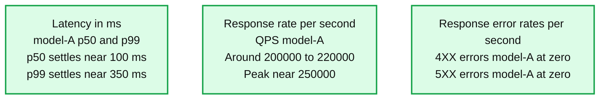

# How Superhuman and Databricks built a 200K QPS inference platform together

*Superhuman and Databricks engineers share how they jointly migrated spelling and grammar correction workloads to the Databricks Model Serving Platform, serving over 200k QPS, with 60% throughput gains and sub-second P99 latency.*

- Source: https://www.databricks.com/blog/how-superhuman-and-databricks-built-200k-qps-inference-platform-together
- Published: 2026-05-08
- Authors: Myke Troianovskyi, Christoph Stüber, Wai Wu, Arjun DCunha, Amine El Helou, Tian Ouyang, Jarek Odzga, Alex Coleman
- Categories: platform, product, engineering, databricks-ai, ai-engineering, industries, tech, data-strategy, data-leader, company, customers
- Images: 1 total, 1 extracted as architecture

**Key takeaways**

- Superhuman migrated from a DIY vLLM stack to Databricks FMAPI Provisioned Throughput, now serving a custom LLM at 200K+ QPS with sub-second P99 latency. This allowed the Superhuman engineering team to focus on building and improving their product, while delegating to the Databricks Data + AI Platform to handle the scale and infrastructure.
- Joint engineering optimizations delivered a 60% per-GPU throughput gain (750 → 1,200 QPS per H100 pod) and reduced serving costs through FP8 quantization, eliminating CPU-side overhead, and by optimizing attention kernels on the Hopper architecture, all achieved without quality regressions.
- Databricks FMAPI scales reliably to 250+ GPUs through production-grade load balancing, autoscaling, and fast container startup; with pre-production ramp stress testing ensuring p99 availability and latency targets are met before traffic ever hits production.

## From analytics partners to real-time inference partners

Superhuman, the productivity platform that includes Superhuman, Coda, Superhuman Mail and Superhuman Go, serves over 40 million daily users across dozens of languages. Superhuman's AI communication assistance provides real-time suggestions for correctness, clarity, tone, and style across every surface where people write.

Databricks and Superhuman have been partners for years. The Superhuman team has historically used the Databricks Data + AI Platform as the foundation for analytics. But analytics was only half the picture.

Behind many of Superhuman’s real-time suggestions is a highly sophisticated, custom AI model, served at a massive scale. Superhuman runs this model at peak traffic of over 200,000 queries per second, with end-to-end latency under 1 second at P99, and strict 4 9’s reliability guarantees. Superhuman modernized their serving stack for large language models by leveraging Databricks model serving, which required a new kind of partnership, built on joint product and engineering work.

**Summary:** Model-A sustains roughly 200,000 responses per second with latency settling near 100 ms at p50 and 350 ms at p99, while displayed error rates remain zero.

**Components:**
- Latency - p50 and p99 time series for model-A; serving technology unspecified.
- Response rate - QPS time series for model-A; serving technology unspecified.
- Response error rates - 4XX and 5XX errors per second for model-A; serving technology unspecified.

**Flows:**
- none. No arrows are visible.

**Numbers:**
- Date on all charts: Apr 28, 2026.
- Time ticks on all charts: 10:00, 10:10, 10:20, 10:30, 10:40, 10:50.
- Latency percentiles: p50 and p99.
- Latency axis in ms: 0.00, 200.00, 400.00, 600.00, 800.00, 1000.00.
- Approximate latency readings: p50 starts near 150 ms, peaks near 240 ms, then settles around 90-100 ms; p99 starts near 580 ms, peaks near 950 ms, then settles around 340-370 ms.
- Response rate axis in responses per second: 0.00, 50000.00, 100000.00, 150000.00, 200000.00, 250000.00.
- Approximate response rate readings: generally 200,000-220,000 per second, with a peak near 250,000 per second.
- Error categories: 4XX and 5XX.
- Error rate axis in errors per second: 0.00, 0.20, 0.40, 0.60, 0.80, 1.00.
- Both displayed error series remain at 0.00 errors per second.

source image: https://www.databricks.com/sites/default/files/inline-images/blog-How-Superhuman-and-Databricks-built-a-200K-QPS-inference-platform-together-img1_0.png

## How Superhuman modernized its serving stack

Before this migration, Superhuman operated a DIY serving stack built on vLLM, alongside internal tools for training and model management. An internal ML infrastructure team maintained this stack, which supported a massive scale, but several pain points were compounding when serving large language models.

The custom large language model powers grammatical error correction at enormous volume, 200K+ QPS peak with roughly 50 input tokens and 50 output tokens per request. It was pushing the limits of what the L40S-gpus-based stack could deliver. Each new iteration of the model required months of manual performance tuning to onboard. Meanwhile, the operational burden was growing, with capacity planning, performance tuning, and autoscaling consuming time from a lean team that needed to focus on model quality and product innovations.

Superhuman needed a platform partner who could commit to performance and latency SLAs on the serving stack, and who would co-invest in the engineering required to meet them. Both teams defined target real-time latency SLOs upfront: sub second p99 latency and zero quality regression on Superhuman’s internal evaluation harnesses.

## Meeting real-time SLAs on Platform Infrastructure

Hitting latency targets on a single pod is necessary but not sufficient. Serving 200K+ QPS reliably requires infrastructure that can balance load, scale dynamically, and absorb spikes. Getting this right required close collaboration between both teams.

### Optimizing load balancing: power-of-two choices

Superhuman’s grammar correction endpoint traffic exhibits strong diurnal patterns with rapid ramps in certain periods, often exceeding 200k QPS. While the default Kubernetes round robin load balancer is sufficient at low QPS, our tests revealed that this performance degrades at higher QPS, with uneven request distribution creating hotspots that spike tail latency.

At the core of our approach is the Endpoint Discovery Service (EDS) — a lightweight control plane that continuously monitors the Kubernetes API for changes to Services and EndpointSlices. EDS drives a custom load balancing algorithm based on the power of two choices ([citation](https://www.eecs.harvard.edu/~michaelm/postscripts/mythesis.pdf)). For each request, two candidate pods are sampled and traffic is routed to whichever has fewer active requests, preventing the hotspots that round-robin creates at high QPS (see [blog](https://www.databricks.com/blog/intelligent-kubernetes-load-balancing-databricks)).

To keep the platform cost-optimal for variable traffic patterns, the system autoscales dynamically with customer demand. The autoscaler tracks `request_concurrency `averaged across pods, with per-pod concurrency targets derived from benchmarking maximum sustainable RPS per replica. The scaling strategy is intentionally asymmetric: scale-up is aggressive and responsive, while scale-down is conservative, to prevent the flapping that causes latency spikes. Through joint shadow testing between Superhuman and Databricks, we caught edge cases and fixed issues when tuning parameters on autoscaler, including when to scale aggressively, when to hold steady, and how conservative to be on scale-down.

### Optimizing container startup via image acceleration

When Superhuman endpoint traffic ramps from off-peak to peak, the autoscaler needs to add dozens of pods. If each pod takes over minutes to pull its container image and start, users experience latency spikes during the ramp. Cutting pod start time directly translates to faster scale-up and smoother latency during traffic surges.

The Databricks model serving team adopted the image acceleration work originally built for serverless compute ([blog](https://www.databricks.com/blog/booting-databricks-vms-7x-faster-serverless-compute)) to avoid cold starts. The approach fits well for the relatively small models we served for Superhuman.

When building a container image, we add an extra step to convert the standard, gzip-based image format to the block-device-based format that is suitable for lazy loading. This allows the container image to be represented as a seekable block device with 4MB sectors in production.

When pulling container images, our customized container runtime retrieves only the metadata required to set up the container's root directory, including directory structure, file names, and permissions, and creates a virtual block device accordingly. It then mounts the virtual block device into the container so that the application can start running right away.

When the application reads a file for the first time, the I/O request against the virtual block device will issue a callback to the image fetcher process, which retrieves the actual block content from the remote container registry. The retrieved block content is also cached locally to prevent repeated network round trips to the container registry, reducing the impact of variable network latency on future reads.

This lazy-loading container filesystem eliminates the need to download the entire container image before starting the application, reducing time to start container from several minutes to just a few seconds.

## Runtime optimizations: 60% more throughput per pod

With the platform layer handling fleet-level scale, the next question was how many QPS each pod could support and at what cost.

In this section, we lay out the optimizations that increased per-pod throughput from 750 QPS to 1,200 QPS on H100 GPUs, a 60% improvement, while maintaining zero quality regressions.

### FP8 quantization

FP8 quantization was the single largest throughput improvement, achieving up to 30% increase in per-pod QPS.

Superhuman's ML team prequantized the checkpoint to FP8 using vLLM's online quantization library, producing a compressed-tensor format checkpoint that Databricks loaded for serving. In the final configuration, attention projections (Q, K, V, and output) and MLP projections all ran through the FP8 path, while KV-cache quantization was left disabled, since weight quantization was where the throughput wins came from and KV-cache quantization introduced its own quality tradeoffs that weren't worth pursuing for this workload.

Before settling on the final config, both teams iterated on which layers to quantize. MLP projections were quantized from the start, and the open question was whether to quantize the attention layers. Databricks model serving had designed the serving engine to support hybrid-precision inference from the start, so that if any layer group proved too quality-sensitive under quantization, we could keep it in higher precision without changing the overall serving architecture. We shipped a flag that enabled us to toggle attention quantization on and off, so both teams could measure its impact directly. The experiment landed cleanly, quantizing the Q/K/V and output projections produced no measurable quality degradation on Superhuman's evals.

The other consideration was quantization granularity. Off-the-shelf kernels used per-tensor scaling (a single FP8 scale factor for an entire weight tensor). Databrick’s kernels use per-channel scaling, computing a separate scale factor per output channel of each linear layer. This preserves dynamic range where it matters, keeps MLP-layer quantization error well below the threshold where it shows up in evals. Combined with kernel-level improvements, per-channel quantization matched or exceeded other open source baselines at the same throughput.

### Eliminating CPU-side bottlenecks

For small, fast models, performance is often bottlenecked by the CPU – not the GPU. The Databricks team had already investigated eliminating CPU bottlenecks in their work on[fast PEFT serving](https://www.databricks.com/blog/fast-peft-serving-scale) and here applied similar CPU optimizations directly to Superhuman's workload.

Specifically the team introduced a multiprocessing runtime server. For most model serving workloads, a single process is more than fast enough to keep the GPU saturated, since the GPU is the bottleneck, not the CPU. But with a small, fast model, the GPU completes its forward pass faster than a single process can prepare the next batch, flipping the bottleneck to the CPU.

The team addressed this by running multiple RPC server processes. By having multiple CPU processes prepare and dispatch work to the GPU in parallel, we eliminated the single-process serialization bottleneck. This delivered another 20% additional throughput.

Other CPU-side optimizations improved performance by a few percentage points.

1. *Reduced Python overhead.* We replaced Python-level tensor slicing, copying, and filling at the start of each CUDA graph decode step with a single C++ call. We also explored parallel strategies (ThreadPool, OpenMP) but single-threaded C++ was optimal due to CUDA synchronization overhead. This cut GPU idle slightly per forward pass.
2. *Async scheduling for better CPU-GPU work overlap.* We moved CPU-side post-processing off the critical path so it runs concurrently with the next GPU forward pass. Rather than finishing all post-processing for batch N before launching batch N+1, the scheduler dispatches N+1 immediately and handles N's post-processing in parallel. Post-processing also iterates only over the relevant subset of requests rather than the full batch. This resulted in the next forward pass starting sooner.

## What's next

This work is the foundation for a broader partnership. Superhuman is now migrating additional models to Databricks, spanning different model sizes, task types, and latency requirements — and adopting the AI Platform more broadly for training workflows, experiment tracking, evaluations (classical ML, Deep-Learning and Generative AI/Agents), model and (LLM) judges registry and agent traces ingestion at scale.

Building this large scale platform was a company-wide effort on both sides, and an extraordinary learning experience. Huge thanks to the Superhuman ML and infrastructure teams for the deep collaboration, the willingness to iterate in the open on hard tradeoffs, and the rigor they brought to every quality bar and load test. The engineering playbook we built together is theirs as much as ours, and we're excited to bring the same level of partnership to every workload that follows.

## Key takeaways

Using a managed inference service does not have to mean giving up control. Superhuman retains full ownership of model training, quantization, and quality standards, while Databricks maintains runtime performance and platform reliability. This division of responsibilities works well with shared SLOs, joint quality validation and progressive load testing when onboarding onto the Databricks platform.

Ready to serve your custom models at scale? Learn how Databricks Foundation Model API can meet your most demanding inference SLAs — and give your team a true engineering partner, not just a managed service. Contact us at [https://www.databricks.com/company/contact](https://www.databricks.com/company/contact) to onboard your high-QPS model-serving use case.
