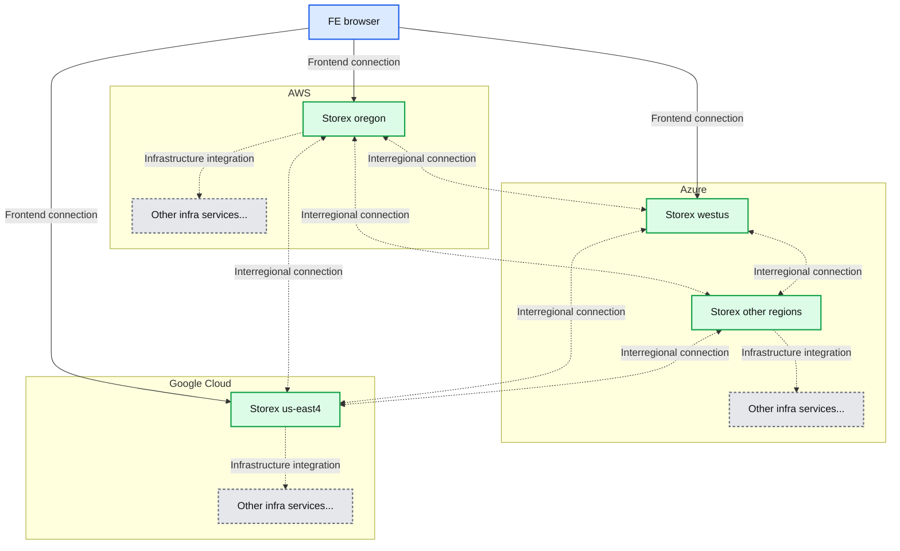
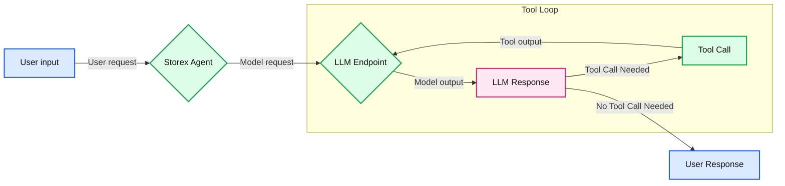
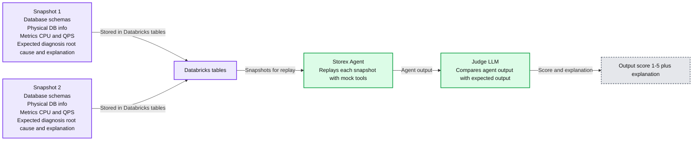

# How We Debug 1000s of Databases with AI at Databricks

*Lessons from building an AI-assisted database debugging platform*

- Source: https://www.databricks.com/blog/how-we-debug-1000s-databases-ai-databricks
- Published: 2025-12-03
- Authors: Annie Zhou, Madhav Ramesh, A Kishore Kumar
- Categories: engineering
- Images: 6 total, 3 extracted as architecture

**Key takeaways**

- At Databricks, we operate thousands of OLTP instances across hundreds of regions in AWS, Azure, and GCP.
- We built an agentic platform that unifies metrics, tooling, and expertise to help our engineers manage their databases at this scale.
- This agentic platform is now used company-wide, cutting debugging time by up to 90% and reducing the learning curve for operating our infrastructure.

At Databricks, we’ve replaced manual database operations with AI, reducing time spent debugging by up to 90%.

Our AI agent interprets, executes, and debugs by retrieving key metrics and logs, and automatically correlating signals. It operates across a fleet of databases deployed on **every major cloud** and in **nearly every cloud region**.

This new agentic capability has enabled engineers to routinely answer questions in natural language about their service health and performance without needing to reach out to on-call engineers in the storage teams.

What started as a small hackathon project to simplify the investigation workflow has since evolved into an intelligent platform with company-wide adoption. This is our journey.

## Pre AI: Everything Worked, but Nothing Worked Together

During a typical MySQL incident investigation, an engineer would often

- Check metrics in Grafana
- Switch to a Databricks dashboard to understand the client workload
- Run CLI commands to inspect InnoDB status, a snapshot of the internal MySQL state that contains information like transaction history, I/O operations, and deadlock details
- Log in to a cloud console to download slow query logs

Each tool worked fine on its own, but together they failed to form a cohesive workflow or provide end-to-end insight. A seasoned MySQL engineer could stitch together a hypothesis by jumping across tabs and commands in just the right sequence; however, this burns precious SLO budget and time in the process. A newer engineer often wouldn't know where to start.

Ironically, this fragmentation in our internal tooling reflected the very challenge Databricks helps our customers overcome.

The Databricks Data + AI Platform unifies data, governance, and AI, enabling authorized users to understand their data and act on it. Internally, our engineers require the same: a unified platform that consolidates the data and workflows that underpin our infrastructure. With that foundation, we can apply intelligence by using AI to interpret the data and guide engineers to the next right step.

## Our Journey: From Hackathon to Intelligent Agents

We didn’t start with a large, multi-quarter initiative. Instead, we tested the idea during a company-wide hackathon. In two days, we built a simple prototype that unified a few core database metrics and dashboards into a single view. It wasn’t polished, but it immediately improved basic investigation workflows. That set our guiding principle: **move fast and stay customer-obsessed**.

### Building Platforms with Customer Obsession

Before writing more code, we interviewed service teams to understand their pain points in debugging. The themes were consistent: junior engineers didn’t know where to start, and senior engineers found the tooling to be fragmented and cumbersome.

To see the pain firsthand, we shadowed on-call sessions and watched engineers debug issues in real-time. Three patterns stood out:

- **Fragmented tooling**
Engineers juggled dashboards, CLIs, and manual steps for investigation and operations like restarts or restores. Each tool worked in isolation, but the lack of integration made the workflow slow and error-prone.
- **Time wasted gathering context**
Most of the work was figuring out what changed, what “normal” looked like, and who had the right context to help, but not actually mitigating the incident.
- **Unclear guidance on safe mitigation**
During incidents, engineers often weren’t sure which actions were safe or effective. Without clear runbooks or automation, they defaulted to long investigations or waited for experts.

Looking back, postmortems rarely exposed this gap: teams didn’t lack data or tools; they lacked **intelligent debugging** to interpret the flood of signals and guide them toward safe and effective actions.

### Iterating Toward Intelligence

We started small, with database investigation as the first use case. Our v1 was a static agentic workflow that followed a debugging SOP, but it wasn’t effective — engineers wanted a diagnostic report with immediate insights, not a manual checklist.

We shifted our focus to obtaining the right data and layering intelligence on top. This strategy led to anomaly detection, which surfaced the right anomalies, but still didn’t provide clear next steps.

The real breakthrough came with a chat assistant that codifies debugging knowledge, answers follow-ups, and turns investigations into an interactive process. This transformed how engineers debug incidents end-to-end.

Evolution of our investigation workflow through user feedback

### A Foundation: Abstraction and Centralization

Taking a step back, we realized that while our existing framework could unify workflows and data in a single interface, our ecosystem wasn’t built for AI to reason over our operational landscape. Any agent would need to handle region- and cloud-specific logic. And without centralized access controls, it would become either too restrictive to be useful or too permissive to be safe.

These problems are especially hard to solve at Databricks, as we operate thousands of database instances across hundreds of regions, eight regulatory domains, and three clouds. Without a solid foundation that abstracts cloud and regulatory differences, AI integration would quickly run into a set of unavoidable roadblocks:

- **Context fragmentation:** Debugging data lived in different places, making it hard for an agent to construct a consistent picture.
- **Unclear governance boundaries:** Without centralized authorization and policy enforcement, ensuring the agent (and engineers) stay within the right permissions becomes difficult.
- **Slow iteration loops:** Inconsistent abstractions make it hard to test and evolve AI behavior, severely slowing iteration over time.

To make AI development safe and scalable, we focused on strengthening the platform’s foundation around three principles:

- **Central-first sharded architecture,** where a global Storex instance coordinates regional shards, providing one interface while keeping sensitive data local and compliant.
- **Fine-grained access control,** enforced at the team, resource, and RPC levels, ensuring engineers and agents operate safely within the right permissions.
- **Unified orchestration,** where our platform integrates existing infrastructure services, enabling consistent abstractions across clouds and regions.

*Central-first, sharded architecture with integration with other infra services*

**Summary:** A browser frontend connects to regional Storex services across AWS, Azure, and Google Cloud, with interregional connections and integrations with other infrastructure services.

**Components:**
- FE browser: browser frontend.
- AWS: cloud hosting Storex in oregon and other infrastructure services.
- Storex oregon: regional Storex service on AWS.
- Other infra services on AWS: unspecified infrastructure services.
- Azure: cloud hosting Storex in westus and other regions, plus infrastructure services.
- Storex westus: regional Storex service on Azure.
- Storex other regions: additional regional Storex services on Azure.
- Other infra services on Azure: unspecified infrastructure services.
- Google Cloud: cloud hosting Storex in us-east4 and other infrastructure services.
- Storex us-east4: regional Storex service on Google Cloud.
- Other infra services on Google Cloud: unspecified infrastructure services.

**Flows:**
- FE browser -> Storex oregon: frontend connection; payload unspecified.
- FE browser -> Storex westus: frontend connection; payload unspecified.
- FE browser -> Storex us-east4: frontend connection; payload unspecified.
- Storex oregon <-> Storex westus: dashed interregional connection; payload unspecified.
- Storex oregon <-> Storex other regions: dashed interregional connection; payload unspecified.
- Storex oregon <-> Storex us-east4: dashed interregional connection; payload unspecified.
- Storex westus <-> Storex other regions: dashed interregional connection; payload unspecified.
- Storex westus <-> Storex us-east4: dashed interregional connection; payload unspecified.
- Storex other regions <-> Storex us-east4: dashed interregional connection; payload unspecified.
- Storex oregon -> Other infra services on AWS: dashed infrastructure integration; payload unspecified.
- Storex other regions -> Other infra services on Azure: dashed infrastructure integration; payload unspecified.
- Storex us-east4 -> Other infra services on Google Cloud: dashed infrastructure integration; payload unspecified.

**Numbers:** No quantitative values. The digit 4 appears in the region name us-east4.

source image: https://www.databricks.com/sites/default/files/inline-images/2025-11-blog-how-we-brought-ai-to-database-debugging-at-databricks-inline-2-1200x628-2x.png

Central-first, sharded architecture with integration with other infra services

With data and context centralized, the next step became clear: **how could we make the platform not just unified, but intelligent?**

### From Visibility to Intelligence

With a unified foundation in place, implementing and exposing capabilities like retrieving database schemas, metrics, or slow query logs to the AI agent was straightforward. Within a few weeks, we built an agent that could aggregate basic database information, reason about it, and present it back to the user.

Now the hard part was making the agent **reliable**: given that LLMs are non-deterministic, we didn’t know how it would respond to the tools, data, and prompts it had access to. Getting this right required a lot of experimentation to understand which tools were effective and what context to include (or leave out) in the prompts.

To enable this rapid iteration, we built a lightweight framework inspired by MLflow’s prompt optimization technologies that leverages [DsPy, which](https://docs.databricks.com/aws/en/generative-ai/dspy/) decouples prompting from tool implementation. Engineers can define tools as normal Scala classes and function signatures, and simply add a short docstring describing the tool. From there, the LLM can infer the tool’s input format, output structure, and how to interpret the results. This decoupling lets us move quickly: we can iterate on prompts or swap tools in and out of the agent without constantly changing the underlying infrastructure that handles parsing, LLM connections, or conversation state.

*The loop storex uses to decide what tools to call and when*

**Summary:** Storex routes user input through an LLM tool loop that repeats tool calls as needed before returning a user response.

**Components:**
- User input: incoming request; technology unspecified.
- Storex Agent: agent coordinating the request; implementation unspecified.
- Tool Loop: boundary containing LLM processing and tool execution.
- LLM Endpoint: language model endpoint; model and provider unspecified.
- LLM Response: model output used to determine whether a tool call is needed.
- Tool Call: tool execution; tools unspecified.
- User Response: final output to the user; technology unspecified.

**Flows:**
- User input -> Storex Agent: user request.
- Storex Agent -> LLM Endpoint: request for model processing.
- LLM Endpoint -> LLM Response: model output.
- LLM Response -> Tool Call: tool call needed.
- Tool Call -> LLM Endpoint: tool output returned for further processing.
- LLM Response -> User Response: no tool call needed.

**Numbers:** none

source image: https://www.databricks.com/sites/default/files/inline-images/2025-11-blog-how-we-brought-ai-to-database-debugging-at-databricks-inline-3-1200x628-2x.png

[The loop storex uses to decide what tools to call and when](https://www.databricks.com/sites/default/files/inline-images/how-we-debug-1000s-databases-with-ai-databricks-image-4.png)

As we iterate, how do we prove the agent is getting better without introducing regressions? To address this, we created a validation framework that captures snapshots of the production state and replays them through the agent, using a separate [“judge” LLM](https://docs.databricks.com/aws/en/mlflow3/genai/eval-monitor/concepts/judges/) to score the responses for accuracy and helpfulness as we modify the prompts and tools.

**Summary:** Production snapshots stored in Databricks tables are replayed through the Storex Agent and evaluated by a judge LLM to produce a score and explanation.

**Components:**
- Snapshot 1: Database schemas, physical DB info, and metrics such as CPU and QPS, paired with an expected root cause and explanation.
- Snapshot 2: Database schemas, physical DB info, and metrics such as CPU and QPS, paired with an expected root cause and explanation.
- Databricks: Tables storing the snapshots.
- Storex Agent: Replays each snapshot with mock tools.
- Judge LLM: Compares agent output with expected output.
- Output: Score from 1 to 5 plus an explanation.

**Flows:**
- Snapshot 1 -> Databricks: Snapshot stored in Databricks tables.
- Snapshot 2 -> Databricks: Snapshot stored in Databricks tables.
- Databricks -> Storex Agent: Snapshots for replay with mock tools.
- Storex Agent -> Judge LLM: Agent output for comparison with expected output.
- Judge LLM -> Output: Score and explanation.

**Numbers:** Snapshot 1; Snapshot 2; output score 1-5.

source image: https://www.databricks.com/sites/default/files/inline-images/2025-11-blog-how-we-brought-ai-to-database-debugging-at-databricks-inline-4-1200x628-2x.png

Because this framework lets us iterate quickly, we can easily spin up specialized agents for different domains: one focused on system and database issues, another on client-side traffic patterns, and so on. This decomposition enables each agent to build deep expertise in its area while collaborating with others to deliver a more complete root cause analysis. It also paves the way for integrating AI agents into other parts of our infrastructure, extending beyond databases.

With both expert knowledge and operational context codified into its reasoning, our agent can extract meaningful insights and actively guide engineers through investigations. Within minutes, it surfaces relevant logs and metrics that engineers might not have considered examining. It connects symptoms across layers, such as identifying the workspace driving unexpected load and correlating IOPS spikes with recent schema migrations. It even explains the underlying cause and effect, and recommends the next steps for mitigation.

Together, these pieces mark our shift from visibility to intelligence. We’ve moved beyond visibility from tools and metrics to a reasoning layer that understands our systems, applies expert knowledge, and guides engineers toward safe, effective mitigations. It’s a foundation we can keep building on for not only databases but also how we operate infrastructure as a whole.

## The Impact: Redefining How We Build and Operate at Scale

The platform has changed how Databricks engineers interact with their infrastructure. Individual steps that once required switching between dashboards, CLIs, and SOPs can now be easily answered by our chat assistant, cutting the time spent by up to 90%.

The learning curve for our infrastructure among new engineers also dropped sharply. New hires with zero context can now jump-start a database investigation in under 5 minutes, something that would have been nearly impossible before. And we’ve gotten great feedback since the launch of this platform:

> Database assistant really saves me a ton of time so that I don't need to remember where all my queries dashboards are. I can just ask it which workspace is generating the load. Best tool ever!—Yuchen Huo, Staff Engineer

> I am a heavy user and can't believe we used to live in its absence. The level of polish and utility is very impressive. Thanks team, it's a step change in developer experience.—Dmitriy Kunitskiy, Staff Engineer

> Particularly love how we're bringing AI powered insights to debugging infrastructure issues. Appreciate how forward thinking the team has been on designing this console from the ground up with that in mind.—Ankit Mathur, Senior Staff Engineer

Architecturally, the platform lays the foundation for the next evolution: AI-assisted production operations. With data, context, and guardrails unified, we can now explore how the agent can help with restores, production queries, and configuration updates: the next step towards an AI assisted operational workflow.

But the most meaningful impact wasn’t just reduced toil or faster onboarding: it was a shift in mindset. Our focus has shifted from technical architecture to the critical user journeys (CUJs) that define how engineers experience our systems. This user-first approach is what enables our infrastructure teams to create platforms upon which our engineers can build category-winning products.

## Takeaways

In the end, our journey distilled down to three takeaways:

- **Rapid iteration is essential for agent development:** Agents improve through fast experimentation, validation and refinement. Our DsPy-inspired framework enabled this by letting us quickly evolve prompts and tools.
- **The speed of iteration is bounded by the foundation underneath:** Unified data, consistent abstractions and fine-grained access control removed our biggest bottlenecks, making the platform reliable, scalable and ready for AI.
- **Speed only matters when it has a correct direction:** We didn’t set out to build an agent platform. Each iteration simply followed user feedback and pulled us closer to the solution engineers needed.

Building internal platforms is deceptively hard. Even within the same company, product and platform teams operate under very different constraints. At Databricks, we’re bridging that gap by building with customer obsession, simplifying through abstractions, and elevating with intelligence, treating our internal customers with the same care and rigor we bring to our external ones.

## Join Us

As we look ahead, we’re excited to keep pushing the boundaries of how AI can shape production systems and make complex infrastructure feel effortless. If you’re passionate about building the next generation of AI-powered internal platforms, join us!
