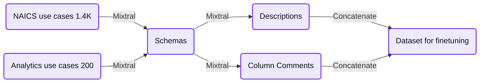

# How we improved DatabricksIQ LLM quality for AI-generated table comments

*Swapping in SOTA open-source models and automating quality evaluation with minimal effort*

- Source: https://www.databricks.com/blog/how-we-improved-databricksiq-llm-quality-ai-generated-table-comments
- Published: 2024-04-29
- Authors: Sudarshan Seshadri, Matthew Hayes, Ritendra Datta, Richard Tomlinson
- Categories: engineering
- Images: 2 total, 1 extracted as architecture

We recently made significant improvements to the underlying algorithms supporting [AI-generated comments](https://www.databricks.com/blog/announcing-public-preview-ai-generated-documentation-databricks-unity-catalog) in Unity Catalog and we’re excited to share our results.  Through [DatabricksIQ](https://www.databricks.com/product/databricksiq), the Data Intelligence Engine for Databricks, AI-generated comments are already generating the vast majority of new documentation for customers’ Unity Catalog tables, and recent enhancements help to make this wildly popular feature more powerful. 

 

In this blog we’ll discuss how we’re using an updated open-source LLM for synthesizing training data, heuristic filters for cleaning training data, an updated base model for fine-tuning, and an expanded evaluation set utilized in an automated benchmark.  With minimal effort, these changes have resulted in a** twofold increase** in preference rates over the previously deployed model in offline benchmarks. More broadly, this work has made DatabricksIQ even more powerful at serving the gamut of our customers’ Applied AI use cases.

## Why you need AI-generated comments

Adding comments and documentation to your enterprise data is a thankless task but when your organization's tables are sparsely documented, both humans and AI agents struggle to find the right data for accurately answering your data questions.  [AI-generated comments](https://docs.databricks.com/en/catalog-explorer/ai-comments.html) address this by automating the manual process of adding descriptions to tables and columns through the magic of generative AI. 

 

Last fall we wrote how [two engineers spent one month training a bespoke LLM](https://www.databricks.com/blog/creating-bespoke-llm-ai-generated-documentation) to tackle the problem of automatically generating documentation for your tables in [Unity Catalog](https://www.databricks.com/product/unity-catalog). The model’s task, in a nutshell, is to generate table descriptions and column comments when presented with a table schema. This previous work involved fine-tuning a modestly sized MPT-7B model on about 3600 synthesized examples and then benchmarking this model through a double-blind evaluation using 62 sample tables.  With this context, let’s walk through what we changed to make our model even better.

## Improving the training data

The same week that Mistral AI made their mixture-of-experts model publicly available, we started generating synthetic datasets with Mixtral 8x7B Instruct. Like the previous approach, we started with use cases defined in NAICS codes and a Databricks internal taxonomy. Using Mixtral we then generated several CREATE TABLE statements for each use case, and then used Mixtral again to generate table descriptions and column comments for each generated schema. Because Mixtral 8x7B has a lower inference latency than other LLMs of its size, we could generate 9K synthetic training samples in just under 2 hours. 

 

**Summary:** Mixtral generates schemas from NAICS and analytics use cases, then generates descriptions and column comments that are concatenated into a finetuning dataset.

**Components:**
- NAICS use cases: source use cases; no technology specified.
- Analytics use cases: source use cases; no technology specified.
- Schemas: generated using Mixtral.
- Descriptions: generated using Mixtral.
- Column Comments: generated using Mixtral.
- Dataset for finetuning: concatenated outputs; no storage technology specified.
- Concatenate: operation combining descriptions and column comments.

**Flows:**
- NAICS use cases -> Schemas: Mixtral generates schemas.
- Analytics use cases -> Schemas: Mixtral generates schemas.
- Schemas -> Descriptions: Mixtral generates descriptions.
- Schemas -> Column Comments: Mixtral generates column comments.
- Descriptions -> Dataset for finetuning: descriptions are concatenated.
- Column Comments -> Dataset for finetuning: column comments are concatenated.

**Numbers:**
- NAICS use cases: 1.4K.
- Analytics use cases: 200.

source image: https://lh7-us.googleusercontent.com/G4KuUZsms6Hqb6rz3pCpgFQvMLLyi5WrSFZsOiI3-Ku3ZGtUREKVSvaI_QU9wT5A_SBA8XDs6x4LDgu2WHgio6L2PsUDktP3at5GPv-LIXo4ZaKcy2_d94iJuPyWxiwAfkJoF5IluWd_HWK3oFphXdM

 

During this exercise, we found that if you just craft a prompt and start generating lots of synthetic data with an LLM,  some of the data generated might not have quite the right format, either stylistically or syntactically. For example, if you want all table descriptions to have between 2 and 4 sentences, just stating that in the prompt may not be enough for your LLM to consistently obey. This is why, during generation, we presented few-shot examples in a chat format to teach Mixtral our desired output format (e.g. a valid CREATE TABLE statement when we are generating schemas). We used this technique to take advantage of Mixtral’s instruction-tuning to create a dataset with coherent examples.

### Better filtering

Even with few-shot examples and instruction tuning, the output is often less than desirable. For example, some of the schemas generated may not have enough columns to be realistic or educational. Descriptions often just regurgitate the names of the columns rather than summarize them, or they may contain hyperbolic language we don’t want our fine-tuned model to copy. Below are some examples of our filters in action:

 

The following generated schema was rejected since it does not follow the `CREATE TABLE …` syntax.

 

`CREATE TYPE agritech.weather.windDirection AS ENUM ('N', 'NNE', 'NE', 'ENE', 'E', 'ESE', 'SE', 'SSE', 'S', 'SSW', 'SW', 'WSW', 'W', 'WNW', 'NW', 'NNW')`

 

The following synthetic description for a table about equipment maintenance was rejected because it just lists out the tables columns. This is a filter on the stylistic content of the training data, since we wouldn’t want a model that regurgitates whatever schema we give it.

 

*The 'EquipmentRepair' table tracks repair records for all equipment, detailing the customer who requested the repair, the equipment model in question, the date of the repair, the technician who performed it, the status of the repaired equipment, the wait time for the repair, the cost of the repair, and any customer reviews related to the repair experience. This data can be used to identify trends in repair costs, equipment reliability, and customer satisfaction. It is also useful for managing equipment maintenance schedules and finding out the most commonly reported issues with specific equipment models.*

 

To increase the overall quality of our synthetic dataset, we defined several heuristic filters to remove any schemas, descriptions, or column comments that were undesirable for training. After this process, we were left with about 7K of our original 9K samples. 

## Fine-tuning

With this filtered synthetic dataset of 7K samples for both table description and column comments, we fine-tuned a Mistral-7B v1 Instruct model, which has roughly the same size and latency as our previous production model (MPT-7B). In the end, we opted for Mistral-7B over MPT-7B as it was the highest-ranking 7B parameter model at the time in the [chatbot arena](https://huggingface.co/spaces/lmsys/chatbot-arena-leaderboard). We ran parameter-efficient fine-tuning for two epochs on our training dataset, which took about 45 minutes to complete, and our model was ready for evaluation.

## Improved model evaluation

Our previous approach bootstrapped an evaluation set of 62 schemas which was a mixture consisting of synthetic (previously unseen) tables and real tables we curated from our own Databricks workspace.  Using synthetic samples for evaluation is great when data is hard to find, but it often lacks real-world characteristics.  To address this we sampled 500 of the most used tables in our Databricks workspace to form an evaluation set that is much more representative of actual usage.

 

To validate this new model before launch, we generated table descriptions with both the previous model and our new model over all 500 evaluation tables. We used our double-blind evaluation framework to measure which generated descriptions are preferred by our evaluator. Because it would be expensive to have humans annotate 500 such samples during our development cycle, we updated our framework so that it would leverage another LLM as the evaluator, with a prompt crafted to clearly define the evaluation task.  There are a few notable features of our automated evaluation to highlight:

 

- Rather than requiring the model to pick the best among two outputs, we allowed ties.  When we ourselves performed the evaluation task we sometimes found that the two outputs were too close to call, so it was important to give the model this flexibility as well.
- The model was required to provide an explanation behind its answer.  This technique has been found in research and industry to lead to more accurate results.  We logged all these explanations, giving us the opportunity to check its work and ensure the model is making a choice based on correct reasoning.
- We generated multiple ratings for each sample and chose the final rating using a majority vote.

 

The model’s explanations gave us insights into where the prompt defining the task for evaluation could be improved, leading to ratings that were much more consistent with human judgment.   Once we finished tweaking the knobs in our approach, we asked two human evaluators to judge 100 random evaluation samples. Although our human evaluators are less likely to have an equal preference than the LLM evaluator, both evaluators show a clear preference for the new model. In fact, human evaluators preferred the new model output roughly twice as often as they preferred the previous production models output. 

| Evaluator | Preference for the previous model | Equal preference | Preference for new model |
|---|---|---|---|
| LLM | 6.0% | 73.8% | 20.2% |
| Humans | 17.0% | 47.0% | 36.0% |

Using just LLM evaluation for performance reasons,  we also repeated the same evaluation process for the task of generating column comments. Our LLM evaluator preferred the new model nearly three times as often as the previous model.

| Evaluator | Preference for the previous model | Equal preference | Preference for new model |
|---|---|---|---|
| LLM | 11.8% | 59.0% | 29.2% |

## Deploying the new LLM

After analyzing offline evaluations, it was time to deploy our new model. Following the same steps as before, we registered the model in Unity Catalog (UC), leveraged Delta Sharing to expose it in all production regions, and then served it via Databricks’ [optimized LLM serving](https://docs.databricks.com/en/machine-learning/model-serving/index.html). 

## Key takeaways

Through the techniques discussed in this blog, we significantly improved DatabricksIQ’s ability to automatically generate table and column comments with AI. To do this we leveraged an open source LLM to produce a large training dataset. Then, using human intuition and experience we cleaned up the dataset using heuristic filters. Finally, we fine-tuned another smaller LLM to supersede the current model. By improving our evaluation set by including lots of realistic samples, we were more confident that our gains in an offline setting would translate into higher-quality results for customers.

 

We hope these learnings are helpful to anyone who wants to leverage open source LLMs to tackle a concrete task at hand. Although each step of the process requires care and analysis, it has never been easier to leverage LLMs with tools like the [Databricks Foundational Model API](https://docs.databricks.com/en/machine-learning/foundation-models/index.html) and [optimized LLM serving](https://docs.databricks.com/en/machine-learning/model-serving/index.html).

## Ready to use AI-generated comments?

AI-generated comments can be accessed by opening Catalog Explorer and selecting a table managed by Unity Catalog. From there you will see the option to generate and accept AI-comments.

 

If you don’t see the AI-generated comments icons your administrator can follow the instructions documented [here](https://docs.databricks.com/en/notebooks/databricks-assistant-faq.html#what-is-databricks-assistant) to enable DatabricksIQ features in your Databricks Account and workspaces.
