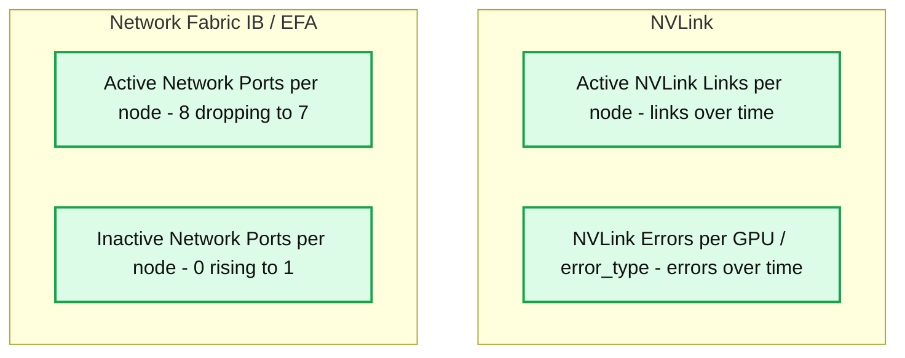
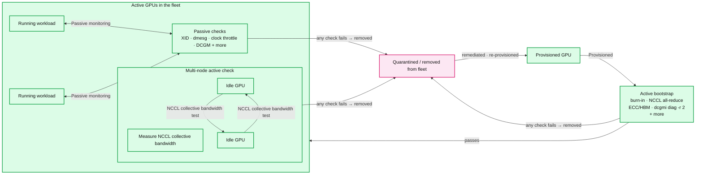

# How we keep GPUs reliable across Databricks AI

- Source: https://www.databricks.com/blog/how-we-keep-gpus-reliable-across-databricks-ai
- Published: 2026-07-01
- Authors: Steven Chen, Feng Wang, Bhavik Soni, Chengguang Yang,  Albert Zhong, Naren Loganathan, Harsh Panchal, Jianwei Xie
- Categories: engineering, databricks-ai, ai-engineering
- Images: 2 total, 2 extracted as architecture

**Key takeaways**

- GPU failures at scale roughly fall into three buckets: crashed jobs that announce themselves, silent slowdowns that quietly bottleneck throughput on the slowest GPU, and numerical corruption that produces incorrect results.
- Databricks AI stress-tests the platform with diverse, large-scale workloads like RL for agentic coding. These surface fabric flakiness, thermal hotspots, and collective-communication edge cases before they reach broader production.
- A health check system needs to catch failures across the full node lifecycle. That means validating GPU hardware before workloads start, watching for silent degradation under load, and probing inter-node NCCL fabric health in between.

Distributed GPU training has become routine across the industry. Teams now train foundation models, fine-tune frontier-scale models, build large vision systems, and run deep recommender networks at scales that were once the domain of frontier labs alone.

Building GPU infrastructure that can meet today's scale requires getting a lot of things right: detecting the failures that take down a run, surfacing the slow degradations that never announce themselves, validating fabric health across thousands of links, scheduling around hardware that will eventually fail, and recovering cleanly when it does. Many of these are foundational, and the harder problems higher up the stack depend on them.

At Databricks AI, we run training workloads at massive scale every week, where failures show up continuously across hardware, fabric, and software. This series covers what it takes to keep GPUs reliable at this scale, starting with the foundation in this first post: the failure modes you encounter running GPUs, the diverse workloads that surface them, and the multi-stage health check system that catches them. Training is the most demanding workload class and the focus here, though the same engineering serves inference and other GPU workloads at Databricks.

## How GPUs fail under training load

Most GPU failures at scale fall into three categories: crashed jobs, silent slowdowns, and numerical corruption. Crashed jobs are the easy case, in the sense that you know immediately when one happens. The harder failures are workloads that complete with wrong numbers in the model, or run at degraded performance for hours without anyone noticing.

**Crashed jobs.** Distributed training jobs crash for many reasons: a GPU degrading or falling off the bus, RDMA fabric issues, an I/O system hang, a CPU-side rank diverging from the others. From the workload's perspective, almost all of these surface as the same thing: the job crashing with the dreaded [NCCL watchdog timeout](https://pytorch.org/blog/flight-recorder-a-new-lens-for-understanding-nccl-watchdog-timeouts/) message in the logs. Every rank blocks on the same collective, the watchdog eventually kills the job, and you restart from the last checkpoint. But the timeout itself tells you almost nothing about the root cause. Diagnosing what actually went wrong often means tracing across hardware, fabric, filesystem, and software layers from a stack trace that only shows the symptom.

**Silent slowdowns.** A silently degraded GPU can continue to make training progress, with logs looking fine and loss still trending down. However, the throughput is bottlenecked on the slowest GPU, wasting compute and money. These slowdowns come from hardware running in a degraded state, where thermal sensors trip under sustained load, interconnect links downgrade after persistent errors, or memory bandwidth drops as faults accumulate. Each shows up in different hardware-level signals, e.g. [DCGM](https://docs.nvidia.com/datacenter/dcgm/latest/user-guide/feature-overview.html) throttle reasons like `HW_SLOWDOWN` or `HW_THERMAL_SLOWDOWN` for thermal, or link health for interconnects.

**Numerical corruption.** Modern GPUs use Error Correction Code (ECC) to detect and automatically correct many transient memory faults without interrupting training. However, not all faults can be recovered. Corruption may originate in memory, interconnects, kernels, or software layers and can propagate before it is detected or contained. In those cases, training may stop immediately or continue with incorrect values. Failures can appear as NaN losses, unstable convergence, or model quality regressions that are only discovered later.

## Our approach to GPU reliability

GPU hardware failure event rates can be an order of magnitude higher than CPUs. As a conservative back-of-the-envelope assumption, take each GPU as having a 1% annualized failure event rate. For a job using N GPUs over T days, the probability of at least one event is approximately:

A 256-GPU job running for 30 days has about a 19% chance of seeing a failure. At 1,024 GPUs, that climbs to 57%. At this scale, failures during a run are expected, not exceptional. As a foundation, two engineering investments keep training reliable despite them: stress testing with diverse, cutting-edge workloads that surface failures early, and a multi-stage health check system that catches them across the fleet.

### Stress testing the platform with cutting-edge workloads

Databricks AI runs a range of demanding training workloads on the same platform customers use: reinforcement learning training for models like[KARL](https://www.databricks.com/blog/meet-karl-faster-agent-enterprise-knowledge-powered-custom-rl), agentic coding models, document intelligence systems like the one behind[PDFs in production](https://www.databricks.com/blog/pdfs-production-announcing-state-art-document-intelligence-databricks-article), and more. These aren't typical training jobs. RL workloads combine training, inference, and reward computation in tight loops across many GPUs. Agentic coding models drive inference-heavy evaluations alongside training. Document intelligence pipelines combine model training with heavy image-based data loading.

Each one stresses the platform in distinct ways, which makes them effective at surfacing operational issues like fabric flakiness, thermal hotspots, and edge cases in collective communication before they reach broader production workloads.

**Summary:** GPU and network health metrics show active NVLink links, NVLink errors, and a drop in active network ports accompanied by an inactive port.

**Components:**
- Active NVLink Links per node: NVIDIA NVLink link counts for Azure nodes.
- NVLink Errors per GPU / error_type: NVIDIA NVLink error counts, with visible series labeled `dl_crc_data`.
- Network Fabric IB / EFA: InfiniBand / Elastic Fabric Adapter monitoring section.
- Active Network Ports per node: active network fabric port counts.
- Inactive Network Ports per node: inactive network fabric port counts.

**Flows:**
- none. The panels contain time series with no arrows.

**Numbers:**
- All panels show hourly time labels: 17:00, 18:00, 19:00, 20:00, 21:00, 22:00.
- Active NVLink links axis: 0, 20, 40, 60, 80, 100, 120, 140, 160 links. A sustained series sits slightly above 140.
- NVLink errors axis: 0, 1 K, 2 K, 3 K, 4 K, 5 K, 6 K, 7 K, 8 K errors.
- NVLink error legend: GPU 1, 2, 3, 4.
- Active network ports axis: 0, 2, 4, 6, 8 ports. Visible series include 0, 7, and 8 ports.
- Inactive network ports axis: 0, 0.2, 0.4, 0.6, 0.8, 1 port. Visible series include 0 and 1 port.

source image: https://www.databricks.com/sites/default/files/blog_images/how-we-keep-gpus-reliable-across-databricks-blog-img-1.png

Here's what one recent issue looked like. A training run failed with a NCCL timeout seven hours into training. Investigation showed that a single Infiniband port used for RDMA NCCL collectives had gone down once and recovered. It never flapped again. Our continuous health checks monitor IB port flapping, but a single isolated flap doesn't normally indicate an unhealthy port, so it wouldn't trip the threshold on its own.

The crash came down to which of two NCCL timeouts fires first. Most discussions of NCCL configuration focus on the PyTorch NCCL watchdog timeout, configurable via `init_process_group(timeout=...)`, which kills a hung collective after some configurable duration (typically 10 minutes). A second timeout sits lower in the stack and fires long before it: `NCCL_IB_TIMEOUT`, at the InfiniBand transport layer, controls how long a connection waits for a downed port to recover before tearing the connection down. Its effective default works out to roughly seven seconds with retries factored in, much shorter than most teams realize. Once a single port-down window exceeds that, the connection is gone and the collective is already dead, regardless of how the PyTorch watchdog timeout is set. By the time the watchdog notices the hang, the run is already committed to crash.

The signal that matters for training impact is cumulative downtime, not flap count. A single sufficiently long flap can crash a multi-day training run, just like repeated flaps over hours. We tuned our `NCCL_IB_TIMEOUT` defaults to be more resilient, and the same port-down signal lets us crash and restart the job from a checkpoint without leaving GPUs idle until the watchdog fires. This investigation is one of many feeding into the health check system the rest of this post describes.

### Health checks across the node lifecycle

We built `gpu-monitor` as a multi-stage health check and observability service that runs on every GPU node, covering the entire node lifecycle. Different categories of check run at different stages, because different failure modes are catchable in different conditions.

**Summary:** GPU lifecycle health checks gate fleet admission, monitor running workloads, test idle GPU communication, and remove failing GPUs for remediation and re-provisioning.

**Components:**
- Provisioned GPU: GPU awaiting bootstrap validation.
- Active bootstrap: burn-in, NCCL all-reduce, ECC/HBM, `dcgmi diag -r 2`, and additional checks.
- Active GPUs in the fleet: container for running workloads, passive checks, and multi-node active checks.
- Running workload, two boxes: GPU workload execution.
- Passive checks: XID, dmesg, clock throttle, DCGM, and additional checks.
- Multi-node active check: measures NCCL collective bandwidth.
- Idle GPU, two boxes: GPUs participating in multi-node active checks.
- Quarantined / removed from fleet: destination for GPUs failing any check.

**Flows:**
- Provisioned GPU -> Active bootstrap: provisioned GPU enters validation.
- Active bootstrap -> Active GPUs in the fleet: passes checks.
- First running workload -> Passive checks: passive monitoring.
- Passive checks -> First running workload: bidirectional monitoring connection.
- Second running workload -> Passive checks: passive monitoring.
- Passive checks -> Second running workload: bidirectional monitoring connection.
- Upper idle GPU -> Lower idle GPU: NCCL collective bandwidth testing.
- Lower idle GPU -> Upper idle GPU: NCCL collective bandwidth testing.
- Active bootstrap -> Quarantined / removed from fleet: any check fails, GPU removed.
- Passive checks -> Quarantined / removed from fleet: any check fails, GPU removed.
- Multi-node active check -> Quarantined / removed from fleet: any check fails, GPU removed.
- Quarantined / removed from fleet -> Provisioned GPU: remediated and re-provisioned.

**Numbers:** `2` in `dcgmi diag -r 2`.

source image: https://www.databricks.com/sites/default/files/blog_images/how-we-keep-gpus-reliable-across-databricks-blog-img-2.png

**Active bootstrap checks** run when a node is first provisioned and again every time it's cleaned between customer workloads. Every workload starts on a node that just passed the full check suite. These catch deterministic failures, things that can be reliably surfaced by a targeted test up front. A representative sample of what `gpu-monitor` runs:

- GPU compute speed and burn-in validation
- GPU-to-GPU peer connectivity verified across every pair (NVLink and NVSwitch health)
- Intra-node NCCL all-reduce correctness and bandwidth
- RDMA NIC bandwidth via host-local loopback
- ECC and HBM memory health, including row-remap headroom
- PCIe topology and link integrity
- NVIDIA DCGM diagnostics at level 2

A node failing any active check is immediately removed from the fleet before any workload runs on it. Bad nodes are quarantined, then put through resets and thorough re-testing before either returning to the fleet or being permanently removed.

**Passive continuous checks** watch for the non-deterministic failure modes from the previous sections, failures that only emerge under sustained workload pressure. For these, gpu-monitor runs a second layer of checks on every active node, such as:

- NVLink lane status (any lane going down is flagged)
- GPU clock throttling reasons (`HW_SLOWDOWN`, `HW_THERMAL_SLOWDOWN`, `HW_POWER_BRAKE`)
- RDMA fabric port down detection (thresholded on cumulative downtime, not flap count)
- Critical XID errors from kernel logs
- PCIe AER uncorrectable errors
- Thermal gradient between GPU core and HBM
- NVSwitch error states

Nodes showing continuous-check failures are cordoned, drained, and go through the same quarantine process as active bootstrap check failures.

**Periodic multi-node active checks **validate inter-node fabric behavior that no single node can surface on its own. They run periodically on idle nodes between customer workloads to isolate inter-node fabric issues from single-node degradation the bootstrap layer already catches. Because these run on idle nodes and can be preempted when customer workloads need the nodes, they can be more expensive than what fits inside an active check at provisioning time.

The tests themselves include NCCL collective bandwidth probes across node groups, sweeping payload sizes from 8 bytes to 2 GiB. Different payload sizes matter because NCCL triggers different code paths. Small messages in the KB range run through [low-latency protocols](https://arxiv.org/html/2507.04786v1) like LL and LL128 and are latency-dominated, making p95 latency the useful pass criterion. Medium messages in the MB range cross thresholds where NCCL switches algorithms from tree to ring. Large messages exercise chunking and pipelining as bandwidth limits are reached, making BusBW (bus bandwidth) the useful pass criterion. Hardware issues often surface in only one of those code paths. A representative output of the conditions we check for all-reduce bandwidth in our health check:

| **Payload size** | **p50 latency** | **p95 latency** | **AlgBW** | **BusBW** | **Pass criterion** |
|---|---|---|---|---|---|
| 1 KB | 118 µs | 120 µs | 0.009 GB/s | 0.016 GB/s | Pass if p95 latency ≤ 250 µs. |
| 1 MB | 288 µs | 319 µs | 3.64 GB/s | 6.82 GB/s | Pass if p95 latency ≤ 500 µs. |
| 16 MB | 398 µs | 408 µs | 42.2 GB/s | 79.1 GB/s | Pass if BusBW ≥ 50 GB/s and p95 latency ≤ 750 µs. |
| 128 MB | 1.18 ms | 1.20 ms | 114 GB/s | 213 GB/s | Pass if BusBW ≥ 150 GB/s. |
| 256 MB | 1.68 ms | 1.70 ms | 160 GB/s | 299 GB/s | Pass if BusBW ≥ 225 GB/s. |
| 1 GB | 6.39 ms | 6.50 ms | 168 GB/s | 315 GB/s | Pass if BusBW ≥ 250 GB/s. |
| 2 GB | 9.05 ms | 9.07 ms | 237 GB/s | 445 GB/s | Pass if BusBW ≥ 350 GB/s. |

AlgBW (algorithm bandwidth) measures throughput as the workload sees it. BusBW (bus bandwidth) accounts for the fact that a collective like all-reduce moves each byte across the fabric multiple times, so it better reflects real link utilization and hardware health.

Together, the three layers verify hardware before workloads start, watch it while they run, and validate the broader fabric in between. As new failure modes emerge, we incorporate new health checks and ship `gpu-monitor` out to the whole fleet.

## **Conclusion**

GPU reliability is a compounding system. New hardware generations and workload patterns keep surfacing failure modes that need to be folded back into the checks, and each one makes the system stronger. This post covered the foundation everything else rests on. Future posts in this series build up from it, into the work that keeps training reliable as runs get larger, architectures change, and RL workloads combine training and inference in the same loop.

Reliable GPU infrastructure at this scale is what makes the next generation of AI products possible. If GPU reliability at scale is the kind of problem you want to work on, [we're hiring](https://www.databricks.com/company/careers/open-positions?department=Engineering&amp%3Blocation=all)!
