# Implementing LLM Guardrails for Safe and Responsible Generative AI Deployment on Databricks

- Source: https://www.databricks.com/blog/implementing-llm-guardrails-safe-and-responsible-generative-ai-deployment-databricks
- Published: 2024-03-13
- Authors: Debu Sinha, Margaret Qian, Jacqueline Li
- Categories: data-science-machine-learning
- Images: 2 total, 1 extracted as architecture

### Introduction

Let’s explore a common scenario – your team is eager to leverage open source LLMs to build chatbots for customer support interactions. As the model handles customer inquiries in production, it might go unnoticed that some inputs or outputs are potentially inappropriate or unsafe. And only in the midst of an internal audit—if you were lucky and [tracked this data](https://www.databricks.com/blog/announcing-inference-tables-simplified-monitoring-and-diagnostics-ai-models)— you discover that users are sending inappropriate requests and your chatbot is interacting with them!

Diving deeper, you find that the chatbot could be offending customers and the gravity of the situation extends beyond what you could prepare for. 

To help teams safeguard their AI initiatives in production, Databricks supports guardrails to wrap around LLMs and help enforce appropriate behavior. In addition to guardrails, Databricks provides Inference Tables ([AWS](https://docs.databricks.com/en/machine-learning/model-serving/inference-tables.html) | [Azure](https://learn.microsoft.com/en-us/azure/databricks/machine-learning/model-serving/inference-tables)) to log model requests and responses and Lakehouse Monitoring ([AWS](https://docs.databricks.com/en/lakehouse-monitoring/index.html) | [Azure](https://learn.microsoft.com/en-us/azure/databricks/lakehouse-monitoring/)) to monitor model performance over time. Leverage all three tools in your journey to production to get end-to-end confidence all in a single unified platform. 

### Get to Production with Confidence

We’re excited to announce the Private Preview of Guardrails in Model Serving [Foundation Model APIs](https://www.databricks.com/blog/build-genai-apps-faster-new-foundation-model-capabilities) (FMAPI). With this launch, you can safeguard model inputs and outputs to accelerate your journey to production and democratize AI in your organization. 

For any curated model on [Foundation Model APIs](https://www.databricks.com/blog/build-genai-apps-faster-new-foundation-model-capabilities)(FMAPIs), start using the safety filter to prevent toxic or unsafe content. Simply set enable_safety_filter=True on the request so unsafe content is detected and filtered away from the model. The OpenAI SDK can be used to do so:

The guardrails prevent the model from interacting with unsafe content that’s detected and responds that it’s unable to assist with the request. With guardrails in place, teams can get to production faster and worry less about how the model may respond in the wild. 

Try out the safety filter using AI Playground ([AWS](https://docs.databricks.com/en/large-language-models/ai-playground.html) | [Azure](https://learn.microsoft.com/en-us/azure/databricks/large-language-models/ai-playground)) to see how unsafe content gets detected and filtered out: 

As part of the [Foundation Model APIs](https://www.databricks.com/blog/build-genai-apps-faster-new-foundation-model-capabilities) (FMAPIs) safety guardrails, any content that is detected in the following categories is determined as unsafe:

- Violence and Hate
- Sexual Content
- Criminal Planning
- Guns and Illegal Weapons
- Regulated or Controlled Substances
- Suicide & Self Harm

To filter on other categories, define custom functions using [Databricks Feature Serving](https://www.databricks.com/blog/improve-your-rag-application-response-quality-real-time-structured-data)([AWS](https://docs.databricks.com/en/machine-learning/feature-store/feature-function-serving.html#why-use-feature--function-serving) | [Azure](https://learn.microsoft.com/en-us/azure/databricks/machine-learning/feature-store/feature-function-serving)) for custom pre-and-post-processing. For example, to filter data that your company considers sensitive from model inputs and outputs, wrap any regex or function and deploy it as an endpoint using Feature Serving. You can also host [Llama Guard from Databricks Marketplace](https://marketplace.databricks.com/details/a4bc6c21-0888-40e1-805e-f4c99dca41e4/Databricks_Llama-Guard-Model) on a FMAPI Provisioned Throughput endpoint to integrate custom guardrails into your applications. **To get started with custom guardrails, check out **[**this notebook**](https://github.com/databricks/databricks-ml-examples/tree/master/llm-models/safeguard/llamaguard/Llama_Guard_Demo_with_Databricks_marketplace_simplified_pii_detect.ipynb)** that demonstrates how to add Personally Identifiable Information (PII) Detection as a custom guardrail.**

### Audit and Monitor Generative AI Applications

Without having to integrate disparate tools, you can directly enforce guardrails, track, and monitor model deployment all in a single, unified platform. Now that you’ve enabled safety filters to prevent unsafe content, you can log all incoming requests and responses with [Inference Tables](https://www.databricks.com/blog/announcing-inference-tables-simplified-monitoring-and-diagnostics-ai-models) ([AWS](https://docs.databricks.com/en/machine-learning/model-serving/inference-tables.html) | [Azure](https://learn.microsoft.com/en-us/azure/databricks/machine-learning/model-serving/inference-tables)) and monitor the safety of the model over time with [Lakehouse Monitoring](https://www.databricks.com/blog/lakehouse-monitoring-unified-solution-quality-data-and-ai)([AWS](https://docs.databricks.com/en/lakehouse-monitoring/index.html) | [Azure](https://learn.microsoft.com/en-us/azure/databricks/lakehouse-monitoring/)). 

Inference Tables ([AWS](https://docs.databricks.com/en/machine-learning/model-serving/inference-tables.html) | [Azure](https://learn.microsoft.com/en-us/azure/databricks/machine-learning/model-serving/inference-tables)) log all incoming requests and outgoing responses from your model serving endpoint to help you build better content filters. Responses and requests are stored in a delta table in your account, allowing you to inspect individual request-response pairs to verify or debug filters, or query the table for general insights. Additionally, the Inference Table data can be used to build a custom filter with few-shot learning or fine-tuning. 

Lakehouse Monitoring ([AWS](https://docs.databricks.com/en/lakehouse-monitoring/index.html) | [Azure](https://learn.microsoft.com/en-us/azure/databricks/lakehouse-monitoring/)) tracks and visualizes the safety of your model and model performance over time. By adding a ‘label’ column to the Inference Table, you get model performance metrics in a delta table alongside profile and drift metrics. You can add text-based metrics for each record using this example or use [LLM-as-a-judge](https://www.databricks.com/blog/announcing-mlflow-28-llm-judge-metrics-and-best-practices-llm-evaluation-rag-applications-part) to create metrics. By adding metrics, like toxicity, as a column to the underlying Inference Table, you can track how your safety profile is shifting over time– Lakehouse Monitoring will automatically pick up these features, calculate out-of-the-box metrics, and visualize them in an auto-generated dashboard in your account. 

**Summary:** A Databricks SQL query displays chatbot questions, answers, toxicity scores, and token counts, highlighting a harmful question whose answer refuses assistance.

**Components:**

- SQL editor: Databricks SQL, using the `ml.chatbot` namespace and a Serverless warehouse.
- `chatbot_processed`: Source table queried for dates, questions, answers, toxicity scores, and token counts.
- Results table: Columns labeled `date`, `Question`, `answer`, `toxicity(Question)`, `toxicity(Answer)`, and `token_count`.
- Highlighted record: Question asking how to rob a bank, with an answer beginning “I'm sorry, I am unable to assist”.

**Flows:**

- none. No arrows are visible.

**Numbers:**

- Run limit: 1000.
- SQL query limit: 10000.
- Editor line numbers: 1 through 10.
- Result row numbers: 1 through 10.
- Date in every displayed record: 11/06/23.
- Displayed results:

| Row | Question toxicity | Answer toxicity | Token count |
|---|---|---|---|
| 1 | 0.61 | 0.00 | 3098 |
| 2 | 0.00 | 0.00 | 2308 |
| 3 | 0.00 | 0.00 | 5072 |
| 4 | 0.00 | 0.00 | 2998 |
| 5 | 0.00 | 0.00 | 3992 |
| 6 | 0.00 | 0.00 | 9910 |
| 7 | 0.00 | 0.00 | 3130 |
| 8 | 0.00 | 0.00 | 3098 |
| 9 | 0.00 | 0.00 | 2728 |
| 10 | 0.00 | 0.00 | 2040 |

- Pagination: 1, 2, 3, 4, 5, …, 66.

```mermaid
%% Databricks SQL editor and chatbot safety results with the first record highlighted
flowchart TD
    A[Databricks SQL editor]
    B[ml.chatbot]
    C[Serverless warehouse]
    D[chatbot_processed]
    E[Results table]
    F[date]
    G[Question]
    H[answer]
    I[Question toxicity]
    J[Answer toxicity]
    K[token_count]
    L[Highlighted record - question toxicity 0.61 - answer toxicity 0.00 - tokens 3098]

    classDef client fill:#dbeafe,stroke:#2563eb,stroke-width:2px,color:#111
    classDef service fill:#dcfce7,stroke:#16a34a,stroke-width:2px,color:#111
    classDef store fill:#ede9fe,stroke:#7c3aed,stroke-width:2px,color:#111
    classDef cache fill:#fef3c7,stroke:#d97706,stroke-width:2px,color:#111
    classDef queue fill:#cffafe,stroke:#0891b2,stroke-width:2px,color:#111
    classDef critical fill:#fee2e2,stroke:#dc2626,stroke-width:4px,color:#111
    classDef external fill:#e5e7eb,stroke:#6b7280,stroke-width:2px,color:#111,stroke-dasharray:4 3
    classDef decision fill:#fce7f3,stroke:#db2777,stroke-width:2px,color:#111
    class A,E client
    class C service
    class B,D,F,G,H,I,J,K,L store
```

source image: https://www.databricks.com/sites/default/files/inline-images/image2_22.png

With guardrails supported directly in Databricks, build and democratize responsible AI all on a single platform. [Sign-up for the Private Preview](https://docs.google.com/forms/d/1AnnIzMwUOVzqCQxCDgXPkzreHjcu9BQsPeOB_SkHOLk/edit) today and there will be more product updates on guardrails to come! 

**Learn more about deploying GenAI apps at our March virtual event, The Gen AI Payoff in 2024. **[**Sign up**](https://www.databricks.com/resources/webinar/gen-ai-payoff-2024?utm_source=databricks&utm_medium=blog&utm_campaign=701vp000000ij02iaa)** today.**
