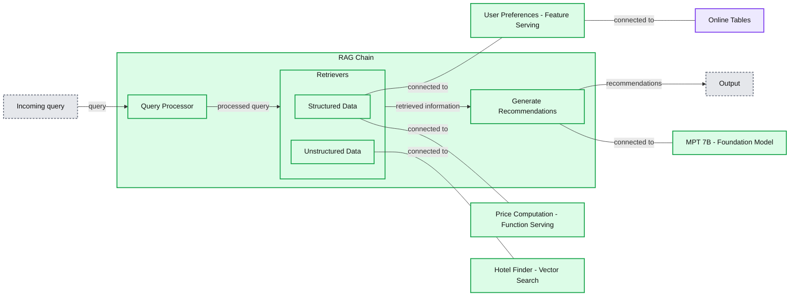

# Improve your RAG application response quality with real-time structured data

- Source: https://www.databricks.com/blog/improve-your-rag-application-response-quality-real-time-structured-data
- Published: 2023-12-08
- Authors: Mani Parkhe, Aakrati Talati, Sue Ann Hong, Craig Wiley, Chenen Liang, Mingyang Ge
- Categories: data-science-machine-learning
- Images: 3 total, 1 extracted as architecture

[Retrieval Augmented Generation (RAG)](https://www.databricks.com/glossary/retrieval-augmented-generation-rag) is an efficient mechanism to provide relevant data as context in Gen AI applications. Most RAG applications typically use vector indexes to search for relevant context from unstructured data such as documentation, wikis, and support tickets. Yesterday, we announced Databricks AI Search Public Preview that helps with exactly that. However, Gen AI response quality can be enhanced by augmenting these text-based contexts with relevant and personalized structured data. Imagine a Gen AI tool on a retail website where customers inquire, "Where's my recent order?" This AI must understand that the query is about a specific purchase, then gather up-to-date shipment information for line items, before using LLMs to generate a response. Developing these scalable applications demands substantial work, integrating technologies for handling both structured and unstructured data with Gen AI capabilities.

We are excited to announce the public preview of **Databricks Feature & Function Serving**, a low latency real-time service designed to serve structured data from the Databricks Data + AI Platform. You can instantly access pre-computed ML features as well as perform real-time data transformations by serving any Python function from Unity Catalog. The retrieved data can then be used in real-time rule engines, classical ML, and Gen AI applications.

Using Feature and Function Serving ([AWS](https://docs.databricks.com/en/machine-learning/feature-store/feature-function-serving.html))([Azure](https://learn.microsoft.com/en-us/azure/databricks/machine-learning/feature-store/feature-function-serving)) for structured data in coordination with Databricks AI Search ([AWS](https://docs.databricks.com/en/generative-ai/vector-search.html))([Azure](https://learn.microsoft.com/en-us/azure/databricks/generative-ai/vector-search)) for unstructured data significantly simplifies productionalization of Gen AI applications. Users can build and deploy these applications directly in Databricks and rely on existing data pipelines, governance, and other enterprise features. Databricks customers across various industries are using these technologies along with open source frameworks to build powerful Gen AI applications such as the ones described in the table below.

| **Industry** | **Use Case** |
|---|---|
| **Retail** | - Product Recommendations / Search Ranking using user preferences, search history, location, … etc- Image and Metadata based Product Search- Inventory Management and Forecasting using sales data, seasonal trends, and market/competitive analysis |
| **Education** | - Personalized learning plans based on past mistakes, historical trends, and cohorts- Automated Grading, Feedback, Follow-ups, and Progress Reporting- Content filtering for issued devices |
| **Financial Services** | - Natural language apps for analysts and investors to correlate earning calls and reports with market intelligence and historical trends- Fraud and Risk Analysis- Personalized Wealth Management, Retirement Planning, what-if analysis, and next best actions |
| **Travel and Hospitality** | - Chatbots for personalized customer interactions and tailored travel recommendations- Dynamic Route Planning using weather, live traffic patterns, and historical data- Dynamic Price Optimization using competitive analysis and demand-based pricing |
| **Healthcare and Life Sciences** | - Patient/Member engagement and health summaries- Support apps for personalized care, clinical decisions, and care coordination- R&D report summarization, Clinical Trial Analysis, Drug Repurposing |
| **Insurance** | - Risk assessment for mortgage underwriting using text and structured data about properties and neighborhoods- User chatbots for questions about policies, risk, and what-if analysis- Claim Processing automation |
| **Technology and Manufacturing** | - Prescriptive maintenance and diagnostics for equipment using guided instruction- Anomaly detection on live data stream against historical statistics- Automated analysis for daily production / shift analysis and future planning |
| **Media and Entertainment** | - In-app content discovery and recommendations, personalized email and digital marketing- Content Localization- Personalized gaming experiences and game review |

### Serving structured data to RAG applications

To demonstrate how structured data can help enhance the quality of a Gen AI application, we use the following example for a travel planning chatbot. The example shows how user preferences (example: "ocean view" or "family friendly") can be paired with unstructured information sourced about hotels to search for hotel matches. Typically hotel prices dynamically change based on demand and seasonality. A price calculator built into the Gen AI application ensures that the recommendations are within the user's budget. The Gen AI application that powers the bot uses Databricks AI Search and Databricks Feature and Function Serving as building blocks to serve the necessary personalized user preferences and budget and hotel information using LangChain's agents API.

**Summary:** A RAG chain combines structured user preferences and price computation with unstructured hotel retrieval to generate recommendations using MPT 7B.

**Components:**

- RAG Chain: contains query processing, retrievers, and recommendation generation.
- Query Processor: technology unspecified.
- Retrievers: groups structured and unstructured data retrieval.
- Structured Data: connects to user preferences and price computation.
- Unstructured Data: connects to hotel retrieval.
- User Preferences: Feature Serving.
- Online Tables: storage supporting user preferences.
- Price Computation: Function Serving.
- Hotel Finder: Vector Search.
- Generate Recommendations: uses a foundation model.
- MPT 7B: Foundation Model.

**Flows:**

- External input -> Query Processor: incoming query.
- Query Processor -> Retrievers: processed query.
- Retrievers -> Generate Recommendations: retrieved information.
- Generate Recommendations -> External output: recommendations.
- Structured Data connects to User Preferences and Price Computation through lines without arrowheads.
- User Preferences connects to Online Tables through a line without arrowheads.
- Unstructured Data connects to Hotel Finder through a line without arrowheads.
- Generate Recommendations connects to MPT 7B through a line without arrowheads.

**Numbers:** 7B in MPT 7B.

source image: https://www.databricks.com/sites/default/files/inline-images/image3_12.png

*Travel planning bot that accounts for user preference and budget

You can find the [complete notebook](https://docs.databricks.com/en/_extras/notebooks/source/machine-learning/structured-data-for-rag.html) for this RAG Chain application as depicted above. This application can be run locally within the notebook or deployed as an endpoint accessible by a chatbot user interface.

### Access your data and  functions as real-time endpoints

With [Feature Engineering in Unity Catalog](https://www.databricks.com/blog/simplification-of-AI-data-feature-store-evolved) you can already use any table with a primary key to serve features for training and serving. Databricks Model Serving supports using [Python functions to compute features on-demand](https://www.databricks.com/blog/how-lakehouse-ai-improves-model-accuracy-real-time-computations). Built using the same technology available under the hood for Databricks Model Serving, feature and function endpoints can be used to access any pre-computed feature or compute them on-demand. With a simple syntax you can define a **feature spec function** in Unity Catalog that can encode the directed acyclic graph to compute and serve features as a REST endpoint.

This feature spec function can be served in real-time as a REST endpoint. All endpoints are accessible in the Serving left navigation tab including features, function, custom trained models, and foundation models. Provision the endpoint using this API

The endpoint can also be created using a UI workflow as shown below

Now features be accessed in real-time by querying the endpoint:

To serve structured data to real-time AI applications, precomputed data needs to be deployed to operational databases. Users can already use external online stores as a source of precomputed features--for example [DynamoDB](https://docs.databricks.com/en/machine-learning/feature-store/online-feature-stores.html) and [Cosmos DB](https://learn.microsoft.com/en-us/azure/databricks/machine-learning/feature-store/online-feature-stores) are commonly used to serve features in Databricks Model Serving. **Databricks Online Tables** ([AWS](https://docs.databricks.com/en/machine-learning/feature-store/online-tables.html))([Azure](https://learn.microsoft.com/en-us/azure/databricks/machine-learning/feature-store/online-tables)) adds new functionality that simplifies synchronization of precomputed features to a data format optimized for low latency data lookups. You can sync any table with a primary key as an online table and the system will set up an automatic pipeline to ensure data freshness.

Any Unity Catalog table with primary keys can be used to serve features in Gen AI applications using Databricks Online Tables.

### Next Steps

Use this [notebook example](https://docs.databricks.com/en/_extras/notebooks/source/machine-learning/structured-data-for-rag.html) illustrated above to customize your RAG applications

Sign–up for a [Databricks Generative AI Webinar](https://www.databricks.com/resources/webinar/disrupt-your-industry-generative-ai) available on-demand

Feature and Function Serving ([AWS](https://docs.databricks.com/en/machine-learning/feature-store/feature-function-serving.html))([Azure](https://learn.microsoft.com/en-us/azure/databricks/machine-learning/feature-store/feature-function-serving)) is available in Public Preview. Refer to API documentation and additional examples.

Databricks Online Tables ([AWS](https://docs.databricks.com/en/machine-learning/feature-store/online-tables.html))([Azure](https://learn.microsoft.com/en-us/azure/databricks/machine-learning/feature-store/online-tables)) are available as Gated Public Preview. Use this [form](https://forms.gle/9jLZkpXnJF9ZcxtQA) to sign up for enablement.

Read the summary [announcements](https://www.databricks.com/blog/building-high-quality-rag-applications-databricks) (making high quality RAG applications) made earlier this week.

[Generative AI Engineer Learning Pathway](https://www.databricks.com/blog/databricks-announces-industrys-first-generative-ai-engineer-learning-pathway-and-certification): take self-paced, on-demand and instructor-led courses on Generative AI

Looking to solve Generative AI use cases? Compete in the Databricks & AWS Generative AI Hackathon! Sign up [here](https://events.databricks.com/GenerativeAIHackathon).

 

Have a use case you'd like to share with Databricks? Contact us at [feature-serving@databricks.com](mailto:feature-serving@databricks.com)
