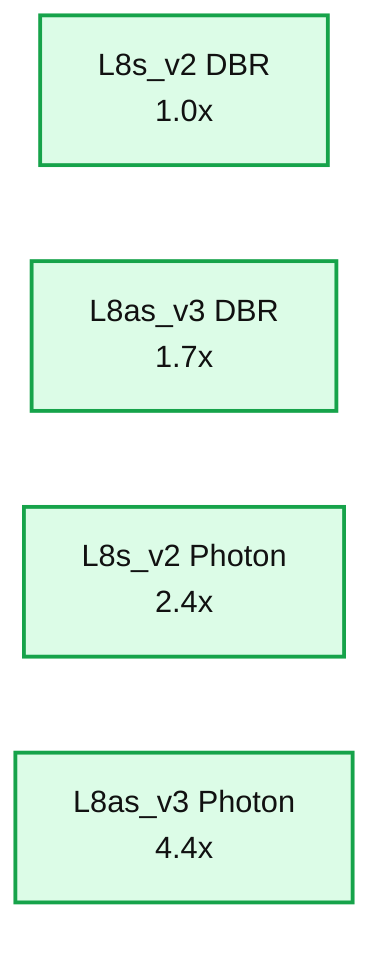
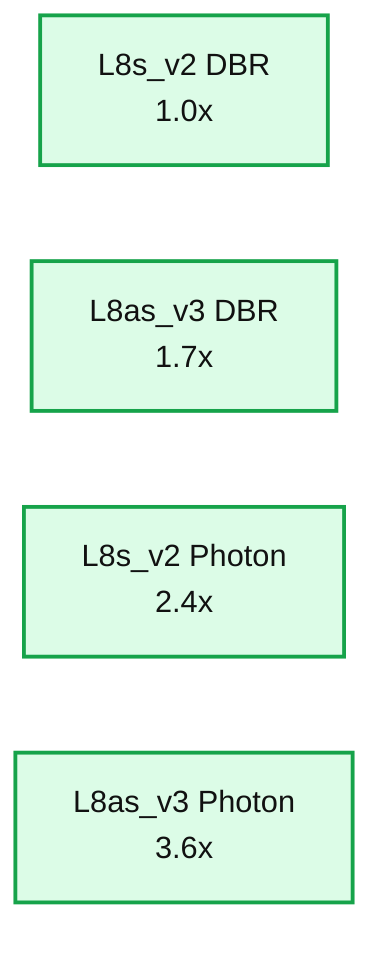
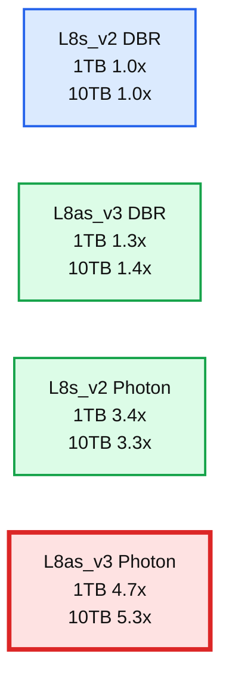
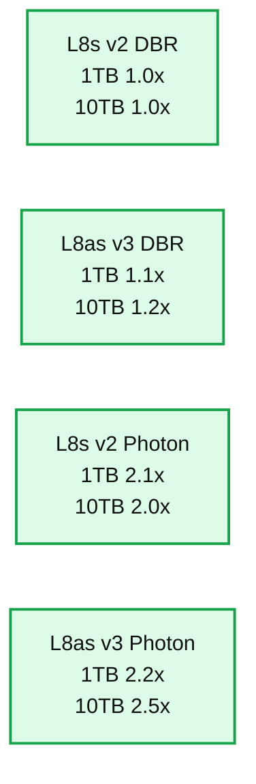

# Improved Performance and Value With Databricks Photon and Azure Lasv3 Instances Using AMD 3rd Gen EPYC™ 7763v Processors 

*Up to 2.5x price/performance benefits and 5.3x speed up!*

- Source: https://www.databricks.com/blog/improved-performance-and-value-databricks-photon-and-azure-lasv3-instances-using-amd-3rd-gen
- Published: 2022-10-11
- Authors: Zach Christopherson, Tahir Fayyaz, Dilip Ramachandran, Shiva Gurumurthy, Mostafa Mokhtar
- Categories: engineering, data-engineering
- Images: 5 total, 4 extracted as architecture

Databricks has partnered with AMD to support a new chip that lets you run your queries faster, saving you time and money. Combining the latest technologies from Azure Databricks and AMD, users can now take advantage of the new Lasv3-series VMs with the Databricks Runtimes to reduce the total cost of ownership (TCO) and achieve lower time to insights relative to the prior generation Lsv2-series VMs. The new Lasv3-series Azure VMs utilize AMD's 3rd Gen EPYC™ processors with 128-160 lanes of PCIe Gen4 I/O which deliver ample I/O bandwidth for the most demanding data warehouse workloads; up to 256MB of L3 cache per socket speeds up memory intensive analytical operations such as joins, aggregations and sorting.

Read on for details on the improvements we've measured and how you can start running your analyses faster with the click of a button.

## Storage optimized Azure VM comparison

The Lasv3 and Lsv2-series are ideal for many data warehouse workloads, offering high-throughput, low latency, local NVMe storage and AMD processors. The Lsv2-series was launched in February of 2019, and has been a common choice for many workload patterns that benefit from the high local instance storage the series provided. In June 2022, the Lsv2-series was refreshed with the Lasv3-series, with processor upgrades to the AMD 3rd Gen EPYC™ 7763v processors and enhanced network bandwidth.

|  | Standard_L8s_v2 | Standard_L8as_v3 |
|---|---|---|
| **CPU family** | AMD 1st Gen EPYC™ 7551 | AMD 3rd Gen EPYC™ 7763v |
| **vCPUs** | 8 | 8 |
| **Memory (GB)** | 64 | 64 |
| **Instance Storage (GB)** | 1.92 TB NVMe | 1.92 TB NVMe |
| **Network Bandwidth (Mbps)** | 3,200 | 12,500 |
| **VM Cost ($/hr)1** | $0.624/hr | $0.624/hr |

1 On-demand VM pricing from East US 2 region as of 2022-09-13

## Benchmarking workloads

In the last decade or so, TPC-DS has become the de facto standard data warehousing benchmark, adopted by virtually all vendors. TPC-DS performance measurements provide a great signal on system read performance for simple to complex analytical queries. We've supplemented this industry standard benchmark with an internally developed set of ETL-focused benchmarks. Where the TPC-DS workload adequately captures usage patterns similar to that of scheduled reporting or adhoc analytical exploration, the ETL benchmark is more aligned with data transformation patterns common in scheduled ETL type jobs, which include insert into partitioned and unpartitioned tables, denormalization and merge into operations.

| **Workload** | **Details** |
|---|---|
| **TPC-DS1** | - Read-only workload- 1TB, 10TB scale factors- 99 queries of varying complexity- Premium All-Purpose Compute pricing2 |
| **ETL benchmark** | - Read/write workload- 1TB scale factor- MERGE DML and Delta CREATE TABLE AS (CTAS) statements that: - Repartition tables - Denormalize star schemas - Write billions of records, thousands of columns, to cloud storage- Premium Jobs Compute pricing3 |

1 Derived from the power test consisting of all 99 [TPC-DS](https://www.tpc.org/tpcds) queries. These results are not comparable to an official, audited TPC benchmark. Databricks' official TPC-DS results can be found [here](https://www.tpc.org/tpcds/results/tpcds_result_detail5.asp?id=121103001).
2 Calculated with Premium All-Purpose Compute pricing
3 Calculated with Premium Jobs Compute pricing

The performance and value differences between the Lsv2-series and Lasv3-series was measured using a test matrix composed of these two workloads, executed on 20 worker cluster configurations, using the 11.2 Databricks Runtime with and without Photon enabled.

## Measuring performance and value: ETL

The ETL benchmark was run during August 2022 at 1TB scale factor. The baseline used is the Lsv2-series configuration without Photon enabled. Improvements to performance and value are quantified relative to this baseline as we upgrade to the Lasv3-series and then enable Photon acceleration.

When upgrading a non-Photon runtime's instance from Lsv2 to Lasv3 we see both a performance and value improvement of 1.7x relative to our baseline. These gains can be directly attributed to the Lasv3-series' AMD 3rd Gen EPYC™ 7763v processors and increased network bandwidth.

Improvements to performance and value are even more substantial when comparing the non-Photon Lsv2 baseline to Photon enabled Lasv3 VMs, in which case we observed a 4.4x improvement to performance and a 3.6x improvement to value.

**Summary:** Benchmark chart showing Lasv3 ETL 1TB performance relative to the Lsv2 baseline, with and without Databricks Photon.

**Components:**

- L8s_v2 DBR using Databricks Runtime baseline
- L8as_v3 DBR using Databricks Runtime
- L8s_v2 Photon using Databricks Photon
- L8as_v3 Photon using Databricks Photon

**Flows:**

- No arrows are visible.

**Numbers:** 1TB, 11.2, 5.0x, 4.0x, 3.0x, 2.0x, 1.0x, 0.0x, 1.7x, 2.4x, 4.4x

source image: https://www.databricks.com/sites/default/files/inline-images/db-333-blog-img-1.png

**Summary:** The chart compares Lasv3 and Lsv2 ETL price-performance using Databricks Runtime with and without Photon.

**Components:**

- L8s_v2 DBR baseline using Databricks Runtime
- L8as_v3 DBR using Databricks Runtime
- L8s_v2 Photon using Databricks Photon
- L8as_v3 Photon using Databricks Photon
- Relative price-performance comparison measured in multiples

**Flows:**

- none

**Numbers:** 1TB, 11.2, 4.0x, 3.0x, 2.0x, 1.0x, 0.0x, 1.0x, 1.7x, 2.4x, 3.6x

source image: https://www.databricks.com/sites/default/files/inline-images/db-333-blog-img-2.png

## Measuring performance and value: TPC-DS inspired

The TPC-DS inspired benchmark was run during August 2022 at both 1TB and 10TB dataset volumes. The baseline for benchmark was also set using the Lsv2-series instances without Photon running on a cluster with 20 workers.

When upgrading the cluster configuration to use the new Lasv3-series instances a 1.4x performance improvement was observed relative to the baseline due to the new AMD's 3rd Gen EPYC processors. To further improve the performance Photon was then enabled on the cluster which resulted in a 5.3x speed-up and 2.5x improvement in the price-performance value.

*5.3x relative speed up of L8as_v3 with Photon enabled against the L8s_v2 DBR*

**Summary:** The chart compares 1TB and 10TB TPC-DS performance improvements for Lsv3 versus Lsv2 using Databricks Runtime with and without Photon.

**Components:**

- L8s_v2 DBR baseline
- L8as_v3 DBR using AMD 3rd Gen EPYC processors
- L8s_v2 Photon
- L8as_v3 Photon using AMD 3rd Gen EPYC processors
- 1TB TPC-DS performance improvement
- 10TB TPC-DS performance improvement

**Flows:**

- L8s_v2 DBR -> L8as_v3 DBR: instance upgrade performance comparison
- L8s_v2 DBR -> L8s_v2 Photon: Photon performance comparison
- L8as_v3 DBR -> L8as_v3 Photon: Photon performance comparison

**Numbers:**

- 11.2 Databricks Runtime DBR
- 1TB TPC-DS
- 10TB TPC-DS
- 6.0x
- 4.0x
- 2.0x
- 0.0x
- L8s_v2 DBR: 1.0x for 1TB and 1.0x for 10TB
- L8as_v3 DBR: 1.3x for 1TB and 1.4x for 10TB
- L8s_v2 Photon: 3.4x for 1TB and 3.3x for 10TB
- L8as_v3 Photon: 4.7x for 1TB and 5.3x for 10TB

source image: https://www.databricks.com/sites/default/files/inline-images/db-333-blog-img-3.png

5.3x relative speed up of L8as_v3 with Photon enabled against the L8s_v2 DBR

*Caption: 2.5x relative price-performance improvement with L8as_v3 Photon*

**Summary:** The chart compares 1TB and 10TB TPC-DS relative price-performance across Azure Lsv2 and Lasv3 instances with Databricks Runtime and Photon.

**Components:**

- L8s_v2 DBR: Databricks Runtime baseline
- L8as_v3 DBR: Databricks Runtime on Lasv3
- L8s_v2 Photon: Photon on Lsv2
- L8as_v3 Photon: Photon on Lasv3
- 1TB TPC-DS Cost Improvement: blue benchmark series
- 10TB TPC-DS Cost Improvement: red benchmark series

**Flows:**

- none

**Numbers:**

- 11.2 Databricks Runtime
- 1TB
- 10TB
- 0.0x
- 0.5x
- 1.0x
- 1.5x
- 2.0x
- 2.5x
- L8s_v2 DBR: 1.0x and 1.0x
- L8as_v3 DBR: 1.1x and 1.2x
- L8s_v2 Photon: 2.1x and 2.0x
- L8as_v3 Photon: 2.2x and 2.5x

source image: https://www.databricks.com/sites/default/files/inline-images/db-333-blog-img-4.png

Caption: 2.5x relative price-performance improvement with L8as_v3 Photon

Photon is able to lower the TCO of a workload, delivering price-performance improvements by reducing the necessary Azure instance uptime due to significantly accelerated query processing.

## How to enable Photon and L8as_v3 instances

Taking advantage of these improvements in value and performance is simple for Databricks users and no change to your actual Spark code is required. When creating or modifying a Databricks cluster check the "Use Photon Acceleration" option and choose Azure L8as_v3 instances for the worker type.

Configuration for Photon and L8as_v3 instances when creating a Databricks cluster

## Summary of performance results

For a variety of benchmarks, pairing Databricks Photon and Azure's Lasv3-series VMs with AMD 3rd Gen EPYC™ 7763v processors resulted in significant performance and value improvements relative to the Lsv2-series predecessor. For analytical read workloads, like TPC-DS, this was measured at up to a 5.3x performance improvement and 2.5x value improvement. For ETL workloads, this was measured at up to a 4.4x performance improvement and 3.6x value improvement. Follow the links below for additional information.

## Learn more at

[databricks.com/lakehouse](https://www.databricks.com/product/data-lakehouse)
[databricks.com/photon](https://www.databricks.com/product/photon)
[azure.microsoft.com/en-us/pricing/details/virtual-machines/linux/#pricing](https://azure.microsoft.com/en-us/pricing/details/virtual-machines/linux/#pricing)
amd.com/en/processors/epyc-server-cpu-family
[amd.com/en/products/cpu/amd-epyc-7763](https://www.amd.com/en/products/cpu/amd-epyc-7763)
[docs.microsoft.com/en-us/azure/virtual-machines/lasv3-series](https://learn.microsoft.com/en-us/azure/virtual-machines/lasv3-series)
[docs.microsoft.com/en-us/azure/virtual-machines/lsv2-series](https://learn.microsoft.com/en-us/azure/virtual-machines/lsv2-series)
