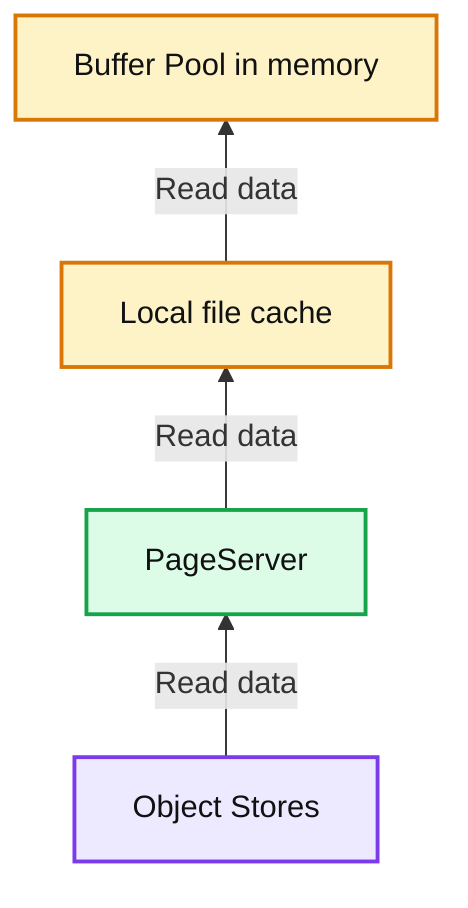
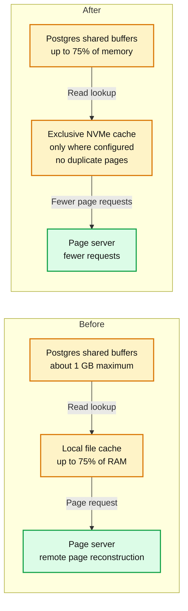
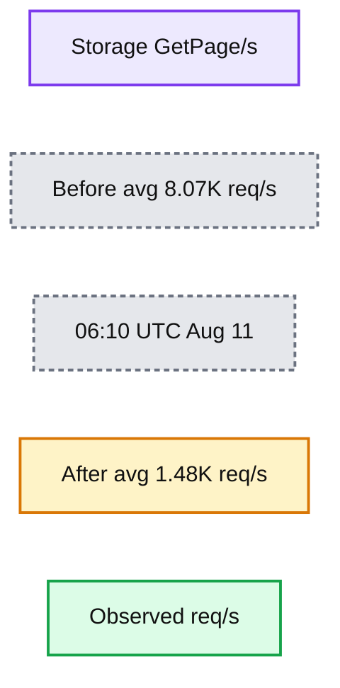
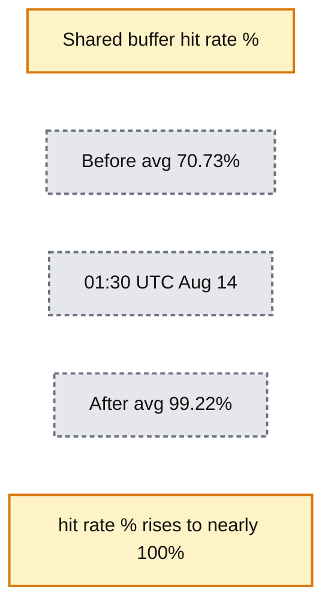
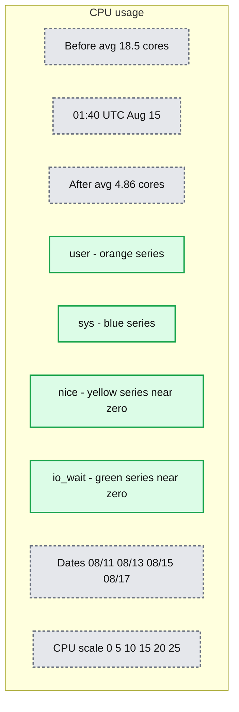

# Improving Lakebase Postgres compute cache

*Part 1: How large Postgres compute nodes run up to 2x faster with lower latency*

- Source: https://www.databricks.com/blog/improving-lakebase-postgres-compute-cache
- Published: 2026-09-10
- Authors: David Wein, Sunil Kamath, Haoyu Huang
- Categories: engineering, data-engineering
- Images: 8 total, 8 extracted as architecture

**Key takeaways**

- The standard Postgres cache vs Lakebase Postgres cache
- How we created an autoscaling cache that works in tandem with shared buffers and keeps as much data as possible on compute
- Production results including 2x throughput, fewer reads from the storage layer and lower latency

The disaggregated storage model of Lakebase Postgres provides a feature rich, flexible and low cost platform. Efficient caching of data is critical to provide high throughput and low latency while data is backed in an object store such as S3.

This caching takes place at two layers: in distributed storage, where Postgres pages are materialized for high write throughput and read serving; and on the Postgres compute itself to serve frequently accessed pages from DRAM for ultra fast access.

We've been hard at work making improvements to the compute side caching, and in this blog will lay out our near term plans and delve into what has already been shipped to customers.

First, some background on how we got here.

## The standard Postgres cache

Databases are famously hungry for DRAM (memory). They primarily use this memory as a data cache and expect access to rows in the cache to be measured in nanoseconds - orders of magnitude faster than even the fastest NVMe drives.

Postgres organizes data in rows on pages, and pages actively being accessed must be loaded into a memory area known as "shared buffers". Because Postgres traditionally stores pages using the operating system's filesystem, the OS kernel will also use its flexible page cache to provide caching between Postgres shared buffers and the disk.

This shared buffers + page cache scheme works reasonably well but has some downsides and some challenges.

### Downsides

1. Double buffering which reduces the amount of data you can effectively cache on the compute. Consider a compute with 4 GB of RAM using 1 GB for shared buffers. As you read pages from disk to populate the 1 GB of shared buffers, the reads go through the OS page cache, which also holds that data. You are now consuming 2 GB of RAM to cache 1 GB of data.
2. The OS page cache doesn't know anything about the shared buffers or Postgres internals, so it can't make smart decisions on which pages to replace.

### Technical challenges

1. In a [disaggregated storage system such as Lakebase Postgres](https://www.databricks.com/blog/object-storage-wal-lakebase-postgres-agentic-era), data read from storage does not travel through the OS filesystem or page cache.
2. Shared buffers is a static parameter, meaning that it is set prior to starting Postgres and cannot be changed without rebooting the database. This is a meaningful challenge for a serverless autoscaling system such as Lakebase.
3. Postgres uses a separate operating system process for each active connection, so the larger the shared buffers - i.e. the more memory you give Postgres - the more memory management the OS must do for each and every connection, which in turn consumes memory.

## The Lakebase cache path

**Summary:** Lakebase’s read cache hierarchy moves data upward from Object Stores through PageServer and the local file cache to the in-memory buffer pool.

**Components:**
- Buffer Pool: memory cache.
- Local file cache: file-based cache.
- PageServer: page-serving component; technology unspecified.
- Object Stores: object storage; technology unspecified.

**Flows:**
- Object Stores -> PageServer: read data upward; arrow unlabeled.
- PageServer -> Local file cache: read data upward; arrow unlabeled.
- Local file cache -> Buffer Pool: read data upward; arrow unlabeled.

**Numbers:** none

source image: https://www.databricks.com/sites/default/files/blog_images/improving-lakebase-postgres-compute-cache-blog-img-1.png

Now that we've provided some background, let's talk about how we are solving them at Databricks.

**Our desired end state is to make the most efficient use of the DRAM on your compute via Postgres dynamic shared buffers that autoscale with your workload and use up to 75% of available memory.**

We need to eventually adjust our compute platform to leverage autoscaling shared buffers, but we also want to deliver sensible incremental improvements to our customers as they become available. Each incremental delivery allows us to confidently ship one or more pieces of the roadmap while giving real benefit to customers. So even if autoscaling computes are the goal, we started with fixed computes, as covered in the next section.

Here’s what we implemented.

### Larger shared buffers

**Summary:** The before and after comparison shows larger Postgres shared buffers replacing most local file caching, with an exclusive NVMe cache and fewer page server requests.

**Components:**

- Before - Postgres shared buffers: Postgres memory cache, about 1 GB maximum.
- Before - Local file cache: local file caching using up to 75% of RAM.
- Before - Page server: remote page reconstruction.
- After - Postgres shared buffers: Postgres memory cache using up to 75% of memory.
- After - Exclusive NVMe cache: NVMe caching only where configured, with no duplicate pages.
- After - Page server: receives fewer requests.

**Flows:**

- Before Postgres shared buffers -> Local file cache: read lookup moving to the next cache layer.
- Local file cache -> Before page server: request for remote page reconstruction.
- After Postgres shared buffers -> Exclusive NVMe cache: read lookup moving to the next cache layer.
- Exclusive NVMe cache -> After page server: fewer requests.

**Numbers:**

- Before shared buffers: about 1 GB maximum.
- Before local file cache: up to 75% of RAM.
- After shared buffers: up to 75% of memory.

source image: https://www.databricks.com/sites/default/files/blog_images/improving-lakebase-postgres-compute-cache-blog-img-2.png

If you recall from the technical challenges above, a disaggregated system such as Lakebase does not route its reads through the standard OS file system and its page cache. Also recall that Postgres shared buffers are static and cannot autoscale.

To solve this we created a layer we called the local file cache (LFC). The LFC acted as a stand-in, creating an autoscaling cache that worked in tandem with shared buffers and kept as much data as possible cached on the compute. This was a clever and pragmatic solution that allowed Lakebase Postgres to launch autoscaling and has been in use on all compute since launch.

Although exposed as a single high-speed compute cache to users, the underlying architecture supports up to two tiers:

- Shared buffers: Postgres's in-memory shared buffer, representing the lowest-latency access path.
- Local file cache: An expanded secondary cache residing on the compute node's local NVMe, offering higher capacity than memory but requiring disk I/O to access a page.

Shared buffers were tuned conservatively so that they did not consume too much memory when running at minimum configured CU, with the maximum size ever configured at 1 GB of shared buffers and LFC consuming the remainder of the total compute cache capacity (up to 75% of DRAM). Any request that results in a miss across both tiers is routed from the compute node to the distributed storage layer.

On larger working sets, capping shared buffers at 1 GB forced most cache hits to pass through the slower LFC tier. The LFC has served us well, but our intent is to retire its current form as we progress towards fully dynamic shared buffers.

| **Note: Fixed computes came first**Our first delivery of larger shared buffers targets fixed-size computes, since shared buffers are not yet dynamic. On these, we now disable the LFC and set shared buffers to 75% of DRAM. This is live today for fixed-size computes with CU >= 80. Eliminating the ~1 GB buffer cap keeps hot pages in the fastest memory layer instead of cascading down to local file storage.To see if large shared buffers are enabled for your compute, run `show shared_buffers` within a Postgres connection. An 80 CU Lakebase endpoint in Databricks should see a value of `15278640`. |
|---|

Keeping hot data in shared buffers rather than the OS page cache also addresses the downsides described earlier. There is no double buffering, so 1 GB of cached data consumes 1 GB of RAM instead of 2 GB. And because the cache lives inside Postgres rather than the kernel, eviction decisions can be made with knowledge of database state — that positions us to pursue smarter replacement policies than the OS can offer.

Sizing shared buffers at 75% of DRAM on fixed-size computes was not as simple as making a configuration change. That is because of the third technical challenge, the process per backend architecture.

This next section describes our solution.

### Addressing memory and translation overhead with huge pages

Postgres uses a process-based structure in which each backend maps shared buffers into its own address space, requiring its own page table entries — the kernel-maintained structures the hardware walks to translate virtual addresses to physical memory. By default Linux does this mapping across 4 KB pages.

Some simple numbers: each 1 GB of shared buffers corresponds to 262,144 page table entries per process. At 32 GB of shared buffers and 512 backends, that is roughly 4.3 billion entries, or about 32 GB of page tables to map 32 GB of cache.

This working set also far exceeds the capacity of the Translation Lookaside Buffer (TLB), a cache in the CPU's memory management unit that speeds virtual-to-physical translation. Even a shared buffer hit then incurs a penalty from TLB misses and page table walks.

To mitigate this, the Postgres community advises using an OS mechanism named huge pages (2 MB each) with large shared buffers. Switching to huge pages reduces page table sizes by a factor of 512 and significantly lowers TLB miss rates.

In our benchmark tests, configuring Postgres with huge pages reduced tail read latency by up to ~40% and decreased CPU utilization by up to ~30%.

### Huge page support in virtualized environments

Lakebase Postgres executes within lightweight guest virtual machines on bare-metal hosts. Memory address translation involves two virtualized layers. Capitalizing on huge pages requires a consistent implementation across the entire stack: from host-level reservation, through the hypervisor backing the VM's memory, to the guest kernel. A breakdown at any tier degrades the resulting performance benefits.

We recently introduced dedicated huge-page backing across our VM infrastructure. We chose to use explicit 2 MB HugeTLB pages rather than rely on best-effort transparent huge pages. Now, VMs allocated for large fixed-size computes initialize with a predetermined volume of huge pages sufficient for Postgres startup. To optimize system resources, compute startup automatically releases any surplus huge pages beyond those required by Postgres.

| **Tip: **To see if large explicit huge pages are enabled for your compute, run show `huge_pages` within a Postgres connection. An 80 CU Lakebase endpoint should see a value of `"on"` |
|---|

## Production results

The rollout started region by region a few weeks ago. The examples below were measured on large production endpoints after the restart that enabled the new configuration.

### Example 1: ~2× throughput, 5× fewer reads from storage

On one large endpoint, the change became active around 06:10 UTC on August 11. Accessed Postgres blocks per second doubled, which we use here as a proxy for throughput. The customer reported lower p50 and p99 latency compared with the prior day, week, and month.

**Summary:** Shared buffer hits rise after the August 11 change marker, with total average requests increasing from 1.54M/s to 2.64M/s while misses remain near zero.

**Components:**
- Shared buffer hits & misses: Postgres shared buffer request metrics.
- hits: Green request-rate series.
- misses: Red request-rate series.
- Total before avg: Gray dashed reference line.
- Total after avg: Orange dashed reference line.
- Change marker: Vertical dotted line labeled 06:10 UTC Aug 11.

**Flows:**
- none. No arrows are visible.

**Numbers:**
- Vertical axis: 0 req/s, 2M req/s, 4M req/s, 6M req/s.
- Horizontal axis: 08/11 00:00, 08/11 12:00, 08/12 00:00, 08/12 12:00.
- Change marker: 06:10 UTC Aug 11.
- Total before avg: 1.54M/s.
- Total after avg: 2.64M/s.

source image: https://www.databricks.com/sites/default/files/blog_images/improving-lakebase-postgres-compute-cache-blog-img-3.png

This endpoint configured a large local file cache. With larger shared buffers, the storage GetPage/s dropped from about 8K per second to about 1.5K.

**Summary:** Storage GetPage requests per second fall from a before average of 8.07K to an after average of 1.48K around 06:10 UTC on August 11.

**Components:**
- Storage GetPage/s: storage request rate plotted as a green time series; storage technology is unspecified.
- req/s: observed requests per second.
- Before avg: gray dashed average line.
- After avg: orange dashed average line.
- 06:10 UTC Aug 11: vertical dashed time marker.

**Flows:**
- none. No arrows are shown.

**Numbers:**
- Before average: 8.07K req/s.
- After average: 1.48K req/s.
- Time marker: 06:10 UTC Aug 11.
- Vertical axis: 0 req/s, 10K req/s, 20K req/s, 30K req/s, 40K req/s, 50K req/s.
- Horizontal axis: 08/11 00:00, 08/11 12:00, 08/12 00:00, 08/12 12:00.

source image: https://www.databricks.com/sites/default/files/blog_images/improving-lakebase-postgres-compute-cache-blog-img-4.png

### Example 2: 1.3× throughput

On another large endpoint, the change became active around 01:30 UTC on August 14. Throughput rose about 43%.

**Summary:** Shared buffer hits rise and misses fall after 01:30 UTC on August 14, while average total throughput increases from 797K/s to 1.14M/s.

**Components:**
- Shared buffer hits & misses: chart of shared buffer requests per second.
- hits: green series.
- misses: red series.
- Total before avg: gray dashed reference line.
- Total after avg: orange dashed reference line.
- 01:30 UTC Aug 14: vertical dashed change marker.

**Flows:**
- none. No arrows are visible.

**Numbers:**
- Y-axis: 0 req/s, 1M req/s, 2M req/s, 3M req/s, 4M req/s, 5M req/s.
- X-axis: 08/13 00:00, 08/14 00:00, 08/15 00:00.
- Change marker: 01:30 UTC Aug 14.
- Total before avg: 797K/s.
- Total after avg: 1.14M/s.

```mermaid
%% Shared buffer hits and misses with before and after average throughput
flowchart LR
    subgraph Chart[Shared buffer hits & misses]
        H[Green hits series]
        M[Red misses series]
        B[Total before avg 797K/s]
        T[Change marker 01:30 UTC Aug 14]
        A[Total after avg 1.14M/s]
        X[Time ticks 08/13 00:00 and 08/14 00:00 and 08/15 00:00]
        Y[Request rate ticks 0 to 5M req/s in 1M increments]
    end

    classDef client fill:#dbeafe,stroke:#2563eb,stroke-width:2px,color:#111
    classDef service fill:#dcfce7,stroke:#16a34a,stroke-width:2px,color:#111
    classDef store fill:#ede9fe,stroke:#7c3aed,stroke-width:2px,color:#111
    classDef cache fill:#fef3c7,stroke:#d97706,stroke-width:2px,color:#111
    classDef queue fill:#cffafe,stroke:#0891b2,stroke-width:2px,color:#111
    classDef critical fill:#fee2e2,stroke:#dc2626,stroke-width:4px,color:#111
    classDef external fill:#e5e7eb,stroke:#6b7280,stroke-width:2px,color:#111,stroke-dasharray:4 3
    classDef decision fill:#fce7f3,stroke:#db2777,stroke-width:2px,color:#111
    class H,M cache
    class B,T,A,X,Y external
```

source image: https://www.databricks.com/sites/default/files/blog_images/improving-lakebase-postgres-compute-cache-blog-img-5.png

The compute cache hit rate reached nearly 100%, with requests served almost entirely from the shared buffers.

**Summary:** Shared buffer hit rate rises from a before average of 70.73% to an after average of 99.22% around 01:30 UTC on August 14.

**Components:**
- Shared buffer hit rate %: shared buffer cache performance over time.
- hit rate %: green measured series.
- Before avg: gray dashed reference line.
- After avg: orange dashed reference line.
- 01:30 UTC Aug 14: vertical dashed change marker.

**Flows:**
- none. No arrows are shown.

**Numbers:**
- Vertical axis: 0%, 20%, 40%, 60%, 80%, 100%.
- Horizontal axis: 08/13 00:00, 08/14 00:00, 08/15 00:00.
- Change marker: 01:30 UTC Aug 14.
- Before average: 70.73%.
- After average: 99.22%.

source image: https://www.databricks.com/sites/default/files/blog_images/improving-lakebase-postgres-compute-cache-blog-img-6.png

### Example 3: 5× lower CPU use, 2× higher throughput

On this workload, CPU use fell from 20 cores to 4 after the August 15 rollout. The compute cache hit rate rose to almost 100%, and the measured throughput doubled.

**Summary:** CPU usage drops sharply at 01:40 UTC on August 15, with the displayed average falling from 18.5 cores to 4.86 cores.

**Components:**
- CPU usage: CPU utilization over time.
- user: orange CPU usage series.
- sys: blue CPU usage series.
- nice: yellow CPU usage series near zero.
- io_wait: green CPU usage series near zero.
- Before avg: dashed reference line at 18.5 cores.
- After avg: dashed reference line at 4.86 cores.
- 01:40 UTC Aug 15: vertical dashed event marker.

**Flows:**
- none. No arrows are visible.

**Numbers:**
- Vertical axis: 0, 5, 10, 15, 20, 25.
- Date axis: 08/11, 08/13, 08/15, 08/17.
- Event timestamp: 01:40 UTC Aug 15.
- Before average: 18.5 cores.
- After average: 4.86 cores.

source image: https://www.databricks.com/sites/default/files/blog_images/improving-lakebase-postgres-compute-cache-blog-img-7.png

**Summary:** Shared buffer hits rise and misses fall around August 15, while average total throughput increases from 2.33M/s to 3.95M/s.

**Components:**
- Shared buffer hits & misses: shared buffer request throughput over time.
- hits: green series showing shared buffer hits.
- misses: red series showing shared buffer misses.
- Total before avg: gray dashed reference line.
- Total after avg: orange dashed reference line.
- 01:40 UTC Aug 15: vertical dashed time marker.

**Flows:**
- none. No arrows are visible.

**Numbers:**
- Vertical axis: 0 req/s, 1M req/s, 2M req/s, 3M req/s, 4M req/s, 5M req/s.
- Horizontal axis: 08/11, 08/13, 08/15, 08/17.
- Time marker: 01:40 UTC Aug 15.
- Total before avg: 2.33M/s.
- Total after avg: 3.95M/s.

source image: https://www.databricks.com/sites/default/files/blog_images/improving-lakebase-postgres-compute-cache-blog-img-8.png

## Part 2: autoscaling

We are currently working to bring larger shared buffers to autoscaling Postgres computes. Autoscaling introduces additional complexity: we must dynamically expand shared buffers when scaling up and shrink them when scaling down—all while allocating the exact required volume of huge pages.

To move beyond fixed sized computes, we've developed a protocol for autoscaling huge pages provided to the guest. Huge pages are scaled in concert with dynamic shared buffers, ensuring that we maintain efficient address translation even at high concurrency and memory sizes. Our next post (part 2) will get into the technical details of this dynamic shared buffers implementation, including the current state of open source Postgres and the areas we've chosen to further advance the feature and contribute upstream.

## Try it

All these performance improvements stem from the [Lakebase Postgres architecture](https://docs.databricks.com/aws/en/oltp/projects/architecture). The storage layer acts as the authoritative system of record, a compute node is stateless and its memory serves as a caching layer.

Deploy Lakebase Postgres and put performance to the test. [Get started here](https://login.databricks.com/signup?itm_source=www&itm_category=product&itm_page=lakebase&itm_location=body&itm_component=centered-hero-text&itm_offer=signup&tuuid=c233e6b3-eaed-4f75-b8b5-4761defb1d81&intent=SIGN_UP&dbx_source=www&rl_aid=50d67422-d812-4b7b-afe6-9bf2c7264fb2&sisu_state=eyJsZWdhbFRleHRTZWVuIjp7Ii9zaWdudXAiOnsicHJpdmFjeSI6dHJ1ZSwiY29ycG9yYXRlRW1haWxTaGFyaW5nIjp0cnVlfX19).

*Lakebase Postgres can be used as a standalone database, and you can also integrate it with the rest of the Databricks Data + AI Platform: Unity Catalog governance, lakehouse analytics, notebooks, and AI workflows.*
