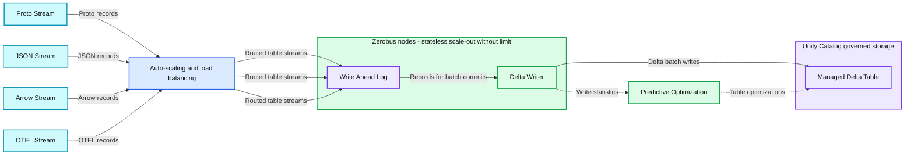
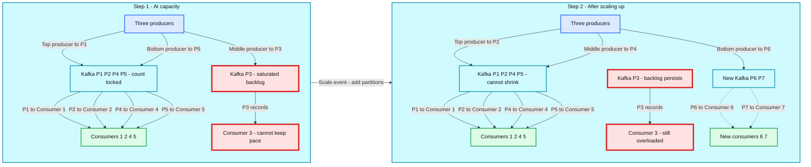
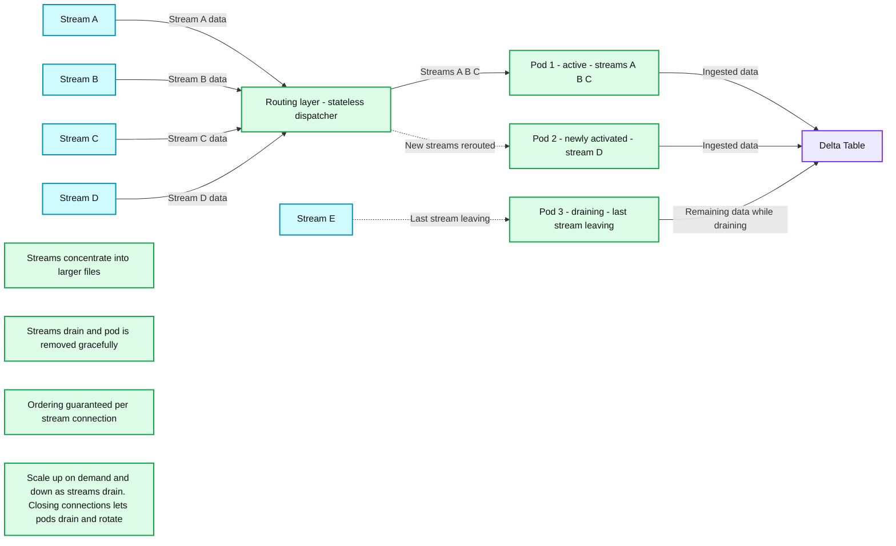
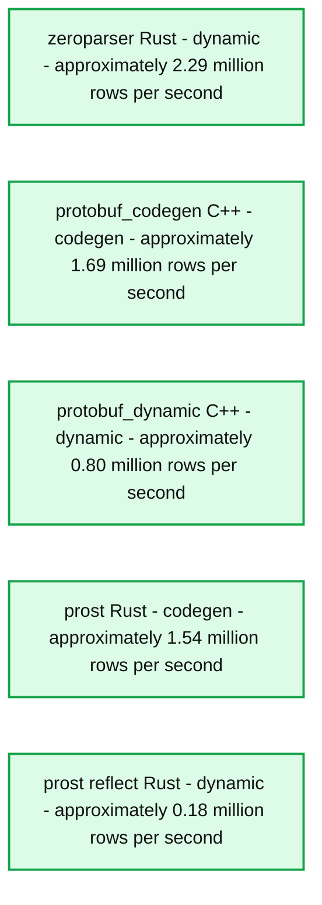
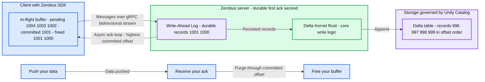
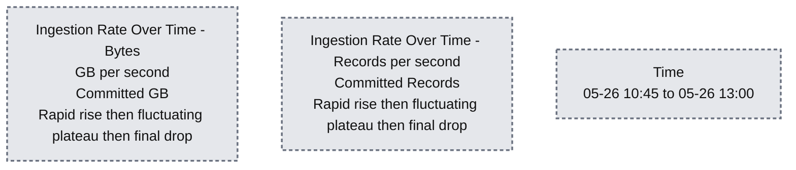

# Ingesting the Milky Way: Petabyte-Scale with Zerobus Ingest

*A deep dive behind the architecture enabling 12 GB/s per table—and limitless possibilities*

- Source: https://www.databricks.com/blog/ingesting-milky-way-petabyte-scale-zerobus-ingest
- Published: 2026-06-11
- Authors: Aleksandar Tomić, Victoria Bukta, Nikola Obradović, Danilo Najkov, Branko Grbić, Milos Milovanovic
- Categories: engineering, data-engineering, data-streaming
- Images: 6 total, 6 extracted as architecture

**Key takeaways**

- Databricks Zerobus Ingest is a serverless streaming API that enables teams to instantly deploy petabyte-scale data pipelines without manual infrastructure management.
- Zerobus’ architecture relies on dynamic partitioning to automatically scale compute resources, efficiently handling unpredictable data volumes without complex tuning.
- This zero-setup framework easily processes massive workloads, demonstrating the ability to sustain over 12 GB/s throughput to a single table during 24-hour benchmarks.

Telemetry data is everywhere. IoT sensors on factory floors. Satellite arrays scanning the atmosphere. Autonomous vehicles are logging thousands of events per second. Every one of these systems has the same underlying problem: a continuous, high-volume stream of time-series observations that needs to land somewhere queryable. It needs to be fast, reliable, and without an engineering team spending weeks tuning and maintaining infrastructure that is typical of Kafka based workloads.

That's the problem [Zerobus Ingest](https://www.databricks.com/product/data-engineering/lakeflow-connect/zerobus-ingest) is built to solve. Zerobus is Databricks' fully managed, serverless streaming ingest service. It's a push-based API that accepts data from any producer and writes it directly into Delta tables, governed by Unity Catalog.

- No infrastructure to provision.
- No connector pipeline to maintain.
- No partitions or broker decision-making.

Instead, you create a table and push data. It lands in your lakehouse, ready to query in seconds. You no longer need to run Kafka as a pipe when your destination is the lakehouse.

We used NASA’s [NEOWISE dataset](https://github.com/databricks-solutions/zerobus-ingest-examples/tree/main/example_clients/neowise_benchmark#dataset), representing 200 billion data points over 11 years, to benchmark Zerobus Ingest, ingesting 1 petabyte in under 24 hours, with zero pre-configuration and stable latency.

By ingesting 1PB within 24 hours, we demonstrate Zerobus’s ability to maintain continuous throughput of 12 GB/s to a single table! 🚀

Now Delivering Petabyte scale: Streaming the Milky Way (12GB/sec/table)

Expand The visualization above replays one year of data. The Milky Way's disk emerges in orange as those detections land in the table; the cyan crescent marks the sky region the telescope was pointing at at any given moment.

For more on how to run the benchmark yourself, read this [companion blog](https://community.databricks.com/t5/technical-blog/petabyte-scale-with-zerobus-ingest-download-the-code-and-ingest/ba-p/158571)on Databricks Community.

This post walks through three of our design decisions that made this possible.

- Designing a system that autoscales via dynamic partitioning.
- Building our own zero-copy protobuf decoder.
- Implementing a latency-optimized write-ahead log before data is published to the lakehouse.

## Our key design decisions

Our aspiration was to build a streaming system that could support petabyte-scale and auto-scale to handle fluctuating ingestion patterns.

Traditional streaming architectures require you to decide how many brokers and partitions a given workload needs. This requires knowledge of peak load and consumer ingestion constraints, as well as forecasting and an understanding of the end-to-end pipeline.

By going back to first principles, we designed and built a system that scales to handle petabyte-sized workloads for data producers “magically.”

**Summary:** Zerobus routes multiple stream formats through autoscaling nodes that write to a managed Delta table, with write statistics driving predictive table optimization.

**Components:**

- Proto Stream: Proto-format input stream.
- JSON Stream: JSON-format input stream.
- Arrow Stream: Arrow-format input stream.
- OTEL Stream: OTEL-format input stream.
- Auto-scaling & load balancing: Routes each table's stream to the right Zerobus node.
- Zerobus nodes: Stateless ingestion nodes that scale out without limit.
- Write Ahead Log: Logging component within each Zerobus node.
- Delta Writer: Groups records into batch commits to Delta.
- Managed Delta Table: Delta storage governed by Unity Catalog.
- Predictive Optimization: Auto-tunes the Delta table using live write statistics.

**Flows:**

- Proto Stream -> Auto-scaling & load balancing: Proto stream records.
- JSON Stream -> Auto-scaling & load balancing: JSON stream records.
- Arrow Stream -> Auto-scaling & load balancing: Arrow stream records.
- OTEL Stream -> Auto-scaling & load balancing: OTEL stream records.
- Auto-scaling & load balancing -> Zerobus nodes: Routed table streams, shown by three parallel arrows.
- Write Ahead Log -> Delta Writer: Records for batch commits.
- Zerobus nodes -> Managed Delta Table: Delta batch writes.
- Delta Writer -> Predictive Optimization: Write statistics.
- Predictive Optimization -> Managed Delta Table: Table optimizations.

**Numbers:**

- ≈ 3.8M records/s and climbing.
- ∞: Scale-out without limit.
- A single managed Delta table.

source image: https://www.databricks.com/sites/default/files/inline-images/Scale-Out-Architecture-Zerobus.png

### Autoscaling achieved through dynamic partitioning

The problem we were trying to solve was how to have efficient autoscaling to achieve elastic “limitness” scaling.

Our thesis was that by moving away from static partitioning and toward the logical unit of a stream/connection, we could unlock **true autoscaling **and rebalancing while maintaining ordering guarantees, which are important for consumption workloads.

#### The static partition problem

In message bus architectures, **partitions are the unit of both parallelism and ordering**. This coupling creates a constraint that can be painful once you have consumers who depend on it.

Ordering is typically a *per-partition* guarantee, not per-producer. The number of partitions and the distribution of data across them affect a consumer's ability to keep up with ingestion. This means:

- If your partition count changes, the routing function that maps a producer's messages to a partition may now send them to a different partition. The consumer now has to reconcile this.
- In practice, most teams treat partition topology as immutable. You provision for peak load and carry that infrastructure forever. **You can add partitions but you typically cannot safely decrease them.**
- The standard workaround is a partition routing key derived from a field in the message. This helps with ordering consistency but still doesn't solve the scale-down problem. 

**Summary:** Traditional Kafka streaming uses fixed partitions that limit consumer parallelism, and adding partitions leaves the saturated P3 lane and its backlog unresolved.

**Components:**

- Panel A, Today: Traditional streaming with static partitions.
- Step 1, At capacity: Three producers, with technology unspecified.
- Kafka topic, Count locked: Five Kafka partitions labeled P1 through P5. P3 is saturated.
- Consumers 1 through 5: Stream consumers, with technology unspecified. Consumer 3 cannot keep pace with inbound traffic.
- Scale event: Add Kafka partitions.
- Step 2, After scaling up: Three producers, with technology unspecified.
- Kafka topic, Cannot shrink: Seven Kafka partitions labeled P1 through P7. P3 remains saturated; P6 and P7 are added.
- Consumers 1 through 7: Stream consumers, with technology unspecified. Consumers 6 and 7 are new; Consumer 3 remains overloaded.
- Capacity constraint: Partition count equals maximum consumer parallelism.
- Backlog constraint: New partitions add consumers 6 and 7, but P3's backlog still will not drain.
- Scaling constraint: Forecasting for peak leaves cluster costs when scaling down.
- Removal constraint: Removing partitions truncates data.

**Flows:**

- Step 1 top producer -> P1: Produced records.
- Step 1 middle producer -> P3: Produced records into the saturated lane.
- Step 1 bottom producer -> P5: Produced records.
- Step 1 P1 -> Consumer 1: Partition records.
- Step 1 P2 -> Consumer 2: Partition records.
- Step 1 P3 -> Consumer 3: Records exceeding consumer processing capacity.
- Step 1 P4 -> Consumer 4: Partition records.
- Step 1 P5 -> Consumer 5: Partition records.
- Step 1 -> Step 2: Scale event adds partitions.
- Step 2 top producer -> P2: Produced records.
- Step 2 middle producer -> P4: Produced records.
- Step 2 bottom producer -> P6: Produced records.
- Step 2 P1 -> Consumer 1: Partition records.
- Step 2 P2 -> Consumer 2: Partition records.
- Step 2 P3 -> Consumer 3: Records in the still-saturated lane.
- Step 2 P4 -> Consumer 4: Partition records.
- Step 2 P5 -> Consumer 5: Partition records.
- Step 2 P6 -> Consumer 6: New partition consumption, shown with a dashed arrow.
- Step 2 P7 -> Consumer 7: New partition consumption, shown with a dashed arrow.

**Numbers:**

- Step 1 and Step 2.
- Step 1: P1, P2, P3, P4, P5; Consumers 1, 2, 3, 4, 5.
- Step 2: P1, P2, P3, P4, P5, P6, P7; Consumers 1, 2, 3, 4, 5, 6, 7.
- Callouts identify P3 and new consumers 6 and 7.
- No quantitative units, percentages, or sizes are shown.

source image: https://www.databricks.com/sites/default/files/inline-images/Traditional-Static-Partitioning.png

#### We moved the ordering guarantee to the stream connection

In traditional systems, **ordering is a partition-level guarantee**. In Zerobus Ingest, **ordering is a stream connection-level guarantee**.

When a producer opens a stream with Zerobus (a connection to our server), they're registering a logical identity with the service. For the lifetime of that connection, their data arrives in order, regardless of which “partition” pod processes it.

*"Your stream is ordered"*, not *"your partition is ordered."* That's the contract.

#### Hot routing and true autoscaling

Internally, Zerobus Ingest distributes streams across a pool of pods. Routing is heuristic-based: if a pod is running hot, new incoming streams are routed to a different pod. The producer is unaware. Their ordering guarantee is unaffected.

Ordering lives at the stream level, which means pods can be added when demand spikes and **removed when demand drops**. Existing streams then drain gracefully, and new streams stop routing there. The pool then shrinks, keeping compute utilization efficient.

*This is true autoscaling. The unit of granularity is the stream connection, not the partition assignment.*

Our dynamic partitioning design enables Zerobus to autoscale to over 12GB per second throughput for a table while remaining cost-efficient.

**Summary:** Zerobus Ingest routes stream connections through a stateless dispatcher to dynamically activated or draining pods that write to a Delta Table.

**Components:**

- Stream A, Stream B, Stream C, Stream D, Stream E: Zerobus Ingest stream connections.
- Routing layer: Stateless dispatcher.
- Pod 1: Active pod hosting streams A, B, and C.
- Pod 2: Newly activated pod hosting stream D.
- Pod 3: Draining pod, with its last stream leaving.
- Delta Table: Delta storage receiving pod output.
- Streams concentrate: Concentrating streams produces larger files.
- Streams drain: Draining permits graceful pod removal.
- Ordering guaranteed: Order is preserved per stream connection.
- Scales up & down: Scale up on demand and down as streams drain.
- Ephemeral by design: Closing stream connections lets pods drain, allowing the cluster to refresh and rotate pods.

**Flows:**

- Stream A -> Routing layer: Stream A data.
- Stream B -> Routing layer: Stream B data.
- Stream C -> Routing layer: Stream C data.
- Stream D -> Routing layer: Stream D data.
- Routing layer -> Pod 1: Streams A, B, and C.
- Routing layer -> Pod 2: New streams rerouted, illustrated by stream D.
- Stream E -> Pod 3: Faded dotted connection representing the last stream leaving.
- Pod 1 -> Delta Table: Ingested data.
- Pod 2 -> Delta Table: Ingested data.
- Pod 3 -> Delta Table: Remaining data while draining.

**Numbers:** 1, 2, and 3 are pod identifiers. No quantitative measurements are visible.

source image: https://www.databricks.com/sites/default/files/inline-images/Dynamic-partitioning-with-Zerobus.png

### Zero-copy high-performance data handling

Zerobus's main goal is to allow an efficient, row-by-row transfer of data streams of any volume. To achieve this, we needed to completely avoid any needless copying and memory allocations - from the input formats that clients send to Zerobus, to the internal formats that guarantee durability and open Delta formats.

Zerobus currently supports the following message formats.

| **Zerobus Format** | **When to use** |
|---|---|
| protobuf | Generic, fast record-by-record ingestion. |
| arrow | Fast batch ingestion. |
| json | Batch or row-by-row; convenient, but slower than protobuf and Arrow. |

Among the many optimizations we made, we will illustrate the zero-copy approach through ZeroParser - our custom protobuf decoder.

Standard protobuf decoders force you to choose between speed and flexibility. Protobuf decoders typically rely on either build-time code generation (codegen) or runtime reflection. 

- **Code generation is fast**, but it requires **descriptors at compile time**. Zerobus receives descriptors dynamically at runtime, from arbitrary user schemas. Codegen isn't an option.
- **Runtime reflection** solves the flexibility problem, but creates a performance one. Dynamic protobuf decoders are slow and require building an object graph in memory at runtime, leading to many small memory allocations.

Neither approach was acceptable. We needed dynamic descriptor support with the performance profile of codegen.

**The result was that we built ****zeroparser**: Bridging this gap by using single-pass parsing with zero memory allocations, enabling it to sustain throughputs of **~1 GB/s protobuf parsing per CPU core** even with dynamic descriptors and complex schemas.

Zeroparser allows direct wire format parsing without deconstruction of incoming objects, which leads to memory copying and allocations. With this approach, Zerobus can achieve better performance than existing code-generated protobuf parsing solutions while still maintaining the full flexibility of dynamically providing protobuf descriptors.

Rust's lifetime system was central to Zeroparser’s design: it guarantees compile-time safety during protocol parsing while keeping raw wire bytes under exclusive network ownership, eliminating unnecessary data copies.

**Summary:** Single-core NEOWISE parsing throughput compares five implementations, with dynamic Zeroparser achieving the highest rate.

**Components:**
- zeroparser: Rust, dynamic parsing, blue.
- protobuf_codegen: C++, code-generated parsing, orange.
- protobuf_dynamic: C++, dynamic parsing, blue.
- prost: Rust, code-generated parsing, orange.
- prost reflect: Rust, dynamic parsing, blue.
- Vertical axis: Rows per second in millions.
- Legend: dynamic and codegen.

**Flows:**
- none. No arrows are shown.

**Numbers:**
- Single core: 1 core.
- Vertical-axis ticks: 0.0, 0.5, 1.0, 1.5, 2.0, 2.5 million rows per second.
- Approximate throughput inferred from bar heights:
  - zeroparser: 2.29 million rows per second.
  - protobuf_codegen: 1.69 million rows per second.
  - protobuf_dynamic: 0.80 million rows per second.
  - prost: 1.54 million rows per second.
  - prost reflect: 0.18 million rows per second.

source image: https://www.databricks.com/sites/default/files/inline-images/Zeroparser-v2.png

Results show that Zeroparser, although being in the dynamic group, outperformed two industry standard codegen based implementations.

**Zeroparser** is open-sourced as part of the Zerobus SDK available [here](https://github.com/databricks/zerobus-sdk/tree/main/rust/sdk/src/zeroparser). 

### Write Ahead Log

Streaming is not just about being able to handle high-throughput workloads. To be a true streaming service, you also need to support message handoff as quickly as possible. This low latency of handing off data is what truly distinguishes streaming workloads from batch.

To support this low-latency handoff with a durability guarantee, Zerobus implements a latency-optimized write-ahead log (WAL). Once messages are durable, Zerobus sends an acknowledgement back to the client. Rather than acknowledging every record individually, the server returns the highest committed offset on the stream. The result is this **async ack loop**. [Delta Kernel Rust](https://github.com/delta-io/delta-kernel-rs) is then used for the core logic for writing to Delta.

This async design is key for clients that buffer data in flight. Zerobus uses gRPC bidirectional streaming, where each Zerobus stream has two lines of communication: 

- One for sending messages 
- The other for receiving offsets acknowledgements. 

Once the client receives that offset, it can safely purge everything up to that point from its local in-flight buffer. This is all handled for you by the Zerobus SDKs.

The WAL is what keeps clients lean. Push your data, receive your ack, free your buffer. That low-latency, high-durability handoff has always been the reason teams reach for Kafka. Zerobus gives you the same guarantee.

**Summary:** Zerobus Ingest persists client writes in a durable write-ahead log before asynchronously acknowledging the highest committed offset, allowing the SDK to free its buffer while Delta Kernel Rust writes to Delta.

**Components:**

- Client: Zerobus SDK buffers records in flight and purges records at or below the committed offset.
- In-flight buffer: Holds pending records and shows acknowledged records as freed.
- gRPC bidirectional stream: Carries messages and asynchronous offset acknowledgements.
- Zerobus server: Receives bytes and writes bytes out.
- Write-Ahead Log: Durable storage where bytes are appended and persisted.
- Delta Kernel Rust: Core write logic that appends records to Delta.
- Storage: Governed by Unity Catalog.
- Delta table: Stores records appended in offset order.
- Lifecycle labels: Push your data, receive your ack, free your buffer.

**Flows:**

- Client -> Zerobus server: Messages over the gRPC bidirectional stream.
- Write-Ahead Log -> Client: Asynchronous acknowledgement of the highest committed offset, not per-record acknowledgements.
- Write-Ahead Log -> Delta Kernel Rust: Persisted records for writing.
- Delta Kernel Rust -> Delta table: Append records in offset order.
- Push your data -> Receive your ack: Progress from sending data to receiving acknowledgement.
- Receive your ack -> Free your buffer: Release buffered records through the committed offset.

**Numbers:**

- Pending client records: #1004, #1003, #1002.
- Committed offset: #1001.
- Freed client records: #1001, #1000.
- Write-Ahead Log records: #1001, #1000.
- Delta table records: #996, #997, #998, #999.
- Purge condition: record offset ≤ committed offset.

source image: https://www.databricks.com/sites/default/files/inline-images/Zerobus-WAL.png

## Proof: Ingesting the Milky Way

The key to benchmarking a system comes with the understanding of how it would be used in a production setting, and then emulating that behavior and usage. That’s why to stress Zerobus Ingest we decided to choose NASA’s [NEOWISE dataset](https://github.com/databricks-solutions/zerobus-ingest-examples/tree/main/example_clients/neowise_benchmark#dataset) and we used [Locust](https://locust.io) to emulate real-world fan-in patterns.

### Why Locust? The Fan-In Problem

Zerobus Ingest is built to aggregate streams from many independent producers into a single destination table. Its throughput scales with the number of concurrent open streams. This means you cannot stress it fairly from a single machine or a small cluster. A single powerful host would saturate its own bandwidth or CPU before it placed meaningful pressure on our service, therefore benchmarking the producer, not Zerobus.

To simulate a real-world fan-in pattern, we use [Locust](https://locust.io) to coordinate opening separate streams by pods to pressure-test ingestion at scale.

Zerobus's autoscaling then responds to stream count and throughput to handle the rate of ingestion.

### Test Configuration

Our benchmark was deployed on Kubernetes with one Locust master and a fleet of Locust workers, each running as a separate pod. Key parameters:

| **Parameter** | **Value** |
|---|---|
| Locust workers | 2,048 |
| Zerobus streams per worker | 1 |
| Total concurrent Zerobus streams | 2,048 |
| Spawn rate | 0.5 users/sec |
| Test duration | ~25 hours (+1 hour for the ramp up of workers) |
| Message format | Protocol Buffer 2 (proto2) binary |
| In-flight records per stream | 50,000 (max) |
| Worker CPU / memory | 1.5 cores / 2 GiB per pod |
| Worker ephemeral storage | 10 GiB (local Parquet cache) |

Each worker gets a unique list of parquet files to ingest. A worker streams its slice and does not repeat rows.

### The results

Our test results showed Zerobus Ingest’s ability to sustain 12 GB/s to a single table over a 24-hour period from 2,048 concurrent workers to a single table. Over this period, Zerobus ingested over a trillion records.

Aggregating over 5-second buckets over the **client_ts_ms** column gives a precise, server-confirmed view of rows committed and bytes received:

This query runs against the live Unity Catalog table. The numbers reflect rows that were fully committed to Delta storage.

**Summary:** Two time-series plots show byte and record ingestion rates rising rapidly, sustaining a fluctuating plateau, and dropping at the final sample.

**Components:**
- Ingestion Rate Over Time - Bytes: blue points plotted against Time, with Committed GB on the vertical axis and GB per second specified in the title. No technology named.
- Ingestion Rate Over Time - Records per second: orange points plotted against Time, with Committed Records on the vertical axis. No technology named.

**Flows:**
- none. No arrows are visible.

**Numbers:**
- Bytes vertical-axis ticks: 0, 2, 4, 6, 8, 10, 12. Units: committed GB; title specifies GB per second.
- Records vertical-axis ticks: 0.0, 0.2, 0.4, 0.6, 0.8, 1.0, 1.2, with a 1e7 multiplier. Title specifies records per second.
- Shared time-axis ticks: 05-26 10:45, 05-26 11:00, 05-26 11:15, 05-26 11:30, 05-26 11:45, 05-26 12:00, 05-26 12:15, 05-26 12:30, 05-26 12:45, 05-26 13:00.
- Approximate plotted byte rates: initial 0.3 GB/s, plateau around 10.5-12.9 GB/s, final 4 GB/s.
- Approximate plotted record rates: initial 0.3 million records/s, plateau around 9.6-11.7 million records/s, final 3.7 million records/s.

source image: https://www.databricks.com/sites/default/files/inline-images/zerobus-ingestion-rate-over-time.png

| **Performance Results** |  |
|---|---|
| **Metric** | **Value** |
| Sustained throughput (rows/sec) | 12 000 000 |
| Sustained throughput (MB/sec, proto2 wire) | 11.8GB/s |
| Total rows ingested | 1.04 trillion |
| Test duration | 24h |

**Want to run it yourself?**

The full benchmark harness with dataset preparation, producer code, and instructions for running against your own Zerobus endpoint. Check it out [here](https://community.databricks.com/t5/technical-blog/petabyte-scale-with-zerobus-ingest-download-the-code-and-ingest/ba-p/158571).

## What's next

[Zerobus Ingest](https://www.databricks.com/product/data-engineering/lakeflow-connect/zerobus-ingest) is now Generally Available on Databricks and ready for all your production workloads.

Our performance metrics of 12gb/s to a table are what you get out of the box with Zerobus Ingest. Quotas can be increased by reaching out to your account team.

On the roadmap:

- Kafka Producer API support
- MQTT API support
- Rescue column
- System metadata column
- Avro support

Let us know where you want us to take Zerobus next! What do you think the next frontier of streaming is? Send us your comments on our [companion Databricks Community blog](https://community.databricks.com/t5/technical-blog/petabyte-scale-with-zerobus-ingest-download-the-code-and-ingest/ba-p/158571).

If you are ready to get started with Zerobus Ingest, refer to our [technical documentation](https://docs.databricks.com/aws/en/ingestion/zerobus-overview), the [Zerobus Ingest SDK](https://github.com/databricks/zerobus-sdk), or check out the [GitHub repo with the Neowise benchmark](https://github.com/databricks-solutions/zerobus-ingest-examples/tree/main/example_clients/neowise_benchmark).
