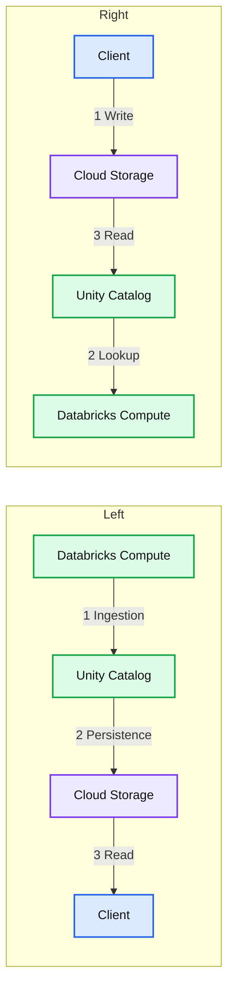
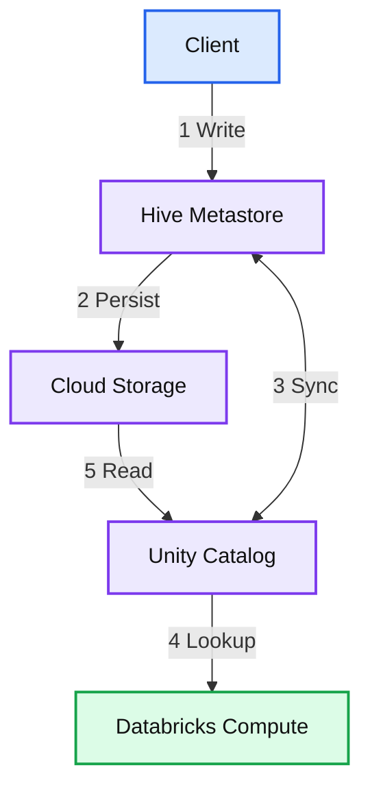
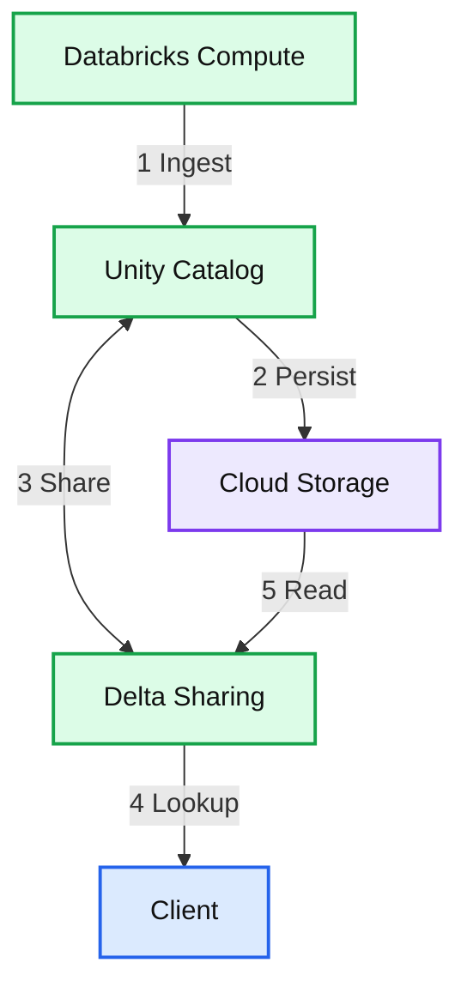
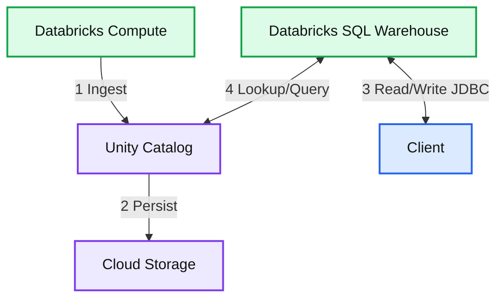

# Unifying Your Data Ecosystem with Delta Lake Integration

*Reading and Writing from and to Delta Lake from non-Databricks platforms*

- Source: https://www.databricks.com/blog/integrating-delta-lakehouse-other-platforms
- Published: 2023-05-09
- Authors: Itai Yaffe, Liran Bareket
- Categories: engineering, data-engineering
- Images: 5 total, 5 extracted as architecture

As organizations are maturing their data infrastructure and accumulating more data than ever before in their data lakes, Open and Reliable table formats such as Delta Lake become a critical necessity.

Thousands of companies are already using Delta Lake in production, and [open-sourcing all of Delta Lake](https://www.databricks.com/blog/2022/06/30/open-sourcing-all-of-delta-lake.html) (as announced in June 2022) has further increased its adoption across various domains and verticals.

Since many of those companies are using both Databricks and other data and AI frameworks (e.g., Power BI, Trino, Flink, Spark on Kubernetes) as part of their tech stack, it’s crucial for them to be able to read and write from/to Delta Lake using all those frameworks.

The goal of this blog post is to help these users do so, as seamlessly as possible.

## Integration Options

Databricks provides multiple options to read data from and write data to the lakehouse. These options vary from each other on various parameters. Each of these options match different use cases.

The parameters we use to evaluate these options are:

1. Read Only/Read Write - Does this option provide read/write access or read only.
2. Upfront investment - Does this integration option require any custom development or setting up another component.
3. Execution Overhead - Does this option require a compute engine (cluster or SQL warehouse) between the data and the client application.
4. Cost - Does this option entail any additional cost (beyond the operational cost of the storage and the client).
5. Catalog - Does this option provide a catalog (such as Hive Metastore) the client can use to browse for data assets and retrieve metadata from.
6. Access to Storage - Does the client need direct network access to the cloud storage.
7. Scalability - Does this option rely on scalable compute at the client or provides compute for the client.
8. Concurrent Write Support - Does this option handle concurrent writes, allowing write from multiple clients or from the client and Databricks at the same time. ([Docs](https://docs.delta.io/latest/concurrency-control.html#concurrency-control))

### Direct Cloud Storage Access

Access the files directly on the cloud storage. External tables ([AWS](https://docs.databricks.com/sql/language-manual/sql-ref-external-tables.html)/[Azure](https://learn.microsoft.com/en-us/azure/databricks/sql/language-manual/sql-ref-external-tables)/[GCP](https://docs.gcp.databricks.com/sql/language-manual/sql-ref-external-tables.html)) in Databricks Unity Catalog (UC) can be accessed directly using the path of the table. That requires the client to store the path, have a networking path to the storage, and have permission to access the storage directly.

a. Pros

1. No upfront investment (no scripting or tooling is required)
2. No execution overhead
3. No additional cost

b. Cons

1. No catalog - requires the developer to register and manage the location
2. No discovery capabilities
3. Limited Metadata (no Metadata for non delta tables)
4. Requires access to storage
5. No governance capabilities
  - No table ACLs: Permission managed at the file/folder level
  - No audit
6. Limited concurrent write support
7. No built in scalability - the reading application has to handle scalability in case of large data sets

c. Flow:

**Summary:** Direct cloud storage access supports client reads of data persisted by Databricks and client writes followed by lookup and read flows through Unity Catalog.

**Components:**
- Databricks Compute: Databricks processing component, shown on both sides.
- Unity Catalog: Databricks catalog component, shown on both sides.
- Cloud Storage: Durable cloud storage, provider unspecified, shown on both sides.
- Client: External application, technology unspecified, shown on both sides.

**Flows:**
- Left Databricks Compute -> Unity Catalog: Step 1, ingestion.
- Left Unity Catalog -> Cloud Storage: Step 2, persistence.
- Left Cloud Storage -> Client: Step 3, read.
- Right Client -> Cloud Storage: Step 1, write.
- Right Unity Catalog -> Databricks Compute: Step 2, lookup.
- Right Cloud Storage -> Unity Catalog: Step 3, read.

**Numbers:** Left flow: 1, 2, 3. Right flow: 1, 2, 3. Footer: Figure 1. No units, percentages, or sizes.

source image: https://www.databricks.com/sites/default/files/inline-images/db-580-blog-image-1.png

1. Read:
  - Databricks perform ingestion (1)
  - It persists the file to a table defined in Unity Catalog. The data is persisted to the cloud storage (2)
  - The client is provided with the path to the table. It uses its own storage credentials (SPN/Instance Profile) to access the cloud storage directly to read the table/files.
2. Write:
  - The client writes directly to the cloud storage using a path. The path is then used to create a table in UC. The table is available for read operations in Databricks.

### External Hive Metastore (Bidirectional Sync)

In this scenario, we sync the metadata in Unity Catalog with an external Hive Metastore (HMS), such as Glue, on a regular basis. We keep one or more databases in sync with the external directory. This will allow a client using a Hive-supported reader to access the table. Similarly to the previous solution it requires the client to have direct access to the storage.

a. Pros

1. Catalog provides a listing of the tables and manages the location
2. Discoverability allows the user to browse and find tables

b. Cons

1. Requires upfront setup
2. Governance overhead - This solution requires redundant management of access. The UC relies on table ACLs and Hive Metastore relies on storage access permissions
3. Requires a custom script to keep the Hive Metastore metadata up to date with the Unity Catalog metadata
4. Limited concurrent write support
5. No built in scalability - the reading application has to handle scalability in case of large data sets

c. Flow:

**Summary:** An external Hive Metastore synchronizes bidirectionally with Unity Catalog, connecting client writes and cloud storage with Databricks Compute access.

**Components:**

- Databricks Compute: Databricks computing resources.
- Client: client application; technology unspecified.
- Unity Catalog: Databricks metadata catalog.
- Hive Metastore: Hive metadata store.
- Cloud Storage: cloud storage; provider unspecified.

**Flows:**

- Client -> Hive Metastore: Write.
- Hive Metastore -> Cloud Storage: Persist.
- Unity Catalog -> Hive Metastore: Sync.
- Hive Metastore -> Unity Catalog: Sync.
- Unity Catalog -> Databricks Compute: Lookup.
- Cloud Storage -> Unity Catalog: Read.

**Numbers:** Step labels: 1 Write, 2 Persist, 3 Sync, 4 Lookup, 5 Read. Footer: Figure 2.

source image: https://www.databricks.com/sites/default/files/inline-images/db-580-blog-image-2.png

1. The client creates a table in HMS
2. The table is persisted to the cloud storage
3. A Sync script (custom script) syncs the table metadata between HMS and Unity Catalog
4. A Databricks cluster/SQL warehouse looks up the table in UC
5. The table files are accessed using UC from the cloud storage

### Delta Sharing

Access Delta tables via Delta Sharing (read more about Delta Sharing [here](https://learn.microsoft.com/en-us/azure/databricks/data-sharing/)).

The data provider creates a share for existing Delta tables, and the data recipient can access the data defined within the share configuration. The Shared data is kept up to date and supports real time/near real time use cases including streaming.

Generally speaking, the data recipient connects to a Delta Sharing server, via a Delta Sharing client (that’s supported by [a variety of tools](https://delta.io/sharing/)). A Delta sharing client is any tool that supports direct read from a Delta Sharing source. A signed URL is then provided to the Delta Sharing client, and the client uses it to access the Delta table storage directly and read **only** the data they’re allowed to access.

On the data provider end, this approach removes the need to manage permissions on the storage level and provides certain audit capabilities (on the share level).

On the data recipient end, the data is consumed using one of the aforementioned tools, which means the recipient also needs to handle the compute scalability on their own (e.g., using a Spark cluster).

a. Pros

1. Catalog + discoverability
2. Doesn’t require permission to storage (done on the share level)
3. Gives you audit capabilities (albeit limited - it’s on the share level)

b. Cons

1. Read-only
2. You need to handle scalability on your own (e.g., use Spark)

i. Flow:

**Summary:** Delta Sharing connects Databricks Compute, Unity Catalog, cloud storage, and a client through ingest, persist, share, lookup, and read flows.

**Components:**

- Databricks Compute: Databricks compute service.
- Unity Catalog: Databricks catalog service.
- Cloud Storage: Cloud object storage; provider unspecified.
- Delta Sharing: Delta Sharing service.
- Client: Client system; technology unspecified.

**Flows:**

- Databricks Compute -> Unity Catalog: Ingest.
- Unity Catalog -> Cloud Storage: Persist.
- Unity Catalog <-> Delta Sharing: Share.
- Delta Sharing -> Client: Lookup, with the arrow pointing toward Client.
- Cloud Storage -> Delta Sharing: Read, with the arrow pointing toward Delta Sharing.

**Numbers:** Flow steps 1, 2, 3, 4, and 5; Figure 3.

source image: https://www.databricks.com/sites/default/files/inline-images/db-580-blog-image-3.png

1. Databricks ingests data and creates a UC table
2. The data is saved to the cloud storage
3. A Delta Sharing provider is created and the table/database is shared. The access token is provided to the client
4. The client accesses the Delta Sharing server and looks up the table
5. The Client is provided access to read the table files from the cloud storage

### JDBC/ODBC connector (write/read from anywhere using Databricks SQL)

The JDBC/ODBC connector allows you to connect your backend application, using JDBC/ODBC, to a Databricks SQL warehouse (as described [here](https://learn.microsoft.com/en-us/azure/databricks/integrations/jdbc-odbc-bi)).

This essentially is no different than what you’d normally do when connecting backend applications to a database.

Databricks and some third party developers provide wrappers for the JDBC/ODBC connector that allow direct access from various environments, including:

- Python Connector ([Docs](https://docs.databricks.com/dev-tools/python-sql-connector.html))
- Node.JS Connector ([Docs](https://docs.databricks.com/dev-tools/nodejs-sql-driver.html))
- Go Connector ([Docs](https://docs.databricks.com/dev-tools/go-sql-driver.html))
- SQL Execution API ([Docs](https://docs.databricks.com/sql/api/sql-execution-tutorial.html))

This solution is suitable for standalone clients, as the computing power is the Databricks SQL warehouse (hence the compute scalability is handled by Databricks).

As opposed to the Delta Sharing approach, the JDBC/ODBC connector approach also allows you to **write** data to Delta tables (it even supports concurrent writes).

a. Pros

1. Scalability is handled by Databricks
2. Full governance and audit
3. Easy setup
4. Concurrent write support ([Docs](https://docs.databricks.com/optimizations/isolation-level.html#write-conflicts-on-databricks))

b. Cons

1. Cost
2. Suitable for standalone clients (less for distributed execution engines like Spark)

l. Workflow:

**Summary:** Databricks Compute ingests data into Unity Catalog and persists it to cloud storage, while a client accesses a Databricks SQL Warehouse through JDBC.

**Components:**
- Databricks Compute: Databricks data ingestion compute.
- Unity Catalog: Databricks catalog.
- Cloud Storage: cloud storage, with no provider specified.
- Databricks SQL Warehouse: SQL compute warehouse.
- Client: application using JDBC.
- JDBC/ODBC: connectivity technologies named in the title.

**Flows:**
- Databricks Compute -> Unity Catalog: ingest.
- Unity Catalog -> Cloud Storage: persist.
- Client -> Databricks SQL Warehouse: read/write through JDBC.
- Databricks SQL Warehouse -> Client: read/write through JDBC.
- Databricks SQL Warehouse -> Unity Catalog: lookup/query.
- Unity Catalog -> Databricks SQL Warehouse: lookup/query.

**Numbers:** Workflow steps 1, 2, 3, and 4. Figure 4.

source image: https://www.databricks.com/sites/default/files/inline-images/db-580-blog-image-4.png

1. Databricks ingests data and creates a UC table
2. The data is saved to the cloud storage
3. The client uses a JDBC connection to authenticate and query a SQL warehouse
4. The SQL warehouse looks up the data in Unity Catalog. It applies ACLs, accesses the data, performs the query and returns a result set to the client

c. Note that if you have Unity Catalog enabled on your workspace, you also get full governance and audit of the operations. You can still use the approach described above without Unity Catalog, but governance and auditing will be limited.

d. This is the only option that supports row level filtering and column filtering.

## Integration options and use-cases matrix

This chart demonstrates the match of the above described solution alternatives with a select list of common use cases. They are rated 0-4:

- 0 - N/A
- 1 - Require Adjustment to Match the use case
- 2 - Limited Match (can provide the required functionality with some limitation)
- 3 - Good Match

**Summary:** The matrix rates four integration options against eleven platform and application use cases for read-only and read/write access.

**Components:**
- Direct Cloud Storage Access: cloud storage integration.
- External Hive Metastore: Hive metadata integration with bidirectional sync.
- Delta Sharing: data sharing integration.
- JDBC/ODBC: database connectivity interfaces.
- Analytics Tools: Power BI, read-only.
- EMR RO: EMR, read-only.
- EMR R/W: EMR, read/write.
- Flink RO: Flink, read-only.
- Flink RW: Flink, read/write.
- Spark on Kubernetes RO: Spark on Kubernetes, read-only.
- Spark on Kubernetes RW: Spark on Kubernetes, read/write.
- Low-Latency Applications/Custom Development RO: unspecified application technology, read-only.
- Low-Latency Applications/Custom Development RW: unspecified application technology, read/write.
- StarTree RO: StarTree, read-only.
- External Data Analytics Engines: Athena, Trino, and Presto.

**Flows:**
- none. The matrix contains no arrows.

**Numbers:**

Column order: Direct Cloud Storage Access, External Hive Metastore, Delta Sharing, JDBC/ODBC.

| Use case | Direct storage | Hive metastore | Delta Sharing | JDBC/ODBC |
|---|---:|---:|---:|---:|
| Analytics Tools - Power BI RO | 1 | 2 | 2 | 3 |
| EMR RO | 2 | 3 | 3 | 2 |
| EMR R/W | 2 | 2 | 0 | 3 |
| Flink RO | 2 | 3 | 3 | 2 |
| Flink RW | 2 | 2 | 0 | 3 |
| Spark on Kubernetes RO | 2 | 3 | 3 | 2 |
| Spark on Kubernetes RW | 2 | 2 | 0 | 3 |
| Low-Latency Applications/Custom Development RO | 1 | 2 | 2 | 3 |
| Low-Latency Applications/Custom Development RW | 1 | 2 | 0 | 3 |
| StarTree RO | 2 | 0 | 0 | 0 |
| External Data Analytics Engines - Athena/Trino/Presto | 2 | 3 | 3 | 1 |

Legend:
- 0: N/A.
- 1: Require adjustment to match the use case.
- 2: Limited match, can provide the required functionality with some limitation.
- 3: Good match.

```mermaid
%% Integration options matrix with scores in the column order shown
flowchart TD
    H["Column order: Direct Cloud Storage Access / External Hive Metastore with bidirectional sync / Delta Sharing / JDBC/ODBC"]
    A["Analytics Tools Power BI RO: 1 / 2 / 2 / 3"]
    B["EMR RO: 2 / 3 / 3 / 2"]
    C["EMR R/W: 2 / 2 / 0 / 3"]
    D["Flink RO: 2 / 3 / 3 / 2"]
    E["Flink RW: 2 / 2 / 0 / 3"]
    F["Spark on Kubernetes RO: 2 / 3 / 3 / 2"]
    G["Spark on Kubernetes RW: 2 / 2 / 0 / 3"]
    I["Low-Latency Applications/Custom Development RO: 1 / 2 / 2 / 3"]
    J["Low-Latency Applications/Custom Development RW: 1 / 2 / 0 / 3"]
    K["StarTree RO: 2 / 0 / 0 / 0"]
    L["External Data Analytics Engines Athena/Trino/Presto: 2 / 3 / 3 / 1"]
    M["0 N/A / 1 Require adjustment / 2 Limited match / 3 Good match"]

    classDef client fill:#dbeafe,stroke:#2563eb,stroke-width:2px,color:#111
    classDef service fill:#dcfce7,stroke:#16a34a,stroke-width:2px,color:#111
    classDef store fill:#ede9fe,stroke:#7c3aed,stroke-width:2px,color:#111
    classDef cache fill:#fef3c7,stroke:#d97706,stroke-width:2px,color:#111
    classDef queue fill:#cffafe,stroke:#0891b2,stroke-width:2px,color:#111
    classDef critical fill:#fee2e2,stroke:#dc2626,stroke-width:4px,color:#111
    classDef external fill:#e5e7eb,stroke:#6b7280,stroke-width:2px,color:#111,stroke-dasharray:4 3
    classDef decision fill:#fce7f3,stroke:#db2777,stroke-width:2px,color:#111
    class A,I,J client
    class B,C,D,E,F,G,K,L external
    class H,M decision
```

source image: https://www.databricks.com/sites/default/files/inline-images/db-580-blog-image-5.png

Review Documentation
[https://docs.databricks.com/integrations/jdbc-odbc-bi.html](https://docs.databricks.com/integrations/jdbc-odbc-bi.html)
[https://www.databricks.com/product/delta-sharing](https://www.databricks.com/product/delta-sharing)
[https://docs.databricks.com/sql/language-manual/sql-ref-syntax-aux-sync.html](https://docs.databricks.com/sql/language-manual/sql-ref-syntax-aux-sync.html)
