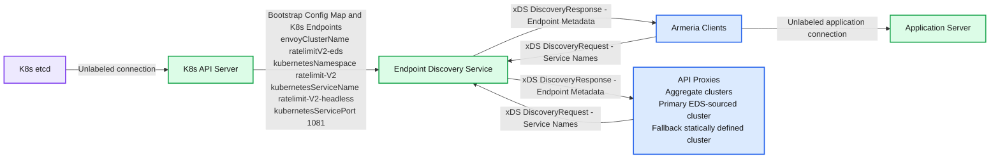
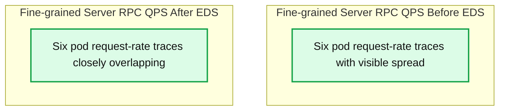
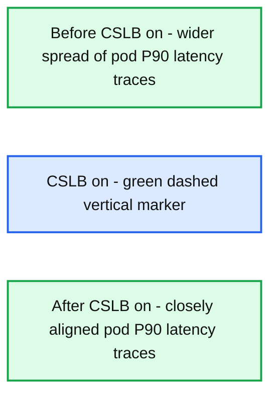

# Intelligent Kubernetes Load Balancing at Databricks

*Real-Time, Client-Side Load Balancing for Internal and Ingress Traffic in Kubernetes*

- Source: https://www.databricks.com/blog/intelligent-kubernetes-load-balancing-databricks
- Published: 2025-10-01
- Authors: Gaurav Nanda, Vincent Cheng, Rohit Agrawal
- Categories: engineering
- Images: 3 total, 3 extracted as architecture

**Key takeaways**

- Why Kubernetes’ default load balancing falls short for high-throughput, persistent connections like gRPC, especially at Databricks scale.
- How we built a client-side, control-plane-driven load balancing system using custom rpc client and xDS.
- Trade-offs of alternative approaches like headless services and Istio, and why we chose a lightweight, client-driven model.

## Introduction

At Databricks, Kubernetes is at the heart of our internal systems. Within a single Kubernetes cluster, the default networking primitives like ClusterIP services, CoreDNS, and kube-proxy are often sufficient. They offer a simple abstraction to route service traffic. But when performance and reliability matter, these defaults begin to show their limits.

In this post, we’ll share how we built an intelligent, client-side load balancing system to improve traffic distribution, reduce tail latencies, and make service-to-service communication more resilient.

If you are a Databricks user, you don’t need to understand this blog to be able to use the platform to its fullest. But if you’re interested in taking a peek under the hood, read on to hear about some of the cool stuff we’ve been working on!

## Problem statement

High-performance service-to-service communication in Kubernetes has several challenges, especially when using persistent HTTP/2 connections, as we do at Databricks with gRPC.

### How Kubernetes Routes Requests by Default

- The client resolves the service name (e.g., my-service.default.svc.cluster.local) via CoreDNS, which returns the service’s ClusterIP (a virtual IP).
- The client sends the request to the ClusterIP, assuming it's the destination.
- On the node, iptables, IPVS, or eBPF rules (configured by kube-proxy) intercept the packet. The kernel rewrites the destination IP to one of the backend Pod IPs based on basic load balancing, such as round-robin, and forwards the packet.
- The selected pod handles the request, and the response is sent back to the client.

While this model generally works, it quickly breaks down in performance-sensitive environments, leading to significant limitations.

### Limitations

At Databricks, we operate hundreds of stateless services communicating over gRPC within each Kubernetes cluster. These services are often high-throughput, latency-sensitive, and run at significant scale.

The default load balancing model falls short in this environment for several reasons:

- **High tail latency**: gRPC uses HTTP/2, which maintains long-lived TCP connections between clients and services. Since Kubernetes load balancing happens at Layer 4, the backend pod is chosen only once per connection. This leads to traffic skew, where some pods receive significantly more load than others. As a result, tail latencies increase and performance becomes inconsistent under load.
- **Inefficient resource usage**: When traffic is not evenly spread, it becomes hard to predict capacity requirements. Some pods get CPU or memory starved while others sit idle. This leads to over-provisioning and waste.
- **Limited load balancing strategies**: kube-proxy supports only basic algorithms like round-robin or random selection. There's no support for strategies like:
  - [Weighted round robin](https://sre.google/sre-book/load-balancing-datacenter/)
  - Error-aware routing
  - Zone-aware traffic routing

These limitations pushed us to rethink how we handle service-to-service communication within a Kubernetes cluster.

## Our Approach: Client-Side Load Balancing with Real-Time Service Discovery

To address the limitations of kube-proxy and default service routing in Kubernetes, we built a proxyless, fully client-driven load balancing system backed by a custom service discovery control plane.

The fundamental requirement we had was to support load balancing at the application layer, and removing dependency on the DNS on a critical path. A Layer 4 load balancer, like kube-proxy, cannot make intelligent per-request decisions for Layer 7 protocols (such as gRPC) that utilize persistent connections. This architectural constraint creates bottlenecks, necessitating a more intelligent approach to traffic management.

The following table summarizes the key differences and the advantages of a client-side approach:

Table 1: Default Kubernetes LB vs. Databricks' Client-Side LB

| Feature/Aspect | Default Kubernetes Load Balancing (kube-proxy) | Databricks' Client-Side Load Balancing |
|---|---|---|
| Load Balancing Layer | Layer 4 (TCP/IP) | Layer 7 (Application/gRPC) |
| Decision Frequency | Once per TCP connection | Per-request |
| Service Discovery | CoreDNS + kube-proxy (virtual IP) | xDS-based Control Plane + Client Library |
| Supported Strategies | Basic (Round-robin, Random) | Advanced (P2C, Zone-affinity, Pluggable) |
| Tail Latency Impact | High (due to traffic skew on persistent connections) | Reduced (even distribution, dynamic routing) |
| Resource Utilization | Inefficient (over-provisioning) | Efficient (balanced load) |
| Dependency on DNS/Proxy | High | Minimal/Minimal, not on a critical path |
| Operational Control | Limited | Fine-grained |

This system enables intelligent, up-to-date request routing with minimal dependency on DNS or Layer 4 networking. It gives clients the ability to make informed decisions based on live topology and health data.

**Summary:** The Endpoint Discovery Service receives Kubernetes configuration and endpoints and exchanges live endpoint metadata with Armeria clients and API proxies over bidirectional xDS streams.

**Components:**
- Armeria Clients: Armeria clients using xDS.
- Application Server: application backend; technology unspecified.
- Endpoint Discovery Service: endpoint discovery service using xDS.
- K8s API Server: Kubernetes API.
- K8s etcd: etcd storage.
- Bootstrap Config Map + K8s Endpoints: Kubernetes configuration and endpoint data.
- Bootstrap configuration: `envoyClusterName: ratelimitV2-eds`, `kubernetesNamespace: ratelimit-V2`, `kubernetesServiceName: ratelimit-V2-headless`, `kubernetesServicePort: 1081`.
- API Proxies: proxies using xDS and aggregate clusters.
- Endpoint Definitions via Aggregate Clusters: primary EDS-sourced cluster and fallback statically defined cluster.
- xDS Bidi Stream: bidirectional discovery streams carrying service names and endpoint metadata.

**Flows:**
- K8s etcd -> K8s API Server: unlabeled connection.
- K8s API Server -> Endpoint Discovery Service: bootstrap Config Map and Kubernetes endpoints.
- Armeria Clients -> Endpoint Discovery Service: DiscoveryRequest containing service names over xDS.
- Endpoint Discovery Service -> Armeria Clients: DiscoveryResponse containing endpoint metadata over xDS.
- Armeria Clients -> Application Server: unlabeled application connection.
- API Proxies -> Endpoint Discovery Service: DiscoveryRequest containing service names over xDS.
- Endpoint Discovery Service -> API Proxies: DiscoveryResponse containing endpoint metadata over xDS.

**Numbers:**
- `1081`: Kubernetes service port.
- `1`: primary cluster list item.
- `2`: fallback cluster list item.
- `V2`: embedded in `ratelimitV2-eds`, `ratelimit-V2`, and `ratelimit-V2-headless`.
- `8`: embedded in the abbreviation `K8s`.

source image: https://www.databricks.com/sites/default/files/2025-09/intelligent-kubernetes-load-balancing-databricks-blog-og.png

The figure shows our custom Endpoint Discovery Service in action. It reads service and endpoint data from the Kubernetes API and translates it into xDS responses. Both Armeria clients and API proxies stream requests to it and receive live endpoint metadata, which is then used by application servers for intelligent routing with fallback clusters as backup.”

### Custom Control Plane (Endpoint discovery service)

We run a lightweight control plane that continuously monitors the Kubernetes API for changes to Services and EndpointSlices. It maintains an up-to-date view of all backend pods for every service, including metadata like zone, readiness, and shard labels.

### RPC Client Integration

A strategic advantage for Databricks was the widespread adoption of a common framework for service communication across most of its internal services, which are predominantly written in Scala. This shared foundation allowed us to embed client-side service discovery and load balancing logic directly into the framework, making it easy to adopt across teams without requiring custom implementation effort.

Each service integrates with our custom client, which subscribes to updates from the control plane for the services it depends on during the connection setup. The client maintains a dynamic list of healthy endpoints, including metadata like zone or shard, and updates automatically as the control plane pushes changes.

Because the client bypasses both DNS resolution and kube-proxy entirely, it always has a live, accurate view of service topology. This allows us to implement consistent and efficient load balancing strategies across all internal services.

### Advanced Load Balancing in Clients

The rpc client performs request-aware load balancing using strategies like:

- **Power of Two Choices (P2C):** For the majority of services, a simple Power of Two Choices (P2C) [algorithm](https://www.eecs.harvard.edu/~michaelm/postscripts/handbook2001.pdf) has proven remarkably effective. This strategy involves randomly selecting two backend servers and then choosing the one with fewer active connections or lower load. Databricks' experience indicates that P2C strikes a strong balance between performance and implementation simplicity, consistently leading to uniform traffic distribution across endpoints.
- **Zone-affinity-based:** The system also supports more advanced strategies, such as zone-affinity-based routing. This capability is vital for minimizing cross-zone network hops, which can significantly reduce network latency and associated data transfer costs, especially in geographically distributed Kubernetes clusters.

The system also accounts for scenarios where a zone lacks sufficient capacity or becomes overloaded. In such cases, the routing algorithm intelligently spills traffic over to other healthy zones, balancing load while still preferring local affinity whenever possible. This ensures high availability and consistent performance, even under uneven capacity distribution across zones.
- **Pluggable Support:** The architecture's flexibility allows for pluggable support for additional load balancing strategies as needed.

More advanced strategies, like zone-aware routing, required careful tuning and deeper context about service topology, traffic patterns, and failure modes; a topic to explore in a dedicated follow-up post.

To ensure the effectiveness of our approach, we ran extensive simulations, experiments, and real-world metric analysis. We validated that load remained evenly distributed and that key metrics like tail latency, error rate, and cross-zone traffic cost stayed within target thresholds. The flexibility to adapt strategies per-service has been valuable, but in practice, keeping it simple (and consistent) has worked best.

### xDS Integration with Envoy

Our control plane extends its utility beyond the internal service-to-service communication. It plays a crucial role in managing external traffic by speaking the [xDS](https://www.envoyproxy.io/docs/envoy/latest/api-docs/xds_protocol) API to Envoy, the discovery protocol that lets clients fetch up-to-date configuration (like clusters, endpoints, and routing rules) dynamically. Specifically, it implements Endpoint Discovery Service (EDS) to provide Envoy with consistent and up-to-date metadata about backend endpoints by programming [ClusterLoadAssignment](https://www.envoyproxy.io/docs/envoy/latest/api-v3/config/endpoint/v3/endpoint.proto#config-endpoint-v3-clusterloadassignment) resources. This ensures that gateway-level routing (e.g., for ingress or public-facing traffic) aligns with the same source of truth used by internal clients.

### Summary

This architecture gives us fine-grained control over routing behavior while decoupling service discovery from the limitations of DNS and kube-proxy. The key takeaways are:

1. clients always have a live, accurate view of endpoints and their health,
2. load balancing strategies can be tailored per-service, improving efficiency and tail latency, and
3. both internal and external traffic share the same source of truth, ensuring consistency across the platform.

## Impact

After deploying our client-side load balancing system, we observed significant improvements across both performance and efficiency:

- **Uniform Request Distribution**
Server-side QPS became evenly distributed across all backend pods. Unlike the prior setup, where some pods were overloaded while others remained underutilized, traffic now spreads predictably. The top chart shows the distribution *before EDS,* while the bottom chart shows the balanced distribution *after EDS*.

**Summary:** Server RPC request rates vary across Kubernetes pods before EDS and closely overlap after EDS, showing more uniform request distribution.

**Components:**
- Fine-grained Server RPC QPS Before EDS: Kubernetes server RPC metrics, with six colored pod series identified by `kubernetes_pod_name` and the prefix `auth-7bf664cdcb-`.
- Fine-grained Server RPC QPS After EDS: Kubernetes server RPC metrics, with six colored pod series identified by `kubernetes_pod_name` and the prefix `auth-784497b748-`.

**Flows:**
- none. The charts contain time-series lines, with no arrows.

**Numbers:**
- Before EDS vertical axis: 200, 300, 400, 500 req/s.
- Before EDS horizontal axis: 12:00, 12:30, 13:00, 13:30, 14:00, 14:30, 15:00, 15:30, 16:00, 16:30, 17:00, 17:30, 18:00, 18:30, 19:00, 19:30, 20:00, 20:30, 21:00, 21:30, 22:00, 22:30, 23:00.
- After EDS vertical axis: 300, 350, 400, 450, 500, 550 req/s.
- After EDS horizontal axis: 00:00, 00:30, 01:00, 01:30, 02:00, 02:30, 03:00, 03:30, 04:00, 04:30, 05:00, 05:30, 06:00, 06:30, 07:00, 07:30, 08:00, 08:30, 09:00, 09:30, 10:00, 10:30, 11:00, 11:30.

source image: https://www.databricks.com/sites/default/files/inline-images/intelligent-kubernetes-load-balancing-databricks-blog-img-2.png

- **Stable Latency Profiles**
The variation in latency across pods dropped noticeably. Latency metrics improved and stabilized across pods, reducing long-tail behavior in gRPC workloads. The diagram below shows how P90 latency became more stable after client-side load balancing was enabled.

**Summary:** Per-pod P90 latency traces converge and remain more closely aligned after CSLB is turned on.

**Components:**
- Colored traces: P90 latency per pod; individual pods and technologies are not named.
- CSLB on: green dashed vertical marker indicating enablement.
- Horizontal axis: time of day.
- Vertical scale: latency in seconds.

**Flows:**
- none. No arrows are visible.

**Numbers:**
- Metric: P90 latency in seconds per pod.
- Latency ticks: 0.02, 0.03, 0.04, 0.05, 0.06, 0.07, 0.08, 0.09, 0.1 seconds.
- Time ticks: 09:00 AM, 10:00 AM, 11:00 AM, 12:00 PM, 13:00 PM, 14:00 PM, 15:00 PM, 16:00 PM, 17:00 PM.

source image: https://www.databricks.com/sites/default/files/inline-images/2025-09-blog-intelligent-kubernetes-load-balancing-databricks-inline-1200x628-2x_0.png

- **Resource Efficiency**
With more predictable latency and balanced load, we were able to reduce over-provisioned capacity. Across several services, this resulted in approximately a 20% reduction in pod count, freeing up compute resources without compromising reliability.

### Challenges and Lessons Learned

While the rollout delivered clear benefits, we also uncovered several challenges and insights along the way:

- **Server cold starts:** Before client-side load balancing, most requests were sent over long-lived connections, so new pods were rarely hit until existing connections were recycled. After the shift, new pods began receiving traffic immediately, which surfaced cold-start issues where they handled requests before being fully warmed up. We addressed this by introducing slow-start ramp-up and biasing traffic away from pods with higher observed error rates. These lessons also reinforced the need for a dedicated warmup framework.
- **Metrics-based routing:** We initially experimented with skewing traffic based on resource usage signals such as CPU. Although conceptually attractive, this approach proved unreliable: monitoring systems had different SLOs than serving workloads, and metrics like CPU were often trailing indicators rather than real-time signals of capacity. We ultimately moved away from this model and chose to rely on more dependable signals such as server health.
- **Client-library integration:** Building load balancing directly into client libraries brought strong performance benefits, but it also created some unavoidable gaps. Languages without the library, or traffic flows that still depend on infrastructure load balancers, remain outside the scope of client-side balancing.

## Alternatives Considered

While developing our client-side load balancing approach, we evaluated other alternative solutions. Here’s why we ultimately decided against these:

### Headless Services

Kubernetes headless services (clusterIP: None) provide direct pod IPs via DNS, allowing clients and proxies (like Envoy) to perform their own load balancing. This approach bypasses the limitation of connection-based distribution in kube-proxy and enables advanced load balancing strategies offered by Envoy (such as round robin, consistent hashing, and least-loaded round robin).

In theory, switching existing ClusterIP services to headless services (or creating additional headless services using the same selector) would mitigate connection reuse issues by providing clients direct endpoint visibility. However, this approach comes with practical limitations:

- **Lack of Endpoint Weights:** Headless services alone don't support assigning weights to endpoints, restricting our ability to implement fine-grained load distribution control.
- **DNS Caching and Staleness:** Clients frequently cache DNS responses, causing them to send requests to stale or unhealthy endpoints.
- **No Support for Metadata:** DNS records do not carry any additional metadata about the endpoints (e.g., zone, region, shard). This makes it difficult or impossible to implement strategies like zone-aware or topology-aware routing.

Although headless services can offer a temporary improvement over ClusterIP services, the practical challenges and limitations made them unsuitable as a long-term solution at Databricks' scale.

### Service Meshes (e.g., Istio)

Istio provides powerful Layer 7 load balancing features using Envoy sidecars injected into every pod. These proxies handle routing, retries, circuit breaking, and more - all managed centrally through a control plane.

While this model offers many capabilities, we found it unsuitable for our environment at Databricks for a few reasons:

- **Operational complexity:** Managing thousands of sidecars and control plane components adds significant overhead, particularly during upgrades and large-scale rollouts.
- **Performance overhead:** Sidecars introduce additional CPU, memory, and latency costs per pod — which becomes substantial at our scale.
- **Limited client flexibility:** Since all routing logic is handled externally, it’s difficult to implement request-aware strategies that rely on application-layer context.

We also evaluated Istio’s Ambient Mesh. Since Databricks already had proprietary systems for functions like certificate distribution, and our routing patterns were relatively static, the added complexity of adopting a full mesh outweighed the benefits. This was especially true for a small infra team supporting a predominantly Scala codebase.

It is worth noting that one of the biggest advantages of sidecar-based meshes is language-agnosticism: teams can standardize resiliency and routing across polyglot services without maintaining client libraries everywhere. At Databricks, however, our environment is heavily Scala-based, and our monorepo plus fast CI/CD culture make the proxyless, client-library approach far more practical. Rather than introducing the operational burden of sidecars, we invested in building first-class load balancing directly into our libraries and infrastructure components.

## Future directions and Areas of exploration

Our current client-side load balancing approach has significantly improved internal service-to-service communication. Yet, as Databricks continues to scale, we’re exploring several advanced areas to further enhance our system:

**Cross-Cluster and Cross-Region Load Balancing:** As we manage thousands of Kubernetes clusters across multiple regions, extending intelligent load balancing beyond individual clusters is critical. We are exploring technologies like flat L3 networking and service-mesh solutions, integrating seamlessly with multi-region Endpoint Discovery Service (EDS) clusters. This will enable robust cross-cluster traffic management, fault tolerance, and globally efficient resource utilization.

**Advanced Load Balancing Strategies for AI Use Cases:** We plan to introduce more sophisticated strategies, such as weighted load balancing, to better support advanced AI workloads. These strategies will enable finer-grained resource allocation and intelligent routing decisions based on specific application characteristics, ultimately optimizing performance, resource consumption, and cost efficiency.

If you're interested in working on large-scale distributed infrastructure challenges like this, we're hiring. Come build with us — explore [open roles at Databricks](https://www.databricks.com/company/careers)!
