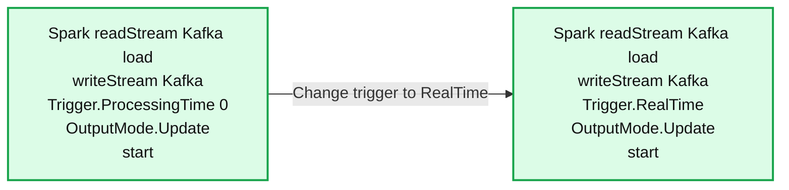
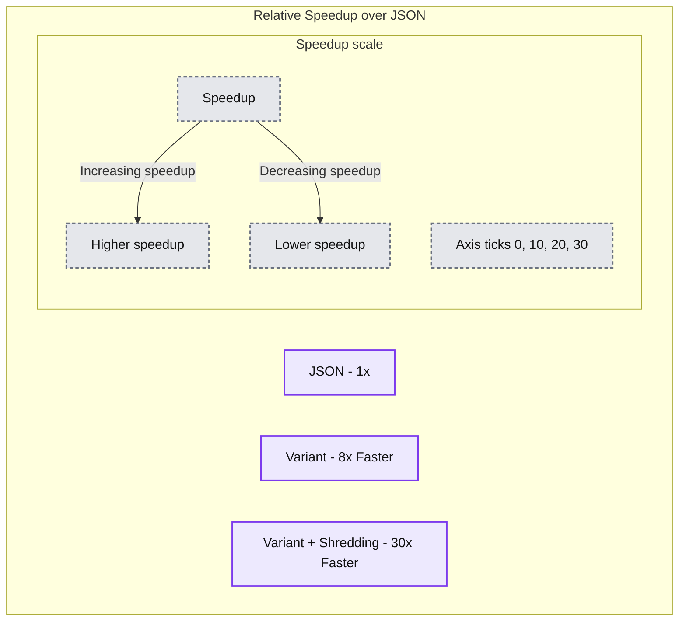

# Introducing Apache Spark® 4.1

*Now available in Databricks Runtime 18.0 Beta*

- Source: https://www.databricks.com/blog/introducing-apache-sparkr-41
- Published: 2025-12-22
- Authors: Sandy Ryza, Jerry Peng, Wenchen Fan, Herman van Hövell, Hyukjin Kwon, Allison Wang, Serge Rielau, DB Tsai, Xiao Li, Reynold Xin
- Categories: announcements, engineering
- Images: 4 total, 2 extracted as architecture

**Key takeaways**

- Spark Declarative Pipelines (SDP) shifts the data engineering focus from 'how-to' to 'what-to', the next logical progression now that we’ve gone from Spark interactive RDDs (how-to) to declarative DataFrames (what-to).
- Real-Time Mode in Structured Streaming achieves critical sub-second latency for real-time streaming and up to single-digit milliseconds for stateless workloads.
- SQL Scripting and recursive CTE GA greatly expand SQL-based complex data analysis.

Apache Spark 4.1 continues the Spark 4.x momentum with a release focused on higher-level data engineering, lower-latency streaming, faster and easier PySpark, and a more capable SQL surface. Spark 4.1 is now available out of the box in Databricks Runtime 18.0, so you can start using these features immediately in a managed environment.

**Spark 4.1 highlights at a glance**

- **Spark Declarative Pipelines (SDP):** A new declarative framework where you define datasets and queries, and Spark handles the execution graph, dependency ordering, parallelism, checkpoints, and retries. Author pipelines in Python and SQL, compile and run via a CLI, and use Spark Connect for multi-language clients.
- **Structured Streaming Real-Time Mode (RTM):** First official support for Structured Streaming queries running in real-time mode for continuous, sub-second latency processing. For stateless tasks, latency can even drop to single-digit milliseconds. Spark 4.1 starts with stateless, single-stage Scala queries, including Kafka sources and Kafka and Foreach sinks, and sets the direction for broader support in upcoming releases.
- **PySpark UDFs and Data Sources:** New Arrow-native UDF and UDTF decorators for efficient PyArrow execution without Pandas conversion overhead, plus Python Data Source filter pushdown to reduce data movement. Spark 4.1 also introduces Python worker logging, which captures UDF logs and exposes them through a built-in table-valued function.
- **Spark Connect:** Spark ML on Connect is GA for the Python client, with smarter model caching and memory management. Spark 4.1 also improves stability for large workloads with zstd-compressed protobuf plans, chunked Arrow result streaming, and enhanced support for large local relations.
- **SQL enhancements:** SQL Scripting is GA and enabled by default, with improved error handling and cleaner declarations. VARIANT is GA with shredding for faster reads on semi-structured data, plus recursive CTE support and new approximate data sketches (KLL and Theta).

## Spark Declarative Pipelines

Spark Declarative Pipelines (SDP) is a new component in Apache Spark 4.1, designed to allow developers to focus on data transformations rather than managing explicit dependencies and pipeline execution. By using a declarative approach, developers can now define the desired table state and how data flows between them. SDP then handles all the execution details, such as sequencing them in the correct order, implementing parallelism, handling checkpoints, and managing retries.

- **Declarative Abstractions**: SDP shifts development from defining imperative steps to describing the desired result using **Streaming Tables** (tables managed by streaming queries) and **Materialized Views** (tables defined as the result of a specific query).
- **Intelligent Graph Execution:** The Pipeline Runner analyzes the entire data flow graph before execution. This enables holistic pre-validation to catch schema mismatches early, automatic dependency resolution, and built-in handling for retries and parallelization.
- **Python, SQL, and Spark Connect APIs:** Pipelines can be defined using Python, SQL, or a combination of the two. SDP also exposes a Spark Connect API, allowing clients to be written in any language. The spark-pipelines command line interface enables compiling and executing a Pipeline from multiple files.

Here is an example Pipeline defined using SDP’s Python API. It ingests raw order data from a Kafka topic, refreshes a dimension the table of customers, and joins them to create a fact table of orders.

Based on the data dependencies, SDP will execute the queries that update both customers and raw_orders in parallel, and then execute the query that updates fact_orders once the upstream queries are complete.

## Real-Time Mode (RTM) in Structured Streaming

Apache Spark 4.1 marks a major milestone for low-latency streaming with the first official Spark support for Real-Time Mode in Structured Streaming. Following the approval of the Real-Time Mode [SPIP](https://issues.apache.org/jira/browse/SPARK-52330) and the completion of [SPARK-53736](https://issues.apache.org/jira/browse/SPARK-53736), Spark now enables continuous streaming queries designed for ultra-low latency execution.

### What is Real-Time Mode? 

Real-time mode within Spark Structured Streaming offers continuous, low-latency processing, achieving p99 latencies in the single-digit milliseconds range. Users can activate this capability with a simple configuration change, eliminating the need for code rewrites or replatforming, and continuing to utilize the familiar Structured Streaming APIs.

**Summary:** A Spark Structured Streaming Kafka query switches from ProcessingTime with a value of 0 to RealTime by changing its trigger.

**Components:**
- Left query: Spark Structured Streaming reads and writes Kafka using Trigger.ProcessingTime with value 0 and OutputMode.Update.
- Right query: Spark Structured Streaming reads and writes Kafka using Trigger.RealTime and OutputMode.Update.

**Flows:**
- Left query -> Right query: replace the ProcessingTime trigger with the RealTime trigger.

**Numbers:** Line numbers 1 through 10 appear in both queries. The left trigger has argument 0, with no unit shown.

source image: https://www.databricks.com/sites/default/files/inline-images/image5_36.png

With such a simple change, users can get orders of magnitude better latencies.

### What is supported in Spark 4.1?

Spark 4.1 supports stateless/single-stage streaming queries written in Scala. Supported sources include Kafka, and supported sinks are Kafka Sink and ForeachSink. The supported operators are most stateless operators and functions, such as Unions and Broadcast Stream-static Joins. Queries are limited to the Update output mode.

For a deeper discussion of the design and performance characteristics, see the [Real-Time Mode announcement blog](https://www.databricks.com/blog/introducing-real-time-mode-apache-sparktm-structured-streaming).

## Python UDFs and Data Sources

Apache Spark 4.1 introduces significant improvements to the PySpark ecosystem, focusing on performance through native Arrow integration and enhancing developer experience with improved debuggability. Here is a deep dive into the new Python UDF, UDTF, and Data Source features found in the 4.1 release branch.

### High-Performance Arrow-Native UDFs and UDTFs

Spark 4.1 introduces two new decorators that allow developers to bypass Pandas conversion overhead and work directly with PyArrow arrays and batches. This is a crucial advancement for users who rely on the efficiency of the Arrow memory format.

#### **Arrow UDFs (@arrow_udf)**

The new arrow_udf allows you to define scalar functions that accept and return pyarrow.Array objects. This is ideal for computationally intensive tasks where you can leverage pyarrow.compute functions directly.

#### **Arrow UDTFs (@arrow_udtf)**

User-defined table functions (UDTFs) also receive the Arrow treatment. The @arrow_udtf decorator enables vectorized table functions. Your eval method now processes entire pyarrow.RecordBatches at once, rather than iterating row-by-row.

### Debuggability: Python Worker Logging ([SPARK-53754](https://issues.apache.org/jira/browse/SPARK-53754))

Debugging Python UDFs has historically been difficult because standard logs often get lost in the executor's stdout/stderr. Spark 4.1 introduces a dedicated feature to capture and query these logs. By enabling spark.sql.pyspark.worker.logging.enabled, you can use the standard Python logging module inside your UDFs. Spark captures these logs and exposes them per session via a new Table-Valued Function: python_worker_logs().

### Python Data Source API: Filter Pushdown

The Python Data Source API (introduced in Spark 4.0) becomes more powerful in 4.1 with the addition of Filter Pushdown. You can now implement the pushFilters method in your DataSourceReader. This enables your data source to receive filter conditions (for example, id > 100) from the query optimizer and handle them at the source level; reducing data transfer and improving query speed.

## Spark Connect

Spark Connect continues to mature in Spark 4.1, with a strong focus on stability, scalability, and feature completeness for remote clients. This release delivers General Availability (GA) support for Spark ML on the Python client, along with several under-the-hood improvements that make Spark Connect more robust for large and complex workloads.

### Spark ML on Connect is GA

In Spark 4.1, Spark ML on Spark Connect is now generally available for the Python client. A new model size estimation mechanism allows the Connect server to intelligently manage model caching on the driver. Based on estimated size, models are cached in memory or safely spilled to disk when needed, significantly improving stability and memory utilization for machine learning workloads. In addition to this core enhancement, Spark 4.1 includes numerous bug fixes, clearer error messages, and expanded test coverage, resulting in a more reliable developer experience.

### Improved Scalability and Stability

Spark 4.1 introduces several key improvements that make Spark Connect more resilient at scale:

- Protobuf execution plans are now compressed using zstd, improving the stability when handling large and complex logical plans while also reducing network overhead
- Arrow query results are streamed in chunks over gRPC, improving stability when returning large result sets
- Support for local relations has been expanded by removing the previous 2 GB size limit, enabling the creation of DataFrames from larger in-memory objects such as Pandas DataFrames or Scala collections

Together, these enhancements make Spark Connect a stronger foundation for multi-language clients, interactive workloads, and large-scale data processing in distributed environments.

## SQL Features

Spark 4.1 further expands and matures SQL language surface, bridging the gap between data warehousing and data engineering. This release focuses on expanding the procedural capabilities of Spark SQL and standardizing the handling of complex data.

### SQL Scripting

After its preview in 4.0, SQL Scripting is now Generally Available (GA) and enabled by default. This transforms Spark SQL into a robust programmable environment, allowing you to write complex control flow logic (loops, conditionals,etc) directly in SQL.

**What’s New in 4.1:** We have introduced the CONTINUE HANDLER for sophisticated error recovery and a multi-variable DECLARE syntax for cleaner code.

### VARIANT Data Type

The VARIANT data type is now GA, offering a standardized way to store semi-structured data like JSON without rigid schemas.

A major performance enhancement in Spark 4.1 is **shredding**. This feature automatically extracts commonly occurring fields within a variant column and stores them as separate, typed Parquet fields. This selective extraction dramatically reduces I/O by allowing the engine to skip reading the full binary blob for fields you query often.

**Performance Benchmark:**

- **8x faster** read performance compared to standard VARIANT (non-shredded).
- **30x faster** read performance compared to storing data as JSON strings.
- Note: Enabling shredding may result in 20-50% slower write times, a trade-off optimized for read-heavy analytics.

**Summary:** The benchmark compares relative speedup over JSON, labeling JSON as 1x, Variant as 8x faster, and Variant + Shredding as 30x faster.

**Components:**
- JSON: red bar representing JSON.
- Variant: yellow bar representing Variant.
- Variant + Shredding: green bar representing Variant with shredding.
- Speedup: vertical scale.
- Relative Speedup over JSON: chart title.

**Flows:**
- Speedup -> Up: arrow indicates increasing speedup.
- Speedup -> Down: arrow indicates decreasing speedup.

**Numbers:**
- JSON: 1x.
- Variant: 8x faster.
- Variant + Shredding: 30x faster.
- Speedup axis ticks: 0, 10, 20, 30.

source image: https://www.databricks.com/sites/default/files/inline-images/image4_50.png

### Recursive CTE

Spark 4.1 adds standard SQL syntax for **Recursive Common Table Expressions**. This allows you to traverse hierarchical data structures—such as org charts or graph topologies—purely within SQL, simplifying migration from legacy systems.

### New Approximate Data Sketches

We have expanded our approximate aggregation capabilities beyond HyperLogLog. Spark 4.1 adds native SQL functions for **KLL (Quantiles)** [[SPARK-54199]](https://issues.apache.org/jira/browse/SPARK-54199)[[SPARK-53991](https://issues.apache.org/jira/browse/SPARK-53991)] and **Theta** sketches [[SPARK-52407](https://issues.apache.org/jira/browse/SPARK-52407)]. These allow for highly efficient approximate set operations (unions, intersections) on massive datasets with minimal memory overhead.

## Acknowledgements

Apache Spark 4.1 is the product of another strong release cycle powered by the Apache Spark community. The new Spark Declarative Pipelines (SDP) shift the focus from how-to to what-to in data engineering. Real-Time Mode (RTM) in Structured Streaming provides critical low-latency performance with single-digit millisecond response times. With the ever-growing PySpark ecosystem, this release introduces performant Arrow-native UDFs and UDTFs, eliminating serialization overhead by leveraging native Arrow integration. Additionally, Python Worker Logging makes debugging UDFs much easier, mitigating developers’ past pain points. Spark Connect for ML improves stability for machine learning workloads, including intelligent model management, through caching and clever memory usage, and protobuf compression of execution plans using zstd. And finally, SQL language matures with rich SQL Scripting logical controls, adds a performant VARIANT data type, and recursive table expressions.

We would like to thank everyone who contributed to Spark 4.1, whether by proposing designs, filing and triaging JIRAs, reviewing pull requests, writing tests, improving documentation, or sharing feedback on the mailing lists. For the full list of changes and additional engine-level refinements not covered here, please consult the official [Spark 4.1.0 release notes](https://spark.apache.org/news/spark-4-1-0-released.html).

Getting Apache Spark® 4.1:: It’s fully open source - download it from [spark.apache.org](http://spark.apache.org). Many of its features have been already available in Databricks Runtime 17.x, and now they ship out of the box with Runtime 18.0 Beta. To explore Spark 4.1 in a managed environment, choose “18.0 Beta” when you spin up your cluster, and you’ll be running Spark 4.1 in minutes.
