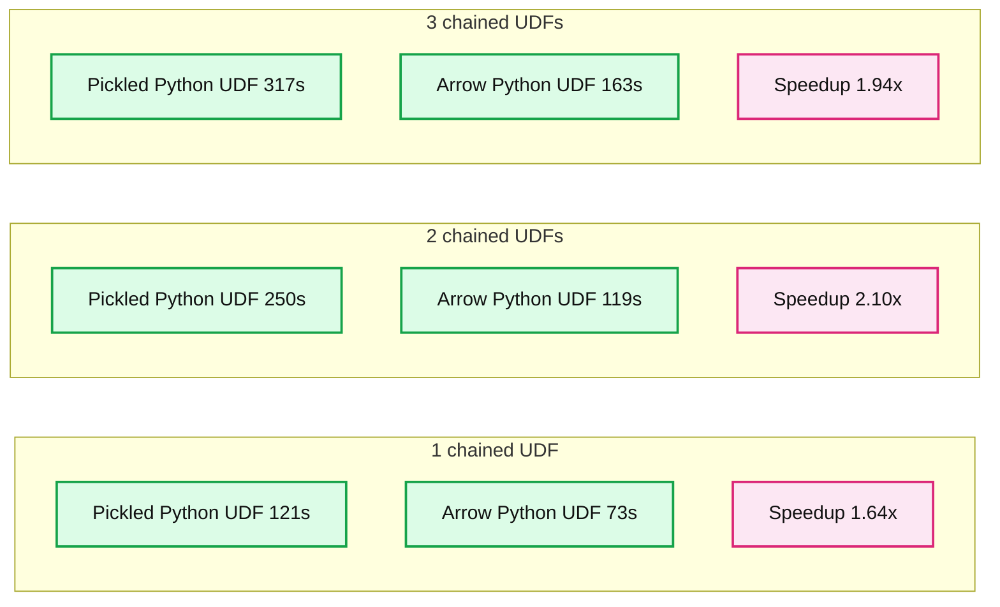

# Introducing Apache Spark™ 3.5

*Now available in Databricks Runtime 14.0*

- Source: https://www.databricks.com/blog/introducing-apache-sparktm-35
- Published: 2023-09-15
- Authors: Yuanjian Li, Daniel Tenedorio, Martin Grund, Allan Folting, Hyukjin Kwon, Herman van Hövell, Wenchen Fan, Weichen Xu, Gengliang Wang, Allison Wang, Jungtaek Lim, Xiao Li, Reynold Xin
- Categories: engineering, open-source
- Images: 4 total, 1 extracted as architecture

*Free Edition has replaced Community Edition, offering enhanced features at no cost. Start using *[*Free Edition *](https://login.databricks.com/?intent=SIGN_UP&amp;signup_experience_step=EXPRESS&amp;provider=DB_FREE_TIER&amp;dbx_source=www)*today.*
 

Today, we are happy to announce the availability of Apache Spark™ 3.5 on Databricks as part of Databricks Runtime 14.0. We extend our sincere appreciation to the Apache Spark community for their invaluable contributions to the Spark 3.5 release.

Aligned with our mission to make Spark more accessible, versatile, and efficient than ever before, this update is packed with new features and improvements, including:

- **Spark Connect** supports more scenarios with general availability of the Scala client, support for distributed training and inference, parity of Pandas API on SPARK, and improved compatibility for structured streaming
- Increase developer productivity with **new PySpark and SQL functionality** like built-in SQL functions for manipulating arrays, SQL IDENTIFIER clause, expanded SQL function support for the Scala, Python and R APIs, named argument support for SQL function calls, SQL function support for HyperLogLog approximate aggregations, as well as Arrow-optimized Python UDFs, Python user-defined table functions, PySpark testing API, and Enhanced error classes in PySpark
- Simplify **distributed training** with DeepSpeed on Spark clusters.
- Performance and stability improvements in the **RocksDB state store provider**, which reduce trade-offs when compared to in-memory state store providers.
- The **English SDK for Apache Spark** enables users to utilize plain English as their programming language, making data transformations more accessible and user-friendly.

This blog post will walk you through the highlights of Apache Spark 3.5, giving you a snapshot of its game-changing features and enhancements. For more information about these exciting updates, keep an eye out for our upcoming blog posts. To learn about the nitty-gritty details, we recommend going through the comprehensive [Apache Spark 3.5 release notes](https://spark.apache.org/releases/spark-release-3-5-0.html), which include a full list of major features and resolved JIRA tickets across all Spark components.

## Spark Connect

Since the release of Spark 3.4.0, there have been approximately 680 commits relevant to the Spark Connect implementation. Feel free to browse the changes [here](https://github.com/apache/spark/pulls?q=is%3Apr+is%3Aclosed+closed%3A%3E%3D2023-03-01+label%3ACONNECT).

The key deliverable for Spark 3.5 and the Spark Connect component is the general availability of the Scala client for Spark Connect ([SPARK-42554](https://issues.apache.org/jira/browse/SPARK-42554)). Part of this work was a major refactoring of the **sql** submodule to split it into client (**sql-api**) and server-compatible (**sql**) modules to reduce the set of dependencies needed on the client for classpath isolation ([SPARK-44273](https://issues.apache.org/jira/browse/SPARK-44273)).

Until the release of Spark 3.5, it was not possible to use Apache Spark's MLlib directly with Spark Connect as it relies on the Py4J gateway requiring a co-located client application. In Spark 3.5 we introduce the ability to do distributed training and inference using Spark Connect using a new distributed execution framework based on PyTorch ([SPARK-42471](https://issues.apache.org/jira/browse/SPARK-42471)). Currently, this module supports logistic regression classifiers, basic feature transformers, basic model evaluators, ML pipelines and, cross validation. This framework seamlessly integrates with the vectorized Python UDF framework in Spark extending it with the capability of executing UDFs using barrier execution mode.

Over the course of the last release, we have worked on providing parity of the [Pandas API on Spark](https://spark.apache.org/docs/latest/api/python/reference/pyspark.pandas/index.html) using Spark Connect ([SPARK-42497](https://issues.apache.org/jira/browse/SPARK-42497)), and continued to improve the compatibility of the Spark Connect client for structured streaming workloads both in Python and Scala ([SPARK-49238](https://issues.apache.org/jira/browse/SPARK-42938)).

Lastly, the community started working on a client for Spark Connect in Golang ([SPARK-43351](https://issues.apache.org/jira/browse/SPARK-43351)) that is developed in a separate repository here: [https://github.com/apache/spark-connect-go](https://github.com/apache/spark-connect-go)

## PySpark Features

This release introduces significant enhancements to PySpark including Arrow-optimized Python User Defined Functions (UDFs), Python User Defined Table Functions (UDTFs), improved error messages, and a new testing API that considerably improves usability, performance, and testability in PySpark.

**Arrow-optimized Python UDFs** ([SPARK-40307](https://issues.apache.org/jira/browse/SPARK-40307)): Python UDFs will leverage the Arrow columnar format to improve performance when either the **spark.sql.execution.pythonUDF.arrow.enabled** configuration is set to **True**, or when **useArrow** is set to **True** using the UDF decorator, as shown in the following example. With this optimization, Python UDFs can perform up to **2 times faster** than pickled Python UDFs on modern CPU architectures, thanks to vectorized I/O.

**Summary:** Arrow Python UDFs execute faster than pickled Python UDFs for one, two, and three chained UDFs.

**Components:**
- Pickled Python UDF: blue bars showing execution time with Python pickle serialization.
- Arrow Python UDF: orange bars showing execution time with Arrow.
- Count of chained UDFs: horizontal axis.
- Execution time/s: vertical axis.

**Flows:**
- none. No arrows are visible.

**Numbers:**
- 1 chained UDF: Pickled 121s, Arrow 73s, annotated speedup 1.64x.
- 2 chained UDFs: Pickled 250s, Arrow 119s, annotated speedup 2.10x.
- 3 chained UDFs: Pickled 317s, Arrow 163s, annotated speedup 1.94x.
- Execution time axis ticks: 0, 50, 100, 150, 200, 250, 300 seconds.

source image: https://www.databricks.com/sites/default/files/inline-images/db-751-blog-img-1.png

**Python user-defined table functions** ([SPARK-43798](https://issues.apache.org/jira/browse/SPARK-43798)): A user-defined table function (UDTF) is a type of user-defined function that returns an entire output table instead of a single scalar result value. PySpark users can now write their own UDTFs integrating their Python logic and use them in PySpark and SQL.

**Testing API** ([SPARK-44042](https://issues.apache.org/jira/browse/SPARK-44042)): Apache Spark™ 3.5 introduces new DataFrame equality test utility functions including detailed, color-coded test error messages, which clearly indicate differences between DataFrame schemas and data within DataFrames. It enables developers to easily add equality tests that produce actionable results for their applications to enhance productivity. The new APIs are as follows:

- `pyspark.testing.assertDataFrameEqual`
- `pyspark.testing.assertPandasOnSparkEqual`
- `pyspark.testing.assertSchemaEqual`

**Enhanced error messages in PySpark** ([SPARK-42986](https://issues.apache.org/jira/browse/SPARK-42986)): Previously, the set of exceptions thrown from the Python Spark driver did not leverage the error classes introduced in Apache Spark™ 3.3. All of the errors from DataFrame and SQL have been migrated, and contain the appropriate error classes and codes.

## SQL Features

Apache Spark™ 3.5 adds a lot of new SQL features and improvements, making it easier for people to build queries with SQL/DataFrame APIs in Spark, and for people to migrate from other popular databases to Spark.

**New built-in SQL functions for manipulating arrays** ([SPARK-41231](https://issues.apache.org/jira/browse/SPARK-41231)): Apache Spark™ 3.5 includes many new built-in SQL functions to help users easily manipulate array values. Using built-in functions for this is easier and often more efficient than constructing user-defined functions for the same purpose.

**IDENTIFIER clause** ([SPARK-41231](https://issues.apache.org/jira/browse/SPARK-41231)): The new IDENTIFIER clause provides flexibility for building new SQL query templates safely, without the risk of SQL injection attacks. For example, using the IDENTIFIER clause with string literals to specify table/column/function names is very powerful when paired with the query parameter feature added in the previous Spark release.

**Expanded SQL function support for the Scala, Python, and R APIs** ([SPARK-43907](https://issues.apache.org/jira/browse/SPARK-43907)): Before Spark 3.5, there were many SQL functions that were not available in the Scala, Python, or R DataFrame APIs. This presented difficulties invoking the functions within DataFrames as users found it necessary to type the function name in string literals without any help from auto-completion. Spark 3.5 removes this problem by making 150+ SQL functions available in the DataFrame APIs.

**Named argument support for SQL function calls** ([SPARK-44059](https://issues.apache.org/jira/browse/SPARK-44059)): Similar to Python, Spark's SQL language now allows users to invoke functions with parameter names preceding their values. This matches the specification from the SQL standard and results in clearer and more robust query language when the function has many parameters and/or some parameters have default values.

**New SQL function support for HyperLogLog approximate aggregations based on Apache Datasketches** ([SPARK-16484](https://issues.apache.org/jira/browse/SPARK-16484)): Apache Spark™ 3.5 includes new SQL functions for counting unique values within groups with precision and efficiency, including storing the result of intermediate computations to sketch buffers which can be persistent into storage and loaded back later. These implementations use the Apache Datasketches library for consistency with the open-source community and easy integration with other tools. For example:

## DeepSpeed Distributor

In this release, the DeepspeedTorchDistributor module is added to PySpark to help users simplify distributed training with DeepSpeed on Spark clusters ([SPARK-44264](https://issues.apache.org/jira/browse/SPARK-44264)). It is an extension of the [TorchDistributor](https://spark.apache.org/docs/latest/api/python/reference/api/pyspark.ml.torch.distributor.TorchDistributor.html) module that was released in Apache Spark 3.4™. Under the hood, the DeepspeedTorchDistributor initializes the environment and the communication channels required for DeepSpeed. The module supports distributing training jobs on both single-node multi-GPU and multi-node GPU clusters. Here is an example code snippet of how to use it:

For more details and example notebooks, see [https://docs.databricks.com/en/machine-learning/train-model/distributed-training/deepspeed.html](https://docs.databricks.com/en/machine-learning/train-model/distributed-training/deepspeed.html)

## Streaming

Apache Spark™ 3.5 introduces a variety of improvements to streaming, including the completion of support for multiple stateful operators, and improvements to the RocksDB state store provider.

**Completion of support for multiple stateful operators** ([SPARK-42376](https://issues.apache.org/jira/browse/SPARK-42376)): In Apache Spark™ 3.4, Spark enables users to perform stateful operations (aggregation, deduplication, stream-stream joins, etc) multiple times in the same query, including chained time window aggregations. Stream-stream time interval join followed by another stateful operator wasn't supported in Apache Spark™ 3.4, and Apache Spark™ 3.5 finally supports this to enable more complex workloads e.g. joining streams of ads and clicks, and aggregating over time window.

**Changelog checkpointing for RocksDB state store provider** ([SPARK-43421](https://issues.apache.org/jira/browse/SPARK-43421)): Apache Spark™ 3.5 introduces a new checkpoint mechanism for the RocksDB state store provider named "Changelog Checkpointing", which persists the changelog (updates) of the state. This reduces the commit latency significantly which also reduces end to end latency significantly. You can set the config `spark.sql.streaming.stateStore.rocksdb.changelogCheckpointing.enabled` property to true to enable this feature. Note that you can also enable this feature with existing checkpoints as well.

**RocksDB state store provider memory management enhancements** ([SPARK-43311](https://issues.apache.org/jira/browse/SPARK-43311)): Although the RocksDB state store provider is well-known to be useful to address memory issues on the state, there was no fine-grained memory management and there have still been some occurrences of memory issues with RocksDB. Apache Spark™ 3.5 introduces more fine-grained memory management which enables users to cap the total memory usage across RocksDB instances in the same executor process, enabling users to reason about and configure the memory usage per executor process.

**Introduces dropDuplicatesWithinWatermark** ([SPARK-42931](https://issues.apache.org/jira/browse/SPARK-42931)): In response to accumulated experience from using `dropDuplicates()` with streaming queries, Apache Spark™ 3.5 introduces a new API `dropDuplicatesWithinWatermark()` which deduplicates events without requiring the timestamp for event time to be the same, as long as the timestamp for these events are close enough to fit within the watermark delay. With this new feature, users can handle the case like "Timestamp for event time could differ even for events to be considered as duplicates." For example, one practical case is when the user ingests to Kafka without an idempotent producer, and uses the automatic timestamp in the record as the event time.

## English SDK

The English SDK for Apache Spark is a groundbreaking tool that revolutionizes your data engineering and analytics workflow by using English as your programming language. Designed to streamline complex operations, this SDK minimizes code complexity, enabling you to concentrate on extracting valuable insights from your data.

### Transform DataFrames with Plain English

The `df.ai.transform()` method allows you to manipulate DataFrames using straightforward English phrases. For example:

Internally, this command is translated to the following SQL query, which is then executed and the result is stored in a new DataFrame:

### Visualize Data with Plain English

The `df.ai.plot()` method offers a simple way to visualize your data. You can specify the type of plot and the data to include, all in plain English. For example:

### Additional Resources

For more in-depth information and examples, visit our [GitHub repository](https://pyspark.ai/) and [blog post](https://www.databricks.com/blog/introducing-english-new-programming-language-apache-spark).

## Beyond the Headlines: More in Apache Spark™ 3.5

While the spotlight often falls on groundbreaking features, the true hallmark of an enduring platform is its focus on usability, stability, and incremental improvement. To that end, Apache Spark 3.5 has tackled and resolved an astonishing 1324 issues, thanks to the collaborative efforts of over 198 contributors. These aren't just individuals, but teams from influential companies like Databricks, Apple, Nvidia, Linkedin, UBS, Baidu, and many more. Although this blog post has honed in on the headline-grabbing advancements in SQL, Python, and streaming, Spark 3.5 offers a plethora of other enhancements not discussed here. These include adaptive query execution for SQL cache, decommission enhancements and new DSV2 extensions — to name just a few. Dive into the [release notes](https://spark.apache.org/releases/spark-release-3-5-0.html) for a full account of these additional capabilities.

## Get Started with Spark 3.5 Today

If you want to experiment with Apache Spark 3.5 on [Databricks Runtime 14.0](https://docs.databricks.com/en/release-notes/runtime/14.0.html), you can easily do so by signing up for either the free Databricks Community Edition or the Databricks Trial. Once you're in, firing up a cluster with Spark 3.5 is as easy as selecting version "14.0" You'll be up and running, exploring all that Spark 3.5 has to offer, in just a few minutes.
