# Introducing Arrow UDFs in PySpark: A Faster, Leaner Replacement for Pandas UDFs

*Define more performant UDFs with ease.*

- Source: https://www.databricks.com/blog/introducing-arrow-udfs-pyspark-faster-leaner-replacement-pandas-udfs
- Published: 2026-05-20
- Authors: Ruifeng Zheng, Yicong Huang
- Categories: engineering, open-source
- Images: 1 total, 1 extracted as architecture

**Key takeaways**

- We introduce native Arrow UDFs, which operate directly on Arrow data, eliminating the Pandas/Arrow conversion overhead in Pandas UDFs for faster execution and lower memory usage.
- We also describe Arrow UDF types for scalar and aggregation use cases, and Arrow UDTFs for table-in, table-out transformations, with code examples in both Python and SQL.
- Benchmarks show Arrow UDFs are ~10% faster and use ~40% less memory than Pandas UDFs, with better support for complex datatypes.

## Introduction

Python User-Defined Functions (UDFs) are an essential extensibility mechanism but have traditionally suffered from high overhead due to row-based execution. In Apache Spark™, Pandas UDFs addressed part of this problem by introducing Arrow-based serialization and batch processing, significantly improving throughput compared to scalar Python UDFs.

However, Pandas UDFs still have fundamental limitations:

- The Pandas/Arrow data conversion introduces additional data copies. Zero-copy approaches are only possible [in certain narrow cases](https://arrow.apache.org/docs/python/pandas.html#zero-copy-series-conversions). For example, columns with NULL values will trigger deep copies.
- Complex datatypes are not supported well. For example, nested StructType instances are not supported for the output type with aggregation use cases.

*Data flows of Pandas UDF Execution in Apache Spark™*

**Summary:** Spark executes Pandas UDFs by transferring Apache Arrow RecordBatches between Java and Python, converting to and from pandas around UDF invocation.

**Components:**
- Java: execution environment containing Spark physical processing and Arrow integration.
- Physical Operator: Spark operator sending groups of rows and receiving ColumnarBatches.
- ArrowPythonRunner: Spark component coordinating Python execution.
- ArrowWriter: Java-side Arrow writer.
- ArrowColumnVectors: Java-side Arrow column vectors for returned results.
- RecordBatches: Apache Arrow batches transferred in both directions.
- Python: execution environment hosting pandas conversion and UDF execution.
- ArrowStreamPandasSerializer, input: Python serializer converting incoming Arrow data for pandas.
- Invoke UDF: Python user-defined function operating on pandas data.
- ArrowStreamPandasSerializer, output: Python serializer converting pandas results to Arrow.

**Flows:**
- Incoming processing -> Physical Operator: input.
- Physical Operator -> ArrowPythonRunner: groups of rows.
- ArrowPythonRunner -> ArrowWriter: rows for Arrow serialization.
- ArrowWriter -> Input RecordBatches: Arrow batch data.
- Input RecordBatches -> Input ArrowStreamPandasSerializer: Arrow batch data entering Python.
- Input ArrowStreamPandasSerializer -> Invoke UDF: pandas data.
- Invoke UDF -> Output ArrowStreamPandasSerializer: pandas results.
- Output ArrowStreamPandasSerializer -> Output RecordBatches: Arrow batch results.
- Output RecordBatches -> ArrowColumnVectors: Arrow results entering Java.
- ArrowColumnVectors -> ArrowPythonRunner: column vectors.
- ArrowPythonRunner -> Physical Operator: ColumnarBatches.
- Physical Operator -> Outgoing processing: output.

**Numbers:** none

```mermaid
%% Pandas UDF execution with Apache Arrow transfers between Java and Python
flowchart LR
    IN[Incoming processing]
    OUT[Outgoing processing]

    subgraph JAVA[Java]
        PO[Physical Operator]
        RUN[ArrowPythonRunner]
        WRITE[ArrowWriter]
        VEC[ArrowColumnVectors]
    end

    RBIN[Apache Arrow input RecordBatches]
    RBOUT[Apache Arrow output RecordBatches]

    subgraph PY[Python]
        SIN[ArrowStreamPandasSerializer input]
        UDF[Invoke UDF]
        SOUT[ArrowStreamPandasSerializer output]
    end

    IN -->|Input| PO
    PO -->|Groups of rows| RUN
    RUN -->|Rows| WRITE
    WRITE -->|Arrow batch data| RBIN
    RBIN -->|Arrow batch data| SIN
    SIN -->|pandas data| UDF
    UDF -->|pandas results| SOUT
    SOUT -->|Arrow batch results| RBOUT
    RBOUT -->|Arrow results| VEC
    VEC -->|Column vectors| RUN
    RUN -->|ColumnarBatches| PO
    PO -->|Output| OUT

    classDef client fill:#dbeafe,stroke:#2563eb,stroke-width:2px,color:#111
    classDef service fill:#dcfce7,stroke:#16a34a,stroke-width:2px,color:#111
    classDef store fill:#ede9fe,stroke:#7c3aed,stroke-width:2px,color:#111
    classDef cache fill:#fef3c7,stroke:#d97706,stroke-width:2px,color:#111
    classDef queue fill:#cffafe,stroke:#0891b2,stroke-width:2px,color:#111
    classDef critical fill:#fee2e2,stroke:#dc2626,stroke-width:4px,color:#111
    classDef external fill:#e5e7eb,stroke:#6b7280,stroke-width:2px,color:#111,stroke-dasharray:4 3
    classDef decision fill:#fce7f3,stroke:#db2777,stroke-width:2px,color:#111
    class IN,OUT external
    class PO,RUN,WRITE,VEC,SIN,UDF,SOUT service
    class RBIN,RBOUT queue
```

source image: https://www.databricks.com/sites/default/files/inline-images/2026-02-blog-introducing-arrow-udfs-in-pyspark-inline-960x502.4.png?v=1779167241

Data flows of Pandas UDF Execution in Apache Spark**™**

By dropping the Pandas/Arrow data conversion, the Arrow UDFs execute faster than Pandas UDFs, consume less memory, and provide better datatype support.

## Native Arrow UDFs

We’re thrilled to introduce **Native Arrow UDFs** starting with Databricks Runtime 18.0 ([release notes](https://docs.databricks.com/aws/en/release-notes/runtime/18.0)), an exciting leap forward for performant UDF execution.

Native Arrow UDFs operate directly on Arrow data without converting inputs into Pandas or NumPy objects. This preserves the columnar layout end-to-end, avoids unnecessary data copies, and lets UDFs use vectorized processing by leveraging Arrow’s native compute and memory model.

To define an Arrow UDF, users are able to use a new python decorator `@arrow_udf`, with specified return type and optional evaluation type. For instance:

Users can also define it with existing decorator @udf with complete type hints. For instance:

Note: The function definition should include type hints for all of the arguments and the return value.
This design aligns with the interfaces of scalar Python UDFs, providing a consistent and intuitive experience for users already familiar with scalar Python UDFs.

The following demonstrates how to use the Arrow UDF:

**Python Usage:**

**SQL Usage:**

We provide support for variants of Arrow UDF interfaces. Including Scalar Functions, Aggregate Functions and Table Functions. In the data frame API we also provide mapInArrow and applyInArrow to use Arrow UDFs. We will next introduce them one by one. 

## Arrow Scalar Functions

Arrow Scalar Functions perform row-wise transformations. They are the Arrow equivalent of scalar Pandas UDFs and can be used anywhere a column expression is expected, such as `df.select()` or `df.withColumn()`. Three input modes are supported: direct, iterator, and iterator of multiple arrays. The iterator variants are useful when the UDF requires expensive one-time initialization (e.g.,  loading a model or compiling a regex pattern), as the setup cost is amortized across all batches. In all cases, the output row count must match the input row count.

- **Arrays to Array:** receiving one or more `pyarrow.Array` and returning one `pyarrow.Array`. The input and output array must have the same number of values.

- **Iterator of Arrays to Iterator of Arrays:** receiving an iterator of `pyarrow.Array` and returning an iterator of `pyarrow.Array`. This type is useful when the UDF execution requires expensive initialization. 

- **Iterator of Multiple Arrays to Iterator of Arrays:** receiving an iterator of a tuple of multiple `pyarrow.Array` and returning an iterator of `pyarrow.Array`.

## Arrow Aggregate Functions

Arrow Aggregate Functions take one or more pyarrow.Array inputs and return a scalar value, reducing a group of rows into a single result. They are the Arrow equivalent of grouped aggregate Pandas UDFs and are used with `groupBy().agg()` or Window operations. Similar to scalar functions, aggregate functions also support three input modes. 

**Arrays to Scalar: **receiving `pyarrow.Array` and returning a scalar value. 

- **Iterator of Arrays to Scalar:** receiving an iterator of `pyarrow.Array` and returning a scalar value. This is useful for processing large volumes of data in aggregation-style operations.

**Iterator of Multiple Arrays to Scalar:** receiving an iterator of a tuple of multiple `pyarrow.Array` and returning a scalar value. More complex aggregations can be defined.

## Arrow Table Functions

Arrow Table Functions, also known as Arrow UDTFs (User-Defined Table Functions), accept a `pyarrow.RecordBatch` or multiple `pa.Array` as input and produce a `pyarrow.Table` as output. This represents the predominant pattern for table-in, table-out transformations implemented in Python utilizing columnar execution. Arrow UDTFs possess the capability to:

- Return multiple columns
- Produce zero, one, or multiple rows
- Execute vectorized table transformations employing Arrow compute kernels

Consequently, they are optimally suited for operations such as filtering, row expansion, data restructuring, and the generation of derived columns.

The `arrow_udtf` interface is designed for simplicity, employing a decorator syntax where you define the return type using a DDL-formatted string. In this setup, the `eval` method takes PyArrow objects as input and is expected to yield PyArrow Tables or RecordBatches. The interface accommodates two input modes. When processing table arguments, the `eval` method is provided with a `pa.RecordBatch` object that encapsulates all columns from the input table:

For scalar arguments, the method receives pa.Array objects, one for each scalar input:

Here is another example:

This UDTF can work in two distinct ways:

**Python Usage:**

**SQL Usage:**

## DataFrame mapInArrow and applyInArrow Support

In addition to User-Defined Functions (UDFs) and User-Defined Table Functions (UDTFs), PySpark furnishes Arrow Function APIs that facilitate the direct application of Python native functions to Arrow data at the DataFrame level. These APIs operate analogously to their Pandas counterparts (`mapInPandas`, `applyInPandas`) but utilize `pyarrow.RecordBatch` and `pyarrow.Table` instead of Pandas DataFrames, thereby circumventing the conversion overhead between Pandas and Arrow formats.

- Map. `DataFrame.mapInArrow` transforms an iterator of `pyarrow.RecordBatch` into another iterator of `pyarrow.RecordBatch`, enabling row-level operations such as filtering, transformation, or expansion.

- Grouped Map. `groupBy().applyInArrow()` applies a specified function to each group, accepting and returning a `pyarrow.Table`. This functionality proves beneficial for per-group transformations, such as data normalization.

- Co-grouped Map. `cogroup().applyInArrow()` permits the cogrouping of two DataFrames based on a shared key, subsequently applying a function to each cogroup. The function receives two `pyarrow.Table` inputs and is expected to return a single `pyarrow.Table`.

## Performance

By removing the expensive Pandas/Arrow data conversion, Arrow UDFs generally execute faster than Pandas UDFs, with less memory usage. Let’s compare the two simple UDFs:

The Arrow UDF is ~10% faster than the Pandas UDF, and the [memory profiler](https://www.databricks.com/blog/2022/11/30/memory-profiling-pyspark.html) shows that ~40% memory is saved in the execution.

## Conclusion

Databricks Runtime 18.0 introduces Native Arrow UDFs, offering a faster, leaner alternative to Pandas UDFs for performant Python UDF execution in PySpark. By operating directly on Arrow data and eliminating the Pandas/Arrow conversion overhead, Arrow UDFs deliver ~10% faster execution, ~40% less memory usage, and better support for complex datatypes -- all with a familiar, intuitive decorator syntax.

Ready to explore more? Try out Native Arrow UDFs today on Databricks as part of Databricks Runtime 18.0. To get started, simply replace your existing Pandas UDFs with Arrow UDFs. In most cases, it only takes a few lines of change to unlock immediate performance gains. See the Arrow UDF documentation and Arrow UDTF documentation for the full API reference and additional examples.
