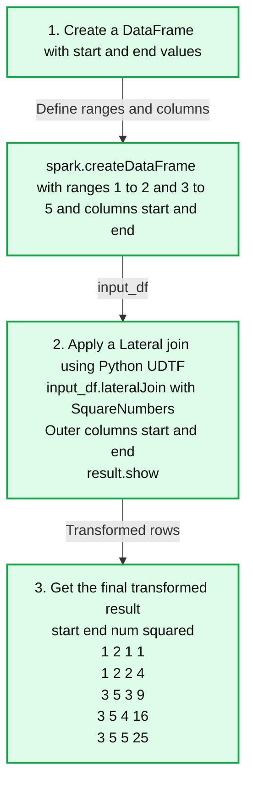

# Introducing the DataFrame API for Table-Valued Functions

*A Simpler, More Streamlined Way to Work with TVFs*

- Source: https://www.databricks.com/blog/introducing-dataframe-api-table-valued-functions
- Published: 2025-06-26
- Authors: Allison Wang, Takuya Ueshin, Jules Damji
- Categories: engineering
- Images: 1 total, 1 extracted as architecture

**Key takeaways**

- Table Value Functions offer powerful and simpler ways to conduct bulk transformations in your data pipelines
- Use them with DataFrame API for operator chaining in your sequential transformations
- Employ lateral join with DataFrames for dynamic expansion of row-based transformation returning an expanded set of transformations

**Summary:** The DataFrame API creates start and end ranges, applies a lateral join with a Python UDTF, and returns numbers with their squares.

**Components:**
- Create a DataFrame with start and end values: Apache Spark `spark.createDataFrame` creates `input_df` with columns `start` and `end`.
- Apply a Lateral join using Python UDTF: `input_df.lateralJoin` invokes `SquareNumbers` using `col("start").outer()` and `col("end").outer()`; `result.show()` displays the output.
- Get the final transformed result: Spark output table with columns `start`, `end`, `num`, and `squared`.

**Flows:**
- Create a DataFrame with start and end values -> `spark.createDataFrame`: defines the input ranges and column names.
- `spark.createDataFrame` -> Apply a Lateral join using Python UDTF: supplies `input_df`.
- Apply a Lateral join using Python UDTF -> Get the final transformed result: returns the displayed rows.

**Numbers:**
- Step labels: 1, 2, 3.
- Input ranges: `(1, 2)` and `(3, 5)`.
- Output values:

| start | end | num | squared |
|---|---|---|---|
| 1 | 2 | 1 | 1 |
| 1 | 2 | 2 | 4 |
| 3 | 5 | 3 | 9 |
| 3 | 5 | 4 | 16 |
| 3 | 5 | 5 | 25 |

source image: https://www.databricks.com/sites/default/files/inline-images/dataFrame-api-table-valued-functions-blog-img-1.png

Table-Valued Functions (TVFs) have long been a powerful tool for processing structured data. They allow functions to return multiple rows and columns instead of just a single value. Previously, using TVFs in Apache Spark™ required SQL, making them less flexible for users who prefer the DataFrame API.

We are pleased to announce the new DataFrame API for Table-Valued Functions. Users can now invoke TVFs directly within DataFrame operations, making transformations simpler, more composable, and fully integrated with Spark’s DataFrame workflow. This is available in Databricks Runtime (DBR) 16.1 and above.

In this blog, we’ll explore what TVFs are and how to use them, both with scalar and table arguments. Consider the three benefits in using TVTs:

**Key Benefits**

- **Native DataFrame Integration:** Call TVFs directly using `spark.tvf.<function_name>,` without needing SQL.
- **Chainable and Composable:** Combine TVFs effortlessly with your favorite DataFrame transformations, such as `.filter(), .select(),` and more.
- **Lateral Join Support (available in DBR 17.0):** Use TVFs in joins to dynamically generate and expand rows based on each input row’s data.

## Using the Table-Valued Function DataFrame API

We'll start with a simple example using a built-in TVF. Spark comes with handy TVFs like `variant_explode`, which expands JSON structures into multiple rows.

Here is the SQL approach:

And here is the equivalent DataFrame API approach:

As you can see above, it’s straightforward to use TVFs either way: through SQL or the DataFrame API. Both give you the same result, using scalar arguments.

### Accepting Table Arguments

What if you want to use a table as an input argument? This is useful when you want to operate on rows of data. Let's look at an example where we want to compute the duration and costs of travel by car and air.

Let’s imagine a simple DataFrame:

We need our class to handle a table row as an argument. Note that the `eval` method takes a `Row` argument from a table instead of a scalar argument.

With this definition of handling a `Row` from a table, we can compute the desired result by sending our DataFrame as a table argument.

Or you can create a table, register the UDTF, and use it in a SQL statement as follows:

Alternatively, you can achieve the same result by calling the TVF with a lateral join, which is useful with scalar arguments (read below for an example).

## Taking it to the Next Level: Lateral Joins

You can also use lateral joins to call a TVF with an entire DataFrame, row by row. Both Lateral join and Table Arguments support is available in the DBR 17.0.

Each lateral join lets you call a TVF over each row of a DataFrame, dynamically expanding the data based on the values in that row. Let’s explore a couple of examples with more than a single row.

### Lateral Join with Built-in TVFs

Let's say we have a DataFrame where each row contains an array of numbers. As before, we can use `variant_explode` to explode each array into individual rows.

Here is the SQL approach:

And here is the equivalent DataFrame approach:

### Lateral Join with Python UDTFs

Sometimes, the built-in TVFs just aren't enough. You may need custom logic to transform your data in a specific way. That's where User-Defined Table Functions (UDTFs) come to the rescue! [Python UDTFs](https://www.databricks.com/blog/introducing-python-user-defined-table-functions) allow you to write your own TVFs in Python, giving you complete control over the row expansion process.

Here's a simple Python UDTF that generates a sequence of numbers from a starting value to an ending value, and returns both the number and its square:

Now, let's use this UDTF in a lateral join. Imagine we have a DataFrame with start and end columns, and we want to generate the number sequences for each row.

Here is another illustrative example of how to use a UDTF using a `lateralJoin` [[See documentation]](https://spark.apache.org/docs/4.0.0/api/python/reference/pyspark.sql/api/pyspark.sql.DataFrame.lateralJoin.html) with a DataFrame with cities and distance between them. We want to augment and generate a newer table with additional information such as time to travel between them by car and air, along with additional costs in airfare.

Let’s use our airline distances DataFrame from above:

We can modify our previous Python UDTF from above that computes the duration and cost of travel between two cities by making the `eval` method accept scalar arguments:

Finally, let’s call our UDTF with a `lateralJoin`, giving us the desired output. Unlike our previous airline example, this UDTF’s `eval` method accepts scalar arguments.

## Conclusion

The DataFrame API for Table-Valued Functions provides a more cohesive and intuitive approach to data transformation within Spark. We demonstrated three approaches to employ TVFs: SQL, DataFrame, and Python UDTF. By combining TVFs with the DataFrame API, you can process multiple rows of data and achieve bulk transformations.

Furthermore, by passing table arguments or using lateral joins to Python UDTFs, you can implement specific business logic for specific data processing needs. We showed two specific examples of transforming and augmenting your business logic to produce the desired output, using both scalar and table arguments.

We encourage you to explore the capabilities of this new API to optimize your data transformations and workflows. This new functionality is available in the [Apache Spark™ 4.0.0 release](https://www.databricks.com/blog/introducing-apache-spark-40). If you are a Databricks customer, you can use it in DBR 16.1 and above.
