# Introducing English as the New Programming Language for Apache Spark

- Source: https://www.databricks.com/blog/introducing-english-new-programming-language-apache-spark
- Published: 2023-06-29
- Authors: Gengliang Wang, Xiangrui Meng, Reynold Xin, Allison Wang, Amanda Liu, Denny Lee
- Categories: open-source
- Images: 4 total, 1 extracted as architecture

## Introduction

We are thrilled to unveil the English SDK for Apache Spark, a transformative tool designed to enrich your Spark experience. Apache Spark™, celebrated globally with over a billion annual downloads from 208 countries and regions, has significantly advanced large-scale data analytics. With the innovative application of Generative AI, our English SDK seeks to expand this vibrant community by making Spark more user-friendly and approachable than ever!

## Motivation

GitHub Copilot has revolutionized the field of AI-assisted code development. While it's powerful, it expects the users to understand the generated code to commit. The reviewers need to understand the code as well to review. This could be a limiting factor for its broader adoption. It also occasionally struggles with context, especially when dealing with Spark tables and DataFrames. The attached GIF illustrates this point, with Copilot proposing a window specification and referencing a non-existent 'dept_id' column, which requires some expertise to comprehend.

 Instead of treating AI as the copilot, shall we make AI the chauffeur and we take the luxury backseat? This is where the English SDK comes in. We find that the state-of-the-art large language models know Spark really well, thanks to the great Spark community, who over the past ten years contributed tons of open and high-quality content like API documentation, open source projects, questions and answers, tutorials and books, etc. Now we bake Generative AI’s expert knowledge about Spark into the English SDK. Instead of having to understand the complex generated code, you could get the result with a simple instruction in English that many understand:

The English SDK, with its understanding of Spark tables and DataFrames, handles the complexity, returning a DataFrame directly and correctly!

Our journey began with the vision of using English as a programming language, with Generative AI compiling these English instructions into PySpark and SQL code. This innovative approach is designed to lower the barriers to programming and simplify the learning curve. This vision is the driving force behind the English SDK and our goal is to broaden the reach of Spark, making this very successful project even more successful.

**Summary:** English source code passes through a Generative AI compiler to produce PySpark, labeled as byte code.

**Components:**
- Source code: English instructions.
- Compiler: Generative AI.
- Byte code: PySpark output.

**Flows:**
- English -> Generative AI: English source instructions.
- Generative AI -> PySpark: generated PySpark code.

**Numbers:** none

```mermaid
%% English source code compiled through Generative AI into PySpark
flowchart LR
    A[Source code - English] -->|English source instructions| B([Compiler - Generative AI])
    B -->|Generated code| C[Byte code - PySpark]

    classDef client fill:#dbeafe,stroke:#2563eb,stroke-width:2px,color:#111
    classDef service fill:#dcfce7,stroke:#16a34a,stroke-width:2px,color:#111
    classDef store fill:#ede9fe,stroke:#7c3aed,stroke-width:2px,color:#111
    classDef cache fill:#fef3c7,stroke:#d97706,stroke-width:2px,color:#111
    classDef queue fill:#cffafe,stroke:#0891b0,stroke-width:2px,color:#111
    classDef critical fill:#fee2e2,stroke:#dc2626,stroke-width:4px,color:#111
    classDef external fill:#e5e7eb,stroke:#6b7280,stroke-width:2px,color:#111,stroke-dasharray:4 3
    classDef decision fill:#fce7f3,stroke:#db2777,stroke-width:2px,color:#111
    class A client
    class B,C service
```

source image: https://www.databricks.com/sites/default/files/inline-images/image3_1.png

## Features of the English SDK

The English SDK simplifies Spark development process by offering the following key features:

- **Data Ingestion:** The SDK can perform a web search using your provided description, utilize the LLM to determine the most appropriate result, and then smoothly incorporate this chosen web data into Spark—all accomplished in a single step.
- **DataFrame Operations:** The SDK provides functionalities on a given DataFrame that allow for transformation, plotting, and explanation based on your English description. These features significantly enhance the readability and efficiency of your code, making operations on DataFrames straightforward and intuitive.
- **User-Defined Functions (UDFs):** The SDK supports a streamlined process for creating UDFs. With a simple decorator, you only need to provide a docstring, and the AI handles the code completion. This feature simplifies the UDF creation process, letting you focus on function definition while the AI takes care of the rest.
- **Caching:** The SDK incorporates caching to boost execution speed, make reproducible results, and save cost.

## Examples

To illustrate how the English SDK can be used, let's look at a few examples:

**Data Ingestion**
 If you're a data scientist who needs to ingest 2022 USA national auto sales, you can do this with just two lines of code:

**DataFrame Operations**
 Given a DataFrame df, the SDK allows you to run methods starting with df.ai. This includes transformations, plotting, DataFrame explanation, and so on.
 To active partial functions for PySpark DataFrame:

To take an overview of `auto_df`:

To view the market share distribution across automotive companies:

To get the brand with the highest growth:

| **brand** | **us_sales_2022** | **sales_change_vs_2021** |
|---|---|---|
| Cadillac | 134726 | 14 |

To get the explanation of a DataFrame:

*In summary, this DataFrame is retrieving the brand with the highest sales change in 2022 compared to 2021. It presents the results sorted by sales change in descending order and only returns the top result.*

**User-Defined Functions (UDFs)**
 The SDK supports a simple and neat UDF creation process. With the @spark_ai.udf decorator, you only need to declare a function with a docstring, and the SDK will automatically generate the code behind the scene:

Now you can use the UDF in SQL queries or DataFrames

## Conclusion

The English SDK for Apache Spark is an extremely simple yet powerful tool that can significantly enhance your development process. It's designed to simplify complex tasks, reduce the amount of code required, and allow you to focus more on deriving insights from your data.

While the English SDK is in the early stages of development, we're very excited about its potential. We encourage you to explore this innovative tool, experience the benefits firsthand, and consider contributing to the project. Don't just observe the revolution—be a part of it. Explore and harness the power of the English SDK at [pyspark.ai](http://pyspark.ai/) today. Your insights and participation will be invaluable in refining the English SDK and expanding the accessibility of Apache Spark.
