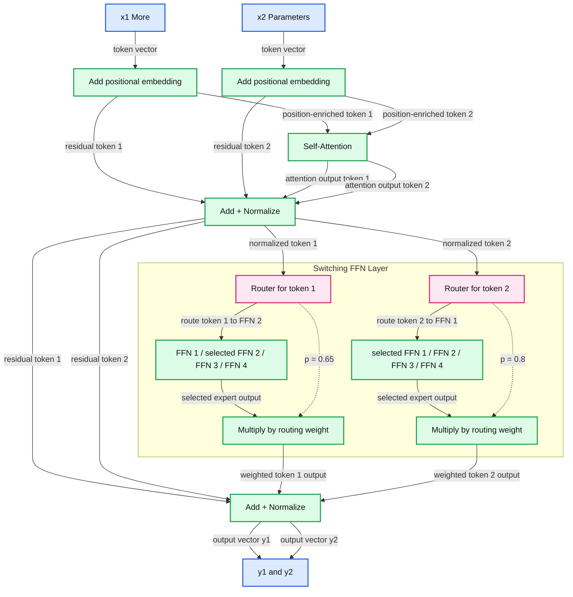

# Introducing Mixtral 8x7B with Databricks Model Serving

- Source: https://www.databricks.com/blog/introducing-mixtral-8x7b-databricks-model-serving
- Published: 2023-12-21
- Authors: Ahmed Bilal, Daya Khudia, Ankit Mathur, Asfandyar Qureshi, Bruce Fontaine, Linden Li, Maddie Dawson, Sandeep Krishnamurthy, Josh Hartman, Hagay Lupesko
- Categories: engineering, platform
- Images: 2 total, 1 extracted as architecture

Today, Databricks is excited to announce support for Mixtral 8x7B in [Model Serving](https://www.databricks.com/blog/build-genai-apps-faster-new-foundation-model-capabilities). Mixtral 8x7B is a sparse Mixture of Experts (MoE) open language model that outperforms or matches many state-of-the-art models. It has the ability to handle long context lengths of up to 32k tokens (approximately 50 pages of text), and its MoE architecture provides faster inference, making it ideal for Retrieval-Augmented Generation (RAG) and other enterprise use cases.

Databricks Model Serving now provides instant access to Mixtral 8x7B with on-demand pricing on a **production-grade, enterprise-ready platform**. We support thousands of queries per second and offer seamless [vector store](https://www.databricks.com/blog/introducing-databricks-vector-search-public-preview) integration, automated quality [monitoring](https://www.databricks.com/blog/lakehouse-monitoring-unified-solution-quality-data-and-ai), unified [governance](https://www.databricks.com/blog/simplifying-production-mlops-with-lakehouse-ai), and SLAs for uptime. This end-to-end integration provides you with a fast path for deploying GenAI Systems into production.

## What are Mixture of Experts Models?

Mixtral 8x7B uses a MoE architecture, which is considered a significant advancement over dense GPT-like architectures used by models such as Llama2. In GPT-like models, each block comprises an attention layer and a feed-forward layer. The feed-forward layer in the MoE model is composed of multiple parallel sub-layers, each known as an "expert", fronted by a "router" network that determines which experts to send the tokens to. Since not all parameters in a MoE model are active for a given token, MoE models are considered “sparse” architectures. The figure below shows it pictorially as shown in the practical paper on [switch transformers](https://arxiv.org/abs/2101.03961). It's widely accepted in the research community that each expert specializes in learning certain aspects or regions of the data [[Shazeer et al.](https://arxiv.org/pdf/1701.06538.pdf)]. 

*Source: Fedus, Zoph, and Shazeer, JMLR 2022*

**Summary:** A switching feed-forward transformer layer routes two tokens to different experts, weights their outputs by routing probabilities, and combines them with residual connections.

**Components:**

- x, y: input and output of the compact transformer block.
- Self-Attention: transformer attention computation.
- Add + Normalize: residual addition and normalization, shown twice in each view.
- Switching FFN Layer: router-selected feed-forward neural network experts.
- x₁, More; x₂, Parameters: two input token vectors.
- Positional embedding and ⊕: positional information added to each token vector.
- Router: per-token expert selection with a probability distribution.
- FFN 1, FFN 2, FFN 3, FFN 4: feed-forward experts shown for each token; FFN 2 is selected for x₁ and FFN 1 for x₂.
- ⊗: multiplication of each selected expert output by its routing probability.
- y₁, y₂: output token vectors.

**Flows:**

- x -> Self-Attention: input representation in the compact view.
- Self-Attention -> lower Add + Normalize: attention output.
- Lower Add + Normalize -> Switching FFN Layer: normalized representation in the compact view.
- Switching FFN Layer -> upper Add + Normalize: expert-layer output in the compact view.
- Upper Add + Normalize -> y: block output in the compact view.
- x₁ -> positional addition 1: token vector for More.
- x₂ -> positional addition 2: token vector for Parameters.
- Positional addition 1 -> Self-Attention: position-enriched first token.
- Positional addition 2 -> Self-Attention: position-enriched second token.
- Positional addition 1 -> lower Add + Normalize: first-token residual bypass.
- Positional addition 2 -> lower Add + Normalize: second-token residual bypass.
- Self-Attention -> lower Add + Normalize: attention outputs for both tokens.
- Lower Add + Normalize -> Router 1: normalized first-token representation.
- Lower Add + Normalize -> Router 2: normalized second-token representation.
- Lower Add + Normalize -> upper Add + Normalize: residual bypass for each token.
- Router 1 -> FFN 2: first token routed to its selected expert.
- Router 2 -> FFN 1: second token routed to its selected expert.
- FFN 2 -> multiplication 1: first-token expert output.
- FFN 1 -> multiplication 2: second-token expert output.
- Router 1 -> multiplication 1: routing weight p = 0.65 along the dashed path.
- Router 2 -> multiplication 2: routing weight p = 0.8 along the dashed path.
- Multiplication 1 -> upper Add + Normalize: weighted first-token expert output.
- Multiplication 2 -> upper Add + Normalize: weighted second-token expert output.
- Upper Add + Normalize -> y₁: first-token output vector.
- Upper Add + Normalize -> y₂: second-token output vector.

**Numbers:** p = 0.65; p = 0.8; expert identifiers 1, 2, 3, 4 in each of two expert groups; token subscripts 1 and 2 in x₁, x₂, y₁, y₂. Each input and output vector is drawn with six cells.

source image: https://www.databricks.com/sites/default/files/inline-images/image2_17.png

[Source](https://arxiv.org/pdf/2101.03961.pdf): Fedus, Zoph, and Shazeer, JMLR 2022

The main advantage of MoE architecture is that it allows scaling of the model size without the proportional increase in inference-time computation required for dense models. In MoE models, each input token is processed by only a select subset of the available experts (e.g., two experts for each token in Mixtral 8x7B), thus minimizing the amount of computation done for each token during training and inference. Also, the MoE model treats only the feed-forward layer as an expert while sharing the rest of the parameters, making 'Mistral 8x7B' a 47 billion parameter model, not the 56 billion implied by its name. However, each token only computes with about 13B parameters, also known as live parameters. An equivalent 47B dense model will require 94B (2*#params) FLOPs in the forward pass, while the Mixtral model only requires 26B (2 * #live_params) operations in the forward pass. This means Mixtral's inference can run as fast as a 13B model, yet with the quality of 47B and larger dense models.

While MoE models generally perform fewer computations per token, the nuances of their inference performance are more complex. The efficiency gains of MoE models compared to equivalently sized dense models vary depending on the size of the data batches being processed. For example, when Mixtral inference is compute-bound at large batch sizes we expect a ~3.6x speedup relative to a dense model. In contrast, in the bandwidth-bound region at small batch sizes, the speedup will be less than this maximum ratio. [Our previous blog](https://www.databricks.com/blog/llm-inference-performance-engineering-best-practices) post delves into these concepts in detail, explaining how smaller batch sizes tend to be bandwidth-bound, while larger ones are compute-bound.

## Simple and Production-Grade API for Mixtral 8x7B

### Instantly access Mixtral 8x7B with Foundation Model APIs

Databricks Model Serving now offers instant access to Mixtral 8x7B via Foundation Model APIs. Foundation Model APIs can be used on a pay-per-token basis, drastically reducing cost and increasing flexibility. Because Foundation Model APIs are served from within Databricks infrastructure, your data does not need to transit to third party services.

Foundation Model APIs also feature Provisioned Throughput for Mixtral 8x7B models to provide consistent performance guarantees and support for fine-tuned models and high QPS traffic.

### Easily compare and govern Mixtral 8x7B alongside other models

You can access Mixtral 8x7B with the same unified API and SDK that works with other Foundation Models. This unified interface makes it possible to experiment, customize, and productionize foundation models across all clouds and providers. 

You can also invoke model inference directly from SQL using the `ai_query` SQL function. To learn more, check out the ai_query [documentation](https://docs.databricks.com/en/sql/language-manual/functions/ai_query.html).

Because all your models, whether hosted within or outside Databricks, are in one place, you can centrally manage permissions, track usage limits, and monitor the quality of all types of models. This makes it easy to benefit from new model releases without incurring additional setup costs or overburdening yourself with continuous updates while ensuring appropriate guardrails are available.

>  “Databricks’ Foundation Model APIs allow us to query state-of-the-art open models with the push of a button, letting us focus on our customers rather than on wrangling compute. We’ve been using multiple models on the platform and have been impressed with the stability and reliability we’ve seen so far, as well as the support we’ve received any time we’ve had an issue.” - Sidd Seethepalli, CTO & Founder, Vellum

 

### Stay at the cutting edge with Databricks' commitment to delivering the latest models with optimized performance

Databricks is dedicated to ensuring that you have access to the best and latest open models with optimized inference. This approach provides the flexibility to select the most suitable model for each task, ensuring you stay at the forefront of emerging developments in the ever-expanding spectrum of available models. We are actively working to further improve optimization to ensure you continue to enjoy the lowest latency and reduced Total Cost of Ownership (TCO). Stay tuned for more updates on these advancements, coming early next year.

>  "Databricks Model Serving is accelerating our AI-driven projects by making it easy to securely access and manage multiple SaaS and open models, including those hosted on or outside Databricks. Its centralized approach simplifies security and cost management, allowing our data teams to focus more on innovation and less on administrative overhead." - Greg Rokita, AVP, Technology at Edmunds.com

## Getting started with Mixtral 8x7B on Databricks Model Serving

Visit the Databricks AI Playground to quickly try generative AI models directly from your workspace. For more information:

- Explore the [Foundation Model API](https://docs.databricks.com/en/machine-learning/foundation-models/index.html) Documentation.
- Discover foundation models in the [Databricks Marketplace](https://marketplace.databricks.com/?asset=Model&provider=Databricks&sortBy=date)
- Go to the [Databricks Model Serving webpage](https://www.databricks.com/product/model-serving)

**License**
 Mixtral 8x7B is licensed under [Apache-2.0](https://mistral.ai/news/mixtral-of-experts)
