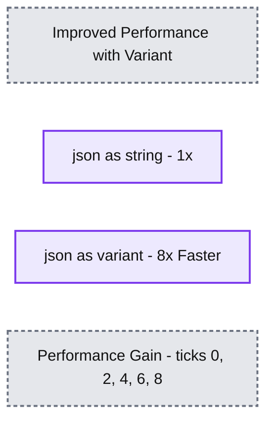

# Introducing the Open Variant Data Type in Delta Lake and Apache Spark

*Faster processing and more flexibility when working with semi-structured data*

- Source: https://www.databricks.com/blog/introducing-open-variant-data-type-delta-lake-and-apache-spark
- Published: 2024-06-03
- Authors: Kent Marten, Gene Pang, Chenhao Li, Han Xiao
- Categories: engineering, data-engineering
- Images: 1 total, 1 extracted as architecture

We are excited to announce a new data type called variant for semi-structured data. Variant provides an order of magnitude performance improvements compared with storing these data as JSON strings, while maintaining the flexibility for supporting highly nested and evolving schema.

Working with semi-structured data has long been a foundational capability of the Lakehouse. Endpoint Detection & Response (EDR), Ad-click analysis, and IoT telemetry are just some of the popular use cases that rely on semi-structured data. As we migrate more and more customers from proprietary data warehouses, we have heard that they rely on the variant data type those proprietary warehouses offer, and would love to see an open source standard for that to avoid any lock-in.

The open variant type is the result of our collaboration with both the Apache Spark open-source community and the Linux Foundation Delta Lake community:

- The Variant data type, Variant binary expressions, and the Variant binary encoding format are already merged in open source Spark. Details about the binary encoding can be reviewed [here](https://github.com/apache/spark/blob/master/common/variant/README.md).
- The binary encoding format allows for faster access and navigation of the data when compared to Strings. The implementation of the Variant binary encoding format is packaged in an [open-source library](https://github.com/apache/spark/tree/master/common/variant), so that it can be used in other projects.
- Support for the Variant data type is also open-sourced to Delta, and the [protocol RFC can be found here](https://github.com/delta-io/delta/issues/2864). Variant support will be included in Spark 4.0 and Delta 4.0.

>    “We are a supporter of the open source community with a focus on data through our open sourced data platform [Legend](https://github.com/finos/legend),” said Neema Raphael, Chief Data Officer and Head of Data Engineering at Goldman Sachs. “The launch of Open Source Variant in Spark is another great step forward for an open data ecosystem.”

And starting DBR 15.3, all of the aforementioned capabilities will be available for our customers to use.

### **What is Variant?**

Variant is a new data type for storing semi-structured data. In the Public Preview of the upcoming Databricks Runtime 15.3 release, ingress and egress of hierarchical data through JSON will be supported. Without Variant, customers had to choose between flexibility and performance. To maintain flexibility, customers would store JSON in single columns as strings. To see better performance, customers would apply strict schematizing approaches with structs, which requires separate processes to maintain and update with schema changes. With Variant, customers can retain flexibility (there's no need to define an explicit schema) and receive vastly improved performance compared to querying the JSON as a string.

Variant is particularly useful when the JSON sources have unknown, changing, and frequently evolving schema. For example, customers have shared Endpoint Detection & Response (EDR) use cases, with the need to read and combine logs containing different JSON schemas. Similarly, for uses involving ad-click and application telemetry, where the schema is unknown and changing all the time, Variant is well-suited. In both cases, the Variant data type's flexibility allows the data to be ingested and performant without requiring an explicit schema.

### **Performance Benchmarks**

Variant will provide improved performance over existing workloads that maintain JSON as a string. We ran multiple benchmarks with schemas inspired by customer data to compare String vs Variant performance. For both nested and flat schemas, performance with Variant improved 8x over String columns. The benchmarks were conducted with Databricks Runtime 15.0 with Photon enabled.

**Summary:** JSON stored as Variant shows an 8x performance gain compared with the 1x baseline for JSON stored as a string.

**Components:**
- Improved Performance with Variant: benchmark title.
- json as string: blue bar representing JSON stored as a string.
- json as variant: red bar representing JSON stored as Variant.
- Performance Gain: vertical axis measuring relative performance.

**Flows:**
- none

**Numbers:**
- String: 1x.
- Variant: 8x Faster.
- Performance Gain axis ticks: 0, 2, 4, 6, 8.

source image: https://www.databricks.com/sites/default/files/inline-images/db-998-blog-img-1.png

### **How can I use Variant?**

There are a number of new functions for supporting Variant types, that allow you to inspect the schema of a variant, explode a variant column, and convert it to JSON. The PARSE_JSON() function will be commonly used for returning a variant value that represents the JSON string input.

To load Variant data, you can create a table column with the Variant type. You can convert any JSON-formatted string to Variant with the PARSE_JSON() function, and insert into a Variant column.

You can use CTAS to create a table with Variant columns. The schema of the table being created is derived from the query result. Therefore, the query result must have Variant columns in the output schema in order to create a table with Variant columns.

You can also use [COPY INTO](https://docs.databricks.com/en/sql/language-manual/delta-copy-into.html) to copy JSON data into a table with one or more Variant columns.

Path navigation follows intuitive dot-notation syntax.

### **Fully open-sourced, no proprietary data lock-in**

Let's recap:

1. The Variant data type, binary expressions, and binary encoding format are already merged in Apache Spark. The binary encoding format can be reviewed in detail [here](https://github.com/apache/spark/blob/master/common/variant/README.md).
2. The binary encoding format is what allows for faster access and navigation of the data when compared to Strings. The implementation of the binary encoding format is packaged in an [open-source library](https://github.com/apache/spark/tree/master/common/variant), so that it can be used in other projects.
3. Support for the Variant data type is also open-sourced to Delta, and the [protocol RFC can be found here](https://www.databricks.com/blog/introducing-open-variant-data-type-delta-lake-and-apache-spark). Variant support will be included in Spark 4.0 and Delta 4.0.

Further, we have plans for implementing shredding/sub-columnarization for the Variant type. Shredding is a technique to improve the performance of querying particular paths within the Variant data. With shredding, paths can be stored in their own column, and that can reduce the IO and computation required to query that path. Shredding also enables pruning of data to avoid additional unnecessary work. Shredding will also be available in Apache Spark and Delta Lake.

Are you attending this year's DATA + AI Summit June 10-13th in San Francisco?
 Please attend "[Variant Data Type - Making Semi-Structured Data Fast and Simple](https://www.databricks.com/dataaisummit/session/variant-data-type-making-semi-structured-data-fast-and-simple)".

Variant will be enabled by default in Databricks Runtime 15.3 in Public Preview and DBSQL Preview channel soon after. Test out your semi-structured data use cases and start a conversation on the [Databricks Community forums](https://community.databricks.com/t5/data-engineering/bd-p/data-engineering) if you have thoughts or questions. We would love to hear what the community thinks!
