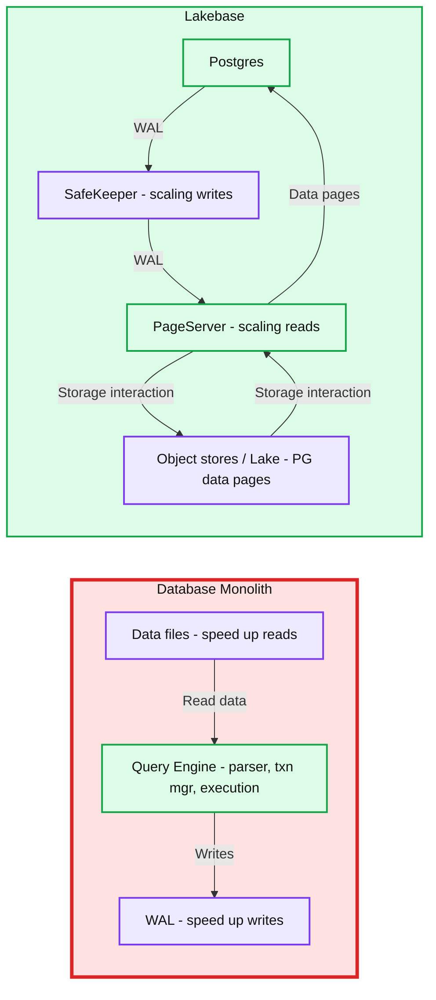
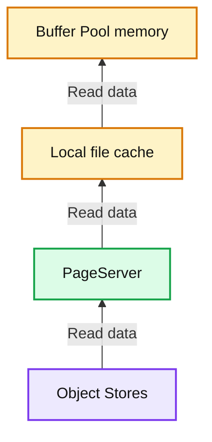
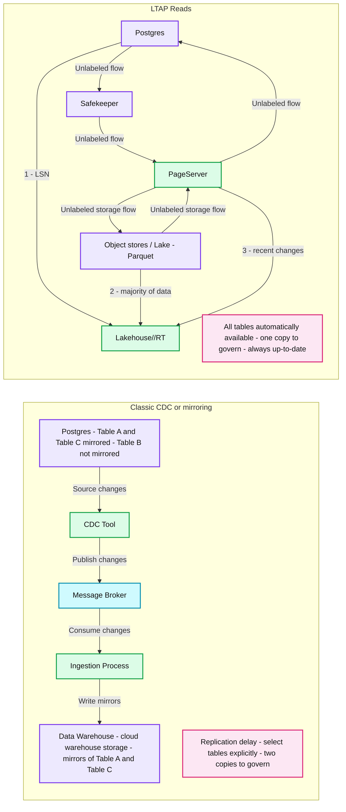

# From monolith to Lakebase to LTAP: rethinking the database from storage up

- Source: https://www.databricks.com/blog/lakebase-ltap-rethinking-database-storage
- Published: 2026-06-30
- Authors: Reynold Xin
- Categories: engineering
- Images: 3 total, 3 extracted as architecture

**Key takeaways**

- Almost every traditional database keeps its write-ahead log and data files on one machine's disk, which is the root cause of data loss risk, expensive read replicas and high-availability clones, and analytics queries that drag down transactions.
- Lakebase makes Postgres compute stateless by externalizing the log and data files into independent cloud services (SafeKeeper and PageServer), unlocking unlimited storage, elastic compute, durable writes, simpler HA, and instant branching, all with no meaningful added latency.
- LTAP goes further by storing operational data once in open columnar formats that both Postgres and Lakehouse engines read, so analytics runs on the same fresh data transactions just wrote, with no CDC pipeline, no second copy, and no slowdown to the transactional workload. Unlike HTAP, which tries to unify both workloads in one engine, LTAP unifies at the storage layer and keeps the best engine for each job.

When I started my PhD at UC Berkeley 16 years ago, my advisor told me: "OLTP databases are a solved problem. They work. Focus on analytics." We were at the early innings of being able to collect far more data, structured and unstructured, and apply machine learning (which we now call “AI”). So I took the advice and joined my cofounders on the research project that became Apache Spark, and later on we started Databricks.

As we built Databricks, we started using various databases out there, and we realized OLTP databases were far from a solved problem: they were clunky, difficult to scale, and incredibly fragile. We were frustrated enough at some point that we asked ourselves what an OLTP database would look like if we were to design it today. That question led to [Lakebase](https://www.databricks.com/blog/what-is-a-lakebase), our serverless Postgres database.

This post takes a deep dive into the Lakebase OLTP architecture. We start at the storage layer of a traditional monolithic database to see where the pain comes from, then we look at how Lakebase rearranges those same pieces into independent, externalized services. Finally, we turn to [LTAP](https://www.databricks.com/company/newsroom/press-releases/databricks-launches-ltap-first-lake-transactionalanalytical), where that same architecture lets transactions and analytics run on a single copy of the data, in real time, without the delays and extra cost of CDC or "mirroring.”

## **The database as a monolith**

The vast majority of databases running in the world today are monoliths. This includes MySQL, Postgres, classic Oracle. Lakebase is built on Postgres (as it happens, was also [born at Berkeley](https://www.postgresql.org/docs/current/history.html)), so we will be using Postgres as the primary example here, but most databases work similarly: You provision one machine that runs the database engine and the storage. In these database systems, there are two things on disk that matter the most: the *write ahead log (WAL)* and the *data files*.

**Summary:** A database monolith colocates its query engine, WAL, and data files, while Lakebase separates Postgres compute, write handling, read handling, and object storage.

**Components:**
- Database Monolith: single-machine database containing the query engine, WAL, and data files.
- Query Engine: parser, transaction manager, and execution; technology unspecified.
- WAL: write-ahead log used to speed up writes.
- Data files: database files used to speed up reads.
- Lakebase: architecture containing Postgres, SafeKeeper, PageServer, and object storage.
- Postgres: PostgreSQL database engine.
- SafeKeeper: WAL handling component for scaling writes.
- PageServer: data-page handling component for scaling reads.
- Object stores / Lake: cloud object storage containing PostgreSQL data pages.
- Monolith annotations: WAL and data files reside on a single machine; scaling and availability require physical clones; misconfiguration or node loss can cause data loss.
- Lakebase annotations: data lives in cloud object storage; highly scalable, elastic compute; durable writes and zero data loss.

**Flows:**
- Query Engine -> WAL: writes to the write-ahead log; arrow unlabeled.
- Data files -> Query Engine: data for reads; arrow unlabeled.
- Postgres -> SafeKeeper: WAL.
- SafeKeeper -> PageServer: WAL.
- PageServer -> Postgres: data pages.
- PageServer -> Object stores / Lake: storage interaction; arrow unlabeled.
- Object stores / Lake -> PageServer: storage interaction; arrow unlabeled.

**Numbers:** zero data loss; no other numbers, units, percentages, or sizes.

source image: https://www.databricks.com/sites/default/files/inline-images/monolithv2.png

When you commit a transaction, the database does not immediately go and rewrite the data files. That would be slow, because the rows you are touching are scattered across the file in places that require random I/O. Instead, the database first appends a description of the change to the WAL, which is a sequential log on disk. A transaction is considered committed the moment that log entry is durably written. Only later, asynchronously, does the database go back and update the actual data files to reflect the change.

**One simple way to think about this: the WAL exists to make *****writes***** fast (and safe), and the data files exist to make *****reads***** fast.** The log lets you commit a transaction with a single sequential append instead of a scattering of random I/O. The data files let you answer a query by reading the current state directly, instead of replaying the entire history of the database from the beginning of time. (If you want to understand all the intricate details of this design, read the 69-page long [ARIES paper](https://web.stanford.edu/class/cs345d-01/rl/aries.pdf). Be warned that this is one of the most complex papers in computer science.)

As this design has become the foundation for virtually all databases out there, the monolithic architecture also creates a lot of challenges:

**Data loss from misconfiguration.** A commit is only as durable as the disk flush behind it. If the database, the operating system, or the storage layer is configured such that a write to the WAL is acknowledged to the client before it has actually been flushed to durable media, then a commit can vanish in a power loss or kernel panic. These settings are subtle, easy to get wrong, and the failure is often silent. The operating system might even decide to [lie to you about flushing](https://www.postgresql.org/message-id/flat/CAMsr%2BYHh%2B5Oq4xziwwoEfhoTZgr07vdGG%2Bhu%3D1adXx59aTeaoQ%40mail.gmail.com)!

**Data loss from node loss.** Even with flushes configured correctly, the WAL and the data files live on one machine. If that machine's disk dies, the data on it dies too. Note that network attached storage or redundancy techniques like RAID-1/RAID-10 can improve durability but do not fundamentally solve this issue. If the storage mount dies, so does your data access.

**Scaling reads requires a physical clone.** When one box can no longer serve your traffic, the standard answer is to add a read replica. But a read replica is a full physical copy of the entire database, streaming the WAL from the primary and replaying it. Provisioning one means copying the whole dataset and then catching up on the log. For a large database, that is not a quick operation and might even bring down the database.

**High availability also requires a physical clone.** Surviving the loss of the primary means running at least one additional standby node, which is itself a complete physical copy of the database kept in sync from the WAL. You pay for at least twice the infrastructure, you wait a long time to bring a standby online, and you have to set up synchronous replication to avoid losing any data when the primary goes down. (In practice, many [recommend](https://www.postgresql.org/docs/current/warm-standby.html#SYNCHRONOUS-REPLICATION-HA) 3 or more nodes.)

**Analytics contend with your transactional traffic.** A heavy analytical query runs against the same hardware resources as your latency-sensitive transactional workload. One large reporting query or one GDPR cleanup can degrade your main OLTP queries. You can run the analytical queries in a separate replica, but you end up paying for the replica and still don’t get optimal performance due to the row oriented nature of OLTP storage (analytics requires column-oriented storage for high performance).

Almost every one of these problems traces back to the same root cause from the monolithic architecture: the WAL and the data files are stored inside a single machine. Durability is tied to that machine's disk. Scaling and availability require physically cloning that machine. Workloads interfere because they share that machine.

## **Lakebase architecture**

If you were to redesign an OLTP database today, you’d start with the components of the modern cloud: cheap and highly durable cloud object storage paired with elastic compute. This is the path the Neon team took on and the foundation of what became Lakebase.

The core move is to make the Postgres compute instances *stateless*. We do this by externalizing the WAL and the data files on local disks into purpose-built, independently scalable services. The compute layer becomes a stateless Postgres engine that can be started, stopped, and replicated freely, because it no longer owns the data. 

Let’s see how these two storage services can work together to solve the aforementioned challenges without sacrificing performance.

## **Scaling writes: WAL becomes SafeKeeper**

In a monolith, a write is made durable by flushing it to the local disk. In a Lakebase, the WAL is externalized to a distributed storage service called the *SafeKeeper*. Instead of relying on disk flush for durability, a commit is made durable by replicating the log record across a quorum of SafeKeeper nodes using Paxos-based network replication. There is no longer a disk whose failure loses your data, and there is no longer a misconfigured flush quietly undermining your durability guarantee.

It’s natural to ask at this point: does moving commits from WAL on local disk to WAL on SafeKeeper increase the write latency due to the extra network hop? The answer is no. For any serious Postgres deployment that cares about durability and availability, you’d have to set up synchronous replication which requires the extra network hop, so externalizing the WAL into SafeKeeper does not incur additional overhead. As a matter of fact, due to how Postgres works internally, the combination of SafeKeeper and PageServer can lead to [5X higher write throughput and 2X lower read latency](https://www.databricks.com/blog/how-lakebase-architecture-delivers-5x-faster-postgres-writes).

## **Scaling reads: data files become PageServer**

The data files move to another distributed storage service called the *PageServer*. The WAL is streamed from the SafeKeeper into the PageServer, and the PageServer asynchronously applies those changes to its version of the data, materializing pages into low-cost cloud object storage (the lake). You can think of the PageServer as a write through cache for the underlying object storage.

This is similar to the WAL-then-data-files relationship from the monolith, except the two halves now live in separate, independently scalable services connected by the network instead of sitting on the same disk. When a page is requested from the PageServer, and if the PageServer does not yet have the latest version yet (keep in mind changes are written to the SafeKeeper first before making their way to the PageServer), the PageServer applies the logs from the SafeKeeper to reconstruct the latest state.

A similar question: does moving data files from local disks to PageServer increase the read latency due to the extra network hop? The answer is also no for all practical purposes. The system is designed to isolate and minimize the latency impact through aggressive, multi-layered caching. To fetch a page, Postgres first looks up its buffer pool, which is in the node’s local memory. When the page is not present, it looks up a local disk cache. It only needs to go to the PageServer if there is a cache miss. Because a compute node can be configured with local memory and disk capacities identical to a monolithic setup, your local cache hit rate remains unchanged. For the vast majority of operations, read latency is indistinguishable from a monolith, but you gain the benefit of decoupled, virtually infinite storage.

**Summary:** The Lakebase read cache hierarchy moves data upward from Object Stores through PageServer and the local file cache to the memory buffer pool.

**Components:**
- Buffer Pool: in-memory cache.
- Local file cache: file-based cache.
- PageServer: page-serving component; technology unspecified.
- Object Stores: object storage; technology unspecified.

**Flows:**
- Object Stores -> PageServer: data read upward.
- PageServer -> Local file cache: data read upward.
- Local file cache -> Buffer Pool: data read into memory.

**Numbers:** none

source image: https://www.databricks.com/sites/default/files/inline-images/hierarchy_0.png

## **What this unlocks**

Once the WAL lives in the SafeKeeper and the data files live in the PageServer, a long list of capabilities that were hard or impossible in the monolith become natural consequences of the architecture. The following are already widely available as part of the Lakebase product on both Databricks and Neon:

**Still Postgres. **This is real Postgres, so the wire protocol, SQL, drivers, and extensions all work as-is. 

**Unlimited storage.** Data lives in cloud object storage rather than on a provisioned local disk. You are no longer sizing a box to a capacity ceiling. Storage is, for practical purposes, infinite.

**Serverless, elastic compute.** Because compute is stateless, it can scale up instantly under load and scale all the way down to zero when idle. You stop paying for a large machine to sit there waiting for traffic.

**Durable writes and zero data loss.** A commit is durable once it is replicated across SafeKeeper nodes via Paxos, not when a single local disk claims to have flushed it. The loss of any individual node does not lose committed data.

**Simpler high availability.** In the monolith, HA meant maintaining a second full physical clone, paying twice, and still risking data loss at cutover. Here, the durable state already lives in a replicated storage layer that is independent of any single compute instance. Failing over no longer means promoting a separate physical copy of the database and hoping the last segment of the log made it across.

**Instant branching, cloning, and recovery.** This is my favorite. For code, creating a branch is a sub-second, fully isolated copy of the entire codebase, and we do it dozens of times a day without thinking about it. For a monolithic database, cloning means physically copying the whole dataset, which is slow, expensive, and risky to the production system. When the data lives in an externalized, versioned storage layer, a branch or a clone is a metadata operation rather than a physical copy. You can branch a large production database in seconds, run an experiment or a risky migration against the branch, and throw it away. Recovery to a point in time works the same way. The database finally moves as fast as your code.

Separating compute from storage is not itself new. The [previous post](https://www.databricks.com/blog/what-is-a-lakebase) discussed the generation 2 cloud databases that had done this. However, the key with Lakebase is that we store operational data on commodity object storage in an open format. With this, we open up the opportunities for other engines to read it directly, which leads to LTAP.

## **LTAP: one copy for transactions and analytics**

Everything so far has been about making a single operational database better: more durable, more elastic, cheaper to run, faster to branch. But once the data lives in an externalized storage layer, something more interesting becomes possible. We can stop treating the transactional database and the analytical system as two separate worlds.

Go back to the PageServer for a moment. It already takes the stream of changes from the WAL and asynchronously materializes pages into object storage. That materialization step, the moment data lands in the lake, turns out to be exactly the right place to solve a much older problem…

Even with a Lakebase, the data in object storage was still written in Postgres's native page format, laid out row by row. That format is great for transactions and poor for analytics, so any analytical engine that wanted to read it had to either pay a conversion cost on every read or, more commonly, rely on a separate copy of the data kept in sync by a pipeline. The pipeline can be brittle, and the two copies of the data can become a governance nightmare with diverged permissions.

We recently announced [LTAP](https://www.databricks.com/company/newsroom/press-releases/databricks-launches-ltap-first-lake-transactionalanalytical), for Lake Transactional/Analytical Processing, that removes the two-copies-of-data problem. The key idea is to unify the two worlds at the *storage* layer rather than at the *engine* layer. We do not try to build one engine that is somehow great at both transactions and analytics. We keep the best tool for each job: Postgres, with full ACID semantics for transactions, and the Lakehouse engines for analytics. What changes is the data underneath them. Instead of two copies in two formats, there is one durable copy, open columnar formats like Delta and Iceberg, stored as Parquet, that both sides read (and with various levels of caches for better performance).

## **Materializing in columnar form**

Note: this section requires more Postgres internal knowledge to understand than other sections.

As the PageServer materializes pages into object storage, it transcodes Postgres data from a row format into Parquet's columnar layout as it lands in the lake. We preserve the exact Postgres representation of every value, down to the bits, so any Postgres-compatible engine can reinterpret it without losing information. This is different from CDC based approach as CDC ships a stream of logical change events into a foreign schema and leaves Postgres's physical and transactional semantics behind; here we keep them. With a hyperoptimized engine, the spare CPU in the PageServer layer does the row-to-columnar transcoding as part of materializing the data into object storage, so it adds no burden to the Postgres compute serving your transactions.  To serve transactional reads efficiently, the PageServer still materializes traditional row-based pages in a local cache, but this is strictly a performance cache. The underlying durable store remains unified in the lake, accessible by both sides.

Preserving Postgres semantics in columnar form comes down to two things: the type system and multi-versioning.

**Type system.** The majority of Postgres types map directly onto native Parquet types. The handful of values with no lossless columnar counterpart, e.g. NaN and ±Infinity, NUMERICs beyond the decimal range, exotic or extension types, are not dropped or coerced. They are carried alongside the original columns in a structured overflow field within the same table, holding the canonical Postgres text for those values. That field is both directly queryable by any engine and sufficient to reconstruct the original Postgres bytes exactly on the way back.

**Multi-versioning.** In Postgres, every row version that some transaction could observe is retained, which is exactly what makes snapshot isolation and point-in-time recovery possible. In contrast, open table formats expose table-wide consistent snapshots without any intermediate row versions. We get the benefits of both approaches by separating durability from visibility. Every row materialized to columnar carries its physical heap address (block and offset), so heap pages remain fully reconstructable. The classic Postgres heap page becomes a cache that accelerates point reads, while the durable source of truth lives in the columnar files in object storage. Postgres indexes aren't transcoded into columns; they are served and rebuilt from that hot cache tier. Intermediate row versions are retained to preserve Postgres's MVCC semantics and PITR, but they are not visible to Iceberg/Delta readers and are eventually garbage-collected. The net result: analytical engines see clean, snapshot-consistent tables, while the Postgres system underneath still sees a full, time-travelable version history.

There is also a pleasant side effect. Columnar data compresses far better than row data, often by more than ten times, so converting to columnar storage substantially cuts the volume of data crossing the network between the caching layer and the object store to the point that it’s often negligible. The format that makes analytics fast also makes the storage path cheaper. We even take advantage of this to dual write both row format and columnar format in object stores for data verification during the transitional rollout stage of LTAP (since we want to be extremely careful with storage changes).

## **Reading the latest data without affecting Postgres**

One big challenge is freshness. If analytics reads from a copy in the lake, how does it see data that was committed a moment ago and has not been materialized in the object store yet? This is the question that sinks most "just point analytics at the lake" designs, so it is worth walking through how LTAP answers it.

When an analytical query starts (e.g. from the [Lakehouse//RT](https://www.databricks.com/blog/introducing-lakehousert-real-time-performance-unified-lakehouse) product we just announced), it first asks Postgres for the current LSN, the log sequence number that marks the exact position in the WAL to read as of. This is a cheap metadata lookup. With that LSN, the analytical engine reads the overwhelming majority of the data, including everything already materialized up to that point, directly from object storage. The only thing left is the small set of very recent changes that have not yet been materialized to the lake, and those it fetches from the PageServer and merges on top.

**Summary:** Classic CDC replicates selected Postgres tables into warehouse storage with delays and multiple copies, while LTAP reads combine an LSN from Postgres, lake data, and recent PageServer changes.

**Components:**

- Classic Postgres: source database containing Table A, Table B, and Table C; Table B is not mirrored.
- CDC Tool: publishes database changes; technology unspecified.
- Message Broker: buffers published changes; technology unspecified.
- Ingestion Process: consumes changes and writes warehouse data; technology unspecified.
- Data Warehouse: contains warehouse storage; technology unspecified.
- Warehouse Storage: cloud storage holding mirrors of Table A and Table C; multiple copies exist.
- Clock: indicates replication delay.
- LTAP Postgres: transactional database providing an LSN.
- Safekeeper: component between Postgres and PageServer; technology unspecified.
- PageServer: exchanges data with object storage and supplies recent changes.
- Object stores / Lake: durable storage using Parquet.
- Lakehouse//RT: analytical reader; implementation unspecified.
- CDC trade-offs: explicitly select tables to replicate, two copies of data to govern, and replication delays.
- LTAP benefits: all tables available automatically, one copy of data to govern, and always up-to-date reads.

**Flows:**

- Classic Postgres -> CDC Tool: source changes.
- CDC Tool -> Message Broker: published changes.
- Message Broker -> Ingestion Process: changes consumed for ingestion.
- Ingestion Process -> Warehouse Storage: writes mirrored table data.
- LTAP Postgres -> Lakehouse//RT: LSN, step 1.
- LTAP Postgres -> Safekeeper: unlabeled flow.
- Safekeeper -> PageServer: unlabeled flow.
- PageServer -> LTAP Postgres: unlabeled flow.
- PageServer -> Object stores / Lake: unlabeled storage flow.
- Object stores / Lake -> PageServer: unlabeled storage flow.
- Object stores / Lake -> Lakehouse//RT: majority of data, step 2.
- PageServer -> Lakehouse//RT: recent changes, step 3.

**Numbers:** Step labels (1), (2), and (3); “Two copies of data to govern”; “One copy of data to govern.” No units, percentages, or sizes are shown.

source image: https://www.databricks.com/sites/default/files/inline-images/cdc_vs_ltap_v3.png

The result is a consistent, fully up-to-date read of your data as of that LSN. Almost all of the work lands on cheap, scalable object storage. And critically, Postgres itself serves none of the analytical read traffic other than returning a single number (LSN). Your transactional workload does not slow down because someone kicked off a large analytical query.

There is one practical optimization worth mentioning here: For very small tables, the ones holding a handful of rows, we do not bother converting them to columnar form and creating the associated Iceberg metadata. The bookkeeping would cost more than it saves, and a table that tiny has no measurable effect on analytical performance regardless of how it is laid out. Those tables are still present and still queryable as part of the single copy.

## **Every table, automatically**

Because of how important this problem is, there has been lots of noise in the market about integrating OLTP and analytics. A classic approach is CDC, effectively replicating data from the OLTP storage into a separate analytics storage tier. You might’ve heard of its other names such as “mirroring” or “zero CDC” or “zero ETL”.

In CDC or “mirroring”, because the data replication pipeline costs something, it cannot be applied to all the tables. You’d have to explicitly select which tables you care about, and this replication typically comes with a delay.

LTAP has nothing to opt into. A table that exists is, by construction, already in the lake and already queryable. There is no list of replicated or mirrored tables, because there is no replication. There is a single governed copy of the data in open formats, with no ETL pipeline to build, monitor, or unbreak (either by our customers or us). The transactional and analytical engines scale independently, each sized to its own workload. And because there is no data movement and no second copy, the two views can never drift: analytics is always reading the same data the application just wrote.

For another look at how LTAP comes together, check out this [demo](https://www.youtube.com/watch?v=19nQxHcWDg0) from Data and AI Summit.

## **What about HTAP?**

If you know the field, you have already noticed that LTAP is a deliberate play on HTAP: hybrid transactional/analytical processing. HTAP has been the holy grail of database engineering, focusing on creating a single engine that's capable of doing both transactional and analytical workloads.

In practice, there has not been a single widely adopted HTAP database system out there. Why is that the case? In my opinion, HTAP systems suffer from one or more of the following:

**Incomplete feature set.** Designing a new proprietary engine from scratch to do a single job is a multi-year investment. Trying to build a single engine that can do the job of multiple engines compounds the investment required to reach the feature set engineers take for granted in a mature database. These systems often lag on things people assume are always there, from the breadth of SQL support (e.g. foreign key support) to the maturity of the query optimizer.

**No ecosystem.** Postgres and Spark each sit at the center of a vast ecosystem: drivers, extensions, tools, and decades of accumulated operational knowledge. A brand-new engine starts outside all of it, and an engine is only as useful as the ecosystem a team can actually build on.

**No performance isolation.** Many HTAP systems run transactions and analytics on the same hardware, so the two workloads contend for the same CPU and memory. This is the same failure we started with in the monolith, with an analytical query starving the transactional workload.

All three trace back to the same decision to unify the two workloads into one engine. Lakebase and LTAP circumvents these challenges by unifying at the storage layer, while using different compute engines for the different workloads, tapping into their full feature sets and ecosystem support, with full performance isolation.

## **Closing thought**

When we first put forward the Lakebase architecture last year, we already knew that it would unlock unlimited storage, elastic compute, durable writes, simpler HA, and instant branching, based on what we’ve seen with the Neon platform. Those followed almost mechanically once the WAL lived in the SafeKeeper and the data files lived in the PageServer.

The LTAP idea came later, after the Neon and Databricks teams came together to solve the decades-old problem of running analytics against the freshest transactional data. As we iron out the kinks of LTAP and roll it out in the coming months, all of your Lakebase tables will just be available for analytics as high performance as the Lakehouse data.

What excites me most is what’s ahead. While LTAP is a natural next step, the same design also opens up lots of optimization opportunities to separate other heavyweight maintenance operations and the core transactional workloads. We are just beginning to explore what this architecture makes possible, and we are looking forward to sharing what comes next.

*Acknowledgement: I’d like to thank the Lakebase team for making everything we discussed in this blog real, reviewing this blog, and keeping me honest with the technical details.*
