# Latency goes subsecond in Apache Spark Structured Streaming

*Improving Offset Management in Project Lightspeed*

- Source: https://www.databricks.com/blog/latency-goes-subsecond-apache-spark-structured-streaming
- Published: 2023-05-15
- Authors: Jerry Peng, Pranav Anand, Sourav Gulati, Karthik Ramasamy, Michael Armbrust, Matei Zaharia
- Categories: engineering, data-streaming
- Images: 12 total, 12 extracted as architecture

[Apache Spark Structured Streaming](https://docs.databricks.com/spark/latest/structured-streaming/index.html?_gl=1*1p9vzsd*_gcl_aw*R0NMLjE2NjczMzM5NjkuQ2p3S0NBandoNE9iQmhBekVpd0FIelpZVTNGWTlzd2RReUNoZ25QWXZ5X08yT0FWYWYzVGJOT0g5ak5taEVUTzZQb1RhOFJUZElReXRob0M3MThRQXZEX0J3RQ..&_ga=2.143656764.826070390.1668368355-999652633.1660583126&_gac=1.229854702.1667333969.CjwKCAjwh4ObBhAzEiwAHzZYU3FY9swdQyChgnPYvy_O2OAVaf3TbNOH9jNmhETO6PoTa8RTdIQythoC718QAvD_BwE) is the leading open source stream processing platform. It is also the core technology that powers [streaming on the Databricks Lakehouse Platform](https://www.databricks.com/product/data-streaming) and provides a unified API for batch and stream processing. As the adoption of streaming is growing rapidly, diverse applications want to take advantage of it for real time decision making. Some of these applications, especially those operational in nature, demand lower latency. While Spark's design enables high throughput and ease-of-use at a lower cost, it has not been optimized for sub-second latency.

In this blog, we will focus on the improvements we have made around offset management to lower the inherent processing latency of Structured Streaming. These improvements primarily target operational use cases such as real time monitoring and alerting that are simple and stateless.

Extensive evaluation of these enhancements indicates that the latency has improved by 68-75% - or as much as **3X** - **from 700-900 ms to 150-250 ms** for throughputs of **100K events/sec**, **500K events/sec** and **1M events/sec**. Structured Streaming can now achieve latencies lower than 250 ms, satisfying SLA requirements for a large percentage of operational workloads.

*This article assumes that the reader has a basic understanding of Spark Structured Streaming. Refer to the following documentation to learn more:*

*[https://www.databricks.com/spark/getting-started-with-apache-spark/streaming](https://www.databricks.com/spark/getting-started-with-apache-spark/streaming)
[https://docs.databricks.com/structured-streaming/index.html](https://docs.databricks.com/structured-streaming/index.html)
[https://www.databricks.com/glossary/what-is-structured-streaming](https://www.databricks.com/glossary/what-is-structured-streaming)
[https://spark.apache.org/docs/latest/structured-streaming-programming-guide.html](https://spark.apache.org/docs/latest/structured-streaming-programming-guide.html)*

## Motivation

Apache Spark Structured Streaming is a distributed stream processing engine built on top of the Apache Spark SQL engine. It provides an API that allows developers to process data streams by writing streaming queries in the same way as batch queries, making it easier to reason about and test streaming applications. According to Maven downloads, Structured Streaming is the most widely used open source distributed streaming engine today. One of the main reasons for its popularity is performance - high throughput at a lower cost with an end-to-end latency under a few seconds. Structured Streaming gives users the flexibility to balance the tradeoff between throughput, cost and latency.

As the adoption of streaming grows rapidly in the enterprise, there is a desire to enable a diverse set of applications to use streaming data architecture. In our conversations with many customers, we have encountered use cases that require consistent sub-second latency. Such low latency use cases arise from applications like operational alerting and real time monitoring, a.k.a "operational workloads." In order to accommodate these workloads into Structured Streaming, in 2022 we launched a performance improvement initiative under [Project Lightspeed](https://www.databricks.com/blog/2022/06/28/project-lightspeed-faster-and-simpler-stream-processing-with-apache-spark.html). This initiative identified potential areas and techniques that can be used to improve processing latency. In this blog, we outline one such area for improvement in detail - offset management for progress tracking and how it achieves sub-second latency for operational workloads.

## What are Operational Workloads?

Streaming workloads can be broadly categorized into analytical workloads and operational workloads. Figure 1 illustrates both analytical and operational workloads. Analytical workloads typically ingest, transform, process and analyze data in real time and write the results into Delta Lake backed by object storage like AWS S3, Azure Data Lake Gen2 and Google Cloud Storage. These results are consumed by downstream data warehousing engines and visualization tools.

*Analytical Workloads*

**Summary:** Data sources feed files or a message bus into an Apache Spark Structured Streaming pipeline that writes results to Delta Lake.

**Components:**

- CDC, Files, Mobile Apps, Logs, IoT Devices: grouped data sources; specific technologies are not identified.
- Files: file-based input storage; format is unspecified.
- Message Bus: streaming message transport; technology is unspecified.
- Apache Spark Structured Streaming Pipeline: stream processing using Apache Spark Structured Streaming.
- Delta Lake: output storage using Delta Lake.

**Flows:**

- Data sources -> Files: source data delivered as files.
- Data sources -> Message Bus: source messages.
- Files -> Apache Spark Structured Streaming Pipeline: file input.
- Message Bus -> Apache Spark Structured Streaming Pipeline: streaming messages.
- Apache Spark Structured Streaming Pipeline -> Delta Lake: processed results.

**Numbers:** none

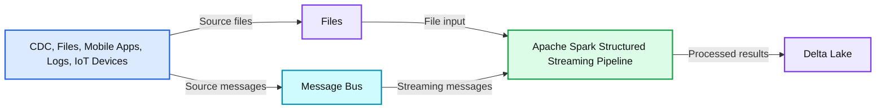

source image: https://www.databricks.com/sites/default/files/inline-images/db-619-blog-img-1.png

Analytical Workloads

*Operational Workloads*

**Summary:** Operational workloads flow from CDC, mobile apps, logs, and IoT devices through an input message bus, an Apache Spark Structured Streaming pipeline, and an output message bus.

**Components:**
- CDC, Mobile Apps, Logs, IoT Devices: grouped data sources; specific technologies are unspecified.
- Input Message Bus: messaging technology unspecified.
- Apache Spark Structured Streaming Pipeline: stream processing using Apache Spark Structured Streaming.
- Output Message Bus: messaging technology unspecified.

**Flows:**
- Data sources -> Input Message Bus: source events.
- Input Message Bus -> Apache Spark Structured Streaming Pipeline: events for processing.
- Apache Spark Structured Streaming Pipeline -> Output Message Bus: processed events.

**Numbers:** none

```mermaid
%% Operational workload events passing through message buses and Spark Structured Streaming
flowchart LR
    A[CDC, Mobile Apps, Logs, IoT Devices]
    B[Message Bus]
    C[Apache Spark Structured Streaming Pipeline]
    D[Message Bus]

    A -->|Source events| B
    B -->|Events for processing| C
    C -->|Processed events| D

    classDef client fill:#dbeafe,stroke:#2563eb,stroke-width:2px,color:#111
    classDef service fill:#dcfce7,stroke:#16a34a,stroke-width:2px,color:#111
    classDef store fill:#ede9fe,stroke:#7c3aed,stroke-width:2px,color:#111
    classDef cache fill:#fef3c7,stroke:#d97706,stroke-width:2px,color:#111
    classDef queue fill:#cffafe,stroke:#0891b2,stroke-width:2px,color:#111
    classDef critical fill:#fee2e2,stroke:#dc2626,stroke-width:4px,color:#111
    classDef external fill:#e5e7eb,stroke:#6b7280,stroke-width:2px,color:#111,stroke-dasharray:4 3
    classDef decision fill:#fce7f3,stroke:#db2777,stroke-width:2px,color:#111

    class A client
    class B,D queue
    class C service
```

source image: https://www.databricks.com/sites/default/files/inline-images/db-619-blog-img-2.png

Operational Workloads

Figure 1. Analytical vs Operational Workloads

Some examples of analytical workloads include:

- **Customer Behavior Analysis**: A marketing firm may use streaming analytics to analyze customer behavior in real-time. By processing clickstream data, social media feeds, and other sources of information, the system can detect patterns and preferences that can be used to target customers more effectively.
- **Sentiment Analysis**: A company might use streaming data from its social media accounts to analyze customer sentiment in real time. For example, the company might look for customers who are expressing positive or negative sentiment about the company's products or services.
- **IoT Analytics**: A smart city may use streaming analytics to monitor traffic flow, air quality, and other metrics in real-time. By processing data from sensors embedded throughout the city, the system can detect trends and make decisions about traffic patterns or environmental policies.

On the other hand, operational workloads, ingest and process data in real time and automatically trigger a business process. Some examples of such workloads include:

- **Cybersecurity**: A company might use streaming data from its network to monitor for security or performance problems. For example, the company might look for spikes in traffic or for unauthorized access to networks and send an alert to the security department.
- **Personally Identifiable Information Leaks**: A company might monitor the microservice logs, parse and detect if any personally identifiable information (PII) is being leaked and if it is, inform by email the owner of the microservice.
- **Elevator Dispatch**: A company might use the streaming data from the elevator to detect when an elevator alarm button is activated. If activated, it might look up additional elevator information to enhance the data and send a notification to security personnel.
- **Proactive Maintenance**: Using the streaming data from a power generator monitor the temperature and when it exceeds a certain threshold inform the supervisor.

Operational streaming pipelines share the following characteristics:

- Latency expectations are usually sub-second
- The pipelines read from a message bus
- The pipelines usually do simple computation with either data transformation or data enrichment
- The pipelines write to a message bus like Apache Kafka or Apache Pulsar or fast key value stores like Apache Cassandra or Redis for downstream integration to business process

For these use cases, when we profiled Structured Streaming, we identified that the offset management to track the progress of micro-batches consumes substantial time. In the next section, let us review the existing offset management and outline how we improved in subsequent sections.

## What is Offset Management?

To track the progress of up to which point the data has been processed, Spark Structured Streaming relies on persisting and managing offsets which are used as progress indicators. Typically, an offset is concretely defined by the source connector as different systems have different ways to represent progress or locations in data. For example, a concrete implementation of an offset can be the line number in a file to indicate how far the data in the file has been processed. Durable logs (as depicted in Figure 2) are used to store these offset and mark completion of micro-batches.

*Figure 2: Offset log*

**Summary:** Micro-batch offsets are grouped into two batches, with corresponding offset log entries recording each batch’s start and end offsets.

**Components:**
- Micro-batch Offsets: column containing offset boxes; technology not specified.
- Batch 1: offset boxes 1, 2, and 3; technology not specified.
- Batch 2: offset boxes 4, 5, 6, and 7; technology not specified.
- Offset Log: column containing two log entries; storage technology not specified.
- First log entry: Start Offset: 1, End Offset: 3.
- Second log entry: Start Offset: 4, End Offset: 7.

**Flows:**
- None. No arrows are visible.

**Numbers:** Batch labels 1 and 2; micro-batch offsets 1, 2, 3, 4, 5, 6, and 7; first log entry start 1 and end 3; second log entry start 4 and end 7. No units are shown.

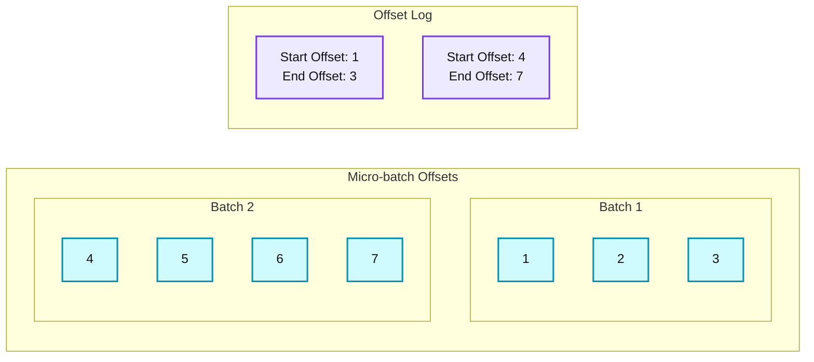

source image: https://www.databricks.com/sites/default/files/inline-images/db-619-blog-imgs-3.png

Figure 2: Offset log

In Structured Streaming, data is processed in units of micro-batches. There are two offset management operations done for each micro-batch. One at the beginning of every micro-batch and one at the end.

- At the beginning of every micro-batch (before any data processing actually starts), an offset is calculated based on what new data can be read from the target system. This offset is persisted to a durable log called the "*offsetLog*" in the checkpoint directory. This offset is used to calculate the range of data that will be processed in "this" micro-batch.
- At the end of every micro-batch, an entry is persisted in the durable log called the "*commitLog*" to indicate that "this" micro-batch has been successfully processed.

Figure 3 below depicts the current offset management operations that occur.

*Figure 3. Offset Management in Structured Streaming*

**Summary:** Two successive Structured Streaming micro-batches persist offset ranges before processing and batch completion afterward to external storage.

**Components:**
- Micro-batch 1 processing: Structured Streaming compute.
- Micro-batch 2 processing: Structured Streaming compute.
- Persist offset ranges, shown twice: offset persistence operations.
- Persist batch done, shown twice: batch completion persistence operations.
- External Storage for Offset and Commit Log: durable storage; storage technology unspecified.
- Time: dotted horizontal timeline indicating execution order.

**Flows:**
- First persist offset ranges operation -> External Storage for Offset and Commit Log: writes offset ranges before micro-batch 1.
- First persist batch done operation -> External Storage for Offset and Commit Log: writes completion after micro-batch 1.
- Second persist offset ranges operation -> External Storage for Offset and Commit Log: writes offset ranges before micro-batch 2.
- Second persist batch done operation -> External Storage for Offset and Commit Log: writes completion after micro-batch 2.
- Timeline start -> Time: execution progresses left to right.

**Numbers:** 1 and 2 identify the micro-batches. No measurements or units are visible.

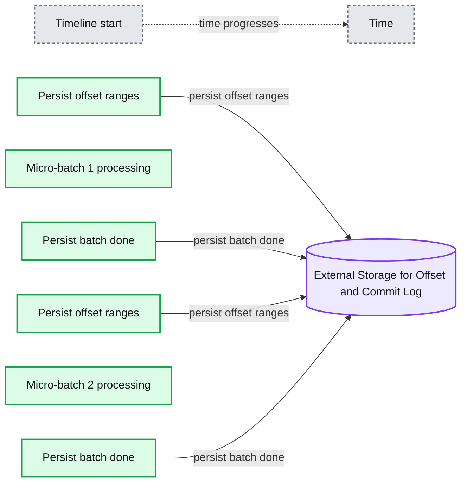

source image: https://www.databricks.com/sites/default/files/inline-images/db-619-blog-img-4.png

Figure 3. Offset Management in Structured Streaming

Another offset management operation is performed at the end of every micro-batch. This operation is a clean up operation to delete / truncate old and unnecessary entries from both the offsetLog and commitLog so that these logs don't grow in an unbounded fashion.

*Figure 4. Log Purging*

**Summary:** Offset and commit logs accumulate across micro-batches, with the oldest entries purged at batch-101 and batch-102.

**Components:**
- batch-0: Apache Spark Structured Streaming offset log containing offsets/0 and commit log containing commit/0.
- batch-1: Offset log containing offsets/0 and offsets/1; commit log containing commit/0 and commit/1.
- Ellipsis: Omitted intermediate batches.
- batch-100: Offset and commit logs containing entries 0 through 100, with intermediate entries abbreviated.
- batch-101: Offset and commit logs add entry 101 and cross out entry 0.
- batch-102: Offset and commit logs add entry 102 and cross out entry 1; entry 2 is the earliest uncrossed entry shown.
- time: Rightward timeline showing batch progression.

**Flows:**
- Earlier batches -> Later batches: Time progresses along the dotted rightward arrow.

**Numbers:** Batch labels: 0, 1, 100, 101, 102. Offset and commit entry identifiers: 0, 1, 2, 100, 101, 102. No units, percentages, or sizes are shown.

```mermaid
%% Offset and commit log accumulation and purging over time
flowchart LR
    A["batch-0<br/>Offset log: offsets/0<br/>Commit log: commit/0"]
    B["batch-1<br/>Offset log: offsets/0, offsets/1<br/>Commit log: commit/0, commit/1"]
    C["..."]
    D["batch-100<br/>Offset log: offsets/0, offsets/1, ..., offsets/100<br/>Commit log: commit/0, commit/1, ..., commit/100"]
    E["batch-101<br/>Offset log: offsets/0 purged, offsets/1, ..., offsets/100, offsets/101<br/>Commit log: commit/0 purged, commit/1, ..., commit/100, commit/101"]
    F["batch-102<br/>Offset log: offsets/1 purged, offsets/2, ..., offsets/101, offsets/102<br/>Commit log: commit/1 purged, commit/2, ..., commit/101, commit/102"]

    A -. time .-> B
    B -. time .-> C
    C -. time .-> D
    D -. time .-> E
    E -. time .-> F

    classDef client fill:#dbeafe,stroke:#2563eb,stroke-width:2px,color:#111
    classDef service fill:#dcfce7,stroke:#16a34a,stroke-width:2px,color:#111
    classDef store fill:#ede9fe,stroke:#7c3aed,stroke-width:2px,color:#111
    classDef cache fill:#fef3c7,stroke:#d97706,stroke-width:2px,color:#111
    classDef queue fill:#cffafe,stroke:#0891b2,stroke-width:2px,color:#111
    classDef critical fill:#fee2e2,stroke:#dc2626,stroke-width:4px,color:#111
    classDef external fill:#e5e7eb,stroke:#6b7280,stroke-width:2px,color:#111,stroke-dasharray:4 3
    classDef decision fill:#fce7f3,stroke:#db2777,stroke-width:2px,color:#111
    class A,B,D,E,F store
    class C external
```

source image: https://www.databricks.com/sites/default/files/inline-images/db-619-blog-img-5.png

Figure 4. Log Purging

These offset management operations are performed on the critical path and inline with the actual processing of the data. This means that the duration of these operations directly impacts processing latency and no data processing can occur until these operations are complete. This directly impacts cluster utilization as well.

Through our benchmarking and performance profiling efforts, we have identified these offset management operations can take up a majority of the processing time especially for stateless single state pipelines that are often used in the operation alerting and real-time monitoring use cases.

## Performance Improvements in Structured Streaming

### Asynchronous Progress Tracking

This feature was created to address the latency overhead of persisting offsets for progress tracking purposes. This feature, when enabled, will allow Structured Streaming pipelines to checkpoint progress, i.e. update the offsetLog and commitLog, asynchronously and in parallel to the actual data processing within a micro-batch. In other words, the actual data processing will not be blocked by these offset management operations which will significantly improve the latency of applications. Figure 5 below depicts this new behavior for offset management.

*Figure 5. Async Progress Tracking*

**Summary:** Three micro-batches process data while asynchronously persisting offset ranges and batch completion records to external storage.

**Components:**

- Micro-batch 1 processing: streaming compute; technology not specified.
- Micro-batch 2 processing: streaming compute; technology not specified.
- Micro-batch 3 processing: streaming compute; technology not specified.
- Persist async offset ranges, repeated for each micro-batch: asynchronous persistence operation.
- Persist async batch done, repeated for each micro-batch: asynchronous persistence operation.
- External Storage for Offset and Commit Log: durable storage; technology not specified.
- Time: dotted horizontal timeline showing progression to the right.

**Flows:**

- Micro-batch 1 -> External Storage for Offset and Commit Log: asynchronously persist offset ranges.
- Micro-batch 1 -> External Storage for Offset and Commit Log: asynchronously persist batch done.
- Micro-batch 2 -> External Storage for Offset and Commit Log: asynchronously persist offset ranges.
- Micro-batch 2 -> External Storage for Offset and Commit Log: asynchronously persist batch done.
- Micro-batch 3 -> External Storage for Offset and Commit Log: asynchronously persist offset ranges.
- Micro-batch 3 -> External Storage for Offset and Commit Log: asynchronously persist batch done.
- Timeline left -> Timeline right: time advances.

**Numbers:** 1, 2, and 3 identify the micro-batches. No measurements or units are shown.

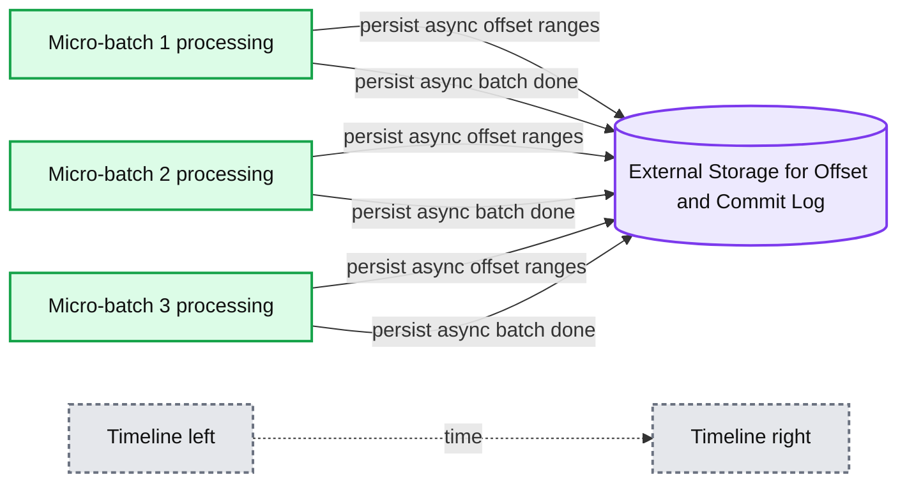

source image: https://www.databricks.com/sites/default/files/inline-images/db-619-blog-img-6.png

Figure 5. Async Progress Tracking

In conjunction with asynchronously performing updates, users can configure the frequency at which the progress is checkpointed. This will be helpful for scenarios in which offset management operations occur at a higher rate than they can be processed. This happens in pipelines when the time spent actually processing data is significantly less compared to these offset management operations. In such scenarios, an ever increasing backlog of offset management operations will occur. To stem this growing backlog, data processing will have to be blocked or slowed down which will essentially revert the processing behavior to being the same as if these offset management operations were executed inline with the data processing. A user will typically not need to configure or set the checkpoint frequency as an adequate default value will be set. It is important to note that failure recovery time will increase with the increase in checkpoint interval time. In case of failure, a pipeline has to reprocess all the data before the previous successful checkpoint. Users can consider this trade-off between lower latency during regular processing and recovery time in case of failure.

Following configurations are introduced to enable and configure this feature:

- `**asyncProgressTrackingEnabled** - enable or disable asynchronous progress tracking `
  - `Default: false`
- `**asyncProgressCheckpointingInterval** - the interval in which we commit offsets and completion commits `
  - `Default: 1 minute`

Following code sample illustrates how to enable this feature:

*Note that this feature will not work with **Trigger.once** or **Trigger.availableNow** as these triggers execute pipelines in manual/scheduled fashion. Therefore, asynchronous progress tracking will not be relevant. Query will fail if it is submitted using any of the aforementioned triggers.*

### Applicability and Limitations

There are a couple of limitations in the current version(s) that might change as we evolve the feature:

- Currently, asynchronous progress tracking is only supported in stateless pipelines using Kafka Sink.
- Exactly once end-to-end processing will not be supported with this asynchronous progress tracking because offset ranges for a batch can be changed in case of failure. However, many sinks, such as the Kafka sink, only support at-least once guarantees, so this may not be a new limitation.

### Asynchronous Log Purging

This feature was created to address the latency overhead of the log cleanups that were done in line within a micro-batch. By making this log cleanup/purge operation asynchronous and performed in the background, we can remove the latency overhead this operation will incur on actual data processing. Also, these purges do not need to be done with every micro-batch and can occur on a more relaxed schedule.

Note that this feature / improvement does not have any limitations on what type of pipelines or workloads can use this, thus this feature will be enabled in the background by default for all Structured Streaming pipelines.

## Benchmarks

In order to understand the performance of async progress tracking and async log purging, we created a few benchmarks. Our goal with the benchmarks is to understand the difference in performance that the improved offset management provides in an end-to-end streaming pipeline. The benchmarks are divided into two categories:

- **Rate Source to Stat Sink** - In this benchmark, we used a basic, stateless, stats-collecting source and sink which is useful in determining the difference in core engine performance without any external dependencies.
- **Kafka Source to Kafka Sink** - For this benchmark, we move data from a Kafka source to Kafka sink. This is akin to a real-world scenario to see what the difference would be in a production scenario.

For both these benchmarks, we measured the end to end latency (50th percentile, 99th percentile) at different data input rates (100K events/sec, 500K events/sec, 1M events/sec).

### Benchmark Methodology

The main methodology was to generate data from a source at a particular constant throughput. The generated records contain information about when the records were created. On the sink side, we use the [Apache DataSketches](https://datasketches.apache.org/) library to collect the difference between the time the sink processes the record and the time that it was created in each batch. This is used to calculate the latency. We used the same cluster with the same number of nodes for all experiments.

**Note:** For the Kafka benchmark, we put aside some nodes of a cluster for running Kafka and generating the data for feeding to Kafka. We calculate the latency of a record only after the record has been successfully published into Kafka (on the sink)

### Rate Source to Stat Sink Benchmark

For this benchmark, we used a Spark cluster of 7 worker nodes (i3.2xlarge - 4 cores, 61 GiB memory) using the Databricks runtime (11.3). We measured the end to end latency for the following scenarios to quantify the contribution of each improvement.

- Current Structured Streaming - this is the baseline latency without any of the aforementioned improvements
- Async Log Purge - this measures the latency after applying asynchronous log purging only
- Async Progress - this measures the latency after applying asynchronous progress tracking
- Async Progress + Async Log Purge - this measures the latency after applying both the improvements

The results of these experiments are shown in Figures 6, 7 and 8. As you can see, async log purging consistently reduces the latency approximately by 50%. Similarly, async progress tracking alone improves latency by approximately 65%. Combined together, the latency reduces by 85-86% and the latency goes below 100 ms.

*Figure 6. Chart showing performance improvement using async configs at a throughput of 100K events/sec*

**Summary:** At 100K events/sec, combining async progress and async log purge gives the lowest Apache Spark Structured Streaming end-to-end latency at both p50 and p99.

**Components:**
- Current Structured Streaming: baseline Apache Spark Structured Streaming.
- Async Log Purge: Structured Streaming with asynchronous log purging.
- Async Progress: Structured Streaming with asynchronous progress tracking.
- Async Progress + Async Log Purge: Structured Streaming with both asynchronous features.
- p50 and p99: latency percentiles used to compare the configurations.

**Flows:**
- none. No arrows are visible.

**Numbers:**
- Throughput: 100K events/sec.
- End-to-end latency axis: milliseconds, with labeled ticks at 0, 200, 400, and 600.
- p50: Current Structured Streaming 405 ms; Async Log Purge 199 ms; Async Progress 147 ms; Async Progress + Async Log Purge 53 ms.
- p99: Current Structured Streaming 562 ms; Async Log Purge 278 ms; Async Progress 204 ms; Async Progress + Async Log Purge 80 ms.

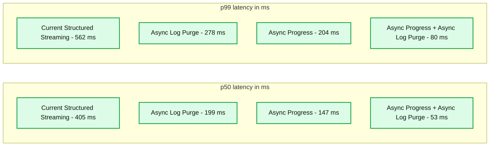

source image: https://www.databricks.com/sites/default/files/inline-images/db-619-blog-img-7.png

Figure 6. Chart showing performance improvement using async configs at a throughput of 100K events/sec

*Figure 7. Chart showing performance improvement using async configs at a throughput of 500k events/sec*

**Summary:** At 500K events/sec, Apache Spark Structured Streaming latency decreases with async log purging and async progress tracking, reaching 54 ms at p50 and 83 ms at p99 when combined.

**Components:**
- Current Structured Streaming: baseline Apache Spark Structured Streaming.
- Async Log Purge: Structured Streaming with asynchronous log purging.
- Async Progress: Structured Streaming with asynchronous progress tracking.
- Async Progress + Async Log Purge: Structured Streaming with both asynchronous features.
- p50 and p99: end-to-end latency percentiles.

**Flows:**
- none. No arrows are visible.

**Numbers:**
- Throughput: 500K events/sec.
- End-to-end latency unit: ms.
- Vertical axis labels: 0, 200, 400, 600.
- p50: Current Structured Streaming 408 ms; Async Log Purge 203 ms; Async Progress 152 ms; combined 54 ms.
- p99: Current Structured Streaming 586 ms; Async Log Purge 296 ms; Async Progress 213 ms; combined 83 ms.

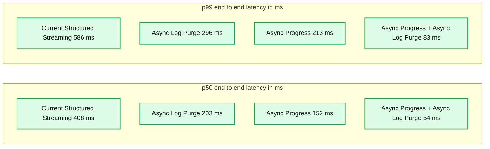

source image: https://www.databricks.com/sites/default/files/inline-images/db-619-blog-img-8.png

Figure 7. Chart showing performance improvement using async configs at a throughput of 500k events/sec

*Figure 8. Chart showing performance improvement using async configs at a throughput of  1M events/sec*

**Summary:** At 1M events/sec, combining async progress and async log purge reduces Apache Spark Structured Streaming latency from 400 to 54 ms at p50 and from 553 to 81 ms at p99.

**Components:**
- Current Structured Streaming: baseline Apache Spark Structured Streaming.
- Async Log Purge: Structured Streaming with asynchronous log purging.
- Async Progress: Structured Streaming with asynchronous progress tracking.
- Async Progress + Async Log Purge: Structured Streaming with both configurations.
- p50 and p99: latency percentiles.
- end to end latency: vertical axis measured in milliseconds.

**Flows:**
- none. No arrows are visible.

**Numbers:**
- Throughput: 1M events/sec.
- Vertical axis: 0, 200, 400, 600 ms.
- p50: Current Structured Streaming 400 ms; Async Log Purge 201 ms; Async Progress 146 ms; combined 54 ms.
- p99: Current Structured Streaming 553 ms; Async Log Purge 293 ms; Async Progress 205 ms; combined 81 ms.

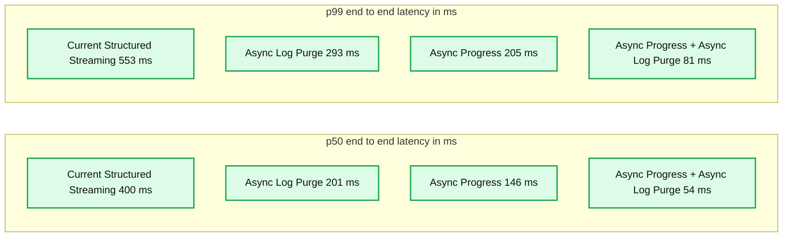

source image: https://www.databricks.com/sites/default/files/inline-images/db-619-blog-img-9.png

Figure 8. Chart showing performance improvement using async configs at a throughput of  1M events/sec

### Kafka Source to Kafka Sink Benchmark

For the Kafka benchmarks, we used a Spark cluster of 5 worker nodes (i3.2xlarge - 4 cores, 61 GiB memory), a separate cluster of 3 nodes to run Kafka and an additional 2 nodes to generate data added to the Kafka source. Our Kafka topic has 40 partitions and a replication factor of 3.

The data generator publishes the data into a Kafka topic and the structured streaming pipeline consumes data and republishes into another Kafka topic. The results of the performance evaluation are shown in Figures 9, 10 and 11. As one can see, after applying async progress and async log purging, the latency reduces by 65-75% or 3-3.5X across different throughputs.

*Figure 9. Chart showing performance improvement using async configs at a  throughput of 100K events/sec*

**Summary:** At 100K events/sec, Async Progress + Async Log Purge reduces Structured Streaming end-to-end latency from 500 to 137 ms at p50 and from 698 to 201 ms at p99.

**Components:**
- Current Structured Streaming: baseline Structured Streaming configuration, shown in light blue.
- Async Progress + Async Log Purge: asynchronous Structured Streaming configuration, shown in dark blue.
- p50: 50th-percentile end-to-end latency comparison.
- p99: 99th-percentile end-to-end latency comparison.

**Flows:**
- none. No arrows are visible.

**Numbers:**
- Throughput: 100K events/sec.
- p50: Current Structured Streaming 500 ms; Async Progress + Async Log Purge 137 ms.
- p99: Current Structured Streaming 698 ms; Async Progress + Async Log Purge 201 ms.
- End-to-end latency axis in ms: 0, 200, 400, 600, 800.

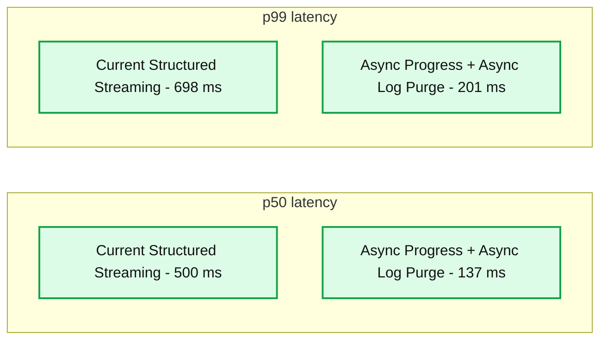

source image: https://www.databricks.com/sites/default/files/inline-images/db-619-blog-img-10.png

Figure 9. Chart showing performance improvement using async configs at a  throughput of 100K events/sec

*Figure 10. Chart showing performance improvement using async configs at a throughput of 500K events/sec*

**Summary:** At 500K events/sec, Async Progress + Async Log Purge reduces Structured Streaming end-to-end latency from 558 to 169 ms at p50 and from 760 to 245 ms at p99.

**Components:**

- Current Structured Streaming: baseline streaming configuration.
- Async Progress + Async Log Purge: streaming configuration using asynchronous progress and log purging.
- p50 and p99: latency percentiles compared across configurations.
- End-to-end latency: vertical axis measured in milliseconds.

**Flows:**

- none. No arrows are shown.

**Numbers:**

- Throughput: 500K events/sec.
- p50: Current Structured Streaming 558 ms; Async Progress + Async Log Purge 169 ms.
- p99: Current Structured Streaming 760 ms; Async Progress + Async Log Purge 245 ms.
- Vertical axis ticks: 0, 200, 400, 600, 800 ms.

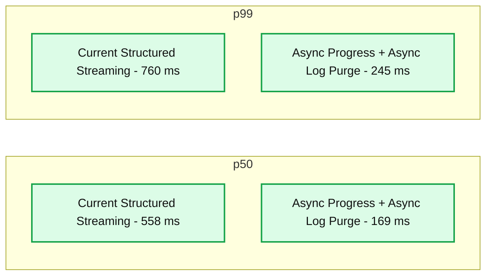

source image: https://www.databricks.com/sites/default/files/inline-images/db-619-blog-img-11.png

Figure 10. Chart showing performance improvement using async configs at a throughput of 500K events/sec

*Figure 11. Chart showing performance improvement using async configs at a throughput of 1M events/sec*

**Summary:** At 1M events/sec, async progress and async log purge reduce Apache Spark Structured Streaming end-to-end latency from 705 to 202 ms at p50 and from 914 to 245 ms at p99.

**Components:**
- Current Structured Streaming: baseline Apache Spark Structured Streaming configuration, shown in light blue.
- Async Progress + Async Log Purge: Apache Spark Structured Streaming with asynchronous progress and log purging, shown in dark blue.
- p50 and p99: latency percentile categories.
- end to end latency: vertical axis measured in milliseconds.

**Flows:**
- none. No arrows are visible.

**Numbers:**
- Throughput: 1M events/sec.
- p50: current 705 ms; async 202 ms.
- p99: current 914 ms; async 245 ms.
- Vertical axis ticks: 0, 250, 500, 750, 1000 ms.

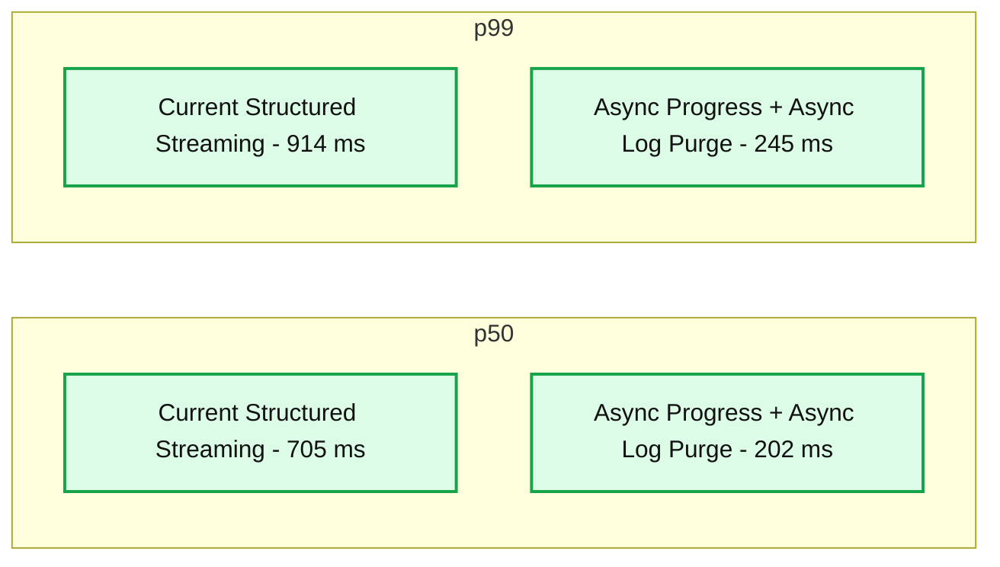

source image: https://www.databricks.com/sites/default/files/inline-images/db-619-blog-img-12.png

Figure 11. Chart showing performance improvement using async configs at a throughput of 1M events/sec

### Summary of Performance Results

With the new asynchronous progress tracking and asynchronous log purge, we can see that both configs reduce latency as much as 3X. Working together, latency is greatly reduced across all throughputs. The charts also show that the amount of time saved is usually a constant amount of time (200 - 250 ms for each config) and together they can shave off around 500 ms across the board (leaving enough time for batch planning and query processing).

## Availability

These performance improvements are available in Databricks Lakehouse Platform from DBR 11.3 onwards. Async log purging is enabled by default in DBR 11.3 and subsequent releases. Furthermore, these improvements have been contributed to Open Source Spark and is available from Apache Spark 3.4 onwards.

## Future Work

There are currently some limitations to the types of workloads and sinks supported by the asynchronous progress tracking feature. We will be looking into supporting more types of workloads with this feature in the future.

This is only the beginning of the predictable low latency features we are building in Structured Streaming as part of [Project Lightspeed](https://www.databricks.com/blog/2022/06/28/project-lightspeed-faster-and-simpler-stream-processing-with-apache-spark.html). In addition, we will continue to benchmark and profile Structured Streaming to find more areas of improvement. Stay tuned!

Join us at the Data and AI Summit in San Francisco, June 26-29 to learn more about Project Lightspeed and data streaming on the Databricks Lakehouse Platform.
