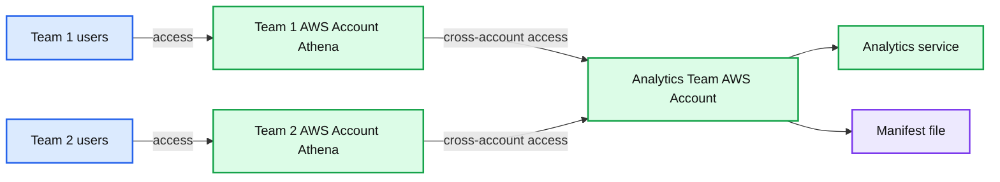
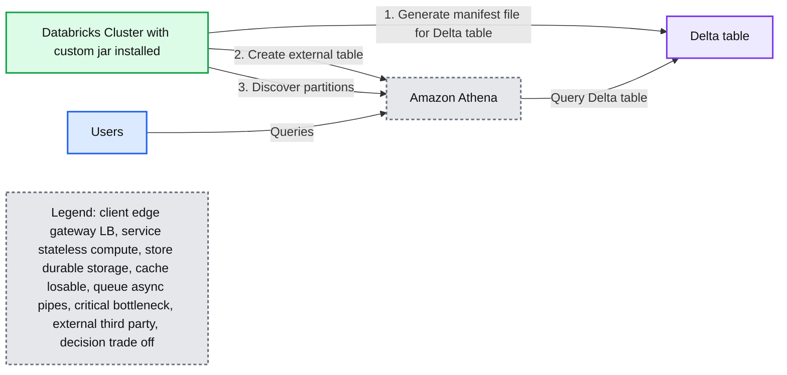
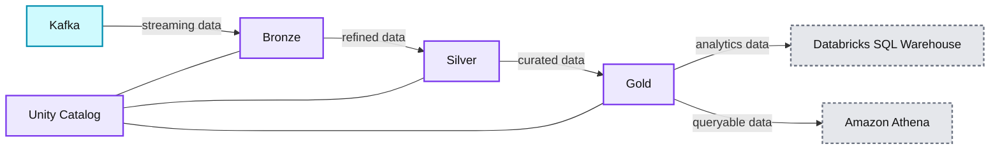

# Leveraging Delta Across Teams at McGraw Hill

- Source: https://www.databricks.com/blog/leveraging-delta-across-teams-mcgraw-hill
- Published: 2022-09-14
- Authors: Nick Afshartous, Emma Stein
- Categories: engineering, open-source
- Images: 4 total, 4 extracted as architecture

This is a collaborative post from McGraw Hill and Databricks. We thank Nick Afshartous, Principal Engineer at McGraw Hill, for his contributions.

McGraw Hill (MH) offers innovative educational technology with adaptive systems for all teaching and learning styles. We offer a suite of products for Higher Education, K-12 and Professional segments ranging from ebooks to full-suite educational platforms with courseware & rich content.

While McGraw Hill is well known for its history in publishing, the current focus is heavily geared towards digital adoption. In fact, in the Higher Education segment, 82% of billings are from digital products such as Connect. An online platform that services over 90 distinct disciplines in Higher Ed (HE), Connect offers course management, reporting and student learning tools. The customizable platform allows instructors to personalize course content and provides analytics and data tools to track performance and help guide teaching. The Inclusive Access Program helps make these digital educational materials more accessible and affordable to all students by providing access to digital course materials to students on the first day of class.

Through these types of products, McGraw Hill aims to use technology to improve learner outcomes and to foster more equity within our education systems. In order to do this, technologies like the Databricks Lakehouse Platform and Athena are essential in helping us to develop personalized learning experiences and providing educators with the data they need.

## Architecture

The Analytics team at MHE is responsible for data ingestion and reporting. To achieve this we use Databricks on AWS as the foundation of our enterprise data and AI platform.

Our data set consists of domain entities (i.e. learners, instructors, organizations) and application events that represent user actions. Some examples of user actions that trigger events are:

- User login
- Learner submitting an assignment
- Instructor creating or assigning an assessment

The data flows through Kafka, our messaging system, and is then processed by Databricks' Spark Runtime. The ingested data is stored in S3 in a Delta format, as well as our Postgres RDS datamart. Delta is an open format storage layer that brings reliability, security, and performance to a data lake for both streaming and batch processing, and is the foundation of a cost-effective, highly scalable data platform.

Our Databricks Lakehouse is organized into a medallion architecture, where raw data is landed and refined through bronze, silver, and gold tables. More specifically,

- Bronze tables represent the raw JSON data
- Silver tables are structured tables, have typed columns, and contain parsed events
- Gold tables represent domain-level aggregates. For example, an aggregation of login activity over a month

**Summary:** The diagram shows data flowing from Kafka through bronze raw ingestion, silver refinement, and gold business-level aggregation.

**Components:**

- Kafka: event streaming source
- Bronze: raw JSON ingestion table in Databricks Lakehouse
- Silver: structured, typed, parsed, filtered, cleaned, and augmented table
- Gold: domain-level aggregate table

**Flows:**

- Kafka -> Bronze: raw event data
- Bronze -> Silver: filtered, cleaned, and augmented data
- Silver -> Gold: business-level aggregates

**Numbers:** none

source image: https://www.databricks.com/sites/default/files/inline-images/db-302-blog-img-1.png

```mermaid
%% Shows Kafka data flowing through bronze silver and gold layers
flowchart LR
    A[Kafka] -->|raw event data| B[Bronze raw ingestion]
    B -->|filtered cleaned augmented data| C[Silver structured tables]
    C -->|business level aggregates| D[Gold domain aggregates]

    classDef client fill:#dbeafe,stroke:#2563eb,stroke-width:2px,color:#111
    classDef service fill:#dcfce7,stroke:#16a34a,stroke-width:2px,color:#111
    classDef store fill:#ede9fe,stroke:#7c3aed,stroke-width:2px,color:#111
    classDef cache fill:#fef3c7,stroke:#d97706,stroke-width:2px,color:#111
    classDef queue fill:#cffafe,stroke:#0891b2,stroke-width:2px,color:#111
    classDef critical fill:#fee2e2,stroke:#dc2626,stroke-width:4px,color:#111
    classDef external fill:#e5e7eb,stroke:#6b7280,stroke-width:2px,color:#111,stroke-dasharray:4 3
    classDef decision fill:#fce7f3,stroke:#db2777,stroke-width:2px,color:#111

    class A queue
    class B,C,D store
```

Using the application, users can view reports corresponding to their role. Some examples of reporting views are:

- A school administrator viewing login activity
- A learner viewing their own performance
- An instructor viewing the performance of their class
- An administrator viewing performance of a school district

The data science team also leverages this data and uses Databricks collaborative notebooks to build machine learning models. Using different features, models are used to predict student performance and outcomes. This creates the opportunity for personalized content recommendations and instructor intervention.

## Integrating with other teams

Since McGraw Hill has centralized our enterprise data strategy on AWS, it is important that our data platform can easily integrate with our other AWS technologies. A big reason we chose Databricks is because of the openness and flexibility it provides.

Within McGraw Hill, there were several other teams that wanted to leverage the datasets the analytics team had created in Delta, but users from these teams had not been onboarded onto the Databricks platform. For example, the higher-education team needs to query data in Delta in order to test and verify application events related to students taking assessments. We needed a way to provide the existing data processed by the Analytics team so they could leverage the work that had already been performed.

In considering how to give the higher-education team access to the data, the following were important to us:

- We wanted to avoid making additional copies of the data as this would increase costs, and increase the chances of stale data
- Cross-functional teams wanted to minimize disruption to their existing user workflow
- Since teams were working on projects outside the scope of the analytics team, we wanted both billing and usage monitoring to be handled by the teams using the data
- We had limited IT resources and wanted to make the onboarding process as simple as possible

Since these users already use Amazon Athena, we decided to leverage the Databricks - Athena integration to give users access to the data without having to make a copy of the data. Considering our team has limited resources, this gives users access to data with minimal IT overhead and also allows users to continue to use their existing toolset.

## Athena Integration with Delta

Amazon Athena is a managed service built around the Presto query engine. As with other AWS services, Athena may be accessed via the AWS Console, CLI, and SDK. Athena supports reading from external tables using a manifest file, which is a text file containing the list of data files to read for a table. When an external table is defined in the hive metastore using manifest files, Athena can use the list of files in the manifest rather than finding the files by directory listing. This allows Athena to read Delta tables.

It was also important to us that the team could access the data from within their own AWS account. By leveraging cross-account access we were able to expose the Athena tables to users directly within their existing account, connecting to the data in our account. In addition to making the data more accessible, this cross-account linking also shifts the responsibility of cost and usage monitoring to the end users' team.

**Summary:** The diagram shows two team AWS accounts using Amazon Athena to access analytics resources across accounts through a manifest file.

**Components:**

- Team 1 AWS Account using Amazon Athena
- Team 2 AWS Account using Amazon Athena
- Analytics Team AWS Account
- Unlabeled analytics service
- Manifest file

**Flows:**

- Team 1 users -> Team 1 AWS Account: access Athena
- Team 2 users -> Team 2 AWS Account: access Athena
- Team 1 AWS Account -> Analytics Team AWS Account: cross-account access
- Team 2 AWS Account -> Analytics Team AWS Account: cross-account access

**Numbers:** none

source image: https://www.databricks.com/sites/default/files/inline-images/db-302-blog-img-2.png

Following the [Athena integration guide](https://docs.databricks.com/delta/presto-integration.html), the steps to access a Delta table from Athena are:

1. Generate a manifest file for the Delta table
2. Set the table to auto-update so that all write operations on the table automatically update the manifest file
3. Define a table in Athena using the S3 path of the manifest file
4. For partitioned tables run msck repair table so the metastore discovers the partitions

## Automation implementation

Our experience has been that this process is time consuming for integrating many tables. It's also tedious to manually generate the table definitions. As a result, we sought to build an automated process. This was initiated by first automatically generating the create table statements. Then we built a JAR that bundles in the AWS SDK. This allowed us to directly execute the create table statement in Athena from a Databricks cluster.

After creating a table the process also optionally runs `msck repair table` and runs a test query to validate if the new table is queryable. We run the automation process on demand in response to requests from application teams to make data available.

**Summary:** Automation connects a Databricks cluster to a Delta table and Amazon Athena so users can query the data.

**Components:**

- Databricks Cluster with custom jar installed
- Delta table
- Amazon Athena
- Users

**Flows:**

- Databricks Cluster -> Delta table: Generate manifest file for Delta table
- Databricks Cluster -> Amazon Athena: Create external table
- Databricks Cluster -> Amazon Athena: Discover partitions
- Users -> Amazon Athena: Submit queries
- Amazon Athena -> Delta table: Query Delta table

**Numbers:** 1, 2, 3

source image: https://www.databricks.com/sites/default/files/inline-images/db-302-blog-img-3.png

## Future development

We have onboarded several teams at MHE using the Athena integration. The integration allows us to leverage all the benefits of Delta, while providing an easily accessible way for users to query the data from Athena. Automating the process was crucial towards building a repeatable and scalable process that allows us to support multiple teams. In the future, we look forward to evolving the solution to incorporate new capabilities and make it a more seamless process.

We are also interested in trying Databricks' Serverless SQL Warehouses, to give users a native place within the Databricks Data + AI Platform to run SQL workloads. This in combination with Unity Catalog will make the process of onboarding new users to Databricks and isolating billing between teams a more seamless process.

**Summary:** The diagram shows Kafka data progressing through Bronze, Silver, and Gold layers governed by Unity Catalog, then serving Databricks SQL Warehouse and Amazon Athena.

**Components:**

- Kafka - event streaming technology
- Bronze - raw data layer
- Silver - refined data layer
- Gold - curated data layer
- Unity Catalog - data governance and catalog technology
- Databricks SQL Warehouse - SQL analytics technology
- Amazon Athena - serverless query technology

**Flows:**

- Kafka -> Bronze: streaming data
- Bronze -> Silver: refined data
- Silver -> Gold: curated data
- Gold -> Databricks SQL Warehouse: analytics data
- Gold -> Amazon Athena: queryable data

**Numbers:** none

source image: https://www.databricks.com/sites/default/files/inline-images/db-302-blog-img-4.png

You can check out the repo containing the automation code at: [*https://github.com/MHEducation/databricks-athena-blog-code*](https://github.com/MHEducation/databricks-athena-blog-code)

 

### **Acknowledgements**

*We would like to thank the following colleagues at Mcgraw Hill: Sarah Carey and Steve Stalzer for their review and comments as well as Mohammed Zayeem for his contributions to the implementation.*
