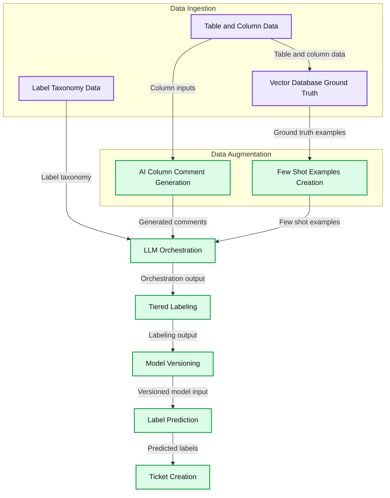

# LogSentinel: How Databricks uses Databricks for LLM-powered PII detection and governance

*A deep dive into LogSentinel: How we internally leverage LLMs to automate PII discovery and governance*

- Source: https://www.databricks.com/blog/logsentinel-how-databricks-uses-databricks-llm-powered-pii-detection-and-governance
- Published: 2026-03-06
- Authors: Anirudh Kondaveeti, Sittichai Jiampojamarn, Zefan Xu
- Categories: engineering
- Images: 1 total, 1 extracted as architecture

**Key takeaways**

- We use LLMs on Databricks to automatically detect and classify sensitive data across logs and databases.
- Our LogSentinel system applies hierarchical, residency-aware, and multi-model classification for precise labeling– techniques being integrated directly into the Data Classification product.
- By pre-labeling columns and continuously detecting labeling drift, LogSentinel enables reliable PII detection, automated policy enforcement, and much faster compliance workflows at scale.

Databricks operates at a scale where our internal logs and datasets are constantly changing—schemas evolve, new columns appear, and data semantics drift. This blog discusses **how we use Databricks at Databricks internally** to keep PII and other sensitive data correctly labeled as our platform changes.

To do this, we built LogSentinel, an LLM-powered data classification system on Databricks that tracks schema evolution, detects labeling drift, and feeds high-quality labels into our governance and security controls. We use MLflow to track experiments and monitor performance over time, and we are integrating the best ideas from LogSentinel back into the [Databricks Data Classification](https://docs.databricks.com/aws/en/data-governance/unity-catalog/data-classification) product so customers can benefit from the same approach.

## Why this System Matters

This system is designed to move three concrete business levers for platform, data and security teams:

- **Shorter compliance cycles**: recurring review tasks that previously took weeks of analyst time are now completed in hours because columns are pre-labeled and pre-triaged before humans look at them.
- **Lower operational risk**: the system continuously detects labeling drift and schema changes, so sensitive fields are less likely to quietly slip through with incorrect or missing tags.
- **Stronger policy enforcement**: reliable labels now directly drive masking, access control, retention, and residency rules, turning what used to be “best-effort governance” into executable policy.

In practice, teams can plug new tables into a standard pipeline, monitor drift metrics and exceptions, and rely on the system to enforce PII and residency constraints without building a bespoke classifier for every domain.

## System Architecture at a Glance

We built an LLM-powered column classification system on Databricks that continuously annotates tables using our internal data taxonomy, detects labeling drift, and opens remediation tickets when something looks wrong. The various components involved in the system are outlined below (tracked and evaluated using MLFlow):

- Data Ingestion: Ingesting various data sources (including Unity Catalog column data, label taxonomy data and ground truth data)
- Data Augmentation: Augmenting data using [Databricks AI Search](https://www.databricks.com/product/machine-learning/vector-search) and [AI Comment generation](https://docs.databricks.com/aws/en/comments/ai-comments)
- LLM Orchestration
- Tiered Labeling System
- Model Versioning: Running multiple models in parallel
- Label Prediction: Predicting final label using Mixture of Experts (MoE) approach
- Ticket Creation: Detecting violations and generating JIRA tickets

The end-to-end workflow is shown in the figure below

*End to End Workflow*

**Summary:** Label taxonomy, table and column data, and ground-truth examples feed an LLM workflow that produces labels and creates tickets.

**Components:**
- Data Ingestion: grouping for input data and ground-truth storage.
- Label Taxonomy Data: label definitions; technology unspecified.
- Table and Column Data: dataset inputs; technology unspecified.
- Vector Database (Ground Truth): vector database; product unspecified.
- Data Augmentation: grouping for comment and example generation.
- AI Column Comment Generation: AI-generated column comments; model unspecified.
- Few Shot Examples Creation: few-shot example preparation; technology unspecified.
- LLM Orchestration: large language model coordination; framework unspecified.
- Tiered Labeling: tiered label assignment; technology unspecified.
- Model Versioning: model version management; technology unspecified.
- Label Prediction: label prediction; technology unspecified.
- Ticket Creation: ticket generation; platform unspecified.

**Flows:**
- Table and Column Data -> Vector Database (Ground Truth): table and column data.
- Table and Column Data -> AI Column Comment Generation: inputs for column comments.
- Vector Database (Ground Truth) -> Few Shot Examples Creation: ground-truth examples.
- Label Taxonomy Data -> LLM Orchestration: label taxonomy.
- AI Column Comment Generation -> LLM Orchestration: generated column comments.
- Few Shot Examples Creation -> LLM Orchestration: few-shot examples.
- LLM Orchestration -> Tiered Labeling: orchestration output.
- Tiered Labeling -> Model Versioning: tiered labeling output.
- Model Versioning -> Label Prediction: versioned model input.
- Label Prediction -> Ticket Creation: predicted labels.

**Numbers:** none

source image: https://www.databricks.com/sites/default/files/inline-images/logsentinel-databricks-llm-powered-pii-detection-governance-blog-img-1.png

[End to End Workflow](https://www.databricks.com/sites/default/files/inline-images/logsentinel-databricks-llm-powered-pii-detection-governance-blog-img-1.png)

## Data Ingestion

For each log type or dataset to be annotated, we randomly sample values from every column and send the following metadata into the system: table name, column name, type, existing comment, and a small sample of values. To reduce LLM cost and improve throughput, multiple columns from the same table are batched together in a single request.

Our taxonomy is defined using Protocol Buffers and currently includes more than 100 hierarchical data labels, with room for custom extensions when teams need additional categories. This gives governance and platform stakeholders a shared contract for what “PII” and “sensitive” mean beyond a handful of regexes.

## Data Augmentation

Two augmentation strategies significantly improve classification quality:

- AI column comment generation: when comments are missing, we use [Databricks AI-generated comments](https://docs.databricks.com/aws/en/comments/ai-comments) to synthesize concise, human-readable descriptions that help both the LLM and future table consumers.
- Few-shot example generation: we maintain a ground truth dataset and use both static examples and dynamic examples retrieved via AI Search; for each column, we build an embedding from name, type, comment, and context, then retrieve top-K similar labeled columns to include in the prompt.

Static prompting is best during early stages or when labeled data is limited, providing consistency and reproducibility. Dynamic prompting is more effective in mature systems, using vector search to pull similar examples and adapt to new schemas and data domains in large, diverse datasets.

## LLM Orchestration

At the core of the system is a lightweight orchestration layer that manages LLM calls at production scale.

​Key capabilities include:

- ​Multi-model routing across internally hosted LLMs (for example, Llama, Claude, and GPT-based models) with automatic fallback when a model is unavailable.
- Retry logic for transient failures and rate limits with exponential backoff.
- Validation hooks that detect empty, invalid, or hallucinated labels and re-run those cases with backup models.
- Batch processing that annotates multiple columns at once to optimize token usage without losing context.

## Tiered Labeling System

We predict three types of labels per column:

- ​Granular labels, drawn from a set of 100+ fine-grained options that power masking, redaction, and tight access controls.
- Hierarchical labels, which aggregate related granular labels into broader categories suitable for monitoring and reporting.
- Residency labels, which indicate whether data must remain in-region or can move cross-region, directly feeding data movement policies.

​To keep predictions consistent and reduce hallucinations, we use a two-stage flow: a broad classification step assigns a high-level category, then a refinement step picks the exact label within that category. This mirrors how a human reviewer would first decide “this is workspace data” and then choose the specific workspace identifier label.

## Model Versioning and Label Prediction

Instead of relying on a single “best” configuration, each model setup is treated as an expert that competes to label a column.​

Multiple model versions run in parallel with differences in:​

- Primary and fallback LLM choices.
- Use of generated comments vs. raw metadata.
- Prompting strategy (static vs. dynamic few-shot).
- Label granularity and taxonomy subsets.​

Each expert produces a label and a confidence score between 0 and 100. The system then selects the label from the expert with the highest confidence, a Mixture-of-Experts style approach that improves accuracy and reduces the impact of occasional bad predictions from any one configuration.​

This design makes it safe to experiment: new models or prompt strategies can be introduced, run alongside existing ones, and evaluated on both metrics and downstream ticket volume before becoming the default.

## Ticket Creation

The pipeline continuously compares current schema annotations with LLM predictions to surface meaningful deviations.

Typical cases include:

- New columns added without any annotations.
- Existing annotations that no longer match the column’s content.
- Columns containing sensitive values that have been labeled as eligible for cross-region movement.

When the system detects a violation, it creates a policy entry and files a JIRA ticket for the owning team with context about the table, column, proposed label, and confidence. This turns data classification issues into an ongoing workflow that teams can track and resolve in the same way they track other production incidents.

## Impact and Evaluation

The system was evaluated on 2,258 labeled samples, of which 1,010 contained PII and 1,248 were non-PII. On this dataset, it reached up to 92% precision and 95% recall for PII detection.

More importantly for stakeholders, the deployment produced the operational outcomes that were needed:

- ​Manual review effort dropped from weeks to hours for each large-scale audit cycle because reviewers start from high-quality suggested labels rather than raw schemas.
- Labeling drift is now detected continuously as schemas evolve, instead of being discovered during an annual review.
- Alerts about sensitive data mis-labeled as safe are more targeted, so security teams can act quickly instead of triaging noisy rule-based scanners.
- Masking and residency policies are enforced at scale using the same label taxonomy that powers analytics and reporting.

​Precision and recall act as guardrails, but the system is tuned around outcomes such as review time, drift detection latency, and the volume of actionable tickets produced per week.

## Conclusion

By combining taxonomy-driven labeling and an MoE-style evaluation framework, we’ve enabled existing engineering and governance workflows at Databricks, with experiments and deployments managed using MLflow. It keeps labels fresh as schemas change, makes compliance reviews faster and more focused, and provides the enforcement hooks needed to apply masking and residency rules consistently across the platform.

The most exciting part of this work is integrating our internal learnings directly into the Data Classification product. As we operationalize and validate these techniques inside LogSentinel, we incorporate our techniques directly in Databricks [Data Classification](https://docs.databricks.com/aws/en/data-governance/unity-catalog/data-classification).

The same pattern—ingest metadata and samples, augment context, orchestrate multiple LLMs, and feed predictions into policy and ticketing systems—can be reused wherever reliable, evolving understanding of data is required. By incorporating these insights within our core product offering, we’re enabling every organization to leverage their data intelligence for compliance and governance with the same precision and scale we do at Databricks.

## Acknowledgements

This project was made possible through collaboration among several engineering teams. Thanks to [Anirudh Kondaveeti](https://www.linkedin.com/in/anirudhkondaveeti/), [Sittichai Jiampojamarn](https://www.linkedin.com/in/sittichai-jiampojamarn/), [Zefan Xu](https://www.linkedin.com/in/zefanxu/), [Li Yang](https://www.linkedin.com/in/liyangliyang/), [Xiaohui Sun](https://www.linkedin.com/in/xiaohui-sun-24bb3017/), [Dibyendu Karmakar](https://www.linkedin.com/in/dibyendu1/), [Chenen Liang](https://www.linkedin.com/in/chenen-liang-3133542a/), [Viswesh Periyasamy](https://www.linkedin.com/in/visweshrp/), [Chengzu Ou](https://www.linkedin.com/in/ouchengzu/), [Evion Kim](https://www.linkedin.com/in/evionkim/), [Matthew Hayes](https://www.linkedin.com/in/matthewterencehayes/), [Benjamin Ebanks](https://www.linkedin.com/in/benjamin-ebanks-5492b5211/), [Sudeep Srivastava](https://www.linkedin.com/in/sudeep-srivastava-2129484/) for their support and contributions.
