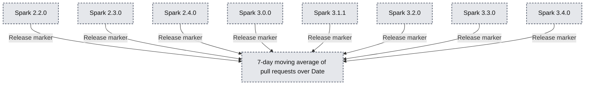

# Making Spark Accessible: My Databricks Summer Internship

- Source: https://www.databricks.com/blog/making-spark-accessible-my-databricks-summer-internship
- Published: 2023-09-26
- Authors: Amanda Liu
- Categories: engineering
- Images: 10 total, 1 extracted as architecture

My summer internship on the PySpark team was a whirlwind of exciting events. The PySpark team develops the Python APIs of the open source [Apache Spark](https://github.com/apache/spark) library and Databricks Runtime. Over the course of the 12 weeks, I drove a project to implement a [new built-in PySpark test framework](https://spark.apache.org/docs/latest/api/python/reference/pyspark.testing.html). I also contributed to an open source Databricks Labs project called [English SDK for Apache Spark](https://pyspark.ai/), which I presented in-person at the [2023 Data + AI Summit](https://www.databricks.com/dataaisummit/) (DAIS).

From improving the PySpark test experience to lowering the barrier of entry to Spark with English SDK, my summer was all about making Spark more accessible.

## PySpark Test Framework

My primary internship project focused on starting a built-in PySpark test framework ([SPARK-44042](https://issues.apache.org/jira/browse/SPARK-44042?jql=project%20%3D%20SPARK%20AND%20resolution%20%3D%20Unresolved%20AND%20text%20~%20%22test%20framework%22%20ORDER%20BY%20priority%20DESC%2C%20updated%20DESC)), and it is included in the upcoming Apache Spark release. The code is also available in the open source [Spark repo](https://github.com/apache/spark).

### Why a built-in test framework?

Prior to our built-in PySpark test framework, there was a lack of Spark-provided tools to help developers write their own tests. Developers could use blog posts and online forums, but it was difficult to piece together so many disparate resources. This project aimed to consolidate testing resources under the official Spark repository to simplify the PySpark developer experience.

The beauty of open source is that this is just the beginning! We are excited for the open source community to contribute to the test framework, improving the existing features and also adding new ones. Please check out the [PySpark Test Framework SPIP](https://docs.google.com/document/d/1OkyBn3JbEHkkQgSQ45Lq82esXjr9rm2Vj7Ih_4zycRc/edit#heading=h.f5f0u2riv07v) and [Spark JIRA board](https://issues.apache.org/jira/browse/SPARK-44042)!

### Key Features

**DataFrame Equality Test Util (**[**SPARK-44061**](https://issues.apache.org/jira/browse/SPARK-44061)**):** The **assertDataFrameEqual** util function allows for equality comparison between two DataFrames, or between lists of rows. Some configurable features include the ability to customize approximate precision level for float values, and the ability to choose whether to take row order into account. This util function can be useful for testing DataFrame transformation functions.

**Schema Equality Test Util (**[**SPARK-44216**](https://issues.apache.org/jira/browse/SPARK-44216)**):** The **assertSchemaEqual** function allows for comparison between two DataFrame schemas. The util supports nested schema types. By default, it ignores the "nullable" flag in complex types (StructType, MapType, ArrayType) when asserting equality.

**Improved Error Messages (**[**SPARK-44363**](https://issues.apache.org/jira/browse/SPARK-44363)**):** One of the most commonly occurring pain points amongst Spark developers is debugging confusing error messages.

Take the following error message for example, where I try asserting equality between unequal schemas using the built-in unittest assertEqual method. From the error message, we can tell that the schemas are unequal, but it's confusing to see exactly where they differ and how to correct them.

The new test util functions include detailed, color-coded test error messages, which clearly indicate differences between unequal DataFrame schemas and data in DataFrames.

## English SDK for Apache Spark

### Overview of English SDK

Something I learned this summer is that things move very quickly at Databricks. Sure enough, I spent much of the summer on a new project that was actually only started during the internship: the English SDK for Apache Spark!

The idea behind the English SDK is summed up by the tweet above from Reynold Xin, Chief Architect at Databricks and a co-founder of Spark. With recent advancements in generative AI, what if we can use English as a programming language and generative AI as the compiler to get PySpark and SQL code? By doing this, we lower the barrier of entry to Spark development, democratizing access to powerful data analytic tools. English SDK simplifies complex coding tasks, allowing data analysts to focus more on deriving data insights.

English SDK also has many powerful functionalities, such as generating plots, searching the web to ingest data into a DataFrame, and describing DataFrames in plain English.

For example, say I have a DataFrame called github_df with data about PRs in the OSS Spark repo. Say I want to see the average number of PRs over time, and how they relate to Spark release dates. All I have to do is ask English SDK:

And it returns the plot for me:

**Summary:** The chart compares the 7-day moving average of pull requests over time with annotated Spark release dates.

**Components:**
- Blue line: pull request moving average.
- Date axis: calendar years.
- Left axis, 7-day Average: pull request activity.
- Right axis, Spark Versions: numeric scale beside release markers.
- Red vertical markers: Spark releases 2.2.0, 2.3.0, 2.4.0, 3.0.0, 3.1.1, 3.2.0, 3.3.0, and 3.4.0.

**Flows:**
- Each Spark version label -> corresponding red marker: a downward arrow identifies the release.

**Numbers:**
- Averaging window: 7 days.
- Left-axis ticks: 5, 10, 15, 20, 25, 30.
- Right-axis ticks: 0, 2, 4, 6, 8, 10, 12, 14.
- Date ticks: 2015, 2016, 2017, 2018, 2019, 2020, 2021, 2022, 2023.
- Spark versions: 2.2.0, 2.3.0, 2.4.0, 3.0.0, 3.1.1, 3.2.0, 3.3.0, 3.4.0.

source image: https://www.databricks.com/sites/default/files/inline-images/db-702-blog-img-6.jpg

The English SDK project was unveiled at the [2023 Data + AI Summit](https://www.youtube.com/watch?v=yj7XlTB1Jvc&t=511s). If you're interested in learning more about it, please check out the [full blog post](https://www.databricks.com/blog/introducing-english-new-programming-language-apache-spark). This is also an ongoing open source project, and we welcome all contributions and feedback; just open an issue on the [GitHub repo](https://www.databricks.com/blog/introducing-english-new-programming-language-apache-spark#:~:text=English SDK at-,pyspark.ai,-today. Your insights)!

## Internship Experience

### DAIS Presentation

One of the coolest parts of my summer was [presenting a demo](https://www.youtube.com/watch?v=ZunjkL3L62o&t=73s) of the English SDK at the annual Databricks Data + AI Summit (DAIS). This year's event was held in San Francisco from June 26-29, and there were over 30,000 virtual and in-person attendees!

The conference was a multi-day event, and I also attended the other summit sessions. I attended keynote sessions (and was a bit starstruck seeing some speakers!), collected lots of Dolly-themed swag, and learned from world-class experts at other breakout sessions. The energy at the event was infectious, and I'm so grateful I had this experience.

### Open Source Design Process

Since the PySpark Test Framework was a new initiative, I saw the ins and outs of the software design process, from writing a design doc to attending customer meetings. I also got to experience unique aspects of the open source Apache Spark design process, including writing a Spark Project Improvement Proposals (SPIP) document and hosting online discussions about the initiative. I received lots of great feedback from the open source community, which helped me iterate on and improve the initial design. Thankfully, when the [voting period](https://spark.apache.org/improvement-proposals.html) came around, the initiative passed with ten +1s!

This internship project was a unique look into the full-time OSS developer experience, as it not only bolstered my technical coding skills but also soft skills, such as communication, writing, and teamwork.

### Team Bonding Events

The Spark OSS team is very international, with team members spanning across the world. Our team stand-up meetings were always very lively, and I loved getting to know everyone throughout the summer. Fortunately, I also got to meet many of my international team members in person during the week of DAIS!

My intern cohort also happened to become some of my favorite people ever. We all got really close over the summer, from eating lunch together at the office to exploring San Francisco on the weekends. Some of my favorite memories from the summer include hiking Lands End Trail, getting delicious dim sum in Chinatown, and taking a weekend trip to Yosemite.

## Conclusion

My 12-week internship at Databricks was an amazing experience. I was surrounded by exceptionally brilliant yet humble team members, and I'll always remember the many lessons they shared with me.

Special thanks to my mentor Allison Wang, my manager Xiao Li, and the entire Spark team for their invaluable mentorship and guidance. Thank you also to Hyukjin Kwon, Gengliang Wang, Matthew Powers, and Allan Folting, who I worked closely with on the English SDK for Apache Spark and PySpark Test Framework projects.

Most of my work from the summer is open source, so you can check it out if you're interested! (See: [Spark](https://github.com/apache/spark), [English SDK](https://pyspark.ai/))

If you want to work on cutting-edge projects alongside industry leaders, I highly encourage you to apply to work at Databricks! Visit the [Databricks Careers](https://www.databricks.com/company/careers) page to learn more about job openings across the company.
