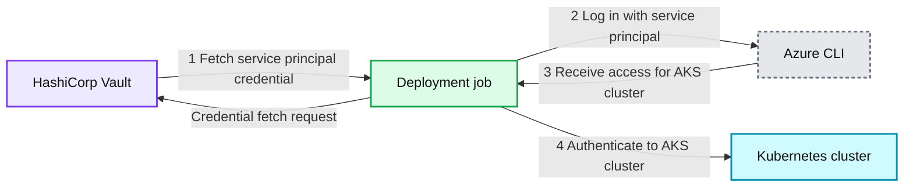
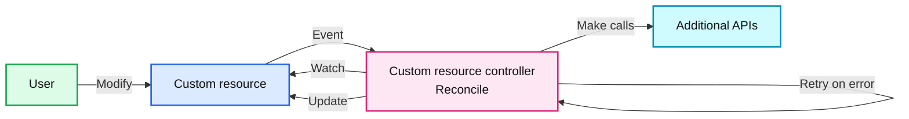
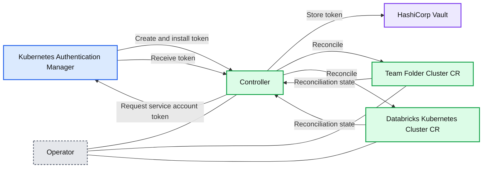
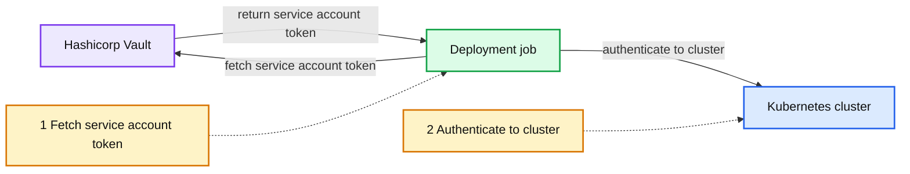

# Managing CI/CD Kubernetes Authentication Using Operators

- Source: https://www.databricks.com/blog/managing-cicd-kubernetes-authentication-using-operators
- Published: 2022-09-16
- Authors:  Albert Zhong
- Categories: engineering, data-engineering
- Images: 4 total, 4 extracted as architecture

This summer at Databricks, I interned on the Compute Lifecycle team in San Francisco. I built a Kubernetes operator that rotates service account tokens used by CI/CD deployment jobs to securely authenticate to our multi-cloud Kubernetes clusters. In this blog, I will explain how my project leverages the Kubernetes operator pattern to solve several pain points with cluster authentication.

## Background

Databricks heavily uses Kubernetes to orchestrate containerized workloads for product microservices and data-processing jobs. Today, we run thousands of Kubernetes clusters and manage millions of pods across hundreds of product microservices. We offer our product on top of multiple cloud providers: to support this, we operate a mix of self-managed and cloud-managed Kubernetes clusters (EKS, AKS, GKE). We create cloud-agnostic abstractions on top of these compute systems so that other Databricks engineers can build and deploy applications without needing to consider cloud-specific details.

Databricks deploys services and resources to these Kubernetes clusters via deployment jobs run by our CI/CD pipelines. Security is a key concern: we must ensure that only privileged users or jobs can access specific clusters.

## Problem

How do deployment jobs authenticate to Kubernetes clusters? For context, engineering teams own specific deployment jobs for each service. Each team has read access to their own cloud provider credentials in [Hashicorp Vault](https://www.vaultproject.io/). Previously, each team's job would fetch their cloud provider credentials in Vault to authenticate to a cloud-managed Kubernetes cluster. For example, to access an AKS cluster, a deployment job would fetch its team's Azure service principal credentials and authenticate via the Azure CLI. A similar authentication process exists for EKS clusters by using AWS IAM roles instead.

*Figure 1. Previous workflow for Kubernetes authentication from deployment jobs*

**Summary:** The diagram shows a deployment job retrieving Azure credentials from HashiCorp Vault, authenticating with Azure CLI, receiving AKS access, and authenticating to a Kubernetes cluster.

**Components:**

- HashiCorp Vault - credential store
- Deployment job - CI/CD deployment process
- Azure CLI - Azure authentication tool
- Kubernetes cluster - AKS target cluster

**Flows:**

- HashiCorp Vault -> Deployment job: service principal credential
- Deployment job -> HashiCorp Vault: credential fetch request
- Deployment job -> Azure CLI: Azure login with service principal
- Azure CLI -> Deployment job: AKS cluster access
- Deployment job -> Kubernetes cluster: cluster authentication

**Numbers:** 1, 2, 3, 4

source image: https://www.databricks.com/sites/default/files/inline-images/db-331-blog-img-1.png

Figure 1. Previous workflow for Kubernetes authentication from deployment jobs

This approach is not ideal for several reasons:

- **Cloud-specific** - deployment job scripts must maintain separate logic to handle cluster authentication for each cloud
- **Manual** - for every team that is onboarded to our deployment system, cloud provider credentials need to be manually created, stored, and rotated in Vault
- **Slow** - these setup steps take multiple engineering hours, and new teams must wait a few days of clock time before credentials are ready

We needed a better solution that would allow teams to quickly gain access to dynamically created clusters, and scale across multiple cloud providers in cloud-managed and self-managed clusters with minimal human interaction.

## Solution

Our proposal was to create a credential management service that automatically generates and rotates credentials for all teams and clusters. Instead of using cloud-specific credentials, we opted to use Kubernetes service account tokens: [JWTs](https://jwt.io/) used to authenticate to a Kubernetes cluster under a service account. [Service accounts](https://kubernetes.io/docs/tasks/configure-pod-container/configure-service-account/) are a natively supported concept in Kubernetes, which is compatible with both self-managed and cloud-managed Kubernetes clusters. These tokens are cloud-agnostic, short-lived, and dynamically created, which is a significant improvement over long-lived cloud provider credentials.

Our credential manager creates a unique service account token for each combination of a team and a Kubernetes cluster, and stores these tokens in Vault. In addition, this service dynamically creates tokens as new teams and clusters are added. This will allow deployment jobs to authenticate to Kubernetes clusters by fetching a cloud-agnostic service account token instead of a cloud provider credential from Vault.

## Kubernetes operator model

The [Kubernetes operator pattern](https://kubernetes.io/docs/concepts/extend-kubernetes/operator/) provides a powerful, declarative API for managing complex infrastructure. Databricks already runs many controllers managing [Custom Resources](https://kubernetes.io/docs/concepts/extend-kubernetes/api-extension/custom-resources/) to govern various objects in our infrastructure stack. One example is a DatabricksKubernetesCluster - an abstraction for an internal Kubernetes cluster that may be hosted on Azure, AWS, or GCP. At Databricks, we leverage the Go [Kubebuilder SDK](https://book.kubebuilder.io/) to handle common operator scaffolding such as defining custom resources, implementing control loops, and interfacing with the Kubernetes API.

*Figure 2. Kubernetes operator model*

**Summary:** The diagram shows a Kubernetes operator reconciling a custom resource and calling additional APIs.

**Components:**

- User - Kubernetes user
- Custom resource - Kubernetes custom resource
- Custom resource controller - Kubebuilder-based Kubernetes controller with a reconcile loop
- Additional APIs - External APIs called by the controller

**Flows:**

- User -> Custom resource: Modify
- Custom resource -> Custom resource controller: Event
- Custom resource controller -> Custom resource: Watch
- Custom resource controller -> Custom resource: Update
- Custom resource controller -> Additional APIs: Make calls
- Custom resource controller -> Custom resource controller: Retry on error

**Numbers:** none

source image: https://www.databricks.com/sites/default/files/inline-images/db-331-blog-img-2.png

Figure 2. Kubernetes operator model

## Rotating tokens with an operator

Our solution fits a declarative model: we want to specify what teams and clusters exist, and the operator should create the corresponding service account tokens. Each team has some desired state (what clusters they want to authenticate to) and current state (what clusters they can authenticate to via a token). To model this, we created a TeamFolderCluster custom resource that represents the edge between a team and a Kubernetes cluster they wish to authenticate to.

Figure 3: example of a CustomResource

Today, an existing internal service, Kubernetes Authentication Manager, creates and manages service accounts and service account tokens on target clusters, and this service is already used for just-in-time access for human users to Kubernetes clusters. When a TeamFolderCluster is reconciled, the new controller calls the Kubernetes Authentication Manager to create a new token if the previous one has expired. After creation, the controller stores the token in Vault. The controller always schedules another reconciliation when the token should be rotated, which is directly computed from the tokenCreationTime status field. Since all custom resources are reconciled at least once on controller bootup, this pattern ensures that token rotation is robust to controller crashes.

*Figure 4: Operator architecture*

**Summary:** The diagram shows an operator coordinating Kubernetes service account token creation, retrieval, rotation, and storage in HashiCorp Vault.

**Components:**

- Kubernetes Authentication Manager: Kubernetes authentication service
- Controller: Operator reconciliation controller
- Team Folder Cluster CR: Custom resource for team folder clusters
- Databricks Kubernetes Cluster CR: Custom resource for Databricks Kubernetes clusters
- HashiCorp Vault: Secure token storage
- Operator: Kubernetes operator hosting the controller and custom resources

**Flows:**

- Controller -> Kubernetes Authentication Manager: Request service account token for a team and cluster
- Kubernetes Authentication Manager -> target cluster: Create and install service account token
- Kubernetes Authentication Manager -> Controller: Return token
- Controller -> HashiCorp Vault: Store token
- Team Folder Cluster CR -> Controller: Reconciliation state and desired configuration
- Controller -> Team Folder Cluster CR: Reconcile custom resource
- Databricks Kubernetes Cluster CR -> Controller: Reconciliation state and desired configuration
- Controller -> Databricks Kubernetes Cluster CR: Reconcile custom resource

**Numbers:** 1, 2, 3, 4

source image: https://www.databricks.com/sites/default/files/inline-images/db-331-blog-img-3.png

Figure 4: Operator architecture

Once the token is stored in Vault, deployment jobs can simply authenticate to any cluster:

*Figure 5: New workflow for Kubernetes authentication from deployment jobs*

**Summary:** The diagram shows a deployment job fetching a service account token from Hashicorp Vault and using it to authenticate to a Kubernetes cluster.

**Components:**

- Hashicorp Vault: secret storage
- Deployment job: CI/CD deployment process
- Kubernetes cluster: target Kubernetes environment
- Fetch service account token: token retrieval step
- Authenticate to cluster: cluster authentication step

**Flows:**

- Deployment job -> Hashicorp Vault: fetch service account token
- Hashicorp Vault -> Deployment job: return service account token
- Deployment job -> Kubernetes cluster: authenticate to cluster

**Numbers:** 1, 2

source image: https://www.databricks.com/sites/default/files/inline-images/db-331-blog-img-4.png

Figure 5: New workflow for Kubernetes authentication from deployment jobs

## Conclusion

After we launched the operator, CI/CD deployment jobs can simply fetch service account tokens from Vault and use those tokens to deploy to Kubernetes clusters. The process to create and rotate the tokens is completely automated, even as new clusters and teams are dynamically added. In our engineering development environment alone, our service rotates thousands of tokens for hundreds of clusters on an hourly basis. Using short-lived, cloud-agnostic service account tokens improved our security, reduced complexity, and saved many engineering hours of manual setup.

I had an amazing time interning at Databricks. Diving into the details of Kubernetes, networking, and security has left me with a much deeper understanding of how to build and deploy software at scale. Having the opportunity to indepedently drive the project forward, make design tradeoffs, and collaborate with multiple teams has greatly improved my skills and confidence as a software engineer. Coworkers were friendly, passionate, and continuously gave me great feedback on ways to improve. I want to thank everyone at Databricks and the Compute Lifecycle team, and especially my mentor Austin for providing excellent support to help me grow as an engineer.
