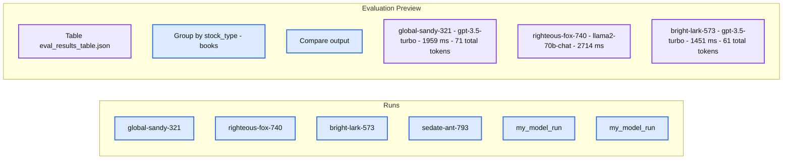
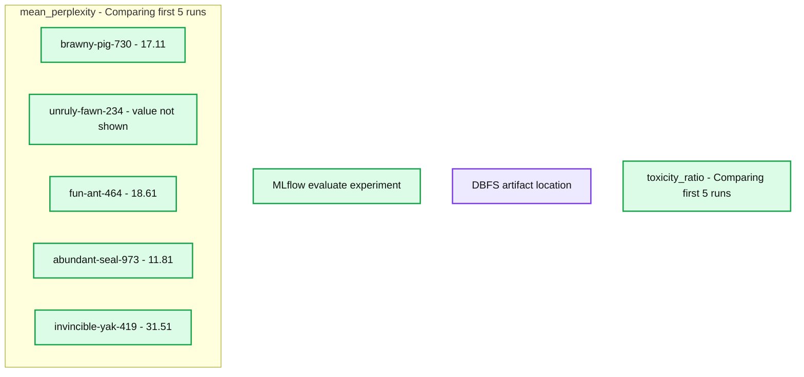

# Introducing MLflow 2.7 with new LLMOps capabilities

*New UI for Prompt Engineering and AI Gateway updates*

- Source: https://www.databricks.com/blog/mlflow-2-7-llmops-prompt-eng-ai-gateway-updates
- Published: 2023-09-14
- Authors: Corey Zumar, Kasey Uhlenhuth, Ridhima Gupta
- Categories: machine-learning, engineering
- Images: 3 total, 2 extracted as architecture

As part of MLflow 2’s support for LLMOps, we are excited to introduce the latest updates to support prompt engineering in MLflow 2.7. 

**Assess LLM project viability with an interactive prompt interface**
 Prompt engineering is a great way to quickly assess if a use case can be solved with a large language model (LLM). With the [new prompt engineering UI](https://mlflow.org/docs/latest/llms/prompt-engineering.html) in MLflow 2.7, business stakeholders can experiment with various base models, parameters, and prompts to see if outputs are promising enough to start a new project. Simply create a new Blank Experiment or (open an existing one) and click “New Run” to access the interactive prompt engineering tool. Sign up to join the preview [here](https://forms.gle/RrNrrSQrzfeZ4a4t7). 
  

**Automatically track prompt engineering experiments to build evaluation datasets and identify best model candidates**
 In the new prompt engineering UI, users can explicitly track an evaluation run by clicking “Create run” to log results to MLflow. This button tracks the set of parameters, base models, and prompts as an MLflow model and outputs are stored in an evaluation table. This table can then be used for manual evaluation, converted to a Delta table for deeper analysis in SQL, or be used as the test dataset in a CI/CD process. 

**Summary:** MLflow compares generated bookstore prompts across evaluation runs, showing model names, latency, and token counts.

**Components:**
- Evaluation Preview: MLflow evaluation interface.
- `eval_results_table.json`: evaluation results table.
- `stock_type`: grouping field with the value `books`.
- `global-sandy-321`: output from `gpt-3.5-turbo`.
- `righteous-fox-740`: output from `llama2-70b-chat`.
- `bright-lark-573`: output from `gpt-3.5-turbo`.
- `sedate-ant-793`: additional run whose output column is partially cropped.
- `my_model_run`: two additional runs listed in the sidebar.
- Filter, grouping, comparison, and evaluation controls: UI controls for inspecting results.

**Flows:**
- none. No arrows are visible.

**Numbers:**
- Search filter: `metrics.rmse < 1`.
- Run-name suffixes: `321`, `740`, `573`, `793`.
- Model identifiers: `gpt-3.5-turbo`, `llama2-70b-chat`; a cropped model label shows `gpt-3.`.
- `global-sandy-321`: `1959 ms`, `71 total tokens`.
- `righteous-fox-740`: `2714 ms`.
- `bright-lark-573`: `1451 ms`, `61 total tokens`.

source image: https://www.databricks.com/sites/default/files/inline-images/image3_4.png

 MLflow is always adding more metrics in the MLflow Evaluation API to help you identify the best model candidate for production, now including toxicity and perplexity. Users can use the MLflow Table or Chart view to compare model performances:

**Summary:** MLflow compares mean perplexity across experiment runs, with a toxicity ratio chart partially visible below.

**Components:**

- mlflow.evaluate(): MLflow experiment evaluation interface.
- Chart view: MLflow visualization for comparing runs.
- mean_perplexity: Metric chart comparing the first five runs.
- brawny-pig-730: MLflow run with mean perplexity 17.11.
- unruly-fawn-234: MLflow run with no visible perplexity bar or value.
- fun-ant-464: MLflow run with mean perplexity 18.61.
- abundant-seal-973: MLflow run with mean perplexity 11.81.
- invincible-yak-419: MLflow run with mean perplexity 31.51.
- toxicity_ratio: MLflow metric chart whose values are outside the visible area.
- Artifact Location: DBFS path `dbfs:/databricks/mlflow-tracking/2695211906659633`.

**Flows:**

- none. No arrows are visible.

**Numbers:**

- Experiment ID and artifact path identifier: `2695211906659633`.
- Run name suffixes: `730`, `234`, `464`, `973`, `419`.
- Mean perplexity values: `17.11`, `18.61`, `11.81`, `31.51`.
- Horizontal axis ticks: `0`, `5`, `10`, `15`, `20`, `25`, `30`.
- Both chart subtitles: comparing first `5` runs.
- Search placeholder: `metrics.rmse < 1`.
- No units or percentages are shown.

source image: https://www.databricks.com/sites/default/files/inline-images/image2_5.png

Because the set of parameters, prompts, and base models are logged as MLflow models, this means you can deploy a fixed prompt template for a base model with set parameters in batch inference or serve it as an API with Databricks Model Serving. For LangChain users this is especially useful as MLflow comes with model versioning. 

**Democratize ad-hoc experimentation across your organization with guardrails**
 The MLflow prompt engineering UI works with any [MLflow AI Gateway](https://www.databricks.com/blog/announcing-mlflow-ai-gateway) route. AI Gateway routes allow your organization to centralize governance and policies for SaaS LLMs; for example, you can put OpenAI’s GPT-3.5-turbo behind a Gateway route that manages which users can query the route, provides secure credential management, and provides rate limits. This protects against abuse and gives platform teams confidence to democratize access to LLMs across their org for experimentation. 

The MLflow AI Gateway supports OpenAI, Cohere, Anthropic, and Databricks Model Serving endpoints. However, with generalized open source LLMs getting more and more competitive with proprietary generalized LLMs, your organization may want to quickly evaluate and experiment with these open source models. You can now also call [MosaicML’s hosted Llama2-70b-chat](https://www.mosaicml.com/blog/llama2-inference).

**Try MLflow today for your LLM development!**
 We are working quickly to support and standardize the most common workflows for LLM development in MLflow. Check out this demo notebook to see how to use MLflow for your use cases. For more resources:

- Sign up for the MLflow AI Gateway Preview (includes the prompt engineering UI) [here](https://forms.gle/RrNrrSQrzfeZ4a4t7).
- To get started with the prompt engineering UI, simply upgrade your MLflow version (pip install –upgrade mlflow), create an MLflow Experiment, and click “New Run”. 
- To evaluate various models on the same set of questions, use the [MLflow Evaluation API](https://mlflow.org/docs/latest/models.html#evaluating-with-llms). 
- If there is a SaaS LLM endpoint you want to support in the [MLflow AI Gateway](https://www.databricks.com/blog/announcing-mlflow-ai-gateway), follow the [guidelines for contribution](https://github.com/mlflow/mlflow/blob/master/CONTRIBUTING.md) on the MLflow repository. We love contributions!
