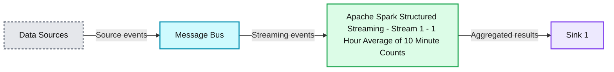

# Multiple Stateful Operators in Structured Streaming

- Source: https://www.databricks.com/blog/multiple-stateful-operators-structured-streaming
- Published: 2023-08-07
- Authors: Angela Chu, Jungtaek Lim
- Categories: engineering, data-engineering
- Images: 2 total, 2 extracted as architecture

In the world of data engineering, there are operations that have been used since the birth of ETL. You filter. You join. You aggregate. Finally, you write the result. While these data operations have remained the same over time, the range of latency and throughput requirements has changed dramatically. Processing a few events at a time or a couple gigabytes a day will no longer do. To satisfy today's business requirements, terabytes or even petabytes of data need to be processed each day, with job latencies measured in minutes and seconds.

Structured Streaming in Apache SparkTM is the leading open source stream processing engine, optimized for large data volumes and low latency, and it is the core technology that makes the [Databricks Lakehouse](https://docs.databricks.com/structured-streaming/index.html) the best [platform for streaming](https://www.databricks.com/product/data-streaming). Thanks to the enhanced functionality being delivered with [Project Lightspeed](https://www.databricks.com/blog/project-lightspeed-update-advancing-apache-spark-structured-streaming), now you can perform all of these classic data operations within a single stream.

Starting in Databricks Runtime 13.1 and the upcoming Apache SparkTM 3.5.0 release, a stream can contain multiple stateful operators. There is no longer a need to write out to a sink after a join, then read the data back into another stream to aggregate. Performing joins and aggregations within one stream instead of breaking it into multiple reduces complexity, latency, and cost. In this post we'll give a brief overview of some stateful streaming concepts, and then we'll dive right into examples of this exciting feature!

## What are Stateful Operators?

Structured Streaming performs operations on small batches of data at a time, referred to as microbatches. Operators in Structured Streaming can be broken down into two categories - state*less* and state*ful*.

Stateless streams perform operations that do not need to know anything about the data that came in previous microbatches. Filtering records to only retain rows with values greater than 10, for example, is stateless because it does not require knowledge of any data besides what is being worked on at the moment.

Stateful streams are performing operations that need more information besides what is in the current microbatch. If you want to calculate a count of values over 5-minute windows, for example, Structured Streaming needs to save the running count for each key in the aggregation for 5 minutes-worth of records, no matter how many microbatches the records are spread across. This saved data is referred to as state, and operators that require saving state are stateful operators. The most common stateful operators you'll see are aggregations, joins and deduplication.

## What are Watermarks?

All stateful operators in Structured Streaming require you to specify a watermark. A watermark gives you control over two things - the allowed lateness of the data and how long to retain state.

Say we're processing a dataset where each of the records contains an event timestamp, and we're aggregating over 5-minute windows based on that timestamp. What if some records arrive out of order? If a record with a timestamp of 12:04 arrives after we've processed records with a timestamp of 12:11, do we want to go back and include that record in the 12:00-12:05 aggregation? How long do we want to accept late data and keep the state for that 12:00-12:05 window around? We don't want to keep state data forever - if we don't regularly purge it, the state data can eventually fill up memory and cause performance degradation. This is where watermarks come in.

By using the .withWatermark setting, you can specify how many seconds, minutes, hours or days late the records are allowed to be, and consequently enable Structured Streaming to know when records stored in state are no longer needed. In this example, we're specifying that data will be accepted up to 10 minutes late, based on the event_timestamp column in the data:

Structured Streaming calculates and saves a watermark timestamp at the end of each microbatch by taking the latest event timestamp that it received and subtracting the time interval specified in the withWatermark setting. At the beginning of each microbatch it compares the event timestamps of the incoming records and the data currently in state with the watermark timestamps. Input records and state with timestamps that are earlier than the watermark values are dropped.

This watermarking mechanism is what allows Structured Streaming to properly handle late records and state regardless of how many stateful operators are in a single stream. You will see watermarks in use in the examples below.

## Examples

Now that you have the general idea of what stateful operators are, we can show some of them in action. Let's go over a couple examples of how to use multiple stateful operators in the same stream.

### Chained time window aggregations

In this example, we're receiving a stream of raw events. We want to count the number of events that occurred every 10 minutes by user, and then average those counts by hour before writing out the result. This will require chaining two windowed aggregations.

First we read in our source data using a standard readStream call, which is in the format of `userId, eventTimestamp`:

Any of the streaming sources that come with Structured Streaming can be used here.

Next, we perform our first windowed aggregation on `userId`. In addition to defining the timestamp column to base our window on and the window length, we need to define a watermark to tell Structured Streaming how long to wait for late data before emitting a result and dropping the state. We've decided data can be up to one minute late. Here is the code:

When doing a windowed aggregation, Structured Streaming automatically creates a window column in the result. This window column is a struct with the start and end timestamps that define the window. After an hour, the output for `userId` 1 and 2 looks something like this:

| window | userId | count |
|---|---|---|
| {"start": "2023-06-02T11:00:00", "end": "2023-06-02T11:10:00"} | 1 | 12 |
| {"start": "2023-06-02T11:00:00", "end": "2023-06-02T11:10:00"} | 2 | 7 |
| {"start": "2023-06-02T11:10:00", "end": "2023-06-02T11:20:00"} | 1 | 8 |
| {"start": "2023-06-02T11:10:00", "end": "2023-06-02T11:20:00"} | 2 | 16 |
| {"start": "2023-06-02T11:20:00", "end": "2023-06-02T11:30:00"} | 1 | 5 |
| {"start": "2023-06-02T11:20:00", "end": "2023-06-02T11:30:00"} | 2 | 10 |
| {"start": "2023-06-02T11:30:00", "end": "2023-06-02T11:40:00"} | 1 | 15 |
| {"start": "2023-06-02T11:30:00", "end": "2023-06-02T11:40:00"} | 2 | 6 |
| {"start": "2023-06-02T11:40:00", "end": "2023-06-02T11:50:00"} | 1 | 9 |
| {"start": "2023-06-02T11:40:00", "end": "2023-06-02T11:50:00"} | 2 | 19 |
| {"start": "2023-06-02T11:50:00", "end": "2023-06-02T12:00:00"} | 1 | 11 |
| {"start": "2023-06-02T11:50:00", "end": "2023-06-02T12:00:00"} | 2 | 17 |

In order to take these counts and average them by hour, we'll need to define another windowed aggregation using timestamps from the above window column. Before we enabled multiple stateful operators, at this point you would have had to write out the above result to a sink with a writeStream, then read the data into a new stream to perform the second aggregation, as shown in the following diagram.

*Without Multiple Stateful Operators*

**Summary:** Two separate Apache Spark Structured Streaming jobs compute 10-minute counts and then a 1-hour average, with an intermediate sink between them.

**Components:**
- Data Sources: input sources, technology unspecified.
- Message Bus: messaging infrastructure, technology unspecified.
- Stream 1: Apache Spark Structured Streaming computing 10 Minute Count.
- Sink 1: storage sink with a technology logo but no technology name.
- Stream 2: Apache Spark Structured Streaming computing 1 Hour Average of 10 Minute Counts.
- Sink 2: storage sink with the same unnamed technology logo.

**Flows:**
- Data Sources -> Message Bus: source data.
- Message Bus -> Stream 1: streaming input.
- Stream 1 -> Sink 1: 10-minute counts.
- Sink 1 -> Stream 2: counts for hourly aggregation.
- Stream 2 -> Sink 2: 1-hour averages of 10-minute counts.

**Numbers:**
- Stream 1 and Sink 1: identifier 1.
- Stream 2 and Sink 2: identifier 2.
- Stream 1 aggregation: 10 Minute Count.
- Stream 2 aggregation: 1 Hour Average of 10 Minute Counts.

```mermaid
%% Separate Spark streams compute counts and hourly averages through an intermediate sink
flowchart LR
    A[Data Sources] -->|Source data| B[Message Bus]
    B -->|Streaming input| C[Stream 1 - Apache Spark Structured Streaming - 10 Minute Count]
    C -->|10-minute counts| D[Sink 1]
    D -->|Stored counts| E[Stream 2 - Apache Spark Structured Streaming - 1 Hour Average of 10 Minute Counts]
    E -->|Hourly averages| F[Sink 2]

    classDef client fill:#dbeafe,stroke:#2563eb,stroke-width:2px,color:#111
    classDef service fill:#dcfce7,stroke:#16a34a,stroke-width:2px,color:#111
    classDef store fill:#ede9fe,stroke:#7c3aed,stroke-width:2px,color:#111
    classDef cache fill:#fef3c7,stroke:#d97706,stroke-width:2px,color:#111
    classDef queue fill:#cffafe,stroke:#0891b2,stroke-width:2px,color:#111
    classDef critical fill:#fee2e2,stroke:#dc2626,stroke-width:4px,color:#111
    classDef external fill:#e5e7eb,stroke:#6b7280,stroke-width:2px,color:#111,stroke-dasharray:4 3
    classDef decision fill:#fce7f3,stroke:#db2777,stroke-width:2px,color:#111

    class A external
    class B queue
    class C,E service
    class D,F store
```

source image: https://www.databricks.com/sites/default/files/inline-images/db-698-blog-img-1.png

Without Multiple Stateful Operators

Thanks to this new feature, you can now chain both operations *in the same stream.*

*With Multiple Stateful Operators*

**Summary:** Data sources feed a message bus and one Apache Spark Structured Streaming pipeline that computes a 1 hour average of 10 minute counts before writing to Sink 1.

**Components:**
- Data Sources: source technologies are not named.
- Message Bus: messaging technology is not specified.
- Stream 1: Apache Spark Structured Streaming performs the chained aggregations.
- Sink 1: destination represented by a logo, with no technology name shown.

**Flows:**
- Data Sources -> Message Bus: source events.
- Message Bus -> Stream 1: streaming events for aggregation.
- Stream 1 -> Sink 1: aggregated results.

**Numbers:**
- Stream 1.
- 1 Hour Average.
- 10 Minute Counts.
- Sink 1.

source image: https://www.databricks.com/sites/default/files/inline-images/db-698-blog-img-2.png

With Multiple Stateful Operators

To allow you to easily chain windowed aggregations, we've added convenient new syntax so that you can pass the window column created from the previous aggregation directly to the window function. You can see the `eventCount.window` column being passed in the code below. The window function will now properly interpret the struct in the window column and allow you to create another window with it. Here is the second aggregation, which defines an hour window and averages the counts. Note another watermark does not need to be defined, since we're only working with one input source and its watermark was specified before the previous aggregation:

After our second aggregation, the data for `userId` 1 and 2 would look like this:

| window | userId | avg |
|---|---|---|
| {"start": "2023-06-02T11:00:00", "end": "2023-06-02T12:00:00"} | 1 | 10 |
| {"start": "2023-06-02T11:00:00", "end": "2023-06-02T12:00:00"} | 2 | 12.5 |

Finally, we write the DataFrame out to a sink using writeStream. In this example we're writing to a Delta table:

Any sink that supports the "append" output mode is supported. Since we're using append mode, the data is not written to the sink for a given window until the window closes. The window will not close until the watermark value is later than the end of the window definition plus the allowed lateness time. For the example hour window above, when we start receiving data with an event timestamp later than 12:01, the watermark value will be later than the end of the defined window plus the minute of allowed lateness. That will cause the window to close and the data to be emitted to the sink. The calculation of the watermark is not related to the clock time - it is based on the event timestamps in the data that we're receiving.

### Stream-stream time interval join with a windowed aggregation

In this example, we're joining two streams together and then aggregating over a one hour window. We want to join the stream containing click data with the stream containing ad impressions, and then count the number of clicks per ad each hour.

A stream-stream join is also a stateful operator. Records are kept in state for both join datasets because matching records can come from different microbatches. We want Structured Streaming to drop state records after a period of time so that the state doesn't grow indefinitely and cause memory and performance issues. In order for that to happen, watermarks must be defined on each input stream and a time interval clause must be added to the join condition.

First, we read in each dataset and apply a watermark. The watermarks for the two streams do not have to specify the same time interval. In this example we are allowing impressions to arrive up to 2 hours late and clicks up to 3 hours late:

Now we join the two input streams together. Here is the code:

Note the time interval clause - this is saying that a click must occur within 0 seconds to 1 hour after the ad impression in order for it to be included in the resulting join set. This time constraint is also allowing Structured Streaming to determine when rows are no longer needed in state.

Once we have the joined dataset, we can count the clicks that occurred during each hour for each ad. You do not have to specify another watermark or add anything additional to the aggregation function - the second stateful operator just works!

Finally, write out the result. The writeStream syntax is the same as in the previous example, just with a different query name, output location and checkpoint location.

## Benefits

So just how does chaining multiple stateful operators reduce complexity, latency and cost? Let's use the above stream-stream join followed by a windowed aggregation as an example.

Before this feature each stateful operator required its own stream, so there would be a stream for the join and a second stream for the windowed aggregation that used the output of the first stream as its input. Even if both streams were running on the same Spark cluster each stream would have its own overhead, such as checkpointing offset and commit logs and tracking metrics for plotting on the Spark UI. The first stream would read in the source data, join it and write it out to a sink on external storage. Then the second stream would read the joined data back in, do the windowed aggregation and write the result out to another sink. The streams would both have to be monitored, and the dependency between them would have to be managed any time there was a logic change in either stream.

Now that multiple stateful operators can be combined, both the join and the windowed aggregation can be in the same stream.

- Complexity is reduced because now there is only one stream to monitor and no dependencies between streams to manage. Also since only one dataset is being saved there is less data to govern.
- Latency is reduced because both the write of the intermediate dataset after the join and the read of that dataset before the windowed aggregation are eliminated.
- Cost is reduced because the elimination of the intermediate write and read and the reduction of the streaming overhead reduce the amount of compute that is required. Any storage costs for the intermediate dataset are also eliminated.

Think about how much complexity, latency and cost would be reduced if you have three, four or five stateful operators!

## Additional Considerations

When using multiple stateful operators in a single stream, there are several things you need to keep in mind.

- First, you must use the "append" output mode. The "update" and "complete" output modes cannot be used, even if the destination sink supports them. Since you're using append mode, output will not be written to the sink for a windowed aggregation until the window end timestamp is less than the watermark. An unmatched outer join row will not be written until its event timestamp is less than the watermark.
- Next, the mapGroupsWithState, flatMapGroupsWithState and applyInPandasWithState operators can only be combined with other stateful operators if the arbitrary stateful operator is the *last* one in the stream. If you need to perform other stateful operations *after* mapGroupsWithState, flatMapGroupsWithState or applyInPandsWithState, you must write out your arbitrary stateful operations to a sink first, then use other stateful operators in a second stream.
- Finally, remember that this is stateful streaming, so whether you're using one or multiple stateful operators in your stream the same [best practices](https://docs.databricks.com/structured-streaming/stateful-streaming.html#recommended-configurations-for-stateful-structured-streaming-on-databricks) apply. If you are saving a lot of state, consider using [RocksDB](https://docs.databricks.com/structured-streaming/rocksdb-state-store.html) for state management since it can maintain 100 times more state keys than the default mechanism. When running on the [Databricks Lakehouse Platform](https://docs.databricks.com/structured-streaming/index.html), you can also improve stateful streaming performance by using [asynchronous checkpoints](https://www.databricks.com/blog/2022/05/02/speed-up-streaming-queries-with-asynchronous-state-checkpointing.html) and [state rebalancing](https://www.databricks.com/blog/state-rebalancing-structured-streaming).

## Conclusion

To satisfy today's business requirements, it's becoming necessary to process larger volumes of data faster than ever before. With [Project Lightspeed](https://www.databricks.com/blog/project-lightspeed-update-advancing-apache-spark-structured-streaming) Databricks is continually improving all aspects of Structured Streaming - latency, functionality, connectors, and simplicity of deployment and monitoring. This latest enhancement in functionality now allows users of Structured Streaming to have multiple stateful operators within a single stream, which reduces latency, complexity and cost. Try it out today on the [Databricks Lakehouse Platform](https://docs.databricks.com/structured-streaming/index.html) in runtime 13.1 and above, or in the upcoming Apache SparkTM 3.5.0 release!
