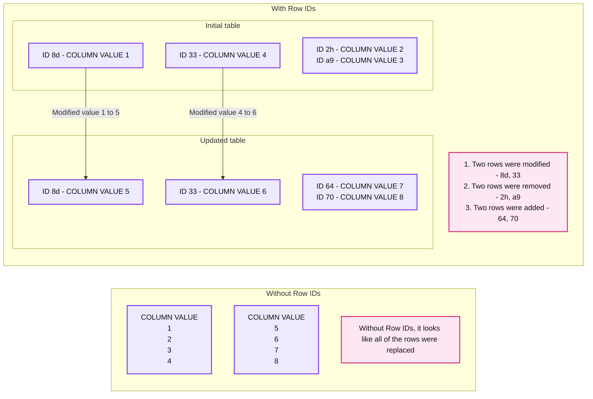
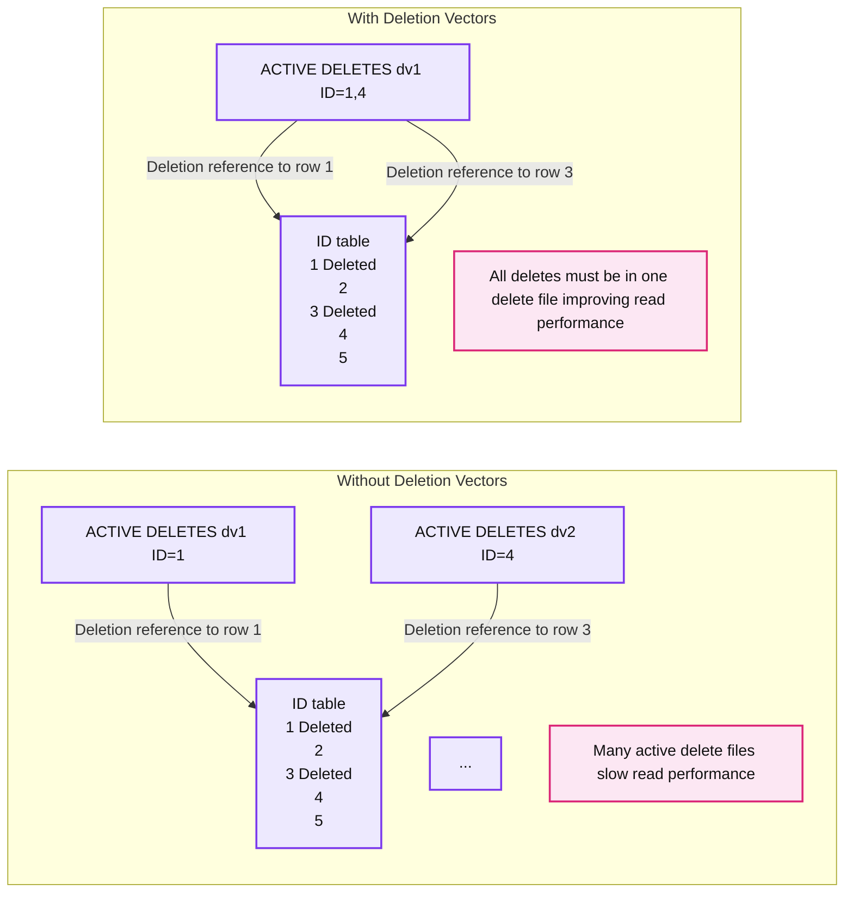
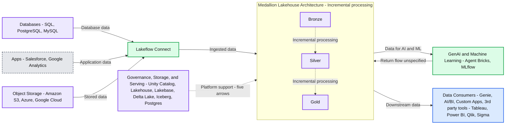
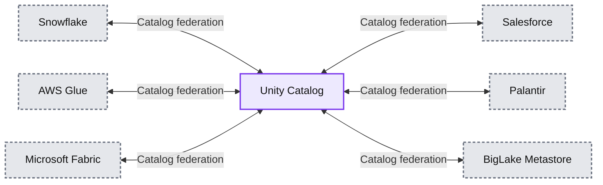
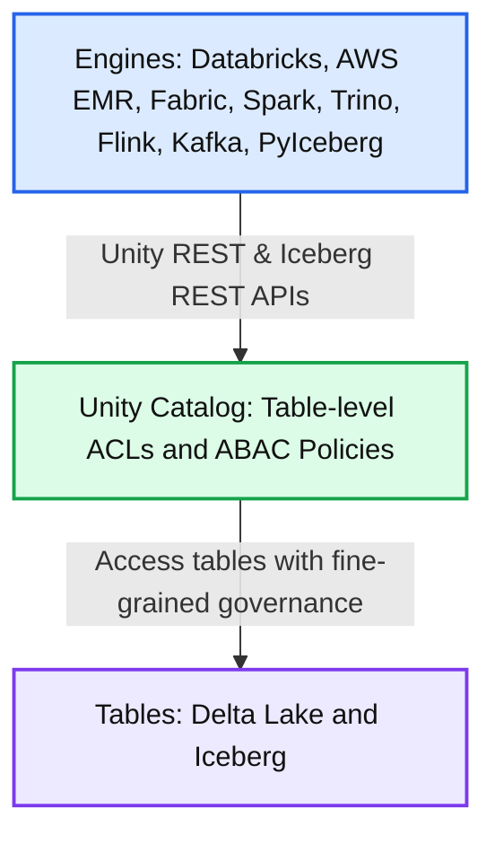

# The next era of the open lakehouse: Apache Iceberg™ v3 in Public Preview on Databricks

*Full performance. Full interoperability. No tradeoffs.*

- Source: https://www.databricks.com/blog/next-era-open-lakehouse-apache-icebergtm-v3-public-preview-databricks
- Published: 2026-04-09
- Authors: Ryan Blue, Daniel Weeks, Jason Reid, Benjamin Mathew, Hao Jiang
- Categories: platform, product, engineering, open-source
- Images: 6 total, 6 extracted as architecture

**Key takeaways**

- • Unity Catalog is the central hub of your Iceberg ecosystem - no matter which engines or catalogs your team uses, every tool reads the same data with consistent, fine-grained governance • Iceberg v3 introduces Row Lineage, Deletion Vectors, and VARIANT, enabling high-performance incremental processing and semi-structured data workloads • Iceberg v3 ends the performance vs. interoperability tradeoff: Deletion Vectors, Row Lineage, and VARIANT are part of the open specification, so data teams get these performance gains without sacrificing cross-engine compatibility

Today, **Databricks’s support of Iceberg v3 enters Public Preview**, unlocking the latest innovations from the Iceberg community natively on the open lakehouse. 

Iceberg v3 marks a major step forward for open table formats, unlocking use cases across incremental data processing and semi-structured data analysis which previously required brittle workarounds. Beyond this, Iceberg v3 represents a significant technological innovation by further unifying the data layer of Iceberg and Delta Lake, eliminating the need to rewrite data when building interoperable pipelines.

Here’s what’s new in Iceberg v3, why it matters, and why Databricks is the best place to run your lakehouse.

## What’s new in Iceberg v3?

Unity Catalog [Managed Iceberg](https://docs.databricks.com/aws/en/iceberg/) v3 tables support Row Lineage, Deletion Vectors, and VARIANT, unlocking new use cases and significant performance benefits. Databricks can also interoperate with these features on [foreign Iceberg tables](https://docs.databricks.com/aws/en/tables/foreign) (Iceberg tables registered in other catalogs), enabling customers to build agents and AI applications against their data, regardless of where it lives.

### Incremental Processing at Scale: Row Lineage and Deletion Vectors

Most data arrives as a stream of changes (INSERTs, UPDATEs, MERGEs, DELETEs) rather than in batches, typically sourced from operational databases, event streams, and third-party APIs. Historically, processing these changes required solving two hard problems:

1. Identifying which rows changed in bronze datasets
2. Applying those changes efficiently to silver/gold datasets

Teams usually resorted to full table scans or external CDC systems to detect changes, and expensive file rewrites to apply them. This resulted in pipelines that were slow, costly to maintain, and prone to drift and data silos.

Now, **row lineage** allows teams to quickly identify which rows changed. Every row in an Iceberg v3 table carries a permanent *row ID* and a sequence number reflecting when the row was last modified.

**Summary:** Row IDs distinguish modified, removed, and added rows between two table states, while column values alone make all rows appear replaced.

**Components:**

- Without Row IDs, initial table: COLUMN VALUE contains 1, 2, 3, 4; technology unspecified.
- Without Row IDs, updated table: COLUMN VALUE contains 5, 6, 7, 8; technology unspecified.
- With Row IDs, initial table: ID and COLUMN VALUE contain 8d: 1, 2h: 2, a9: 3, 33: 4; technology unspecified.
- With Row IDs, updated table: ID and COLUMN VALUE contain 8d: 5, 33: 6, 64: 7, 70: 8; technology unspecified.
- Without Row IDs annotation: all rows appear replaced.
- With Row IDs annotation: two rows modified, two removed, and two added.

**Flows:**

- Initial row 8d -> Updated row 8d: retained ID links value 1 to modified value 5.
- Initial row 33 -> Updated row 33: retained ID links value 4 to modified value 6.

**Numbers:** Column values: 1, 2, 3, 4, 5, 6, 7, 8. Row IDs: 8d, 2h, a9, 33, 64, 70. Enumerated annotations: 1, 2, 3. Counts: two rows modified, two rows removed, two rows added.



<sub>source image: https://www.databricks.com/sites/default/files/inline-images/image3_77.png</sub>

Additionally, **deletion vectors** make applying changes to datasets more performant than ever. Deletion vectors allow Iceberg to track which rows have been logically deleted without immediately rewriting the underlying data files. Instead of physically deleting rows by rewriting large Parquet files, the engine writes a lightweight delete file alongside the data. The result is data manipulation performance that is up to **10x faster** than the traditional copy-on-write approach.

**Summary:** Deletion vectors consolidate active deletes into one delete file to improve read performance compared with multiple active delete files.

**Components:**
- Without Deletion Vectors: active delete files labeled `dv1 (ID=1)` and `dv2 (ID=4)`, with an ellipsis indicating more files.
- Left ID table: rows 1 through 5, with rows 1 and 3 marked Deleted.
- With Deletion Vectors: one active delete file labeled `dv1 (ID=1,4)`.
- Right ID table: rows 1 through 5, with rows 1 and 3 marked Deleted.
- Performance labels: many active delete files slow read performance; consolidating deletes into one file improves read performance.

**Flows:**
- Left dv1 -> Left row 1: deletion reference.
- Left dv2 -> Left row 3: deletion reference, although the file label specifies ID=4.
- Right dv1 -> Right row 1: deletion reference.
- Right dv1 -> Right row 3: deletion reference, although the file label specifies IDs 1,4.

**Numbers:** Both tables show IDs 1, 2, 3, 4, 5. Left delete labels show dv1 with ID=1 and dv2 with ID=4. Right delete label shows dv1 with ID=1,4. The right caption specifies one delete file.



<sub>source image: https://www.databricks.com/sites/default/files/inline-images/image2_77.png</sub>

With Deletion Vectors now native to Iceberg, Geodis can build its Iceberg Lakehouse on Databricks without compromising performance or engine choice. 

> “Now that Deletion Vectors have come to Iceberg, we can centralize our Iceberg data estate in Unity Catalog, while leveraging the engine of our choice and maintaining best-in-class performance.” —Delio Amato, Chief Architect & Data Officer, Geodis

Together, row lineage and deletion vectors make CDC a native property of the table itself. Teams can build pipelines that focus on incrementally processing *only what actually changed, cutting costs and driving faster time-to-insight* for every analyst and data scientist downstream.

**Summary:** Databricks ingests database, application, and object storage data through Lakeflow Connect into incremental Bronze, Silver, and Gold processing, supported by governance and storage services and connected to AI workloads and data consumers.

**Components:**
- Databases: SQL, PostgreSQL, and MySQL.
- Apps: Salesforce and Google Analytics.
- Object Storage: Amazon S3, Azure storage, and Google Cloud Storage icons.
- Lakeflow Connect: data ingestion.
- Medallion Lakehouse Architecture: incremental processing across Bronze, Silver, and Gold layers.
- Bronze: initial processing layer.
- Silver: intermediate processing layer.
- Gold: final processing layer.
- GenAI and Machine Learning: Agent Bricks and MLflow.
- Governance, Storage, and Serving: Unity Catalog, Lakehouse, Lakebase, Delta Lake, Iceberg, and Postgres.
- Data Consumers: Genie, AI/BI, Custom Apps, and third-party tools Tableau, Power BI, Qlik, and Sigma.

**Flows:**
- Databases -> Lakeflow Connect: database data.
- Apps -> Lakeflow Connect: application data.
- Object Storage -> Lakeflow Connect: stored data.
- Lakeflow Connect -> Medallion Lakehouse Architecture: ingested data.
- Bronze -> Silver: incremental processing.
- Silver -> Gold: incremental processing.
- Medallion Lakehouse Architecture -> GenAI and Machine Learning: data for AI and ML workloads.
- GenAI and Machine Learning -> Medallion Lakehouse Architecture: return flow into the lakehouse, contents unspecified.
- Medallion Lakehouse Architecture -> Data Consumers: data for downstream consumption.
- Governance, Storage, and Serving -> Medallion Lakehouse Architecture: five dotted upward arrows indicating platform support, with no individual labels.

**Numbers:** “3rd” in “3rd party tools”; no technical quantities are shown.



<sub>source image: https://www.databricks.com/sites/default/files/inline-images/image4_57.png</sub>

### Semi-Structured Data as a First-Class Citizen via VARIANT

Logs, API responses, clickstreams, and IoT payloads are very valuable semi-structured data sources. As they evolve, AI models can adapt alongside them, learning directly from changing real-world signals.

However, historically, data teams faced a painful tradeoff when working with semi-structured data. One standard approach was to enforce rigid schemas, but this led to brittle pipelines that broke every time the upstream data evolved. Another canonical workaround was to store the data as raw string dumps, but this made queries very complex and slow. Neither approach was scalable.

The Iceberg v3 **VARIANT** type resolves this tradeoff. VARIANT is a native column type that stores semi-structured payloads alongside relational columns in the same Iceberg table. This does not require any flattening, storage in a separate system, or an ETL pipeline for normalization. Rather, data teams can ingest raw semi-structured data as-is and query it with standard SQL.

**Summary:** A table shows how a VARIANT column stores orders with different schemas alongside ID and NAME columns.

**Components:**
- Semi-Structured Data: table containing relational columns and a VARIANT column.
- ID: identifiers for each row.
- NAME: Alice, Bob, and Charlie.
- ORDER (VARIANT): semi-structured order payloads with different fields.
- Alice’s order: restaurant Mike’s, sandwich veggie, side fries, sauce chipotle, priority high.
- Bob’s order: restaurant none.
- Charlie’s order: restaurant Ike’s, soda grape.
- Caption: VARIANT columns support different schemas on data with fast performance.

**Flows:**
- none. No arrows are visible.

**Numbers:** Row IDs: 1, 2, 3.

```text
%% mermaid failed to render; kept as text
%% Semi-structured order data stored in a VARIANT column
flowchart TD
    subgraph T[Semi-Structured Data]
        H[ID | NAME | ORDER VARIANT]
        A[1 | Alice<br/>restaurant: Mikes<br/>sandwich: veggie<br/>side: fries<br/>sauce: chipotle<br/>priority: high]
        B[2 | Bob<br/>restaurant: none]
        C[3 | Charlie<br/>restaurant: Ikes<br/>soda: grape]
    end
    D[VARIANT columns support different<br/>schemas on data with fast performance]

    classDef client fill:#dbeafe,stroke:#2563eb,stroke-width:2px,color:#111
    classDef service fill:#dcfce7,stroke:#16a34a,stroke-width:2px,color:#111
    classDef store fill:#ede9fe,stroke:#7c3aed,stroke-width:2px,color:#111
    classDef cache fill:#fef3c7,stroke:#d97706,stroke-width:2px,color:#111
    classDef queue fill:#cffafe,stroke:#0891b2,stroke-width:2px,color:#111
    classDef critical fill:#fee2e2,stroke:#dc2626,stroke-width:4px,color:#111
    classDef external fill:#e5e7eb,stroke:#6b7280,stroke-width:2px,color:#111,stroke-dasharray:4 3
    classDef decision fill:#fce7f3,stroke:#db2777,stroke-width:2px,color:#111
    class H,A,B,C,D store
```

<sub>source image: https://www.databricks.com/sites/default/files/inline-images/iceberg-ecosystem-towards-unification-blog-img-3_1.png</sub>

Panther uses VARIANT to power large-scale ingestion and analytics across semi-structured security logs.

> "Unity Catalog and Iceberg v3 unlock the power of semi-structured data through VARIANT. This enables interoperability and cost-effective, petabyte-scale log collection." —Russell Leighton, Chief Architect, Panther

With VARIANT, your AI models and analytics pipelines work directly against live, evolving data in a single governed table. When new fields appear in API responses or new event types enter clickstreams, they are queryable immediately without a schema migration. With performance optimizations like [shredding](https://docs.databricks.com/aws/en/delta/variant-shredding), customers can benefit from columnar-like performance on their semi-structured data, unlocking low-latency BI, dashboards, and alerting pipelines.

## Unity Catalog delivers interoperability and performance for multi-engine, multi-catalog enterprises

Modern enterprises rely on multiple engines and catalogs to support diverse use cases across business units and legacy systems. Unity Catalog was designed to enable interoperability and governance across catalogs, while also optimizing data layouts based on query patterns.

### Unified governance across catalogs and engines

Unity Catalog's open APIs allow customers to write once and read anywhere - no more data duplication or siloed access controls. UC can federate to other Iceberg catalogs, enabling bi-directional interoperability. All Iceberg data in Snowflake, AWS Glue, Salesforce, and other major catalogs, can be read by Unity Catalog, and all data in UC can be accessed by those same third party platforms via open APIs.

**Summary:** Unity Catalog connects bidirectionally with Snowflake, AWS Glue, Microsoft Fabric, Salesforce, Palantir, and BigLake Metastore for catalog federation.

**Components:**
- Unity Catalog: central Databricks catalog.
- Snowflake: external Snowflake platform.
- AWS Glue: AWS catalog service.
- Microsoft Fabric: Microsoft data platform.
- Salesforce: external Salesforce platform.
- Palantir: external Palantir platform.
- BigLake Metastore: external Google Cloud metastore.

**Flows:**
- Unity Catalog -> Snowflake: catalog federation.
- Snowflake -> Unity Catalog: catalog federation.
- Unity Catalog -> AWS Glue: catalog federation.
- AWS Glue -> Unity Catalog: catalog federation.
- Unity Catalog -> Microsoft Fabric: catalog federation.
- Microsoft Fabric -> Unity Catalog: catalog federation.
- Unity Catalog -> Salesforce: catalog federation.
- Salesforce -> Unity Catalog: catalog federation.
- Unity Catalog -> Palantir: catalog federation.
- Palantir -> Unity Catalog: catalog federation.
- Unity Catalog -> BigLake Metastore: catalog federation.
- BigLake Metastore -> Unity Catalog: catalog federation.

**Numbers:** none



<sub>source image: https://www.databricks.com/sites/default/files/inline-images/image1_84.png</sub>

Beyond this, Unity Catalog is the first catalog to support [fine-grained access control on external engines](https://www.databricks.com/blog/completing-lakehouse-vision-open-storage-open-access-unified-governance), empowering teams to define row filters and column masks once and have them enforced everywhere data is accessed. Centralizing governance on Unity Catalog makes it significantly easier for security teams to govern and monitor their lakehouse, while also giving data teams autonomy to point any tool at their lakehouse.

**Summary:** Databricks and other engines access Delta Lake and Iceberg tables through Unity Catalog using REST APIs and fine-grained governance.

**Components:**
- Engines: Databricks, AWS EMR, Microsoft Fabric, Apache Spark, Trino, Apache Flink, Kafka, and PyIceberg.
- Unity REST & Iceberg REST APIs: interfaces connecting engines to Unity Catalog.
- Unity Catalog: centralized table governance.
- Table-level ACLs: table access controls in Unity Catalog.
- ABAC Policies: attribute-based access policies in Unity Catalog.
- Tables: Delta Lake and Iceberg table technologies.

**Flows:**
- Engines -> Unity Catalog: access through Unity REST & Iceberg REST APIs.
- Unity Catalog -> Tables: table access with fine-grained governance.

**Numbers:** none



<sub>source image: https://www.databricks.com/sites/default/files/inline-images/image5_39.png</sub>

### Delta and Iceberg interoperability

Delta Lake with UniForm unlocks interoperability across customers' Delta Lake and Iceberg ecosystems: write once to Delta Lake, and read as Iceberg from Snowflake, BigQuery, Redshift, Athena, Trino, or any other Iceberg engine. With Iceberg v3 adopting Deletion Vectors, Row Lineage, and VARIANT natively, customers no longer face a tradeoff between Delta Lake performance features and Iceberg compatibility. The result is a single copy of data that serves every engine in your stack, with no replication pipelines to maintain or risk of drift. A leading financial services provider replaced a costly full-table replication service with UniForm, letting Snowflake read directly from Unity Catalog managed tables. 

### Automated performance and optimization

Beyond interoperability, Databricks brings performance, layout optimization, and governance together in a single system so teams don’t have to stitch these capabilities together themselves. Databricks combines intelligent maintenance ([Predictive Optimization](https://www.databricks.com/blog/predictive-optimization-scale-year-innovation-and-whats-next)), physical layout optimizations based on query patterns ([Automatic Liquid Clustering](https://www.databricks.com/blog/announcing-automatic-liquid-clustering)), and cross-engine governance ([Unity Catalog](https://www.databricks.com/blog/completing-lakehouse-vision-open-storage-open-access-unified-governance)) in one layer, with no manual configuration required. 

Other managed Iceberg offerings require teams to manage table maintenance, file layout, and access policy enforcement independently. On Databricks, these capabilities are unified and automatic, removing a whole class of operational overhead while also preserving full data portability.

## Get Started with Apache Iceberg v3 on Databricks 

[Iceberg v3](https://docs.databricks.com/aws/en/iceberg/iceberg-v3) on Databricks is Public Preview today! Teams can now take advantage of the best features across Delta and Iceberg without trading off between performance and interoperability.

Iceberg v3 is available on Databricks Runtime 18.0+ with Unity Catalog enabled. 

Creating a Unity Catalog managed Iceberg table with v3 enabled is easy:

Creating a Unity Catalog managed Delta table with UniForm and v3 enabled is just as simple:

## Looking ahead: Iceberg v4

Iceberg v3 unifies the data layer across Delta and Iceberg on a performant, interoperable foundation – the next frontier is the metadata layer. Databricks engineers are actively driving several core Iceberg v4 proposals in the Apache community to make metadata simpler, faster and more scalable. These include the [adaptive metadata tree](http://s.apache.org/iceberg-single-file-commit), which simplifies the metadata structure so that most operations require writing only a single file instead of several. Additional proposals include [relative path support](http://s.apache.org/iceberg-spec-relative-path) for seamless table relocation across environments and a [modernized statistics model](http://s.apache.org/iceberg-column-stats) that extends to newer data types like VARIANT and GEOMETRY. Together, these advancements will mean faster ingestion, more efficient query planning, and simpler table management at enterprise scale. We're excited to continue advancing the Iceberg specification with the community.

## Learn more at Data and AI Summit

Get started with Iceberg v3 and join us at the upcoming [Data and AI Summit](https://www.databricks.com/dataaisummit) in San Francisco, June 15-18, 2026, to learn more about our Iceberg roadmap and work across the ecosystem.
