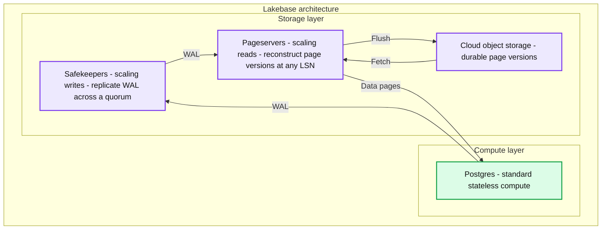
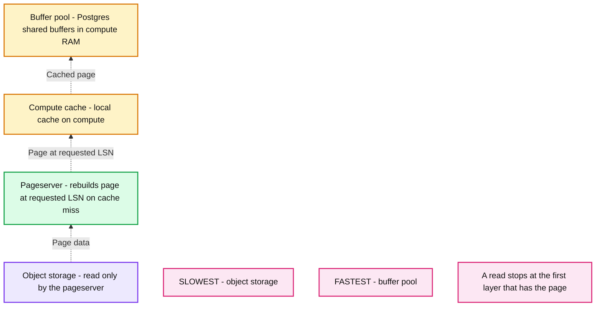

# Object Storage + WAL: Lakebase Postgres for the agentic era

*Change the way agents work with Postgres by treating WAL as a durable source of truth*

- Source: https://www.databricks.com/blog/object-storage-wal-lakebase-postgres-agentic-era
- Published: 2026-08-27
- Authors: Cassie Murray, Carlota Soto
- Categories: engineering
- Images: 3 total, 3 extracted as architecture

**Key takeaways**

- Lakebase Postgres reimagines traditional OLTP databases by decoupling compute and storage, treating the Write-Ahead Log (WAL) on scalable object storage (like S3) as the definitive source of truth.
- By replacing heavy physical data duplication with lightweight pointers to Log Sequence Numbers (LSNs), the architecture enables instant database branching, point-in-time restores, and time-travel queries that are ideally suited for agentic workloads.
- Storing an immutable transaction history in open columnar formats allows both transactional and analytical engines to query a single, unified dataset directly, eliminating the need for separate read replicas or complex data synchronization pipelines.

Agents that interact with a traditional OLTP database often create bottlenecks at the storage layer. New deployments, copies, restores, and replicas all mean moving around large volumes of data which is time-consuming and expensive.

The polar opposite is true for object storage. Amazon S3, for example, is cheap, performant, almost invisible to operate. It creates a scalable, cost-effective storage layer for agent memory.

Which brings us to the question: Can object storage sit underneath a transactional database and make it easier for agents to work with?

This question is what started Lakebase Postgres. The answer does not just depend on how fast your object store is, but rather where you place the source of truth.

## Two OLTP models

The usual mental model for OLTP is data-centric. Data is organized into tables with rows and columns, each representing an entity. Storage is the place where the current state lives, and the database's job is to store and retrieve it.

But there is a second model: transaction-centric. Here the database is a journal of transactions. Each entry is an operation, and storage is a timeline of those operations rather than a snapshot of the present. The current state is one thing you can derive from the timeline.

For years the data-centric model was the only one that mattered in practice, because what the operations team asked of a database were reads and writes against the present. Over the past few years, that has dramatically changed. The operations that agent workloads ask for are almost all operations on transaction history:

- Give me an isolated copy of production to work in
- Put it back the way it was before my last three statements
- Show me what this table looked like before the migration
- Run twenty of these at once, and delete nineteen of them in an hour

These are all queries about the timeline. A database that only stores the present delivers copies and backups, which are slow and expensive.

However, Postgres already contains this timeline: it is called the write-ahead log (WAL).

## The writing in the WAL

Postgres’ WAL records every modification before it reaches the data files. It originally existed so Postgres could recover: if the server died between the log write and the data file write, a WAL replay closed the gap.

But WAL contents are interesting far beyond recovery. Take a table and an insert:

Before that change reaches the `users` table on disk, Postgres appends it to the WAL. The log is binary, but `pg_waldump` will render it. The records for this insert look roughly like this:

These are four records, and one transaction. Note how each has a log sequence number (LSN), a monotonically increasing identifier.

The heap and btree lines also name the exact 8 KB page that changed. The log does not say "a row was added." It says which page, in which relation, at which point in the timeline.

Read that as a recovery mechanism and it is a list of work to redo after a crash. *But if you read it as a transaction journal*, it is something else: A complete, ordered, byte-level account of every page the database has ever changed, with a unique name on every entry.

That name, the LSN, is the part that matters most. It means the timeline is already addressable. Nothing needs to be added to Postgres to make "the database as of a point in time" a well-defined thing. It only needs a storage layer that keeps the log around and can answer questions against it.

## The log becomes the source of truth

In a conventional Postgres deployment, the WAL is a means to an end. *The data files are the database*, the log protects them, and the log is trimmed once its records are safely applied. Storage is simply a disk attached to the machine running Postgres, and everything about the database's identity is tied to that machine.

Now, let’s invert it. *Make the log the database*, and the data files a derived, cached representation of it. Then you can keep the full timeline, and you no longer have to move data to copy or rewind the database. History becomes addressable, so a database “copy” becomes a pointer instead of a second set of files. This makes deployments, restores, and replicas cheap enough to treat like code.

That’s what we did in Lakebase Postgres. Concretely, we split the system into two layers:

### The compute layer

The compute layer runs standard Postgres. It parses SQL, plans and executes queries, enforces MVCC, manages locks and indexes.

Nothing in the query engine is rewritten. What changes is what the compute node is responsible for: it exists to execute work, not to preserve data. It has RAM for shared buffers and local NVMe as a page cache, and it can start, stop, scale, or die at any moment without putting durability at risk.

### The storage layer

The storage layer owns correctness, durability, and history. It outlives any individual compute node, and it is built from three components with distinct jobs:

- **Safekeepers replicate the WAL**. When the compute node generates WAL records, it streams them to several safekeepers, and a transaction is committed once a quorum acknowledges the record through [a Paxos-based protocol](https://neon.com/blog/paxos). Durability is a property of replication and consensus rather than of one machine's `fsync`.
- **The pageserver turns WAL into pages**. It combines base pages with committed WAL records to materialize the version of a page that a given query needs, and it persists those materialized versions into object storage asynchronously.
- **Object storage holds long-term, immutable history.** Materialized page versions and historical states arekept as an append-only record rather than a mutable filesystem.

**Summary:** Lakebase separates stateless Postgres compute from safekeepers that replicate WAL, pageservers that reconstruct data pages, and cloud object storage that preserves durable page versions.

**Components:**
- Lakebase architecture: encompasses the compute and storage layers.
- Compute layer: hosts standard, stateless Postgres compute.
- Postgres: generates WAL and receives data pages.
- Storage layer: contains safekeepers, pageservers, and cloud object storage.
- Safekeepers: scale writes by replicating WAL across a quorum.
- Pageservers: scale reads by reconstructing page versions at any LSN.
- Cloud object storage: stores durable page versions.

**Flows:**
- Postgres -> Safekeepers: WAL.
- Safekeepers -> Pageservers: WAL.
- Pageservers -> Postgres: data pages.
- Pageservers -> Cloud object storage: flush page versions.
- Cloud object storage -> Pageservers: fetch page versions.

**Numbers:** none

source image: https://www.databricks.com/sites/default/files/blog_images/object-storage-wal-lakebase-postgres-for-the-blog-img-2.png

### The write path

What does the write path look like? A commit in this system follows these steps:

1. Postgres applies changes in memory. Buffers are updated, indexes are modified, WAL records are generated exactly as usual.
2. Instead of flushing WAL to a local filesystem, the compute node streams it over the network to the safekeepers.
3. The transaction is committed once a quorum of safekeepers has acknowledged the record. That is the point where the client hears success.
4. Page materialization happens afterward, in the storage layer, off the transaction's critical path. A commit never waits for pages to be written or uploaded.

**Summary:** Postgres commits after a safekeeper quorum acknowledges WAL records, while pageservers apply WAL and persist updated pages to object storage asynchronously.

**Components:**

- Postgres: PostgreSQL compute changes pages in memory and produces WAL records.
- Safekeepers: WAL storage quorum acknowledges records, allowing the transaction to commit.
- Pageservers: Storage services apply WAL asynchronously, off the commit path.
- Object storage: Cloud object storage durably persists updated pages.
- Client sees success here: Label beneath Postgres and Safekeepers marking the commit path.
- Asynchronous, the commit doesn't wait: Label beneath Pageservers and Object storage marking background processing.

**Flows:**

- Postgres -> Safekeepers: WAL records for quorum acknowledgment and transaction commit.
- Safekeepers -> Pageservers: WAL for asynchronous application.
- Pageservers -> Object storage: Updated pages for durable persistence.

**Numbers:** 01, 02, 03, 04 are component sequence labels.

```mermaid
%% Postgres WAL commit path followed by asynchronous page materialization and persistence
flowchart LR
    subgraph Commit[CLIENT SEES SUCCESS HERE]
        A[01 Postgres<br/>Changes pages in memory<br/>Produces WAL records]
        B[02 Safekeepers<br/>Quorum acknowledges records<br/>Transaction commits]
    end
    subgraph Async[ASYNCHRONOUS, THE COMMIT DOES NOT WAIT]
        C[03 Pageservers<br/>Apply WAL asynchronously<br/>Off the commit path]
        D[04 Object storage<br/>Updated pages persist durably<br/>In cloud object storage]
    end

    A -.->|WAL records| B
    B -.->|WAL for asynchronous application| C
    C -.->|Updated pages| D

    classDef client fill:#dbeafe,stroke:#2563eb,stroke-width:2px,color:#111
    classDef service fill:#dcfce7,stroke:#16a34a,stroke-width:2px,color:#111
    classDef store fill:#ede9fe,stroke:#7c3aed,stroke-width:2px,color:#111
    classDef cache fill:#fef3c7,stroke:#d97706,stroke-width:2px,color:#111
    classDef queue fill:#cffafe,stroke:#0891b2,stroke-width:2px,color:#111
    classDef critical fill:#fee2e2,stroke:#dc2626,stroke-width:4px,color:#111
    classDef external fill:#e5e7eb,stroke:#6b7280,stroke-width:2px,color:#111,stroke-dasharray:4 3
    classDef decision fill:#fce7f3,stroke:#db2777,stroke-width:2px,color:#111
    class A,C service
    class B,D store
```

source image: https://www.databricks.com/sites/default/files/blog_images/object-storage-wal-lakebase-postgres-for-the-blog-img-4.png

This design might get an obvious objection: that step 2 adds a network hop to the commit path. But any Postgres deployment that takes durability seriously is already running synchronous replication, which is also a network hop. Externalizing the WAL replaces one network round trip with another rather than adding one.

### The read path

Every read request from a compute node carries a page identifier and an LSN, and the storage layer returns the page as it existed at that LSN. This `GetPage@LSN` is a central operation in this architecture.

Serving it takes a preference order:

1. First comes RAM for Postgres shared buffers, exactly as in any Postgres.
2. Then comes the local NVMe which is still fast, still local. If the page is not in memory, the compute node checks its local disk cache
3. Only on a local miss does the request cross the network into the pageserver. The pageserver then checks whether it already has that page version materialized. If not, it finds the most recent image of the page at or before the requested LSN, collects the WAL records on top of it, replays them, and returns the reconstructed page.

The returned page is then cached in RAM and on NVMe, so the next read of it is local again.

**Summary:** Reads use a storage hierarchy from fastest Postgres RAM buffers through the compute cache and pageserver to slowest object storage, stopping at the first layer that has the page.

**Components:**
- Buffer pool: Postgres shared buffers in compute RAM.
- Compute cache: Local cache on the compute.
- Pageserver: Rebuilds the page at the requested LSN on a cache miss.
- Object storage: Read only by the pageserver, never directly by queries.
- FASTEST / SLOWEST: Labels indicating relative speed across the hierarchy.

**Flows:**
- Object storage -> Pageserver: Page data read by the pageserver.
- Pageserver -> Compute cache: Page rebuilt at the requested LSN on a cache miss.
- Compute cache -> Buffer pool: Cached page supplied to shared buffers.

**Numbers:** none

source image: https://www.databricks.com/sites/default/files/blog_images/object-storage-wal-lakebase-postgres-for-the-blog-img-6.png

A primary node asks for the latest version of every page, so in steady state it behaves like any Postgres reading from a warm cache. But nothing in the protocol requires "latest." Ask for a page at an LSN from four hours ago and you get that page from four hours ago.

The useful consequence is that the distinction between live data and historical backups disappears. There is one storage system. Old page versions are not a separate artifact kept somewhere else in a different format; they are the same immutable files, still addressable.

## Non-overwriting storage

In other words, the pageserver never updates a file in place. Files are created, merged, and deleted, but never modified. This is a perfect fit for object storage, which does not offer random updates, and that makes history cheap enough to keep.

Data is organized into two kinds of layer files:

- An image layer holds a snapshot of every key in a key range at one LSN
- A delta layer holds all the changes in a key and LSN range. Keys that were not modified are not stored. Incoming WAL is written out as delta layers.

Image layers are produced in the background, for two reasons: they shorten the replay chain a read has to walk, and they make old deltas collectable. Without them, reconstructing a page could require walking back arbitrarily far.

So `GetPage@LSN` becomes a search: start at the requested key and LSN, walk down through the layers collecting WAL records for that page, and stop at the first image of it. To keep that search short, delta and image layers are reshuffled by background compaction, and layers that fall outside the retention window are garbage collected.

## How to find the right layer quickly

The search described above sounds simple, but it is not. It is worth spending some time on, since it determines whether the whole design is viable.

A read names a key and an LSN. The storage system has to find the nearest layer that covers that key at or before that LSN. That is a geometric problem, and it is not obvious how to solve it across tens of millions of layers. A linear scan is far too slow, and the obvious spatial structures do not fit: R-trees answer containment queries rather than "the first layer below this point," and segment trees scale with the size of the coordinate space rather than with the number of layers.

There are several approaches to this design, but what worked was to solve the easy problem first, then make the data structure remember its own past.

### Step one: Solve it for a single LSN

For one fixed LSN, we work out which layer answers each key. That answer only changes at a handful of points across the key space, so we record those points and store them in a binary search tree. That tree is the layer coverage for that LSN, and it answers any read at that LSN with a single lookup.

This works, but only for one LSN. Coverage changes every time a layer is added, and there are millions of LSNs, so we cannot build and keep a separate tree for each one.

### Step two: Make the tree persistent

Persistent as in, “keep the old versions available”. We build the coverage incrementally, inserting layers in LSN order from the bottom up. Inserting one layer only touches the nodes along a single path from the root downward. Instead of overwriting those nodes, the system copies them and leaves the originals untouched. The new copies point at the old, unchanged subtrees on either side.

Two things follow from that:

- The insert costs a handful of new nodes rather than a whole new tree, because everything off the path is shared
- The old root still describes the tree exactly as it was before the insert, so it remains a valid coverage for the earlier LSN

We do that for every layer, in order, and we end up with a single structure that contains every intermediate root, each one the coverage at a different LSN. We get all of those trees for close to the price of one.

A historical read then costs the same as a current one: the system picks the root for the LSN you want, and does the same single lookup.

That is the trick, in summary:

- Latest-only reads are one tree lookup
- Historical reads use an older root, so they cost the same
- Building those roots stays cheap as layers accumulate, so a long history does not make lookups slower

## Where object storage actually sits

This is where the current argument about Postgres and object storage tends to go wrong, in both directions.

The classic argument against building OLTP on object storage looks like this:

- Postgres processes many small, latency-sensitive I/Os
- Object storage is built for larger requests at higher latency, and a read from it can take hundreds of milliseconds
- If you put S3 in front of query execution, the result is a slow database

In and of itself, that is not a controversial claim. What the argument gets wrong is the assumption that a database built on object storage must be *reading from object storage to answer queries.*

In the architecture we proposing, it never does:

- Queries do not read object storage. The compute node reads RAM, then local NVMe, then the pageserver. Object storage is read only inside the pageserver, only when reconstructing a page version it does not have, and never by Postgres directly.
- Commits do not write object storage. A commit is acknowledged when a quorum of safekeepers has the WAL record, materializing pages and uploading them happens afterward.

When Postgres is architected this way, it becomes an evolution of traditional OLTP systems that’s built to handle agentic workloads. This is why we created Lakebase Postgres: an OLTP database where compute and storage are decoupled, and the durable source of truth is built on object storage.

## Why use Lakebase Postgres over vanilla Postgres

With Lakebase Postgres, the transaction history is addressable by LSN, and copies are references rather than data. That makes it possible to build features that give Postgres the lightweight workflow which is an absolute requirement for agents.

### Branching

First, Postgres can branch now. Creating a branch does not copy pages, it creates a pointer to a specific LSN, and the branch begins diverging from there with copy-on-write semantics.

Writes to the branch are stored as deltas against the parent, so a branch of a 2 TB database is created in seconds and costs nothing until it changes something. The parent sees no additional load, which is why this is safe to do against production.

This is what an agent needs to work safely. It can take a branch per task, run the migration it just wrote against real data at real volume, and inspect the result before anything touches the parent. Twenty agents can do that at once, each isolated from the others and from production.

With Lakebase Postgres we’ve even [extended branching](https://docs.databricks.com/aws/en/oltp/projects/branches) past the database. Object Storage buckets, Functions, Managed Better Auth state, and AI Gateway configuration branch alongside the database, so a branch is an isolated copy of the backend rather than just the Postgres tables.

### Instant restore

Point-in-time recovery is branching with a different intent. Restoring means pointing at an earlier LSN and resuming from there, so it does not involve copying data back into place and its cost does not scale with database size. How far back you can go is a [retention setting](https://docs.databricks.com/aws/en/tables/history).

This is what makes an agent's mistakes cheap. When an agent runs the wrong statement, the answer is not a restore window and a recovery plan, it is pointing the branch back at the LSN from before it ran. Undo costs the same on a 2 TB database as on an empty one, so an agent can retry instead of escalating to a human.

### Time travel queries

Because the pageserver can reconstruct any page at any LSN inside the history window, you can query a past state directly instead of restoring it first.

The practical use is diffing: what did this table look like before the migration, and what does it look like now. It is also how you confirm you picked the right timestamp before committing to a restore.

### Read replicas without replicas

A read-only compute node is not a copy of the data. It requests pages from the same storage layer as the primary, so adding one does not mean provisioning a dataset and waiting for it to catch up. Spinning one up is a metadata operation.

### Scale to zero

Since durable state lives outside compute, an idle compute node can be shut down entirely rather than left running to protect data. Computes [suspend](https://neon.com/docs/introduction/scale-to-zero) after 5 minutes of inactivity and reactivate within a few hundred milliseconds on the next query. For a fleet of per-session or per-branch databases, most of which are idle most of the time, this is the difference between a viable cost model and an unviable one. Note that compute stops billing while suspended; storage continues to be billed, because the history is still there.

An agent session that works for four minutes and goes quiet stops drawing compute cost five minutes later, with nobody having to tear it down. That is what makes a database per agent, or per session, or per branch, affordable enough to be the default.

### One copy for transactions and analytics

There is another consequence of putting operational data in object storage

Once the durable record of a transactional database lives in commodity object storage, it stops being locked inside one engine's private format on one engine's disks. Other engines can read it.

That is the basis for what we call [LTAP, for Lake Transactional/Analytical Processing](https://www.databricks.com/blog/lakebase-ltap-rethinking-database-storage): instead of two copies of the data in two formats kept in sync by a pipeline, there is one durable copy in open columnar formats that both the transactional and analytical sides read.

The mechanism follows from the read path already described. As the pageserver materializes pages into object storage, it transcodes them from Postgres row format into columnar form, preserving the exact Postgres representation of every value. An analytical query asks Postgres for the current LSN, which is a cheap metadata lookup, reads the great majority of the data from object storage as of that LSN, and fetches only the most recent unmaterialized changes from the pageserver. Postgres serves none of the analytical read traffic beyond returning that one number, so a large analytical query does not compete with transactions for the same CPU.

The distinction from change data capture (CDC) and mirroring is that there is nothing to opt into. There is no list of replicated tables, because there is no replication. A table already exists in the lake, which also means the two views cannot drift apart.

## Lakebase Postgres for agents

We started this post with a question: could object storage sit underneath Postgres and make it easier for agents to work with?

The answer is yes. Object storage can sit underneath Postgres and change how you interact with it, but not just because S3 is fast or cheap to run. As described in this post, it requires more engineering than that. RAM and local NVMe are still needed to serve queries fast enough, and a commit still lands on replicated WAL rather than in a bucket.

That WAL piece is the key. Object storage adds a cheap and scalable way to store all history, but making the WAL the source of truth is what makes that history addressable and changes how agents interact with Postgres and the features you can build on top of it.

Ask your agent to deploy Lakebase Postgres and put it to the test. [Get started here](https://login.databricks.com/signup?itm_source=www&itm_category=product&itm_page=lakebase&itm_location=body&itm_component=centered-hero-text&itm_offer=signup&tuuid=c233e6b3-eaed-4f75-b8b5-4761defb1d81&intent=SIGN_UP&dbx_source=www&rl_aid=50d67422-d812-4b7b-afe6-9bf2c7264fb2&sisu_state=eyJsZWdhbFRleHRTZWVuIjp7Ii9zaWdudXAiOnsicHJpdmFjeSI6dHJ1ZSwiY29ycG9yYXRlRW1haWxTaGFyaW5nIjp0cnVlfX19).

*Lakebase Postgres can be used as a standalone database, and you can also integrate it with the rest of the Databricks Data + AI Platform: Unity Catalog governance, lakehouse analytics, notebooks, and AI workflows.*
