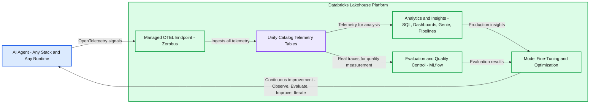
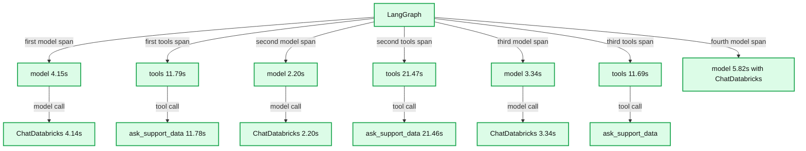
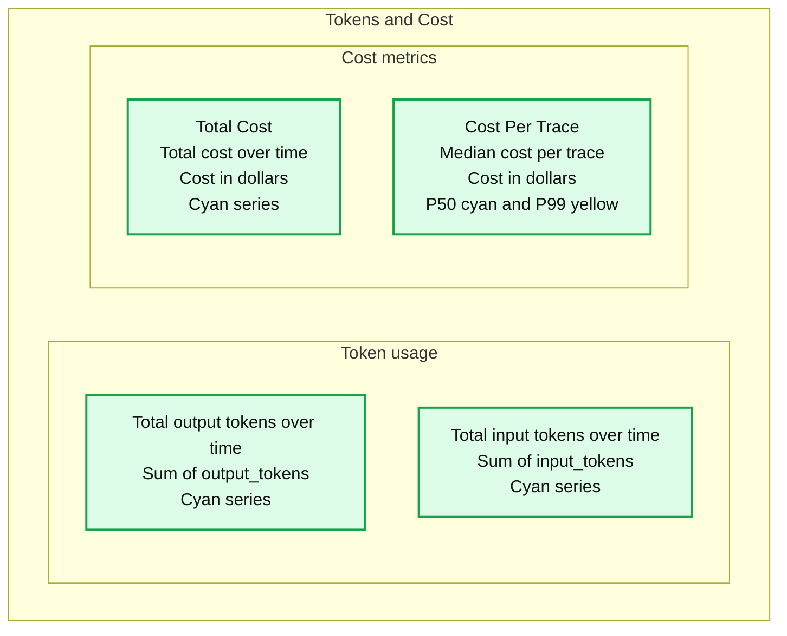
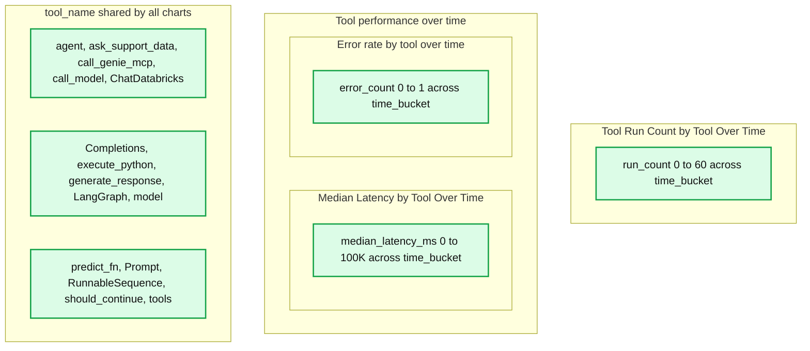

# Observability for any agent, anywhere: Production-ready tracing with OpenTelemetry & Unity Catalog on Databricks

*OpenTelemetry traces in Unity Catalog create a continuous improvement flywheel for AI agents through analytics, evals, and monitoring.*

- Source: https://www.databricks.com/blog/observability-any-agent-anywhere-production-ready-tracing-opentelemetry-unity-catalog
- Published: 2026-05-22
- Authors: Firas Farah, Bruno Faria, Anoop Sunke
- Categories: platform, product, engineering, data-science-machine-learning, databricks-ai, industries, tech
- Images: 12 total, 8 extracted as architecture

**Key takeaways**

- The Problem: AI agents generate massive volumes of trace data, but traditional observability tools make that data expensive to retain, difficult to govern, and hard to use in evaluation and analytics workflows.
- The Solution: Databricks now supports writing OpenTelemetry (OTel) traces directly to Unity Catalog tables via a fully managed, serverless ingestion path.
- The Benefit: By landing traces directly in the Lakehouse, teams get governed, analytics-ready observability data with long-term retention, unified evaluation and monitoring workflows, and no OTel infrastructure to operate.
- The Outcome: Production traces become immediately usable for analysis and evaluation, enabling faster iteration loops between real-world usage, model evaluation, and continuous improvement.

## Why AI Tracing Breaks Traditional Observability

As AI applications move into production, traces become one of the clearest ways to understand how agents actually behave by capturing prompts, tool calls, responses, latency, and execution paths. Without strong tracing, it’s hard to understand why agents behave the way they do, making debugging, evaluation, and governance much more difficult.

AI traces quickly become valuable for analytics, evaluation, and monitoring workflows beyond traditional debugging and observability use cases. Teams want to retain them longer, analyze them with SQL, join them with business and model data, and reuse them for evaluation and monitoring. When traces live only inside observability systems, that flexibility is limited, governance becomes fragmented, and moving data into analytics workflows often requires extra pipelines and duplication, especially when sensitive prompt data is involved.

## OTel Trace Ingestion

Databricks now supports writing OTel traces directly to Unity Catalog using the OpenTelemetry (OTel) format. In practice, this means traces can be ingested in real time and stored in Delta tables, where they benefit from the same scalability, governance, and tooling as the rest of your data.

This changes how teams can use trace data:

- **Real-time ingestion with practical retention:** Traces can be written as they’re generated at high throughput and retained long-term without the cost pressure typically associated with observability platforms.
- **Analyze and govern using the Lakehouse:** Once traces are in tables, you can treat them like any other dataset: query them with SQL, build dashboards, run ETL pipelines, use tools like Genie, and apply governance controls such as PII masking.
- **Use the full MLflow evaluation stack:** MLflow makes it easy to search, filter, and drill down into your traces for debugging. Persisting traces in Unity Catalog removes typical experiment constraints (such as trace caps), making it easier to run large offline evaluations, monitor production systems, and continuously improve quality as workloads grow.

### SaaS vs. Lakehouse

So why not rely entirely on a SaaS observability tool?

1. **Retention economics:** Agents generate massive text payloads. Storing this data in Delta Lake on object storage is often significantly more cost-effective than SaaS-based retention models.
2. **The PII deadlock:** Sending raw prompts to third-party platforms can create InfoSec friction. Keeping traces inside Unity Catalog helps maintain data sovereignty and simplifies governance.
3. **Analytics, not just telemetry:** While SaaS tools are strong for operational metrics like latency, the Lakehouse provides an analytics engine. You can join traces with business data, such as revenue and conversions, to understand real impact and go beyond system health. Furthermore, the Lakehouse enables you to apply AI directly to your traces and to build evaluation frameworks to continuously improve system quality.

## Architecture: Serverless OpenTelemetry ingestion

Databricks supports ingesting OpenTelemetry (OTel) traces, logs, and metrics directly into Unity Catalog tables, using the OTel standard to separate instrumentation from storage.

Databricks removes the operational complexity of traditional, multi-hop telemetry pipelines by providing a managed ingestion layer, transparently powered by Zerobus Ingest. Zerobus Ingest acts as a fully managed, serverless ingestion engine that natively supports standard OpenTelemetry protocols (OTLP) via gRPC for open-source collectors, while its REST API capabilities enable seamless integration with application frameworks like MLflow. Applications can easily export spans, logs, and metrics directly to Unity Catalog tables, where the data is stored in Delta format. With a “single-sink” architecture, Zerobus Ingest simplifies observability by streaming data directly to the lakehouse. Existing OLTP-compatible collectors can point directly to this endpoint via gRPC, entirely bypassing intermediate message buses like Kafka. Zerobus Ingest acts as your high-throughput telemetry pipeline, handling ingestion and durability with zero infrastructure overhead. Any OTel-compatible client can export traces to this endpoint, including popular AI agent frameworks across many programming languages.

From there, traces, logs, and metrics become first-class data in the Lakehouse, powering ad-hoc SQL analysis, dashboards, downstream analytics, and MLflow evaluation and monitoring workflows. Unifying your telemetry creates a continuous improvement flywheel where production behavior feeds evaluation and analysis, which in turn drives faster iteration and better agent performance.

**Summary:** Agent telemetry flows through a managed OpenTelemetry endpoint into Unity Catalog tables, supporting analytics, evaluation, model optimization, and continuous agent improvement.

**Components:**

- AI Agent: Any stack, any runtime.
- Databricks Lakehouse Platform: Platform enclosing ingestion, telemetry storage, analytics, evaluation, and optimization.
- Managed OTEL Endpoint: Zerobus, a Databricks-managed, horizontally scalable ingestion layer.
- Unity Catalog Telemetry Tables: Governed system of record for agent behavior.
- Analytics & Insights: SQL, Dashboards, Genie, Pipelines.
- Evaluation & Quality Control: MLflow, measuring quality using real traces.
- Model Fine-Tuning & Optimization: Learning from production behavior.
- Continuous Improvement: Observe → Evaluate → Improve → Iterate.

**Flows:**

- AI Agent -> Managed OTEL Endpoint: OpenTelemetry signals.
- Managed OTEL Endpoint -> Unity Catalog Telemetry Tables: All telemetry.
- Unity Catalog Telemetry Tables -> Analytics & Insights: Telemetry for analysis.
- Unity Catalog Telemetry Tables -> Evaluation & Quality Control: Real traces for quality measurement.
- Analytics & Insights -> Model Fine-Tuning & Optimization: Insights from production behavior.
- Evaluation & Quality Control -> Model Fine-Tuning & Optimization: Evaluation results.
- Model Fine-Tuning & Optimization -> AI Agent: Continuous improvement through observation, evaluation, improvement, and iteration.

**Numbers:** none

source image: https://www.databricks.com/sites/default/files/inline-images/databricks-lakehouse-platform-image1.png

## Tutorial: Wiring Traces into the Lakehouse

### Sample agent: Support manager assistant

For this blog, we’ll create a simple support manager assistant that we can use to demonstrate tracing end-to-end. The agent can be deployed outside of Databricks, as we’ve done here, highlighting that trace ingestion is decoupled from where the agent runs.

We built a LangGraph agent powered by a [Databricks-hosted Claude Sonnet 4.6 model](https://docs.databricks.com/aws/en/machine-learning/foundation-model-apis/supported-models#-anthropic-claude-sonnet-4) for reasoning and response generation. The agent calls a Genie Space as a tool, which you can deploy [here](https://www.databricks.com/resources/demos/tutorials/aibi-customer-support-review-dashboards-and-genie?itm_data=demo_center&amp%3Bitm_source=www&amp%3Bitm_category=resources&amp%3Bitm_page=tutorials&amp%3Bitm_location=Data%20Warehouse%20and%20BI&amp%3Bitm_component=card&amp%3Bitm_offer=aibi-customer-support-review-dashboards-and-genie).

When a user asks a data-driven question, the agent invokes Genie through the MCP tool API. Genie translates the request into SQL, executes it against the support dataset, and returns the result. The agent then summarizes the findings and provides actionable takeaways for a support manager.

**Summary:** A user question passes through a LangGraph agent, an optional Genie Space for text-to-SQL, and two consecutive LLM summarization and action recommendation stages.

**Components:**
- User Question: user input; no technology specified.
- LangGraph agent: uses LangGraph to decide whether data is needed.
- Optional Genie Space: uses text-to-SQL.
- First LLM stage: summarizes and recommends actions; model unspecified.
- Second LLM stage: repeats the same summarization and action recommendation label; model unspecified.

**Flows:**
- User Question -> LangGraph agent: user question.
- LangGraph agent -> Optional Genie Space: handoff after deciding whether data is needed.
- Optional Genie Space -> First LLM stage: handoff for summarization and action recommendations.
- First LLM stage -> Second LLM stage: handoff to the repeated LLM stage.

**Numbers:** none

source image: https://www.databricks.com/sites/default/files/inline-images/support-manager-assistant-image2.png

```mermaid
%% User question flow through LangGraph, optional Genie Space, and two LLM stages
flowchart LR
    A(User Question) -->|User question| B(LangGraph agent decides whether data is needed)
    B -->|Handoff| C(Optional Genie Space text-to-sql)
    C -->|Handoff for summarization| D(LLM summarizes + recommends actions)
    D -->|Handoff| E(LLM summarizes + recommends actions)

    classDef client fill:#dbeafe,stroke:#2563eb,stroke-width:2px,color:#111
    classDef service fill:#dcfce7,stroke:#16a34a,stroke-width:2px,color:#111
    classDef store fill:#ede9fe,stroke:#7c3aed,stroke-width:2px,color:#111
    classDef cache fill:#fef3c7,stroke:#d97706,stroke-width:2px,color:#111
    classDef queue fill:#cffafe,stroke:#0891b2,stroke-width:2px,color:#111
    classDef critical fill:#fee2e2,stroke:#dc2626,stroke-width:4px,color:#111
    classDef external fill:#e5e7eb,stroke:#6b7280,stroke-width:2px,color:#111,stroke-dasharray:4 3
    classDef decision fill:#fce7f3,stroke:#db2777,stroke-width:2px,color:#111
    class A client
    class B decision
    class C,D,E service
```

### Setting up OTel tracing with UC

Before instrumenting the agent, we first configure the tables in UC that will store OpenTelemetry traces. In this example, we use MLflow to create the underlying OpenTelemetry tables in Unity Catalog and link them to an MLflow experiment so traces can be searched, analyzed, and annotated from the UI. Start by identifying (or creating) a SQL warehouse and an MLflow experiment, then use the MLflow Python library to provision the Unity Catalog tables and associate the schema with the experiment. For full steps, follow the docs [here](https://docs.databricks.com/aws/en/mlflow3/genai/tracing/trace-unity-catalog).

This setup creates Unity Catalog tables for OpenTelemetry spans, logs, and metrics. The underlying data is stored in OpenTelemetry-compliant table formats, and the MLflow service automatically creates Databricks SQL views alongside them that transform the OpenTelemetry data into an MLflow-friendly format for easier querying and analysis. These include:

- `<table_prefix>_otel_spans`: detailed span-level execution data for each request
- `<table_prefix>_otel_logs`: structured log/event data captured during execution
- `<table_prefix>_otel_metrics`: numerical telemetry captured during execution
- `<table_prefix>_otel_annotations`: MLflow-specific trace data that is not a standard OTel signal, including metadata, tags, assessments/feedback, expectations, and run links
- `<table_prefix>_trace_unified`: a consolidated view that assembles trace data into a single record per trace, including raw span data and trace metadata
- `<table_prefix>_trace_metadata`: MLflow tags, metadata, and assessments grouped by trace ID; more performant than the unified view when you only need MLflow trace metadata

After setting up the experiment, agent instrumentation remains the same. Any OTel-compatible instrumentation library can export traces to the configured endpoint. You can do automatic and/or manual tracing as described [here](https://docs.databricks.com/aws/en/mlflow3/genai/tracing/app-instrumentation/). In our example, we rely on `mlflow.langchain.autolog()` to capture the detailed LangGraph execution (model calls and tool calls). We also wrap the entrypoint with `@MLflow.trace` to establish a request-level root span, allowing each invocation to be observed as a single end-to-end execution.

### Inspecting a sample trace

Now that the agent is instrumented and traces are flowing into Unity Catalog, let’s look at a real execution.

For this example, we asked the Support Manager Assistant:

"Which support engineer should I put up for promotion?"

The agent evaluated the request, called the Genie space multiple times to gather supporting data, and returned a recommendation based on performance metrics.

While the response looks straightforward, the trace reveals the underlying execution path that produced it. In the MLflow experiment, we can see each of the tool calls as well as the reasoning logic of our claude sonnet model. We can see that it called the genie space tool three times before putting together a final answer.

**Summary:** The trace shows four ChatDatabricks calls alternating with three ask_support_data calls between inputs and outputs.

**Components:**
- Inputs: messages containing name and response_metadata fields.
- ChatDatabricks: model interface called four times.
- ask_support_data: tool called three times.
- Outputs: messages containing name and response_metadata fields.

**Flows:**
- No arrows are visible. Calls are listed in order between Inputs and Outputs.

**Numbers:** Token count: 5443. Latency: 1.01m. Code line numbers: 1, 2, 3, 4 in both message panels. Trace ID: 6f33a185cad334cd1ab0719c8dd3d91.

```mermaid
%% Trace panels and calls listed from top to bottom without visible arrows
flowchart TD
    I[Inputs - messages]
    C1[ChatDatabricks was called]
    T1[ask_support_data was called]
    C2[ChatDatabricks was called]
    T2[ask_support_data was called]
    C3[ChatDatabricks was called]
    T3[ask_support_data was called]
    C4[ChatDatabricks was called]
    O[Outputs - messages]

    classDef client fill:#dbeafe,stroke:#2563eb,stroke-width:2px,color:#111
    classDef service fill:#dcfce7,stroke:#16a34a,stroke-width:2px,color:#111
    classDef store fill:#ede9fe,stroke:#7c3aed,stroke-width:2px,color:#111
    classDef cache fill:#fef3c7,stroke:#d97706,stroke-width:2px,color:#111
    classDef queue fill:#cffafe,stroke:#0891b2,stroke-width:2px,color:#111
    classDef critical fill:#fee2e2,stroke:#dc2626,stroke-width:4px,color:#111
    classDef external fill:#e5e7eb,stroke:#6b7280,stroke-width:2px,color:#111,stroke-dasharray:4 3
    classDef decision fill:#fce7f3,stroke:#db2777,stroke-width:2px,color:#111

    class I,O client
    class C1,T1,C2,T2,C3,T3,C4 service
```

source image: https://www.databricks.com/sites/default/files/inline-images/genie-space-tool-five.png

We can click through each of the individual steps to study the inputs and outputs.

**Summary:** The trace shows a LangGraph agent alternating between model execution and three `ask_support_data` tool calls, with the selected tool's inputs and outputs displayed.

**Components:**
- LangGraph: root agent execution.
- model: model invocation spans.
- ChatDatabricks: model calls through the Databricks integration.
- tools: tool execution spans.
- ask_support_data: support data tool invoked three times.
- Inputs: a question requesting agent resolution time, customer satisfaction, ticket volume, and resolution rate.
- Outputs: tool name, response metadata, ID, success status, and response content.

**Flows:**
- LangGraph -> model: nested model execution.
- model -> ChatDatabricks: nested Databricks model call.
- LangGraph -> tools: nested tool execution.
- tools -> ask_support_data: support data request.
- The timeline shows four model executions interleaved with three tool executions. No explicit arrows are drawn.

**Numbers:**
- Token count: 5443.
- Overall latency and LangGraph duration: 1.01m.
- Timeline ticks: 0s, 10.00s, 20.00s, 30.00s, 40.00s, 50.00s, 1.00m, 1.17m.
- First model: 4.15s; ChatDatabricks: 4.14s.
- First tools span: 11.79s; ask_support_data: 11.78s.
- Second model and ChatDatabricks: 2.20s each.
- Second tools span: 21.47s; ask_support_data: 21.46s.
- Third model and ChatDatabricks: 3.34s each.
- Third tools span: 11.69s.
- Fourth model: 5.82s.
- Response metadata line number: 1.
- Visible response values: ticket volumes from 122 to 4,125; average resolution times between 3.53 and 7.44, followed by a clipped unit beginning with `h`; 0.32.
- Some rightmost span labels and response text are clipped.

source image: https://www.databricks.com/sites/default/files/inline-images/genie-space-tool-six.png

Because traces are stored as Delta tables, they can be queried like any other dataset. We can start with the `mlflow_experiment_trace_unified` view, where we will find a record that includes the request, response, trace metadata, and an array of the spans.

## Beyond Debugging: Analytics on Trace Data

Now that traces are stored in Unity Catalog, they become immediately available for both batch and streaming analytics.

### Governance in Unity Catalog

Prompts and responses, however, often contain sensitive information, so treating trace data as governed data is critical. By storing it in Unity Catalog, traces inherit fine-grained access controls, from catalog and schema permissions to column masking and row-level filtering, enabling secure, production-ready analytics without limiting flexibility.

Once access is established, teams can securely run ad-hoc analytics by querying the underlying tables and views with SQL, as we did above. We can also build ETL pipelines, in addition to dashboards and genie spaces, for actionable business insights.

### Dashboards

The MLflow Experiment UI now ships with native observability dashboards for traces in Unity Catalog, including views for trace volume, errors, latency, token usage, and cost. For most teams, that's enough to monitor day-to-day agent health.

**Summary:** The observability dashboard displays trace volume, latency percentiles, and error counts and rates over a custom date range.

**Components:**
- Usage, Quality, Tool calls: dashboard tabs, with Usage selected.
- Time controls: day aggregation, custom time range, start and end timestamps.
- Traces: daily volume bar chart with an average reference line.
- Latency: time series showing p50, p90, and p99 with an average reference line.
- Errors: error count bars and an error rate line with an average reference line.
- Technology names are not visible.

**Flows:**
- none. No arrows are visible.

**Numbers:**
- Time Unit: Day.
- Start: 04/23/2026, 10:06 AM.
- End: 04/27/2026, 10:06 AM.
- Last refresh: 22 minutes ago.
- Traces total: 44. Average: 9. Vertical ticks: 0, 7, 14, 21, 28.
- Latency: 25.76s. Average: 25.76s. Percentiles: p50, p90, p99. Vertical ticks: 0, 30000, 60000, 90000, 120000; axis unit is not shown.
- Errors: 1. Overall error rate: 2.3%. Average rate: 0.7%.
- Error count ticks: 0, 0.25, 0.5, 0.75, 1.
- Error rate ticks: 0%, 25%, 50%, 75%, 100%.
- Dates on all charts: 4/22, 4/23, 4/24, 4/25, 4/26.

```mermaid
%% Dashboard tabs, time controls, trace volume, latency, and errors
flowchart TD
    A[Usage selected · Quality · Tool calls]
    B[Time Unit Day · Time Custom]
    C[Start 04/23/2026 10:06 AM · End 04/27/2026 10:06 AM]
    D[Refresh 22 minutes ago]
    E[Traces 44 · Daily bars · AVG 9]
    F[Latency 25.76s · p50 · p90 · p99 · AVG 25.76s]
    G[Errors 1 · Overall error rate 2.3% · Error Count · Error Rate · AVG 0.7%]

    classDef client fill:#dbeafe,stroke:#2563eb,stroke-width:2px,color:#111
    classDef service fill:#dcfce7,stroke:#16a34a,stroke-width:2px,color:#111
    classDef store fill:#ede9fe,stroke:#7c3aed,stroke-width:2px,color:#111
    classDef cache fill:#fef3c7,stroke:#d97706,stroke-width:2px,color:#111
    classDef queue fill:#cffafe,stroke:#0891b2,stroke-width:2px,color:#111
    classDef critical fill:#fee2e2,stroke:#dc2626,stroke-width:4px,color:#111
    classDef external fill:#e5e7eb,stroke:#6b7280,stroke-width:2px,color:#111,stroke-dasharray:4 3
    classDef decision fill:#fce7f3,stroke:#db2777,stroke-width:2px,color:#111
    class A,B,C,D,E,F,G client
```

source image: https://www.databricks.com/sites/default/files/inline-images/dashboar-8.png

When you need a view that goes beyond the native visuals, the trace tables are still just Delta tables in Unity Catalog. You can build a custom AI/BI Dashboard against them and write standard SQL (with help from AI) to model whatever your team cares about.

To show what custom dashboards can add on top of the native views, we built an AI Operations Center on our trace tables. Below are a couple of capabilities worth mentioning.

**Custom Cost Analysis with Contract Pricing**

Native cost metrics rely on standard list prices, which can be off for teams that have negotiated rates or run fine-tuned models with different pricing. Because we control the SQL, we embedded our pricing logic directly into the query. The dashboard tracks token usage by model type (for example, GPT 5.5 vs. Claude 4.6 Sonnet) and applies our contract rates to produce an Estimated Cost per Trace that reflects what we actually pay. That makes it easy to catch expensive outliers, like a single complex query that costs $0.50 because of a retrieval loop.

**Summary:** The Tokens and Cost dashboard tracks output tokens, input tokens, total cost, and cost per trace over time.

**Components:**
- Tokens and Cost: dashboard heading; technology not identified.
- Total output tokens over time: cyan line chart showing Sum of output_tokens.
- Total input tokens over time: cyan line chart showing Sum of input_tokens.
- Total Cost: cyan line chart labeled Total cost over time, with Cost ($) on the vertical axis.
- Cost Per Trace: chart subtitled Median cost per trace, with Cost ($) on the vertical axis and cyan P50 and yellow P99 series.

**Flows:**
- none. The lines show time series; no arrows or component connections appear.

**Numbers:**
- Output-token axis: 0, 2000, 4000, 6000, 8000.
- Input-token axis: 0, 20K, 40K, 60K.
- Total-cost axis: $0, $0.1, $0.2, $0.3.
- Cost-per-trace axis: $0.00000, $0.00500, $0.01000, $0.01500, $0.02000.
- Dates repeated on all four charts: Feb 12, 2026 00:00; Feb 14, 2026 00:00; Feb 16, 2026 00:00.
- Percentile legend: P50, P99.

source image: https://www.databricks.com/sites/default/files/inline-images/custom-cost-analysis9.png

**Component-Level Performance**

Native latency views show P50/P99 at the trace level. To go a layer deeper and see which tool is slow, we built a **Tool Performance** widget that breaks down latency (P50, P99) and error rates per individual tool in the agent (for example, `retrieve_docs` vs. `generate_response`). That tells us whether the LLM, a Genie tool call, or another step is the bottleneck, so we can pinpoint exactly where the user experience is degrading.

**Summary:** Three charts show tool run counts, median latency, and error counts over time for individual agent tools and components.

**Components:**
- Tool Run Count by Tool Over Time: plots `run_count` against `time_bucket`.
- Median Latency by Tool Over Time: plots `median_latency_ms` against `time_bucket`.
- Error rate by tool over time: plots `error_count` against `time_bucket`, despite the title referring to rate.
- `tool_name`: shared legend listing `agent`, `ask_support_data`, `call_genie_mcp`, `call_model`, `ChatDatabricks`, `Completions`, `execute_python`, `generate_response`, `LangGraph`, `model`, `predict_fn`, `Prompt`, `RunnableSequence`, `should_continue`, and `tools`. Implementation technologies are not specified beyond these visible names.

**Flows:**
- none. Lines connect time-series observations; no arrows or component interactions are shown.

**Numbers:**
- Run count ticks: 0, 20, 40, 60.
- Run count time ticks: Feb 11, 2026 12:00; Feb 12, 2026 12:00; Feb 13, 2026 12:00; Feb 14, 2026 12:00; Feb 15, 2026 12:00; Feb 16, 2026 12:00.
- Median latency ticks: 0, 50K, 100K milliseconds.
- Median latency time ticks: Feb 12, 2026 00:00; Feb 14, 2026 00:00; Feb 16, 2026 00:00.
- Error count ticks: 0, 0.5, 1.
- Error chart time ticks: Feb 12, 2026 00:00; Feb 14, 2026 00:00; Feb 16, 2026 00:00.

source image: https://www.databricks.com/sites/default/files/inline-images/component-level-performance10.png

### Genie spaces

Both business and technical stakeholders often want to explore agent behavior without writing SQL. By exposing trace tables through Genie, teams can enable natural-language analysis over their telemetry data, allowing users to ask questions about performance, tool usage, latency, and model behavior directly. In our example, this could include questions such as:

- What types of requests require escalation?
- Are tool retries increasing?
- Which queries trigger the most complex execution paths?

**Summary:** Average latency fluctuates over February 11-16, 2026, with a peak of 64,523 ms and no consistent upward or downward trend.

**Components:**
- Question: “How has overall latency trended over the past week?”
- Analysis complete: textual summary of daily average latency.
- Result table: collapsed results containing 4 rows.
- Average Latency Trend Over the Past Week: line chart with `day` on the horizontal axis and `avg_latency_ms` on the vertical axis.
- No technology names are visible.

**Flows:**
- No arrows are visible. Line segments connect daily latency observations.

**Numbers:**
- Reported minimum: 11,772 ms on February 11.
- Reported maximum: 64,523 ms on February 12.
- Result table: 4 rows.
- Horizontal axis: Feb 11, 2026; Feb 12, 2026; Feb 13, 2026; Feb 14, 2026; Feb 15, 2026; Feb 16, 2026.
- Vertical axis: 0, 20K, 40K, 60K, 80K ms.
- Other plotted observations, approximately: 21K ms on February 14 and 60K ms on February 16.

```mermaid
%% Daily average latency observations connected chronologically
flowchart LR
    A[Feb 11 2026 - 11,772 ms]
    B[Feb 12 2026 - 64,523 ms]
    C[Feb 14 2026 - approximately 21K ms]
    D[Feb 16 2026 - approximately 60K ms]
    A ---|latency rises| B
    B ---|latency falls| C
    C ---|latency rises| D

    classDef client fill:#dbeafe,stroke:#2563eb,stroke-width:2px,color:#111
    classDef service fill:#dcfce7,stroke:#16a34a,stroke-width:2px,color:#111
    classDef store fill:#ede9fe,stroke:#7c3aed,stroke-width:2px,color:#111
    classDef cache fill:#fef3c7,stroke:#d97706,stroke-width:2px,color:#111
    classDef queue fill:#cffafe,stroke:#0891b2,stroke-width:2px,color:#111
    classDef critical fill:#fee2e2,stroke:#dc2626,stroke-width:4px,color:#111
    classDef external fill:#e5e7eb,stroke:#6b7280,stroke-width:2px,color:#111,stroke-dasharray:4 3
    classDef decision fill:#fce7f3,stroke:#db2777,stroke-width:2px,color:#111
    class A,B,C,D external
```

source image: https://www.databricks.com/sites/default/files/inline-images/trace-table11.png

### ETL pipelines

Because traces are stored as Delta tables, they can feed downstream ETL pipelines just like any other dataset. By enabling [Change Data Feed (CDF)](https://docs.databricks.com/aws/en/delta/delta-change-data-feed), teams can process trace data incrementally, either in batch or streaming, without repeatedly scanning entire tables.

This makes it possible to operationalize observability. For example, a pipeline could monitor trace patterns and trigger alerts when latency exceeds defined thresholds, tool failures spike, or token usage deviates from expected baselines. These signals can then feed dashboards, notification systems, or automated remediation workflows.

Importantly, this complements real-time protections such as [AI Guardrails](https://docs.databricks.com/aws/en/ai-gateway/overview-serving-endpoints#ai-guardrails). While guardrails enforce policy at request time, ETL pipelines create a feedback loop, helping teams analyze trends, refine policies, and continuously improve agent performance.

## Closing the Loop: From Production Traces to Evaluation

Once traces are available, they can power the full MLflow [evaluation stack](https://docs.databricks.com/aws/en/mlflow3/genai/eval-monitor/), enabling teams to measure, improve, and maintain the quality of their GenAI applications across the entire lifecycle. Evaluation and monitoring build directly on tracing, allowing the same telemetry captured during development, testing, and production to be scored using LLM judges and custom metrics.

### Evaluate during development

MLflow allows us to run evaluations against an evaluation dataset, applying built-in or custom judges to score response quality. One effective approach is to bootstrap this dataset from real traces. Because these prompts originate from actual user interactions, they better represent the scenarios your agent must handle compared to purely synthetic test cases.

Below, we create an evaluation dataset from recently captured traces. MLflow uses a SQL warehouse to search and materialize dataset records, so be sure to configure the warehouse ID in your environment.

With the dataset in place, we can define the judges that will score our application. MLflow provides a set of built-in judges, and also allows us to define custom guidelines tailored to our agent’s expected behavior.

And we can now see the results in the MLflow experiment.

### Production monitoring

Development evaluations help us validate behavior before release, but production monitoring shows us how the application performs with real users. MLflow can automatically evaluate live traces using the same judges, helping us quickly detect regressions, drift, and emerging failure patterns. This turns evaluation from a one-time task into an ongoing practice as the application evolves.

## Customers Running AI Observability on Databricks

**Experian**

> The transition to MLflow tracing for our Eva virtual assistant and Latte automated email system has been seamless. With Traces in Unity Catalog, our data science team runs hundreds of thousands of traces through governed Delta tables and evaluates agent quality at scale - all without leaving Databricks. As we onboard more serious evaluation workflows, having tracing and evals in one governed platform means we're not maintaining separate tools for each stage of the agent lifecycle.—James Lin, Head of AI/ML Innovation, Experian

**Superhuman (Grammarly)**

> We're standardizing on MLflow tracing as the observability layer for all of our AI agents at Superhuman. We prefer the broader platform integration over building and maintaining a custom or point solution - that maintenance burden was a real pain point for our teams. With MLflow Traces in Unity Catalog, we can scale to hundreds of thousands of traces per day, and our researchers can self-serve and explore agent behavior directly in the MLflow UI with no engineering support. Having tracing, evaluation, and monitoring all in one governed platform is exactly what we needed to move our agents into production with confidence.—Martin Jewell, Lead MLE AI Infrastructure, Superhuman

**SmartSheet**

> We chose Databricks as our platform for GenAI, and MLflow is how our team builds and evaluates AI agents. During a three-day co-build with Databricks, we stood up two production agents using MLflow tracing, evaluations, custom judges, and labeling - and with traces stored in Unity Catalog, we can run tens of thousands of evaluations and iterate on quality with confidence as we scale.—Kapil Ashar, VP of Engineering, Smartsheet

**The Standard**

> The Standard helps our customers achieve financial well-being and peace of mind. Data and AI are key to delivering that experience at scale. By embedding AI agent functionality - such as extracting key information from inbound underwriting documents and claim submittals - across important business functions, we are able to provide exceptional service to our customers and partners. With production tracing and monitoring, our teams can quickly understand how systems behave and make reliable updates. By governing traces in Unity Catalog alongside the rest of our data on the Databricks Data + AI Platform, we can query, monitor and iterate securely - without adding unnecessary complexity.—Porter Orr, AVP of AI and Automation, The Standard

## Frequently Asked Questions (FAQ)

Q: Can I use this for agents running outside of Databricks?
A: Yes, the agent can be running anywhere. In fact the support assistant agent example that was used for this blog is deployed locally.

Q: What are the throughput and storage limits of this solution?
A: Ingestion throughput limit starts at 200 QPS. There is no limit on storage. Previous limits on traces per experiment are no longer applicable. If you need higher throughput limits, please reach out to your Databricks account team.

Q: What can I do to ensure my search queries, MLflow experiment experience, and downstream analytics remain performant?
A: With the latest product update, the tables are automatically liquid clustered to keep the data optimally organized. For larger trace volumes, however, you should create a materialized view on top of the derived views and incrementally refresh it to maintain query performance.

Q: How does this handle PII found in user prompts?
A: This feature does not apply any special handling to PII. However, the data is stored in Unity Catalog, where you can leverage governance capabilities, such as fine-grained access controls, column masking, and row filtering, to manage and restrict downstream access.

## Get started

To get started, follow along with the [documentation](https://docs.databricks.com/aws/en/mlflow3/genai/tracing/trace-unity-catalog).
