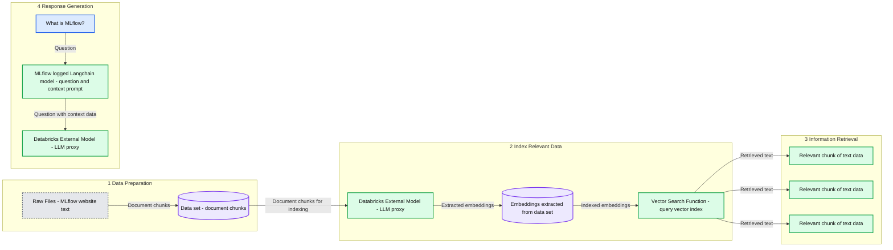

# Offline LLM Evaluation: Step-by-Step GenAI Application Assessment on Databricks

- Source: https://www.databricks.com/blog/offline-llm-evaluation-step-by-step-genai-application-assessment
- Published: 2023-12-14
- Authors: Abe Omorogbe, Liang Zhang, Sunish Sheth, Corey Zumar, Maheswaran Venkatachalam, Emil Lysgaard, Mathias Christiansen
- Categories: engineering, data-science-machine-learning
- Images: 8 total, 5 extracted as architecture

## Background

In an era where Retrieval-Augmented Generation (RAG) is revolutionizing the way we interact with AI-driven applications, ensuring the efficiency and effectiveness of these systems has never been more essential. Databricks and MLflow are at the forefront of this innovation, offering streamlined solutions for the critical evaluation of GenAI applications. 

This blog post guides you through the simple and effective process of leveraging the Databricks Data + AI Platform to enhance and evaluate the quality of the three core components of your GenAI applications: Prompts, Retrieval System, and Foundation LLM, ensuring that your GenAI applications continue to generate accurate results.

## Use Case

We are going to be creating a QA chatbot that will answer questions from the MLflow documentation and then evaluate the results.

**Summary:** A four-stage MLflow documentation QA workflow prepares document chunks, indexes embeddings through Databricks external models, retrieves relevant text with vector search, and supplies context to an MLflow-logged LangChain model for response generation.

**Components:**

- Data Preparation: raw text from the MLflow website becomes a data set of document chunks.
- Index Relevant Data: embedding creation and vector indexing stage.
- Databricks External Model: proxy to an LLM model with routing, credentials, throughput, and logging; logos show OpenAI, Hugging Face, Databricks, and AI.
- Embeddings: embeddings extracted from the data set.
- Vector Search Function: queries the vector index.
- Information Retrieval: three relevant chunks of text data.
- Response Generation: question and retrieved context supplied to the model.
- Question: “What is MLflow?”
- MLflow logged Langchain model: contains the prompt asking the question on the basis of context data.
- Databricks External Model: response-generation LLM proxy with routing, credentials, throughput, and logging; the same provider logos appear below it.

**Flows:**

- Raw Files -> Data set: text converted into document chunks.
- Data set -> Index Relevant Data: document chunks enter the indexing stage.
- Databricks External Model indexing proxy -> Embeddings: embeddings extracted from the data set.
- Embeddings -> Vector Search Function: embeddings made available for vector-index queries.
- Vector Search Function -> Relevant chunk 1: retrieved text data.
- Vector Search Function -> Relevant chunk 2: retrieved text data.
- Vector Search Function -> Relevant chunk 3: retrieved text data.
- Question -> MLflow logged Langchain model: “What is MLflow?”
- MLflow logged Langchain model -> Databricks External Model response proxy: context-bearing question prompt.

**Numbers:** 1 - Data Preparation; 2 - Index Relevant Data; 3 - Information Retrieval; 4 - Response Generation.



<sub>source image: https://www.databricks.com/sites/default/files/inline-images/image1_19.png</sub>

## Set Up External Models in Databricks

Databricks [Model Serving](https://docs.databricks.com/en/generative-ai/external-models/index.html) feature can be used to manage, govern, and access external models from various large language model (LLM) providers, such as Azure OpenAI GPT, Anthropic Claude, or AWS Bedrock, within an organization. It offers a high-level interface that simplifies the interaction with these services by providing a unified endpoint to handle specific LLM related requests.

Major advantages of using [Model Serving](https://docs.databricks.com/en/generative-ai/external-models/index.html):

- **Query Models through a Unified Interface**: Simplifies the interface to call multiple LLMs in your organization. Query models through a unified OpenAI-compatible API and SDK and manage all models through a single UI.
- **Govern and Manage Models**: Centralizes endpoint management of multiple LLMs in your organization. This includes the ability to manage permissions and track usage limits.
- **Central Key Management**: Centralizes API key management in a secure location, which enhances organizational security by minimizing key exposure in the system and code, and reduces the burden on end-users.

Create a Serving Endpoint with an External Model in Databricks

### Explore prompts with the Databricks AI Playground

**In this section, we will understand**: How well do different prompts perform with the chosen LLM?

We recently introduced the Databricks AI [Playground](https://docs.databricks.com/en/machine-learning/foundation-models/supported-models.html#chat-with-supported-llms-using-ai-playground), which provides a best-in-class experience for crafting the perfect prompt. With no code required, you can try out multiple LLMs served as Endpoints in Databricks, and test different parameters and prompts.

**Major advantages of the Databricks AI Playground are:**

- **Quick Testing**: Quickly test deployed models directly in Databricks.
- **Easy Comparison**: Central location to compare multiple models on different prompts and parameters for comparison and selection.

## Using Databricks AI Playground

We delve into testing relevant prompts with OpenAI GPT 3.5 Turbo, leveraging the Databricks [AI Playground](https://docs.databricks.com/en/machine-learning/foundation-models/supported-models.html#chat-with-supported-llms-using-ai-playground). 

### Comparing different prompts and parameters

In the Playground, you are able to compare the output of multiple prompts to see which gives better results. Directly in the Playground, you can try several prompts,  models, and parameters to figure out which combination provides the best results. The model and parameters combo can then be added to the GenAI app and used for answer generation with the right context.

### Adding Model and Parameters to GenAI app

After playing with a few prompts and parameters, you can use the same settings and model in your GenAI application.

Example of how to import the same external model in LangChain. We will cover how we turn this into a GenAI POC in the next section.

## Create GenAI POC with LangChain and log with MLflow

Now that we have found a good model and prompt parameters for your use case, we are going to create a sample GenAI app that is a QA chatbot that will answer questions from the MLflow documentation using a vector database, [embedding model with the Databricks Foundation Model API](https://docs.databricks.com/en/generative-ai/external-models/index.html#supported-models) and Azure OpenAI GPT 3.5 as the generation model.

### Create a sample GenAI app with LangChain using docs from the MLflow website

For customers wanting to scale the retriever used in their GenAI application, we advise using Databricks AI Search, a serverless similarity search engine that allows you to store a vector representation of your data, including metadata, in a vector database.

## Evaluation of Retrieval system with MLflow

**In this section, we will understand**: How well does the retriever work with a given query?

In [MLflow 2.9.1](https://mlflow.org/docs/latest/llms/llm-evaluate/index.html), Evaluation for retrievers was introduced and provides a way for you to assess the efficiency of their retriever with the MLflow evaluate API. You can use this API to evaluate the effectiveness of your embedding model, the top K threshold choice, or the chunking strategy.

### Creating Ground Truth dataset

Curating a ground truth dataset for evaluating your GenAI often involves the meticulous task of manually annotating test sets, a process that demands both time and domain expertise. In this blog, we’re taking a different route. We're [leveraging the power of an LLM to generate synthetic data for testing](https://github.com/mlflow/mlflow/blob/master/examples/llms/RAG/question-generation-retrieval-evaluation.ipynb), offering a quick-start approach to get a sense of your GenAI app's retrieval capability, and a warm-up for all the in-depth evaluation work that may follow. To our readers and customers, we emphasize the importance of crafting a dataset that mirrors the expected inputs and outputs of your GenAI application. It's a journey worth taking for the incredible insights you'll gain!

You can explore with the full dataset but let's demo with a subset of the generated data. The **question** column contains all the questions that will be evaluated and the **source** column is the expected source for the answer for the questions as an ordered list of strings.

### Evaluate the Embedding Model with MLflow

The quality of your embedding model is pivotal for accurate retrieval. In MLflow 2.9.0, we introduced three built-in metrics [mlflow.metrics.precision_at_k(k)](https://mlflow.org/docs/latest/python_api/mlflow.metrics.html#mlflow.metrics.precision_at_k),  [mlflow.metrics.recall_at_k(k)](https://mlflow.org/docs/latest/python_api/mlflow.metrics.html#mlflow.metrics.recall_at_k) and [mlflow.metrics.ndcg_at_k(k)](https://mlflow.org/docs/latest/python_api/mlflow.metrics.html#mlflow.metrics.ndcg_at_k) to help determine how effective your retriever is at predicting the most relevant results for you. For example; Suppose the vector database returns 10 results (k=10), and out of these 10 results, 4 are relevant to your query. The precision_at_10 would be 4/10 or 40%. 

The evaluation will return a table with the results of your evaluation for each question. i.e. for this test, we can see that the retriever seems to performing great for the questions "How to enable MLflow Autologging for my workspace by default?” with a Precision @ K score is 1, and is not retrieving any of the right documentation for the questions "What is MLflow?” since the precision @ K score is 0. With this insight, we can debug the retriever and improve the retriever for questions like “What is MLflow?”.

*Evaluation results when using databricks-bge-large-en embedding model*

**Summary:** The table shows per-question retrieval precision at K values of 1, 2, and 3, alongside source and output documentation URLs.

**Components:**
- question: Evaluation prompts about MLflow and Databricks.
- precision_at_1/score: Retrieval precision at K = 1.
- precision_at_2/score: Retrieval precision at K = 2.
- precision_at_3/score: Retrieval precision at K = 3.
- source: Lists of MLflow documentation URLs, truncated.
- outputs: Lists of MLflow documentation URLs, truncated.

**Flows:**
- none. No arrows are visible.

**Numbers:**

| Question | precision_at_1/score | precision_at_2/score | precision_at_3/score |
|---|---:|---:|---:|
| What is MLflow? | 0 | 0 | 0.00 |
| What is Databricks? | 1 | 1 | 0.67 |
| How to serve a model on Databricks? | 0 | 0 | 0.33 |
| How to enable MLflow Autologging for ... | 1 | 1 | 1.00 |

Column labels contain K values 1, 2, and 3. No units, percentages, or sizes are visible.

```text
%% mermaid failed to render; kept as text
%% Per-question retrieval evaluation table with precision scores and documentation URLs
flowchart TD
    H[question | precision_at_1/score | precision_at_2/score | precision_at_3/score | source | outputs]
    R1[What is MLflow? | 0 | 0 | 0.00 | MLflow documentation URLs | MLflow documentation URLs]
    R2[What is Databricks? | 1 | 1 | 0.67 | MLflow documentation URLs | MLflow documentation URLs]
    R3[How to serve a model on Databricks? | 0 | 0 | 0.33 | MLflow documentation URLs | MLflow documentation URLs]
    R4[How to enable MLflow Autologging for ... | 1 | 1 | 1.00 | MLflow documentation URLs | MLflow documentation URLs]

    classDef client fill:#dbeafe,stroke:#2563eb,stroke-width:2px,color:#111
    classDef service fill:#dcfce7,stroke:#16a34a,stroke-width:2px,color:#111
    classDef store fill:#ede9fe,stroke:#7c3aed,stroke-width:2px,color:#111
    classDef cache fill:#fef3c7,stroke:#d97706,stroke-width:2px,color:#111
    classDef queue fill:#cffafe,stroke:#0891b2,stroke-width:2px,color:#111
    classDef critical fill:#fee2e2,stroke:#dc2626,stroke-width:4px,color:#111
    classDef external fill:#e5e7eb,stroke:#6b7280,stroke-width:2px,color:#111,stroke-dasharray:4 3
    classDef decision fill:#fce7f3,stroke:#db2777,stroke-width:2px,color:#111
    class H,R1,R2,R3,R4 store
```

<sub>source image: https://www.databricks.com/sites/default/files/inline-images/image2_15.png</sub>

Evaluation results when using databricks-bge-large-en embedding model

### Evaluate retriever with different Top K values with MLflow

You can quickly calculate the metrics for different Ks by specifying the extra_metrics argument.

The evaluation will return a table with the results of your evaluation for each question, and you can better understand which K value to use when retrieving documents. i.e. for this test we can see changing the top K value can positively affect the precision of the retriever for questions like “What is Databricks”.

*Evaluation result with all precision @ K values*

**Summary:** The table shows per-question retrieval precision at K values of 1, 2, and 3, alongside source and output documentation URLs.

**Components:**
- question: Evaluation prompts about MLflow and Databricks.
- precision_at_1/score: Retrieval precision at K = 1.
- precision_at_2/score: Retrieval precision at K = 2.
- precision_at_3/score: Retrieval precision at K = 3.
- source: Lists of MLflow documentation URLs, truncated.
- outputs: Lists of MLflow documentation URLs, truncated.

**Flows:**
- none. No arrows are visible.

**Numbers:**

| Question | precision_at_1/score | precision_at_2/score | precision_at_3/score |
|---|---:|---:|---:|
| What is MLflow? | 0 | 0 | 0.00 |
| What is Databricks? | 1 | 1 | 0.67 |
| How to serve a model on Databricks? | 0 | 0 | 0.33 |
| How to enable MLflow Autologging for ... | 1 | 1 | 1.00 |

Column labels contain K values 1, 2, and 3. No units, percentages, or sizes are visible.

```text
%% mermaid failed to render; kept as text
%% Per-question retrieval evaluation table with precision scores and documentation URLs
flowchart TD
    H[question | precision_at_1/score | precision_at_2/score | precision_at_3/score | source | outputs]
    R1[What is MLflow? | 0 | 0 | 0.00 | MLflow documentation URLs | MLflow documentation URLs]
    R2[What is Databricks? | 1 | 1 | 0.67 | MLflow documentation URLs | MLflow documentation URLs]
    R3[How to serve a model on Databricks? | 0 | 0 | 0.33 | MLflow documentation URLs | MLflow documentation URLs]
    R4[How to enable MLflow Autologging for ... | 1 | 1 | 1.00 | MLflow documentation URLs | MLflow documentation URLs]

    classDef client fill:#dbeafe,stroke:#2563eb,stroke-width:2px,color:#111
    classDef service fill:#dcfce7,stroke:#16a34a,stroke-width:2px,color:#111
    classDef store fill:#ede9fe,stroke:#7c3aed,stroke-width:2px,color:#111
    classDef cache fill:#fef3c7,stroke:#d97706,stroke-width:2px,color:#111
    classDef queue fill:#cffafe,stroke:#0891b2,stroke-width:2px,color:#111
    classDef critical fill:#fee2e2,stroke:#dc2626,stroke-width:4px,color:#111
    classDef external fill:#e5e7eb,stroke:#6b7280,stroke-width:2px,color:#111,stroke-dasharray:4 3
    classDef decision fill:#fce7f3,stroke:#db2777,stroke-width:2px,color:#111
    class H,R1,R2,R3,R4 store
```

<sub>source image: https://www.databricks.com/sites/default/files/inline-images/image2_16.png</sub>

Evaluation result with all precision @ K values

### Evaluate the Chunking Strategy with MLflow

The effectiveness of your chunking strategy is critical. We explore how MLflow can assist in this evaluation, focusing on the retrieval model type and its impact on overall performance.

The evaluation will return 2 tables with the results of your evaluation for each question using 2 different chunk sizes, and you can better understand which chunk size to use when retrieving documents. I.e. for this example, it seems like changing the chunk size did not affect any metric.

*Evaluation result with Chunk size of 1000*

**Summary:** Retrieval evaluation results show precision, recall, NDCG, source URLs, and output URLs for four questions.

**Components:**
- question: Evaluation prompts about MLflow and Databricks.
- precision: Retrieval precision metric.
- recall: Retrieval recall metric.
- ndcg: Normalized discounted cumulative gain metric.
- source: Reference MLflow documentation URLs.
- outputs: Retrieved MLflow documentation URLs.

**Flows:**
- none. No arrows indicating data flow are visible.

**Numbers:**

| Question | precision | recall | ndcg |
|---|---:|---:|---:|
| What is MLflow? | 1 | 1 | 1.00 |
| What is Databricks? | 0 | 0 | 0.53 |
| How to serve a model on Databricks? | 0 | 0 | 0.53 |
| How to enable MLflow Autologging for my wor... | 1 | 1 | 1.00 |



<sub>source image: https://www.databricks.com/sites/default/files/inline-images/image5_5.png</sub>

```mermaid
%% Retrieval evaluation table with four questions and their metrics
flowchart TD
    A["question | precision | recall | ndcg | source | outputs"]
    B["What is MLflow? | 1 | 1 | 1.00"]
    C["What is Databricks? | 0 | 0 | 0.53"]
    D["How to serve a model on Databricks? | 0 | 0 | 0.53"]
    E["How to enable MLflow Autologging for my wor... | 1 | 1 | 1.00"]
    F["source and outputs contain MLflow documentation URLs"]

    classDef client fill:#dbeafe,stroke:#2563eb,stroke-width:2px,color:#111
    classDef service fill:#dcfce7,stroke:#16a34a,stroke-width:2px,color:#111
    classDef store fill:#ede9fe,stroke:#7c3aed,stroke-width:2px,color:#111
    classDef cache fill:#fef3c7,stroke:#d97706,stroke-width:2px,color:#111
    classDef queue fill:#cffafe,stroke:#0891b2,stroke-width:2px,color:#111
    classDef critical fill:#fee2e2,stroke:#dc2626,stroke-width:4px,color:#111
    classDef external fill:#e5e7eb,stroke:#6b7280,stroke-width:2px,color:#111,stroke-dasharray:4 3
    classDef decision fill:#fce7f3,stroke:#db2777,stroke-width:2px,color:#111
    class A,B,C,D,E store
    class F external
```

Evaluation result with Chunk size of 1000

*Evaluation result with Chunk size of 2000*

**Summary:** Retrieval evaluation results show precision, recall, NDCG, source URLs, and output URLs for four questions.

**Components:**
- question: Evaluation prompts about MLflow and Databricks.
- precision: Retrieval precision metric.
- recall: Retrieval recall metric.
- ndcg: Normalized discounted cumulative gain metric.
- source: Reference MLflow documentation URLs.
- outputs: Retrieved MLflow documentation URLs.

**Flows:**
- none. No arrows indicating data flow are visible.

**Numbers:**

| Question | precision | recall | ndcg |
|---|---:|---:|---:|
| What is MLflow? | 1 | 1 | 1.00 |
| What is Databricks? | 0 | 0 | 0.53 |
| How to serve a model on Databricks? | 0 | 0 | 0.53 |
| How to enable MLflow Autologging for my wor... | 1 | 1 | 1.00 |


<sub>source image: https://www.databricks.com/sites/default/files/inline-images/image5_7.png</sub>

Evaluation result with Chunk size of 2000

Check out the in-depth notebook on Retrieval evaluation

## Evaluation of GenAI results with MLflow

**In this section, we will understand**: How good is the response of the GenAI app with a given prompt and context?

Assessing the quality of generated responses is key. We will augment the manual process of evaluating with questions and answers by leveraging MLflow's QA metrics, and comparing them against a GPT-4 model as a benchmark to understand the effectiveness of the generated answers. 

Using an [LLM like GPT-4 as a judge to assist in evaluation](https://www.databricks.com/blog/announcing-mlflow-28-llm-judge-metrics-and-best-practices-llm-evaluation-rag-applications-part) can offer several benefits, **here are some key benefits**:

- **Rapid and Scalable Experimentation**: In many situations, we think LLM judges represent a sweet-spot: they can evaluate unstructured outputs (like a response from a chat-bot) automatically, rapidly, and at low-cost.  
- **Cost-Effective**: By automating some evaluations with LLMs, we consider it a worthy companion to human evaluation, which is slower and more expensive but represents the gold standard of model evaluation.

### Use MLflow evaluate and LLM as a judge

We take some sample questions and use the LLM as a judge, and inspect the results with MLflow, providing a comprehensive analysis of the outcome with [built-in metrics](https://mlflow.org/docs/latest/llms/llm-evaluate/index.html#metrics-with-llm-as-the-judge). We are going to judge the GenAI app on relevance (how relevant is the output with respect to both the input and the context).

*Create a simple function that runs each input through the chain*

Use relevance metric to determine the relevance of the answer and context. There [are other metrics](https://mlflow.org/docs/latest/llms/llm-evaluate/index.html#metrics-with-llm-as-the-judge) you can use too.

In your Databricks workspace, you can compare and evaluate all your inputs and outputs, as well as the source documents, relevance and any other metrics you added to your evaluation function.

[Check out more in depth notebooks on LLM evaluation](https://mlflow.org/docs/latest/llms/llm-evaluate/notebooks/index.html#llm-evaluation-examples)

## Customers using Databricks to supercharge GenAI app quality

> Databricks with its advanced evaluation capabilities, played a key role in elevating our RAG (Retrieval-Augmented Generation) project to a highly effective and efficient QA chatbot. Its user-friendly interface, coupled with in-depth metrics, offered valuable insights into the performance of our RAG application. These features proved essential for our business, leading to a substantial decrease in false positives and hallucinations, which in turn greatly enhanced the precision and dependability of our chatbot's responses.—Manuel Valero Mendez, Head of Big Data at Santa Lucía Seguros

## Conclusion

Databricks Data + AI Platform makes it easy to evaluate your GenAI application to ensure you have a high-quality application. By dissecting each component – from prompt creation with AI Playground to final answer generation – we can ensure that every aspect of the GenAI application meets the highest standards of quality and efficiency. 

This blog serves as a guide for developers looking to harness the power of Databricks’ Data + AI Platform to evaluate your GenAI application. 

For a production-grade GenAI application, the evaluation should be automated and part as a job, executed every time the application is changed and benchmarked against previous versions to make sure you don't have performance regression.

## Get started with LLM Evaluation on Databricks Data + AI Platform

[Try out Databricks Evaluation Notebooks today.](https://mlflow.org/docs/latest/llms/rag/notebooks/mlflow-e2e-evaluation.html)

## For more information:

- Read [Databricks Docs on Evaluating GenAI Application](https://docs.databricks.com/en/mlflow/llm-evaluate.html#llm-evaluation-with-mlflow-example-notebook)
- See Databrick Demo for GenAI Application and Evaluation
- Explore the [Foundation Model API](https://docs.databricks.com/en/machine-learning/foundation-models/index.html) and [External Models Documentation](https://docs.databricks.com/en/generative-ai/external-models/index.html#supported-models).
- Discover more about [MLflow](https://mlflow.org/docs/latest/index.html).
- Discover foundation models in the [Databricks Marketplace](https://marketplace.databricks.com/?asset=Model&provider=Databricks&sortBy=date).
- Sign–up for a [Databricks Generative AI Webinar](https://www.databricks.com/resources/webinar/disrupt-your-industry-generative-ai)
