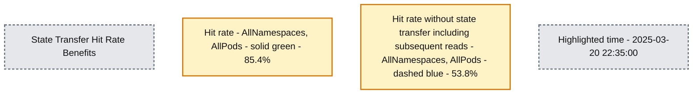

# Open sourcing Dicer: Databricks' auto-sharder

*Building highly available sharded services at scale for high performance and low cost*

- Source: https://www.databricks.com/blog/open-sourcing-dicer-databricks-auto-sharder
- Published: 2026-01-13
- Authors: Atul Adya, Colin Meek, Jonathan Ellithorpe, Vivek Jain, Yongxin Xu
- Categories: engineering
- Images: 5 total, 2 extracted as architecture

**Key takeaways**

- Open sourcing Dicer: We are officially open sourcing Dicer, the foundational auto sharding system used at Databricks to build fast, scalable, and highly available sharded services.
- The What and Why of Dicer: We describe the problems with typical service architectures today, and why auto-sharders are needed, how Dicer solves these problems, and discuss its core abstractions and use cases.
- Success stories: The system currently powers mission critical components like Unity Catalog and our SQL query orchestration engine, where it has successfully eliminated availability dips and maintained cache hit rates above 90% during pod restarts.

## 1. Announcement

Today, we are excited to announce the open sourcing of one of our most critical infrastructure components, [Dicer: Databricks’ auto-sharder](https://github.com/databricks/dicer), a foundational system designed to build low latency, scalable, and highly reliable sharded services. It is behind the scenes of every major Databricks product, enabling us to deliver a consistently fast user experience while improving fleet efficiency and reducing cloud costs. Dicer achieves this by dynamically managing sharding assignments to keep services responsive and resilient even in the face of restarts, failures, and shifting workloads. As detailed in this blog post, Dicer is used for a variety of use cases including high-performance serving, work partitioning, batching pipelines, data aggregation, multi-tenancy, soft leader election, efficient GPU utilization for AI workloads, and more.

By making Dicer available to the broader community, we look forward to collaborating with industry and academia to advance the state of the art in building robust, efficient, and high-performance distributed systems. In the rest of this post, we discuss the motivation and design philosophy behind Dicer, share success stories from its use at Databricks, and provide a guide on how to install and experiment with the system yourself.

## 2. Motivation: Moving Beyond Stateless and Statically-Sharded Architectures

Databricks ships a rapidly expanding suite of products for data processing, analytics, and AI. To support this at scale, we operate hundreds of services that must handle massive state while maintaining responsiveness. Historically, Databricks engineers had relied on two common architectures, but both introduced significant problems as services grew:

### 2.1. The Hidden Costs of Stateless Architectures

Most services at Databricks began with a stateless model. In a typical stateless model, the application does not retain in-memory state across requests, and must re-read the data from the database on every request. This architecture is inherently expensive as every request incurs a database hit, driving up both operational costs and latency [[1](https://doi.org/10.1145/3772356.3772388)].

To mitigate these costs, developers would often introduce a remote cache (like Redis or Memcached) to offload work from the database. While this improved throughput and latency, it failed to solve several fundamental inefficiencies:

- **Network Latency:** Every request still pays the "tax" of network hops to the caching layer.
- **CPU Overhead:** Significant cycles are wasted on (de)serialization as data moves between the cache and the application [[2](https://dl.acm.org/doi/10.1145/3317550.3321434)].
- **The "**[**Overread**](https://dl.acm.org/doi/10.1145/3317550.3321434)**" Problem:** Stateless services often fetch entire objects or large blobs from the cache only to use a small fraction of the data. These overreads waste bandwidth and memory, as the application discards the majority of the data it just spent time fetching [[2](https://dl.acm.org/doi/10.1145/3317550.3321434)].

Moving to a sharded model and caching state in memory eliminated these layers of overhead by colocating the state directly with the logic that operates on it. However, static sharding introduced new problems.

### 2.2. The Fragility of Static Sharding

Before Dicer, sharded services at Databricks relied on **static sharding** techniques (e.g., consistent hashing). While this approach was simple and allowed our services to efficiently cache state in memory, it introduced three critical issues in production:

- **Unavailability during restarts and auto scaling:** The lack of coordination with a cluster manager led to downtime or performance degradation during maintenance operations like rolling updates or when dynamically scaling a service. Static sharding schemes failed to proactively adjust to backend membership changes, reacting only after a node had already been removed.
- **Prolonged split-brain and downtime during failures:** Without central coordination, clients could develop inconsistent views of the set of backend pods when pods crashed or became intermittently unresponsive. This resulted in "split-brain" scenarios (where two pods believed they owned the same key) or even dropping a customer’s traffic entirely (where no pod believed it owned the key).
- **The hot key problem:** By definition, static sharding cannot dynamically rebalance key assignments or adjust replication in response to load shifts. Consequently, a single "hot key" would overwhelm a specific pod, creating a bottleneck that could trigger cascading failures across the fleet.

As our services grew more and more to meet demand, eventually static sharding looked like a terrible idea. This led to a common belief among our engineers that stateless architectures were the best way to build robust systems, even if it meant eating the performance and resource costs. This was around the time when Dicer was introduced.

### 2.3. Redefining the Sharded Service Narrative

The production perils of static sharding, contrasted with the costs of going stateless, left several of our most critical services in a difficult position. These services relied on static sharding to deliver a snappy user experience to our customers. Converting them to a stateless model would have introduced a significant performance penalty, not to mention added cloud costs for us.

We built Dicer to change this. Dicer addresses the fundamental shortcomings of static sharding by introducing an intelligent control plane that continuously and asynchronously updates a service’s shard assignments. It reacts to a wide range of signals, including application health, load, termination notices, and other environmental inputs. As a result, Dicer keeps services highly available and well balanced even during rolling restarts, crashes, autoscaling events, and periods of severe load skew.

As an auto-sharder, Dicer builds on a long line of prior systems, including [Centrifuge](http://static.usenix.org/events/nsdi10/tech/full_papers/adya.pdf) [3], [Slicer](https://www.usenix.org/system/files/conference/osdi16/osdi16-adya.pdf) [4], and [Shard Manager](https://dl.acm.org/doi/10.1145/3477132.3483546) [5]. We introduce Dicer in the next section, and describe how it has helped improve performance, reliability, and efficiency of our services.

## 3. Dicer: Dynamic Sharding for High Performance and Availability

We now give an overview of Dicer, its core abstractions, and describe its various use cases. Stay tuned for a technical deep dive into Dicer’s design and architecture in a future blog post.

### 3.1 Dicer overview

Dicer models an application as serving requests (or otherwise performing some work) associated with a logical key. For example, a service that serves user profiles might use user IDs as its keys. Dicer shards the application by continuously generating an assignment of keys to pods to keep the service highly available and load balanced.

To scale to applications with millions or billions of keys, Dicer operates on ranges of keys rather than individual keys. Applications represent keys to Dicer using a **SliceKey** (a hash of the application key), and a contiguous range of SliceKeys is called a **Slice**. As shown in Figure 1, a Dicer **Assignment** is a collection of Slices that together span the full application keyspace, with each Slice assigned to one or more **Resources** (i.e. pods). Dicer dynamically splits, merges, replicates, and reassigns Slices in response to application health and load signals, ensuring that the entire keyspace is always assigned to healthy pods and that no single pod becomes overloaded. Dicer can also detect hot keys and split them out into their own slices, and assign such slices to multiple pods to distribute the load.

Figure 1 shows an example Dicer assignment across 3 pods (P0, P1, and P2) for an application sharded by user ID, where the user with ID 13 is represented by SliceKey K26 (i.e. a hash of ID 13), and is currently assigned to pod P0. A hot user with user ID 42 and represented by SliceKey K10 has been isolated in its own slice and assigned to multiple pods to handle the load (P1 and P2).

 

[Figure 1. Example Dicer assignment of slices to pods.](https://www.databricks.com/sites/default/files/2026-01/Dicer-Blog-Post-Figure-1.svg)

Figure 2 shows an overview of a sharded application integrated with Dicer. Application pods learn the current assignment through a library called the **Slicelet** (S for server side). The Slicelet maintains a local cache of the latest assignment by fetching it from the Dicer service and watching for updates. When it receives an updated assignment, the Slicelet notifies the application via a listener API.

Assignments observed by Slicelets are eventually consistent, a deliberate design choice that prioritizes availability and fast recovery over strong key ownership guarantees. In our experience this has been the right model for the vast majority of applications, though we do plan to support stronger guarantees in the future, similar to Slicer and Centrifuge.

Besides keeping up-to-date on the assignment, applications also use the Slicelet to record per key load when handling requests or performing work for a key. The Slicelet aggregates this information locally and asynchronously reports a summary to the Dicer service. Note that, like assignment watching, this also occurs off the application’s critical path, ensuring high performance.

Clients of a Dicer sharded application find the assigned pod for a given key through a library called the **Clerk** (C for client side). Like Slicelets, Clerks also actively maintain a local cache of the latest assignment in the background to ensure high performance for key lookups on the critical path.

[Figure 2. Dicer system overview.](data-lightbox="")

Finally, the Dicer **Assigner** is the controller service responsible for generating and distributing assignments based on application health and load signals. At its core is a sharding algorithm that computes minimal adjustments through Slice splits, merges, replication/dereplication, and moves to keep keys assigned to healthy pods and the overall application sufficiently load balanced. The Assigner service is multi-tenant and designed to provide auto-sharding service for all sharded applications within a region. Each sharded application served by Dicer is referred to as a **Target**.

### 3.2 Broad class of applications enhanced by Dicer

Dicer is valuable for a wide range of systems because the ability to affinitize workloads to specific pods yields significant performance improvements. We have identified several core categories of use cases based on our production experience.

#### **In-Memory and GPU Serving**

Dicer excels at scenarios where a large corpus of data must be loaded and served directly from memory. By ensuring that requests for specific keys always hit the same pods, services like key-value stores can achieve sub-millisecond latency and high throughput while avoiding the overhead of fetching data from remote storage.

Dicer is also well suited to modern LLM inference workloads, where maintaining affinity is critical. Examples include stateful user sessions that accumulate context in a per-session KV cache, as well as deployments that serve large numbers of LoRA adapters and must shard them efficiently across constrained GPU resources.

#### **Control and scheduling systems**

This is one of the most common use cases at Databricks. It includes systems such as cluster managers and query orchestration engines that continuously monitor resources to manage scaling, compute scheduling, and multi-tenancy. To operate efficiently, these systems maintain monitoring and control state locally, avoiding repeated serialization and enabling timely responses to change.

#### **Remote Caches**

Dicer can be used to build high-performance distributed remote caches, which we have done in production at Databricks. By using Dicer’s capabilities, our cache can be autoscaled and restarted seamlessly without loss of hit rate, and avoid load imbalance due to hot keys.

#### **Work Partitioning and Background Work**

Dicer is an effective tool for partitioning background tasks and asynchronous workflows across a fleet of servers. For example, a service responsible for cleaning up or garbage-collecting state in a massive table can use Dicer to ensure that each pod is responsible for a distinct, non-overlapping range of the keyspace, preventing redundant work and lock contention.

#### **Batching and Aggregation**

For high-volume write paths, Dicer enables efficient record aggregation. By routing related records to the same pod, the system can batch updates in memory before committing them to persistent storage. This significantly reduces the input/output operations per second required and improves the overall throughput of the data pipeline.

#### **Soft Leader Selection**

Dicer can be used to implement "soft" leader selection by designating a specific pod as the primary coordinator for a given key or shard. For example, a serving scheduler can use Dicer to ensure that a single pod acts as the primary authority for managing a group of resources. While Dicer currently provides affinity-based leader selection, it serves as a powerful foundation for systems that require a coordinated primary without the heavy overhead of traditional consensus protocols. We are exploring future enhancements to provide stronger guarantees around mutual exclusion for these workloads.

#### **Rendezvous and Coordination**

Dicer acts as a natural rendezvous point for distributed clients needing real-time coordination. By routing all requests for a specific key to the same pod, that pod becomes a central meeting place where shared state can be managed in local memory without external network hops.

For example, in a real-time chat service, two clients joining the same "Chat Room ID" are automatically routed to the same pod. This allows the pod to synchronize their messages and state instantly in memory, avoiding the latency of a shared database or a complex back-plane for communication.

## 4. Success stories

Numerous services at Databricks have achieved significant gains with Dicer, and we highlight several of these success stories below.

### 4.1 Unity Catalog

Unity Catalog (UC) is the unified governance solution for data and AI assets across the Databricks platform. Originally designed as a stateless service, UC faced significant scaling challenges as its popularity grew, driven primarily by extremely high read volume. Serving each request required repeated access to the backend database, which introduced prohibitive latency. Conventional approaches such as remote caching were not viable, as the cache needed to be updated incrementally and remain snapshot consistent with storage. In addition, customer catalogs can be gigabytes in size, making it costly to maintain partial or replicated snapshots in a remote cache without introducing substantial overhead.

To solve this, the team integrated Dicer to build a sharded in-memory stateful cache. This shift allowed UC to replace expensive remote network calls with local method calls, drastically reducing database load and improving responsiveness. The figure below illustrates the initial rollout of Dicer, followed by the deployment of the full Dicer integration. By utilizing Dicer’s stateful affinity, UC achieved a cache hit rate of 90–95%, significantly lowering the frequency of database round-trips.

[Figure 3: Reduction in database calls by the Unity Catalog service due to Dicer](https://www.databricks.com/sites/default/files/2026-01/Dicer-Blog-Post-Figure-3.svg)

### 4.2 SQL Query Orchestration Engine

Databricks’ query orchestration engine, which manages query scheduling on Spark clusters, was originally built as an in-memory stateful service using static sharding. As the service scaled, the limitations of this architecture became a significant bottleneck; due to the simple implementation, scaling required manual re-sharding which was extremely toilsome, and the system suffered from frequent availability dips, even during rolling restarts.

After integrating with Dicer, these availability issues were eliminated (see Figure 4). Dicer enabled zero downtime during restarts and scaling events, allowing the team to reduce toil and improve system robustness by enabling auto-scaling everywhere. Additionally, Dicer’s dynamic load balancing feature further resolved chronic CPU throttling, resulting in more consistent performance across the fleet.

*Figure 4: Reduction in availability-loss by the query orchestration service due to Dicer*

**Summary:** Success rate fluctuates before the marked Dicer integration around October 12, 2024, then stays close to 1.

**Components:**
- Success Rate: vertical axis for the teal series; underlying service technology is not labeled.
- Date: horizontal axis.
- Integrated with Dicer: red annotation identifying Dicer integration.

**Flows:**
- Integrated with Dicer -> success-rate series near October 12: red arrow marks the integration point.

**Numbers:** Vertical-axis labels: 1 and 0.99. Date labels: 2024-08-01, 2024-08-03, 2024-08-05, 2024-08-07, 2024-08-09, 2024-08-11, 2024-08-13, 2024-08-15, 2024-08-17, 2024-08-19, 2024-08-21, 2024-08-23, 2024-08-25, 2024-08-27, 2024-08-29, 2024-08-31, 2024-09-02, 2024-09-04, 2024-09-06, 2024-09-08, 2024-09-10, 2024-09-12, 2024-09-14, 2024-09-16, 2024-09-18, 2024-09-20, 2024-09-22, 2024-09-24, 2024-09-26, 2024-09-28, 2024-09-30, 2024-10-02, 2024-10-04, 2024-10-06, 2024-10-08, 2024-10-10, 2024-10-12, 2024-10-14, 2024-10-16, 2024-10-18, 2024-10-20, 2024-10-22, 2024-10-24, 2024-10-26, 2024-10-28, 2024-10-30, 2024-11-01, 2024-11-03.

source image: https://www.databricks.com/sites/default/files/inline-images/open-sourcing-dicer-databricks-auto-sharder-image-4.png

[Figure 4: Reduction in availability-loss by the query orchestration service due to Dicer](https://www.databricks.com/sites/default/files/inline-images/open-sourcing-dicer-databricks-auto-sharder-image-4.png)

### 4.3 Softstore remote cache

For services that are not sharded, we developed Softstore, a distributed remote key value cache. Softstore leverages a Dicer feature called state transfer, which migrates data between pods during resharding to preserve application state. This is particularly important during planned rolling restarts, where the full keyspace is unavoidably churned. In our production fleet, planned restarts account for roughly 99.9% of all restarts, making this mechanism especially impactful and enables seamless restarts with negligible impact on cache hit rates. Figure 5 shows Softstore hit rates during a rolling restart, where state transfer preserves a steady ~85% hit rate for a representative use case, with the remaining variability driven by normal workload fluctuations.

*Figure 5. Comparison of Softstore cache hit rates with and without state transfer. Without state transfer, hit rates drop by roughly 30%, whereas with state transfer hit rates are preserved.*

**Summary:** State transfer maintains hit rates around 80-90%, while hit rates without state transfer fall substantially, reaching 53.8% at the highlighted time.

**Components:**
- State Transfer Hit Rate Benefits: chart comparing cache hit rates over time.
- Hit rate - AllNamespaces, AllPods: solid green series with state transfer.
- Hit rate without state transfer (incl subsequent reads) - AllNamespaces, AllPods: dashed blue series without state transfer.
- No specific cache technology is named in the image.

**Flows:**
- none. Lines represent measurements over time, not flows between components.

**Numbers:**
- Highlighted timestamp: 2025-03-20 22:35:00.
- Highlighted hit rates: 85.4% with state transfer; 53.8% without state transfer.
- Visible percentage-axis labels: 0.0%, 10.0%, 20.0% partially obscured, 40.0%, 50.0%, 60.0%, 70.0%, 80.0%, 90.0%.
- Time-axis labels: 21:30, 21:40, 21:50, 22:00, 22:10, 22:20, 22:30, 22:40, 22:50, 23:00, 23:10, and a clipped final label reading 23:2.

source image: https://www.databricks.com/sites/default/files/inline-images/open-sourcing-dicer-databricks-auto-sharder-image-5.png

[Figure 5. Comparison of Softstore cache hit rates with and without state transfer. Without state transfer, hit rates drop by roughly 30%, whereas with state transfer hit rates are preserved.](https://www.databricks.com/sites/default/files/inline-images/open-sourcing-dicer-databricks-auto-sharder-image-5.png)

## 5. Now you can use it too!

You can try out Dicer today on your machine by downloading it from [here](https://github.com/databricks/dicer). A simple demo to show its usage is provided [here](https://github.com/databricks/dicer/tree/master/dicer/demo) - it shows a sample Dicer setup with one client and a few servers for an application. Please see the [README](https://github.com/databricks/dicer/blob/master/README.md) and [user guide](https://github.com/databricks/dicer/tree/master/docs/UserGuide.md) for Dicer.

## 6. Upcoming features and articles

Dicer is a critical service used across Databricks with its usage growing quickly. In the future, we will be publishing more articles about Dicer’s inner workings and designs. We will also release more features as we build and test them out internally, e.g., Java and Rust libraries for clients and servers, and the state transfer capabilities mentioned in this post. Please give us your feedback and stay tuned for more!

If you like solving tough engineering problems and would like to join Databricks, check out [databricks.com/careers](https://www.databricks.com/company/careers)!

## 7. References

**[1]** Ziming Mao, Jonathan Ellithorpe, Atul Adya, Rishabh Iyer, Matei Zaharia, Scott Shenker, Ion Stoica (2025). [*Rethinking the cost of distributed caches for datacenter services*](https://doi.org/10.1145/3772356.3772388). Proceedings of the 24th ACM Workshop on Hot Topics in Networks, 1–8.

**[2]** Atul Adya, Robert Grandl, Daniel Myers, Henry Qin. [*Fast key-value stores: An idea whose time has come and gone*](https://dl.acm.org/doi/10.1145/3317550.3321434). Proceedings of the Workshop on Hot Topics in Operating Systems (HotOS ’19), May 13–15, 2019, Bertinoro, Italy. ACM, 7 pages. DOI: 10.1145/3317550.3321434.

**[3]** Atul Adya, James Dunagan, Alexander Wolman. [*Centrifuge: Integrated Lease Management and Partitioning for Cloud Services*](http://static.usenix.org/events/nsdi10/tech/full_papers/adya.pdf). Proceedings of the 7th USENIX Symposium on Networked Systems Design and Implementation (NSDI), 2010.

**[4]** Atul Adya, Daniel Myers, Jon Howell, Jeremy Elson, Colin Meek, Vishesh Khemani, Stefan Fulger, Pan Gu, Lakshminath Bhuvanagiri, Jason Hunter, Roberto Peon, Larry Kai, Alexander Shraer, Arif Merchant, Kfir Lev-Ari. [*Slicer: Auto-Sharding for Datacenter Applications*](https://www.usenix.org/system/files/conference/osdi16/osdi16-adya.pdf). Proceedings of the 12th USENIX Symposium on Operating Systems Design and Implementation (OSDI), 2016, pp. 739–753.

**[5]** Sangmin Lee, Zhenhua Guo, Omer Sunercan, Jun Ying, Chunqiang Tang, et al. [*Shard Manager: A Generic Shard Management Framework for Geo distributed Applications*](https://dl.acm.org/doi/10.1145/3477132.3483546). Proceedings of the ACM SIGOPS 28th Symposium on Operating Systems Principles (SOSP), 2021. DOI: 10.1145/3477132.3483546.

**[6]** Atul Adya, Jonathan Ellithorpe. [*Stateful services: low latency, efficiency, scalability — pick three*](https://hpts.ws/papers/2024/2024_session8_adya.pptx). High Performance Transaction Systems Workshop (HPTS) 2024, Pacific Grove, California, September 15–18, 2024.
