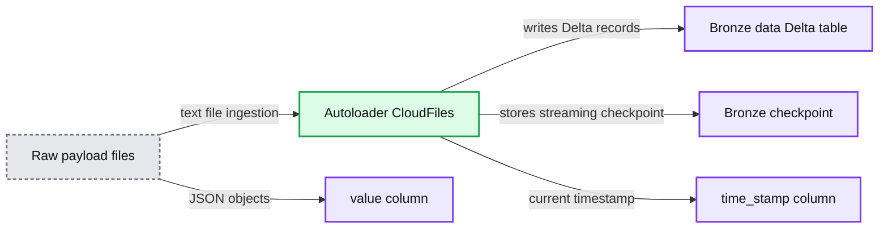
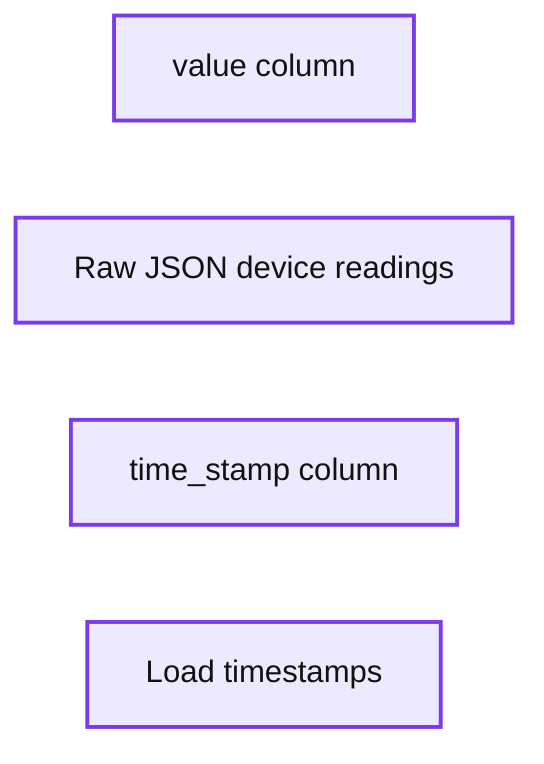
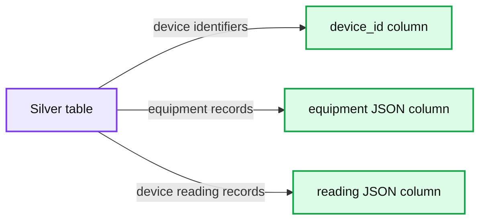
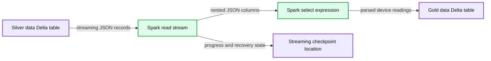
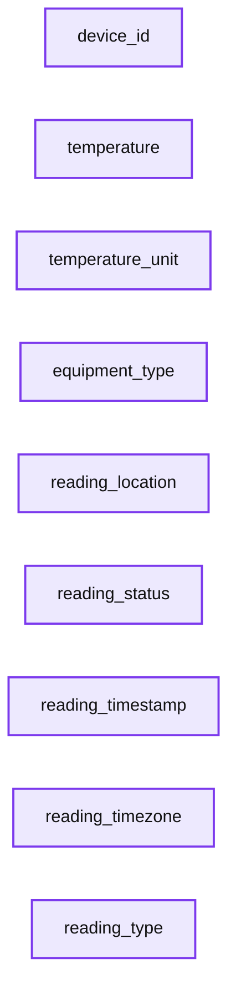
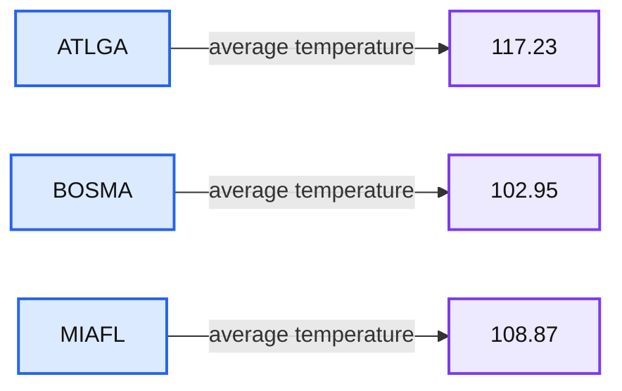

# Parsing Improperly Formatted JSON Objects in the Databricks Lakehouse

- Source: https://www.databricks.com/blog/parsing-improperly-formatted-json-objects-databricks-lakehouse
- Published: 2022-09-07
- Authors: Ashleigh Bynum
- Categories: engineering
- Images: 24 total, 9 extracted as architecture

## Introduction

When working with files, there may be processes generated by custom APIs or applications that cause more than one JSON object to write to the same file. The following is an example of a file that contains multiple device IDs:

There's a generated text file that contains multiple device readings from various pieces of equipment in the form of JSON object, but if we were to try to parse this using the json.load() function, the first line record is treated as the top-level definition for the data. Everything after the first device-id record gets disregarded, preventing the other records in the file from being read. A JSON file is invalid if it contains more than one JSON object when using this function.

The most straightforward resolution to this is to fix the formatting at the source, whether that means rewriting the API or application to format correctly. However, it isn't always possible for an organization to do this due to legacy systems or processes outside its control. Therefore, the problem to solve is to take an invalid text file with valid JSON objects and properly format it for parsing.

Instead of using the PySpark json.load() function, we'll utilize Pyspark and Autoloader to insert a top-level definition to encapsulate all device IDs and then load the data into a table for parsing.

## Databricks Medallion Architecture

The Databricks Medallion Architecture is our design pattern for ingesting and incrementally refining data as it moves through the different layers of the architecture:

**Summary:** The diagram shows data moving through Bronze, Silver, and Gold quality layers from ingestion sources to analytics and reporting.

**Components:**

- Kafka: streaming ingestion technology
- Amazon Kinesis: streaming ingestion technology
- Data Lake: storage for CSV, JSON, and TXT files
- Apache Spark: processing technology
- Bronze: raw ingestion layer
- Silver: filtered, cleaned, and augmented layer
- Gold: business-level aggregate layer
- Streaming Analytics: analytics output
- AI and Reporting: reporting output
- Data Quality Levels: Bronze, Silver, and Gold quality progression

**Flows:**

- Kafka, Amazon Kinesis, Data Lake, and Apache Spark -> Bronze: raw source data
- Bronze -> Silver: filtered, cleaned, and augmented data
- Silver -> Gold: business-level aggregates
- Gold -> Streaming Analytics: curated business data
- Gold -> AI and Reporting: curated business data

**Numbers:** none



<sub>source image: https://www.databricks.com/sites/default/files/inline-images/db-198-blog-img-2.png</sub>

```mermaid
%% Data flow through the Databricks Medallion Architecture
flowchart LR
    S[Kafka Kinesis Data Lake Spark]
    B[Bronze Raw Ingestion]
    Si[Silver Filtered Cleaned Augmented]
    G[Gold Business Level Aggregates]
    A[Streaming Analytics]
    R[AI and Reporting]
    Q[Data Quality Levels]
    D[CSV JSON TXT]

    S -->|raw source data| B
    D -->|files| B
    B -->|filtered cleaned augmented data| Si
    Si -->|business level aggregates| G
    G -->|curated business data| A
    G -->|curated business data| R
    Q -.->|increases across layers| G

    classDef client fill:#dbeafe,stroke:#2563eb,stroke-width:2px,color:#111
    classDef service fill:#dcfce7,stroke:#16a34a,stroke-width:2px,color:#111
    classDef store fill:#ede9fe,stroke:#7c3aed,stroke-width:2px,color:#111
    classDef cache fill:#fef3c7,stroke:#d97706,stroke-width:2px,color:#111
    classDef queue fill:#cffafe,stroke:#0891b2,stroke-width:2px,color:#111
    classDef critical fill:#fee2e2,stroke:#dc2626,stroke-width:4px,color:#111
    classDef external fill:#e5e7eb,stroke:#6b7280,stroke-width:2px,stroke-dasharray:4 3,color:#111
    classDef decision fill:#fce7f3,stroke:#db2777,stroke-width:2px,color:#111

    class S,D external
    class B,Si,G store
    class A,R service
    class Q decision
```

The traditional pattern uses the **Bronze** layer to land the data from external source systems into the Lakehouse. As ETL patterns are applied to the data, the data from the Bronze layer is matched, filtered, and cleansed just enough to provide an enterprise view of the data. This layer serves as the **Silver** layer and is the starting point for ad-hoc analysis, advanced analytics, and machine learning (ML). The final layer, known as the **Gold** layer, applies final data transformations to serve specific business requirements.

This pattern curates data as it moves through the different layers of the Lakehouse and allows for data personas to access the data as they need for various projects. Using this paradigm, we will use pass the text data into a bronze layer, then using

The following walks through the process of parsing JSON objects using the **Bronze-Silver-Gold** architecture.

## Part 1:

## Bronze load

### Bronze Autoloader stream

[Databricks Autoloader](https://www.databricks.com/discover/demos/delta-lake-data-integration-demo-auto-loader-and-copy-into) allows you to ingest new batch and streaming files into your Delta Lake tables as soon as data lands in your data lake. Using this tool, we can ingest the JSON data through each of the Delta Lake layers and refine the data as we go along the way.

With Autoloader, we could normally use the JSON format to ingest the data if the data was formatted in a proper JSON format. However, because this is improperly formatted, Autoloader will be unable to infer the schema.

Instead, we use the 'text' format for Autoloader, which will allow us to ingest the data into our Bronze table and later on apply transformations to parse the data. This Bronze layer will insert a timestamp for each load, and all of the file's JSON objects contained in another column.

**Summary:** A Databricks Autoloader stream ingests raw text files into a Bronze Delta table with JSON payload and timestamp columns.

**Components:**

- Raw payload files using cloud storage text files
- Autoloader using Databricks CloudFiles
- Bronze checkpoint using Delta streaming checkpoint storage
- Bronze data using a Delta table
- JSON payload column named value
- Timestamp column named time_stamp

**Flows:**

- Raw payload files -> Autoloader: text file ingestion
- Autoloader -> Bronze data: writes Delta records
- Autoloader -> Bronze checkpoint: stores streaming checkpoint
- Raw payload files -> value column: JSON objects
- Autoloader -> time_stamp column: current timestamp

**Numbers:** 2



<sub>source image: https://www.databricks.com/sites/default/files/inline-images/db-198-blog-img-3.png</sub>

**Summary:** Bronze table results display raw JSON objects in a `value` column alongside ingestion timestamps in a `time_stamp` column.

**Components:**

- `value` column containing raw JSON device readings
- `time_stamp` column containing load timestamps
- Device readings with status, location, timezone, equipment type, temperature, and unit

**Flows:**

- none

**Numbers:** Device IDs AA4, AA5, AA6, AA7, AA8, AA9, AA10, AA11, and AA12; timestamps 2022-07-18T20:27:53.604, 2022-07-18T20:28:03.726, 2022-07-18T20:27:58.660, and 2022-07-18T20:28:37.860+0000; temperatures 10, 166, 196, 169, 156, and 187



<sub>source image: https://www.databricks.com/sites/default/files/inline-images/db-198-blog-img-6.png</sub>

In the first part of the notebook, the Bronze Delta stream is created and begins to ingest the raw files that land in that location. After the data is loaded into the Bronze Delta table, it's ready for loading and parsing into the Silver Table.

## Part 2:

## Silver load

Now that the data is loaded into the Bronze table, the next part of moving the data through our different layers is to apply transformations to the data. This will involve using User-Defined Functions (UDF) to parse the table with regular expressions. With the improperly formatted data, we'll use regular expressions to wrap brackets around the appropriate places in each record and add a delimiter to use later for parsing.

### Add a slash delimiter

#### Results:

### Split the records by the delimiter and cast to array

With these results, this column can be used in conjunction with the split function to separate each record by the slash delimiter we've added and cast each record to a JSON array. This action will be necessary when using the explode function later:

### Explode the Dataframe with Apache Spark™

Next, using the explode function will allow the arrays in the column to be parsed out separately in separate rows:

**Summary:** The table shows parsed JSON records with device readings in `col` and ingestion timestamps in `time_stamp`.

**Components:**

- `col`: Parsed JSON object containing device, reading, location, and equipment fields.
- `time_stamp`: Record ingestion timestamp.
- Parsed record rows: Individual device readings.

**Flows:**

- `col -> Parsed record rows`: Displays parsed JSON records.
- `time_stamp -> Parsed record rows`: Associates each record with an ingestion timestamp.

**Numbers:** 1, 2, 3, 4, 5, AA10, AA11, AA12, AA34, AA35, 2022-04-19T17:32:45.186, 2022-04-19T17:33:25.758, 2022-04-19T20:07:38.164+0000, 147, 126, 13, 200, Fahrenheit, Eastern, ATLGA, BOSMA, MIAFL, device IDs 10, 11, 12, 34, 35.

```text
%% mermaid failed to render; kept as text
%% Shows parsed JSON record fields and associated timestamps
flowchart LR
    C[col parsed JSON] -->|displays| R[Parsed record rows]
    T[time stamp] -->|associates timestamp| R

    classDef client   fill:#dbeafe,stroke:#2563eb,stroke-width:2px,color:#111
    classDef service  fill:#dcfce7,stroke:#16a34a,stroke-width:2px,color:#111
    classDef store    fill:#ede9fe,stroke:#7c3aed,stroke-width:2px,color:#111
    classDef cache    fill:#fef3c7,stroke:#d97706,stroke-width:2px,color:#111
    classDef queue    fill:#cffafe,stroke:#0891b2,stroke-width:2px,color:#111
    classDef critical fill:#fee2e2,stroke:#dc2626,stroke-width:4px,color:#111
    classDef external fill:#e5e7eb,stroke:#6b7280,stroke-width:2px,color:#111,stroke-dasharray:4 3
    classDef decision fill:#fce7f3,stroke:#db2777,stroke-width:2px,color:#111

    C service
    T service
    R store

    %% Legend
    L[Legend: client edge gateway LB, service stateless compute, store durable storage, cache losable data, queue async pipe, critical bottleneck, external third party, decision trade off]
    class L external
```

<sub>source image: https://www.databricks.com/sites/default/files/inline-images/db-198-blog-img-12.png</sub>

### Grab the final JSON object schema

Finally, we used the parsed row to grab the final schema for loading into the Silver Delta Table:

### Silver autoloader stream

Using this schema and the [from_json](https://docs.databricks.com/sql/language-manual/functions/from_json.html) spark function, we can build an autoloader stream into the Silver Delta table:

**Summary:** A Spark Structured Streaming pipeline parses malformed JSON from a bronze Delta table into a silver Delta table using regex cleanup, array splitting, JSON parsing, and Auto Loader.

**Components:**

- Bronze data Delta table
- Spark Structured Streaming
- Regex replacement
- Array splitting and explosion
- JSON schema parser
- Silver Delta table
- Checkpoint storage

**Flows:**

- Bronze data Delta table -> Spark Structured Streaming: reads streaming records
- Spark Structured Streaming -> Regex replacement: removes malformed JSON delimiters
- Regex replacement -> Array splitting and explosion: separates individual JSON objects
- Array splitting and explosion -> JSON schema parser: parses each JSON record
- JSON schema parser -> Silver Delta table: writes structured records in append mode
- Spark Structured Streaming -> Checkpoint storage: stores streaming progress

**Numbers:** none



<sub>source image: https://www.databricks.com/sites/default/files/inline-images/db-198-blog-img-14.png</sub>

```mermaid
%% Shows streaming JSON cleanup and parsing from bronze storage into a silver Delta table
flowchart LR
    A[Bronze data Delta table] -->|streaming read| B[Spark Structured Streaming]
    B -->|cleanup delimiters| C[Regex replacement]
    C -->|split records| D[Array splitting and explosion]
    D -->|parse JSON| E[JSON schema parser]
    E -->|append structured records| F[Silver Delta table]
    B -->|store progress| G[Checkpoint storage]

    classDef client   fill:#dbeafe,stroke:#2563eb,stroke-width:2px,color:#111
    classDef service  fill:#dcfce7,stroke:#16a34a,stroke-width:2px,color:#111
    classDef store    fill:#ede9fe,stroke:#7c3aed,stroke-width:2px,color:#111
    classDef cache    fill:#fef3c7,stroke:#d97706,stroke-width:2px,color:#111
    classDef queue    fill:#cffafe,stroke:#0891b2,stroke-width:2px,color:#111
    classDef critical fill:#fee2e2,stroke:#dc2626,stroke-width:4px,color:#111
    classDef external fill:#e5e7eb,stroke:#6b7280,stroke-width:2px,color:#111,stroke-dasharray:4 3
    classDef decision fill:#fce7f3,stroke:#db2777,stroke-width:2px,color:#111

    class A,F,G store
    class B,C,D,E service
```

Loading the stream into the Silver table, we get a table with individual JSON records:

**Summary:** Silver table results show device identifiers alongside equipment and reading JSON objects.

**Components:**

- Silver table
- device_id column
- equipment JSON column
- reading JSON column

**Flows:**

- Silver table -> device_id column: device identifiers
- Silver table -> equipment JSON column: equipment records
- Silver table -> reading JSON column: device reading records

**Numbers:** 1, 2, 3, 4, 5, 6, A10, A11, A12, A34, A35, A36, 147, 126, 13, 200, 188, 190, 2022-04-19T17:32:45.186, 2022-04-19T17:33:25.758



<sub>source image: https://www.databricks.com/sites/default/files/inline-images/db-198-blog-img-17.png</sub>

## Part 3:

## Gold load

Now that the individual JSON records have been parsed, we can use Spark's select expression to pull the nested data from the columns. This process will create a column for each of the nested values:

**Summary:** Spark Structured Streaming parses nested JSON fields from a Silver Delta table and appends the results to a Gold Delta table using a checkpoint.

**Components:**

- Silver data Delta table
- Spark read stream
- Spark select expression
- Gold data Delta table
- Streaming checkpoint location

**Flows:**

- Silver data Delta table -> Spark read stream: streaming JSON records
- Spark read stream -> Spark select expression: nested JSON columns
- Spark select expression -> Gold data Delta table: parsed device readings
- Spark read stream -> Streaming checkpoint location: stream progress and recovery state

**Numbers:** none



<sub>source image: https://www.databricks.com/sites/default/files/inline-images/db-198-blog-img-18.png</sub>

### Gold table load

Using this Dataframe, we can load the data into a gold table to have a final parsed table with individual device readings for each row:

**Summary:** Gold table results showing device readings with parsed temperature, equipment, location, status, timestamp, timezone, and reading type fields.

**Components:**

- `device_id` column, technology not shown
- `temperature` column, technology not shown
- `temperature_unit` column, technology not shown
- `equipment_type` column, technology not shown
- `reading_location` column, technology not shown
- `reading_status` column, technology not shown
- `reading_timestamp` column, technology not shown
- `reading_timezone` column, technology not shown
- `reading_type` column, technology not shown

**Flows:**

- none

**Numbers:** 1, 2, 3, 4, 5, 6, 13, 36, 126, 147, 188, 190, 200, 2022, 04, 19, 17, 32, 33, 45, 758, 0000



<sub>source image: https://www.databricks.com/sites/default/files/inline-images/db-198-blog-img-21.png</sub>

### Business-Level table build

Finally, using the gold table, we'll aggregate our temperature data to get the average temperate by reading location and load it into a business-level table for analysts.

### Aggregate table results

**Summary:** Final aggregate table showing average equipment temperature by reading location.

**Components:**

- `reading_location`: location identifier field.
- `average_equipment_temperature`: aggregated average temperature field.
- `ATLGA`, `BOSMA`, `MIAFL`: reading locations.
- `117.23`, `102.95`, `108.87`: corresponding average temperatures.

**Flows:**

- `ATLGA -> 117.23`: location-to-average result.
- `BOSMA -> 102.95`: location-to-average result.
- `MIAFL -> 108.87`: location-to-average result.

**Numbers:** 117.23, 102.95, 108.87. No units shown.



<sub>source image: https://www.databricks.com/sites/default/files/inline-images/db-198-blog-img-24.png</sub>

## Conclusion

Using Databricks Autoloader with Spark functions, we were able to build an **Bronze-Silver-Gold** medallion architecture to parse individual JSON objects spanning multiple files. Once loaded into gold tables, the data can then be aggregated and loaded into various business-level tables. This process can be customized to an organization's needs to allow for ease of use for transforming historical data into clean tables.

Try it yourself! Use the [attached notebook](https://www.databricks.com/wp-content/uploads/notebooks/db-198-json-notebook.dbc) to build the JSON simulation and use the Bronze-Silver-Gold architecture to parse out the records and build various business-level tables.
