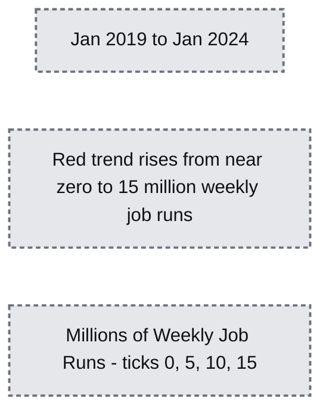
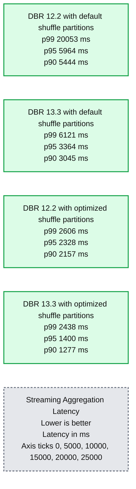
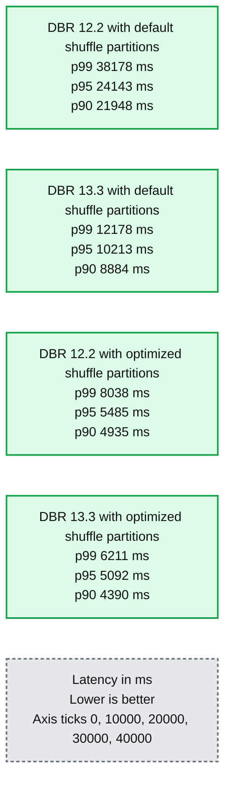
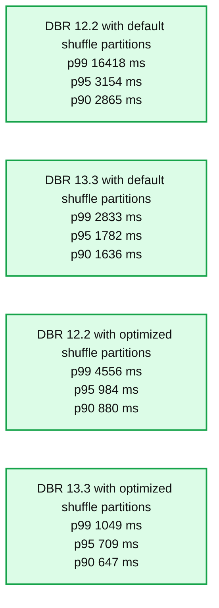
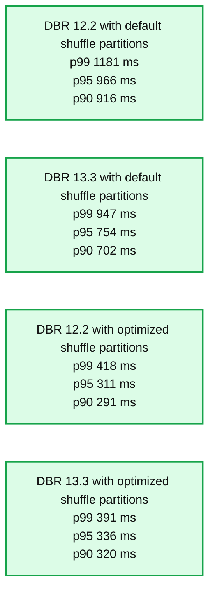

# Performance Improvements for Stateful Pipelines in Apache Spark Structured Streaming

- Source: https://www.databricks.com/blog/performance-improvements-stateful-pipelines-apache-spark-structured-streaming
- Published: 2024-02-28
- Authors: Mojgan Mazouchi, Mrityunjay Kumar, Anish Shrigondekar, Karthikeyan Ramasamy
- Categories: engineering, data-engineering
- Images: 5 total, 5 extracted as architecture

## Introduction

Apache Spark™ [Structured Streaming](https://spark.apache.org/streaming/) is a popular open-source stream processing platform that provides scalability and fault tolerance, built on top of the Spark SQL engine. Most incremental and [streaming workloads](https://www.databricks.com/product/data-streaming) on the Databricks Lakehouse Platform are powered by Structured Streaming, including [Delta Live Tables](https://www.databricks.com/product/delta-live-tables) and [Auto Loader](https://docs.databricks.com/en/ingestion/auto-loader/index.html). We have seen [exponential growth](https://www.databricks.com/blog/project-lightspeed-update-advancing-apache-spark-structured-streaming?utm_source=bambu&amp%3Butm_medium=social&amp%3Butm_campaign=advocacy&amp%3Bblaid=4783597) in Structured Streaming usage and adoption for a diverse set of use cases across all industries over the past few years. Over 14 million Structured Streaming jobs run per week on Databricks, with that number growing at a rate of more than 2x per year.

**Summary:** Weekly job runs rise from near zero in January 2019 to 15 million near January 2024, with growth accelerating over time.

**Components:**
- Horizontal axis: dates from Jan 2019 through Jan 2024.
- Vertical axis: weekly job runs measured in millions.
- Red line: weekly job run volume over time; no technology is explicitly labeled.

**Flows:**
- none. The red line represents a time series, with no arrows.

**Numbers:** Vertical axis labels: 0, 5, 10, 15. Unit: millions of weekly job runs. Horizontal axis labels: Jan 2019, Jan 2020, Jan 2021, Jan 2022, Jan 2023, Jan 2024.

source image: https://www.databricks.com/sites/default/files/inline-images/db-834-blog-img-1.png

Most Structured Streaming workloads can be divided into two broad categories: [analytical and operational workloads](https://www.databricks.com/blog/latency-goes-subsecond-apache-spark-structured-streaming). Operational workloads run critical parts of a business in real-time. Unlike analytical processing, operational processing emphasizes timely transformations and actions on the data. Operational processing architecture enables organizations to quickly process incoming data, make operational decisions, and trigger immediate actions based on the real-time insights derived from the data.

For such operational workloads, consistent low latency is a key requirement. In this blog, we will focus on the performance improvements Databricks has implemented as part of [Project Lightspeed](https://www.databricks.com/blog/2022/06/28/project-lightspeed-faster-and-simpler-stream-processing-with-apache-spark.html) that will help achieve this requirement for stateful pipelines using Structured Streaming.

Our performance evaluation indicates that [these enhancements](https://www.databricks.com/blog/project-lightspeed-update-advancing-apache-spark-structured-streaming#performance) can improve the stateful pipeline latency by up to **3–4x** for workloads with a throughput of 100k+ events/sec running on Databricks Runtime 13.3 LTS onward. These refinements open the doors for a larger variety of workloads with very tight latency SLAs.

This blog is in two parts - this blog, Part 1, delves into the performance improvements and gains and Part 2 provides a comprehensive deep dive and advanced insights of how we achieved those performance improvements.

Note that this blog post assumes the reader has a basic understanding of [Apache Spark Structured Streaming](https://spark.apache.org/docs/latest/structured-streaming-programming-guide.html).

## Background

Stream processing can be broadly classified into stateless and stateful categories:

- **Stateless pipelines** usually require each micro-batch to be processed independently without remembering any context between micro-batches. Examples include streaming ETL pipelines that transform data on a per-record basis (e.g., filtering, branching, mapping, or iterating).
- **Stateful pipelines** often involve aggregating information across records that appear in multiple micro-batches (e.g., computing an average over a time window). To complete such operations, these pipelines need to remember data that they have seen across micro-batches, and this state needs to be resilient across pipeline restarts.

Stateful streaming pipelines are used mostly for real-time use cases such as product and content recommendations, fraud detection, service health monitoring, etc.

## What Are State and State Management?

State in the context of Apache Spark queries is the intermediate persistent context maintained between micro-batches of a streaming pipeline as a collection of keyed state stores. The state store is a versioned key-value store providing both read and write operations. In Structured Streaming, we use the state store provider abstraction to implement the stateful operations. There are two built-in state store provider implementations:

- The **HDFS-backed state store provider** stores all the state data in the executors' JVM memory and is backed by files stored persistently in an HDFS-compatible filesystem. All updates to the store are done in sets transactionally, and each set of updates increments the store's version. These versions can be used to re-execute the updates on the correct version of the store and regenerate the store version if needed. Since all updates are stored in memory, this provider can periodically run into out-of-memory issues and garbage collection pauses.
- The **RocksDB state store provider** maintains state within RocksDB instances, one per Spark partition on each executor node. In this case, the state is also periodically backed up to a distributed filesystem and can be used for loading a specific state version.

Databricks recommends using the [RocksDB state store provider](https://docs.databricks.com/en/structured-streaming/rocksdb-state-store.html) for production workloads as, over time, it is common for the state size to grow to exceed millions of keys. Using this provider avoids the risks of running into JVM heap-related memory issues or slowness due to garbage collection commonly associated with the HDFS state store provider.

## Benchmarks

We created a set of benchmarks to understand better the performance of stateful streaming pipelines and the effects of our improvements. We generated data from a source at a constant throughput for testing purposes. The generated records contained information about when the records were created. For all stateful streaming benchmarks, we tracked end-to-end latency on a per-record basis. On the sink side, we used the [Apache DataSketches](https://datasketches.apache.org/) library to collect the difference between the time each record was written to the sink and the timestamp generated by the source. This data was used to calculate the latency in milliseconds.

For the Kafka benchmark, we set aside some cluster nodes for running Kafka and generating the data for feeding to Kafka. We calculated the latency of a record only after the record had been successfully published to Kafka (on the sink). All the tests were run with RocksDB as the state store provider for stateful streaming queries.

All tests below ran on i3.2xlarge instances in AWS with 8 cores and 61 GB RAM. Tests ran with one driver and five worker nodes, using DBR 12.2 (without the improvements) as the base image and DBR 13.3 LTS (which includes all the improvements) as the test image.

*Streaming Aggregation with Kafka Source/Sink: This benchmark reads from a Kafka source, writes to a Kafka sink, and performs stateful aggregation operations. We see up to 76% (p95) and 87% (p99) end-to-end latency reduction with an optimized number of shuffle partitions and improvements enabled.*

**Summary:** Streaming aggregation latency decreases across DBR versions and optimized shuffle partition configurations, with lower latency being better.

**Components:**

- DBR 12.2 with default shuffle partitions: Databricks Runtime configuration.
- DBR 13.3 with default shuffle partitions: Databricks Runtime configuration.
- DBR 12.2 with optimized shuffle partitions: Databricks Runtime configuration.
- DBR 13.3 with optimized shuffle partitions: Databricks Runtime configuration.
- p99: Light blue latency series.
- p95: Dark blue latency series.
- p90: Orange latency series.
- Latency in ms: Vertical measurement axis.

**Flows:**

- none. No arrows are visible.

**Numbers:**

| Configuration | p99 latency in ms | p95 latency in ms | p90 latency in ms |
|---|---:|---:|---:|
| DBR 12.2 with default shuffle partitions | 20053 | 5964 | 5444 |
| DBR 13.3 with default shuffle partitions | 6121 | 3364 | 3045 |
| DBR 12.2 with optimized shuffle partitions | 2606 | 2328 | 2157 |
| DBR 13.3 with optimized shuffle partitions | 2438 | 1400 | 1277 |

- Vertical axis ticks in ms: 0, 5000, 10000, 15000, 20000, 25000.
- Percentile labels: p99, p95, p90.
- Runtime versions: 12.2 and 13.3.

source image: https://www.databricks.com/sites/default/files/inline-images/db-834-blog-img-2.png

Streaming Aggregation with Kafka Source/Sink: This benchmark reads from a Kafka source, writes to a Kafka sink, and performs stateful aggregation operations. We see up to 76% (p95) and 87% (p99) end-to-end latency reduction with an optimized number of shuffle partitions and improvements enabled.

*Stream-Stream Join Benchmark: This benchmark reads from an in-memory rate source, writes to an in-memory stats sink, and performs stream-stream join operations. We see up to 78% (p95) and 83% (p99) end-to-end latency reduction with an optimized number of shuffle partitions and improvements enabled.*

**Summary:** Stream-stream join latency decreases with DBR 13.3 and optimized shuffle partitions across p99, p95, and p90.

**Components:**

- DBR 12.2 with default shuffle partitions: Databricks Runtime benchmark configuration.
- DBR 13.3 with default shuffle partitions: Databricks Runtime benchmark configuration.
- DBR 12.2 with optimized shuffle partitions: Databricks Runtime benchmark configuration.
- DBR 13.3 with optimized shuffle partitions: Databricks Runtime benchmark configuration.
- p99: Light blue latency series.
- p95: Dark blue latency series.
- p90: Orange latency series.
- Latency in ms: Vertical axis; lower is better.

**Flows:**

- none; no arrows are visible.

**Numbers:**

| Configuration | p99 latency in ms | p95 latency in ms | p90 latency in ms |
|---|---:|---:|---:|
| DBR 12.2 with default shuffle partitions | 38178 | 24143 | 21948 |
| DBR 13.3 with default shuffle partitions | 12178 | 10213 | 8884 |
| DBR 12.2 with optimized shuffle partitions | 8038 | 5485 | 4935 |
| DBR 13.3 with optimized shuffle partitions | 6211 | 5092 | 4390 |

- Vertical axis ticks in ms: 0, 10000, 20000, 30000, 40000.
- Percentile labels: p99, p95, p90.
- Runtime versions: 12.2 and 13.3.

source image: https://www.databricks.com/sites/default/files/inline-images/db-834-blog-img-3.png

Stream-Stream Join Benchmark: This benchmark reads from an in-memory rate source, writes to an in-memory stats sink, and performs stream-stream join operations. We see up to 78% (p95) and 83% (p99) end-to-end latency reduction with an optimized number of shuffle partitions and improvements enabled.

*Streaming Drop Duplicates Benchmark: This benchmark reads from an in-memory rate source, writes to an in-memory stats sink, and performs dropDuplicate operations. We see up to 77% (p95) and 93% (p99) end-to-end latency reduction with an optimized number of shuffle partitions and improvements enabled.*

**Summary:** Streaming DropDuplicates latency is lower with DBR 13.3 and optimized shuffle partitions across p99, p95, and p90.

**Components:**
- DBR 12.2 with default shuffle partitions: Streaming DropDuplicates benchmark configuration.
- DBR 13.3 with default shuffle partitions: Streaming DropDuplicates benchmark configuration.
- DBR 12.2 with optimized shuffle partitions: Streaming DropDuplicates benchmark configuration.
- DBR 13.3 with optimized shuffle partitions: Streaming DropDuplicates benchmark configuration.
- p99: light blue latency series.
- p95: dark blue latency series.
- p90: orange latency series.
- Vertical axis: latency in ms.
- Title: Streaming DropDuplicates Latency, lower is better.

**Flows:**
- none. No arrows are visible.

**Numbers:**

| Configuration | p99 latency | p95 latency | p90 latency |
|---|---:|---:|---:|
| DBR 12.2 with default shuffle partitions | 16418 ms | 3154 ms | 2865 ms |
| DBR 13.3 with default shuffle partitions | 2833 ms | 1782 ms | 1636 ms |
| DBR 12.2 with optimized shuffle partitions | 4556 ms | 984 ms | 880 ms |
| DBR 13.3 with optimized shuffle partitions | 1049 ms | 709 ms | 647 ms |

Vertical axis ticks: 0, 5000, 10000, 15000, 20000 ms. Percentile labels: p99, p95, p90.

source image: https://www.databricks.com/sites/default/files/inline-images/db-834-blog-img-4.png

Streaming Drop Duplicates Benchmark: This benchmark reads from an in-memory rate source, writes to an in-memory stats sink, and performs dropDuplicate operations. We see up to 77% (p95) and 93% (p99) end-to-end latency reduction with an optimized number of shuffle partitions and improvements enabled.

*Streaming flatMapGroupsWithState Benchmark: This benchmark reads from an in-memory rate source, writes to an in-memory stats sink, and performs arbitrary stateful operations using flatMapGroupsWithState. We see up to 65% (p95) and 66% (p99) end-to-end latency reduction with an optimized number of shuffle partitions and improvements enabled.*

**Summary:** Arbitrary stateful streaming latency is compared across DBR versions and shuffle partition configurations, with lower latency being better.

**Components:**
- DBR 12.2 with default shuffle partitions: Databricks Runtime benchmark configuration.
- DBR 13.3 with default shuffle partitions: Databricks Runtime benchmark configuration.
- DBR 12.2 with optimized shuffle partitions: Databricks Runtime benchmark configuration.
- DBR 13.3 with optimized shuffle partitions: Databricks Runtime benchmark configuration.
- p99, p95, p90: Latency percentile series.
- Latency in ms: Vertical measurement axis.

**Flows:**
- none. No arrows are visible.

**Numbers:**

| Configuration | p99 | p95 | p90 |
|---|---:|---:|---:|
| DBR 12.2 with default shuffle partitions | 1181 ms | 966 ms | 916 ms |
| DBR 13.3 with default shuffle partitions | 947 ms | 754 ms | 702 ms |
| DBR 12.2 with optimized shuffle partitions | 418 ms | 311 ms | 291 ms |
| DBR 13.3 with optimized shuffle partitions | 391 ms | 336 ms | 320 ms |

Vertical axis ticks in ms: 0, 250, 500, 750, 1000, 1250.

source image: https://www.databricks.com/sites/default/files/inline-images/db-834-blog-img-5.png

Streaming flatMapGroupsWithState Benchmark: This benchmark reads from an in-memory rate source, writes to an in-memory stats sink, and performs arbitrary stateful operations using flatMapGroupsWithState. We see up to 65% (p95) and 66% (p99) end-to-end latency reduction with an optimized number of shuffle partitions and improvements enabled.

## Conclusion

In this blog, we provided a high-level overview of the benchmark we've performed to showcase the performance improvements mentioned in the [Project Lightspeed update blog](https://www.databricks.com/blog/project-lightspeed-update-advancing-apache-spark-structured-streaming#performance). As the benchmarks show, the performance improvements we have added unlock a lot of speed and value for customers running stateful pipelines using Spark Structured Streaming on Databricks. The added performance improvements to stateful pipelines deserve their own time for a more in-depth discussion, which you can look forward to in the next blog post "[A Deep Dive Into the Latest Performance Improvements of Stateful Pipelines in Apache Spark Structured Streaming](https://www.databricks.com/blog/deep-dive-latest-performance-improvements-stateful-pipelines-apache-spark-structured-streaming)".

## Availability

All the features mentioned above are available from the DBR 13.3 LTS release.
