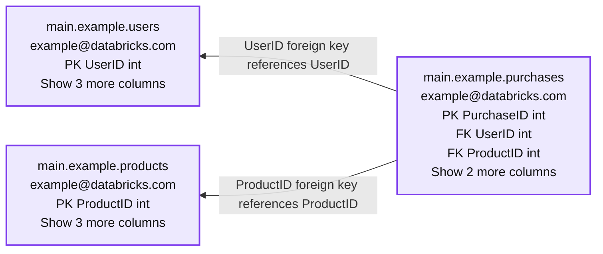

# Primary Key and Foreign Key constraints are GA and now enable faster queries

- Source: https://www.databricks.com/blog/primary-key-and-foreign-key-constraints-are-ga-and-now-enable-faster-queries
- Published: 2024-07-24
- Authors: Xinyi Yu, Justin Talbot, Serge Rielau
- Categories: engineering, data-warehousing
- Images: 3 total, 2 extracted as architecture

Dataricks is thrilled to announce the General Availability (GA) of Primary Key (PK) and Foreign Key (FK) constraints, starting in Databricks Runtime 15.2 and Databricks SQL 2024.30. This release follows a highly successful public preview, embraced by hundreds of weekly active customers, and further represents a significant milestone in enhancing data integrity and relational data management within the Lakehouse.

Furthermore, Databricks can now use these constraints to optimize queries and eliminate unnecessary operations from the query plan, delivering much faster performance.

## Primary Key and Foreign Key Constraints

Primary Keys (PKs) and Foreign Keys (FKs) are essential elements in relational databases, acting as fundamental building blocks for data modeling. They provide information about the data relationships in the schema to users, tools and applications; and enable optimizations that leverage constraints to speed up queries. Primary and foreign keys are now generally available for your Delta Lake tables hosted in Unity Catalog.

### SQL Language

You can define constraints when you create a table:

In the above example, we define a primary key constraint on the column `UserID`. Databricks also supports constraints on groups of columns as well.

You can also modify existing Delta tables to add or remove constraints:

Here we create the primary key named `products_pk` on the non-nullable column `ProductID` in an existing table. To successfully execute this operation, you must be the owner of the table. Note that constraint names must be unique within the schema.
 The subsequent command removes the primary key by specifying the name.

The same process applies for foreign keys. The following table defines two foreign keys at table creation time:

Please refer to the documentation on [CREATE TABLE](https://docs.databricks.com/en/sql/language-manual/sql-ref-syntax-ddl-create-table-using.html) and [ALTER TABLE](https://docs.databricks.com/en/sql/language-manual/sql-ref-syntax-ddl-alter-table.html) statements for more details on the syntax and operations related to constraints.

Primary key and foreign key constraints aren't enforced in the Databricks engine, but they may be useful for indicating a data integrity relationship that is intended to hold true. Databricks can instead enforce primary key constraints upstream as part of the ingest pipeline. See [Managed data quality with Delta Live Tables](https://docs.databricks.com/en/delta-live-tables/expectations.html) for more information on enforced constraints. Databricks also supports enforced `NOT NULL` and `CHECK` constraints (see the [Constraints documentation](https://docs.databricks.com/en/tables/constraints.html) for more information).

### Partner Ecosystem

Tools and applications such as the latest version of Tableau and PowerBI can automatically import and utilize your primary key and foreign key relationships from Databricks through JDBC and ODBC connectors.

## View the constraints

There are several ways to view the primary key and foreign key constraints defined in the table. You can also simply use SQL commands to view constraint information with the `DESCRIBE TABLE EXTENDED` command:

### Catalog Explorer and Entity Relationship Diagram

You can also view the constraints information through the [Catalog Explorer](https://docs.databricks.com/en/catalog-explorer/index.html):

Each primary key and foreign key column has a small key icon next to its name.

And you can visualize the primary and foreign key information and the relationships between tables with the [Entity Relationship Diagram](https://docs.databricks.com/en/catalog-explorer/entity-relationship-diagram.html) in Catalog Explorer. Below is an example of a table `purchases` referencing two tables, `users` and `products`:

**Summary:** The purchases table references the users and products tables through foreign keys.

**Components:**
- `main.example.users`: Databricks table with primary key `UserID`, type `int`; owner `example@databricks.com`.
- `main.example.products`: Databricks table with primary key `ProductID`, type `int`; owner `example@databricks.com`.
- `main.example.purchases`: Databricks table with primary key `PurchaseID` and foreign keys `UserID` and `ProductID`, all type `int`; owner `example@databricks.com`.

**Flows:**
- `main.example.purchases.UserID -> main.example.users.UserID`: Foreign key reference.
- `main.example.purchases.ProductID -> main.example.products.ProductID`: Foreign key reference.

**Numbers:**
- Users: Show 3 more columns.
- Products: Show 3 more columns.
- Purchases: Show 2 more columns.

source image: https://www.databricks.com/sites/default/files/inline-images/db-960-blog-img-2.png

### INFORMATION SCHEMA

The following [INFORMATION_SCHEMA](https://docs.databricks.com/en/sql/language-manual/sql-ref-information-schema.html) tables also provide constraint information:

- [`TABLE_CONSTRAINTS`](https://docs.databricks.com/en/sql/language-manual/information-schema/table_constraints.html): Describes metadata for all primary and foreign key constraints within the catalog.
- [`KEY_COLUMN_USAGE`](https://docs.databricks.com/en/sql/language-manual/information-schema/key_column_usage.html): Lists the columns of the primary or foreign key constraints within the catalog.
- [`CONSTRAINT_TABLE_USAGE`](https://docs.databricks.com/en/sql/language-manual/information-schema/constraint_table_usage.html): Describes the constraints referencing tables in the catalog.
- [`CONSTRAINT_COLUMN_USAGE`](https://docs.databricks.com/en/sql/language-manual/information-schema/constraint_column_usage.html): Describes the constraints referencing columns in the catalog.
- [`REFERENTIAL_CONSTRAINTS`](https://docs.databricks.com/en/sql/language-manual/information-schema/referential_constraints.html): Describes referential (foreign key) constraints defined in the catalog.

## Use the RELY option to enable optimizations

If you know that the primary key constraint is valid, (for example, because your data pipeline or ETL job enforces it) then you can enable optimizations based on the constraint by specifying it with the RELY option, like:

Using the RELY option lets Databricks optimize queries in ways that depend on the constraint's validity, because you are guaranteeing that the data integrity is maintained. Exercise caution here because if a constraint is marked as RELY but the data violates the constraint, your queries may return incorrect results.

When you do not specify the RELY option for a constraint, the default is NORELY, in which case constraints may still be used for informational or statistical purposes, but queries will not rely on them to run correctly.

The RELY option and the optimizations utilizing it are currently available for primary keys, and will also be coming soon for foreign keys.

You can modify a table's primary key to change whether it is RELY or NORELY by using ALTER TABLE, for example:

## Speed up your queries by eliminating unnecessary aggregations

One simple optimization we can do with RELY primary key constraints is eliminating unnecessary aggregates. For example, in a query that is applying a distinct operation over a table with a primary key using RELY:

We can remove the unnecessary DISTINCT operation:

As you can see, this query relies on the validity of the RELY primary key constraint - if there are duplicate customer IDs in the customer table, then the transformed query will return incorrect duplicate results. You are responsible for enforcing the validity of the constraint if you set the RELY option.

If the primary key is NORELY (the default), then the optimizer will not remove the DISTINCT operation from the query. Then it may run slower but always returns correct results even if there are duplicates. If the primary key is RELY, Databricks can remove the DISTINCT operation, which can greatly speed up the query - by about 2x for the above example.

## Speed up your queries by eliminating unnecessary joins

Another very useful optimization we can perform with RELY primary keys is eliminating unnecessary joins. If a query joins a table that is not referenced anywhere except in the join condition, then the optimizer can determine that the join is unnecessary, and remove the join from the query plan.

To give an example, let's say we have a query joining two tables, `store_sales` and `customer`, joined on the primary key of the customer table `PRIMARY KEY (c_customer_sk) RELY`.

If we didn't have the primary key, each row of `store_sales` could potentially match multiple rows in `customer`, and we would need to execute the join to compute the correct SUM value. But because the table `customer` is joined on its primary key, we know that the join will output one row for each row of `store_sales`.

So the query only actually needs the column `ss_quantity` from the fact table `store_sales`. Therefore, the query optimizer can entirely eliminate the join from the query, transforming it into:

This runs much faster by avoiding the entire join - in this example we observe the optimization speed up the query from **1.5 minutes to 6 seconds!**. And the benefits can be even larger when the join involves many tables that can be eliminated!

**Summary:** Join elimination simplifies a plan containing two table scans, four shuffles, and a left outer join into a single table scan feeding an aggregate.

**Components:**
- Before join elimination: original query plan.
- Store sales scan: `hive_metastore.tpcds_sf3000_delta.store_sales`.
- Lower sales Shuffle: query execution shuffle.
- Upper sales Shuffle: query execution shuffle.
- Customer scan: `hive_metastore.tpcds_sf3000_delta.customer`.
- Lower customer Shuffle: query execution shuffle.
- Upper customer Shuffle: query execution shuffle.
- Left Outer Join: joins the sales and customer branches.
- Before Aggregate: query aggregation.
- After join elimination: simplified query plan.
- Store sales scan after elimination: `hive_metastore.tpcds_sf3000_delta.store_sales`.
- After Aggregate: query aggregation.

**Flows:**
- Store sales scan -> Lower sales Shuffle: 86.40 B rows.
- Lower sales Shuffle -> Upper sales Shuffle: 86.40 B rows.
- Upper sales Shuffle -> Left Outer Join: 86.40 B rows.
- Customer scan -> Lower customer Shuffle: 80 M rows.
- Lower customer Shuffle -> Upper customer Shuffle: 80 M rows.
- Upper customer Shuffle -> Left Outer Join: 81.07 M rows.
- Left Outer Join -> Before Aggregate: 86.40 B rows.
- Store sales scan after elimination -> After Aggregate: 86.40 B rows.

**Numbers:**
- Before aggregate: 3.82 m.
- Left outer join: 1.08 h.
- Sales shuffles: 31.64 m and 2.80 h.
- Sales scan before elimination: 1.29 h.
- Customer shuffles: 25.66 s and 3.66 s.
- Customer scan: 17.36 s.
- After aggregate: 2.60 m.
- Sales scan after elimination: 12.85 m.
- Row counts: 86.40 B rows appears five times; 80 M rows appears twice; 81.07 M rows appears once.
- Both table identifiers contain `sf3000`.

```mermaid
%% Query plans before and after join elimination
flowchart TD
  subgraph Before join elimination
    S[Scan hive_metastore.tpcds_sf3000_delta.store_sales - 1.29 h]
    S1[Shuffle - 2.80 h]
    S2[Shuffle - 31.64 m]
    C[Scan hive_metastore.tpcds_sf3000_delta.customer - 17.36 s]
    C1[Shuffle - 3.66 s]
    C2[Shuffle - 25.66 s]
    J[Left Outer Join - 1.08 h]
    A[Aggregate - 3.82 m]
    S -->|86.40 B rows| S1
    S1 -->|86.40 B rows| S2
    S2 -->|86.40 B rows| J
    C -->|80 M rows| C1
    C1 -->|80 M rows| C2
    C2 -->|81.07 M rows| J
    J -->|86.40 B rows| A
  end
  subgraph After join elimination
    T[Scan hive_metastore.tpcds_sf3000_delta.store_sales - 12.85 m]
    B[Aggregate - 2.60 m]
    T -->|86.40 B rows| B
  end
  classDef client fill:#dbeafe,stroke:#2563eb,stroke-width:2px,color:#111
  classDef service fill:#dcfce7,stroke:#16a34a,stroke-width:2px,color:#111
  classDef store fill:#ede9fe,stroke:#7c3aed,stroke-width:2px,color:#111
  classDef cache fill:#fef3c7,stroke:#d97706,stroke-width:2px,color:#111
  classDef queue fill:#cffafe,stroke:#0891b2,stroke-width:2px,color:#111
  classDef critical fill:#fee2e2,stroke:#dc2626,stroke-width:4px,color:#111
  classDef external fill:#e5e7eb,stroke:#6b7280,stroke-width:2px,color:#111,stroke-dasharray:4 3
  classDef decision fill:#fce7f3,stroke:#db2777,stroke-width:2px,color:#111
  class S,S1,S2,C,C1,C2,J,A,T,B service
```

source image: https://www.databricks.com/sites/default/files/inline-images/db-960-blog-img-3.png

You may ask, why would anyone run a query like this? It's actually much more common than you might think! One common reason is that users construct views that join together several tables, such as joining together many fact and dimension tables. They write queries over these views which often use columns from only some of the tables, not all - and so the optimizer can eliminate the joins against the tables that aren't needed in each query. This pattern is also common in many Business Intelligence (BI) tools, which often generate queries joining many tables in a schema even when a query only uses columns from some of the tables.

## Conclusion

Since its public preview, over 2600 + Databricks customers have used primary key and foreign key constraints. Today, we are excited to announce the general availability of this feature, marking a new stage in our commitment to enhancing data management and integrity in Databricks.

Furthermore, Databricks now takes advantage of key constraints with the RELY option to optimize queries, such as by eliminating unnecessary aggregates and joins, resulting in much faster query performance.
