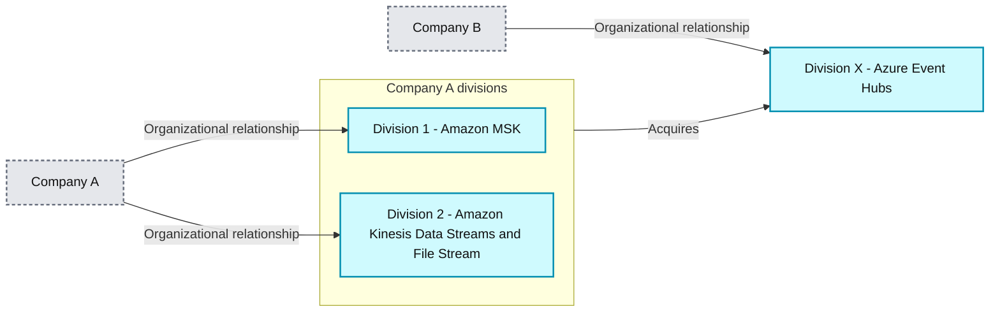
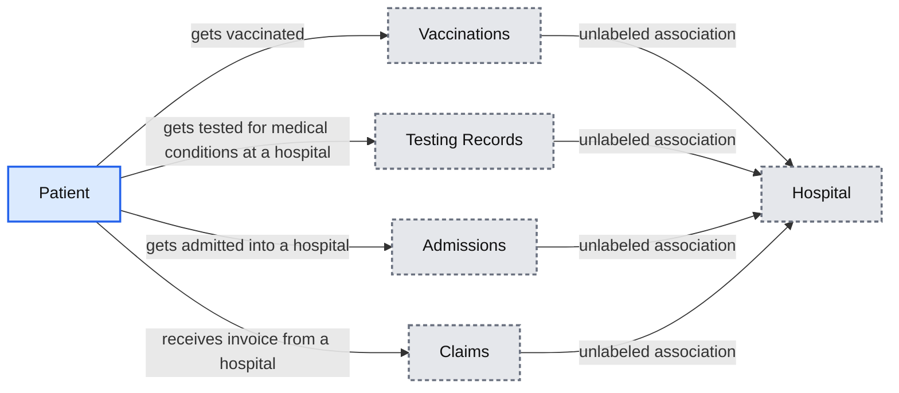
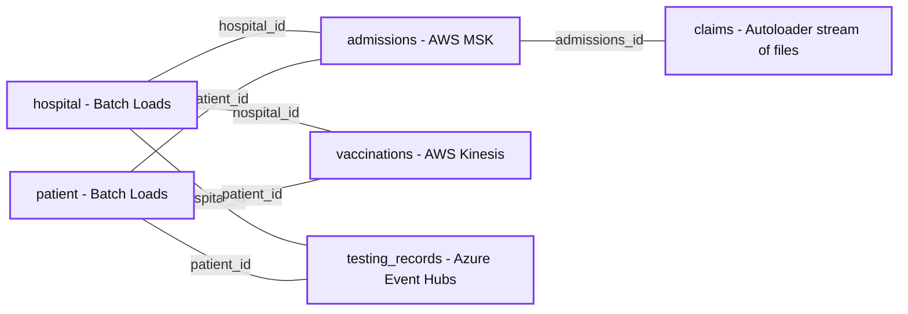
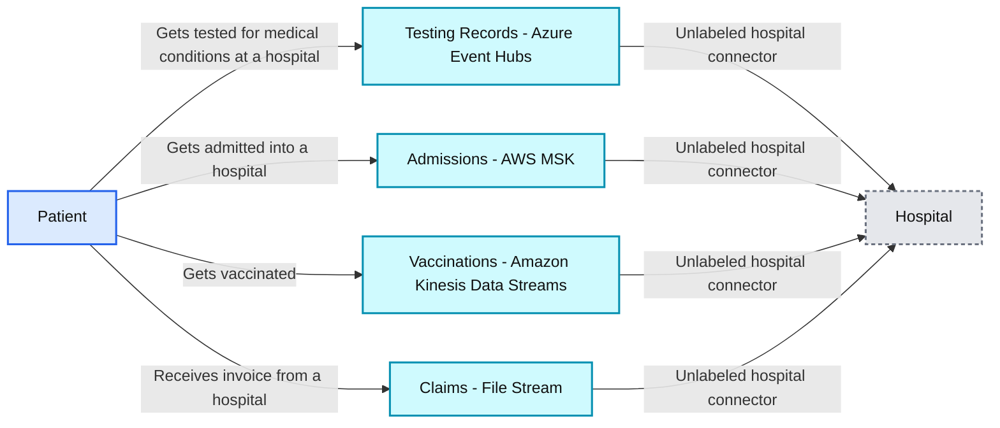
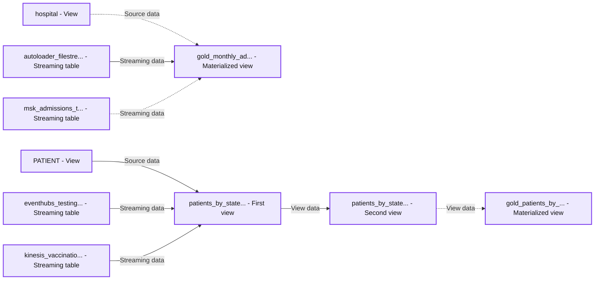

# Processing data simultaneously from multiple streaming platforms using Delta Live Tables

*Easily manage and consume from diverse streaming platforms across multiple clouds through a single ETL pipeline.*

- Source: https://www.databricks.com/blog/processing-data-simultaneously-multiple-streaming-platforms-using-delta-live-tables
- Published: 2023-04-25
- Authors: Uday Satapathy, Dipankar Kushari, Akash Jaiswal
- Categories: engineering, data-engineering
- Images: 8 total, 6 extracted as architecture

One of the major imperatives of organizations today is to enable decision making at the speed of business. Business teams and autonomous decisioning systems often require all the information they need to make decisions and respond quickly as soon as their source events happen – in real time or near real time. Such information, known as events in stream processing parlance, is relayed asynchronously from a source to a destination and is generally done through a message broker or message bus.

As organizations grow and teams branch out into other teams, the usage patterns, number and variety of message brokers increases. In merger and acquisition scenarios, companies often inherit new message brokers, which then need to be integrated with their existing data engineering processes. Managing a multitude of message brokers, their producers, consumers and data engineering pipelines coherently can be challenging owing to the number of technologies, cloud platforms and programming languages they need specialization in.

For example, let’s look at a Multi-Stream Use case. Imagine the following situation in a global conglomerate, where

- They have two major divisions which use two separate message brokers – Amazon Kinesis Data Streams and Amazon Managed Service for Kafka (MSK).
- They acquired another smaller product company which uses Azure Event Hubs internally.
- They also have a major source of data coming in the form of a continual stream of csv or json files.

The diagram below depicts the multi stream use case described above:

*Fig 1 - Multiple stream Use Case*

**Summary:** Company A has divisions using Amazon MSK, Amazon Kinesis Data Streams, and a file stream, and acquires Company B’s Division X using Azure Event Hubs.

**Components:**
- Company A: parent organization of Division 1 and Division 2.
- Division 1: Amazon MSK.
- Division 2: Amazon Kinesis Data Streams and File Stream.
- Company B: parent organization of Division X.
- Division X: Azure Event Hubs.

**Flows:**
- Company A -> Division 1: organizational relationship.
- Company A -> Division 2: organizational relationship.
- Company B -> Division X: organizational relationship.
- Company A divisions -> Division X: acquires, shown as a rightward arrow between the division groups.

**Numbers:** 1 and 2 in the labels Division 1 and Division 2. No technical quantities are visible.

source image: https://www.databricks.com/sites/default/files/inline-images/db-456-blog-img-1.png

Fig 1 - Multiple stream Use Case

Here are some key challenges in processing all this data in such a scenario:

- How do they integrate all these varied data sources and their technologies together?
- How do they build data engineering systems in such a way that they are easy to scale and maintain? Do they hire horses for courses e.g. specialized talent for each separate technology?
- How do they ensure that in the process of solving this technology conundrum, they don’t forget what the end goal is – making sense of the data and enabling decisions faster?
- How do they ensure that both batch and streaming needs can be served by the same data processing system?

Through this blog, we will demonstrate how these problems can be solved in an easy and clean way through Delta Live Tables (DLT). [Delta Live Tables](https://www.databricks.com/product/delta-live-tables) on the Databricks Lakehouse Platform makes it simple to create and manage high-quality batch and streaming data pipelines.

## Multi-stream use case

To demonstrate a multi-stream processing scenario through DLT, let’s imagine a healthcare domain use case. At the center of the use case is a **patient**. The patient completes the following interactions with another entity **hospital**:

- Gets *vaccinated* against medical conditions at a hospital
- Gets *tested* for medical conditions at a hospital
- Gets *admitted *into a hospital for certain medical conditions
- Gets* invoiced* for treatment, through a *claims* process

These interactions can be represented in the following business use case diagram below.

*Fig 2 - Business Use Case Diagram for a Patient’s interactions*

**Summary:** A patient interacts with a hospital through vaccinations, medical testing, admissions, and invoicing through claims.

**Components:**
- Patient: person receiving care; no technology specified.
- Hospital: care provider; no technology specified.
- Vaccinations: vaccination interaction; no technology specified.
- Testing Records: medical testing interaction; no technology specified.
- Admissions: hospital admission interaction; no technology specified.
- Claims: hospital invoicing interaction; no technology specified.

**Flows:**
- Patient -> Vaccinations: gets vaccinated.
- Patient -> Testing Records: gets tested for medical conditions at a hospital.
- Patient -> Admissions: gets admitted into a hospital.
- Patient -> Claims: receives invoice from a hospital.
- Vaccinations -> Hospital: hospital association, unlabeled.
- Testing Records -> Hospital: hospital association, unlabeled.
- Admissions -> Hospital: hospital association, unlabeled.
- Claims -> Hospital: hospital association, unlabeled.

**Numbers:** none

source image: https://www.databricks.com/sites/default/files/inline-images/db-456-blog-img-2.png

Fig 2 - Business Use Case Diagram for a Patient’s interactions

The entities involved in these interactions can be represented in the form of the below entity relationship (ER) diagram. Going forward we will make ample use of the terms Facts and Dimensions from the Data warehousing Dimensional modeling lexicon. In the ER diagram, you can see that Patient and Hospital are **dimension** tables, while the data for Admissions, Vaccinations, Testing records and Claims is represented in the form of **fact** tables.

*Fig 3 - Entity Relationship Diagram for a Patient’s interactions*

**Summary:** Hospital and patient tables loaded in batches relate to admissions, vaccinations, testing records, and claims tables sourced from four streaming ingestion technologies.

**Components:**
- hospital: Batch Loads. Fields: hospital_id int; facility_id, facility_name, address, city, state, zipcode, county, country, phone_number, hospital_type string.
- patient: Batch Loads. Fields: patient_id int; first_name, last_name, email, street, city, state, zipcode, country, date_of_birth string.
- admissions: AWS MSK. Fields: admissions_id string, hospital_id int, patient_id int, Timestamp timestamp.
- vaccinations: AWS Kinesis. Fields: hospital_id int, patient_id int, vaccination_type string, Timestamp timestamp.
- testing_records: Azure Event Hubs. Fields: testing_record_id string, hospital_id int, patient_id int, is_positive string, Timestamp timestamp.
- claims: Autoloader, Stream of files. Fields: claim_id string, admissions_id string, claim_timestamp timestamp, total_invoiced_amount float, patient_payable_amount float, payer_covered_amount float.

**Flows:**
- hospital -> admissions: hospital_id relationship.
- hospital -> vaccinations: hospital_id relationship.
- hospital -> testing_records: hospital_id relationship.
- patient -> admissions: patient_id relationship.
- patient -> vaccinations: patient_id relationship.
- patient -> testing_records: patient_id relationship.
- admissions -> claims: admissions_id relationship.

The connectors represent relationships without visible arrowheads, rather than directed data movement.

**Numbers:** none

source image: https://www.databricks.com/sites/default/files/inline-images/db-456-blog-image-3.png

Fig 3 - Entity Relationship Diagram for a Patient’s interactions

Let’s say that the fact data for Admissions, Vaccinations, Testing records and Claims arrive through different message brokers. For this blog, we have selected the popular ones in the industry i.e. Apache Kafka ([Amazon MSK](https://aws.amazon.com/msk/)), [AWS Kinesis Data Streams](https://aws.amazon.com/kinesis/data-streams/?nc=sn&loc=2&dn=2) and [Azure Event Hubs](https://learn.microsoft.com/en-us/azure/event-hubs/event-hubs-about). Our fourth way to exhibit a stream processing scenario is by ingesting a sequence of files incrementally into tables (Delta lake in this case). We have selected [Databricks Autoloader](https://docs.databricks.com/ingestion/auto-loader/index.html) for this purpose. With this information, the patient’s interactions diagram can now be updated with the relevant data sources:

*Fig 4 - Business Use Case Diagram with data sources*

**Summary:** Patient interactions with a hospital generate testing records, admissions, vaccinations, and claims associated with four streaming data sources.

**Components:**
- Patient: person receiving hospital services.
- Hospital: provider of medical services.
- Testing Records: Azure Event Hubs.
- Admissions: AWS MSK.
- Vaccinations: Amazon Kinesis Data Streams.
- Claims: File Stream.

**Flows:**
- Patient -> Testing Records: gets tested for medical conditions at a hospital.
- Patient -> Admissions: gets admitted into a hospital.
- Patient -> Vaccinations: gets vaccinated.
- Patient -> Claims: receives invoice from a hospital.
- Testing Records -> Hospital: hospital association, unlabeled connector.
- Admissions -> Hospital: hospital association, unlabeled connector.
- Vaccinations -> Hospital: hospital association, unlabeled connector.
- Claims -> Hospital: hospital association, unlabeled connector.

**Numbers:** none

source image: https://www.databricks.com/sites/default/files/inline-images/db-456-blog-img-4.png

Fig 4 - Business Use Case Diagram with data sources

Below are the data sources summarized in tabular format:

| **Fact** | **Data source** |
|---|---|
| Admissions | Amazon MSK (Apache Kafka) |
| Testing Records | Azure Event Hubs |
| Vaccinations | AWS Kinesis Data Streams |
| Claims | Incremental stream of files |

In the next section, we will demonstrate how a single DLT pipeline can ingest data from the above streaming sources simultaneously and also perform ETL on it. We have used AWS infrastructure to set up the resources and pipeline for this blog, but the scenarios should be similarly configurable in other public clouds like Azure and GCP.

## Multi-stream processing through DLT

The diagram below depicts how a common DLT pipeline would look like. While ingestion and transformation of streaming data coming from diverse sources sums up the scope for this blog, there are additional features of DLT that also deserve attention. For example, data quality management is a key feature which can help teams process only the data which passes certain ‘expectations’. Teams can then take corrective and preventive actions on the erroneous data. Other benefits of DLT are managed checkpointing and enhanced autoscaling. You can read about these and more features in this article: [Delta Live Tables concepts](https://docs.databricks.com/delta-live-tables/index.html).

*Fig 5 - Data Processing Pipeline with DLT*

**Summary:** Multiple streaming sources feed Bronze, Silver, and Gold zones in the Databricks Lakehouse Platform through transformation, quality checks, and aggregation, supporting downstream insights and applications.

**Components:**
- Amazon MSK: streaming source using Amazon MSK.
- Azure Event Hub: streaming source using Azure Event Hub.
- Auto loader: ingestion source using Auto Loader.
- Amazon Kinesis: streaming source using Amazon Kinesis.
- Databricks Lakehouse Platform: enclosing data processing platform.
- Bronze Zone: initial storage layer backed by Delta Lake.
- Data Transformation: processing stage within the platform.
- Data Quality: quality stages between Bronze and Silver and between Silver and Gold.
- Silver Zone: intermediate storage layer backed by Delta Lake.
- Business Level Aggregates: aggregation stage between Silver and Gold.
- Gold Zone: final storage layer backed by Delta Lake.
- Continuous Batch or Stream Processing: platform processing capability.
- Error Handling and Automatic Recovery: platform recovery capability.
- Data Pipeline Observability: platform monitoring capability.
- Automatic Deployments & Operations: platform operations capability.
- Orchestrate Data Pipelines: platform orchestration capability.
- Apache Spark: processing engine shown beneath the pipeline.
- Photon: processing engine shown beneath the pipeline.
- Delta Lake: underlying storage technology.
- Business Insights: downstream use; technology unspecified.
- Analytics: downstream use; technology unspecified.
- Machine Learning: downstream use; technology unspecified.
- Operational Apps: downstream use; technology unspecified.

**Flows:**
- Amazon MSK -> Bronze Zone: source data through the shared ingestion connector.
- Azure Event Hub -> Bronze Zone: source data through the shared ingestion connector.
- Auto loader -> Bronze Zone: source data through the shared ingestion connector.
- Amazon Kinesis -> Bronze Zone: source data through the shared ingestion connector.
- Bronze Zone -> Data Transformation: ingested data for transformation.
- Bronze Zone -> Data Quality: ingested data for quality checks.
- Data Transformation -> Data Quality: exchange between transformation and quality processing.
- Data Quality -> Data Transformation: exchange between quality processing and transformation.
- Data Transformation -> Silver Zone: processed data through the shared output connector.
- Data Quality -> Silver Zone: quality-processed data through the shared output connector.
- Silver Zone -> Data Quality: intermediate data for further quality checks.
- Silver Zone -> Business Level Aggregates: intermediate data for aggregation.
- Data Quality -> Gold Zone: quality-processed data.
- Business Level Aggregates -> Gold Zone: aggregated data.
- Databricks Lakehouse Platform -> Business Insights: platform output.
- Databricks Lakehouse Platform -> Analytics: platform output.
- Databricks Lakehouse Platform -> Machine Learning: platform output.
- Databricks Lakehouse Platform -> Operational Apps: platform output.

**Numbers:** none

source image: https://www.databricks.com/sites/default/files/inline-images/db-456-blog-img-5.png

```mermaid
%% Multiple streaming sources feed a Delta Lake processing pipeline and downstream uses
flowchart LR
    Sources[Amazon MSK / Azure Event Hub / Auto loader / Amazon Kinesis]

    subgraph Platform[Databricks Lakehouse Platform]
        Capabilities[Continuous Batch or Stream Processing / Error Handling and Automatic Recovery / Data Pipeline Observability / Automatic Deployments and Operations / Orchestrate Data Pipelines]
        Bronze[Bronze Zone]
        Transform[Data Transformation]
        Quality1[Data Quality]
        Silver[Silver Zone]
        Quality2[Data Quality]
        Aggregates[Business Level Aggregates]
        Gold[Gold Zone]
        Engines[Apache Spark / Photon / Delta Lake]

        Bronze -->|Data for transformation| Transform
        Bronze -->|Data for quality checks| Quality1
        Transform -->|Processing exchange| Quality1
        Quality1 -->|Processing exchange| Transform
        Transform -->|Processed data| Silver
        Quality1 -->|Quality-processed data| Silver
        Silver -->|Data for quality checks| Quality2
        Silver -->|Data for aggregation| Aggregates
        Quality2 -->|Quality-processed data| Gold
        Aggregates -->|Aggregated data| Gold
    end

    Insights[Business Insights]
    Analytics[Analytics]
    ML[Machine Learning]
    Apps[Operational Apps]

    Sources -->|Source data through shared ingestion| Bronze
    Platform -->|Platform output| Insights
    Platform -->|Platform output| Analytics
    Platform -->|Platform output| ML
    Platform -->|Platform output| Apps

    classDef client fill:#dbeafe,stroke:#2563eb,stroke-width:2px,color:#111
    classDef service fill:#dcfce7,stroke:#16a34a,stroke-width:2px,color:#111
    classDef store fill:#ede9fe,stroke:#7c3aed,stroke-width:2px,color:#111
    classDef cache fill:#fef3c7,stroke:#d97706,stroke-width:2px,color:#111
    classDef queue fill:#cffafe,stroke:#0891b2,stroke-width:2px,color:#111
    classDef critical fill:#fee2e2,stroke:#dc2626,stroke-width:4px,color:#111
    classDef external fill:#e5e7eb,stroke:#6b7280,stroke-width:2px,color:#111,stroke-dasharray:4 3
    classDef decision fill:#fce7f3,stroke:#db2777,stroke-width:2px,color:#111

    class Sources queue
    class Bronze,Silver,Gold store
    class Platform,Capabilities,Transform,Quality1,Quality2,Aggregates,Engines service
    class Insights,Analytics,ML,Apps external
```

Fig 5 - Data Processing Pipeline with DLT

Our multi-stream processing DLT pipeline (let’s call it *dlt_multistream_consumer* for simplicity) involves the following operations:

1. Loading streaming data from the message brokers into a raw layer of delta lake tables.
2. Parsing and applying schema over the raw data to generate meaningful facts (fact tables) from message payloads.
3. Generating aggregated datasets for consumption by BI and Analytics teams. This is done by joining various fact and dimension tables, and slicing / dicing the generated records.

A DLT Pipeline can be configured to operate in the following modes:

- Continuous: A live cluster processes the data as soon as it arrives in a continuous manner. This is recommended for streaming scenarios where latency is paramount.
- Triggered: A cluster is spun up at a desired schedule and it processes the data available at that point in time. Once there is no more data pending for processing (for a certain time duration threshold), the cluster is shut down. This mode is recommended when cost savings and throughput take precedence over latency.

For this blog, we are using the **continuous** mode for two reasons. The first is to demonstrate a ‘true’ stream processing scenario where the data is captured and processed in real time. Secondly, the Amazon Kinesis Data Streams connector for Apache Spark, at the time of publishing this blog, doesn’t support a batch mode of ingestion (i.e. trigger once or available now) which is the case with a triggered mode. It's coming soon, though.

Another point to highlight is that generally in a production setup, once the raw data is ingested, it goes through many stages of processing and enrichment. These stages cleanse, transform, aggregate the data for business use cases involving data analytics, historical and predictive analysis of data. We refer to the progressive improvement in the structure and quality of data as it flows through each layer of the architecture as the [Medallion Lakehouse Architecture](https://docs.databricks.com/lakehouse/medallion.html). While the Medallion architecture is a best practice for mainstream use cases, to simplify this blog, we will skip the data transformation piece and move to perform data analysis to support business use cases.

Now let’s look at how we can perform streaming data ingestion – all at once from a multitude of streaming systems using DLT into Delta Lake and analyze that data to generate meaningful insights.

### Ingesting data from streams

In this section we show you how we are going to ingest data from multiple streaming platforms.

#### **Ingesting data from Amazon MSK**

Amazon Managed Streaming for Apache Kafka ([Amazon MSK](https://aws.amazon.com/msk/)) is a fully managed service that enables you to build and run applications that use Apache Kafka to process streaming data. Amazon MSK provides the control-plane operations, such as those for creating, updating, and deleting clusters.

We have used an MSK cluster with the following configurations for this blog purpose:

- Cluster type - Provisioned
- Total number of brokers - 2
- Apache Kafka version - 2.5.1
- Broker type - kafka.m5.large
- Number of availability zones - 2
- EBS storage volume per broker - 300 GiB
- Encryption between clients and brokers:
 - TLS encryption - Enabled
 - Plaintext - Enabled

For authentication in the AWS environment, we have attached an [instance profile](https://docs.databricks.com/delta-live-tables/settings.html#cloud-storage-configuration) to the DLT cluster. It references an IAM role having appropriate read/write permissions as configured in the role definition.

The pipeline *dlt_multistream_consumer* ingests the Hospital Admission dataset from the MSK topic *admission* into the delta lake table named *msk_admissions_tbl_raw*. The kafka payload (binary represented as a string) for an Admissions fact looks like this:

We used the following code in a python notebook for ingestion, and attached it to our DLT pipeline *dlt_multistream_consumer*.

The pipeline *dlt_multistream_consumer*, when initiated, creates the table *msk_admissions_tbl_raw* inside the desired database / schema and populates the table with the data read from the *admission* topic. Then it continues to ingest additional data as and when new data gets written into that topic.

In addition to the four fields ingested from the Kafka topic, we have added a column *msk_event_timestamp* (derived from the event *timestamp* generated by Kafka) to the *msk_admissions_tbl_raw* table. The messages are received in the field *value* of the Kafka payload in binary format. They need to be converted into string so that downstream processes can parse it.

#### **Ingesting from Amazon Kinesis**

[Amazon Kinesis Data Streams](https://aws.amazon.com/kinesis/data-streams/) makes it easy to collect, process, and analyze real-time streaming data. The data could be video, audio, application logs, website clickstreams, and IoT telemetry data for machine learning, analytics, and other applications. For our blog, we used an Kinesis data stream with the following configurations:

- Data Stream Name: *test_vaccination_data*
- Capacity Mode: On Demand
- Write Capacity: 200 MiB/second or 200,000 records/second (Default Maximum)
- Read Capacity: 400 MiB/second (Default)

For better throughput, the [Amazon Kinesis enhanced fan-out (EFO)](https://docs.databricks.com/structured-streaming/kinesis-enhanced-fan-out.html) feature of the Databricks Runtime Kinesis connector can be used in production scenarios.

The stream *test_vaccination_data,* in our use case, carries the vaccination facts (events) for a patient. Below is a sample payload:

The DLT code for consuming the data from Kinesis data stream to Landing zone in Lake house is as follows :

The pipeline *dlt_multistream_consumer* populates the target table *kinesis_vaccination_tbl_raw* with the data available in the Kinesis data stream and performs a checkpoint to avoid re-reading the data. The messages are received in the field *data* of the Kinesis payload in binary format. They need to be converted into string so that downstream processes can parse it.

#### **Ingesting from Azure Event Hubs**

[Azure Event Hubs](https://learn.microsoft.com/en-us/azure/event-hubs/event-hubs-about) is a popular streaming platform offered by Microsoft. Event Hubs supports multiple protocols for reading and writing, such as AMQP, HTTPS, and Apache Kafka. For this blog, our DLT pipeline *dlt_multistream_consumer* uses the Kafka surface of Event Hubs to consume the messages, since the Kafka connector for Spark comes out of the box in Databricks Runtime without the need for any extra libraries. We are using the standard pricing tier for our Event Hubs namespace with 2 Throughput Units.

Azure documentation describes namespaces as management containers for event hubs (or topics, in Kafka parlance). The Event Hub (aka topic) of interest for us is *testing_records_stream*, which carries events pertaining to the laboratory test results of a patient. Each message looks like the below:

The DLT code for consuming messages from *testing_records_stream* event hub looks much similar to the ingestion pattern with Amazon MSK (they both use Kafka protocol after all).

The DLT pipeline incrementally reads the testing records messages from Event Hubs and appends them as new rows into the *eventhubs_testing_records_tbl_raw* delta lake table. The messages are received in the field value of the Kafka-surface payload in binary format. They need to be converted into string so that downstream processes can parse it.

#### **Ingesting files through Autoloader**

[Auto Loader](https://docs.databricks.com/ingestion/auto-loader/index.html) is one of the most powerful and robust data file ingestion tools in the industry. It incrementally and efficiently processes new data files as they arrive in cloud storage without the need for any additional setup. As of today, it can ingest JSON, CSV, PARQUET, AVRO, ORC, TEXT, and BINARYFILE file formats.

Auto Loader allows the consumers to configure a Structured Streaming source called cloudFiles. The configuration options include cloud storage file paths, file filtering patterns, file arrival event options for queues like Azure Queue Storage, AWS SQS, AWS SNS etc. The DLT pipeline uses these options to automatically ingest new files as they arrive, with the option of also processing any pre-existing files in that directory. Auto Loader has support for both Python and SQL in DLT pipelines. Clients have used Auto Loader to process billions of files to migrate data or backfill a table. It scales to support near real-time ingestion of millions of files per hour.

In this blog we have ingested patient Claims data using Auto Loader with following sample:

In *dlt_multistream_consumer* pipeline, the json files for patient claims are ingested through Auto Loader as they arrive at the source location, as depicted in the code below:

### Analyzing Ingested Data to generate business insights

As mentioned earlier, for this blog, we have already ingested the patient datasets from four different sources - Amazon MSK, Amazon Kinesis Data Streams, Azure Event Hubs and Databricks Auto Loader. For brevity, we have limited the data transformation part to schema enforcement only and are moving forward to perform data analysis on these datasets to support business use cases.

We have created two business analytics use cases for this blog. The idea is to demonstrate how users can use the delta lake tables created by DLT to perform data analytics to answer business questions.

#### **Number of Patients by state and age groups who became Covid positive after being vaccinated against Covid**

The table ***gold_patients_by_state_age_group*** is created in DLT by joining the tables which were populated via the data ingestion through DLT. As new data arrives into the ingestion layer the continuous DLT pipeline ingests that data into the ingestion layer and updates this ***gold_patients_by_state_age_group*** table for data analysis. --

Below is how the data looks like when queried through the [Databricks SQL](https://www.databricks.com/product/databricks-sql) query editor:

#### **Number of Admissions month-wise per city and state**

Number of Admissions per city and state per month is another use case which is supported by querying the ***gold_monthly_admissions_by_state_city*** table.

Below is how the data looks like when queried through the [Databricks SQL](https://www.databricks.com/product/databricks-sql) query editor:

### End to end view of DLT Pipeline

One of the key features of DLT is its ability to crawl through all the table level dependencies among the code artifacts included as part of the pipeline and then display them in the form of a lineage graph. This graph is ‘live’. As the ETL operations proceed, it displays successful operations in green color and erroneous ones in red. A screenshot of our continuously running DLT data pipeline is shown below :

**Summary:** The running `dlt_multistream_consumer` Delta Live Tables pipeline combines streaming tables and views into two materialized-view outputs.

**Components:**
- `hospital`: DLT view.
- `autoloader_filestre...`: DLT streaming table.
- `msk_admissions_t...`: DLT streaming table.
- `gold_monthly_ad...`: DLT materialized view.
- `PATIENT`: DLT view.
- `eventhubs_testing...`: DLT streaming table.
- `kinesis_vaccinatio...`: DLT streaming table.
- First `patients_by_state...`: DLT view.
- Second `patients_by_state...`: DLT view.
- `gold_patients_by_...`: DLT materialized view.

**Flows:**
- `hospital -> gold_monthly_ad...`: source data dependency.
- `autoloader_filestre... -> gold_monthly_ad...`: streaming data dependency.
- `msk_admissions_t... -> gold_monthly_ad...`: streaming data dependency.
- `PATIENT -> first patients_by_state...`: source data dependency.
- `eventhubs_testing... -> first patients_by_state...`: streaming data dependency.
- `kinesis_vaccinatio... -> first patients_by_state...`: streaming data dependency.
- `first patients_by_state... -> second patients_by_state...`: view data dependency.
- `second patients_by_state... -> gold_patients_by_...`: materialized-view data dependency.

**Numbers:**
- Run timestamp: `3/7/2023, 12:14:00 AM`.
- `autoloader_filestre...`: `1m 20s`.
- `msk_admissions_t...`: `1m 20s`.
- `gold_monthly_ad...`: `1m 16s`.
- `eventhubs_testing...`: `1m 19s`.
- `kinesis_vaccinatio...`: `1m 19s`.
- `gold_patients_by_...`: `1m 15s`.

source image: https://www.databricks.com/sites/default/files/inline-images/db-456-blog-img-8.jpg

## Conclusion

In this blog, we have shown how you can ingest and consume data from diverse streaming platforms across multiple clouds using Databricks Delta Live Table using a single data pipeline. The ETL process happens continuously, as soon as the data arrives. The data generated through transformations is continuously available to perform data analysis to get answers for your business questions. Such a solution simplifies the overall technical architecture a lot and makes it easy to maintain and scale. With Databricks introducing new features into DLT regularly, it’s finding wide adoption among clients for ETL workloads. Try Delta Live Tables today.
