# Project Lightspeed Update - Advancing Apache Spark Structured Streaming

*A Look Back on the Last Year of Streaming Innovation at Databricks*

- Source: https://www.databricks.com/blog/project-lightspeed-update-advancing-apache-spark-structured-streaming
- Published: 2023-06-29
- Authors: Karthik Ramasamy, Michael Armbrust, Matei Zaharia, Reynold Xin, Praveen Gattu, Ray Zhu, Shrikanth Shankar, Awez Syed, Sameer Paranjpye, Frank Munz, Matt Jones
- Categories: engineering
- Images: 1 total, 1 extracted as architecture

In this blog post, we will review the advancements in Spark Structured Streaming since we announced [Project Lightspeed](https://www.databricks.com/blog/2022/06/28/project-lightspeed-faster-and-simpler-stream-processing-with-apache-spark.html) a year ago, from performance improvements to ecosystem expansion and beyond. Before we discuss specific innovations, let’s review a bit of background on how we arrived at the need for Project Lightspeed in the first place.

## Background

Stream processing is a critical need for the enterprise to get instant insights and real time feedback. Apache Spark Structured Streaming has been the most popular open-source streaming engine for years because of its ease of use, performance, large ecosystem, and developer communities. It is widely adopted across organizations in open source and is the core technology that powers streaming on [Delta Live Tables](https://www.databricks.com/product/delta-live-tables) (DLT) and the [Databricks Lakehouse Platform](https://www.databricks.com/product/data-lakehouse). 

Our customers are doing amazing things with streaming data, at [record-setting price and performance](https://www.databricks.com/blog/2023/04/14/how-we-performed-etl-one-billion-records-under-1-delta-live-tables.html):

- [Columbia](https://www.databricks.com/customers/columbia) has achieved 48x faster ETL workloads - at a lower cost - than their previous data warehouse based platform in building a real-time analytics pipeline on Databricks
- [AT&T](https://www.databricks.com/customers/att), [LaLiga](https://www.databricks.com/customers/laliga), and [USDOT](https://www.databricks.com/customers/us-department-of-transportation) have revolutionized real-time ML use cases at a fraction of the cost and complexity, with the latter reducing compute costs by 90% relative to other cloud-based solutions
- [Walgreens](https://www.databricks.com/customers/walgreens) has saved millions in supply chain costs by evolving their BI workloads from a legacy data warehouse architecture to a real-time analytics solution built on Spark Structured Streaming
- [Honeywell](https://www.databricks.com/customers/honeywell) and [Edmunds](https://www.databricks.com/customers/edmunds) empower real-time applications through more performant and less costly ETL pipelines built on Spark and DLT

In fact, the Databricks Lakehouse Platform is trusted by** **[thousands of customers](https://www.databricks.com/customers/all#platform=1812&platform=1811) for [streaming data](https://www.databricks.com/product/data-streaming) workloads that empower real-time analytics, real-time AI and ML, and real-time applications. There are over 10 million Streaming jobs run per week on Databricks, a number that is still growing at more than 2.5x every year. These jobs are processing multiple petabytes of data (compressed) *per day*.

**Summary:** Weekly job runs grow from near zero in January 2019 to over 10 million in July 2023.

**Components:**
- Horizontal axis: dates from Jan-19 to Jul-23.
- Vertical axis: weekly job runs in millions.
- Red line: weekly job run volume over time. No technology is explicitly labeled.

**Flows:**
- none. The line connects observations over time without arrows.

**Numbers:**
- Vertical ticks: 0, 2, 4, 6, 8, 10, 12.
- Unit: millions of weekly job runs.
- Horizontal ticks: Jan-19, Jul-19, Jan-20, Jul-20, Jan-21, Jul-21, Jan-22, Jul-22, Jan-23, Jul-23.
- Individual values along the red line are not labeled.

```mermaid
%% Weekly job runs in millions rise from Jan-19 through Jul-23
flowchart LR
    A[Jan-19] ---|rises| B[Jul-19]
    B ---|rises| C[Jan-20]
    C ---|rises| D[Jul-20]
    D ---|rises| E[Jan-21]
    E ---|rises| F[Jul-21]
    F ---|rises| G[Jan-22]
    G ---|rises| H[Jul-22]
    H ---|rises| I[Jan-23]
    I ---|rises| J[Jul-23]
    Y[Millions of Weekly Job Runs - scale 0 to 12]

    linkStyle default stroke:#c92525,stroke-width:3px

    classDef client fill:#dbeafe,stroke:#2563eb,stroke-width:2px,color:#111
    classDef service fill:#dcfce7,stroke:#16a34a,stroke-width:2px,color:#111
    classDef store fill:#ede9fe,stroke:#7c3aed,stroke-width:2px,color:#111
    classDef cache fill:#fef3c7,stroke:#d97706,stroke-width:2px,color:#111
    classDef queue fill:#cffafe,stroke:#0891b2,stroke-width:2px,color:#111
    classDef critical fill:#fee2e2,stroke:#dc2626,stroke-width:4px,color:#111
    classDef external fill:#e5e7eb,stroke:#6b7280,stroke-width:2px,color:#111,stroke-dasharray:4 3
    classDef decision fill:#fce7f3,stroke:#db2777,stroke-width:2px,color:#111
    class A,B,C,D,E,F,G,H,I,J,Y external
```

source image: https://www.databricks.com/sites/default/files/inline-images/image1_4.png

## Project Lightspeed

At the 2022 Data+AI Summit, we announced [Project Lightspeed](https://www.databricks.com/blog/2022/06/28/project-lightspeed-faster-and-simpler-stream-processing-with-apache-spark.html), an initiative dedicated to faster and simpler stream processing with Apache Spark. Lightspeed represents a concerted investment in Spark as the streaming engine of the future, and the Databricks Lakehouse Platform as the best place to run Spark workloads - as well as an acknowledgement of streaming data architectures as the inevitable future of all data.

Project Lightspeed has brought in advancements to Structured Streaming in four distinct buckets. All of these are aimed to make Apache Spark Structured Streaming and the Databricks Runtime increasingly better at handling complex real-time data workloads. Here is a summary of what’s new in Project Lightspeed over the last year, divided by bucket:

| I. Improvements in performance and providing consistent latency | II. Enhanced functionality for processing data | III. Improvements in observability and troubleshooting | IV. Ecosystem expansion with new connectors |
|---|---|---|---|
| Offset Management | Support for Multiple Stateful Operators | Python Query Listener | Enhanced Fanout (EFO) Support for Amazon Kinesis |
| Log Purging | Arbitrary Stateful Processing in Python |  | Google Pub/Sub Connector |
| Stream Pipelining | Drop Duplicates Within Watermark |  |  |
| Performance Considerations for Stateful Pipelines | Support Protobuf serialization natively |  |  |
| State Rebalancing |  |  |  |
| Adaptive Query Execution |  |  |  |

In this post, we will explore all the changes brought by Project Lightspeed so far. We'll cover everything from the new latency improvements to improved connectors for popular messaging systems like Amazon Kinesis and Google Pub/Sub. 

## Pillar 1 - Performance Improvements

While Spark's design enables high throughput and ease-of-use at a lower cost, it had not been optimized for sub-second latency. We implemented several techniques and features to achieve consistent, sub-second latency. These improvements are as follows.

### Offset Management

Apache Spark Structured Streaming relies on persisting and managing offsets to track the progress of up to which point the data has been processed. This translates into two book keeping operations for each micro-batch. 

- At the start of a micro-batch, an offset is calculated based on what new data can be read from the source system and it is persisted in a durable log called offsetLog.
- At the end of a micro-batch, an entry is persisted in a durable log called the commitLog to indicate that this micro-batch has been processed successfully. 

Previously, both these operations were performed on the critical path of data processing and significantly impacted processing latency and cluster utilization.

To address this overhead of persisting offsets, we implemented asynchronous progress tracking in Project Lightspeed. This implementation allows Structured Streaming pipelines to update the logs asynchronously and in parallel to the actual data processing within a micro-batch. Performance experiments show a consistent reduction of as much as 3X from 700-900 ms to 150-250 ms in latency for throughputs of 100K, 500K and 1M events/sec.

*Availability - This feature has been available from DBR 11.3 and subsequent releases. For more details, read the blog - [Latency goes subsecond in Apache Spark Structured Streaming](https://www.databricks.com/blog/latency-goes-subsecond-apache-spark-structured-streaming).*

### Log Purging

In addition to the offset management for progress tracking, previously Structured Streaming ran a cleanup operation at the end of every micro-batch. This operation deletes or truncates the old and unnecessary log entries of progress tracking so that these logs do not accumulate and grow in an unbounded fashion. This operation was performed inline with the actual processing of data that impacts latency.

To remove this overhead, the log cleanups were made asynchronous in Project Lightspeed and performed in the background in a relaxed schedule thus reducing the latency of every micro-batch. This improvement applies to all pipelines and workloads and hence enabled in the background by default for all Structured Streaming pipelines. Our performance evaluation indicates that it reduces latency by 200-300 ms for throughputs of 100K, 500K and 1M events/sec.

*Availability - This feature has been available from DBR 11.3 and subsequent releases. For more details, read the blog - [Latency goes subsecond in Apache Spark Structured Streaming](https://www.databricks.com/blog/latency-goes-subsecond-apache-spark-structured-streaming).*

### Stream Pipelining

When running Structured Streaming queries for benchmarking, we observed lower utilization of spark clusters, higher latency and lower throughput. On further investigation, we realized it is due to the underlying execution mechanism in Structured Streaming which is as follows:

- Only one micro-batch can run at a time for a streaming query
- Only one stage of a micro-batch can run at a single time thus all stages are executed sequentially for a streaming query

Because of this, a single task of the current micro-batch that is taking longer to finish will delay the scheduling of the execution of the tasks of the next micro-batch. During this time, the task slots of the tasks that have already been completed are not utilized, which leads to higher latency and lower throughput. 

In order to improve utilization and lower the latency, we modified the execution mechanism so that the tasks of the next micro-batch are started immediately after “each” task of the previous micro-batch completes rather than waiting for “all” the tasks of the previous micro-batch to finish. Essentially, we pipeline the execution of micro-batches or execute many micro-batches concurrently.  

In the benchmarks we have run so far to quantify the performance uplift pipelined execution gives, we have noticed a 2-3x improvement in throughput and cost reduction. We intend to run more benchmarks and further optimize the performance improvement pipelined execution can offer.

*Availability - This feature will be GAed in Q3 of 2023*.

### Performance Considerations for Stateful Pipelines

#### Unpredictable and Inconsistent Performance

In the existing model, when Structured Streaming pipelines used RocksDB state store provider, we used to observe higher and variable latency. During a detailed investigation, we identified that commit operations related to the state store contributed to 50-80% of task duration and also accounted for the high, variable latency. Here are some of the issues that we have seen:

- **Memory Growth/Usage Related Issues -** For the RocksDB state store provider, all the updates were being stored in memory using writeBatchWithIndex. This meant that we had unbounded usage on a per instance basis as well as no global limits across state store instances on a single node. For stateful queries, the number of state store instances are usually proportional to the number of partitions, leading to spikes in memory usage for queries dealing with large state.
- **Database Write/Flush Related Slowdown -** As part of the commit operations, we were also performing writes from the writeBatchWithIndex to the database as well as performing a synchronous flush, both of which could have unpredictable performance in the event of large buffer sizes. We were also forcing all writes to the WAL (write-ahead log) along with a sync for the Sorted String Table ([SST](https://github.com/facebook/rocksdb/wiki/RocksDB-Overview)) files resulting in duplication of updates. We would also explicitly wait for background work to complete before taking a snapshot of the database, leading to pauses associated with background compaction/flush operations.
- **Write Amplification -** In the existing model, the size of the uploaded state to the distributed file system was not proportional to the size of the actual state data changed. This is because SST files of RocksDB are merged during Log Structured Merge (LSM) compaction. We would then try to identify all the changed SST files compared to the previous version and needed to sync a lot of files to the distributed file system, leading to write amplification and additional network and storage cost.

#### Towards Faster and Consistent Performance

To address the issues discussed above, we have made a number of improvements to achieve faster and consistent performance.

- **Bounded Memory Usage -** To fix the memory usage/growth issue, we now allow users to enforce bounded memory usage by using the write buffer manager feature in RocksDB. With this, users can set a single global limit to control memory usage for block cache, write buffers and filter/index blocks across state store DB instances. We also removed our reliance on writeBatchWithIndex so that updates are not buffered, but written directly to the database.
- **Database Write Related Improvements -** With the improvements we implemented, we now just write and read directly from the database. However, since we don’t explicitly need the WAL (write-ahead log), we have disabled this RocksDB feature in our case. This allows us to serve all reads/writes primarily from memory and also allows us to flush periodically in case changelog checkpointing is enabled. We also no longer pause background operations since we can capture and upload the snapshot safely without interrupting background DB operations.
- **Changelog Checkpointing -** The key idea in incremental checkpointing is to make the state of a micro-batch durable by syncing the change log instead of snapshotting the entire state to the checkpoint location. Furthermore, the process of snapshotting is pushed to a background task to avoid blocking task execution in the critical path. The snapshot interval can be configured to tradeoff between failure recovery and resource usage. Any version of the state can be reconstructed by picking a snapshot and replaying change logs created after that snapshot. This allows for faster and efficient state checkpointing with RocksDB state store provider.
- **Misc Improvements -** We have also improved the performance of specific types of queries. For example, in stream-stream join queries, we now support performing state store commits for all state store instances associated with a partition to be performed in parallel leading to lower overall latency. Another optimization is where we skip going through the output commit writer for at-least once sinks (such as Kafka sink) since we don’t need to reach out to the driver and perform partition-level unique writes leading to better performance as well.

*Availability - All the above improvements will be available from DBR 13.2 and subsequent releases.*

### State Rebalancing

In Structured Streaming, some operators are stateful (e.g. mapGroupsWithState). For distributed execution, the state of these operators are sharded into partitions and saved in between microbatch executions on the local executor disk and also checkpointed to the distributed file system. Typically, one spark execution task is usually associated with managing one state partition. Currently, by default, the stateful operators are sharded into 200 partitions. 

The tasks associated with each partition are executed for the first time on the executors picked randomly based on the availability of idle resources for them. In subsequent micro-batch executions, the task scheduler will prefer to schedule the state partition tasks on the same executors which executed them previously (unless the executor died or the stateful tasks are waiting for execution above a certain threshold and get picked by some other idle executor). This is to take advantage of the locality of state cached in memory or in local disk. Such a behavior poses a problem especially when new executors are added to the cluster (due to autoscaling), the state task may continue to execute on their original executors and not utilize the new resources provided. Thus, scaling the cluster up will not spread the execution of stateful tasks optimally.

In order to efficiently utilize the resources, we implemented a state rebalancing algorithm in the task scheduler that ensures the tasks associated with the state are evenly spread across the available executors when new executors are added or removed - even if it involves loading the state in a new executor from a distributed file system. The rebalancing algorithm ensures there is no state placement flapping as it will converge with minimal number of movement of state tasks for an optimal placement. Subsequent optimality recomputation will not result in movements of the state tasks, assuming no changes in the set of executors or the partition count.

*Availability - This feature has been available from DBR 11.1 and subsequent releases.*

### Adaptive Query Execution

More than 40% of Databricks Structured Streaming customers use the ForeachBatch sink. Usually, it is used for resource intensive operations such as joins and Delta Merge with large volumes of data. This resulted in multi-staged execution plans that relied on static query planning and estimated statistics that led to poor physical execution strategies and reduced performance in the case of skewed data distributions.

To address these challenges, we use the runtime statistics collected during the previous micro-batch executions of the ForeachBatch sink to optimize subsequent micro-batches. Adaptive query replanning is triggered independently for each micro-batch because the characteristics of the data might potentially change over time across different micro-batches. Our performance experiments on stateless queries bottlenecked by expensive joins and aggregations experienced a speedup ranging from **1.2x** to **2x**.

*Availability - This feature has been available from DBR 13.1 and subsequent releases. For more details, read the blog - [Adaptive Query Execution in Structured Streaming.](https://www.databricks.com/blog/adaptive-query-execution-structured-streaming)*

## Pillar 2 - Enhanced Functionality

As enterprises expand the use of streaming for more use cases, they are requesting more functionality to express the logic more concisely and natively. Accordingly, we have incorporated the following functionality, continuing to add even more today.

### Support for Multiple Stateful Operators

Previously, support for multiple stateful operators within a streaming query in Structured Streaming was lacking. For example, a streaming query with two windowed aggregations was not supported and would not run correctly. While there are workarounds to get around these limitations, such as decomposing the query into separate queries connected by external storage, these have drawbacks from a user experience, system performance, and cost of operations perspective.. Because of this, there are many potential use cases involving multiple stateful operators in a single query that are difficult to implement in Structured Streaming. 

The reason multiple stateful operators cannot be supported was due to several underlying issues with how the previous watermarking mechanism worked. Among them are broken late record filtering and inadequate event time column tracking, but, most importantly, support for tracking watermarks on a per stateful operator basis was missing. Previously, only a single “global” watermark value was tracked per streaming query. Due to this, multiple stateful operators could not be supported since one watermark is not adequate to track the execution progress of more than one stateful operator. These limitations have been fixed and watermarks are now tracked for each stateful operator allowing streaming queries with multiple stateful operators to execute correctly.

*Availability - This feature has been available from DBR 13.1 and subsequent releases.*

### Arbitrary Stateful Processing in Python

One primary use case for stream processing is performing continuous aggregation over input data. For example, in options trading we need to provide the capability to the user to write their own exponential weighted moving average. Structured Streaming provides arbitrary stateful operations with flatMapGroupsWithState() and mapGroupsWithState()to address such use cases. However, this functionality was not available in PySpark so far. This leads to users switching to Scala or Java and preventing them from working with popular Python libraries like Pandas. 

We closed this gap in PySpark by adding support for arbitrary stateful operation in Structured Streaming. We introduced a new API DataFrame.groupby.applyInPandasWithState that allows the users to invoke their own function that updates the state.

*Availability - This feature has been available from DBR 11.3 onwards. For more details, read the blog - [Python Arbitrary Stateful Processing in Structured Streaming](https://www.databricks.com/blog/python-arbitrary-stateful-processing-structured-streaming).*

### Drop Duplicates Within Watermark

Previously, a timestamp column that contains the event time information for the row must be passed into the
dropDuplicates function in order to compute the watermark that determines what state information can be cleaned up. This event time column is also considered when determining whether a row is a duplicate or not. This is often not the behavior the user wants as the user typically wants to take into account the columns other than the event time column in the deduplication process. This issue creates confusion among users on how to use this function properly.

This issue was solved by creating a new function dropDuplicatesWithinWatermark that allows users to declare the event time column used for watermarking separately of the columns that the users want to consider for deduplication purposes.

### Support Protobuf serialization natively

Native support for Protocol Buffers (Protobuf) in Structured Streaming. With this enhancement customers can serialize and deserialize Protobuf data using Spark data transformers. Spark now exposes two functions
from_protobuf() and to_protobuf(). The function from_protobuf() casts a binary column to a struct while
to_protobuf() casts a struct column to binary.

*Availability - This feature has been available from DBR 13.0 onwards. For more details see the [documentation](https://docs.databricks.com/structured-streaming/protocol-buffers.html).*

## Pillar 3 - Improved Observability

Since streaming jobs run continuously, it is important to have metrics and tools for monitoring, debugging and alerting in production scenarios. In order to improve observability, we added the following features.

### Python Query Listener

Structured Streaming addresses the problem of monitoring streaming workloads by providing:

- A [Dedicated UI](https://spark.apache.org/docs/latest/web-ui.html#structured-streaming-tab) with real-time metrics and statistics.
- An [Observable API](https://spark.apache.org/docs/latest/api/scala/org/apache/spark/sql/Dataset.html#observe(name:String,expr:org.apache.spark.sql.Column,exprs:org.apache.spark.sql.Column*):org.apache.spark.sql.Dataset[T]) that allows for advanced monitoring capabilities such as alerting and/or dashboarding with an external system.

The Observable API has been missing in PySpark, which forces users to use the Scala API for their streaming queries. The lack of this functionality in Python has become more critical as the importance of Python grows, given that almost 70% of notebook commands run on Databricks are in Python.

We implemented the Observable API with a streaming query listener in PySpark that allows the developers to send streaming metrics to external systems. The Streaming Query Listener is an abstract class that has to be inherited and should implement all methods, onQueryStarted, onQueryProgress, and onQueryTerminated.

*Availability - This feature has been available from DBR 11.0 onwards. For more details, read the blog - [How to Monitor Streaming Queries in PySpark](https://www.databricks.com/blog/2022/05/27/how-to-monitor-streaming-queries-in-pyspark.html).*

## Pillar 4 - Expanding Ecosystem

As cloud providers provide many sources and sinks for data, we need to make it easier for Structured Streaming to read from them and write the processed data to them, essentially expanding the ecosystem of connectors. In this aspect, we enhanced existing connectors and added new connectors that are expanded below.

### Enhanced Fanout (EFO) Support for Amazon Kinesis

Amazon Kinesis supports two different types of consumers - shared throughput consumers and enhanced fan-out consumers. In shared throughput, the shards in a stream provide 2 MB/sec of read throughput per shard. This throughput gets shared across all the consumers that are reading from a given shard. When a consumer uses enhanced fan-out, it gets its own 2 MB/sec allotment of read throughput, allowing multiple consumers to read data from the same stream in parallel, without contending for read throughput with other consumers.

Databricks has supported Amazon Kinesis as a streaming source from DBR 3.0 onwards. This source uses the shared consumer model along with the support for resharding (merging and splitting shards). Several of our customers used this connector in multiple Structured Streaming jobs to consume events from a single large kinesis stream. This often becomes a bottleneck due to read throughput being exceeded, limiting the data processed and introducing inconsistent latency. Sometimes users would clone the kinesis stream to be used across multiple Structured Streaming jobs to get the full 2 MB/sec throughput which leads to operational overhead. To overcome this, we introduced the support for EFO mode in Databricks Kinesis connector. With this feature, users can choose the appropriate consumer mode depending on the required throughput, latency and cost. In addition to this, support forTrigger.AvailableNow has been added to the Kinesis source connector from DBR 13.1 and above. For more information, please read the [documentation here](https://docs.databricks.com/structured-streaming/kinesis.html#ingest-kinesis-records-as-an-incremental-batch).

*Availability - This feature has been available from DBR 11.3 and subsequent releases. For more details, read the blog - [Announcing Support for Enhanced Fan-Out for Kinesis on Databricks](https://www.databricks.com/blog/announcing-support-enhanced-fan-out-kinesis-databricks).*

### Google Pub/Sub Connector

Google Pub/Sub is the primary streaming message bus offered by Google Cloud. In order to expand our Lakehouse platform and benefit our Structured Streaming customers in GCP, we decided to support Google Pub/Sub source connector natively. However, the Google Pub/Sub differs significantly from other message buses - 

- There are no offsets in Pubsub - each message has its own message ID which is a unique UUID. 
- It does not provide the ability to replay messages after a certain point (like an offset). 
- There is no API to get messages by message ID.
- Re-delivery is not guaranteed to occur on the same subscriber.
- Messages can be redelivered after they have been ACKed.
- One subscriber is able to ACK messages sent to another subscriber.

These differences posed challenges in developing the Pub/Sub connector as we wanted to have a uniform behavior similar to other Structured Streaming sources such as exactly once processing of the data, provide fault tolerance, and scale throughput linearly with the number of executors. We overcame these challenges by decoupling fetching from Pub/Sub from the microbatch execution. This allowed us to fetch data separately, handle any deduplication and create our own deterministic offsets on top of which we can build an exactly-once processing source.

With the addition of Google Pub/Sub source connector, we now support all the streaming buses across the major cloud providers including Amazon Kinesis, Apache Kafka, and Azure EventHub (via Kafka interface). 

*Availability - This feature has been available from DBR 13.1 and subsequent releases. For more details, read the blog - [Unlock the Power of Real-time Data Processing with Databricks and Google Cloud](https://www.databricks.com/blog/unlock-power-real-time-data-processing-databricks-and-google-cloud).*

## Conclusion

In this blog, we provided an update on the Project Lightspeed that is advancing Apache Spark Structured Streaming across several dimensions - performance, functionality, observability and ecosystem expansion. We are still continuing to execute on Project Lightspeed and expect more announcements in the near future.

See how our customers are operationalizing streaming data architectures with Spark Structured Streaming and the Databricks Lakehouse Platform [here](https://www.databricks.com/customers/all#platform=1812).
