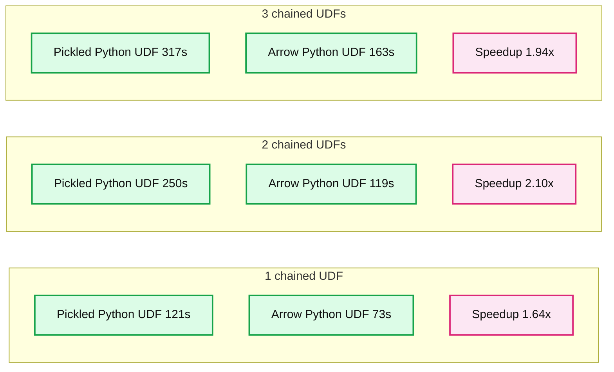
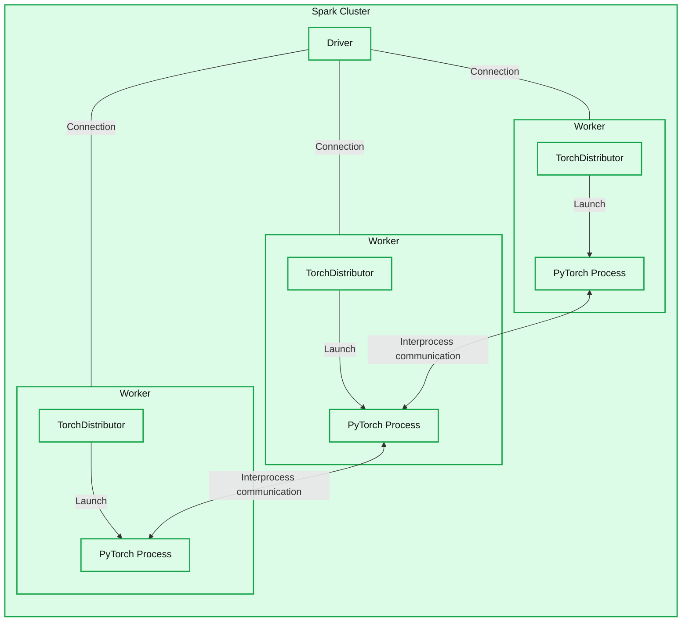

# PySpark in 2023: A Year in Review

- Source: https://www.databricks.com/blog/pyspark-2023-year-review
- Published: 2024-03-25
- Authors: Hyukjin Kwon, Takuya Ueshin, Allison Wang, Ruifeng Zheng, Xinrong Meng, Haejoon Lee, Amanda Liu
- Categories: industries, data-engineering, engineering
- Images: 2 total, 2 extracted as architecture

With the releases of Apache Spark 3.4 and 3.5 in 2023, we focused heavily on improving PySpark performance, flexibility, and ease of use. This blog post walks you through the key improvements.

Here's a rundown of some of the most important features added in Apache Spark 3.4 and 3.5 in 2023:

- [Spark Connect](https://www.databricks.com/blog/2022/07/07/introducing-spark-connect-the-power-of-apache-spark-everywhere.html) introduces a decoupled client-server architecture that permits remote connectivity to Spark clusters from any application. Thus, Spark as a service is enabled while also enhancing stability, upgradability, and observability.
- With [Arrow-optimized Python user-defined functions (UDFs)](https://www.databricks.com/blog/arrow-optimized-python-udfs-apache-sparktm-35), we leveraged the Arrow columnar format to double the performance of regular Python UDFs, demonstrating a leap forward in efficiency.
- With [Python user-defined table functions (UDTFs)](https://www.databricks.com/blog/introducing-python-user-defined-table-functions), users can now perform table-based transformations natively in PySpark.
- [New Spark SQL features](https://www.databricks.com/blog/databricks-sql-year-review-part-ii-sql-programming-features), such as GROUP BY ALL and ORDER BY ALL, were introduced; these can all be used natively from PySpark.
- [Python arbitrary stateful processing](https://www.databricks.com/blog/python-arbitrary-stateful-processing-structured-streaming) provides the ability to maintain arbitrary state in streaming queries.
- [TorchDistributor](https://www.databricks.com/blog/2023/04/20/pytorch-databricks-introducing-spark-pytorch-distributor.html) supports distributed PyTorch training on Apache Spark clusters.
- The [new testing API](https://www.databricks.com/blog/simplify-pyspark-testing-dataframe-equality-functions) enables effective testing of PySpark applications and helps developers produce high-quality code.
- The [English SDK](https://www.databricks.com/blog/introducing-english-new-programming-language-apache-spark) is an LLM-powered approach to programming that allows commands in plain English to be transformed into PySpark and SQL, thus boosting developer productivity.

In the following section, we'll examine each of these and provide pointers to some additional notable improvements.

## Apache Spark 3.5 and 3.4: Feature Deep Dives

### Spark Connect: Remote connectivity for Apache Spark

[Spark Connect](https://www.databricks.com/blog/2022/07/07/introducing-spark-connect-the-power-of-apache-spark-everywhere.html) debuted in Apache Spark 3.4, introducing a decoupled client-server architecture that enables remote connectivity to Spark clusters from any application running anywhere. This separation of the client and server allows modern data applications, IDEs, notebooks, and programming languages to access Spark interactively. Furthermore, the decoupled architecture improves stability, upgradability, debuggability, and observability.

In Apache Spark 3.5, Scala support was completed, as well as support for major Spark components such as Structured Streaming ([SPARK-42938](https://issues.apache.org/jira/browse/SPARK-42938)), ML and PyTorch ([SPARK-42471](https://issues.apache.org/jira/browse/SPARK-42471)), and the Pandas API on Spark ([SPARK-42497](https://issues.apache.org/jira/browse/SPARK-42497)).

Use [Databricks Connect](https://docs.databricks.com/en/dev-tools/databricks-connect/python/index.html) to get started with Spark Connect on Databricks or [Spark Connect](https://spark.apache.org/docs/latest/api/python/getting_started/quickstart_connect.html) directly for Apache Spark.

## Arrow-optimized Python UDFs: Boosting the performance of Python UDFs

[Arrow-optimized Python UDFs](https://www.databricks.com/blog/arrow-optimized-python-udfs-apache-sparktm-35) ([SPARK-40307](https://issues.apache.org/jira/browse/SPARK-40307)) enable substantial performance optimizations by leveraging the Arrow columnar format. For example, when chaining UDFs in the same cluster, Arrow-optimized Python UDFs execute ~1.9 times faster than pickled Python UDFs on a 32 GB dataset.

**Summary:** Arrow Python UDFs execute faster than Pickled Python UDFs for one, two, and three chained UDFs.

**Components:**
- Pickled Python UDF: blue bars representing Python UDF execution using pickle.
- Arrow Python UDF: orange bars representing Python UDF execution using Arrow.
- Execution time/s: vertical axis measuring execution time in seconds.
- Count of chained UDFs: horizontal axis indicating chain length.

**Flows:**
- none. No arrows are shown.

**Numbers:**
- 1 chained UDF: Pickled 121s, Arrow 73s, displayed speedup 1.64x.
- 2 chained UDFs: Pickled 250s, Arrow 119s, displayed speedup 2.10x.
- 3 chained UDFs: Pickled 317s, Arrow 163s, displayed speedup 1.94x.
- Execution time axis ticks in seconds: 0, 50, 100, 150, 200, 250, 300.

source image: https://www.databricks.com/sites/default/files/inline-images/db-892-blog-img-1.png

## Python UDTFs

In Apache Spark 3.5, we extended PySpark's UDF support with [user-defined table functions](https://www.databricks.com/blog/introducing-python-user-defined-table-functions), which return a table as output instead of a single scalar result value. Once registered, they can appear in the FROM clause of a SQL query. For example, the UDTF `SquareNumbers` outputs the inputs and their squared values as a table:

## New SQL Features

One of the major benefits of PySpark is that Spark SQL works seamlessly with PySpark DataFrames. In 2023, Spark SQL introduced many [new features](https://www.databricks.com/blog/databricks-sql-year-review-part-ii-sql-programming-features) that PySpark can leverage directly via `spark.sql,` such as `GROUP BY ALL and ORDER BY ALL,` general table-valued function support, `INSERT BY NAME, PIVOT` and `MELT`, ANSI compliance, and more. Here's an example of using `GROUP BY ALL` and `ORDER BY ALL`:

## Python arbitrary stateful processing

[Python arbitrary stateful operations in Structured Streaming](https://www.databricks.com/blog/python-arbitrary-stateful-processing-structured-streaming) unblock a massive number of real-time analytics and machine learning use cases in PySpark by allowing state processing across streaming query executions. The following example demonstrates arbitrary stateful processing:

## TorchDistributor: Native PyTorch Integration

[TorchDistributor](https://www.databricks.com/blog/2023/04/20/pytorch-databricks-introducing-spark-pytorch-distributor.html) provides native support in PySpark for PyTorch, which enables distributed training of deep learning models on Spark clusters. It starts the PyTorch processes and leaves it to PyTorch to work out the distribution mechanisms, acting just to ensure that the processes are coordinated.

**Summary:** A Spark cluster contains a driver connected to three workers, each running TorchDistributor and a PyTorch process, with communication between adjacent PyTorch processes.

**Components:**

- Spark Cluster: Apache Spark cluster enclosing all components.
- Driver: Spark driver.
- Worker, top: Spark worker containing TorchDistributor and a PyTorch process.
- TorchDistributor, top: PySpark component launching the top PyTorch process.
- PyTorch Process, top: PyTorch compute process.
- Worker, middle: Spark worker containing TorchDistributor and a PyTorch process.
- TorchDistributor, middle: PySpark component launching the middle PyTorch process.
- PyTorch Process, middle: PyTorch compute process.
- Worker, bottom: Spark worker containing TorchDistributor and a PyTorch process.
- TorchDistributor, bottom: PySpark component launching the bottom PyTorch process.
- PyTorch Process, bottom: PyTorch compute process.

**Flows:**

- Driver -> Worker, top: connection shown without an arrowhead or flow label.
- Driver -> Worker, middle: connection shown without an arrowhead or flow label.
- Driver -> Worker, bottom: connection shown without an arrowhead or flow label.
- TorchDistributor, top -> PyTorch Process, top: process launch.
- TorchDistributor, middle -> PyTorch Process, middle: process launch.
- TorchDistributor, bottom -> PyTorch Process, bottom: process launch.
- PyTorch Process, top -> PyTorch Process, middle: interprocess communication, payload unspecified.
- PyTorch Process, middle -> PyTorch Process, top: interprocess communication, payload unspecified.
- PyTorch Process, middle -> PyTorch Process, bottom: interprocess communication, payload unspecified.
- PyTorch Process, bottom -> PyTorch Process, middle: interprocess communication, payload unspecified.

**Numbers:** none

source image: https://www.databricks.com/sites/default/files/inline-images/db-892-blog-img-2.png

TorchDistributor is simple to use, with a few main settings to consider:

## Testing API: Easier Testing for PySpark DataFrames

The [new testing API](https://www.databricks.com/blog/simplify-pyspark-testing-dataframe-equality-functions) in the `pyspark.testing` package ([SPARK-44042](https://issues.apache.org/jira/browse/SPARK-44042)) brings significant enhancements for developers testing PySpark applications. It provides utility functions for equality tests, complete with detailed error messages, making identifying discrepancies in DataFrame schemas and data easier. The example output below illustrates:

## English SDK: English as a Programing Language

The [English SDK](https://www.databricks.com/blog/introducing-english-new-programming-language-apache-spark) for Apache Spark simplifies its use by enabling users to input commands in plain English and then convert them into PySpark and Spark SQL code. This makes PySpark programming more accessible, especially for code related to DataFrame transformation operations, data ingestion, and UDFs, and thanks to caching it further boosts productivity. The English SDK has great potential to streamline development processes, minimize code complexity, and expand the Spark community's reach. [Try it out](https://docs.databricks.com/en/dev-tools/sdk-english.html) yourself!

## Other Notable Improvements

Here are some of the other features introduced in Apache Spark 3.4 and 3.5 that you might want to explore if you aren't familiar with them already:

- [Parameterized queries with PySpark](https://www.databricks.com/blog/parameterized-queries-pyspark)
- SQL function parity: 150 new functions ([SPARK-43907](https://issues.apache.org/jira/browse/SPARK-43907)), including [sketch-based approximate distinct counting](https://www.databricks.com/blog/apache-spark-3-apache-datasketches-new-sketch-based-approximate-distinct-counting)
- [Lateral column alias](https://www.databricks.com/blog/introducing-support-lateral-column-alias) support
- Dropping duplicates within watermarks for easier deduplication ([SPARK-42931](https://issues.apache.org/jira/browse/SPARK-42931))
- [DeepSpeed Distributor](https://community.databricks.com/t5/technical-blog/introducing-the-deepspeed-distributor-on-databricks/ba-p/59641)
- Advanced job cancellation API ([SPARK-44194](https://issues.apache.org/jira/browse/SPARK-44194))
- [Python memory profilers](https://www.databricks.com/blog/2022/11/30/memory-profiling-pyspark.html)
- Better autocompletion in IPython ([SPARK-43892](https://issues.apache.org/jira/browse/SPARK-43892))
- Documentation improvements ([SPARK-42374](https://issues.apache.org/jira/browse/SPARK-42374), [SPARK-42493](https://issues.apache.org/jira/browse/SPARK-42493), and [SPARK-42642](https://issues.apache.org/jira/browse/SPARK-42642))

## Reflections and the Road Ahead

In 2023, vibrant innovation from the open-source community significantly enriched both PySpark and Apache Spark, broadening the toolkits available for data professionals and streamlining analytics workflows. With Apache Spark 4.0 on the horizon, PySpark is poised to further revolutionize data processing through new features and enhanced performance, reaffirming its commitment to advancing data analytics within the data engineering and data science community.

## Getting Started with the New Features

This post provided a quick overview of the most significant improvements made in Apache Spark 3.4 and 3.5 in 2023 to enhance the ease of use, performance, and flexibility of PySpark. All of these features are available in Databricks Runtime 13 and 14—why not try some of them out for yourself today?
